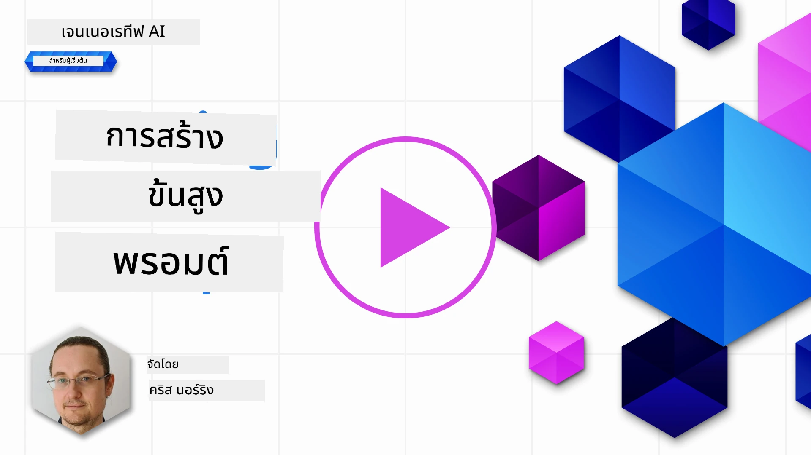

# การสร้างพรอมต์ขั้นสูง

[](https://youtu.be/BAjzkaCdRok?si=NmUIyRf7-cDgbjtt)

มาทบทวนสิ่งที่เราได้เรียนรู้จากบทก่อนหน้านี้:

> การ _ออกแบบพรอมต์_ คือกระบวนการที่เรา **ชี้นำโมเดลไปสู่การตอบกลับที่เกี่ยวข้องมากขึ้น** โดยการให้คำสั่งหรือบริบทที่มีประโยชน์มากขึ้น

ยังมีสองขั้นตอนในการเขียนพรอมต์: การสร้างพรอมต์ โดยการให้บริบทที่เกี่ยวข้อง และ _การปรับแต่ง_ วิธีการปรับปรุงพรอมต์อย่างเป็นขั้นตอน

ในจุดนี้ เรามีความเข้าใจพื้นฐานเกี่ยวกับการเขียนพรอมต์แล้ว แต่เราต้องลึกลงไปอีก ในบทนี้ คุณจะเปลี่ยนจากการลองพรอมต์ต่างๆ ไปสู่การเข้าใจว่าทำไมพรอมต์หนึ่งถึงดีกว่าพรอมต์อื่น คุณจะได้เรียนรู้วิธีการสร้างพรอมต์โดยใช้เทคนิคพื้นฐานบางอย่างที่สามารถประยุกต์ใช้กับ LLM ใดก็ได้

## แนะนำ

ในบทนี้ เราจะครอบคลุมหัวข้อต่อไปนี้:

- ขยายความรู้ของคุณเกี่ยวกับการออกแบบพรอมต์โดยการประยุกต์ใช้เทคนิคต่างๆ กับพรอมต์ของคุณ
- การตั้งค่าพรอมต์ของคุณเพื่อให้มีการเปลี่ยนแปลงผลลัพธ์

## เป้าหมายการเรียนรู้

หลังจากทำบทเรียนนี้เสร็จ คุณจะสามารถ:

- ประยุกต์ใช้เทคนิคการออกแบบพรอมต์ที่ช่วยปรับปรุงผลลัพธ์ของพรอมต์ของคุณ
- การทำพรอมต์ทั้งแบบที่ผลลัพธ์แตกต่างกันหรือตายตัวได้

## การออกแบบพรอมต์

การออกแบบพรอมต์คือกระบวนการสร้างพรอมต์ที่จะให้ผลลัพธ์ตามที่ต้องการ มีมากกว่าการเขียนพรอมต์ข้อความธรรมดา การออกแบบพรอมต์ไม่ใช่วิชาช่างวิศวกรรม แต่เป็นชุดเทคนิคที่คุณสามารถใช้เพื่อให้ได้ผลลัพธ์ที่ต้องการ

### ตัวอย่างของพรอมต์

ลองดูพรอมต์พื้นฐานนี้:

> สร้างคำถาม 10 ข้อเกี่ยวกับภูมิศาสตร์

ในพรอมต์นี้ คุณกำลังใช้ชุดเทคนิคพรอมต์ต่าง ๆ

มาวิเคราะห์กัน:

- **บริบท** คุณระบุว่าควรเป็นเรื่อง "ภูมิศาสตร์"
- **จำกัดผลลัพธ์** คุณต้องการไม่เกิน 10 คำถาม

### ข้อจำกัดของการทำพรอมต์แบบง่าย

คุณอาจจะได้ผลลัพธ์ที่ต้องการหรือไม่ก็ได้ คุณจะได้คำถามออกมา แต่ภูมิศาสตร์เป็นหัวข้อที่ใหญ่มาก และคุณอาจไม่ได้สิ่งที่ต้องการด้วยเหตุผลต่อไปนี้:

- **หัวข้อใหญ่** คุณไม่รู้ว่ามันจะเป็นเรื่องประเทศ เมืองหลวง แม่น้ำ หรือสิ่งอื่น ๆ
- **รูปแบบ** ถ้าคุณต้องการให้คำถามมีรูปแบบแบบใดแบบหนึ่งล่ะ?

อย่างที่เห็น มีหลายอย่างที่ต้องพิจารณาเมื่อสร้างพรอมต์

จนถึงตอนนี้ เราเห็นตัวอย่างพรอมต์ง่าย ๆ แต่ AI สร้างสรรค์สามารถทำได้มากกว่านั้นเพื่อช่วยเหลือผู้คนในบทบาทและอุตสาหกรรมที่หลากหลาย มาดูเทคนิคพื้นฐานกันต่อ

### เทคนิคสำหรับการทำพรอมต์

ก่อนอื่น เราต้องเข้าใจว่าการทำพรอมต์เป็นคุณสมบัติ _ที่เกิดขึ้น_ ของ LLM ซึ่งหมายความว่านี่ไม่ใช่ฟีเจอร์ที่ฝังในโมเดลแต่เป็นสิ่งที่เราค้นพบเมื่อเราใช้โมเดล

มีเทคนิคพื้นฐานบางอย่างที่เราใช้เพื่อทำพรอมต์ LLM ลองมาดูกัน

- **พรอมต์แบบไม่มีตัวอย่าง (Zero-shot prompting)** คือรูปแบบพื้นฐานที่สุด เป็นพรอมต์เดียวที่ขอคำตอบจาก LLM โดยอิงเฉพาะจากข้อมูลการฝึกเท่านั้น
- **พรอมต์แบบมีตัวอย่าง (Few-shot prompting)** เทคนิคนี้แนะนำ LLM โดยการให้ตัวอย่าง 1 ตัวหรือมากกว่าที่มันใช้ในการสร้างคำตอบ
- **โซ่ความคิด (Chain-of-thought)** เทคนิคนี้สอน LLM ให้แบ่งปัญหาเป็นขั้นตอน
- **ความรู้ที่สร้างขึ้น (Generated knowledge)** เพื่อปรับปรุงคำตอบของพรอมต์ คุณสามารถเพิ่มข้อเท็จจริงหรือความรู้ที่สร้างขึ้นเข้าไปในพรอมต์ของคุณ
- **น้อยไปมาก (Least to most)** เช่นเดียวกับโซ่ความคิด เทคนิคนี้เกี่ยวกับการแบ่งปัญหาเป็นชุดของขั้นตอน แล้วขอให้ทำตามลำดับ
- **การปรับปรุงตัวเอง (Self-refine)** เทคนิคนี้เกี่ยวกับการวิจารณ์ผลลัพธ์ของ LLM แล้วขอให้มันปรับปรุง
- **พรอมต์แนวมไอยูติก (Maieutic prompting)** คุณต้องการให้ LLM ตอบอย่างถูกต้องและขอให้มันอธิบายส่วนต่าง ๆ ของคำตอบ นี่เป็นหนึ่งในรูปแบบของการปรับปรุงตัวเอง

### พรอมต์แบบไม่มีตัวอย่าง (Zero-shot prompting)

สไตล์นี้ของการทำพรอมต์ง่ายมาก ประกอบด้วยพรอมต์เดียว เทคนิคนี้น่าจะเป็นสิ่งที่คุณใช้เมื่อเริ่มเรียนรู้เกี่ยวกับ LLM ดังตัวอย่างนี้:

- พรอมต์: "พีชคณิตคืออะไร?"
- คำตอบ: "พีชคณิตเป็นแขนงหนึ่งของคณิตศาสตร์ที่ศึกษาสัญลักษณ์ทางคณิตศาสตร์และกฎในการจัดการสัญลักษณ์เหล่านี้"

### พรอมต์แบบมีตัวอย่าง (Few-shot prompting)

สไตล์นี้ช่วยโมเดลโดยให้ตัวอย่างไม่กี่ตัวพร้อมคำขอ ประกอบด้วยพรอมต์เดียวกับข้อมูลเฉพาะของงานเสริม เช่น:

- พรอมต์: "เขียนบทกวีในสไตล์ของเชคสเปียร์ นี่คือตัวอย่างซอนเน็ตของเชคสเปียร์:
  ซอนเน็ต 18: 'ข้าควรเปรียบเจ้าเป็นวันฤดูร้อนหรือ? เจ้ามีความงามและอ่อนโยนมากกว่า...'
  ซอนเน็ต 116: 'อย่าให้ข้าขัดขวางการแต่งงานของใจที่แท้จริง รักไม่ใช่รักที่ผันแปรเมื่อพบความเปลี่ยนแปลง...'
  ซอนเน็ต 132: 'ข้ารักดวงตาเจ้าที่เห็นใจข้า รู้ว่าใจเจ้าทรมานข้าด้วยการดูถูก,...'
  ตอนนี้ เขียนซอนเน็ตเกี่ยวกับความงามของดวงจันทร์"
- คำตอบ: "บนท้องฟ้า ดวงจันทร์ส่องแสงนุ่มนวล ในแสงสีเงินที่ส่งเสริมความงดงาม..."

ตัวอย่างช่วยให้ LLM มีบริบท รูปแบบ หรือสไตล์ของผลลัพธ์ที่ต้องการ ช่วยให้โมเดลเข้าใจงานเฉพาะและสร้างคำตอบที่แม่นยำและเกี่ยวข้องมากขึ้น

### โซ่ความคิด (Chain-of-thought)

โซ่ความคิดเป็นเทคนิคที่น่าสนใจมากเพราะมันให้ LLM ผ่านชุดของขั้นตอน แนวคิดคือแนะนำ LLM ให้เข้าใจวิธีทำบางอย่าง ลองดูตัวอย่างนี้ กับการไม่มีและมีโซ่ความคิด:

    - พรอมต์: "อลิซมีแอปเปิล 5 ลูก โยน 3 ลูก ให้ 2 ลูกกับบ็อบ และบ็อบคืน 1 ลูก อลิซมีแอปเปิลกี่ลูก?"
    - คำตอบ: 5

LLM ตอบ 5 ซึ่งไม่ถูกต้อง คำตอบที่ถูกต้องคือ 1 ลูก ตามการคำนวณ (5 -3 -2 + 1 = 1)

แล้วเราจะสอน LLM ทำอย่างถูกต้องได้อย่างไร?

ลองใช้โซ่ความคิด การใช้โซ่ความคิดหมายถึง:

1. ให้ LLM ตัวอย่างที่คล้ายกัน
2. แสดงการคำนวณและวิธีคำนวณที่ถูกต้อง
3. ให้พรอมต์เดิม

ดังนี้:

- พรอมต์: "ลิซ่ามีแอปเปิล 7 ลูก โยน 1 ลูก ให้แบร์ต 4 ลูก และแบร์ตคืน 1 ลูก:
  7 -1 = 6
  6 -4 = 2
  2 +1 = 3  
  อลิซมีแอปเปิล 5 ลูก โยน 3 ลูก ให้ 2 ลูกกับบ็อบ และบ็อบคืน 1 ลูก อลิซมีแอปเปิลกี่ลูก?"
  คำตอบ: 1

สังเกตว่าพรอมต์นี้เป็นข้อความยาวกว่ามาก มีตัวอย่างอื่น การคำนวณ และพรอมต์เดิม และเราได้คำตอบที่ถูกต้องคือ 1

อย่างที่เห็น โซ่ความคิดเป็นเทคนิคที่ทรงพลังมาก

### ความรู้ที่สร้างขึ้น (Generated knowledge)

บ่อยครั้งเวลาคุณต้องการสร้างพรอมต์ คุณต้องการใช้ข้อมูลของบริษัทของคุณเอง คุณอยากให้ส่วนหนึ่งของพรอมต์มาจากบริษัท และอีกส่วนเป็นพรอมต์ที่คุณสนใจจริงๆ

ตัวอย่างเช่น นี่คือวิธีที่พรอมต์ของคุณอาจดูถ้าคุณอยู่ในธุรกิจประกันภัย:

```text
{{company}}: {{company_name}}
{{products}}:
{{products_list}}
Please suggest an insurance given the following budget and requirements:
Budget: {{budget}}
Requirements: {{requirements}}
```

ด้านบน คุณจะเห็นว่าพรอมต์ถูกสร้างขึ้นโดยใช้แม่แบบ ในแม่แบบจะมีตัวแปรจำนวนหนึ่งที่เขียนว่า `{{variable}}` ซึ่งจะถูกแทนที่ด้วยค่าจริงจาก API ของบริษัท

นี่คือตัวอย่างว่าพรอมต์จะดูเป็นอย่างไรเมื่อแทนที่ตัวแปรด้วยเนื้อหาจากบริษัทของคุณ:

```text
Insurance company: ACME Insurance
Insurance products (cost per month):
- Car, cheap, 500 USD
- Car, expensive, 1100 USD
- Home, cheap, 600 USD
- Home, expensive, 1200 USD
- Life, cheap, 100 USD

Please suggest an insurance given the following budget and requirements:
Budget: $1000
Requirements: Car, Home, and Life insurance
```

การส่งพรอมต์นี้เข้า LLM จะสร้างคำตอบแบบนี้:

```output
Given the budget and requirements, we suggest the following insurance package from ACME Insurance:
- Car, cheap, 500 USD
- Home, cheap, 600 USD
- Life, cheap, 100 USD
Total cost: $1,200 USD
```

อย่างที่เห็น มันยังแนะนำประกันชีวิต ซึ่งไม่ควรเป็นแบบนั้น ผลลัพธ์นี้แสดงว่าเราต้องปรับแต่งพรอมต์โดยเปลี่ยนมันให้ชัดเจนขึ้นว่าควรอนุญาตอะไร หลังจากลองผิดลองถูก เราได้พรอมต์นี้:

```text
Insurance company: ACME Insurance
Insurance products (cost per month):
- type: Car, cheap, cost: 500 USD
- type: Car, expensive, cost: 1100 USD
- type: Home, cheap, cost: 600 USD
- type: Home, expensive, cost: 1200 USD
- type: Life, cheap, cost: 100 USD

Please suggest an insurance given the following budget and requirements:
Budget: $1000 restrict choice to types: Car, Home
```

สังเกตว่าการเพิ่ม _type_ และ _cost_ รวมถึงใช้คำว่า _restrict_ ช่วยให้ LLM เข้าใจว่าเราต้องการอะไร

ตอนนี้เราได้รับคำตอบนี้:

```output
Given the budget and requirements, we suggest the Car, Cheap insurance product which costs 500 USD per month.
```

ประเด็นของตัวอย่างนี้คือแสดงว่าแม้จะใช้เทคนิคง่าย ๆ อย่าง _generated knowledge_ เรายังต้องปรับแต่งพรอมต์ในหลายกรณีเพื่อให้ได้ผลลัพธ์ที่ต้องการ

### น้อยไปมาก (Least-to-most)

แนวคิดของการทำพรอมต์แบบ Least-to-most คือการแบ่งปัญหาใหญ่เป็นปัญหาย่อย เพื่อช่วยชี้นำ LLM ว่าจะ "พิชิต" ปัญหาใหญ่นั้นอย่างไร ตัวอย่างที่ดีอาจเป็นด้านวิทยาศาสตร์ข้อมูล ที่คุณสามารถถาม LLM ให้แบ่งปัญหาแบบนี้:

> พรอมต์: ทำวิทยาศาสตร์ข้อมูลใน 5 ขั้นตอนอย่างไร?

ผู้ช่วย AI ของคุณจะตอบว่า:

1. รวบรวมข้อมูล
1. ทำความสะอาดข้อมูล
1. วิเคราะห์ข้อมูล
1. สร้างกราฟข้อมูล
1. นำเสนอข้อมูล

### การปรับปรุงตัวเอง, วิจารณ์ผลลัพธ์

กับ Generative AI และ LLM คุณไม่สามารถไว้วางใจผลลัพธ์โดยตรงได้ คุณต้องตรวจสอบมัน ท้ายที่สุด LLM คือการนำเสนอสิ่งที่น่าจะเป็นข้อความต่อไปที่ถูกต้องมากที่สุด ไม่ใช่สิ่งที่ถูกต้อง ดังนั้น แนวคิดที่ดีคือให้ LLM วิจารณ์ตัวเอง ซึ่งนำไปสู่เทคนิคการปรับปรุงตัวเอง

วิธีทำคือ:

1. พรอมต์เริ่มต้นขอให้ LLM แก้ปัญหา
2. LLM ตอบ
3. คุณวิจารณ์คำตอบและขอให้ AI ปรับปรุง
4. LLM ตอบอีกครั้ง โดยพิจารณาการวิจารณ์และแนะนำวิธีแก้ไข

คุณสามารถทำซ้ำกระบวนการนี้ได้กี่ครั้งก็ได้ตามต้องการ

นี่คือตัวอย่างการใช้เทคนิคนี้:

> พรอมต์: "สร้าง Python Web API ที่มี routes สำหรับ products และ customers"

คำตอบจาก AI:

```python
import flask
app = Flask(__name__)

@app.route('/products')
def products():
    return 'Products'

@app.route('/customers')
def customers():
    return 'Customers'
```

> พรอมต์: แนะนำการปรับปรุง 3 อย่างสำหรับโค้ดด้านบน

คำตอบจาก AI:

```text
Sure, here are three suggestions to improve the code:

Import the correct module: The first line should import Flask instead of flask. The correct import statement should be from flask import Flask.

Add a main function: Add a if __name__ == '__main__': block to the end of the file to run the application when the file is executed.

Use f-strings: Use f-strings to format the return statements in the route functions. For example, return 'Products' can be changed to return f'This is the {request.path} page'.
```

```python
from flask import Flask, request

app = Flask(__name__)

@app.route('/products')
def products():
    return f'This is the {request.path} page'

@app.route('/customers')
def customers():
    return f'This is the {request.path} page'

if __name__ == '__main__':
    app.run()
```

อย่างที่คุณเห็น คำตอบ AI ข้างต้นกำลังปรับปรุงโค้ดตามคำแนะนำครั้งแรกด้วยการวิจารณ์คำตอบแรก

### พรอมต์แนวมไอยูติก (Maieutic prompting)

พรอมต์แบบมไอยูติกเป็นเทคนิคที่คล้ายกับการปรับปรุงตัวเอง แต่มากกว่าคือขอให้ LLM อธิบายตัวเอง เป้าหมายคือเพื่อลดความไม่สอดคล้องในคำตอบของ LLM เพื่อให้มั่นใจว่าคำตอบถูกต้อง เวิร์กโฟลว์คือ:

1. ขอให้ LLM ตอบคำถาม
2. สำหรับแต่ละส่วนของคำตอบ ขอให้ LLM อธิบายอย่างละเอียดมากขึ้น
3. ถ้ามีความไม่สอดคล้อง ให้ทิ้งส่วนที่ไม่สอดคล้องเหล่านั้น

ทำซ้ำข้อ 2 และ 3 จนผ่านทุกส่วนและพอใจกับคำตอบ

นี่คือตัวอย่างพรอมต์:

> พรอมต์: ฉันวางแผนวิกฤติเพื่อลดผลกระทบของโรคระบาดอย่างไรใน 5 ขั้นตอน?
> คำตอบจาก LLM:

```text
1. Identify the risks
1. Identify the stakeholders
1. Identify the resources
1. Identify the actions
1. Identify the communication channels
```

มันระบุ 5 ขั้นตอน แต่เราจะตรวจสอบได้ยังไงว่านี่ถูกต้อง? ขอให้ LLM อธิบายแต่ละขั้นตอน:

> พรอมต์: อธิบายขั้นตอนแรกให้ละเอียดขึ้น ความเสี่ยงในโรคระบาดคืออะไร?

```text
The risks are the following:

- Loss of life
- Loss of business
- Loss of reputation
- Loss of customers
- Loss of employees
```

ตอนนี้ เราต้องการแน่ใจว่า LLM ถูกต้อง จึงขอให้มันอธิบายความเสี่ยงแรกให้ละเอียดขึ้นและหวังว่าจะสอดคล้องกับคำตอบก่อนหน้า:

> พรอมต์: ในโรคระบาด ความเสี่ยงที่ใหญ่ที่สุดคืออะไรและเพราะอะไร?

```text
The biggest risk is loss of life because it's the most important thing to protect.
```

> ความเสี่ยงที่ใหญ่ที่สุดสองอย่างในโรคระบาดคืออะไร?

```text
The two biggest risks are loss of life and loss of business.
```

ตอนนี้ LLM สอดคล้องและกล่าวถึง "ชีวิต" และ "ธุรกิจ" เป็นความเสี่ยงอันดับสองที่ใหญ่ที่สุด เราสามารถดำเนินการต่อไปยังขั้นตอนถัดไปและรู้สึกมั่นใจได้ อย่างไรก็ตาม เราไม่ควรไว้วางใจ LLM อย่างไร้ขีดจำกัด ควรตรวจสอบผลลัพธ์เสมอ

## เปลี่ยนแปลงผลลัพธ์ของคุณ

LLM มีลักษณะไม่ตายตัว หมายความว่าคุณจะได้ผลลัพธ์ที่แตกต่างกันทุกครั้งที่ใช้พรอมต์เดิม ลองพรอมต์นี้ดูตัวอย่าง:

> "สร้างโค้ดสำหรับ Python Web API"

```python
# นำเข้ามอดูลที่จำเป็น
import flask
from flask import request, jsonify

# สร้างแอป Flask
app = flask.Flask(__name__)

# สร้างเส้นทางสำหรับ API
@app.route('/api', methods=['GET'])
def api():
    # ดึงข้อมูลจากคำขอ
    data = request.args

    # ประมวลผลข้อมูล
    result = process_data(data)

    # ส่งผลลัพธ์กลับเป็น JSON
    return jsonify(result)

# ฟังก์ชันสำหรับประมวลผลข้อมูล
def process_data(data):
    # ทำบางอย่างกับข้อมูล
    result = data + 1

    # ส่งผลลัพธ์กลับ
    return result

# เรียกใช้งานแอป
if __name__ == '__main__':
    app.run()

```

การรันพรอมต์เดียวกันอีกครั้งจะได้คำตอบที่แตกต่างเล็กน้อย:

```python
#นำเข้าชุดแพ็กเกจที่จำเป็น
import flask
from flask import request, jsonify

#สร้างแอปพลิเคชัน Flask
app = flask.Flask(__name__)
app.config["DEBUG"] = True

#สร้างรายการหนังสือ
books = [
    {'id': 0,
     'title': 'A Fire Upon the Deep',
     'author': 'Vernor Vinge',
     'first_sentence': 'The coldsleep itself was dreamless.',
     'year_published': '1992'},
    {'id': 1,
     'title': 'The Ones Who Walk Away From Omelas',
     'author': 'Ursula K. Le Guin',
     'first_sentence': 'With a clamor of bells that set the swallows soaring, the Festival of Summer came to the city Omelas, bright-towered by the sea.',
     'published': '1973'},
    {'id': 2,
     'title': 'Dhalgren',
     'author': 'Samuel R. Delany',
     'first_sentence': 'to wound the autumnal city.',
     'published': '1975'}
]

#สร้าง endpoint สำหรับ API
@app.route('/', methods=['GET'])
def home():
    return '''<h1>Books API</h1>
<p>A prototype API for retrieving books.</p>'''

#สร้าง endpoint เพื่อส่งคืนหนังสือทั้งหมด
@app.route('/api/v1/resources/books/all', methods=['GET'])
def api_all():
    return jsonify(books)

#สร้าง endpoint เพื่อส่งคืนหนังสือเล่มเดียว
@app.route('/api/v1/resources/books', methods=['GET'])
def api_id():
    #ตรวจสอบว่ามีการระบุ ID เป็นส่วนหนึ่งของ URL หรือไม่
    #หากมีการระบุ ID ให้กำหนดค่าให้ตัวแปร
    #หากไม่มีการระบุ ID ให้แสดงข้อผิดพลาด
    if 'id' in request.args:
        id = int(request.args['id'])
    else:
        return "Error: No id field provided. Please specify an id."

    #สร้างรายการว่างสำหรับผลลัพธ์ของเรา
    results = []

    #วนลูปผ่านข้อมูลและจับคู่ผลลัพธ์ที่ตรงกับ ID ที่ร้องขอ
    #ID มีความเฉพาะเจาะจง แต่ฟิลด์อื่นอาจส่งคืนผลลัพธ์หลายรายการ
    for book in books:
        if book['id'] == id:
            results.append(book)

    #ใช้ฟังก์ชัน jsonify จาก Flask เพื่อแปลงรายการของเรา
    #พจนานุกรม Python เป็นรูปแบบ JSON
    return jsonify(results)

app.run()
```

> แล้วผลลัพธ์ที่แตกต่างกันนี่เป็นปัญหาไหม?

ขึ้นอยู่กับสิ่งที่คุณกำลังทำ ถ้าคุณต้องการคำตอบเฉพาะเจาะจง ก็เป็นปัญหา แต่ถ้าคุณโอเคกับผลลัพธ์ที่แตกต่าง เช่น "สร้างคำถามภูมิศาสตร์ 3 ข้อที่แตกต่างกัน" ก็ไม่ใช่ปัญหา

### การใช้ temperature เพื่อเปลี่ยนผลลัพธ์ของคุณ

โอเค เราตัดสินใจว่าต้องการจำกัดผลลัพธ์ให้คาดเดาได้มากขึ้น การตั้งค่าแบบตายตัวมากขึ้น ทำอย่างไร?

Temperature คือค่าระหว่าง 0 ถึง 1 โดย 0 คือค่าที่ตายตัวที่สุด และ 1 คือค่าที่เปลี่ยนแปลงมากที่สุด ค่าปริยายคือ 0.7 มาดูสิ่งที่จะเกิดขึ้นเมื่อรันพรอมต์เดียวกันสองรอบ โดยตั้ง temperature เป็น 0.1:

> "สร้างโค้ดสำหรับ Python Web API"

```python
#นำเข้าห้องสมุดที่จำเป็น
import flask
from flask import request, jsonify

#สร้างอินสแตนซ์ของคลาส Flask
app = flask.Flask(__name__)

#สร้างจุดสิ้นสุดสำหรับ API
@app.route('/api/v1/endpoint', methods=['GET'])
def api_endpoint():
    #รับข้อมูลคำขอ
    data = request.get_json()

    #ประมวลผลข้อมูล
    result = process_data(data)

    #ส่งคืนผลลัพธ์
    return jsonify(result)

#ฟังก์ชันสำหรับประมวลผลข้อมูล
def process_data(data):
    #ประมวลผลข้อมูล
    result = {'result': 'success'}

    #ส่งคืนผลลัพธ์
    return result

#รันแอป Flask
if __name__ == '__main__':
    app.run()

```

การรันพรอมต์ซ้ำอีกครั้งได้ผลลัพธ์นี้:

```python
#นำเข้าห้องสมุดที่จำเป็น
import flask
from flask import request, jsonify

#สร้างแอป Flask
app = flask.Flask(__name__)

#สร้างเส้นทางสำหรับ API
@app.route('/api', methods=['GET'])
def api_call():
    #รับข้อมูลจากคำขอ
    data = request.get_json()

    #ประมวลผลข้อมูล
    result = process_data(data)

    #ส่งกลับผลลัพธ์
    return jsonify(result)

#กำหนดฟังก์ชัน process_data
def process_data(data):
    #ทำบางอย่างกับข้อมูล
    result = data + 1

    #ส่งกลับผลลัพธ์
    return result

#รันแอป
if __name__ == '__main__':
    app.run()

```

มีความแตกต่างแค่เล็กน้อยระหว่างสองคำตอบนี้ ลองทำตรงกันข้ามโดยกำหนด temperature เป็น 0.9:

```python
# นำเข้าห้องสมุดที่จำเป็น
import flask
from flask import request, jsonify

# สร้างแอป Flask
app = flask.Flask(__name__)

# สร้างเส้นทางสำหรับ API
@app.route('/api', methods=['GET'])
def api_call():
    # รับข้อมูลจากคำขอ
    data = request.args

    # ประมวลผลข้อมูล
    result = process_data(data)

    # ส่งผลลัพธ์กลับ
    return jsonify(result)

# ฟังก์ชันสำหรับประมวลผลข้อมูล
def process_data(data):
    # ทำบางอย่างกับข้อมูล
    result = data + 1

    # ส่งผลลัพธ์กลับ
    return result

# รันแอป
if __name__ == '__main__':
    app.run()

```

และความพยายามที่สองด้วย temperature 0.9:

```python
import flask
from flask import request, jsonify

# สร้างแอป Flask
app = flask.Flask(__name__)
app.config['DEBUG'] = True

# สร้างข้อมูลทดสอบบางส่วน
books = [
    {'id': 0, 'title': 'A Fire Upon The Deep', 'author': 'Vernor Vinge', 'first_sentence': 'The coldsleep itself was dreamless.', 'year_published': '1992'},
    {'id': 1, 'title': 'The Ones Who Walk Away From Omelas', 'author': 'Ursula K. Le Guin', 'first_sentence': 'With a clamor of bells that set the swallows soaring, the Festival of Summer came to the city Omelas, bright-towered by the sea.', 'published': '1973'},
    {'id': 2, 'title': 'Dhalgren', 'author': 'Samuel R. Delany', 'first_sentence': 'to wound the autumnal city.', 'published': '1975'}
]

# สร้างจุดสิ้นสุด (endpoint)
@app.route('/', methods=['GET'])
def home():
    return '''<h1>Welcome to our book API!</h1>'''

@app.route('/api/v1/resources/books

```

อย่างที่เห็น ผลลัพธ์ต่างกันอย่างมากเลยทีเดียว
> โปรดทราบว่ามีพารามิเตอร์อื่น ๆ ที่คุณสามารถเปลี่ยนแปลงเพื่อให้ได้ผลลัพธ์ที่แตกต่าง เช่น top-k, top-p, repetition penalty, length penalty และ diversity penalty แต่สิ่งเหล่านี้อยู่นอกเหนือขอบเขตของหลักสูตรนี้

## แนวทางปฏิบัติที่ดี

มีแนวทางปฏิบัติหลายอย่างที่คุณสามารถนำไปใช้เพื่อพยายามให้ได้สิ่งที่คุณต้องการ คุณจะพบสไตล์ของตัวเองเมื่อใช้ prompting มากขึ้นเรื่อยๆ

นอกจากนี้กับเทคนิคที่เราได้กล่าวถึง ยังมีแนวทางปฏิบัติที่ดีที่ควรพิจารณาเมื่อ prompting LLM

นี่คือแนวทางปฏิบัติที่ดีที่ควรพิจารณา:

- **ระบุบริบท** บริบทมีความสำคัญ ยิ่งคุณระบุได้มาก เช่น โดเมน หัวข้อ ฯลฯ ก็ยิ่งดีขึ้น
- จำกัดผลลัพธ์ หากคุณต้องการจำนวนรายการเฉพาะหรือความยาวเฉพาะ ให้ระบุไว้
- **ระบุทั้งสิ่งที่ต้องการและวิธีการ** จำไว้ว่าควรกล่าวถึงทั้งสิ่งที่คุณต้องการและวิธีที่คุณต้องการ เช่น "สร้าง Python Web API ที่มีเส้นทาง products และ customers แยกเป็น 3 ไฟล์"
- **ใช้แม่แบบ** บ่อยครั้งคุณต้องการเติมข้อมูลใน prompt ด้วยข้อมูลจากบริษัทของคุณ ใช้แม่แบบเพื่อทำสิ่งนี้ แม่แบบสามารถมีตัวแปรที่คุณแทนที่ด้วยข้อมูลจริง
- **สะกดคำให้ถูกต้อง** LLM อาจให้คำตอบที่ถูกต้อง แต่ถ้าคุณสะกดคำถูกต้อง คุณจะได้รับคำตอบที่ดียิ่งขึ้น

## แบบฝึกหัด

นี่คือโค้ด Python ที่แสดงวิธีสร้าง API ง่ายๆ โดยใช้ Flask:

```python
from flask import Flask, request

app = Flask(__name__)

@app.route('/')
def hello():
    name = request.args.get('name', 'World')
    return f'Hello, {name}!'

if __name__ == '__main__':
    app.run()
```

ใช้ผู้ช่วย AI เช่น GitHub Copilot หรือ ChatGPT และใช้เทคนิค "self-refine" เพื่อปรับปรุงโค้ดนี้

## แนวทางแก้ปัญหา

โปรดลองแก้ไขแบบฝึกหัดโดยเพิ่ม prompt ที่เหมาะสมลงในโค้ด

> [!TIP]
> ลองเขียน prompt เพื่อขอให้ปรับปรุง เป็นความคิดที่ดีที่จะจำกัดจำนวนการปรับปรุงที่ต้องการ คุณยังสามารถขอให้ปรับปรุงในแง่มุมใดแง่มุมหนึ่ง เช่น สถาปัตยกรรม ประสิทธิภาพ ความปลอดภัย เป็นต้น

[Solution](../../../05-advanced-prompts/python/aoai-solution.py)

## ตรวจสอบความรู้

ทำไมฉันถึงใช้ chain-of-thought prompting? แสดงคำตอบที่ถูกต้อง 1 ข้อ และคำตอบที่ไม่ถูกต้อง 2 ข้อ

1. เพื่อสอน LLM ว่าจะแก้ปัญหาอย่างไร
1. ข้อ B, เพื่อสอน LLM ให้หาข้อผิดพลาดในโค้ด
1. ข้อ C, เพื่อสั่งให้ LLM คิดค้นวิธีแก้ปัญหาหลายวิธี

ตอบ: 1 เพราะ chain-of-thought คือการแสดงให้ LLM เห็นวิธีแก้ปัญหาโดยการให้ขั้นตอนต่าง ๆ และปัญหาคล้าย ๆ กันพร้อมกับวิธีแก้ปัญหา

## 🚀 ความท้าทาย

คุณเพิ่งใช้เทคนิค self-refine ในแบบฝึกหัดนี้ เลือกโปรแกรมที่คุณสร้างขึ้นมาแล้วพิจารณาว่าคุณอยากปรับปรุงอะไรบ้าง จากนั้นใช้เทคนิค self-refine เพื่อปรับใช้การเปลี่ยนแปลงที่เสนอ คุณคิดว่าผลลัพธ์เป็นอย่างไร ดีกว่าหรือแย่กว่า?

## ยอดเยี่ยม! เรียนรู้ต่อได้เลย

หลังจากเรียนบทนี้เสร็จแล้ว ตรวจสอบคอลเลกชัน [Generative AI Learning](https://aka.ms/genai-collection?WT.mc_id=academic-105485-koreyst) เพื่อพัฒนาความรู้เกี่ยวกับ Generative AI ให้สูงขึ้นไปอีก!

ไปที่บทที่ 6 ที่เราจะใช้ความรู้เกี่ยวกับ Prompt Engineering โดยการ [สร้างแอปสร้างข้อความ](../06-text-generation-apps/README.md?WT.mc_id=academic-105485-koreyst)

---

<!-- CO-OP TRANSLATOR DISCLAIMER START -->
**ปฏิเสธความรับผิดชอบ**:
เอกสารนี้ได้รับการแปลโดยใช้บริการแปลภาษา AI [Co-op Translator](https://github.com/Azure/co-op-translator) ขณะที่เราพยายามให้ความถูกต้อง โปรดทราบว่าการแปลโดยอัตโนมัติอาจมีข้อผิดพลาดหรือความไม่ถูกต้อง เอกสารต้นฉบับในภาษาต้นทางควรถูกพิจารณาเป็นแหล่งข้อมูลที่เชื่อถือได้ สำหรับข้อมูลที่สำคัญ แนะนำให้ใช้การแปลโดยมนุษย์มืออาชีพ เราไม่รับผิดชอบต่อความเข้าใจผิดหรือการตีความที่ผิดพลาดที่เกิดขึ้นจากการใช้การแปลนี้
<!-- CO-OP TRANSLATOR DISCLAIMER END -->