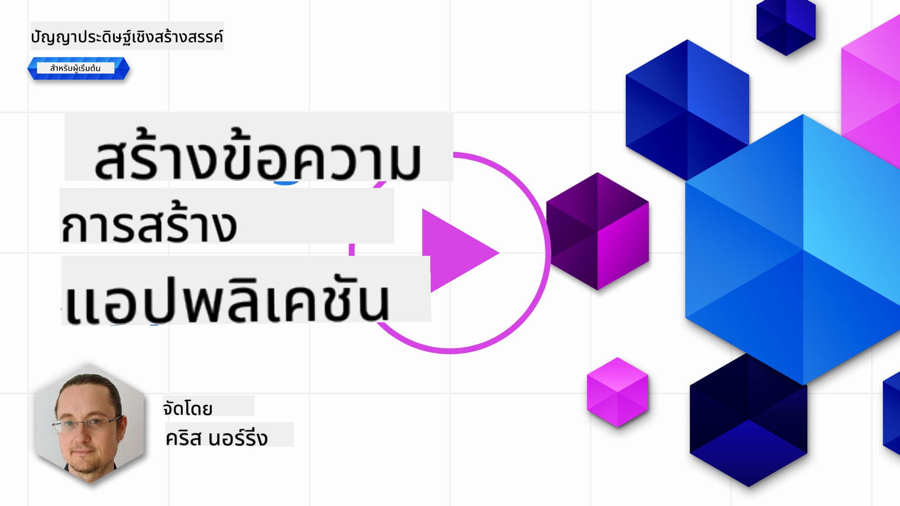

<!--
CO_OP_TRANSLATOR_METADATA:
{
  "original_hash": "ce8224073b86b728ed52b19bed7932fd",
  "translation_date": "2025-07-09T11:59:02+00:00",
  "source_file": "06-text-generation-apps/README.md",
  "language_code": "th"
}
-->
# การสร้างแอปพลิเคชันสร้างข้อความ

[](https://aka.ms/gen-ai-lesson6-gh?WT.mc_id=academic-105485-koreyst)

> _(คลิกที่ภาพด้านบนเพื่อดูวิดีโอของบทเรียนนี้)_

จนถึงตอนนี้คุณได้เห็นผ่านหลักสูตรนี้ว่ามีแนวคิดหลักอย่าง prompts และแม้แต่สาขาวิชาหนึ่งที่เรียกว่า "prompt engineering" เครื่องมือต่างๆ ที่คุณสามารถโต้ตอบด้วย เช่น ChatGPT, Office 365, Microsoft Power Platform และอื่นๆ รองรับการใช้ prompts เพื่อทำสิ่งต่างๆ ให้สำเร็จ

ถ้าคุณต้องการเพิ่มประสบการณ์แบบนี้ลงในแอป คุณจำเป็นต้องเข้าใจแนวคิดอย่าง prompts, completions และเลือกไลบรารีที่จะใช้ นั่นคือสิ่งที่คุณจะได้เรียนรู้ในบทนี้

## บทนำ

ในบทนี้ คุณจะได้:

- เรียนรู้เกี่ยวกับไลบรารี openai และแนวคิดหลักของมัน
- สร้างแอปพลิเคชันสร้างข้อความโดยใช้ openai
- เข้าใจวิธีใช้แนวคิดอย่าง prompt, temperature และ tokens เพื่อสร้างแอปพลิเคชันสร้างข้อความ

## เป้าหมายการเรียนรู้

เมื่อจบบทเรียนนี้ คุณจะสามารถ:

- อธิบายว่าแอปพลิเคชันสร้างข้อความคืออะไร
- สร้างแอปพลิเคชันสร้างข้อความโดยใช้ openai
- กำหนดค่าแอปของคุณให้ใช้ tokens มากหรือน้อยลง และเปลี่ยนค่า temperature เพื่อให้ได้ผลลัพธ์ที่หลากหลาย

## แอปพลิเคชันสร้างข้อความคืออะไร?

โดยปกติเมื่อคุณสร้างแอป มันจะมีอินเทอร์เฟซบางอย่าง เช่น:

- แบบคำสั่ง (Command-based) แอปคอนโซลเป็นแอปทั่วไปที่คุณพิมพ์คำสั่งแล้วมันจะทำงานตามคำสั่งนั้น เช่น `git` เป็นแอปแบบคำสั่ง
- อินเทอร์เฟซผู้ใช้ (UI) บางแอปมีอินเทอร์เฟซแบบกราฟิก (GUI) ที่คุณคลิกปุ่ม, ป้อนข้อความ, เลือกตัวเลือก และอื่นๆ

### แอปคอนโซลและ UI มีข้อจำกัด

เปรียบเทียบกับแอปแบบคำสั่งที่คุณพิมพ์คำสั่ง:

- **มีข้อจำกัด** คุณไม่สามารถพิมพ์คำสั่งอะไรก็ได้ มีแค่คำสั่งที่แอปรองรับเท่านั้น
- **จำกัดภาษา** บางแอปรองรับหลายภาษา แต่โดยปกติแอปจะถูกสร้างมาเพื่อภาษาหนึ่งโดยเฉพาะ แม้ว่าคุณจะเพิ่มการรองรับภาษาอื่นได้

### ข้อดีของแอปพลิเคชันสร้างข้อความ

แล้วแอปสร้างข้อความแตกต่างอย่างไร?

ในแอปสร้างข้อความ คุณมีความยืดหยุ่นมากขึ้น ไม่จำกัดแค่ชุดคำสั่งหรือภาษาป้อนข้อมูลเฉพาะ คุณสามารถใช้ภาษาธรรมชาติเพื่อโต้ตอบกับแอป อีกข้อดีคือคุณกำลังโต้ตอบกับแหล่งข้อมูลที่ได้รับการฝึกฝนจากข้อมูลจำนวนมาก ในขณะที่แอปแบบดั้งเดิมอาจจำกัดแค่ข้อมูลในฐานข้อมูล

### ฉันสามารถสร้างอะไรได้บ้างกับแอปสร้างข้อความ?

มีหลายอย่างที่คุณสามารถสร้างได้ เช่น:

- **แชทบอท** แชทบอทที่ตอบคำถามเกี่ยวกับหัวข้อต่างๆ เช่น บริษัทของคุณและผลิตภัณฑ์ อาจเป็นตัวเลือกที่ดี
- **ผู้ช่วย** LLMs เก่งในการสรุปข้อความ, ดึงข้อมูลเชิงลึกจากข้อความ, สร้างข้อความเช่นเรซูเม่ และอื่นๆ
- **ผู้ช่วยเขียนโค้ด** ขึ้นอยู่กับโมเดลภาษาที่คุณใช้ คุณสามารถสร้างผู้ช่วยเขียนโค้ดที่ช่วยเขียนโค้ดได้ เช่น ใช้ GitHub Copilot หรือ ChatGPT เพื่อช่วยเขียนโค้ด

## ฉันจะเริ่มต้นอย่างไร?

คุณต้องหาวิธีเชื่อมต่อกับ LLM ซึ่งโดยทั่วไปมีสองวิธีดังนี้:

- ใช้ API คุณจะสร้างคำขอเว็บด้วย prompt ของคุณและรับข้อความที่สร้างกลับมา
- ใช้ไลบรารี ไลบรารีช่วยห่อหุ้มการเรียก API และทำให้ง่ายต่อการใช้งาน

## ไลบรารี/SDKs

มีไลบรารีที่รู้จักกันดีสำหรับทำงานกับ LLMs เช่น:

- **openai** ไลบรารีนี้ช่วยให้เชื่อมต่อกับโมเดลของคุณและส่ง prompt ได้ง่าย

นอกจากนี้ยังมีไลบรารีที่ทำงานในระดับสูงกว่า เช่น:

- **Langchain** Langchain เป็นที่รู้จักและรองรับ Python
- **Semantic Kernel** Semantic Kernel เป็นไลบรารีของ Microsoft ที่รองรับภาษา C#, Python และ Java

## แอปแรกโดยใช้ openai

มาดูกันว่าเราจะสร้างแอปแรกอย่างไร ไลบรารีที่ต้องใช้มีอะไรบ้าง และต้องเตรียมอะไรบ้าง

### ติดตั้ง openai

มีไลบรารีมากมายสำหรับโต้ตอบกับ OpenAI หรือ Azure OpenAI คุณสามารถใช้หลายภาษาโปรแกรม เช่น C#, Python, JavaScript, Java และอื่นๆ เราเลือกใช้ไลบรารี `openai` ของ Python ดังนั้นเราจะใช้ `pip` ในการติดตั้ง

```bash
pip install openai
```

### สร้าง resource

คุณต้องทำตามขั้นตอนดังนี้:

- สร้างบัญชีบน Azure [https://azure.microsoft.com/free/](https://azure.microsoft.com/free/?WT.mc_id=academic-105485-koreyst)
- ขอสิทธิ์เข้าถึง Azure OpenAI ไปที่ [https://learn.microsoft.com/azure/ai-services/openai/overview#how-do-i-get-access-to-azure-openai](https://learn.microsoft.com/azure/ai-services/openai/overview#how-do-i-get-access-to-azure-openai?WT.mc_id=academic-105485-koreyst) และขอสิทธิ์เข้าถึง

  > [!NOTE]
  > ณ เวลาที่เขียน คุณต้องสมัครขอสิทธิ์เข้าถึง Azure OpenAI

- ติดตั้ง Python <https://www.python.org/>
- สร้าง Azure OpenAI Service resource ดูคำแนะนำวิธี [สร้าง resource](https://learn.microsoft.com/azure/ai-services/openai/how-to/create-resource?pivots=web-portal?WT.mc_id=academic-105485-koreyst)

### หาคีย์ API และ endpoint

ตอนนี้คุณต้องบอกไลบรารี `openai` ว่าจะใช้คีย์ API อะไร ในการหาคีย์ API ให้ไปที่ส่วน "Keys and Endpoint" ของ Azure OpenAI resource ของคุณและคัดลอกค่าของ "Key 1"


เมื่อคุณคัดลอกข้อมูลนี้แล้ว ให้สั่งไลบรารีใช้ข้อมูลนี้

> [!NOTE]
> ควรแยกคีย์ API ออกจากโค้ดของคุณ คุณสามารถทำได้โดยใช้ environment variables
>
> - ตั้ง environment variable `OPENAI_API_KEY` เป็นคีย์ API ของคุณ
>   `export OPENAI_API_KEY='sk-...'`

### ตั้งค่าการกำหนดค่า Azure

ถ้าคุณใช้ Azure OpenAI นี่คือวิธีตั้งค่าการกำหนดค่า:

```python
openai.api_type = 'azure'
openai.api_key = os.environ["OPENAI_API_KEY"]
openai.api_version = '2023-05-15'
openai.api_base = os.getenv("API_BASE")
```

ข้างบนนี้เรากำหนดค่า:

- `api_type` เป็น `azure` บอกไลบรารีให้ใช้ Azure OpenAI ไม่ใช่ OpenAI ปกติ
- `api_key` คือคีย์ API ที่คุณหาได้จาก Azure Portal
- `api_version` คือเวอร์ชันของ API ที่คุณต้องการใช้ ณ เวลาที่เขียน เวอร์ชันล่าสุดคือ `2023-05-15`
- `api_base` คือ endpoint ของ API คุณสามารถหาได้จาก Azure Portal ข้างๆ คีย์ API ของคุณ

> [!NOTE] > `os.getenv` เป็นฟังก์ชันที่อ่าน environment variables คุณสามารถใช้มันเพื่ออ่าน environment variables เช่น `OPENAI_API_KEY` และ `API_BASE` ตั้ง environment variables เหล่านี้ในเทอร์มินัลของคุณหรือใช้ไลบรารีอย่าง `dotenv`

## การสร้างข้อความ

วิธีสร้างข้อความคือใช้คลาส `Completion` ตัวอย่างเช่น:

```python
prompt = "Complete the following: Once upon a time there was a"

completion = openai.Completion.create(model="davinci-002", prompt=prompt)
print(completion.choices[0].text)
```

ในโค้ดข้างบน เราสร้างอ็อบเจ็กต์ completion และส่งโมเดลที่ต้องการใช้กับ prompt จากนั้นพิมพ์ข้อความที่สร้างขึ้น

### การสร้างข้อความแบบแชท

จนถึงตอนนี้ คุณเห็นว่าเราใช้ `Completion` เพื่อสร้างข้อความ แต่ยังมีคลาสอีกตัวชื่อ `ChatCompletion` ที่เหมาะกับแชทบอทมากกว่า ตัวอย่างการใช้งาน:

```python
import openai

openai.api_key = "sk-..."

completion = openai.ChatCompletion.create(model="gpt-3.5-turbo", messages=[{"role": "user", "content": "Hello world"}])
print(completion.choices[0].message.content)
```

จะมีรายละเอียดเพิ่มเติมในบทถัดไป

## แบบฝึกหัด - แอปสร้างข้อความแรกของคุณ

ตอนนี้ที่เราเรียนรู้วิธีตั้งค่าและกำหนดค่า openai แล้ว ถึงเวลาสร้างแอปสร้างข้อความแรกของคุณ ทำตามขั้นตอนนี้:

1. สร้าง virtual environment และติดตั้ง openai:

   ```bash
   python -m venv venv
   source venv/bin/activate
   pip install openai
   ```

   > [!NOTE]
   > ถ้าคุณใช้ Windows ให้พิมพ์ `venv\Scripts\activate` แทน `source venv/bin/activate`

   > [!NOTE]
   > หาคีย์ Azure OpenAI ของคุณโดยไปที่ [https://portal.azure.com/](https://portal.azure.com/?WT.mc_id=academic-105485-koreyst) ค้นหา `Open AI` เลือก `Open AI resource` แล้วเลือก `Keys and Endpoint` คัดลอกค่าของ `Key 1`

1. สร้างไฟล์ _app.py_ และใส่โค้ดดังนี้:

   ```python
   import openai

   openai.api_key = "<replace this value with your open ai key or Azure OpenAI key>"

   openai.api_type = 'azure'
   openai.api_version = '2023-05-15'
   openai.api_base = "<endpoint found in Azure Portal where your API key is>"
   deployment_name = "<deployment name>"

   # add your completion code
   prompt = "Complete the following: Once upon a time there was a"
   messages = [{"role": "user", "content": prompt}]

   # make completion
   completion = openai.chat.completions.create(model=deployment_name, messages=messages)

   # print response
   print(completion.choices[0].message.content)
   ```

   > [!NOTE]
   > ถ้าคุณใช้ Azure OpenAI ต้องตั้งค่า `api_type` เป็น `azure` และตั้ง `api_key` เป็นคีย์ Azure OpenAI ของคุณ

   คุณควรเห็นผลลัพธ์ประมาณนี้:

   ```output
    very unhappy _____.

   Once upon a time there was a very unhappy mermaid.
   ```

## ประเภทของ prompt ที่แตกต่างกัน สำหรับงานที่แตกต่างกัน

ตอนนี้คุณเห็นวิธีสร้างข้อความโดยใช้ prompt แล้ว คุณมีโปรแกรมที่ทำงานได้และสามารถแก้ไขเพื่อสร้างข้อความประเภทต่างๆ ได้

prompt สามารถใช้กับงานหลากหลาย เช่น:

- **สร้างข้อความประเภทหนึ่ง** เช่น สร้างบทกวี, คำถามสำหรับแบบทดสอบ ฯลฯ
- **ค้นหาข้อมูล** คุณสามารถใช้ prompt เพื่อค้นหาข้อมูล เช่น ตัวอย่าง 'CORS หมายถึงอะไรในการพัฒนาเว็บ?'
- **สร้างโค้ด** คุณสามารถใช้ prompt เพื่อสร้างโค้ด เช่น สร้าง regular expression สำหรับตรวจสอบอีเมล หรือแม้แต่สร้างโปรแกรมทั้งโปรแกรม เช่น เว็บแอป

## กรณีใช้งานที่เป็นประโยชน์มากขึ้น: ตัวสร้างสูตรอาหาร

ลองนึกภาพว่าคุณมีวัตถุดิบที่บ้านและต้องการทำอาหาร สำหรับนั้นคุณต้องการสูตรอาหาร วิธีหนึ่งในการหาสูตรคือใช้เครื่องมือค้นหา หรือคุณอาจใช้ LLM เพื่อช่วย

คุณอาจเขียน prompt แบบนี้:

> "แสดงสูตรอาหาร 5 สูตรที่ใช้วัตถุดิบดังนี้: ไก่, มันฝรั่ง และแครอท ในแต่ละสูตรให้ระบุวัตถุดิบทั้งหมดที่ใช้"

จาก prompt ข้างต้น คุณอาจได้รับคำตอบประมาณนี้:

```output
1. Roasted Chicken and Vegetables:
Ingredients:
- 4 chicken thighs
- 2 potatoes, cut into cubes
- 2 carrots, cut into cubes
- 2 tablespoons olive oil
- 2 cloves garlic, minced
- 1 teaspoon dried thyme
- 1 teaspoon dried oregano
- Salt and pepper, to taste

2. Chicken and Potato Stew:
Ingredients:
- 2 tablespoons olive oil
- 1 onion, diced
- 2 cloves garlic, minced
- 2 chicken breasts, cut into cubes
- 2 potatoes, cut into cubes
- 2 carrots, cut into cubes
- 1 teaspoon dried oregano
- 1 teaspoon dried thyme
- 1 cup chicken broth
- Salt and pepper, to taste

3. Chicken and Potato Bake:
Ingredients:
- 2 tablespoons olive oil
- 2 chicken breasts, cut into cubes
- 2 potatoes, cut into cubes
- 2 carrots, cut into cubes
- 1 onion, diced
- 2 cloves garlic, minced
- 1 teaspoon dried oregano
- 1 teaspoon dried thyme
- 1 cup chicken broth
- Salt and pepper, to taste

4. Chicken and Potato Soup:
Ingredients:
- 2 tablespoons olive oil
- 1 onion, diced
- 2 cloves garlic, minced
- 2 chicken breasts, cut into cubes
- 2 potatoes, cut into cubes
- 2 carrots, cut into cubes
- 1 teaspoon dried oregano
- 1 teaspoon dried thyme
- 4 cups chicken broth
- Salt and pepper, to taste

5. Chicken and Potato Hash:
Ingredients:
- 2 tablespoons olive oil
- 2 chicken breasts, cut into cubes
- 2 potatoes, cut into cubes
- 2 carrots, cut into cubes
- 1 onion, diced
- 2 cloves garlic, minced
- 1 teaspoon dried oregano
```

ผลลัพธ์นี้ดีมาก ฉันรู้ว่าจะทำอะไร ตอนนี้สิ่งที่อาจช่วยได้คือ:

- กรองวัตถุดิบที่ฉันไม่ชอบหรือแพ้
- สร้างรายการซื้อของ เผื่อฉันไม่มีวัตถุดิบครบที่บ้าน

สำหรับกรณีข้างต้น ให้เพิ่ม prompt อีกอัน:

> "กรุณาลบสูตรที่มีส่วนผสมของกระเทียมเพราะฉันแพ้ และแทนที่ด้วยอย่างอื่นด้วย นอกจากนี้กรุณาสร้างรายการซื้อของสำหรับสูตรอาหาร โดยพิจารณาว่าฉันมีไก่, มันฝรั่ง และแครอทอยู่แล้วที่บ้าน"

ตอนนี้คุณจะได้ผลลัพธ์ใหม่ คือ:

```output
1. Roasted Chicken and Vegetables:
Ingredients:
- 4 chicken thighs
- 2 potatoes, cut into cubes
- 2 carrots, cut into cubes
- 2 tablespoons olive oil
- 1 teaspoon dried thyme
- 1 teaspoon dried oregano
- Salt and pepper, to taste

2. Chicken and Potato Stew:
Ingredients:
- 2 tablespoons olive oil
- 1 onion, diced
- 2 chicken breasts, cut into cubes
- 2 potatoes, cut into cubes
- 2 carrots, cut into cubes
- 1 teaspoon dried oregano
- 1 teaspoon dried thyme
- 1 cup chicken broth
- Salt and pepper, to taste

3. Chicken and Potato Bake:
Ingredients:
- 2 tablespoons olive oil
- 2 chicken breasts, cut into cubes
- 2 potatoes, cut into cubes
- 2 carrots, cut into cubes
- 1 onion, diced
- 1 teaspoon dried oregano
- 1 teaspoon dried thyme
- 1 cup chicken broth
- Salt and pepper, to taste

4. Chicken and Potato Soup:
Ingredients:
- 2 tablespoons olive oil
- 1 onion, diced
- 2 chicken breasts, cut into cubes
- 2 potatoes, cut into cubes
- 2 carrots, cut into cubes
- 1 teaspoon dried oregano
- 1 teaspoon dried thyme
- 4 cups chicken broth
- Salt and pepper, to taste

5. Chicken and Potato Hash:
Ingredients:
- 2 tablespoons olive oil
- 2 chicken breasts, cut into cubes
- 2 potatoes, cut into cubes
- 2 carrots, cut into cubes
- 1 onion, diced
- 1 teaspoon dried oregano

Shopping List:
- Olive oil
- Onion
- Thyme
- Oregano
- Salt
- Pepper
```

นี่คือสูตรอาหาร 5 สูตรที่ไม่มีการกล่าวถึงกระเทียม และคุณยังได้รายการซื้อของโดยพิจารณาจากวัตถุดิบที่มีอยู่ที่บ้านแล้ว

## แบบฝึกหัด - สร้างตัวสร้างสูตรอาหาร

ตอนนี้ที่เราได้ลองสถานการณ์แล้ว มาลองเขียนโค้ดให้ตรงกับสถานการณ์ที่แสดงไว้ ทำตามขั้นตอนนี้:

1. ใช้ไฟล์ _app.py_ ที่มีอยู่เป็นจุดเริ่มต้น
1. หา `prompt` ตัวแปรและเปลี่ยนโค้ดเป็นดังนี้:

   ```python
   prompt = "Show me 5 recipes for a dish with the following ingredients: chicken, potatoes, and carrots. Per recipe, list all the ingredients used"
   ```

   ถ้าคุณรันโค้ดตอนนี้ คุณควรเห็นผลลัพธ์ประมาณนี้:

   ```output
   -Chicken Stew with Potatoes and Carrots: 3 tablespoons oil, 1 onion, chopped, 2 cloves garlic, minced, 1 carrot, peeled and chopped, 1 potato, peeled and chopped, 1 bay leaf, 1 thyme sprig, 1/2 teaspoon salt, 1/4 teaspoon black pepper, 1 1/2 cups chicken broth, 1/2 cup dry white wine, 2 tablespoons chopped fresh parsley, 2 tablespoons unsalted butter, 1 1/2 pounds boneless, skinless chicken thighs, cut into 1-inch pieces
   -Oven-Roasted Chicken with Potatoes and Carrots: 3 tablespoons extra-virgin olive oil, 1 tablespoon Dijon mustard, 1 tablespoon chopped fresh rosemary, 1 tablespoon chopped fresh thyme, 4 cloves garlic, minced, 1 1/2 pounds small red potatoes, quartered, 1 1/2 pounds carrots, quartered lengthwise, 1/2 teaspoon salt, 1/4 teaspoon black pepper, 1 (4-pound) whole chicken
   -Chicken, Potato, and Carrot Casserole: cooking spray, 1 large onion, chopped, 2 cloves garlic, minced, 1 carrot, peeled and shredded, 1 potato, peeled and shredded, 1/2 teaspoon dried thyme leaves, 1/4 teaspoon salt, 1/4 teaspoon black pepper, 2 cups fat-free, low-sodium chicken broth, 1 cup frozen peas, 1/4 cup all-purpose flour, 1 cup 2% reduced-fat milk, 1/4 cup grated Parmesan cheese

   -One Pot Chicken and Potato Dinner: 2 tablespoons olive oil, 1 pound boneless, skinless chicken thighs, cut into 1-inch pieces, 1 large onion, chopped, 3 cloves garlic, minced, 1 carrot, peeled and chopped, 1 potato, peeled and chopped, 1 bay leaf, 1 thyme sprig, 1/2 teaspoon salt, 1/4 teaspoon black pepper, 2 cups chicken broth, 1/2 cup dry white wine

   -Chicken, Potato, and Carrot Curry: 1 tablespoon vegetable oil, 1 large onion, chopped, 2 cloves garlic, minced, 1 carrot, peeled and chopped, 1 potato, peeled and chopped, 1 teaspoon ground coriander, 1 teaspoon ground cumin, 1/2 teaspoon ground turmeric, 1/2 teaspoon ground ginger, 1/4 teaspoon cayenne pepper, 2 cups chicken broth, 1/2 cup dry white wine, 1 (15-ounce) can chickpeas, drained and rinsed, 1/2 cup raisins, 1/2 cup chopped fresh cilantro
   ```

   > NOTE, LLM ของคุณไม่ใช่แบบกำหนดผลลัพธ์ตายตัว ดังนั้นคุณอาจได้ผลลัพธ์ที่แตกต่างกันทุกครั้งที่รันโปรแกรม

ดีมาก มาดูกันว่าจะปรับปรุงอย่างไร เพื่อให้โค้ดยืดหยุ่นขึ้น เพื่อให้จำนวนสูตรอาหารและวัตถุดิบสามารถปรับเปลี่ยนได้

1. เปลี่ยนโค้ดดังนี้:

   ```python
   no_recipes = input("No of recipes (for example, 5): ")

   ingredients = input("List of ingredients (for example, chicken, potatoes, and carrots): ")

   # interpolate the number of recipes into the prompt an ingredients
   prompt = f"Show me {no_recipes} recipes for a dish with the following ingredients: {ingredients}. Per recipe, list all the ingredients used"
   ```

   ตัวอย่างการทดสอบโค้ดอาจเป็นแบบนี้:

   ```output
   No of recipes (for example, 5): 3
   List of ingredients (for example, chicken, potatoes, and carrots): milk,strawberries

   -Strawberry milk shake: milk, strawberries, sugar, vanilla extract, ice cubes
   -Strawberry shortcake: milk, flour, baking powder, sugar, salt, unsalted butter, strawberries, whipped cream
   -Strawberry milk: milk, strawberries, sugar, vanilla extract
   ```

### ปรับปรุงโดยเพิ่มการกรองและรายการซื้อของ

ตอนนี้เรามีแอปที่ทำงานได้ สามารถสร้างสูตรอาหาร และยืดหยุ่นเพราะรับข้อมูลจากผู้ใช้ ทั้งจำนวนสูตรและวัตถุดิบที่ใช้

เพื่อปรับปรุงเพิ่มเติม เราต้องการเพิ่มสิ่งต่อไปนี้:

- **กรองวัตถุดิบ** เราต้องการกรองวัตถุดิบที่เราไม่ชอบหรือแพ้ เพื่อทำสิ่งนี้ เราสามารถแก้ไข prompt เดิมและเพิ่มเงื่อนไขการกรองไว้ท้าย prompt ดังนี้:

  ```python
  filter = input("Filter (for example, vegetarian, vegan, or gluten-free): ")

  prompt = f"Show me {no_recipes} recipes for a dish with the following ingredients: {ingredients}. Per recipe, list all the ingredients used, no {filter}"
  ```

  ข้างบนนี้ เราเพิ่ม `{filter}` ไว้ท้าย prompt และรับค่าการกรองจากผู้ใช้ด้วย

  ตัวอย่างการป้อนข้อมูลตอนรันโปรแกรมอาจเป็นแบบนี้:

  ```output
  No of recipes (for example, 5): 3
  List of ingredients (for example, chicken, potatoes, and carrots): onion,milk
  Filter (for example, vegetarian, vegan, or gluten-free): no milk

  1. French Onion Soup

  Ingredients:

  -1 large onion, sliced
  -3 cups beef broth
  -1 cup milk
  -6 slices french bread
  -1/4 cup shredded Parmesan cheese
  -1 tablespoon butter
  -1 teaspoon dried thyme
  -1/4 teaspoon salt
  -1/4 teaspoon black pepper

  Instructions:

  1. In a large pot, sauté onions in butter until golden brown.
  2. Add beef broth, milk, thyme, salt, and pepper. Bring to a boil.
  3. Reduce heat and simmer for 10 minutes.
  4. Place french bread slices on soup bowls.
  5. Ladle soup over bread.
  6. Sprinkle with Parmesan cheese.

  2. Onion and Potato Soup

  Ingredients:

  -1 large onion, chopped
  -2 cups potatoes, diced
  -3 cups vegetable broth
  -1 cup milk
  -1/4 teaspoon black pepper

  Instructions:

  1. In a large pot, sauté onions in butter until golden brown.
  2. Add potatoes, vegetable broth, milk, and pepper. Bring to a boil.
  3. Reduce heat and simmer for 10 minutes.
  4. Serve hot.

  3. Creamy Onion Soup

  Ingredients:

  -1 large onion, chopped
  -3 cups vegetable broth
  -1 cup milk
  -1/4 teaspoon black pepper
  -1/4 cup all-purpose flour
  -1/2 cup shredded Parmesan cheese

  Instructions:

  1. In a large pot, sauté onions in butter until golden brown.
  2. Add vegetable broth, milk, and pepper. Bring to a boil.
  3. Reduce heat and simmer for 10 minutes.
  4. In a small bowl, whisk together flour and Parmesan cheese until smooth.
  5. Add to soup and simmer for an additional 5 minutes, or until soup has thickened.
  ```

  อย่างที่เห็น สูตรอาหารที่มีนมถูกกรองออกไป แต่ถ้าคุณแพ้แลคโตส คุณอาจต้องการกรองสูตรที่มีชีสด้วย ดังนั้นต้องระบุให้ชัดเจน

- **สร้างรายการซื้อของ** เราต้องการสร้างรายการซื้อของโดยพิจารณาว่าเรามีวัตถุดิบอะไรอยู่แล้วที่บ้าน

  สำหรับฟังก์ชันนี้ เราอาจแก้ไขทุกอย่างใน prompt เดียว หรือแยกเป็นสอง prompt ก็ได้ ลองใช้วิธีหลัง โดยเพิ่ม prompt อีกอัน แต่เพื่อให้ทำงานได้ เราต้องเพิ่มผลลัพธ์จาก prompt แรกเป็นบริบทของ prompt ที่สอง

  หาโค้ดส่วนที่พิมพ์ผลลัพธ์จาก prompt แรก แล้วเพิ่มโค้ดนี้ลงไปข้างล่าง:

  ```python
  old_prompt_result = completion.choices[0].message.content
  prompt = "Produce a shopping list for the generated recipes and please don't include ingredients that I already have."

  new_prompt = f"{old_prompt_result} {prompt}"
  messages = [{"role": "user", "content": new_prompt}]
  completion = openai.Completion.create(engine=deployment_name, messages=messages, max_tokens=1200)

  # print response
  print("Shopping list:")
  print(completion.choices[0].message.content)
  ```

  สังเกตดังนี้:

  1. เราสร้าง prompt ใหม่โดยเพิ่มผลลัพธ์จาก prompt แรกเข้าไปใน prompt ใหม่:

     ```python
     new_prompt = f"{old_prompt_result} {prompt}"
     ```
  1. เราสร้างคำขอใหม่ แต่ก็ยังคำนึงถึงจำนวนโทเค็นที่เราขอในคำสั่งแรกด้วย ดังนั้นครั้งนี้เรากำหนด `max_tokens` เป็น 1200

     ```python
     completion = openai.Completion.create(engine=deployment_name, prompt=new_prompt, max_tokens=1200)
     ```

     เมื่อนำโค้ดนี้มาทดลอง เราจะได้ผลลัพธ์ดังนี้:

     ```output
     No of recipes (for example, 5): 2
     List of ingredients (for example, chicken, potatoes, and carrots): apple,flour
     Filter (for example, vegetarian, vegan, or gluten-free): sugar


     -Apple and flour pancakes: 1 cup flour, 1/2 tsp baking powder, 1/2 tsp baking soda, 1/4 tsp salt, 1 tbsp sugar, 1 egg, 1 cup buttermilk or sour milk, 1/4 cup melted butter, 1 Granny Smith apple, peeled and grated
     -Apple fritters: 1-1/2 cups flour, 1 tsp baking powder, 1/4 tsp salt, 1/4 tsp baking soda, 1/4 tsp nutmeg, 1/4 tsp cinnamon, 1/4 tsp allspice, 1/4 cup sugar, 1/4 cup vegetable shortening, 1/4 cup milk, 1 egg, 2 cups shredded, peeled apples
     Shopping list:
     -Flour, baking powder, baking soda, salt, sugar, egg, buttermilk, butter, apple, nutmeg, cinnamon, allspice
     ```

## ปรับปรุงการตั้งค่าของคุณ

สิ่งที่เรามีตอนนี้คือโค้ดที่ใช้งานได้ แต่ยังมีการปรับแต่งบางอย่างที่ควรทำเพื่อพัฒนาให้ดีขึ้น สิ่งที่ควรทำมีดังนี้:

- **แยกความลับออกจากโค้ด** เช่น API key ความลับไม่ควรอยู่ในโค้ดและควรเก็บไว้ในที่ปลอดภัย เพื่อแยกความลับออกจากโค้ด เราสามารถใช้ environment variables และไลบรารีอย่าง `python-dotenv` เพื่อโหลดค่าจากไฟล์ ตัวอย่างโค้ดจะเป็นแบบนี้:

  1. สร้างไฟล์ `.env` โดยมีเนื้อหาดังนี้:

     ```bash
     OPENAI_API_KEY=sk-...
     ```

     
> หมายเหตุ สำหรับ Azure คุณต้องตั้ง environment variables ดังนี้:

     ```bash
     OPENAI_API_TYPE=azure
     OPENAI_API_VERSION=2023-05-15
     OPENAI_API_BASE=<replace>
     ```

     ในโค้ด คุณจะโหลด environment variables แบบนี้:

     ```python
     from dotenv import load_dotenv

     load_dotenv()

     openai.api_key = os.environ["OPENAI_API_KEY"]
     ```

- **เรื่องความยาวของโทเค็น** เราควรพิจารณาว่าต้องใช้โทเค็นกี่ตัวในการสร้างข้อความที่ต้องการ โทเค็นมีค่าใช้จ่าย ดังนั้นถ้าเป็นไปได้ควรใช้โทเค็นอย่างประหยัด เช่น เราสามารถปรับคำสั่งให้ใช้โทเค็นน้อยลงได้ไหม?

  หากต้องการเปลี่ยนจำนวนโทเค็นที่ใช้ สามารถใช้พารามิเตอร์ `max_tokens` เช่น ถ้าต้องการใช้ 100 โทเค็น ให้ทำแบบนี้:

  ```python
  completion = client.chat.completions.create(model=deployment, messages=messages, max_tokens=100)
  ```

- **ทดลองปรับ temperature** Temperature เป็นสิ่งที่ยังไม่ได้พูดถึงแต่มีความสำคัญต่อการทำงานของโปรแกรม ค่า temperature ที่สูงขึ้นจะทำให้ผลลัพธ์มีความสุ่มมากขึ้น ในขณะที่ค่าที่ต่ำกว่าจะทำให้ผลลัพธ์คาดเดาได้มากขึ้น คิดดูว่าคุณต้องการให้ผลลัพธ์มีความหลากหลายหรือไม่

  หากต้องการเปลี่ยนค่า temperature ให้ใช้พารามิเตอร์ `temperature` เช่น ถ้าต้องการใช้ค่า 0.5 ให้ทำแบบนี้:

  ```python
  completion = client.chat.completions.create(model=deployment, messages=messages, temperature=0.5)
  ```

  > หมายเหตุ ยิ่งใกล้ 1.0 ผลลัพธ์จะยิ่งหลากหลายมากขึ้น

## การบ้าน

สำหรับการบ้านนี้ คุณสามารถเลือกสร้างสิ่งที่ต้องการได้

นี่คือข้อเสนอแนะบางอย่าง:

- ปรับปรุงแอปสร้างสูตรอาหารให้ดีขึ้น ทดลองปรับค่า temperature และคำสั่งเพื่อดูว่าคุณจะได้ผลลัพธ์แบบไหน
- สร้าง "study buddy" แอปนี้ควรตอบคำถามเกี่ยวกับหัวข้อใดหัวข้อหนึ่ง เช่น Python คุณอาจมีคำสั่งว่า "หัวข้อใดหัวข้อหนึ่งใน Python คืออะไร?" หรือคำสั่งให้แสดงโค้ดเกี่ยวกับหัวข้อนั้น ๆ
- สร้าง History bot ให้ประวัติศาสตร์มีชีวิตชีวา สั่งให้บอทเล่นบทบาทตัวละครประวัติศาสตร์และถามคำถามเกี่ยวกับชีวิตและยุคสมัยของตัวละครนั้น

## ตัวอย่างคำตอบ

### Study buddy

ด้านล่างนี้เป็นคำสั่งเริ่มต้น ลองดูว่าคุณจะใช้และปรับแต่งอย่างไรให้เหมาะกับคุณ

```text
- "You're an expert on the Python language

    Suggest a beginner lesson for Python in the following format:

    Format:
    - concepts:
    - brief explanation of the lesson:
    - exercise in code with solutions"
```

### History bot

นี่คือคำสั่งที่คุณอาจใช้ได้:

```text
- "You are Abe Lincoln, tell me about yourself in 3 sentences, and respond using grammar and words like Abe would have used"
- "You are Abe Lincoln, respond using grammar and words like Abe would have used:

   Tell me about your greatest accomplishments, in 300 words"
```

## ตรวจสอบความเข้าใจ

แนวคิดเรื่อง temperature คืออะไร?

1. มันควบคุมความสุ่มของผลลัพธ์
1. มันควบคุมขนาดของคำตอบ
1. มันควบคุมจำนวนโทเค็นที่ใช้

## 🚀 ความท้าทาย

เมื่อทำการบ้าน ลองปรับค่า temperature ดู ตั้งเป็น 0, 0.5 และ 1 จำไว้ว่าค่า 0 คือความหลากหลายน้อยที่สุด และ 1 คือความหลากหลายมากที่สุด ค่าไหนเหมาะกับแอปของคุณที่สุด?

## ทำได้ดีมาก! เรียนรู้ต่อไป

หลังจากจบบทเรียนนี้แล้ว ลองดู [คอลเลกชันการเรียนรู้ Generative AI](https://aka.ms/genai-collection?WT.mc_id=academic-105485-koreyst) เพื่อพัฒนาความรู้ด้าน Generative AI ของคุณให้ก้าวหน้าไปอีกขั้น!

ไปที่บทเรียนที่ 7 ซึ่งเราจะเรียนรู้วิธี [สร้างแอปแชท](../07-building-chat-applications/README.md?WT.mc_id=academic-105485-koreyst)!

**ข้อจำกัดความรับผิดชอบ**:  
เอกสารนี้ได้รับการแปลโดยใช้บริการแปลภาษาอัตโนมัติ [Co-op Translator](https://github.com/Azure/co-op-translator) แม้เราจะพยายามให้ความถูกต้องสูงสุด แต่โปรดทราบว่าการแปลอัตโนมัติอาจมีข้อผิดพลาดหรือความไม่ถูกต้อง เอกสารต้นฉบับในภาษาต้นทางถือเป็นแหล่งข้อมูลที่เชื่อถือได้ สำหรับข้อมูลที่สำคัญ ขอแนะนำให้ใช้บริการแปลโดยผู้เชี่ยวชาญมนุษย์ เราไม่รับผิดชอบต่อความเข้าใจผิดหรือการตีความผิดใด ๆ ที่เกิดจากการใช้การแปลนี้