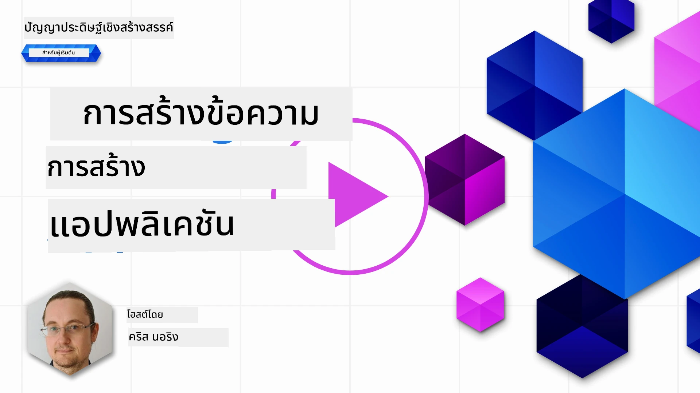

# การสร้างแอปพลิเคชันสร้างข้อความ

[](https://youtu.be/0Y5Luf5sRQA?si=t_xVg0clnAI4oUFZ)

> _(คลิกที่ภาพด้านบนเพื่อดูวิดีโอบทเรียนนี้)_

คุณได้เห็นจนถึงตอนนี้ผ่านหลักสูตรนี้ว่ามีแนวคิดหลักอย่างเช่น prompts และแม้แต่สาขาวิชาทั้งหมดที่เรียกว่า "prompt engineering" เครื่องมือหลายอย่างที่คุณสามารถโต้ตอบได้ เช่น ChatGPT, Office 365, Microsoft Power Platform และอื่น ๆ สนับสนุนให้คุณใช้ prompts เพื่อทำสิ่งต่าง ๆ

เพื่อให้คุณเพิ่มประสบการณ์ดังกล่าวลงในแอปได้ คุณต้องเข้าใจแนวคิดเช่น prompts, completions และเลือกไลบรารีที่จะใช้ นั่นคือสิ่งที่คุณจะได้เรียนรู้ในบทนี้

## บทนำ

ในบทนี้ คุณจะ:

- เรียนรู้เกี่ยวกับไลบรารี openai และแนวคิดหลักของมัน
- สร้างแอปพลิเคชันสร้างข้อความโดยใช้ openai
- เข้าใจวิธีใช้แนวคิดอย่าง prompt, temperature, และ tokens เพื่อสร้างแอปพลิเคชันสร้างข้อความ

## เป้าหมายการเรียนรู้

เมื่อสิ้นสุดบทเรียนนี้ คุณจะสามารถ:

- อธิบายว่าแอปพลิเคชันสร้างข้อความคืออะไร
- สร้างแอปพลิเคชันสร้างข้อความโดยใช้ openai
- ตั้งค่าแอปของคุณให้ใช้ tokens มากหรือน้อย และยังเปลี่ยน temperature เพื่อให้ได้ผลลัพธ์ที่หลากหลาย

## แอปพลิเคชันสร้างข้อความคืออะไร?

ปกติเมื่อคุณสร้างแอป มันจะมีอินเทอร์เฟซบางรูปแบบ เช่น ต่อไปนี้:

- แบบใช้คำสั่ง (Command-based) แอปคอนโซลเป็นแอปประเภทที่คุณพิมพ์คำสั่งแล้วแอปจะดำเนินการ ตัวอย่างเช่น `git` เป็นแอปแบบใช้คำสั่ง
- อินเทอร์เฟซผู้ใช้ (UI) แอปบางตัวมีอินเทอร์เฟซผู้ใช้แบบกราฟิก (GUI) ที่คุณคลิกปุ่ม ป้อนข้อความ เลือกตัวเลือก และอื่น ๆ

### แอปคอนโซลและ UI มีข้อจำกัด

เปรียบเทียบกับแอปแบบใช้คำสั่งที่คุณพิมพ์คำสั่ง:

- **มีข้อจำกัด** คุณไม่สามารถพิมพ์คำสั่งใดก็ได้ มีเพียงคำสั่งที่แอปสนับสนุนเท่านั้น
- **เฉพาะภาษา** แอปบางตัวสนับสนุนหลายภาษา แต่โดยปกติแอปจะถูกสร้างมาเพื่อภาษาหนึ่ง ๆ แม้ว่าคุณจะสามารถเพิ่มการสนับสนุนภาษาอื่นได้

### ข้อดีของแอปพลิเคชันสร้างข้อความ

แล้วแอปพลิเคชันสร้างข้อความแตกต่างอย่างไร?

ในแอปพลิเคชันสร้างข้อความ คุณมีความยืดหยุ่นมากขึ้น คุณไม่ถูกจำกัดด้วยชุดคำสั่งหรือภาษาป้อนข้อมูลเฉพาะ แต่คุณสามารถใช้ภาษาธรรมชาติโต้ตอบกับแอปได้ อีกข้อดีคือคุณได้โต้ตอบกับแหล่งข้อมูลที่ถูกฝึกบนชุดข้อมูลขนาดใหญ่ ในขณะที่แอปแบบดั้งเดิมอาจจำกัดเฉพาะข้อมูลที่อยู่ในฐานข้อมูล

### ฉันสามารถสร้างอะไรได้บ้างกับแอปพลิเคชันสร้างข้อความ?

คุณสามารถสร้างหลายอย่าง เช่น:

- **แชทบอท** แชทบอทที่ตอบคำถามเกี่ยวกับหัวข้อต่าง ๆ เช่น บริษัทของคุณและผลิตภัณฑ์ของบริษัท เหมาะสมเป็นอย่างดี
- **ผู้ช่วย** LLM มีความยอดเยี่ยมในการทำสิ่งต่าง ๆ เช่น สรุปข้อความ ดึงข้อมูลเชิงลึกจากข้อความ สร้างข้อความเช่น ประวัติย่อ และอื่น ๆ
- **ผู้ช่วยเขียนโค้ด** ขึ้นอยู่กับโมเดลภาษา คุณสามารถสร้างผู้ช่วยเขียนโค้ดที่ช่วยคุณเขียนโค้ดได้ เช่น ใช้ GitHub Copilot หรือ ChatGPT เพื่อช่วยเขียนโค้ด

## ฉันจะเริ่มต้นอย่างไร?

คุณต้องหาวิธีการผนวกรวมกับ LLM ซึ่งโดยทั่วไปมีสองวิธีต่อไปนี้:

- ใช้ API คุณจะส่งคำขอเว็บด้วย prompt ของคุณแล้วรับข้อความที่สร้างขึ้นมา
- ใช้ไลบรารี ไลบรารีช่วยห่อหุ้มการเรียก API และทำให้ง่ายต่อการใช้งาน

## ไลบรารี/SDK

มีไลบรารีที่รู้จักดีสำหรับการทำงานกับ LLM เช่น:

- **openai** ไลบรารีนี้ทำให้ง่ายสำหรับการเชื่อมต่อกับโมเดลและส่ง prompt เข้าไป

และยังมีไลบรารีที่ทำงานในระดับสูงกว่า เช่น:

- **Langchain** Langchain เป็นที่รู้จักกันดีและสนับสนุน Python
- **Semantic Kernel** Semantic Kernel คือไลบรารีจาก Microsoft ที่สนับสนุนภาษา C#, Python และ Java

## แอปแรกโดยใช้ openai

มาดูกันว่าเราจะสร้างแอปแรกของเราอย่างไร ไลบรารีที่ต้องใช้มีอะไรบ้าง ต้องใช้เท่าไหร่ และอื่น ๆ

### ติดตั้ง openai

มีไลบรารีมากมายสำหรับการโต้ตอบกับ OpenAI หรือ Azure OpenAI คุณสามารถใช้ภาษาการเขียนโปรแกรมหลายภาษาเช่น C#, Python, JavaScript, Java และอื่น ๆ เราเลือกใช้ไลบรารี `openai` สำหรับ Python ดังนั้นเราจะใช้ `pip` ติดตั้ง

```bash
pip install openai
```

### สร้างทรัพยากร

คุณต้องดำเนินขั้นตอนต่อไปนี้:

- สร้างบัญชีบน Azure [https://azure.microsoft.com/free/](https://azure.microsoft.com/free/?WT.mc_id=academic-105485-koreyst).
- ขอสิทธิ์เข้าถึง Azure OpenAI ไปที่ [https://learn.microsoft.com/azure/ai-services/openai/overview#how-do-i-get-access-to-azure-openai](https://learn.microsoft.com/azure/ai-services/openai/overview#how-do-i-get-access-to-azure-openai?WT.mc_id=academic-105485-koreyst) และขอสิทธิ์เข้าถึง

  > [!NOTE]
  > ณ เวลาที่เขียนนี้ คุณจำเป็นต้องสมัครขอสิทธิ์เข้าถึง Azure OpenAI

- ติดตั้ง Python <https://www.python.org/>
- สร้างทรัพยากร Azure OpenAI Service ดูคำแนะนำเกี่ยวกับวิธี [สร้างทรัพยากร](https://learn.microsoft.com/azure/ai-services/openai/how-to/create-resource?pivots=web-portal?WT.mc_id=academic-105485-koreyst)

### หาคีย์ API และจุดสิ้นสุด (endpoint)

ณ จุดนี้ คุณต้องบอกไลบรารี `openai` ว่าจะใช้คีย์ API อะไร ในการหาคีย์ API ของคุณ ให้ไปที่ส่วน "Keys and Endpoint" ของทรัพยากร Azure OpenAI ของคุณและคัดลอกค่าของ "Key 1"


ตอนนี้ที่คุณมีข้อมูลนี้แล้ว มาแนะนำไลบรารีให้ใช้มันกันเถอะ

> [!NOTE]
> ควรแยกคีย์ API ของคุณออกจากโค้ด คุณสามารถทำได้โดยใช้ environment variables
>
> - ตั้ง environment variable `OPENAI_API_KEY` เป็นคีย์ API ของคุณ
>   `export OPENAI_API_KEY='sk-...'`

### ตั้งค่าการกำหนดค่า Azure

หากคุณใช้ Azure OpenAI (ปัจจุบันเป็นส่วนหนึ่งของ Microsoft Foundry) นี่คือวิธีการตั้งค่าการกำหนดค่า เราใช้ไคลเอนต์มาตรฐาน `OpenAI` ชี้ไปที่ endpoint ของ Azure OpenAI `/openai/v1/` ซึ่งทำงานกับ Responses API และไม่ต้องการ `api_version`:

```python
import os
from openai import OpenAI

client = OpenAI(
    api_key=os.environ["AZURE_OPENAI_API_KEY"],
    base_url=f"{os.environ['AZURE_OPENAI_ENDPOINT'].rstrip('/')}/openai/v1/",
)
```

ด้านบนเรากำหนดสิ่งต่อไปนี้:

- `api_key` นี่คือคีย์ API ของคุณที่พบใน Azure Portal หรือ Microsoft Foundry portal
- `base_url` นี่คือ endpoint ของ Foundry resource ของคุณพร้อม `/openai/v1/` ต่อท้าย จุดสิ้นสุด v1 เสถียรนี้ใช้งานได้กับ OpenAI และ Azure OpenAI โดยไม่ต้องจัดการ `api_version`

> [!NOTE] > `os.environ` อ่านค่า environment variables คุณสามารถใช้มันเพื่ออ่าน environment variables เช่น `AZURE_OPENAI_API_KEY` และ `AZURE_OPENAI_ENDPOINT` ตั้ง environment variables เหล่านี้ในเทอร์มินัลของคุณหรือโดยใช้ไลบรารีอย่าง `dotenv`

## สร้างข้อความ

วิธีการสร้างข้อความคือใช้ Responses API ผ่านเมธอด `responses.create` ตัวอย่างเช่น:

```python
prompt = "Complete the following: Once upon a time there was a"

response = client.responses.create(
    model="gpt-4o-mini",  # นี่คือชื่อการปรับใช้โมเดลของคุณ
    input=prompt,
    store=False,
)
print(response.output_text)
```

ในโค้ดด้านบน เราสร้างการตอบสนองและส่งโมเดลที่เราต้องการใช้และ prompt จากนั้นเราพิมพ์ข้อความที่สร้างผ่าน `response.output_text`

### การสนทนาแบบหลายตา

Responses API เหมาะสำหรับการสร้างข้อความแบบรอบเดียวและแชทบอทแบบหลายรอบ — คุณส่งรายการข้อความใน `input` เพื่อสร้างบทสนทนา:

```python
from openai import OpenAI

client = OpenAI(api_key="sk-...")

response = client.responses.create(model="gpt-4o-mini", input="Hello world", store=False)
print(response.output_text)
```

เพิ่มเติมเกี่ยวกับฟังก์ชันนี้ในบทต่อไป

## แบบฝึกหัด - แอปพลิเคชันสร้างข้อความแรกของคุณ

ตอนนี้ที่เราเรียนรู้วิธีตั้งค่าและกำหนดค่า openai แล้ว ก็ถึงเวลาสร้างแอปพลิเคชันสร้างข้อความแรกของคุณ ในการสร้างแอป ให้ทำตามขั้นตอนเหล่านี้:

1. สร้าง virtual environment และติดตั้ง openai:

   ```bash
   python -m venv venv
   source venv/bin/activate
   pip install openai
   ```

   > [!NOTE]
   > หากคุณใช้ Windows ให้พิมพ์ `venv\Scripts\activate` แทน `source venv/bin/activate`

   > [!NOTE]
   > ค้นหาคีย์ Azure OpenAI ของคุณโดยไปที่ [https://portal.azure.com/](https://portal.azure.com/?WT.mc_id=academic-105485-koreyst) แล้วค้นหา `Open AI` จากนั้นเลือก `Open AI resource` แล้วเลือก `Keys and Endpoint` และคัดลอกค่าของ `Key 1`

1. สร้างไฟล์ _app.py_ และใส่โค้ดตามนี้:

   ```python
   import os
   from openai import OpenAI

   client = OpenAI(
       api_key="<replace this value with your Azure OpenAI key>",
       base_url="<endpoint found in Azure Portal>/openai/v1/",
   )
   deployment_name = "<deployment name>"

   # เพิ่มโค้ดการทำงานของคุณ
   prompt = "Complete the following: Once upon a time there was a"

   # ทำคำขอโดยใช้ Responses API
   response = client.responses.create(model=deployment_name, input=prompt, store=False)

   # พิมพ์การตอบกลับ
   print(response.output_text)
   ```

   > [!NOTE]
   > หากคุณใช้ OpenAI ปกติ (ไม่ใช่ Azure) ให้ใช้ `client = OpenAI(api_key="<แทนที่ด้วยคีย์ OpenAI ของคุณ>")` (ไม่มี `base_url`) และส่งชื่อโมเดลเช่น `gpt-4o-mini` แทนชื่อ deployment

   คุณควรเห็นผลลัพธ์ดังนี้:

   ```output
    very unhappy _____.

   Once upon a time there was a very unhappy mermaid.
   ```

## ประเภทของ prompt ต่าง ๆ สำหรับสิ่งต่าง ๆ

ตอนนี้คุณได้เห็นวิธีสร้างข้อความโดยใช้ prompt แล้ว คุณยังมีโปรแกรมที่ทำงานได้ซึ่งคุณสามารถแก้ไขและเปลี่ยนแปลงเพื่อสร้างข้อความประเภทต่าง ๆ ได้

Prompt สามารถใช้กับงานหลากหลายประเภท เช่น:

- **สร้างประเภทข้อความ** เช่น สร้างบทกวี, คำถามสำหรับแบบทดสอบ ฯลฯ
- **ค้นหาข้อมูล** คุณสามารถใช้ prompt เพื่อค้นหาข้อมูล เช่น ตัวอย่างคำถาม 'CORS หมายถึงอะไรในการพัฒนาเว็บ?'
- **สร้างโค้ด** คุณสามารถใช้ prompt เพื่อสร้างโค้ด เช่น พัฒนา regular expression สำหรับตรวจสอบอีเมล หรือแม้กระทั่งสร้างโปรแกรมทั้งหมด เช่น เว็บแอป

## กรณีใช้งานที่เป็นประโยชน์มากขึ้น: ตัวสร้างสูตรอาหาร

สมมติว่าคุณมีวัตถุดิบที่บ้านและต้องการทำอาหาร สำหรับเรื่องนี้คุณต้องการสูตรอาหาร วิธีหนึ่งในการหาสูตรคือใช้เครื่องมือค้นหา หรือคุณอาจใช้ LLM ก็ได้

คุณสามารถเขียน prompt เช่นนี้:

> "แสดงสูตรอาหาร 5 สูตรที่มีวัตถุดิบดังนี้: ไก่, มันฝรั่ง และแครอท สำหรับแต่ละสูตร รายการวัตถุดิบทั้งหมดที่ใช้"

ด้วย prompt ข้างต้น คุณอาจได้รับคำตอบคล้ายกับ:

```output
1. Roasted Chicken and Vegetables:
Ingredients:
- 4 chicken thighs
- 2 potatoes, cut into cubes
- 2 carrots, cut into cubes
- 2 tablespoons olive oil
- 2 cloves garlic, minced
- 1 teaspoon dried thyme
- 1 teaspoon dried oregano
- Salt and pepper, to taste

2. Chicken and Potato Stew:
Ingredients:
- 2 tablespoons olive oil
- 1 onion, diced
- 2 cloves garlic, minced
- 2 chicken breasts, cut into cubes
- 2 potatoes, cut into cubes
- 2 carrots, cut into cubes
- 1 teaspoon dried oregano
- 1 teaspoon dried thyme
- 1 cup chicken broth
- Salt and pepper, to taste

3. Chicken and Potato Bake:
Ingredients:
- 2 tablespoons olive oil
- 2 chicken breasts, cut into cubes
- 2 potatoes, cut into cubes
- 2 carrots, cut into cubes
- 1 onion, diced
- 2 cloves garlic, minced
- 1 teaspoon dried oregano
- 1 teaspoon dried thyme
- 1 cup chicken broth
- Salt and pepper, to taste

4. Chicken and Potato Soup:
Ingredients:
- 2 tablespoons olive oil
- 1 onion, diced
- 2 cloves garlic, minced
- 2 chicken breasts, cut into cubes
- 2 potatoes, cut into cubes
- 2 carrots, cut into cubes
- 1 teaspoon dried oregano
- 1 teaspoon dried thyme
- 4 cups chicken broth
- Salt and pepper, to taste

5. Chicken and Potato Hash:
Ingredients:
- 2 tablespoons olive oil
- 2 chicken breasts, cut into cubes
- 2 potatoes, cut into cubes
- 2 carrots, cut into cubes
- 1 onion, diced
- 2 cloves garlic, minced
- 1 teaspoon dried oregano
```

ผลลัพธ์นี้ดีมาก ฉันรู้ว่าจะทำอาหารอะไร ในตอนนี้ สิ่งที่อาจพัฒนาต่อไปได้คือ:

- กรองวัตถุดิบที่ฉันไม่ชอบหรือแพ้
- สร้างรายการซื้อของ เผื่อฉันไม่มีวัตถุดิบครบที่บ้าน

สำหรับกรณีข้างต้น เรามาเพิ่ม prompt เพิ่มเติม:

> "กรุณาลบสูตรที่มีผักกระเทียมเพราะฉันแพ้ และแทนที่ด้วยอย่างอื่น นอกจากนี้ กรุณาสร้างรายการซื้อของสำหรับสูตรอาหาร โดยคำนึงว่าฉันมีไก่, มันฝรั่ง และแครอทที่บ้านแล้ว"

ตอนนี้คุณมีผลลัพธ์ใหม่ คือ:

```output
1. Roasted Chicken and Vegetables:
Ingredients:
- 4 chicken thighs
- 2 potatoes, cut into cubes
- 2 carrots, cut into cubes
- 2 tablespoons olive oil
- 1 teaspoon dried thyme
- 1 teaspoon dried oregano
- Salt and pepper, to taste

2. Chicken and Potato Stew:
Ingredients:
- 2 tablespoons olive oil
- 1 onion, diced
- 2 chicken breasts, cut into cubes
- 2 potatoes, cut into cubes
- 2 carrots, cut into cubes
- 1 teaspoon dried oregano
- 1 teaspoon dried thyme
- 1 cup chicken broth
- Salt and pepper, to taste

3. Chicken and Potato Bake:
Ingredients:
- 2 tablespoons olive oil
- 2 chicken breasts, cut into cubes
- 2 potatoes, cut into cubes
- 2 carrots, cut into cubes
- 1 onion, diced
- 1 teaspoon dried oregano
- 1 teaspoon dried thyme
- 1 cup chicken broth
- Salt and pepper, to taste

4. Chicken and Potato Soup:
Ingredients:
- 2 tablespoons olive oil
- 1 onion, diced
- 2 chicken breasts, cut into cubes
- 2 potatoes, cut into cubes
- 2 carrots, cut into cubes
- 1 teaspoon dried oregano
- 1 teaspoon dried thyme
- 4 cups chicken broth
- Salt and pepper, to taste

5. Chicken and Potato Hash:
Ingredients:
- 2 tablespoons olive oil
- 2 chicken breasts, cut into cubes
- 2 potatoes, cut into cubes
- 2 carrots, cut into cubes
- 1 onion, diced
- 1 teaspoon dried oregano

Shopping List:
- Olive oil
- Onion
- Thyme
- Oregano
- Salt
- Pepper
```

นั่นคือห้าสูตรอาหารของคุณ ไม่มีผักกระเทียมและคุณยังมีรายการซื้อของโดยคำนึงถึงสิ่งที่คุณมีที่บ้าน

## แบบฝึกหัด - สร้างตัวสร้างสูตรอาหาร

ตอนนี้ที่เราได้จำลองสถานการณ์แล้ว มาลองเขียนโค้ดให้ตรงกับสถานการณ์ที่แสดง เพื่อทำเช่นนั้น ให้ทำตามขั้นตอนเหล่านี้:

1. ใช้ไฟล์ _app.py_ ที่มีอยู่เป็นจุดเริ่มต้น
1. ค้นหาตัวแปร `prompt` และเปลี่ยนโค้ดให้เป็นดังนี้:

   ```python
   prompt = "Show me 5 recipes for a dish with the following ingredients: chicken, potatoes, and carrots. Per recipe, list all the ingredients used"
   ```

   หากคุณรันโค้ดตอนนี้ คุณควรเห็นผลลัพธ์คล้ายกับ:

   ```output
   -Chicken Stew with Potatoes and Carrots: 3 tablespoons oil, 1 onion, chopped, 2 cloves garlic, minced, 1 carrot, peeled and chopped, 1 potato, peeled and chopped, 1 bay leaf, 1 thyme sprig, 1/2 teaspoon salt, 1/4 teaspoon black pepper, 1 1/2 cups chicken broth, 1/2 cup dry white wine, 2 tablespoons chopped fresh parsley, 2 tablespoons unsalted butter, 1 1/2 pounds boneless, skinless chicken thighs, cut into 1-inch pieces
   -Oven-Roasted Chicken with Potatoes and Carrots: 3 tablespoons extra-virgin olive oil, 1 tablespoon Dijon mustard, 1 tablespoon chopped fresh rosemary, 1 tablespoon chopped fresh thyme, 4 cloves garlic, minced, 1 1/2 pounds small red potatoes, quartered, 1 1/2 pounds carrots, quartered lengthwise, 1/2 teaspoon salt, 1/4 teaspoon black pepper, 1 (4-pound) whole chicken
   -Chicken, Potato, and Carrot Casserole: cooking spray, 1 large onion, chopped, 2 cloves garlic, minced, 1 carrot, peeled and shredded, 1 potato, peeled and shredded, 1/2 teaspoon dried thyme leaves, 1/4 teaspoon salt, 1/4 teaspoon black pepper, 2 cups fat-free, low-sodium chicken broth, 1 cup frozen peas, 1/4 cup all-purpose flour, 1 cup 2% reduced-fat milk, 1/4 cup grated Parmesan cheese

   -One Pot Chicken and Potato Dinner: 2 tablespoons olive oil, 1 pound boneless, skinless chicken thighs, cut into 1-inch pieces, 1 large onion, chopped, 3 cloves garlic, minced, 1 carrot, peeled and chopped, 1 potato, peeled and chopped, 1 bay leaf, 1 thyme sprig, 1/2 teaspoon salt, 1/4 teaspoon black pepper, 2 cups chicken broth, 1/2 cup dry white wine

   -Chicken, Potato, and Carrot Curry: 1 tablespoon vegetable oil, 1 large onion, chopped, 2 cloves garlic, minced, 1 carrot, peeled and chopped, 1 potato, peeled and chopped, 1 teaspoon ground coriander, 1 teaspoon ground cumin, 1/2 teaspoon ground turmeric, 1/2 teaspoon ground ginger, 1/4 teaspoon cayenne pepper, 2 cups chicken broth, 1/2 cup dry white wine, 1 (15-ounce) can chickpeas, drained and rinsed, 1/2 cup raisins, 1/2 cup chopped fresh cilantro
   ```

   > หมายเหตุ LLM ของคุณมีความไม่แน่นอน (nondeterministic) ดังนั้นคุณอาจได้ผลลัพธ์แตกต่างกันทุกครั้งที่รันโปรแกรม

   ดีมาก มาดูกันว่าเราจะปรับปรุงอย่างไร เพื่อปรับปรุง เราต้องการให้โค้ดยืดหยุ่น วัตถุดิบและจำนวนสูตรอาหารสามารถปรับเปลี่ยนได้

1. มาปรับโค้ดดังนี้:

   ```python
   no_recipes = input("No of recipes (for example, 5): ")

   ingredients = input("List of ingredients (for example, chicken, potatoes, and carrots): ")

   # แทรกจำนวนสูตรอาหารลงในคำสั่งและวัตถุดิบ
   prompt = f"Show me {no_recipes} recipes for a dish with the following ingredients: {ingredients}. Per recipe, list all the ingredients used"
   ```

   ตัวอย่างโค้ดสำหรับรันทดสอบ อาจเป็นเช่นนี้:

   ```output
   No of recipes (for example, 5): 3
   List of ingredients (for example, chicken, potatoes, and carrots): milk,strawberries

   -Strawberry milk shake: milk, strawberries, sugar, vanilla extract, ice cubes
   -Strawberry shortcake: milk, flour, baking powder, sugar, salt, unsalted butter, strawberries, whipped cream
   -Strawberry milk: milk, strawberries, sugar, vanilla extract
   ```

### ปรับปรุงโดยเพิ่มตัวกรองและรายการซื้อของ

ตอนนี้เรามีแอปที่ใช้งานได้สามารถสร้างสูตรอาหาร และมีความยืดหยุ่นเนื่องจากรับข้อมูลจากผู้ใช้ ทั้งจำนวนสูตรและวัตถุดิบที่ใช้

เพื่อปรับปรุงเพิ่มเติม เราต้องการเพิ่มสิ่งต่อไปนี้:

- **กรองวัตถุดิบ** เราต้องการกรองวัตถุดิบที่เราไม่ชอบหรือแพ้ เพื่อให้บรรลุเป้าหมายนี้ เราสามารถแก้ไข prompt เดิมและเพิ่มเงื่อนไขตัวกรองไปท้าย prompt ดังนี้:

  ```python
  filter = input("Filter (for example, vegetarian, vegan, or gluten-free): ")

  prompt = f"Show me {no_recipes} recipes for a dish with the following ingredients: {ingredients}. Per recipe, list all the ingredients used, no {filter}"
  ```

  ด้านบน เราเพิ่ม `{filter}` ต่อท้าย prompt และเรายังรับค่า filter จากผู้ใช้

  ตัวอย่างการป้อนข้อมูลตอนรันโปรแกรมอาจเป็นดังนี้:

  ```output
  No of recipes (for example, 5): 3
  List of ingredients (for example, chicken, potatoes, and carrots): onion,milk
  Filter (for example, vegetarian, vegan, or gluten-free): no milk

  1. French Onion Soup

  Ingredients:

  -1 large onion, sliced
  -3 cups beef broth
  -1 cup milk
  -6 slices french bread
  -1/4 cup shredded Parmesan cheese
  -1 tablespoon butter
  -1 teaspoon dried thyme
  -1/4 teaspoon salt
  -1/4 teaspoon black pepper

  Instructions:

  1. In a large pot, sauté onions in butter until golden brown.
  2. Add beef broth, milk, thyme, salt, and pepper. Bring to a boil.
  3. Reduce heat and simmer for 10 minutes.
  4. Place french bread slices on soup bowls.
  5. Ladle soup over bread.
  6. Sprinkle with Parmesan cheese.

  2. Onion and Potato Soup

  Ingredients:

  -1 large onion, chopped
  -2 cups potatoes, diced
  -3 cups vegetable broth
  -1 cup milk
  -1/4 teaspoon black pepper

  Instructions:

  1. In a large pot, sauté onions in butter until golden brown.
  2. Add potatoes, vegetable broth, milk, and pepper. Bring to a boil.
  3. Reduce heat and simmer for 10 minutes.
  4. Serve hot.

  3. Creamy Onion Soup

  Ingredients:

  -1 large onion, chopped
  -3 cups vegetable broth
  -1 cup milk
  -1/4 teaspoon black pepper
  -1/4 cup all-purpose flour
  -1/2 cup shredded Parmesan cheese

  Instructions:

  1. In a large pot, sauté onions in butter until golden brown.
  2. Add vegetable broth, milk, and pepper. Bring to a boil.
  3. Reduce heat and simmer for 10 minutes.
  4. In a small bowl, whisk together flour and Parmesan cheese until smooth.
  5. Add to soup and simmer for an additional 5 minutes, or until soup has thickened.
  ```

  ดังที่คุณเห็น สูตรอาหารที่มีนมถูกกรองออกไป แต่ถ้าคุณแพ้น้ำตาลแลคโตส คุณอาจต้องกรองสูตรอาหารที่มีชีสด้วย ดังนั้นจึงต้องชัดเจน


- **สร้างรายการช็อปปิ้ง** เราต้องการสร้างรายการช็อปปิ้งโดยพิจารณาสิ่งที่เรามีอยู่ที่บ้านแล้ว

  สำหรับฟังก์ชันนี้ เราสามารถทดลองแก้ปัญหาทุกอย่างในคำสั่งเดียว หรือจะแบ่งเป็นสองคำสั่ง แนะนำให้ลองวิธีหลัง ที่นี่เราแนะนำเพิ่มคำสั่งใหม่ แต่เพื่อให้ทำงานได้ เราต้องเพิ่มผลลัพธ์จากคำสั่งแรกเป็นบริบทให้กับคำสั่งที่สอง

  ค้นหาส่วนในโค้ดที่พิมพ์ผลลัพธ์จากคำสั่งแรก และเพิ่มโค้ดต่อไปนี้ข้างล่าง:

  ```python
  old_prompt_result = response.output_text
  prompt = "Produce a shopping list for the generated recipes and please don't include ingredients that I already have."

  new_prompt = f"{old_prompt_result} {prompt}"
  response = client.responses.create(model=deployment_name, input=new_prompt, max_output_tokens=1200, store=False)

  # พิมพ์ผลลัพธ์
  print("Shopping list:")
  print(response.output_text)
  ```

  สังเกตดังนี้:

  1. เราสร้างคำสั่งใหม่โดยเพิ่มผลลัพธ์จากคำสั่งแรกเข้าไปในคำสั่งใหม่:

     ```python
     new_prompt = f"{old_prompt_result} {prompt}"
     ```

  1. เราส่งคำขอใหม่ แต่พิจารณาจำนวนโทเคนที่ขอในคำสั่งแรกด้วย ดังนั้นรอบนี้เรากำหนด `max_output_tokens` เป็น 1200

     ```python
     response = client.responses.create(model=deployment_name, input=new_prompt, max_output_tokens=1200, store=False)
     ```

     ทดลองใช้งานโค้ดนี้ ตอนนี้เราจะได้ผลลัพธ์ดังนี้:

     ```output
     No of recipes (for example, 5): 2
     List of ingredients (for example, chicken, potatoes, and carrots): apple,flour
     Filter (for example, vegetarian, vegan, or gluten-free): sugar


     -Apple and flour pancakes: 1 cup flour, 1/2 tsp baking powder, 1/2 tsp baking soda, 1/4 tsp salt, 1 tbsp sugar, 1 egg, 1 cup buttermilk or sour milk, 1/4 cup melted butter, 1 Granny Smith apple, peeled and grated
     -Apple fritters: 1-1/2 cups flour, 1 tsp baking powder, 1/4 tsp salt, 1/4 tsp baking soda, 1/4 tsp nutmeg, 1/4 tsp cinnamon, 1/4 tsp allspice, 1/4 cup sugar, 1/4 cup vegetable shortening, 1/4 cup milk, 1 egg, 2 cups shredded, peeled apples
     Shopping list:
     -Flour, baking powder, baking soda, salt, sugar, egg, buttermilk, butter, apple, nutmeg, cinnamon, allspice
     ```

## ปรับปรุงการตั้งค่าของคุณ

สิ่งที่เรามีจนถึงตอนนี้คือโค้ดที่ทำงานได้ แต่ยังมีการปรับปรุงที่ควรทำเพิ่มเติม สิ่งที่ควรทำได้แก่:

- **แยกความลับออกจากโค้ด** เช่น คีย์ API ความลับไม่ควรอยู่ในโค้ดและควรเก็บในที่ปลอดภัย การแยกความลับออกจากโค้ด สามารถใช้ตัวแปรแวดล้อมและไลบรารีเช่น `python-dotenv` เพื่อโหลดจากไฟล์ วิธีทำในโค้ดเป็นดังนี้:

  1. สร้างไฟล์ `.env` ด้วยเนื้อหาต่อไปนี้:

     ```bash
     OPENAI_API_KEY=sk-...
     ```

     > หมายเหตุ สำหรับ Azure OpenAI ใน Microsoft Foundry ให้ตั้งค่าตัวแปรแวดล้อมดังนี้แทน:

     ```bash
     AZURE_OPENAI_API_KEY=<replace>
     AZURE_OPENAI_ENDPOINT=<replace>
     AZURE_OPENAI_API_VERSION=2024-10-21
     ```

     ในโค้ดเราจะโหลดตัวแปรแวดล้อมดังนี้:

     ```python
     import os
     from dotenv import load_dotenv
     from openai import OpenAI

     load_dotenv()

     client = OpenAI(api_key=os.environ["OPENAI_API_KEY"])
     ```

- **พูดถึงความยาวของโทเคน** เราควรพิจารณาว่าต้องใช้โทเคนกี่ตัวเพื่อสร้างข้อความที่ต้องการ โทเคนมีค่าใช้จ่าย ดังนั้นถ้าเป็นไปได้ควรใช้โทเคนน้อยๆ ยกตัวอย่างเช่น เราสามารถตั้งค่าคำสั่งเพื่อใช้โทเคนน้อยลงได้ไหม?

  การเปลี่ยนจำนวนโทเคนที่ใช้ สามารถกำหนดได้ด้วยพารามิเตอร์ `max_output_tokens` เช่น หากต้องการใช้โทเคน 100 ตัว ให้ทำดังนี้:

  ```python
  response = client.responses.create(model=deployment, input=prompt, max_output_tokens=100, store=False)
  ```

- **ทดลองปรับค่า temperature** ค่า temperature เป็นสิ่งที่เรายังไม่กล่าวถึงแต่สำคัญต่อผลลัพธ์โปรแกรม ค่ายิ่งสูง ผลลัพธ์จะสุ่มมากขึ้น แต่ค่ายิ่งต่ำ ผลลัพธ์จะคาดเดาง่ายขึ้น คิดดูว่าต้องการความหลากหลายของผลลัพธ์หรือไม่

  การเปลี่ยนค่า temperature ใช้พารามิเตอร์ `temperature` เช่น หากต้องการใช้ค่า 0.5 ให้ทำดังนี้:

  ```python
  response = client.responses.create(model=deployment, input=prompt, temperature=0.5, store=False)
  ```

  > หมายเหตุ ยิ่งใกล้ 1.0 ผลลัพธ์จะมีความหลากหลายมากขึ้น

## งานที่ได้รับมอบหมาย

สำหรับงานนี้ คุณสามารถเลือกสร้างอะไรก็ได้

นี่คือข้อเสนอแนะ:

- ปรับแต่งแอปสร้างสูตรอาหารเพื่อเพิ่มประสิทธิภาพ เล่นกับค่าความร้อนและคำสั่งทดลองดูว่าจะสร้างอะไรได้บ้าง
- สร้าง "เพื่อนเรียนรู้" แอปนี้ควรตอบคำถามเกี่ยวกับหัวข้อต่างๆ เช่น Python คุณสามารถใช้คำสั่งเช่น "Python หัวข้อไหนคืออะไร?" หรือคำสั่งที่ให้แสดงโค้ดตัวอย่างในหัวข้อนั้นๆ
- บอทประวัติศาสตร์ ทำให้ประวัติศาสตร์มีชีวิต สั่งให้บอทรับบทเป็นตัวละครประวัติศาสตร์ แล้วถามคำถามเกี่ยวกับชีวิตและยุคของตัวละคร

## ตัวอย่างการแก้ไข

### เพื่อนเรียนรู้

ด้านล่างเป็นคำสั่งเริ่มต้น ลองใช้และปรับแต่งตามชอบ

```text
- "You're an expert on the Python language

    Suggest a beginner lesson for Python in the following format:

    Format:
    - concepts:
    - brief explanation of the lesson:
    - exercise in code with solutions"
```

### บอทประวัติศาสตร์

นี่คือคำสั่งที่คุณสามารถใช้ได้:

```text
- "You are Abe Lincoln, tell me about yourself in 3 sentences, and respond using grammar and words like Abe would have used"
- "You are Abe Lincoln, respond using grammar and words like Abe would have used:

   Tell me about your greatest accomplishments, in 300 words"
```

## การทดสอบความรู้

คอนเซ็ปต์ temperature คืออะไร?

1. ควบคุมความสุ่มของผลลัพธ์
1. ควบคุมขนาดของผลลัพธ์
1. ควบคุมจำนวนโทเคนที่ใช้

## 🚀 ความท้าทาย

เมื่อทำงานในงานนี้ ลองเปลี่ยนค่า temperature ตั้งเป็น 0, 0.5, และ 1 จำไว้ว่า 0 หมายถึงความหลากหลายน้อยที่สุด และ 1 หมายถึงมากที่สุด ค่าไหนเหมาะกับแอปของคุณที่สุด?

## ทำได้ดีมาก! เรียนรู้ต่อไป

หลังจากจบบทเรียนนี้แล้ว ลองดู [คอลเลกชันการเรียนรู้ Generative AI](https://aka.ms/genai-collection?WT.mc_id=academic-105485-koreyst) เพื่อเพิ่มพูนความรู้ด้าน Generative AI ของคุณต่อ!

ไปที่บทเรียนที่ 7 ซึ่งเราจะเรียนรู้การ [สร้างแอปแชท](../07-building-chat-applications/README.md?WT.mc_id=academic-105485-koreyst)!

---

<!-- CO-OP TRANSLATOR DISCLAIMER START -->
**ปฏิเสธความรับผิดชอบ**:
เอกสารนี้ได้รับการแปลโดยใช้บริการแปลภาษา AI [Co-op Translator](https://github.com/Azure/co-op-translator) ขณะที่เราพยายามให้ความถูกต้อง โปรดทราบว่าการแปลโดยอัตโนมัติอาจมีข้อผิดพลาดหรือความไม่ถูกต้อง เอกสารต้นฉบับในภาษาต้นทางควรถูกพิจารณาเป็นแหล่งข้อมูลที่เชื่อถือได้ สำหรับข้อมูลที่สำคัญ แนะนำให้ใช้การแปลโดยมนุษย์มืออาชีพ เราไม่รับผิดชอบต่อความเข้าใจผิดหรือการตีความที่ผิดพลาดที่เกิดขึ้นจากการใช้การแปลนี้
<!-- CO-OP TRANSLATOR DISCLAIMER END -->