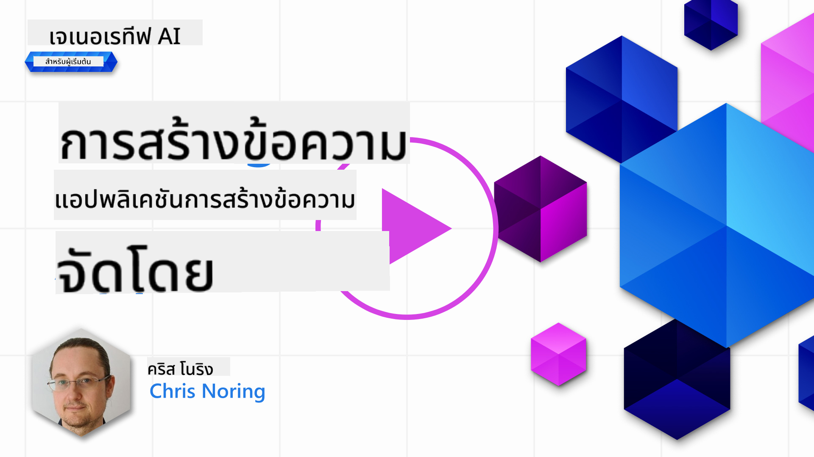

<!--
CO_OP_TRANSLATOR_METADATA:
{
  "original_hash": "df027997f1448323d6159b78a1b669bf",
  "translation_date": "2025-10-17T18:33:24+00:00",
  "source_file": "06-text-generation-apps/README.md",
  "language_code": "th"
}
-->
# การสร้างแอปพลิเคชันการสร้างข้อความ

[](https://youtu.be/0Y5Luf5sRQA?si=t_xVg0clnAI4oUFZ)

> _(คลิกที่ภาพด้านบนเพื่อดูวิดีโอของบทเรียนนี้)_

จนถึงตอนนี้คุณได้เห็นแนวคิดหลัก เช่น prompt และแม้กระทั่งศาสตร์ที่เรียกว่า "การออกแบบ prompt" เครื่องมือหลายอย่างที่คุณสามารถใช้งานได้ เช่น ChatGPT, Office 365, Microsoft Power Platform และอื่นๆ สนับสนุนการใช้ prompt เพื่อทำสิ่งต่างๆ

หากคุณต้องการเพิ่มประสบการณ์แบบนี้ลงในแอป คุณจำเป็นต้องเข้าใจแนวคิด เช่น prompt, completion และเลือกไลบรารีที่จะใช้งาน ซึ่งคุณจะได้เรียนรู้ในบทนี้

## บทนำ

ในบทนี้ คุณจะได้:

- เรียนรู้เกี่ยวกับไลบรารี openai และแนวคิดหลักของมัน
- สร้างแอปพลิเคชันการสร้างข้อความโดยใช้ openai
- เข้าใจวิธีการใช้แนวคิด เช่น prompt, temperature และ tokens เพื่อสร้างแอปพลิเคชันการสร้างข้อความ

## เป้าหมายการเรียนรู้

เมื่อจบบทเรียนนี้ คุณจะสามารถ:

- อธิบายว่าแอปพลิเคชันการสร้างข้อความคืออะไร
- สร้างแอปพลิเคชันการสร้างข้อความโดยใช้ openai
- ปรับแต่งแอปของคุณเพื่อใช้ tokens มากหรือน้อย และเปลี่ยน temperature เพื่อให้ได้ผลลัพธ์ที่หลากหลาย

## แอปพลิเคชันการสร้างข้อความคืออะไร?

โดยปกติเมื่อคุณสร้างแอป มันจะมีอินเทอร์เฟซบางอย่าง เช่น:

- **แบบคำสั่ง** แอปคอนโซลเป็นแอปทั่วไปที่คุณพิมพ์คำสั่งและมันจะดำเนินการตามคำสั่ง เช่น `git` เป็นแอปแบบคำสั่ง
- **อินเทอร์เฟซผู้ใช้ (UI)** แอปบางตัวมีอินเทอร์เฟซผู้ใช้แบบกราฟิก (GUI) ที่คุณคลิกปุ่ม, ป้อนข้อความ, เลือกตัวเลือก และอื่นๆ

### แอปแบบคอนโซลและ UI มีข้อจำกัด

เปรียบเทียบกับแอปแบบคำสั่งที่คุณพิมพ์คำสั่ง:

- **มีข้อจำกัด** คุณไม่สามารถพิมพ์คำสั่งใดๆ ได้ นอกจากคำสั่งที่แอปรองรับ
- **เฉพาะภาษา** แอปบางตัวรองรับหลายภาษา แต่โดยปกติแอปจะถูกสร้างขึ้นสำหรับภาษาเฉพาะ แม้ว่าคุณจะสามารถเพิ่มการรองรับภาษาอื่นได้

### ข้อดีของแอปพลิเคชันการสร้างข้อความ

แล้วแอปพลิเคชันการสร้างข้อความแตกต่างกันอย่างไร?

ในแอปพลิเคชันการสร้างข้อความ คุณมีความยืดหยุ่นมากขึ้น ไม่จำกัดเฉพาะชุดคำสั่งหรือภาษาป้อนข้อมูลเฉพาะ คุณสามารถใช้ภาษาธรรมชาติเพื่อโต้ตอบกับแอปได้ อีกทั้งคุณยังโต้ตอบกับแหล่งข้อมูลที่ได้รับการฝึกฝนจากข้อมูลจำนวนมาก ซึ่งแอปแบบดั้งเดิมอาจจำกัดเฉพาะข้อมูลในฐานข้อมูล

### คุณสามารถสร้างอะไรด้วยแอปพลิเคชันการสร้างข้อความ?

มีหลายสิ่งที่คุณสามารถสร้างได้ เช่น:

- **แชทบอท** แชทบอทที่ตอบคำถามเกี่ยวกับหัวข้อต่างๆ เช่น บริษัทของคุณและผลิตภัณฑ์ของมัน
- **ผู้ช่วย** LLMs เหมาะสำหรับการสรุปข้อความ, การวิเคราะห์ข้อมูลจากข้อความ, การสร้างข้อความ เช่น เรซูเม่ และอื่นๆ
- **ผู้ช่วยเขียนโค้ด** ขึ้นอยู่กับโมเดลภาษาที่คุณใช้ คุณสามารถสร้างผู้ช่วยเขียนโค้ดที่ช่วยคุณเขียนโค้ด เช่น ใช้ผลิตภัณฑ์อย่าง GitHub Copilot หรือ ChatGPT เพื่อช่วยคุณเขียนโค้ด

## ฉันจะเริ่มต้นได้อย่างไร?

คุณต้องหาวิธีการเชื่อมต่อกับ LLM ซึ่งโดยปกติจะมีสองวิธี:

- ใช้ API โดยการสร้างคำขอเว็บพร้อม prompt ของคุณและรับข้อความที่สร้างกลับมา
- ใช้ไลบรารี ไลบรารีช่วยให้การเรียก API ง่ายขึ้น

## ไลบรารี/SDKs

มีไลบรารีที่เป็นที่รู้จักสำหรับการทำงานกับ LLMs เช่น:

- **openai** ไลบรารีนี้ทำให้การเชื่อมต่อกับโมเดลและการส่ง prompt ง่ายขึ้น

นอกจากนี้ยังมีไลบรารีที่ทำงานในระดับสูงกว่า เช่น:

- **Langchain** เป็นที่รู้จักกันดีและรองรับ Python
- **Semantic Kernel** เป็นไลบรารีของ Microsoft ที่รองรับภาษา C#, Python และ Java

## แอปแรกโดยใช้ openai

มาดูกันว่าเราจะสร้างแอปแรกได้อย่างไร ไลบรารีที่เราต้องการ และสิ่งที่จำเป็น

### ติดตั้ง openai

มีไลบรารีมากมายสำหรับการโต้ตอบกับ OpenAI หรือ Azure OpenAI คุณสามารถใช้ภาษาโปรแกรมต่างๆ เช่น C#, Python, JavaScript, Java และอื่นๆ เราเลือกใช้ไลบรารี Python `openai` ดังนั้นเราจะใช้ `pip` เพื่อติดตั้งมัน

```bash
pip install openai
```

### สร้างทรัพยากร

คุณต้องดำเนินการตามขั้นตอนต่อไปนี้:

- สร้างบัญชีบน Azure [https://azure.microsoft.com/free/](https://azure.microsoft.com/free/?WT.mc_id=academic-105485-koreyst)
- เข้าถึง Azure OpenAI ไปที่ [https://learn.microsoft.com/azure/ai-services/openai/overview#how-do-i-get-access-to-azure-openai](https://learn.microsoft.com/azure/ai-services/openai/overview#how-do-i-get-access-to-azure-openai?WT.mc_id=academic-105485-koreyst) และขอการเข้าถึง

  > [!NOTE]
  > ณ เวลาที่เขียน คุณต้องสมัครเพื่อเข้าถึง Azure OpenAI

- ติดตั้ง Python <https://www.python.org/>
- สร้างทรัพยากร Azure OpenAI Service ดูคำแนะนำนี้สำหรับวิธีการ [สร้างทรัพยากร](https://learn.microsoft.com/azure/ai-services/openai/how-to/create-resource?pivots=web-portal?WT.mc_id=academic-105485-koreyst)

### ค้นหา API key และ endpoint

ในขั้นตอนนี้ คุณต้องบอกไลบรารี `openai` ว่าจะใช้ API key ใด ในการค้นหา API key ของคุณ ไปที่ส่วน "Keys and Endpoint" ของทรัพยากร Azure OpenAI และคัดลอกค่า "Key 1"


เมื่อคุณคัดลอกข้อมูลนี้แล้ว มาบอกไลบรารีให้ใช้งานมัน

> [!NOTE]
> ควรแยก API key ของคุณออกจากโค้ด คุณสามารถทำได้โดยใช้ environment variables
>
> - ตั้งค่า environment variable `OPENAI_API_KEY` เป็น API key ของคุณ
>   `export OPENAI_API_KEY='sk-...'`

### ตั้งค่าการกำหนดค่า Azure

หากคุณใช้ Azure OpenAI นี่คือวิธีการตั้งค่าการกำหนดค่า:

```python
openai.api_type = 'azure'
openai.api_key = os.environ["OPENAI_API_KEY"]
openai.api_version = '2023-05-15'
openai.api_base = os.getenv("API_BASE")
```

ในโค้ดด้านบน เรากำลังตั้งค่าดังนี้:

- `api_type` เป็น `azure` ซึ่งบอกไลบรารีให้ใช้ Azure OpenAI แทน OpenAI
- `api_key` คือ API key ของคุณที่พบใน Azure Portal
- `api_version` คือเวอร์ชันของ API ที่คุณต้องการใช้ ณ เวลาที่เขียน เวอร์ชันล่าสุดคือ `2023-05-15`
- `api_base` คือ endpoint ของ API คุณสามารถค้นหาได้ใน Azure Portal ถัดจาก API key ของคุณ

> [!NOTE] > `os.getenv` เป็นฟังก์ชันที่อ่าน environment variables คุณสามารถใช้มันเพื่ออ่าน environment variables เช่น `OPENAI_API_KEY` และ `API_BASE` ตั้งค่า environment variables เหล่านี้ใน terminal ของคุณหรือโดยใช้ไลบรารี เช่น `dotenv`

## สร้างข้อความ

วิธีการสร้างข้อความคือการใช้คลาส `Completion` นี่คือตัวอย่าง:

```python
prompt = "Complete the following: Once upon a time there was a"

completion = openai.Completion.create(model="davinci-002", prompt=prompt)
print(completion.choices[0].text)
```

ในโค้ดด้านบน เราสร้าง completion object และส่งโมเดลที่เราต้องการใช้และ prompt จากนั้นเราพิมพ์ข้อความที่สร้างขึ้น

### การสร้างข้อความแบบแชท

จนถึงตอนนี้ คุณได้เห็นว่าเราใช้ `Completion` เพื่อสร้างข้อความ แต่ยังมีคลาสอีกตัวที่เรียกว่า `ChatCompletion` ซึ่งเหมาะสำหรับแชทบอทมากกว่า นี่คือตัวอย่างการใช้งาน:

```python
import openai

openai.api_key = "sk-..."

completion = openai.ChatCompletion.create(model="gpt-3.5-turbo", messages=[{"role": "user", "content": "Hello world"}])
print(completion.choices[0].message.content)
```

ฟังก์ชันนี้จะมีการอธิบายเพิ่มเติมในบทถัดไป

## แบบฝึกหัด - แอปพลิเคชันการสร้างข้อความแรกของคุณ

ตอนนี้เราได้เรียนรู้วิธีการตั้งค่าและกำหนดค่า openai แล้ว ถึงเวลาสร้างแอปพลิเคชันการสร้างข้อความแรกของคุณ ในการสร้างแอปของคุณ ให้ทำตามขั้นตอนต่อไปนี้:

1. สร้าง virtual environment และติดตั้ง openai:

   ```bash
   python -m venv venv
   source venv/bin/activate
   pip install openai
   ```

   > [!NOTE]
   > หากคุณใช้ Windows ให้พิมพ์ `venv\Scripts\activate` แทน `source venv/bin/activate`

   > [!NOTE]
   > ค้นหา Azure OpenAI key ของคุณโดยไปที่ [https://portal.azure.com/](https://portal.azure.com/?WT.mc_id=academic-105485-koreyst) และค้นหา `Open AI` จากนั้นเลือก `Open AI resource` และเลือก `Keys and Endpoint` และคัดลอกค่า `Key 1`

1. สร้างไฟล์ _app.py_ และใส่โค้ดต่อไปนี้:

   ```python
   import openai

   openai.api_key = "<replace this value with your open ai key or Azure OpenAI key>"

   openai.api_type = 'azure'
   openai.api_version = '2023-05-15'
   openai.api_base = "<endpoint found in Azure Portal where your API key is>"
   deployment_name = "<deployment name>"

   # add your completion code
   prompt = "Complete the following: Once upon a time there was a"
   messages = [{"role": "user", "content": prompt}]

   # make completion
   completion = openai.chat.completions.create(model=deployment_name, messages=messages)

   # print response
   print(completion.choices[0].message.content)
   ```

   > [!NOTE]
   > หากคุณใช้ Azure OpenAI คุณต้องตั้งค่า `api_type` เป็น `azure` และตั้งค่า `api_key` เป็น Azure OpenAI key ของคุณ

   คุณควรเห็นผลลัพธ์ที่คล้ายกับ:

   ```output
    very unhappy _____.

   Once upon a time there was a very unhappy mermaid.
   ```

## ประเภทของ prompt สำหรับสิ่งต่างๆ

ตอนนี้คุณได้เห็นวิธีการสร้างข้อความโดยใช้ prompt คุณมีโปรแกรมที่ทำงานได้ซึ่งคุณสามารถปรับเปลี่ยนและเปลี่ยนแปลงเพื่อสร้างข้อความประเภทต่างๆ

Prompt สามารถใช้สำหรับงานต่างๆ ได้ เช่น:

- **สร้างข้อความประเภทต่างๆ** เช่น คุณสามารถสร้างบทกวี คำถามสำหรับแบบทดสอบ เป็นต้น
- **ค้นหาข้อมูล** คุณสามารถใช้ prompt เพื่อค้นหาข้อมูล เช่น 'CORS หมายถึงอะไรในเว็บดีเวลลอปเมนต์?'
- **สร้างโค้ด** คุณสามารถใช้ prompt เพื่อสร้างโค้ด เช่น การพัฒนา regular expression ที่ใช้ตรวจสอบอีเมล หรือแม้กระทั่งสร้างโปรแกรมทั้งหมด เช่น เว็บแอปพลิเคชัน

## กรณีการใช้งานที่เป็นประโยชน์มากขึ้น: ตัวสร้างสูตรอาหาร

ลองจินตนาการว่าคุณมีวัตถุดิบอยู่ที่บ้านและต้องการทำอาหาร สำหรับสิ่งนั้นคุณต้องมีสูตรอาหาร วิธีหนึ่งในการหาสูตรอาหารคือการใช้เครื่องมือค้นหา หรือคุณสามารถใช้ LLM เพื่อทำเช่นนั้น

คุณสามารถเขียน prompt เช่นนี้:

> "แสดงสูตรอาหาร 5 สูตรสำหรับจานที่มีวัตถุดิบดังนี้: ไก่, มันฝรั่ง และแครอท ในแต่ละสูตรให้ระบุวัตถุดิบทั้งหมดที่ใช้"

จาก prompt ด้านบน คุณอาจได้รับคำตอบที่คล้ายกับ:

```output
1. Roasted Chicken and Vegetables:
Ingredients:
- 4 chicken thighs
- 2 potatoes, cut into cubes
- 2 carrots, cut into cubes
- 2 tablespoons olive oil
- 2 cloves garlic, minced
- 1 teaspoon dried thyme
- 1 teaspoon dried oregano
- Salt and pepper, to taste

2. Chicken and Potato Stew:
Ingredients:
- 2 tablespoons olive oil
- 1 onion, diced
- 2 cloves garlic, minced
- 2 chicken breasts, cut into cubes
- 2 potatoes, cut into cubes
- 2 carrots, cut into cubes
- 1 teaspoon dried oregano
- 1 teaspoon dried thyme
- 1 cup chicken broth
- Salt and pepper, to taste

3. Chicken and Potato Bake:
Ingredients:
- 2 tablespoons olive oil
- 2 chicken breasts, cut into cubes
- 2 potatoes, cut into cubes
- 2 carrots, cut into cubes
- 1 onion, diced
- 2 cloves garlic, minced
- 1 teaspoon dried oregano
- 1 teaspoon dried thyme
- 1 cup chicken broth
- Salt and pepper, to taste

4. Chicken and Potato Soup:
Ingredients:
- 2 tablespoons olive oil
- 1 onion, diced
- 2 cloves garlic, minced
- 2 chicken breasts, cut into cubes
- 2 potatoes, cut into cubes
- 2 carrots, cut into cubes
- 1 teaspoon dried oregano
- 1 teaspoon dried thyme
- 4 cups chicken broth
- Salt and pepper, to taste

5. Chicken and Potato Hash:
Ingredients:
- 2 tablespoons olive oil
- 2 chicken breasts, cut into cubes
- 2 potatoes, cut into cubes
- 2 carrots, cut into cubes
- 1 onion, diced
- 2 cloves garlic, minced
- 1 teaspoon dried oregano
```

ผลลัพธ์นี้ดีมาก ฉันรู้แล้วว่าจะทำอะไร ตอนนี้สิ่งที่อาจเป็นการปรับปรุงที่มีประโยชน์คือ:

- กรองวัตถุดิบที่ฉันไม่ชอบหรือแพ้
- สร้างรายการซื้อของในกรณีที่ฉันไม่มีวัตถุดิบทั้งหมดที่บ้าน

สำหรับกรณีดังกล่าว มาลองเพิ่ม prompt เพิ่มเติม:

> "กรุณาลบสูตรอาหารที่มีส่วนผสมของกระเทียมเพราะฉันแพ้ และเปลี่ยนเป็นอย่างอื่น นอกจากนี้กรุณาสร้างรายการซื้อของสำหรับสูตรอาหาร โดยพิจารณาว่าฉันมีไก่, มันฝรั่ง และแครอทอยู่ที่บ้านแล้ว"

ตอนนี้คุณจะได้ผลลัพธ์ใหม่ ได้แก่:

```output
1. Roasted Chicken and Vegetables:
Ingredients:
- 4 chicken thighs
- 2 potatoes, cut into cubes
- 2 carrots, cut into cubes
- 2 tablespoons olive oil
- 1 teaspoon dried thyme
- 1 teaspoon dried oregano
- Salt and pepper, to taste

2. Chicken and Potato Stew:
Ingredients:
- 2 tablespoons olive oil
- 1 onion, diced
- 2 chicken breasts, cut into cubes
- 2 potatoes, cut into cubes
- 2 carrots, cut into cubes
- 1 teaspoon dried oregano
- 1 teaspoon dried thyme
- 1 cup chicken broth
- Salt and pepper, to taste

3. Chicken and Potato Bake:
Ingredients:
- 2 tablespoons olive oil
- 2 chicken breasts, cut into cubes
- 2 potatoes, cut into cubes
- 2 carrots, cut into cubes
- 1 onion, diced
- 1 teaspoon dried oregano
- 1 teaspoon dried thyme
- 1 cup chicken broth
- Salt and pepper, to taste

4. Chicken and Potato Soup:
Ingredients:
- 2 tablespoons olive oil
- 1 onion, diced
- 2 chicken breasts, cut into cubes
- 2 potatoes, cut into cubes
- 2 carrots, cut into cubes
- 1 teaspoon dried oregano
- 1 teaspoon dried thyme
- 4 cups chicken broth
- Salt and pepper, to taste

5. Chicken and Potato Hash:
Ingredients:
- 2 tablespoons olive oil
- 2 chicken breasts, cut into cubes
- 2 potatoes, cut into cubes
- 2 carrots, cut into cubes
- 1 onion, diced
- 1 teaspoon dried oregano

Shopping List:
- Olive oil
- Onion
- Thyme
- Oregano
- Salt
- Pepper
```

นี่คือสูตรอาหารทั้งห้าสูตรที่ไม่มีการกล่าวถึงกระเทียม และคุณยังมีรายการซื้อของที่พิจารณาว่าคุณมีวัตถุดิบที่บ้านแล้ว

## แบบฝึกหัด - สร้างตัวสร้างสูตรอาหาร

ตอนนี้เราได้ลองเล่นสถานการณ์แล้ว มาลองเขียนโค้ดให้ตรงกับสถานการณ์ที่แสดงไว้กันเถอะ ในการทำเช่นนั้น ให้ทำตามขั้นตอนต่อไปนี้:

1. ใช้ไฟล์ _app.py_ ที่มีอยู่เป็นจุดเริ่มต้น
1. ค้นหา `prompt` variable และเปลี่ยนโค้ดเป็นดังนี้:

   ```python
   prompt = "Show me 5 recipes for a dish with the following ingredients: chicken, potatoes, and carrots. Per recipe, list all the ingredients used"
   ```

   หากคุณรันโค้ดตอนนี้ คุณควรเห็นผลลัพธ์ที่คล้ายกับ:

   ```output
   -Chicken Stew with Potatoes and Carrots: 3 tablespoons oil, 1 onion, chopped, 2 cloves garlic, minced, 1 carrot, peeled and chopped, 1 potato, peeled and chopped, 1 bay leaf, 1 thyme sprig, 1/2 teaspoon salt, 1/4 teaspoon black pepper, 1 1/2 cups chicken broth, 1/2 cup dry white wine, 2 tablespoons chopped fresh parsley, 2 tablespoons unsalted butter, 1 1/2 pounds boneless, skinless chicken thighs, cut into 1-inch pieces
   -Oven-Roasted Chicken with Potatoes and Carrots: 3 tablespoons extra-virgin olive oil, 1 tablespoon Dijon mustard, 1 tablespoon chopped fresh rosemary, 1 tablespoon chopped fresh thyme, 4 cloves garlic, minced, 1 1/2 pounds small red potatoes, quartered, 1 1/2 pounds carrots, quartered lengthwise, 1/2 teaspoon salt, 1/4 teaspoon black pepper, 1 (4-pound) whole chicken
   -Chicken, Potato, and Carrot Casserole: cooking spray, 1 large onion, chopped, 2 cloves garlic, minced, 1 carrot, peeled and shredded, 1 potato, peeled and shredded, 1/2 teaspoon dried thyme leaves, 1/4 teaspoon salt, 1/4 teaspoon black pepper, 2 cups fat-free, low-sodium chicken broth, 1 cup frozen peas, 1/4 cup all-purpose flour, 1 cup 2% reduced-fat milk, 1/4 cup grated Parmesan cheese

   -One Pot Chicken and Potato Dinner: 2 tablespoons olive oil, 1 pound boneless, skinless chicken thighs, cut into 1-inch pieces, 1 large onion, chopped, 3 cloves garlic, minced, 1 carrot, peeled and chopped, 1 potato, peeled and chopped, 1 bay leaf, 1 thyme sprig, 1/2 teaspoon salt, 1/4 teaspoon black pepper, 2 cups chicken broth, 1/2 cup dry white wine

   -Chicken, Potato, and Carrot Curry: 1 tablespoon vegetable oil, 1 large onion, chopped, 2 cloves garlic, minced, 1 carrot, peeled and chopped, 1 potato, peeled and chopped, 1 teaspoon ground coriander, 1 teaspoon ground cumin, 1/2 teaspoon ground turmeric, 1/2 teaspoon ground ginger, 1/4 teaspoon cayenne pepper, 2 cups chicken broth, 1/2 cup dry white wine, 1 (15-ounce) can chickpeas, drained and rinsed, 1/2 cup raisins, 1/2 cup chopped fresh cilantro
   ```

   > NOTE, LLM ของคุณมีความไม่แน่นอน ดังนั้นคุณอาจได้รับผลลัพธ์ที่แตกต่างกันทุกครั้งที่คุณรันโปรแกรม

   ดีมาก มาดูกันว่าเราสามารถปรับปรุงอะไรได้บ้าง เพื่อปรับปรุง เราต้องการให้แน่ใจว่าโค้ดมีความยืดหยุ่น ดังนั้นวัตถุดิบและจำนวนสูตรอาหารสามารถปรับปรุงและเปลี่ยนแปลงได้

1. มาปรับเปลี่ยนโค้ดในลักษณะดังนี้:

   ```python
   no_recipes = input("No of recipes (for example, 5): ")

   ingredients = input("List of ingredients (for example, chicken, potatoes, and carrots): ")

   # interpolate the number of recipes into the prompt an ingredients
   prompt = f"Show me {no_recipes} recipes for a dish with the following ingredients: {ingredients}. Per recipe, list all the ingredients used"
   ```

   การทดสอบโค้ดอาจมีลักษณะดังนี้:

   ```output
   No of recipes (for example, 5): 3
   List of ingredients (for example, chicken, potatoes, and carrots): milk,strawberries

   -Strawberry milk shake: milk, strawberries, sugar, vanilla extract, ice cubes
   -Strawberry shortcake: milk, flour, baking powder, sugar, salt, unsalted butter, strawberries, whipped cream
   -Strawberry milk: milk, strawberries, sugar, vanilla extract
   ```

### ปรับปรุงโดยการเพิ่มตัวกรองและรายการซื้อของ

ตอนนี้เรามีแอปที่ทำงานได้ซึ่งสามารถสร้างสูตรอาหารและมีความยืดหยุ่นเนื่องจากอาศัยข้อมูลจากผู้ใช้ ทั้งจำนวนสูตรอาหารและวัตถุดิบที่ใช้

เพื่อปรับปรุงเพิ่มเติม เราต้องการเพิ่มสิ่งต่อไปนี้:

- **กรองวัตถุดิบ** เราต้องการสามารถกรองวัตถุดิบที่เราไม่ชอบหรือแพ้ได้ เพื่อทำการเปลี่ยนแปลงนี้ เราสามารถแก้ไข prompt ที่มีอยู่และเพิ่มเงื่อนไขการกรองในตอนท้าย เช่น:

  ```python
  filter = input("Filter (for example, vegetarian, vegan, or gluten-free): ")

  prompt = f"Show me {no_recipes} recipes for a dish with the following ingredients: {ingredients}. Per recipe, list all the ingredients used, no {filter}"
  ```

  ด้านบน เราเพิ่ม `{filter}` ไปที่ท้าย prompt และเรายังจับค่าตัวกรองจากผู้ใช้

  ตัวอย่างการป้อนข้อมูลของการรันโปรแกรมตอนนี้อาจมีลักษณะดังนี้:

  ```output
  No of recipes (for example, 5): 3
  List of ingredients (for example, chicken, potatoes, and carrots): onion,milk
  Filter (for example, vegetarian, vegan, or gluten-free): no milk

  1. French Onion Soup

  Ingredients:

  -1 large onion, sliced
  -3 cups beef broth
  -1 cup milk
  -6 slices french bread
  -1/4 cup shredded Parmesan cheese
  -1 tablespoon butter
  -1 teaspoon dried thyme
  -1/4 teaspoon salt
  -1/4 teaspoon black pepper

  Instructions:

  1. In a large pot, sauté onions in butter until golden brown.
  2. Add beef broth, milk, thyme, salt, and pepper. Bring to a boil.
  3. Reduce heat and simmer for 10 minutes.
  4. Place french bread slices on soup bowls.
  5. Ladle soup over bread.
  6. Sprinkle with Parmesan cheese.

  2. Onion and Potato Soup

  Ingredients:

  -1 large onion, chopped
  -2 cups potatoes, diced
  -3 cups vegetable broth
  -1 cup milk
  -1/4 teaspoon black pepper

  Instructions:

  1. In a large pot, sauté onions in butter until golden brown.
  2. Add potatoes, vegetable broth, milk, and pepper. Bring to a boil.
  3. Reduce heat and simmer for 10 minutes.
  4. Serve hot.

  3. Creamy Onion Soup

  Ingredients:

  -1 large onion, chopped
  -3 cups vegetable broth
  -1 cup milk
  -1/4 teaspoon black pepper
  -1/4 cup all-purpose flour
  -1/2 cup shredded Parmesan cheese

  Instructions:

  1. In a large pot, sauté onions in butter until golden brown.
  2. Add vegetable broth, milk, and pepper. Bring to a boil.
  3. Reduce heat and simmer for 10 minutes.
  4. In a small bowl, whisk together flour and Parmesan cheese until smooth.
  5. Add to soup and simmer for an additional 5 minutes, or until soup has thickened.
  ```

  ดังที่คุณเห็น สูตรอาหารที่มีนมถูกกรองออกไป แต่หากคุณแพ้แลคโตส คุณอาจต้องการกรองสูตรอาหารที่มีชีสด้วย ดังนั้นจึงจำเป็นต้องระบุให้ชัดเจน

- **สร้างรายการซื้อของ** เราต้องการสร้างรายการซื้อของ โดยพิจารณาว่าสิ่งที่เรามีอยู่ที่บ้านแล้ว

  สำหรับฟังก์ชันนี้ เราสามารถลองแก้ปัญหาทั้งหมดใน prompt เดียว หรือเราสามารถแบ่งออกเป็นสอง prompt ลองใช้วิธีหลังกัน ในที่นี้เราแนะนำให้เพิ่ม prompt เพิ่มเติม แต่สำหรับการทำงานนั้น เราต้องเพิ่มผลลัพธ์ของ prompt ก่อนหน้าเป็นบริบทให้กับ prompt ถัดไป

  ค้นหาส่วนในโค้ดที่พิมพ์ผลลัพธ์จาก prompt แรกและเพิ่มโค้ดต่อไปนี้ด้านล่าง:
  ```python
  old_prompt_result = completion.choices[0].message.content
  prompt = "Produce a shopping list for the generated recipes and please don't include ingredients that I already have."

  new_prompt = f"{old_prompt_result} {prompt}"
  messages = [{"role": "user", "content": new_prompt}]
  completion = openai.Completion.create(engine=deployment_name, messages=messages, max_tokens=1200)

  # print response
  print("Shopping list:")
  print(completion.choices[0].message.content)
  ```

  โปรดทราบสิ่งต่อไปนี้:

  1. เรากำลังสร้าง prompt ใหม่โดยเพิ่มผลลัพธ์จาก prompt แรกเข้าไปใน prompt ใหม่:

     ```python
     new_prompt = f"{old_prompt_result} {prompt}"
     ```

  1. เราทำการร้องขอใหม่ แต่ยังคำนึงถึงจำนวน tokens ที่เราใช้ใน prompt แรก ดังนั้นครั้งนี้เราจึงตั้งค่า `max_tokens` เป็น 1200

     ```python
     completion = openai.Completion.create(engine=deployment_name, prompt=new_prompt, max_tokens=1200)
     ```

     เมื่อทดลองใช้โค้ดนี้ เราจะได้ผลลัพธ์ดังต่อไปนี้:

     ```output
     No of recipes (for example, 5): 2
     List of ingredients (for example, chicken, potatoes, and carrots): apple,flour
     Filter (for example, vegetarian, vegan, or gluten-free): sugar


     -Apple and flour pancakes: 1 cup flour, 1/2 tsp baking powder, 1/2 tsp baking soda, 1/4 tsp salt, 1 tbsp sugar, 1 egg, 1 cup buttermilk or sour milk, 1/4 cup melted butter, 1 Granny Smith apple, peeled and grated
     -Apple fritters: 1-1/2 cups flour, 1 tsp baking powder, 1/4 tsp salt, 1/4 tsp baking soda, 1/4 tsp nutmeg, 1/4 tsp cinnamon, 1/4 tsp allspice, 1/4 cup sugar, 1/4 cup vegetable shortening, 1/4 cup milk, 1 egg, 2 cups shredded, peeled apples
     Shopping list:
     -Flour, baking powder, baking soda, salt, sugar, egg, buttermilk, butter, apple, nutmeg, cinnamon, allspice
     ```

## ปรับปรุงการตั้งค่าของคุณ

สิ่งที่เรามีตอนนี้คือโค้ดที่ใช้งานได้ แต่ยังมีการปรับแต่งบางอย่างที่เราควรทำเพื่อปรับปรุงให้ดียิ่งขึ้น สิ่งที่เราควรทำได้แก่:

- **แยกข้อมูลลับออกจากโค้ด** เช่น API key ข้อมูลลับไม่ควรอยู่ในโค้ดและควรเก็บไว้ในที่ปลอดภัย เพื่อแยกข้อมูลลับออกจากโค้ด เราสามารถใช้ environment variables และไลบรารีอย่าง `python-dotenv` เพื่อโหลดข้อมูลจากไฟล์ วิธีการในโค้ดจะเป็นดังนี้:

  1. สร้างไฟล์ `.env` โดยมีเนื้อหาดังนี้:

     ```bash
     OPENAI_API_KEY=sk-...
     ```

     > หมายเหตุ สำหรับ Azure คุณต้องตั้งค่า environment variables ดังนี้:

     ```bash
     OPENAI_API_TYPE=azure
     OPENAI_API_VERSION=2023-05-15
     OPENAI_API_BASE=<replace>
     ```

     ในโค้ด คุณจะโหลด environment variables ดังนี้:

     ```python
     from dotenv import load_dotenv

     load_dotenv()

     openai.api_key = os.environ["OPENAI_API_KEY"]
     ```

- **เรื่องของความยาว token** เราควรพิจารณาว่าเราต้องการ token จำนวนเท่าใดเพื่อสร้างข้อความที่เราต้องการ Token มีค่าใช้จ่าย ดังนั้นเราควรพยายามใช้ token อย่างประหยัดที่สุดเท่าที่จะทำได้ ตัวอย่างเช่น เราสามารถปรับ prompt เพื่อใช้ token น้อยลงได้หรือไม่?

  ในการเปลี่ยนจำนวน token ที่ใช้ คุณสามารถใช้พารามิเตอร์ `max_tokens` ตัวอย่างเช่น หากคุณต้องการใช้ 100 token คุณจะตั้งค่าได้ดังนี้:

  ```python
  completion = client.chat.completions.create(model=deployment, messages=messages, max_tokens=100)
  ```

- **ทดลองปรับค่า temperature** Temperature เป็นสิ่งที่เรายังไม่ได้พูดถึง แต่มีความสำคัญต่อการทำงานของโปรแกรมเรา ค่า temperature ที่สูงขึ้นจะทำให้ผลลัพธ์มีความสุ่มมากขึ้น ในทางกลับกัน ค่า temperature ที่ต่ำลงจะทำให้ผลลัพธ์มีความคาดเดาได้มากขึ้น ลองพิจารณาว่าคุณต้องการความหลากหลายในผลลัพธ์หรือไม่

  ในการปรับค่า temperature คุณสามารถใช้พารามิเตอร์ `temperature` ตัวอย่างเช่น หากคุณต้องการใช้ค่า temperature เป็น 0.5 คุณจะตั้งค่าได้ดังนี้:

  ```python
  completion = client.chat.completions.create(model=deployment, messages=messages, temperature=0.5)
  ```

  > หมายเหตุ ค่า temperature ที่ใกล้ 1.0 จะทำให้ผลลัพธ์มีความหลากหลายมากขึ้น

## งานที่ได้รับมอบหมาย

สำหรับงานนี้ คุณสามารถเลือกสิ่งที่ต้องการสร้างได้

นี่คือตัวอย่างบางส่วน:

- ปรับปรุงแอปสร้างสูตรอาหารให้ดียิ่งขึ้น ลองปรับค่า temperature และ prompt เพื่อดูว่าคุณสามารถสร้างอะไรได้บ้าง
- สร้าง "เพื่อนช่วยเรียน" แอปนี้ควรสามารถตอบคำถามเกี่ยวกับหัวข้อ เช่น Python คุณสามารถมี prompt เช่น "หัวข้อหนึ่งใน Python คืออะไร?" หรือคุณสามารถมี prompt ที่บอกว่า แสดงโค้ดสำหรับหัวข้อหนึ่ง เป็นต้น
- บอทประวัติศาสตร์ ทำให้ประวัติศาสตร์มีชีวิตชีวา สั่งให้บอทเล่นเป็นตัวละครในประวัติศาสตร์และถามคำถามเกี่ยวกับชีวิตและยุคสมัยของตัวละครนั้น

## วิธีแก้ปัญหา

### เพื่อนช่วยเรียน

ด้านล่างนี้คือ prompt เริ่มต้น ลองดูว่าคุณสามารถใช้และปรับแต่งให้เหมาะกับคุณได้อย่างไร

```text
- "You're an expert on the Python language

    Suggest a beginner lesson for Python in the following format:

    Format:
    - concepts:
    - brief explanation of the lesson:
    - exercise in code with solutions"
```

### บอทประวัติศาสตร์

นี่คือตัวอย่าง prompt ที่คุณสามารถใช้ได้:

```text
- "You are Abe Lincoln, tell me about yourself in 3 sentences, and respond using grammar and words like Abe would have used"
- "You are Abe Lincoln, respond using grammar and words like Abe would have used:

   Tell me about your greatest accomplishments, in 300 words"
```

## ทดสอบความรู้

Temperature มีผลต่ออะไร?

1. ควบคุมความสุ่มของผลลัพธ์
1. ควบคุมขนาดของการตอบกลับ
1. ควบคุมจำนวน token ที่ใช้

## 🚀 ความท้าทาย

เมื่อทำงานในงานที่ได้รับมอบหมาย ลองปรับค่า temperature โดยตั้งค่าเป็น 0, 0.5 และ 1 จำไว้ว่าค่า 0 มีความหลากหลายน้อยที่สุด และค่า 1 มีความหลากหลายมากที่สุด ค่าใดที่เหมาะสมที่สุดสำหรับแอปของคุณ?

## ทำได้ดีมาก! เรียนรู้ต่อไป

หลังจากจบบทเรียนนี้ ลองดู [Generative AI Learning collection](https://aka.ms/genai-collection?WT.mc_id=academic-105485-koreyst) เพื่อเพิ่มพูนความรู้เกี่ยวกับ Generative AI ของคุณ!

ไปที่บทเรียนที่ 7 ซึ่งเราจะเรียนรู้วิธี [สร้างแอปพลิเคชันแชท](../07-building-chat-applications/README.md?WT.mc_id=academic-105485-koreyst)!

---

**ข้อจำกัดความรับผิดชอบ**:  
เอกสารนี้ได้รับการแปลโดยใช้บริการแปลภาษา AI [Co-op Translator](https://github.com/Azure/co-op-translator) แม้ว่าเราจะพยายามให้การแปลมีความถูกต้อง แต่โปรดทราบว่าการแปลอัตโนมัติอาจมีข้อผิดพลาดหรือความไม่ถูกต้อง เอกสารต้นฉบับในภาษาดั้งเดิมควรถือเป็นแหล่งข้อมูลที่เชื่อถือได้ สำหรับข้อมูลที่สำคัญ ขอแนะนำให้ใช้บริการแปลภาษามนุษย์ที่มีความเชี่ยวชาญ เราไม่รับผิดชอบต่อความเข้าใจผิดหรือการตีความผิดที่เกิดจากการใช้การแปลนี้