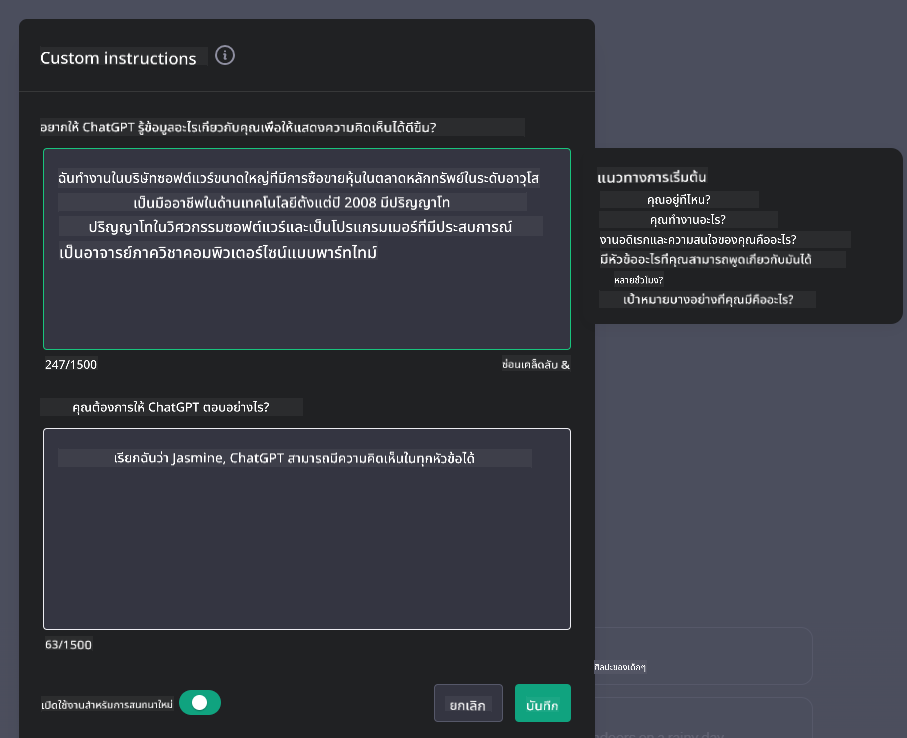
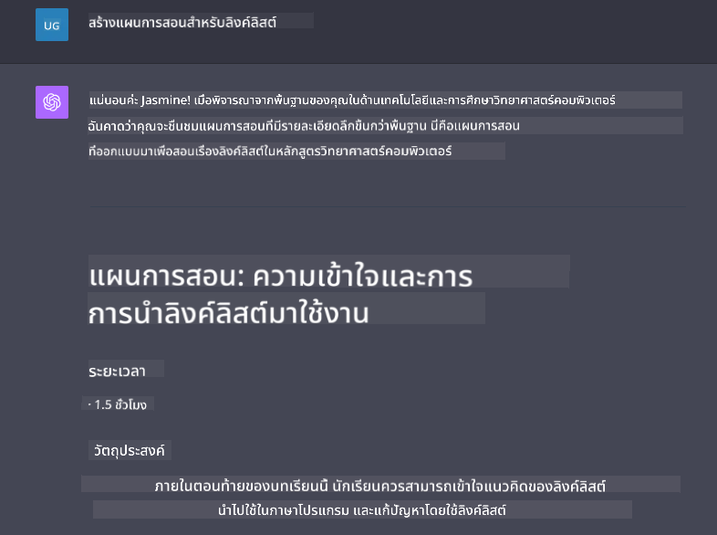

<!--
CO_OP_TRANSLATOR_METADATA:
{
  "original_hash": "ea4bbe640847aafbbba14dae4625e9af",
  "translation_date": "2025-05-19T17:52:26+00:00",
  "source_file": "07-building-chat-applications/README.md",
  "language_code": "th"
}
-->
# การสร้างแอปพลิเคชันแชทที่ขับเคลื่อนด้วย Generative AI

[](https://aka.ms/gen-ai-lessons7-gh?WT.mc_id=academic-105485-koreyst)

> _(คลิกที่ภาพด้านบนเพื่อดูวิดีโอของบทเรียนนี้)_

ตอนนี้เราได้เห็นแล้วว่าเราสามารถสร้างแอปพลิเคชันที่สร้างข้อความได้อย่างไร ลองมาดูแอปพลิเคชันแชทกันบ้าง

แอปพลิเคชันแชทได้กลายเป็นส่วนหนึ่งของชีวิตประจำวันของเรา ไม่เพียงแค่ใช้สำหรับการสนทนาทั่วไปเท่านั้น แต่ยังเป็นส่วนสำคัญของการบริการลูกค้า การสนับสนุนด้านเทคนิค และระบบที่ปรึกษาที่ซับซ้อนอีกด้วย เป็นไปได้ว่าคุณเคยได้รับความช่วยเหลือจากแอปพลิเคชันแชทไม่นานมานี้ เมื่อเรานำเทคโนโลยีที่ล้ำสมัยอย่าง Generative AI เข้ามาผสมผสาน ความซับซ้อนก็จะเพิ่มขึ้นและความท้าทายก็จะเพิ่มขึ้นด้วย

คำถามบางข้อที่เราต้องการคำตอบคือ:

- **การสร้างแอป**. เราจะสร้างและผสานรวมแอปพลิเคชันที่ขับเคลื่อนด้วย AI เหล่านี้สำหรับกรณีการใช้งานเฉพาะได้อย่างไรอย่างมีประสิทธิภาพ?
- **การตรวจสอบ**. เมื่อใช้งานแล้ว เราจะตรวจสอบและมั่นใจได้อย่างไรว่าแอปพลิเคชันทำงานในระดับคุณภาพสูงสุด ทั้งในด้านการทำงานและการปฏิบัติตาม [หลักการหกข้อของ AI ที่รับผิดชอบ](https://www.microsoft.com/ai/responsible-ai?WT.mc_id=academic-105485-koreyst)?

เมื่อเราเข้าสู่ยุคที่นิยามโดยระบบอัตโนมัติและการโต้ตอบระหว่างมนุษย์กับเครื่องจักรที่ราบรื่น การเข้าใจว่า Generative AI เปลี่ยนแปลงขอบเขต ความลึก และความสามารถในการปรับตัวของแอปพลิเคชันแชทอย่างไรจึงเป็นสิ่งสำคัญ บทเรียนนี้จะตรวจสอบแง่มุมของสถาปัตยกรรมที่สนับสนุนระบบที่ซับซ้อนเหล่านี้ เจาะลึกวิธีการในการปรับแต่งให้เหมาะสมกับงานเฉพาะด้าน และประเมินตัวชี้วัดและข้อควรพิจารณาที่เกี่ยวข้องกับการใช้งาน AI อย่างรับผิดชอบ

## บทนำ

บทเรียนนี้ครอบคลุม:

- เทคนิคในการสร้างและผสานรวมแอปพลิเคชันแชทอย่างมีประสิทธิภาพ
- วิธีการปรับแต่งและปรับจูนแอปพลิเคชัน
- กลยุทธ์และข้อควรพิจารณาในการตรวจสอบแอปพลิเคชันแชทอย่างมีประสิทธิภาพ

## เป้าหมายการเรียนรู้

เมื่อจบบทเรียนนี้ คุณจะสามารถ:

- อธิบายข้อควรพิจารณาในการสร้างและผสานรวมแอปพลิเคชันแชทเข้ากับระบบที่มีอยู่
- ปรับแต่งแอปพลิเคชันแชทสำหรับกรณีการใช้งานเฉพาะ
- ระบุตัวชี้วัดสำคัญและข้อควรพิจารณาในการตรวจสอบและรักษาคุณภาพของแอปพลิเคชันแชทที่ขับเคลื่อนด้วย AI อย่างมีประสิทธิภาพ
- มั่นใจว่าแอปพลิเคชันแชทใช้ AI อย่างรับผิดชอบ

## การผสาน Generative AI เข้ากับแอปพลิเคชันแชท

การยกระดับแอปพลิเคชันแชทผ่าน Generative AI ไม่ได้เกี่ยวกับการทำให้พวกมันฉลาดขึ้นเท่านั้น แต่ยังเกี่ยวกับการปรับปรุงสถาปัตยกรรม ประสิทธิภาพ และอินเทอร์เฟซผู้ใช้เพื่อมอบประสบการณ์ผู้ใช้ที่มีคุณภาพ ซึ่งเกี่ยวข้องกับการตรวจสอบรากฐานทางสถาปัตยกรรม การผสานรวม API และข้อควรพิจารณาเกี่ยวกับอินเทอร์เฟซผู้ใช้ ส่วนนี้มีเป้าหมายที่จะให้แผนที่ที่ครอบคลุมสำหรับการนำทางภูมิทัศน์ที่ซับซ้อนเหล่านี้ ไม่ว่าคุณจะผสานรวมเข้ากับระบบที่มีอยู่หรือสร้างเป็นแพลตฟอร์มเดี่ยว

เมื่อจบส่วนนี้ คุณจะมีความเชี่ยวชาญที่จำเป็นในการสร้างและผสานรวมแอปพลิเคชันแชทอย่างมีประสิทธิภาพ

### แชทบอทหรือแอปพลิเคชันแชท?

ก่อนที่เราจะลงลึกในการสร้างแอปพลิเคชันแชท มาดูความแตกต่างระหว่าง 'แชทบอท' และ 'แอปพลิเคชันแชทที่ขับเคลื่อนด้วย AI' ซึ่งทำหน้าที่และมีฟังก์ชันที่แตกต่างกัน แชทบอทมีวัตถุประสงค์หลักในการทำงานอัตโนมัติในงานสนทนาเฉพาะ เช่น การตอบคำถามที่พบบ่อยหรือการติดตามพัสดุ โดยทั่วไปจะถูกควบคุมโดยตรรกะที่ใช้กฎหรืออัลกอริทึม AI ที่ซับซ้อน ในทางตรงกันข้าม แอปพลิเคชันแชทที่ขับเคลื่อนด้วย AI เป็นสภาพแวดล้อมที่กว้างขวางมากขึ้นที่ออกแบบมาเพื่ออำนวยความสะดวกในการสื่อสารดิจิทัลในรูปแบบต่างๆ เช่น การแชทด้วยข้อความ เสียง และวิดีโอระหว่างผู้ใช้มนุษย์ คุณลักษณะที่กำหนดคือการผสานรวมโมเดล Generative AI ที่จำลองการสนทนาที่ละเอียดอ่อนและคล้ายมนุษย์ สร้างการตอบสนองตามข้อมูลและเบาะแสเชิงบริบทที่หลากหลาย แอปพลิเคชันแชทที่ขับเคลื่อนด้วย Generative AI สามารถมีส่วนร่วมในการสนทนาแบบเปิด ปรับตัวตามบริบทการสนทนาที่พัฒนา และแม้กระทั่งผลิตบทสนทนาที่สร้างสรรค์หรือซับซ้อน

ตารางด้านล่างสรุปความแตกต่างและความคล้ายคลึงกันที่สำคัญเพื่อช่วยให้เราเข้าใจบทบาทเฉพาะของพวกเขาในการสื่อสารดิจิทัล

| แชทบอท                              | แอปพลิเคชันแชทที่ขับเคลื่อนด้วย Generative AI |
| ------------------------------------ | ----------------------------------------------- |
| มุ่งเน้นที่งานและใช้กฎเกณฑ์        | ตระหนักถึงบริบท                               |
| มักจะผสานรวมเข้ากับระบบขนาดใหญ่   | อาจมีแชทบอทหนึ่งหรือหลายตัว                   |
| จำกัดฟังก์ชันที่ตั้งโปรแกรมไว้      | รวมโมเดล Generative AI                          |
| การโต้ตอบที่เชี่ยวชาญและมีโครงสร้าง | สามารถสนทนาในโดเมนเปิดได้                      |

### การใช้ฟังก์ชันที่สร้างไว้ล่วงหน้าด้วย SDK และ API

เมื่อสร้างแอปพลิเคชันแชท ขั้นตอนแรกที่ดีคือการประเมินสิ่งที่มีอยู่แล้ว การใช้ SDK และ API ในการสร้างแอปพลิเคชันแชทเป็นกลยุทธ์ที่ได้เปรียบด้วยเหตุผลหลายประการ โดยการผสานรวม SDK และ API ที่มีการบันทึกไว้อย่างดี คุณกำลังวางตำแหน่งแอปพลิเคชันของคุณอย่างมีกลยุทธ์เพื่อความสำเร็จในระยะยาว โดยจัดการกับความกังวลด้านการปรับขนาดและการบำรุงรักษา

- **เร่งกระบวนการพัฒนาและลดค่าใช้จ่าย**: การพึ่งพาฟังก์ชันที่สร้างไว้ล่วงหน้าแทนที่จะเป็นกระบวนการที่มีค่าใช้จ่ายสูงในการสร้างด้วยตัวเอง ช่วยให้คุณสามารถมุ่งเน้นไปที่ด้านอื่นๆ ของแอปพลิเคชันที่คุณอาจเห็นว่าสำคัญกว่า เช่น ตรรกะทางธุรกิจ
- **ประสิทธิภาพที่ดีขึ้น**: เมื่อสร้างฟังก์ชันจากศูนย์ ในที่สุดคุณจะถามตัวเองว่า "มันจะปรับขนาดได้อย่างไร? แอปพลิเคชันนี้สามารถจัดการกับการเพิ่มขึ้นของผู้ใช้ได้หรือไม่?" SDK และ API ที่มีการบำรุงรักษาอย่างดีมักมีโซลูชันในตัวสำหรับข้อกังวลเหล่านี้
- **การบำรุงรักษาที่ง่ายขึ้น**: การอัปเดตและการปรับปรุงทำได้ง่ายขึ้น เนื่องจาก API และ SDK ส่วนใหญ่ต้องการเพียงการอัปเดตไลบรารีเมื่อมีการเผยแพร่เวอร์ชันใหม่
- **การเข้าถึงเทคโนโลยีที่ล้ำสมัย**: การใช้โมเดลที่ได้รับการปรับแต่งและฝึกอบรมบนชุดข้อมูลขนาดใหญ่ช่วยให้แอปพลิเคชันของคุณมีความสามารถในการใช้ภาษาธรรมชาติ

การเข้าถึงฟังก์ชันของ SDK หรือ API มักเกี่ยวข้องกับการได้รับอนุญาตให้ใช้บริการที่มีให้ ซึ่งมักจะผ่านการใช้คีย์เฉพาะหรือโทเค็นการรับรองความถูกต้อง เราจะใช้ OpenAI Python Library เพื่อสำรวจว่ามันมีลักษณะอย่างไร คุณยังสามารถลองใช้ด้วยตัวเองใน [notebook สำหรับ OpenAI](../../../07-building-chat-applications/python/oai-assignment.ipynb) หรือ [notebook สำหรับ Azure OpenAI Services](../../../07-building-chat-applications/python/aoai-assignment.ipynb) สำหรับบทเรียนนี้

```python
import os
from openai import OpenAI

API_KEY = os.getenv("OPENAI_API_KEY","")

client = OpenAI(
    api_key=API_KEY
    )

chat_completion = client.chat.completions.create(model="gpt-3.5-turbo", messages=[{"role": "user", "content": "Suggest two titles for an instructional lesson on chat applications for generative AI."}])
```

ตัวอย่างด้านบนใช้โมเดล GPT-3.5 Turbo เพื่อทำการเติมคำในพรอมต์ แต่สังเกตว่าคีย์ API ถูกตั้งค่าไว้ก่อนที่จะทำเช่นนั้น คุณจะได้รับข้อผิดพลาดหากไม่ได้ตั้งค่าคีย์

## ประสบการณ์ผู้ใช้ (UX)

หลักการ UX ทั่วไปใช้กับแอปพลิเคชันแชท แต่มีข้อควรพิจารณาเพิ่มเติมที่กลายเป็นสิ่งสำคัญเนื่องจากส่วนประกอบการเรียนรู้ของเครื่องที่เกี่ยวข้อง

- **กลไกในการจัดการกับความคลุมเครือ**: โมเดล Generative AI บางครั้งสร้างคำตอบที่คลุมเครือ ฟีเจอร์ที่ช่วยให้ผู้ใช้สามารถขอคำชี้แจงได้สามารถเป็นประโยชน์หากพวกเขาพบปัญหานี้
- **การรักษาบริบท**: โมเดล Generative AI ขั้นสูงมีความสามารถในการจดจำบริบทภายในการสนทนา ซึ่งสามารถเป็นทรัพย์สินที่จำเป็นต่อประสบการณ์ผู้ใช้ การให้ผู้ใช้ควบคุมและจัดการบริบทช่วยปรับปรุงประสบการณ์ผู้ใช้ แต่เพิ่มความเสี่ยงในการเก็บข้อมูลผู้ใช้ที่ละเอียดอ่อน ข้อควรพิจารณาว่าจะเก็บข้อมูลนี้ไว้นานแค่ไหน เช่น การแนะนำข้อกำหนดการเก็บรักษา สามารถปรับสมดุลความต้องการของบริบทกับความเป็นส่วนตัวได้
- **การปรับแต่ง**: ด้วยความสามารถในการเรียนรู้และปรับตัว โมเดล AI เสนอประสบการณ์ที่เป็นเอกลักษณ์สำหรับผู้ใช้ การปรับแต่งประสบการณ์ผู้ใช้ผ่านฟีเจอร์เช่นโปรไฟล์ผู้ใช้ไม่เพียงทำให้ผู้ใช้รู้สึกว่าเข้าใจ แต่ยังช่วยให้พวกเขาค้นหาคำตอบเฉพาะได้อย่างมีประสิทธิภาพและสร้างปฏิสัมพันธ์ที่พึงพอใจมากขึ้น

ตัวอย่างหนึ่งของการปรับแต่งคือการตั้งค่า "คำแนะนำที่กำหนดเอง" ใน ChatGPT ของ OpenAI มันช่วยให้คุณให้ข้อมูลเกี่ยวกับตัวคุณเองที่อาจเป็นบริบทสำคัญสำหรับพรอมต์ของคุณ นี่คือตัวอย่างของคำแนะนำที่กำหนดเอง



"โปรไฟล์" นี้ขอให้ ChatGPT สร้างแผนการสอนเกี่ยวกับ linked lists สังเกตว่า ChatGPT คำนึงถึงว่าผู้ใช้อาจต้องการแผนการสอนที่ลึกซึ้งมากขึ้นตามประสบการณ์ของเธอ



### กรอบข้อความระบบของ Microsoft สำหรับโมเดลภาษาขนาดใหญ่

[Microsoft ได้ให้คำแนะนำ](https://learn.microsoft.com/azure/ai-services/openai/concepts/system-message#define-the-models-output-format?WT.mc_id=academic-105485-koreyst) สำหรับการเขียนข้อความระบบที่มีประสิทธิภาพเมื่อสร้างคำตอบจาก LLM แบ่งออกเป็น 4 ด้าน:

1. กำหนดว่าโมเดลคือใคร รวมถึงความสามารถและข้อจำกัดของมัน
2. กำหนดรูปแบบการส่งออกของโมเดล
3. ให้ตัวอย่างเฉพาะที่แสดงพฤติกรรมที่ตั้งใจของโมเดล
4. ให้การ์ดเรลพฤติกรรมเพิ่มเติม

### การเข้าถึง

ไม่ว่าผู้ใช้จะมีความบกพร่องทางสายตา การได้ยิน การเคลื่อนไหว หรือการรับรู้ แอปพลิเคชันแชทที่ออกแบบมาอย่างดีควรใช้งานได้โดยทุกคน รายการต่อไปนี้แยกคุณลักษณะเฉพาะที่มุ่งปรับปรุงการเข้าถึงสำหรับความบกพร่องของผู้ใช้ต่างๆ

- **คุณลักษณะสำหรับความบกพร่องทางสายตา**: ธีมที่มีความคมชัดสูงและข้อความที่ปรับขนาดได้ ความเข้ากันได้กับโปรแกรมอ่านหน้าจอ
- **คุณลักษณะสำหรับความบกพร่องทางการได้ยิน**: ฟังก์ชันการแปลงข้อความเป็นเสียงและเสียงเป็นข้อความ คำแนะนำภาพสำหรับการแจ้งเตือนเสียง
- **คุณลักษณะสำหรับความบกพร่องทางการเคลื่อนไหว**: การสนับสนุนการนำทางด้วยแป้นพิมพ์ คำสั่งเสียง
- **คุณลักษณะสำหรับความบกพร่องทางการรับรู้**: ตัวเลือกภาษาที่เรียบง่าย

## การปรับแต่งและการปรับจูนสำหรับโมเดลภาษาที่เฉพาะเจาะจงในโดเมน

ลองจินตนาการถึงแอปพลิเคชันแชทที่เข้าใจศัพท์เฉพาะของบริษัทของคุณและคาดการณ์คำถามเฉพาะที่ผู้ใช้มักมี มีแนวทางสองสามประการที่ควรกล่าวถึง:

- **การใช้โมเดล DSL**. DSL ย่อมาจากภาษาเฉพาะโดเมน คุณสามารถใช้โมเดลที่เรียกว่า DSL ที่ฝึกฝนในโดเมนเฉพาะเพื่อเข้าใจแนวคิดและสถานการณ์ของมัน
- **การใช้การปรับจูน**. การปรับจูนเป็นกระบวนการในการฝึกฝนโมเดลของคุณเพิ่มเติมด้วยข้อมูลเฉพาะ

## การปรับแต่ง: การใช้ DSL

การใช้โมเดลภาษาที่เฉพาะเจาะจงในโดเมน (DSL Models) สามารถเพิ่มการมีส่วนร่วมของผู้ใช้และโดยการให้การโต้ตอบที่มีความเชี่ยวชาญและมีบริบทที่เกี่ยวข้อง เป็นโมเดลที่ได้รับการฝึกฝนหรือปรับจูนเพื่อเข้าใจและสร้างข้อความที่เกี่ยวข้องกับสาขา อุตสาหกรรม หรือวิชาที่เฉพาะเจาะจง ตัวเลือกในการใช้โมเดล DSL สามารถแตกต่างกันไปตั้งแต่การฝึกฝนจากศูนย์ ไปจนถึงการใช้โมเดลที่มีอยู่แล้วผ่าน SDK และ API อีกทางเลือกหนึ่งคือการปรับจูน ซึ่งเกี่ยวข้องกับการใช้โมเดลที่ได้รับการฝึกฝนล่วงหน้าและปรับให้เหมาะสมกับโดเมนเฉพาะ

## การปรับแต่ง: การใช้การปรับจูน

การปรับจูนมักถูกพิจารณาเมื่อโมเดลที่ได้รับการฝึกฝนล่วงหน้าขาดแคลนในโดเมนที่เชี่ยวชาญหรือภารกิจเฉพาะ

ตัวอย่างเช่น คำถามทางการแพทย์มีความซับซ้อนและต้องการบริบทมาก เมื่อผู้เชี่ยวชาญทางการแพทย์วินิจฉัยผู้ป่วย มันขึ้นอยู่กับปัจจัยหลายอย่าง เช่น ไลฟ์สไตล์หรือเงื่อนไขที่มีอยู่ก่อนแล้ว และอาจต้องพึ่งพาวารสารทางการแพทย์ล่าสุดเพื่อยืนยันการวินิจฉัยของพวกเขา ในสถานการณ์ที่ละเอียดอ่อนเช่นนี้ แอปพลิเคชันแชท AI ทั่วไปไม่สามารถเป็นแหล่งข้อมูลที่เชื่อถือได้

### สถานการณ์: แอปพลิเคชันทางการแพทย์

พิจารณาแอปพลิเคชันแชทที่ออกแบบมาเพื่อช่วยผู้

**ข้อจำกัดความรับผิดชอบ**:  
เอกสารนี้ได้รับการแปลโดยใช้บริการแปลภาษา AI [Co-op Translator](https://github.com/Azure/co-op-translator) แม้ว่าเราจะพยายามให้การแปลมีความถูกต้อง แต่โปรดทราบว่าการแปลอัตโนมัติอาจมีข้อผิดพลาดหรือความไม่ถูกต้อง เอกสารต้นฉบับในภาษาที่เป็นต้นฉบับควรถือเป็นแหล่งข้อมูลที่เชื่อถือได้ สำหรับข้อมูลที่สำคัญ ขอแนะนำให้ใช้การแปลโดยมนุษย์ที่มีความเชี่ยวชาญ เราไม่รับผิดชอบต่อความเข้าใจผิดหรือการตีความผิดที่เกิดจากการใช้การแปลนี้