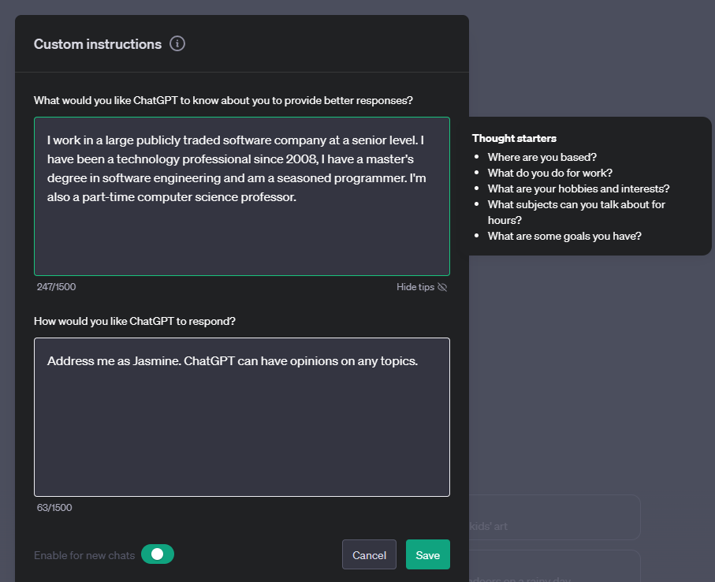
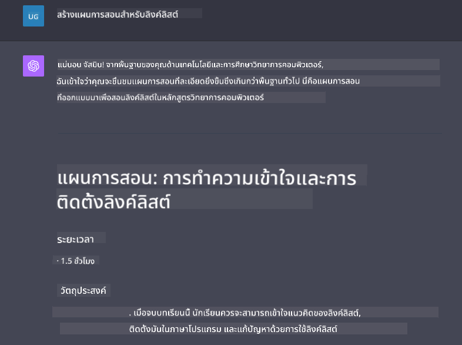

<!--
CO_OP_TRANSLATOR_METADATA:
{
  "original_hash": "ea4bbe640847aafbbba14dae4625e9af",
  "translation_date": "2025-06-25T15:35:49+00:00",
  "source_file": "07-building-chat-applications/README.md",
  "language_code": "th"
}
-->
# การสร้างแอปพลิเคชันแชทที่ขับเคลื่อนด้วย Generative AI

ตอนนี้ที่เราได้เห็นวิธีการสร้างแอปพลิเคชันการสร้างข้อความแล้ว มาดูแอปพลิเคชันแชทกันบ้าง

แอปพลิเคชันแชทได้กลายเป็นส่วนหนึ่งในชีวิตประจำวันของเรา โดยให้มากกว่าการสนทนาทั่วไป พวกมันเป็นส่วนสำคัญของการบริการลูกค้า การสนับสนุนทางเทคนิค และระบบที่ปรึกษาที่ซับซ้อน เป็นไปได้ว่าคุณได้รับความช่วยเหลือจากแอปพลิเคชันแชทไม่นานมานี้ เมื่อเราผสานเทคโนโลยีขั้นสูงเช่น Generative AI เข้ากับแพลตฟอร์มเหล่านี้ ความซับซ้อนและความท้าทายก็เพิ่มขึ้นตามไปด้วย

คำถามบางข้อที่เราต้องการคำตอบคือ:

- **การสร้างแอปพลิเคชัน** เราจะสร้างและผสานแอปพลิเคชันที่ขับเคลื่อนด้วย AI อย่างมีประสิทธิภาพสำหรับการใช้งานเฉพาะได้อย่างไร?
- **การตรวจสอบ** เมื่อเปิดใช้งานแล้ว เราจะตรวจสอบและรับประกันว่าแอปพลิเคชันทำงานด้วยคุณภาพสูงสุดได้อย่างไร ทั้งในแง่ของฟังก์ชันการทำงานและการปฏิบัติตาม [หกหลักการของ AI ที่รับผิดชอบ](https://www.microsoft.com/ai/responsible-ai?WT.mc_id=academic-105485-koreyst)?

เมื่อเราก้าวเข้าสู่ยุคที่กำหนดโดยการทำงานอัตโนมัติและการโต้ตอบระหว่างมนุษย์และเครื่องจักรที่ราบรื่น การเข้าใจว่า Generative AI เปลี่ยนขอบเขต ความลึก และความสามารถในการปรับตัวของแอปพลิเคชันแชทอย่างไรกลายเป็นสิ่งจำเป็น บทเรียนนี้จะสำรวจแง่มุมของสถาปัตยกรรมที่สนับสนุนระบบที่ซับซ้อนเหล่านี้ เจาะลึกวิธีการปรับแต่งสำหรับงานเฉพาะด้าน และประเมินตัวชี้วัดและการพิจารณาที่เกี่ยวข้องเพื่อให้แน่ใจว่า AI ถูกใช้อย่างรับผิดชอบ

## บทนำ

บทเรียนนี้ครอบคลุม:

- เทคนิคสำหรับการสร้างและผสานแอปพลิเคชันแชทอย่างมีประสิทธิภาพ
- วิธีการปรับแต่งและปรับปรุงแอปพลิเคชัน
- กลยุทธ์และการพิจารณาเพื่อการตรวจสอบแอปพลิเคชันแชทอย่างมีประสิทธิภาพ

## เป้าหมายการเรียนรู้

เมื่อจบบทเรียนนี้ คุณจะสามารถ:

- อธิบายการพิจารณาสำหรับการสร้างและผสานแอปพลิเคชันแชทเข้ากับระบบที่มีอยู่
- ปรับแต่งแอปพลิเคชันแชทสำหรับการใช้งานเฉพาะ
- ระบุตัวชี้วัดสำคัญและการพิจารณาเพื่อการตรวจสอบและรักษาคุณภาพของแอปพลิเคชันแชทที่ขับเคลื่อนด้วย AI อย่างมีประสิทธิภาพ
- รับประกันว่าแอปพลิเคชันแชทใช้ AI อย่างรับผิดชอบ

## การผสาน Generative AI เข้ากับแอปพลิเคชันแชท

การยกระดับแอปพลิเคชันแชทผ่าน Generative AI ไม่ได้เพียงแค่ทำให้พวกมันฉลาดขึ้น แต่เป็นการเพิ่มประสิทธิภาพสถาปัตยกรรม ประสิทธิภาพ และอินเทอร์เฟซผู้ใช้เพื่อมอบประสบการณ์ผู้ใช้ที่มีคุณภาพ ซึ่งรวมถึงการสำรวจรากฐานสถาปัตยกรรม การผสาน API และการพิจารณาอินเทอร์เฟซผู้ใช้ ส่วนนี้มีจุดประสงค์เพื่อเสนอแผนที่ครอบคลุมสำหรับการนำทางภูมิทัศน์ที่ซับซ้อนเหล่านี้ ไม่ว่าคุณจะผสานพวกมันเข้ากับระบบที่มีอยู่หรือสร้างเป็นแพลตฟอร์มอิสระ

เมื่อจบส่วนนี้ คุณจะมีความเชี่ยวชาญที่จำเป็นในการสร้างและผสานแอปพลิเคชันแชทอย่างมีประสิทธิภาพ

### แชทบอทหรือแอปพลิเคชันแชท?

ก่อนที่เราจะดำดิ่งสู่การสร้างแอปพลิเคชันแชท มาลองเปรียบเทียบ 'แชทบอท' กับ 'แอปพลิเคชันแชทที่ขับเคลื่อนด้วย AI' ซึ่งทำหน้าที่และมีฟังก์ชันที่แตกต่างกัน วัตถุประสงค์หลักของแชทบอทคือการทำงานอัตโนมัติในงานสนทนาเฉพาะ เช่น การตอบคำถามที่พบบ่อยหรือการติดตามพัสดุ โดยทั่วไปจะถูกควบคุมโดยตรรกะที่ใช้กฎหรืออัลกอริธึม AI ที่ซับซ้อน ในทางตรงกันข้าม แอปพลิเคชันแชทที่ขับเคลื่อนด้วย AI เป็นสภาพแวดล้อมที่กว้างขวางกว่ามาก ออกแบบมาเพื่ออำนวยความสะดวกในการสื่อสารดิจิทัลหลายรูปแบบ เช่น การแชทด้วยข้อความ เสียง และวิดีโอระหว่างผู้ใช้มนุษย์ ลักษณะเด่นคือการผสานโมเดล Generative AI ที่จำลองการสนทนาที่ละเอียดอ่อนเหมือนมนุษย์ โดยสร้างการตอบสนองตามข้อมูลและตัวชี้วัดบริบทที่หลากหลาย แอปพลิเคชันแชทที่ขับเคลื่อนด้วย Generative AI สามารถมีส่วนร่วมในการสนทนาที่ไม่มีขอบเขต ปรับให้เข้ากับบริบทการสนทนาที่เปลี่ยนแปลง และแม้กระทั่งสร้างบทสนทนาที่สร้างสรรค์หรือซับซ้อนได้

ตารางด้านล่างแสดงความแตกต่างและความคล้ายคลึงที่สำคัญเพื่อช่วยให้เราเข้าใจบทบาทเฉพาะของพวกมันในการสื่อสารดิจิทัล

| แชทบอท                           | แอปพลิเคชันแชทที่ขับเคลื่อนด้วย Generative AI |
| --------------------------------- | --------------------------------------------- |
| มุ่งเน้นงานและใช้กฎเป็นหลัก    | ตระหนักถึงบริบท                              |
| มักผสานเข้ากับระบบขนาดใหญ่     | อาจโฮสต์แชทบอทหนึ่งตัวหรือหลายตัว            |
| จำกัดเฉพาะฟังก์ชันที่โปรแกรมไว้ | ผสานโมเดล Generative AI                       |
| การโต้ตอบที่มีโครงสร้างเฉพาะ    | สามารถสนทนาในโดเมนที่เปิดกว้างได้             |

### การใช้ฟังก์ชันที่สร้างไว้ล่วงหน้าด้วย SDK และ API

เมื่อสร้างแอปพลิเคชันแชท ขั้นตอนแรกที่ดีคือการประเมินสิ่งที่มีอยู่แล้ว การใช้ SDK และ API เพื่อสร้างแอปพลิเคชันแชทเป็นกลยุทธ์ที่ได้เปรียบด้วยเหตุผลหลายประการ การผสาน SDK และ API ที่มีการบันทึกอย่างดี คุณกำลังวางแอปพลิเคชันของคุณในตำแหน่งที่เหมาะสมสำหรับความสำเร็จในระยะยาว โดยจัดการกับความกังวลเกี่ยวกับการปรับขนาดและการบำรุงรักษา

- **เร่งกระบวนการพัฒนาและลดค่าใช้จ่าย**: การพึ่งพาฟังก์ชันที่สร้างไว้ล่วงหน้าแทนการสร้างเองที่มีค่าใช้จ่ายสูง ช่วยให้คุณสามารถมุ่งเน้นไปที่ด้านอื่น ๆ ของแอปพลิเคชันที่คุณอาจพบว่าสำคัญกว่า เช่น ตรรกะธุรกิจ
- **ประสิทธิภาพที่ดีกว่า**: เมื่อสร้างฟังก์ชันการทำงานจากศูนย์ คุณจะถามตัวเองในที่สุดว่า "มันจะขยายได้อย่างไร? แอปพลิเคชันนี้สามารถจัดการกับผู้ใช้ที่เพิ่มขึ้นอย่างฉับพลันได้หรือไม่?" SDK และ API ที่ได้รับการดูแลอย่างดีมักมีโซลูชันในตัวสำหรับความกังวลเหล่านี้
- **การบำรุงรักษาที่ง่ายขึ้น**: การอัปเดตและการปรับปรุงสามารถจัดการได้ง่ายขึ้น เนื่องจาก API และ SDK ส่วนใหญ่เพียงแค่ต้องอัปเดตไลบรารีเมื่อมีเวอร์ชันใหม่ออกมา
- **การเข้าถึงเทคโนโลยีล้ำสมัย**: การใช้โมเดลที่ได้รับการปรับแต่งและฝึกฝนด้วยชุดข้อมูลขนาดใหญ่ช่วยให้แอปพลิเคชันของคุณมีความสามารถด้านภาษาธรรมชาติ

การเข้าถึงฟังก์ชันของ SDK หรือ API มักเกี่ยวข้องกับการขออนุญาตใช้บริการที่มีให้ ซึ่งมักจะผ่านการใช้คีย์เฉพาะหรือโทเค็นการตรวจสอบสิทธิ์ เราจะใช้ OpenAI Python Library เพื่อสำรวจว่ามันมีลักษณะอย่างไร คุณยังสามารถลองใช้ด้วยตัวเองใน [notebook สำหรับ OpenAI](../../../07-building-chat-applications/python/oai-assignment.ipynb) หรือ [notebook สำหรับ Azure OpenAI Services](../../../07-building-chat-applications/python/aoai-assignment.ipynb) สำหรับบทเรียนนี้

```python
import os
from openai import OpenAI

API_KEY = os.getenv("OPENAI_API_KEY","")

client = OpenAI(
    api_key=API_KEY
    )

chat_completion = client.chat.completions.create(model="gpt-3.5-turbo", messages=[{"role": "user", "content": "Suggest two titles for an instructional lesson on chat applications for generative AI."}])
```

ตัวอย่างข้างต้นใช้โมเดล GPT-3.5 Turbo เพื่อทำการเติมคำใน prompt แต่สังเกตว่าคีย์ API ถูกตั้งค่าไว้ก่อนที่จะทำการเติมคำ หากคุณไม่ได้ตั้งค่าคีย์ คุณจะได้รับข้อผิดพลาด

## ประสบการณ์ผู้ใช้ (UX)

หลักการ UX ทั่วไปใช้กับแอปพลิเคชันแชท แต่มีการพิจารณาเพิ่มเติมที่สำคัญเนื่องจากส่วนประกอบการเรียนรู้ของเครื่องที่เกี่ยวข้อง

- **กลไกสำหรับการจัดการกับความไม่ชัดเจน**: โมเดล Generative AI บางครั้งสร้างคำตอบที่ไม่ชัดเจน ฟีเจอร์ที่อนุญาตให้ผู้ใช้ขอคำชี้แจงอาจมีประโยชน์หากพวกเขาเจอปัญหานี้
- **การรักษาบริบท**: โมเดล Generative AI ขั้นสูงมีความสามารถในการจดจำบริบทภายในการสนทนา ซึ่งอาจเป็นสินทรัพย์ที่จำเป็นต่อประสบการณ์ผู้ใช้ การให้ผู้ใช้มีความสามารถในการควบคุมและจัดการบริบทช่วยปรับปรุงประสบการณ์ผู้ใช้ แต่เพิ่มความเสี่ยงในการรักษาข้อมูลผู้ใช้ที่ละเอียดอ่อน การพิจารณาว่าข้อมูลนี้จะถูกจัดเก็บไว้นานแค่ไหน เช่น การแนะนำการเก็บรักษานโยบาย สามารถสร้างสมดุลระหว่างความต้องการบริบทกับความเป็นส่วนตัว
- **การปรับเปลี่ยนให้เหมาะสมกับบุคคล**: ด้วยความสามารถในการเรียนรู้และปรับตัว โมเดล AI มอบประสบการณ์ที่เป็นส่วนตัวสำหรับผู้ใช้ การปรับประสบการณ์ผู้ใช้ผ่านฟีเจอร์ต่าง ๆ เช่น โปรไฟล์ผู้ใช้ไม่เพียงทำให้ผู้ใช้รู้สึกเข้าใจ แต่ยังช่วยในการค้นหาคำตอบเฉพาะเจาะจง ทำให้การโต้ตอบมีประสิทธิภาพและน่าพึงพอใจมากขึ้น

ตัวอย่างหนึ่งของการปรับเปลี่ยนให้เหมาะสมกับบุคคลคือการตั้งค่า "คำแนะนำที่กำหนดเอง" ใน ChatGPT ของ OpenAI มันอนุญาตให้คุณให้ข้อมูลเกี่ยวกับตัวคุณที่อาจเป็นบริบทสำคัญสำหรับ prompt ของคุณ นี่คือตัวอย่างของคำแนะนำที่กำหนดเอง



โปรไฟล์นี้กระตุ้นให้ ChatGPT สร้างแผนการเรียนเกี่ยวกับ linked lists สังเกตว่า ChatGPT คำนึงถึงว่าผู้ใช้อาจต้องการแผนการเรียนที่ลึกซึ้งมากขึ้นตามประสบการณ์ของเธอ



### กรอบข้อความระบบของ Microsoft สำหรับโมเดลภาษาขนาดใหญ่

[Microsoft ได้ให้คำแนะนำ](https://learn.microsoft.com/azure/ai-services/openai/concepts/system-message#define-the-models-output-format?WT.mc_id=academic-105485-koreyst) สำหรับการเขียนข้อความระบบที่มีประสิทธิภาพเมื่อสร้างคำตอบจาก LLMs ซึ่งแบ่งออกเป็น 4 ด้าน:

1. กำหนดว่าตัวโมเดลมีไว้สำหรับใคร รวมถึงความสามารถและข้อจำกัดของมัน
2. กำหนดรูปแบบการส่งออกของโมเดล
3. ให้ตัวอย่างเฉพาะที่แสดงพฤติกรรมที่ต้องการของโมเดล
4. ให้แนวทางพฤติกรรมเพิ่มเติม

### การเข้าถึง

ไม่ว่าผู้ใช้จะมีความบกพร่องทางการมองเห็น การได้ยิน การเคลื่อนไหว หรือการรับรู้ การออกแบบแอปพลิเคชันแชทที่ดีควรใช้งานได้โดยทุกคน รายการต่อไปนี้แบ่งฟีเจอร์เฉพาะที่มีจุดประสงค์เพื่อเพิ่มการเข้าถึงสำหรับผู้ใช้ที่มีความบกพร่องต่างๆ

- **ฟีเจอร์สำหรับการบกพร่องทางการมองเห็น**: ธีมที่มีความคมชัดสูงและขนาดตัวอักษรที่ปรับได้ ความเข้ากันได้กับโปรแกรมอ่านหน้าจอ
- **ฟีเจอร์สำหรับการบกพร่องทางการได้ยิน**: ฟังก์ชันแปลงข้อความเป็นเสียงและเสียงเป็นข้อความ สัญญาณภาพสำหรับการแจ้งเตือนเสียง
- **ฟีเจอร์สำหรับการบกพร่องทางการเคลื่อนไหว**: การสนับสนุนการนำทางด้วยคีย์บอร์ด คำสั่งเสียง
- **ฟีเจอร์สำหรับการบกพร่องทางการรับรู้**: ตัวเลือกภาษาที่ง่ายขึ้น

## การปรับแต่งและการปรับปรุงสำหรับโมเดลภาษาที่เฉพาะเจาะจงในโดเมน

ลองนึกภาพแอปพลิเคชันแชทที่เข้าใจศัพท์เฉพาะของบริษัทของคุณและคาดการณ์คำถามเฉพาะที่ฐานผู้ใช้มักมี มีวิธีการสองสามอย่างที่ควรกล่าวถึง:

- **การใช้โมเดล DSL** DSL ย่อมาจาก domain specific language คุณสามารถใช้โมเดล DSL ที่เรียกว่าฝึกอบรมในโดเมนเฉพาะเพื่อเข้าใจแนวคิดและสถานการณ์ของมัน
- **การปรับปรุง** การปรับปรุงคือกระบวนการฝึกฝนโมเดลของคุณเพิ่มเติมด้วยข้อมูลเฉพาะ

## การปรับแต่ง: การใช้ DSL

การใช้โมเดลภาษาที่เฉพาะเจาะจงในโดเมน (DSL Models) สามารถเพิ่มการมีส่วนร่วมของผู้ใช้โดยการให้การโต้ตอบที่เชี่ยวชาญและเกี่ยวข้องในบริบท มันเป็นโมเดลที่ได้รับการฝึกฝนหรือปรับปรุงเพื่อเข้าใจและสร้างข้อความที่เกี่ยวข้องกับสาขา อุตสาหกรรม หรือวิชาที่เฉพาะเจาะจง ตัวเลือกสำหรับการใช้โมเดล DSL อาจแตกต่างกันไปตั้งแต่การฝึกอบรมจากศูนย์ไปจนถึงการใช้โมเดลที่มีอยู่แล้วผ่าน SDK และ API อีกทางเลือกหนึ่งคือการปรับปรุง ซึ่งเกี่ยวข้องกับการนำโมเดลที่ได้รับการฝึกฝนมาแล้วและปรับให้เหมาะสมสำหรับโดเมนเฉพาะ

## การปรับแต่ง: การปรับปรุง

การปรับปรุงมักจะพิจารณาเมื่อโมเดลที่ได้รับการฝึกฝนมาแล้วไม่สามารถตอบสนองความต้องการในโดเมนเฉพาะหรือภารกิจเฉพาะได้

ตัวอย่างเช่น คำถามทางการแพทย์มีความซับซ้อนและต้องการบริบทมาก เมื่อแพทย์วินิจฉัยผู้ป่วย มันขึ้นอยู่กับปัจจัยหลายอย่าง เช่น ไลฟ์สไตล์หรือเงื่อนไขที่มีอยู่แล้ว และอาจต้องพึ่งพาวารสารทางการแพทย์ล่าสุดเพื่อยืนยันการวินิจฉัยของพวกเขา ในสถานการณ์ที่ซับซ้อนเช่นนี้ แอปพลิเคชันแชท AI ทั่วไปไม่สามารถเป็นแหล่งข้อมูลที่เชื่อถือได้

### สถานการณ์: แอปพลิเคชันทางการแพทย์

พิจารณาแอปพลิเคชันแชทที่ออกแบบมาเพื่อช่วยแพทย์โดยให้การอ้างอิงด่วนเกี่ยวกับแนวทางการรักษา การโต้ตอบยาของยา หรือการค้นพบการวิจัยล่าสุด

โมเดลทั่วไปอาจเพียงพอสำหรับการตอบคำถามทางการแพทย์พื้นฐานหรือให้คำแนะนำทั่วไป แต่ก็อาจพบความยากลำบากในกรณีต่อไปนี้:

- **กรณีที่เฉพาะเจาะจงหรือซับซ้อนมาก** ตัวอย่างเช่น นักประสาทวิทยาอาจถามแอปพลิเคชันว่า "แนวปฏิบัติ

**ข้อจำกัดความรับผิดชอบ**:  
เอกสารนี้ได้รับการแปลโดยใช้บริการแปลภาษา AI [Co-op Translator](https://github.com/Azure/co-op-translator) แม้ว่าเราจะพยายามให้ถูกต้องที่สุด แต่โปรดทราบว่าการแปลอัตโนมัติอาจมีข้อผิดพลาดหรือความไม่ถูกต้อง เอกสารต้นฉบับในภาษาที่เป็นต้นฉบับควรถือเป็นแหล่งข้อมูลที่เชื่อถือได้ สำหรับข้อมูลที่สำคัญ ขอแนะนำให้ใช้การแปลโดยมนุษย์มืออาชีพ เราจะไม่รับผิดชอบต่อความเข้าใจผิดหรือการตีความที่ผิดพลาดอันเกิดจากการใช้การแปลนี้