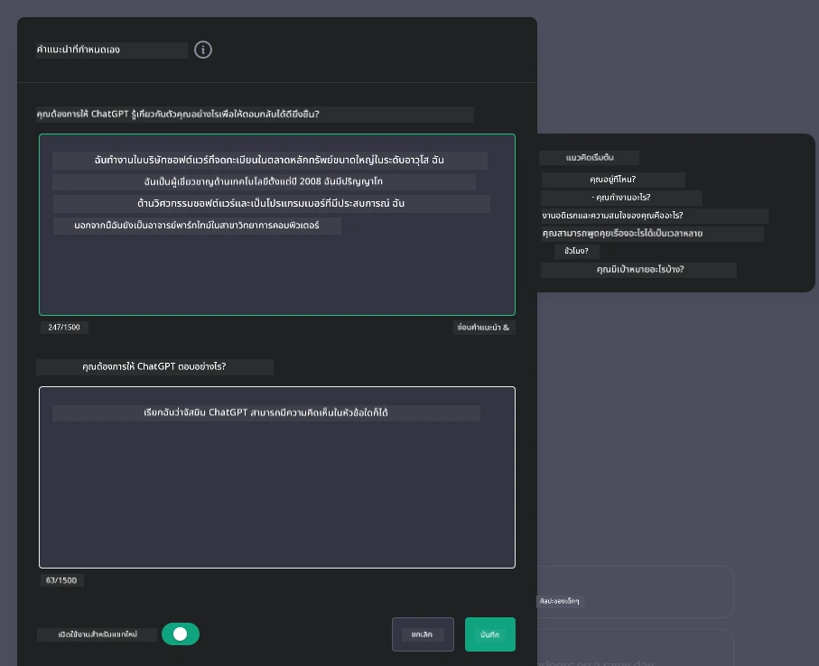
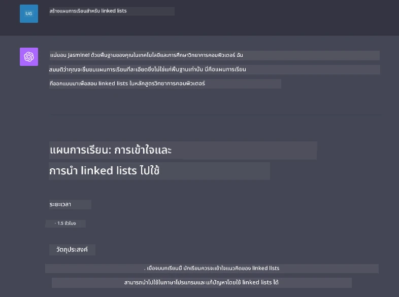

# การสร้างแอปแชทที่ขับเคลื่อนด้วยปัญญาประดิษฐ์สร้างสรรค์  

[](https://youtu.be/R9V0ZY1BEQo?si=IHuU-fS9YWT8s4sA)  

> _(คลิกที่ภาพด้านบนเพื่อดูวิดีโอของบทเรียนนี้)_  

ตอนนี้ที่เราได้เห็นวิธีการสร้างแอปการสร้างข้อความแล้ว เรามาดูแอปแชทกันดีกว่า  

แอปแชทได้กลายเป็นส่วนหนึ่งในชีวิตประจำวันของเรา ไม่ได้เป็นแค่ช่องทางสำหรับการสนทนาแบบทั่วไปเท่านั้น แต่ยังเป็นส่วนสำคัญของการให้บริการลูกค้า การสนับสนุนทางเทคนิค และแม้แต่ระบบให้คำปรึกษาที่ซับซ้อน เป็นไปได้ว่าคุณอาจได้รับความช่วยเหลือจากแอปแชทเมื่อไม่นานมานี้ ในขณะที่เราผสานเทคโนโลยีล้ำสมัยอย่างปัญญาประดิษฐ์สร้างสรรค์เข้าสู่แพลตฟอร์มเหล่านี้ ความซับซ้อนและความท้าทายก็เพิ่มขึ้นตามไปด้วย  

มีคำถามบางอย่างที่เราจำเป็นต้องได้รับคำตอบ:  

- **การสร้างแอป** เราจะสร้างและผสานรวมแอปที่ขับเคลื่อนด้วยปัญญาประดิษฐ์เหล่านี้อย่างมีประสิทธิภาพสำหรับกรณีการใช้งานเฉพาะได้อย่างไร?  
- **การติดตามตรวจสอบ** เมื่อแอปเผยแพร่แล้ว เราจะติดตามและทำให้แน่ใจว่าแอปทำงานในระดับคุณภาพสูงสุดได้อย่างไร ทั้งในแง่ของฟังก์ชันและการปฏิบัติตาม [หลักการหกประการของ AI อย่างรับผิดชอบ](https://www.microsoft.com/ai/responsible-ai?WT.mc_id=academic-105485-koreyst)?  

ในยุคที่ถูกนิยามด้วยระบบอัตโนมัติและการโต้ตอบระหว่างมนุษย์-เครื่องจักรอย่างไร้รอยต่อ การเข้าใจว่า AI สร้างสรรค์เปลี่ยนแปลงขอบเขต ความลึก และความยืดหยุ่นของแอปแชทอย่างไรจึงเป็นสิ่งจำเป็น บทเรียนนี้จะสำรวจองค์ประกอบด้านสถาปัตยกรรมที่สนับสนุนระบบที่ซับซ้อนเหล่านี้ เจาะลึกวิธีการปรับแต่งเพื่องานเฉพาะโดเมน และประเมินเมตริกและการพิจารณาที่เกี่ยวข้องกับการนำ AI ไปใช้อย่างรับผิดชอบ  

## บทนำ  

บทเรียนนี้ครอบคลุม:  

- เทคนิคสำหรับการสร้างและผสานรวมแอปแชทอย่างมีประสิทธิภาพ  
- วิธีการปรับแต่งและการปรับจูนแอป  
- กลยุทธ์และการพิจารณาในการติดตามตรวจสอบแอปแชทอย่างมีประสิทธิผล  

## เป้าหมายการเรียนรู้  

เมื่อจบบทเรียนนี้ คุณจะสามารถ:  

- อธิบายการพิจารณาสำหรับการสร้างและผสานรวมแอปแชทเข้ากับระบบที่มีอยู่  
- ปรับแต่งแอปแชทสำหรับกรณีการใช้งานเฉพาะ  
- ระบุเมตริกหลักและการพิจารณาเพื่อการติดตามและรักษาคุณภาพของแอปแชทที่ขับเคลื่อนด้วย AI อย่างมีประสิทธิผล  
- ทำให้แน่ใจว่าแอปแชทใช้ AI อย่างรับผิดชอบ  

## การผสาน AI สร้างสรรค์เข้าสู่แอปแชท  

การยกระดับแอปแชทด้วย AI สร้างสรรค์ไม่ได้หมายถึงแค่การทำให้แอปฉลาดขึ้นเท่านั้น แต่ยังเกี่ยวข้องกับการปรับปรุงสถาปัตยกรรม ประสิทธิภาพ และส่วนติดต่อผู้ใช้เพื่อมอบประสบการณ์ผู้ใช้ที่มีคุณภาพ ที่นี่เราจะสำรวจพื้นฐานทางสถาปัตยกรรม การผสานรวม API และการพิจารณาอินเทอร์เฟซผู้ใช้ ส่วนนี้มีเป้าหมายเพื่อให้คุณมีแผนที่ครบถ้วนสำหรับการจัดการภูมิประเทศที่ซับซ้อนเหล่านี้ ไม่ว่าคุณจะนำไปเชื่อมต่อระบบที่มีอยู่หรือสร้างเป็นแพลตฟอร์มที่เป็นอิสระ  

เมื่อสิ้นสุดส่วนนี้ คุณจะมีความเชี่ยวชาญที่จำเป็นในการสร้างและผสานรวมแอปแชทอย่างมีประสิทธิภาพ  

### แชทบอท หรือ แอปแชท?  

ก่อนที่เราจะเริ่มสร้างแอปแชท มาดูกันก่อนว่า 'แชทบอท' กับ 'แอปแชทที่ขับเคลื่อนด้วย AI' แตกต่างกันอย่างไรและมีบทบาทหน้าที่อะไร แชทบอทมีวัตถุประสงค์หลักเพื่อทำงานการสนทนาอัตโนมัติที่เฉพาะเจาะจง เช่น ตอบคำถามที่พบบ่อย หรือ ติดตามพัสดุ โดยมักถูกควบคุมด้วยตรรกะเชิงกฎหรืออัลกอริทึม AI ที่ซับซ้อน ในทางกลับกัน แอปแชทที่ขับเคลื่อนด้วย AI เป็นสภาพแวดล้อมขนาดใหญ่กว่า ออกแบบมาเพื่อสนับสนุนรูปแบบการสื่อสารดิจิทัลหลากหลาย เช่น การแชทด้วยข้อความ เสียง หรือวิดีโอระหว่างผู้ใช้มนุษย์ ฟีเจอร์เด่นคือการผสานโมเดล AI สร้างสรรค์ที่จำลองการสนทนาแบบละเอียดและเหมือนมนุษย์ โดยสร้างคำตอบตามอินพุตและบริบทที่หลากหลาย แอปแชทที่ขับเคลื่อนด้วย AI สามารถสนทนาแบบเปิดกว้าง ปรับตัวเข้ากับบริบทที่เปลี่ยนแปลง และแม้แต่สร้างบทสนทนาที่สร้างสรรค์หรือละเอียดซับซ้อนได้  

ตารางด้านล่างสรุปความแตกต่างและความเหมือนที่สำคัญ เพื่อช่วยให้เราเข้าใจบทบาทเฉพาะตัวของแต่ละแบบในสื่อสารดิจิทัล  

| แชทบอท                             | แอปแชทที่ขับเคลื่อนด้วย AI สร้างสรรค์                   |  
| ------------------------------------- | -------------------------------------- |  
| เน้นงานเฉพาะและอิงกฎ                 | รู้บริบท                                           |  
| มักถูกรวมเข้ากับระบบขนาดใหญ่             | อาจรองรับแชทบอทหนึ่งหรือมากกว่า                          |  
| จำกัดเฉพาะฟังก์ชันที่ตั้งโปรแกรมไว้          | รวมโมเดล AI สร้างสรรค์                                 |  
| การโต้ตอบที่เฉพาะและมีโครงสร้าง               | สามารถสนทนาแบบเปิดกว้าง                                  |  

### การใช้ฟังก์ชันที่สร้างไว้ล่วงหน้าด้วย SDK และ API  

เมื่อสร้างแอปแชท ขั้นตอนแรกที่ดีคือประเมินสิ่งที่มีอยู่แล้ว การใช้ SDK และ API ในการสร้างแอปแชทถือเป็นกลยุทธ์ที่ดีด้วยเหตุผลหลายประการ ด้วยการผสานรวม SDK และ API ที่มีเอกสารดี คุณกำลังวางตำแหน่งแอปของคุณอย่างมีกลยุทธ์สำหรับความสำเร็จในระยะยาว โดยตอบสนองต่อข้อกังวลด้านการขยายตัวและการบำรุงรักษา  

- **เร่งกระบวนการพัฒนาและลดภาระงาน** : การใช้ฟังก์ชันที่สร้างไว้ล่วงหน้าจะช่วยให้คุณไม่ต้องเสียเวลาและต้นทุนในการสร้างเอง และสามารถมุ่งเน้นที่ส่วนอื่นของแอปที่สำคัญกว่า เช่น ตรรกะทางธุรกิจ  
- **ประสิทธิภาพดีขึ้น** : เมื่อสร้างฟังก์ชันจากศูนย์ คุณต้องถามตัวเองว่า "จะขยายระบบได้อย่างไร? แอปนี้รองรับผู้ใช้ที่เพิ่มขึ้นอย่างฉับพลันได้หรือไม่?" SDK และ API ที่ดูแลอย่างดีมักมีวิธีแก้ปัญหาเบื้องต้นสำหรับเรื่องเหล่านี้  
- **การบำรุงรักษาง่าย** : การอัปเดตและปรับปรุงทำได้ง่าย เพราะส่วนใหญ่ SDK และ API เพียงแค่ต้องอัปเดตไลบรารีเมื่อมีเวอร์ชันใหม่  
- **เข้าถึงเทคโนโลยีล้ำสมัย** : การใช้โมเดลที่ผ่านการปรับจูนและฝึกฝนด้วยชุดข้อมูลขนาดใหญ่ ช่วยให้แอปของคุณมีความสามารถในการประมวลผลภาษาธรรมชาติ  

การเข้าถึงฟังก์ชันของ SDK หรือ API โดยทั่วไปต้องได้รับอนุญาตให้ใช้บริการซึ่งมักใช้ผ่านกุญแจเฉพาะหรือโทเค็นตรวจสอบสิทธิ์ เราจะใช้ OpenAI Python Library เพื่อดูตัวอย่างว่านี่เป็นอย่างไร คุณยังสามารถลองใช้งานด้วยตัวเองใน [โน้ตบุ๊กของ OpenAI](./python/oai-assignment.ipynb?WT.mc_id=academic-105485-koreyst) หรือ [โน้ตบุ๊กของ Azure OpenAI Services](./python/aoai-assignment.ipynb?WT.mc_id=academic-105485-koreys) สำหรับบทเรียนนี้  

```python
import os
from openai import OpenAI

API_KEY = os.getenv("OPENAI_API_KEY","")

client = OpenAI(
    api_key=API_KEY
    )

response = client.responses.create(model="gpt-5-mini", input="Suggest two titles for an instructional lesson on chat applications for generative AI.", store=False)
print(response.output_text)
```
  
ตัวอย่างด้านบนใช้โมเดล GPT-5 mini กับ Responses API เพื่อทำคำร้องให้สมบูรณ์ แต่สังเกตว่ามีการตั้งค่า API key ก่อน หากไม่ตั้งค่าจะเกิดข้อผิดพลาด  

## ประสบการณ์ผู้ใช้ (UX)  

หลักการ UX ทั่วไปใช้กับแอปแชทได้ แต่ที่นี่มีการพิจารณาเพิ่มเติมที่สำคัญโดยเฉพาะอย่างยิ่งเนื่องจากส่วนประกอบของแมชชีนเลิร์นนิง  

- **กลไกจัดการความคลุมเครือ** : โมเดล AI สร้างสรรค์บางครั้งให้คำตอบที่คลุมเครือได้ ฟีเจอร์ที่ช่วยให้ผู้ใช้ขอคำชี้แจงจะมีประโยชน์เมื่อต้องเจอปัญหานี้  
- **การเก็บรักษาบริบท** : โมเดล AI สร้างสรรค์ขั้นสูงสามารถจำบริบทในการสนทนาได้ ซึ่งเป็นสิ่งจำเป็นต่อประสบการณ์ผู้ใช้ การให้ผู้ใช้ควบคุมและจัดการบริบททำให้ UX ดีขึ้น แต่ก็มาพร้อมความเสี่ยงในการเก็บข้อมูลส่วนตัว ควรพิจารณาว่าข้อมูลจะเก็บไว้นานเท่าใด เช่น การตั้งนโยบายการเก็บรักษา เพื่อสร้างสมดุลระหว่างการใช้บริบทกับความเป็นส่วนตัว  
- **การปรับแต่งเฉพาะบุคคล** : ด้วยความสามารถในการเรียนรู้และปรับตัว โมเดล AI สามารถมอบประสบการณ์เฉพาะตัวให้ผู้ใช้ การปรับ UX ผ่านฟีเจอร์เช่นโปรไฟล์ผู้ใช้ ไม่เพียงแต่ทำให้ผู้ใช้รู้สึกว่าเข้าใจตัวเอง แต่ยังช่วยให้ค้นหาคำตอบเฉพาะได้ง่ายขึ้น สร้างการโต้ตอบที่มีประสิทธิภาพและน่าพึงพอใจ  

ตัวอย่างหนึ่งของการปรับแต่งเฉพาะตัวคือการตั้งค่า "คำสั่งปรับแต่ง" ใน ChatGPT ของ OpenAI ซึ่งอนุญาตให้คุณให้ข้อมูลเกี่ยวกับตัวเองซึ่งอาจเป็นบริบทสำคัญสำหรับคำร้องของคุณ นี่คือตัวอย่างของคำสั่งปรับแต่ง  

  

โปรไฟล์นี้ช่วยให้ ChatGPT สร้างแผนบทเรียนเกี่ยวกับ linked lists สังเกตว่า ChatGPT พิจารณาว่าผู้ใช้ต้องการแผนบทเรียนที่ลึกซึ้งขึ้นตามประสบการณ์ของเธอ  

  

### กรอบข้อความระบบของ Microsoft สำหรับโมเดลภาษาขนาดใหญ่  

[Microsoft ได้ให้คำแนะนำ](https://learn.microsoft.com/azure/ai-foundry/openai/concepts/system-message#define-the-models-output-format?WT.mc_id=academic-105485-koreyst) สำหรับการเขียนข้อความระบบที่มีประสิทธิภาพเมื่อสร้างคำตอบจาก LLMs โดยแบ่งออกเป็น 4 ด้าน:  

1. กำหนดว่าโมเดลนี้สำหรับใคร รวมถึงความสามารถและข้อจำกัดของมัน  
2. กำหนดรูปแบบผลลัพธ์ของโมเดล  
3. ให้ตัวอย่างเฉพาะที่แสดงพฤติกรรมที่ต้องการของโมเดล  
4. ให้ตัวช่วยด้านพฤติกรรมเพิ่มเติม  

### การเข้าถึง (Accessibility)  

ไม่ว่าผู้ใช้จะมีปัญหาทางสายตา การได้ยิน การเคลื่อนไหว หรือความรู้ความเข้าใจ แอปแชทที่ออกแบบมาอย่างดีควรใช้งานได้สำหรับทุกคน รายการต่อไปนี้แยกฟีเจอร์เฉพาะที่มุ่งเพิ่มความสามารถในการเข้าถึงสำหรับความบกพร่องต่าง ๆ  

- **ฟีเจอร์สำหรับผู้บกพร่องทางสายตา** : ธีมคอนทราสต์สูง ข้อความที่ปรับขนาดได้ รองรับเครื่องอ่านหน้าจอ  
- **ฟีเจอร์สำหรับผู้บกพร่องทางการได้ยิน** : ฟังก์ชันแปลงข้อความเป็นเสียงและเสียงเป็นข้อความ สัญญาณภาพสำหรับแจ้งเตือนเสียง  
- **ฟีเจอร์สำหรับผู้บกพร่องทางการเคลื่อนไหว** : รองรับการนำทางด้วยคีย์บอร์ด คำสั่งเสียง  
- **ฟีเจอร์สำหรับผู้บกพร่องทางปัญญา** : ตัวเลือกภาษาที่ง่ายขึ้น  

## การปรับแต่งและการปรับจูนสำหรับโมเดลภาษาโดเมนเฉพาะ  

ลองนึกภาพแอปแชทที่เข้าใจศัพท์เฉพาะของบริษัทคุณและคาดเดาคำถามที่ผู้ใช้มักมี มีวิธีการสองสามแบบที่ควรกล่าวถึง:  

- **ใช้โมเดล DSL**: DSL หมายถึงภาษาเฉพาะโดเมน คุณสามารถใช้โมเดล DSL ที่ได้รับการฝึกในโดเมนเฉพาะเพื่อเข้าใจแนวคิดและสถานการณ์นั้น ๆ  
- **ปรับจูน (fine-tuning)** : การปรับจูนคือกระบวนการฝึกฝนโมเดลเพิ่มเติมด้วยข้อมูลเฉพาะ  

## การปรับแต่ง: การใช้ DSL  

การใช้โมเดลภาษาเฉพาะโดเมน (DSL Models) สามารถเพิ่มการมีส่วนร่วมของผู้ใช้โดยมอบการโต้ตอบที่เฉพาะเจาะจงและตรงบริบท โมเดลเหล่านี้ถูกฝึกหรือปรับจูนเพื่อเข้าใจและสร้างข้อความที่เกี่ยวข้องกับสาขา อุตสาหกรรม หรือหัวข้อเฉพาะ ตัวเลือกสำหรับการใช้โมเดล DSL มีตั้งแต่การฝึกโมเดลใหม่จากศูนย์ ไปจนถึงการใช้โมเดลที่มีอยู่แล้วผ่าน SDK และ API อีกทางเลือกหนึ่งคือการปรับจูน ซึ่งเป็นการนำโมเดลฝึกฝนล่วงหน้ามาปรับให้เหมาะสมกับโดเมนเฉพาะ  

## การปรับแต่ง: การปรับจูน (fine-tuning)  

การปรับจูนมักพิจารณาเมื่อโมเดลที่ฝึกฝนล่วงหน้าไม่เพียงพอในโดเมนเฉพาะหรือภารกิจเฉพาะ  

ตัวอย่างเช่น คำถามทางการแพทย์มีความซับซ้อนและต้องการบริบทมาก เมื่อแพทย์วินิจฉัยผู้ป่วย จะอาศัยปัจจัยหลากหลาย เช่น วิถีชีวิต หรือเงื่อนไขก่อนหน้า และอาจใช้วารสารทางการแพทย์ล่าสุดเพื่อยืนยันการวินิจฉัย ในสถานการณ์ละเอียดอ่อนไม่เหมาะกับแอปแชท AI ที่ใช้ทั่วไปที่จะเป็นแหล่งข้อมูลที่เชื่อถือได้  

### กรณีศึกษา: แอปด้านการแพทย์  

ลองพิจารณาแอปแชทที่ออกแบบมาเพื่อช่วยเหลือแพทย์โดยให้ข้อมูลอ้างอิงอย่างรวดเร็วเกี่ยวกับแนวทางการรักษา ปฏิกิริยาระหว่างยา หรือผลงานวิจัยล่าสุด  

โมเดลทั่วไปอาจเพียงพอสำหรับตอบคำถามทางการแพทย์พื้นฐานหรือให้คำแนะนำทั่วไป แต่จะมีข้อจำกัดในเรื่องเหล่านี้:  

- **กรณีที่เฉพาะเจาะจงหรือซับซ้อนสูง** : เช่น นักประสาทวิทยาอาจถามแอปว่า "แนวปฏิบัติที่ดีที่สุดในปัจจุบันสำหรับการจัดการโรคลมชักที่ดื้อยาในเด็กคืออะไร?"  
- **ขาดความก้าวหน้าล่าสุด** : โมเดลทั่วไปอาจไม่สามารถให้คำตอบที่อัปเดตและรวมความก้าวหน้าล่าสุดในด้านระบบประสาทวิทยาและเภสัชวิทยา  

ในกรณีเช่นนี้ การปรับจูนโมเดลด้วยชุดข้อมูลทางการแพทย์เฉพาะสามารถปรับปรุงความสามารถในการจัดการคำถามทางการแพทย์ที่ซับซ้อนเหล่านี้ได้อย่างแม่นยำและน่าเชื่อถือมากขึ้น ซึ่งต้องการชุดข้อมูลขนาดใหญ่และเฉพาะเจาะจงที่แสดงถึงความท้าทายและคำถามที่เฉพาะในโดเมนนั้น  

## การพิจารณาสำหรับประสบการณ์แชทที่ขับเคลื่อนด้วย AI คุณภาพสูง  

ส่วนนี้สรุปเกณฑ์สำหรับแอปแชท "คุณภาพสูง" ซึ่งรวมถึงการเก็บข้อมูลเมตริกที่ใช้ได้จริงและการปฏิบัติตามกรอบงานที่ใช้ AI อย่างรับผิดชอบ  

### เมตริกหลัก  

เพื่อรักษาประสิทธิภาพคุณภาพสูงของแอป เป็นสิ่งจำเป็นที่จะติดตามเมตริกและการพิจารณาหลัก ๆ การวัดเหล่านี้ไม่เพียงแต่รับรองฟังก์ชันของแอป แต่ยังประเมินคุณภาพของโมเดล AI และประสบการณ์ผู้ใช้ รายการด้านล่างครอบคลุมเมตริกพื้นฐาน AI และ UX ที่ควรพิจารณา  

| เมตริก                         | คำจำกัดความ                                                                                                             | การพิจารณาสำหรับนักพัฒนาแชท                                           |  
| ----------------------------- | ---------------------------------------------------------------------------------------------------------------------- | ------------------------------------------------------------------------- |  
| **เวลาทำงาน (Uptime)**            | วัดเวลาที่แอปทำงานและผู้ใช้สามารถเข้าถึงได้                                                                              | คุณจะลดเวลาที่แอปไม่ทำงานได้อย่างไร?                                   |  
| **เวลาตอบสนอง (Response Time)**  | เวลาที่แอปใช้ตอบคำถามผู้ใช้                                                                                               | คุณจะเพิ่มประสิทธิภาพการประมวลผลคำถามเพื่อปรับปรุงเวลาตอบกลับอย่างไร?         |  
| **ความแม่นยำ (Precision)**        | อัตราส่วนของการพยากรณ์จริงบวกต่อจำนวนการพยากรณ์บวกทั้งหมด                                                                  | คุณจะตรวจสอบความแม่นยำของโมเดลอย่างไร?                                  |  
| **การเรียกคืน (Recall หรือ Sensitivity)** | อัตราส่วนของการพยากรณ์จริงบวกต่อจำนวนข้อจริงบวก                                                                          | คุณจะวัดและปรับปรุงการเรียกคืนอย่างไร?                                 |  
| **คะแนน F1 (F1 Score)**            | ค่ามัธยฐานเชิงฮาร์มอนิกของความแม่นยำและการเรียกคืนที่สร้างสมดุลระหว่างทั้งสอง                                               | เป้าหมายคะแนน F1 ของคุณคืออะไร? คุณจะสร้างสมดุลระหว่างความแม่นยำและการเรียกคืนอย่างไร? |  
| **ความสับสน (Perplexity)**          | วัดว่าโมเดลคาดการณ์การแจกแจงความน่าจะเป็นตรงกับการแจกแจงข้อมูลจริงมากน้อยเพียงใด                                              | คุณจะลดความสับสนอย่างไร?                                                 |  
| **เมตริกความพึงพอใจของผู้ใช้**    | วัดการรับรู้ของผู้ใช้เกี่ยวกับแอป โดยมักเก็บผ่านแบบสำรวจ                                                                          | คุณจะเก็บฟีดแบ็กจากผู้ใช้อย่างไรและบ่อยแค่ไหน? คุณจะปรับปรุงบนพื้นฐานนั้นอย่างไร?   |  
| **อัตราความผิดพลาด (Error Rate)** | อัตราที่โมเดลทำผิดพลาดในการเข้าใจหรือผลลัพธ์                                                                                 | คุณมีแผนกลยุทธ์อะไรเพื่อลดอัตราความผิดพลาด?                             |  
| **รอบการฝึกซ้ำ (Retraining Cycles)** | ความถี่ในการอัปเดตโมเดลโดยใส่ข้อมูลและข้อมูลเชิงลึกใหม่                                                                          | คุณจะฝึกซ้ำโมเดลบ่อยแค่ไหน? อะไรเป็นตัวกระตุ้นให้ฝึกซ้ำ?                   |  

| **การตรวจจับความผิดปกติ**       | เครื่องมือและเทคนิคสำหรับการระบุรูปแบบที่ผิดปกติซึ่งไม่สอดคล้องกับพฤติกรรมที่คาดไว้                                      | คุณจะตอบสนองต่อความผิดปกติอย่างไร?                                         |

### การนำแนวปฏิบัติ AI ที่รับผิดชอบมาใช้ในแอปพลิเคชันแชท

แนวทางของ Microsoft ในการใช้ AI ที่รับผิดชอบได้ระบุหกหลักการที่ควรเป็นแนวทางในการพัฒนาและการใช้ AI ด้านล่างนี้คือหลักการ คำนิยาม และสิ่งที่ผู้พัฒนาแชทควรพิจารณาและเหตุผลที่ควรให้ความสำคัญกับสิ่งเหล่านี้

| หลักการ                | คำนิยามของ Microsoft                                  | สิ่งที่ควรพิจารณาสำหรับผู้พัฒนาแชท                                   | เหตุใดจึงสำคัญ                                                               |
| ---------------------- | ----------------------------------------------------- | ---------------------------------------------------------------------- | -------------------------------------------------------------------------------------- |
| ความยุติธรรม            | ระบบ AI ควรปฏิบัติต่อทุกคนอย่างยุติธรรม              | ตรวจสอบให้แน่ใจว่าแอปพลิเคชันแชทไม่เลือกปฏิบัติตามข้อมูลผู้ใช้       | เพื่อสร้างความไว้วางใจและความรวมกลุ่มในหมู่ผู้ใช้; หลีกเลี่ยงปัญหาทางกฎหมาย       |
| ความน่าเชื่อถือและความปลอดภัย | ระบบ AI ควรทำงานได้อย่างน่าเชื่อถือและปลอดภัย           | ดำเนินการทดสอบและมาตรการป้องกันความล้มเหลวเพื่อลดข้อผิดพลาดและความเสี่ยง  | ช่วยให้ผู้ใช้พึงพอใจและป้องกันอันตรายที่อาจเกิดขึ้น                                 |
| ความเป็นส่วนตัวและความปลอดภัย | ระบบ AI ควรมีความปลอดภัยและเคารพความเป็นส่วนตัว             | ใช้มาตรการเข้ารหัสที่แข็งแกร่งและการปกป้องข้อมูล                        | เพื่อปกป้องข้อมูลผู้ใช้ที่ละเอียดอ่อนและเป็นไปตามกฎหมายความเป็นส่วนตัว           |
| การรวมกลุ่ม              | ระบบ AI ควรเสริมสร้างพลังให้กับทุกคนและมีส่วนร่วมกับผู้คน       | ออกแบบ UI/UX ที่เข้าถึงได้ง่ายและใช้งานสะดวกสำหรับกลุ่มเป้าหมายหลากหลาย  | เพื่อให้คนกลุ่มกว้างขึ้นสามารถใช้แอปพลิเคชันได้อย่างมีประสิทธิภาพ               |
| ความโปร่งใส             | ระบบ AI ควรเข้าใจได้ง่าย                               | จัดเตรียมเอกสารที่ชัดเจนและเหตุผลสำหรับคำตอบของ AI                     | ผู้ใช้มีแนวโน้มที่จะไว้วางใจระบบมากขึ้นหากเข้าใจวิธีตัดสินใจ                     |
| ความรับผิดชอบ           | ผู้คนควรรับผิดชอบต่อระบบ AI                          | กำหนดกระบวนการที่ชัดเจนสำหรับการตรวจสอบและปรับปรุงการตัดสินใจของ AI  | ช่วยให้มีการปรับปรุงอย่างต่อเนื่องและมาตรการแก้ไขหากเกิดความผิดพลาด           |

## แบบฝึกหัด

ดูที่ [assignment](../../../07-building-chat-applications/python) ซึ่งจะพาคุณผ่านชุดแบบฝึกหัดตั้งแต่การรันโปรมต์แชทแรกของคุณ การจำแนกและสรุปข้อความ และอื่นๆ สังเกตว่าแบบฝึกหัดเหล่านี้มีในหลายภาษาการเขียนโปรแกรม!

## งานดีมาก! ดำเนินการต่อในเส้นทางนี้

หลังจากเสร็จสิ้นบทเรียนนี้แล้ว ให้ไปดู [Generative AI Learning collection](https://aka.ms/genai-collection?WT.mc_id=academic-105485-koreyst) เพื่อเพิ่มพูนความรู้ของคุณเกี่ยวกับ Generative AI!

ไปที่บทเรียนที่ 8 เพื่อดูวิธีที่คุณสามารถเริ่ม [สร้างแอปพลิเคชันค้นหา](../08-building-search-applications/README.md?WT.mc_id=academic-105485-koreyst)!

---

<!-- CO-OP TRANSLATOR DISCLAIMER START -->
**ปฏิเสธความรับผิดชอบ**:
เอกสารนี้ได้รับการแปลโดยใช้บริการแปลภาษา AI [Co-op Translator](https://github.com/Azure/co-op-translator) ขณะที่เราพยายามให้ความถูกต้อง โปรดทราบว่าการแปลโดยอัตโนมัติอาจมีข้อผิดพลาดหรือความไม่ถูกต้อง เอกสารต้นฉบับในภาษาต้นทางควรถูกพิจารณาเป็นแหล่งข้อมูลที่เชื่อถือได้ สำหรับข้อมูลที่สำคัญ แนะนำให้ใช้การแปลโดยมนุษย์มืออาชีพ เราไม่รับผิดชอบต่อความเข้าใจผิดหรือการตีความที่ผิดพลาดที่เกิดขึ้นจากการใช้การแปลนี้
<!-- CO-OP TRANSLATOR DISCLAIMER END -->