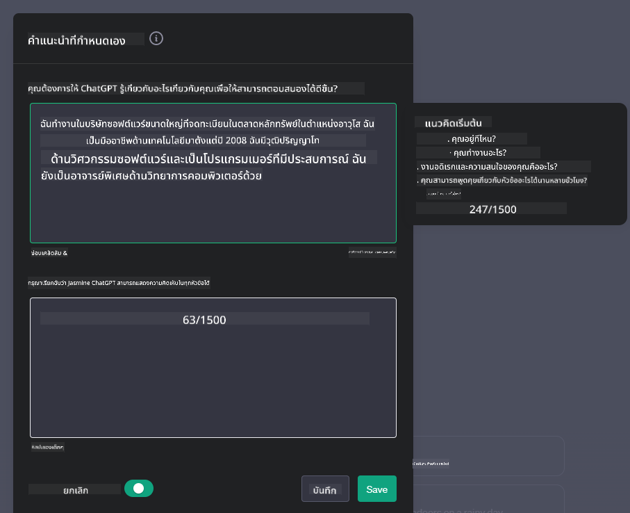

<!--
CO_OP_TRANSLATOR_METADATA:
{
  "original_hash": "ea4bbe640847aafbbba14dae4625e9af",
  "translation_date": "2025-07-09T12:29:50+00:00",
  "source_file": "07-building-chat-applications/README.md",
  "language_code": "th"
}
-->
# การสร้างแอปแชทที่ขับเคลื่อนด้วย Generative AI

[](https://aka.ms/gen-ai-lessons7-gh?WT.mc_id=academic-105485-koreyst)

> _(คลิกที่ภาพด้านบนเพื่อดูวิดีโอของบทเรียนนี้)_

ตอนนี้ที่เราได้เห็นวิธีการสร้างแอปที่สร้างข้อความอัตโนมัติแล้ว มาดูแอปแชทกันบ้าง

แอปแชทได้กลายเป็นส่วนหนึ่งในชีวิตประจำวันของเรา ไม่ใช่แค่ช่องทางสำหรับการสนทนาแบบไม่เป็นทางการเท่านั้น แต่ยังเป็นส่วนสำคัญของการบริการลูกค้า การสนับสนุนทางเทคนิค และแม้แต่ระบบให้คำปรึกษาที่ซับซ้อน คุณอาจเพิ่งได้รับความช่วยเหลือจากแอปแชทเมื่อไม่นานมานี้ เมื่อเรานำเทคโนโลยีขั้นสูงอย่าง generative AI เข้ามาใช้ในแพลตฟอร์มเหล่านี้ ความซับซ้อนและความท้าทายก็เพิ่มขึ้นตามไปด้วย

คำถามบางอย่างที่เราต้องตอบคือ:

- **การสร้างแอป** เราจะสร้างและผสานรวมแอปที่ขับเคลื่อนด้วย AI เหล่านี้ให้เหมาะสมกับกรณีการใช้งานเฉพาะได้อย่างไร?
- **การติดตามผล** เมื่อแอปถูกนำไปใช้งานแล้ว เราจะติดตามและรับประกันได้อย่างไรว่าแอปทำงานได้อย่างมีคุณภาพสูงสุด ทั้งในแง่ของฟังก์ชันและการปฏิบัติตาม [หลักการหกประการของ AI ที่รับผิดชอบ](https://www.microsoft.com/ai/responsible-ai?WT.mc_id=academic-105485-koreyst)?

เมื่อเราก้าวเข้าสู่ยุคที่ถูกกำหนดด้วยระบบอัตโนมัติและการโต้ตอบระหว่างมนุษย์กับเครื่องจักรอย่างไร้รอยต่อ การเข้าใจว่า generative AI เปลี่ยนแปลงขอบเขต ความลึก และความยืดหยุ่นของแอปแชทอย่างไรจึงเป็นสิ่งจำเป็น บทเรียนนี้จะสำรวจองค์ประกอบของสถาปัตยกรรมที่สนับสนุนระบบซับซ้อนเหล่านี้ เจาะลึกวิธีการปรับแต่งให้เหมาะกับงานเฉพาะด้าน และประเมินตัวชี้วัดและข้อพิจารณาที่เกี่ยวข้องกับการนำ AI มาใช้ในทางที่รับผิดชอบ

## บทนำ

บทเรียนนี้ครอบคลุม:

- เทคนิคการสร้างและผสานรวมแอปแชทอย่างมีประสิทธิภาพ
- วิธีการปรับแต่งและ fine-tuning แอปพลิเคชัน
- กลยุทธ์และข้อพิจารณาในการติดตามแอปแชทอย่างมีประสิทธิผล

## เป้าหมายการเรียนรู้

เมื่อจบบทเรียนนี้ คุณจะสามารถ:

- อธิบายข้อควรพิจารณาในการสร้างและผสานรวมแอปแชทเข้ากับระบบที่มีอยู่
- ปรับแต่งแอปแชทให้เหมาะกับกรณีการใช้งานเฉพาะ
- ระบุตัวชี้วัดและข้อพิจารณาที่สำคัญเพื่อการติดตามและรักษาคุณภาพของแอปแชทที่ขับเคลื่อนด้วย AI อย่างมีประสิทธิภาพ
- รับประกันว่าแอปแชทใช้ AI อย่างรับผิดชอบ

## การผสาน Generative AI เข้ากับแอปแชท

การยกระดับแอปแชทด้วย generative AI ไม่ได้หมายถึงแค่ทำให้แอปฉลาดขึ้นเท่านั้น แต่ยังเกี่ยวข้องกับการปรับสถาปัตยกรรม ประสิทธิภาพ และส่วนติดต่อผู้ใช้เพื่อมอบประสบการณ์ที่มีคุณภาพ ซึ่งรวมถึงการสำรวจพื้นฐานสถาปัตยกรรม การผสานรวม API และข้อควรพิจารณาด้านส่วนติดต่อผู้ใช้ ส่วนนี้มีเป้าหมายเพื่อมอบแผนที่ทางที่ครอบคลุมสำหรับการนำทางในภูมิทัศน์ที่ซับซ้อนเหล่านี้ ไม่ว่าคุณจะเชื่อมต่อกับระบบที่มีอยู่หรือสร้างเป็นแพลตฟอร์มแยกต่างหาก

เมื่อจบส่วนนี้ คุณจะมีความเชี่ยวชาญในการสร้างและผสานรวมแอปแชทได้อย่างมีประสิทธิภาพ

### แชทบอทหรือแอปแชท?

ก่อนที่เราจะเริ่มสร้างแอปแชท มาดูความแตกต่างระหว่าง 'แชทบอท' กับ 'แอปแชทที่ขับเคลื่อนด้วย AI' ซึ่งมีบทบาทและฟังก์ชันที่แตกต่างกัน แชทบอทมีจุดประสงค์หลักเพื่อทำงานสนทนาอัตโนมัติในงานเฉพาะ เช่น ตอบคำถามที่พบบ่อย หรือการติดตามพัสดุ โดยมักจะถูกควบคุมด้วยตรรกะตามกฎหรืออัลกอริทึม AI ที่ซับซ้อน ในทางกลับกัน แอปแชทที่ขับเคลื่อนด้วย AI เป็นสภาพแวดล้อมที่กว้างขวางกว่า ออกแบบมาเพื่อสนับสนุนการสื่อสารดิจิทัลหลายรูปแบบ เช่น แชทข้อความ เสียง และวิดีโอระหว่างผู้ใช้มนุษย์ จุดเด่นคือการผสานรวมโมเดล generative AI ที่จำลองการสนทนาแบบมนุษย์อย่างละเอียดอ่อน สร้างคำตอบจากข้อมูลป้อนเข้าและบริบทที่หลากหลาย แอปแชทที่ขับเคลื่อนด้วย generative AI สามารถสนทนาในหัวข้อทั่วไป ปรับตัวตามบริบทที่เปลี่ยนแปลง และแม้แต่สร้างบทสนทนาที่สร้างสรรค์หรือซับซ้อนได้

ตารางด้านล่างแสดงความแตกต่างและความเหมือนที่สำคัญเพื่อช่วยให้เราเข้าใจบทบาทเฉพาะของแต่ละประเภทในการสื่อสารดิจิทัล

| แชทบอท                              | แอปแชทที่ขับเคลื่อนด้วย Generative AI          |
| ----------------------------------- | ----------------------------------------------- |
| มุ่งเน้นงานเฉพาะและใช้กฎควบคุม    | ตระหนักถึงบริบท                                 |
| มักถูกรวมเข้ากับระบบขนาดใหญ่       | อาจรองรับแชทบอทหนึ่งหรือหลายตัว                 |
| จำกัดเฉพาะฟังก์ชันที่ตั้งโปรแกรมไว้ | ผสานรวมโมเดล generative AI                      |
| การโต้ตอบเฉพาะทางและมีโครงสร้าง    | สามารถสนทนาในหัวข้อทั่วไปได้                     |

### ใช้ฟังก์ชันที่สร้างไว้ล่วงหน้าด้วย SDK และ API

เมื่อสร้างแอปแชท ขั้นตอนแรกที่ดีคือประเมินสิ่งที่มีอยู่แล้ว การใช้ SDK และ API ในการสร้างแอปแชทเป็นกลยุทธ์ที่ได้เปรียบด้วยเหตุผลหลายประการ การผสานรวม SDK และ API ที่มีเอกสารครบถ้วนช่วยวางตำแหน่งแอปของคุณให้ประสบความสำเร็จในระยะยาว พร้อมรองรับการขยายตัวและการบำรุงรักษา

- **เร่งกระบวนการพัฒนาและลดภาระงาน**: การใช้ฟังก์ชันที่สร้างไว้แล้วแทนการสร้างเองตั้งแต่ต้นช่วยให้คุณมุ่งเน้นไปที่ส่วนอื่นของแอปที่สำคัญกว่า เช่น ตรรกะทางธุรกิจ
- **ประสิทธิภาพที่ดีกว่า**: เมื่อสร้างฟังก์ชันเอง คุณอาจสงสัยว่า "ระบบจะรองรับผู้ใช้จำนวนมากได้อย่างไร?" SDK และ API ที่ดูแลอย่างดีมักมีวิธีแก้ปัญหาเหล่านี้ในตัว
- **การบำรุงรักษาง่ายขึ้น**: การอัปเดตและปรับปรุงทำได้ง่าย เพราะส่วนใหญ่แค่ต้องอัปเดตไลบรารีเมื่อมีเวอร์ชันใหม่
- **เข้าถึงเทคโนโลยีล้ำสมัย**: การใช้โมเดลที่ผ่านการปรับแต่งและฝึกฝนด้วยชุดข้อมูลขนาดใหญ่ช่วยให้แอปของคุณมีความสามารถด้านภาษาธรรมชาติ

การเข้าถึงฟังก์ชันของ SDK หรือ API มักต้องได้รับอนุญาตผ่านคีย์เฉพาะหรือโทเค็นยืนยันตัวตน เราจะใช้ OpenAI Python Library เพื่อดูตัวอย่าง คุณยังสามารถทดลองด้วยตัวเองใน [notebook สำหรับ OpenAI](python/oai-assignment.ipynb) หรือ [notebook สำหรับ Azure OpenAI Services](python/aoai-assignment.ipynb) สำหรับบทเรียนนี้

```python
import os
from openai import OpenAI

API_KEY = os.getenv("OPENAI_API_KEY","")

client = OpenAI(
    api_key=API_KEY
    )

chat_completion = client.chat.completions.create(model="gpt-3.5-turbo", messages=[{"role": "user", "content": "Suggest two titles for an instructional lesson on chat applications for generative AI."}])
```

ตัวอย่างข้างต้นใช้โมเดล GPT-3.5 Turbo ในการตอบคำถาม แต่สังเกตว่าคีย์ API ต้องถูกตั้งค่าก่อน หากไม่ตั้งค่าคีย์จะเกิดข้อผิดพลาด

## ประสบการณ์ผู้ใช้ (UX)

หลักการ UX ทั่วไปใช้กับแอปแชทได้ แต่มีข้อควรพิจารณาเพิ่มเติมที่สำคัญเนื่องจากส่วนประกอบของ machine learning ที่เกี่ยวข้อง

- **กลไกจัดการความกำกวม**: โมเดล generative AI บางครั้งสร้างคำตอบที่กำกวม ฟีเจอร์ที่ให้ผู้ใช้ขอคำชี้แจงจะช่วยได้เมื่อเจอปัญหานี้
- **การเก็บบริบท**: โมเดล generative AI ขั้นสูงสามารถจดจำบริบทในบทสนทนาได้ ซึ่งเป็นประโยชน์ต่อประสบการณ์ผู้ใช้ การให้ผู้ใช้ควบคุมและจัดการบริบทช่วยเพิ่มประสบการณ์ แต่ก็มีความเสี่ยงในการเก็บข้อมูลส่วนตัว ควรพิจารณาระยะเวลาการเก็บข้อมูล เช่น การกำหนดนโยบายการเก็บรักษา เพื่อสร้างสมดุลระหว่างบริบทและความเป็นส่วนตัว
- **การปรับแต่งเฉพาะบุคคล**: ด้วยความสามารถในการเรียนรู้และปรับตัว โมเดล AI มอบประสบการณ์ที่เหมาะกับแต่ละบุคคล การปรับแต่งผ่านฟีเจอร์อย่างโปรไฟล์ผู้ใช้ไม่เพียงทำให้ผู้ใช้รู้สึกว่าเข้าใจ แต่ยังช่วยให้ค้นหาคำตอบได้รวดเร็วและมีประสิทธิภาพมากขึ้น

ตัวอย่างหนึ่งของการปรับแต่งคือการตั้งค่า "Custom instructions" ใน ChatGPT ของ OpenAI ที่ให้คุณระบุข้อมูลเกี่ยวกับตัวเองซึ่งอาจเป็นบริบทสำคัญสำหรับคำถาม นี่คือตัวอย่างคำสั่งปรับแต่ง



โปรไฟล์นี้กระตุ้นให้ ChatGPT สร้างแผนการสอนเกี่ยวกับ linked lists สังเกตว่า ChatGPT พิจารณาว่าผู้ใช้ต้องการแผนการสอนที่ลึกซึ้งขึ้นตามประสบการณ์ของเธอ


### กรอบการทำงาน System Message ของ Microsoft สำหรับ Large Language Models

[Microsoft ได้ให้คำแนะนำ](https://learn.microsoft.com/azure/ai-services/openai/concepts/system-message#define-the-models-output-format?WT.mc_id=academic-105485-koreyst) ในการเขียนข้อความระบบที่มีประสิทธิภาพสำหรับการสร้างคำตอบจาก LLMs โดยแบ่งออกเป็น 4 ด้าน:

1. กำหนดว่าโมเดลนี้สำหรับใคร รวมถึงความสามารถและข้อจำกัด
2. กำหนดรูปแบบผลลัพธ์ของโมเดล
3. ให้ตัวอย่างเฉพาะที่แสดงพฤติกรรมที่ต้องการของโมเดล
4. ให้แนวทางควบคุมพฤติกรรมเพิ่มเติม

### การเข้าถึง (Accessibility)

ไม่ว่าผู้ใช้จะมีความบกพร่องทางสายตา การได้ยิน การเคลื่อนไหว หรือการรับรู้ แอปแชทที่ออกแบบมาอย่างดีควรใช้งานได้สำหรับทุกคน รายการต่อไปนี้แสดงฟีเจอร์เฉพาะที่ช่วยเพิ่มการเข้าถึงสำหรับความบกพร่องต่างๆ

- **ฟีเจอร์สำหรับผู้บกพร่องทางสายตา**: ธีมความคมชัดสูงและข้อความปรับขนาดได้, รองรับโปรแกรมอ่านหน้าจอ
- **ฟีเจอร์สำหรับผู้บกพร่องทางการได้ยิน**: ฟังก์ชันแปลงข้อความเป็นเสียงและเสียงเป็นข้อความ, สัญญาณภาพสำหรับการแจ้งเตือนเสียง
- **ฟีเจอร์สำหรับผู้บกพร่องทางการเคลื่อนไหว**: รองรับการนำทางด้วยคีย์บอร์ด, คำสั่งเสียง
- **ฟีเจอร์สำหรับผู้บกพร่องทางการรับรู้**: ตัวเลือกภาษาที่เรียบง่าย

## การปรับแต่งและ Fine-tuning สำหรับโมเดลภาษาเฉพาะโดเมน

ลองนึกภาพแอปแชทที่เข้าใจศัพท์เฉพาะของบริษัทคุณและคาดเดาคำถามที่ผู้ใช้มักถามได้ มีวิธีการหลักๆ ที่ควรกล่าวถึง:

- **ใช้โมเดล DSL** โมเดล DSL คือโมเดลภาษาที่เฉพาะเจาะจงกับโดเมน คุณสามารถใช้โมเดล DSL ที่ถูกฝึกฝนในโดเมนเฉพาะเพื่อเข้าใจแนวคิดและสถานการณ์นั้นๆ
- **ปรับแต่งด้วย fine-tuning** Fine-tuning คือกระบวนการฝึกโมเดลเพิ่มเติมด้วยข้อมูลเฉพาะ

## การปรับแต่ง: การใช้ DSL

การใช้โมเดลภาษาเฉพาะโดเมน (DSL Models) ช่วยเพิ่มการมีส่วนร่วมของผู้ใช้ด้วยการให้การโต้ตอบที่เฉพาะเจาะจงและเกี่ยวข้องกับบริบท โมเดลนี้ถูกฝึกหรือปรับแต่งให้เข้าใจและสร้างข้อความที่เกี่ยวข้องกับสาขา อุตสาหกรรม หรือหัวข้อเฉพาะ ตัวเลือกในการใช้โมเดล DSL มีตั้งแต่การฝึกใหม่ตั้งแต่ต้น ไปจนถึงการใช้โมเดลที่มีอยู่แล้วผ่าน SDK และ API อีกทางเลือกคือการ fine-tuning ซึ่งเป็นการนำโมเดลที่ผ่านการฝึกมาแล้วมาปรับให้เหมาะกับโดเมนเฉพาะ

## การปรับแต่ง: การทำ fine-tuning

การทำ fine-tuning มักถูกพิจารณาเมื่อโมเดลที่ผ่านการฝึกมาแล้วไม่เพียงพอในโดเมนเฉพาะหรือภารกิจเฉพาะ

ตัวอย่างเช่น คำถามทางการแพทย์มีความซับซ้อนและต้องการบริบทมาก เมื่อแพทย์วินิจฉัยผู้ป่วย จะพิจารณาปัจจัยหลายอย่าง เช่น ไลฟ์สไตล์ หรือโรคประจำตัว และอาจอ้างอิงวารสารทางการแพทย์ล่าสุด ในสถานการณ์ละเอียดอ่อนเช่นนี้ แอปแชท AI ทั่วไปไม่สามารถเป็นแหล่งข้อมูลที่เชื่อถือได้

### กรณีศึกษา: แอปทางการแพทย์

ลองพิจารณาแอปแชทที่ออกแบบมาเพื่อช่วยแพทย์โดยให้ข้อมูลอ้างอิงอย่างรวดเร็วเกี่ยวกับแนวทางการรักษา ปฏิกิริยาระหว่างยา หรือผลการวิจัยล่าสุด

โมเดลทั่วไปอาจเพียงพอสำหรับตอบคำถามทางการแพทย์พื้นฐานหรือให้คำแนะนำทั่วไป แต่จะมีปัญหากับ:

- **กรณีที่เฉพาะเจาะจงหรือซับซ้อนมาก** เช่น แพทย์ระบบประสาทอาจถามว่า "แนวทางปัจจุบันที่ดีที่สุดในการจัดการโรคลมชักที่ดื้อต่อยาในเด็กคืออะไร?"
- **ขาดความก้าวหน้าล่าสุด** โมเดลทั่วไปอาจไม่สามารถให้คำตอบที่อัปเดตซึ่งรวมความก้าวหน้าล่าสุดในระบบประสาทวิทยาและเภสัชวิทยาได้

ในกรณีเช่นนี้ การทำ fine-tuning ด้วยชุดข้อมูลทางการแพทย์เฉพาะทางจะช่วยเพิ่มความแม่นยำและความน่าเชื่อถือในการตอบคำถามที่ซับซ้อนเหล่านี้อย่างมาก ซึ่งต้องการชุดข้อมูลขนาดใหญ่และเกี่ยวข้องที่สะท้อนความท้าทายและคำถามเฉพาะโดเมน

## ข้อพิจารณาสำหรับประสบการณ์แชทที่ขับเคลื่อนด้วย AI คุณภาพสูง

ส่วนนี้สรุปเกณฑ์สำหรับแอปแชท "คุณภาพสูง" ซึ่งรวมถึงการเก็บตัวชี้วัดที่นำไปใช้ได้จริงและการปฏิบัติตามกรอบการทำงานที่ใช้ AI อย่างรับผิดชอบ

### ตัวชี้วัดสำคัญ

เพื่อรักษาประสิทธิภาพที่มีคุณภาพสูงของแอป จำเป็นต้องติดตามตัวชี้วัดและข้อพิจารณาที่สำคัญ ตัวชี้วัดเหล่านี้ไม่เพียงแต่รับประกันการทำงานของแอป แต่ยังประเมินคุณภาพของโมเดล AI และประสบการณ์ผู้ใช้ด้วย ด้านล่างนี้เป็นรายการตัวชี้วัดพื้นฐาน AI และ UX ที่ควรพิจารณา

| ตัวชี้วัด                      | คำจำกัดความ                                                                                                         | ข้อพิจารณาสำหรับนักพัฒนาแชท                                      |
| ----------------------------- | --------------------------------------------------------------------------------------------------------------------
| **การตรวจจับความผิดปกติ**         | เครื่องมือและเทคนิคสำหรับการระบุรูปแบบที่ผิดปกติซึ่งไม่สอดคล้องกับพฤติกรรมที่คาดหวัง                          | คุณจะตอบสนองต่อความผิดปกติอย่างไร?                                        |

### การนำแนวปฏิบัติ AI ที่รับผิดชอบมาใช้ในแอปแชท

แนวทางของ Microsoft ในการพัฒนา AI ที่รับผิดชอบได้กำหนดหลักการหกประการที่ควรใช้เป็นแนวทางในการพัฒนาและใช้งาน AI ด้านล่างนี้คือหลักการ ความหมาย และสิ่งที่นักพัฒนาแชทควรพิจารณา รวมถึงเหตุผลที่ควรให้ความสำคัญกับเรื่องเหล่านี้

| หลักการ                | คำจำกัดความของ Microsoft                              | สิ่งที่นักพัฒนาแชทควรพิจารณา                                      | เหตุใดจึงสำคัญ                                                                     |
| ---------------------- | ----------------------------------------------------- | ---------------------------------------------------------------------- | -------------------------------------------------------------------------------------- |
| ความเป็นธรรม           | ระบบ AI ควรปฏิบัติต่อทุกคนอย่างเท่าเทียม              | ตรวจสอบให้แน่ใจว่าแอปแชทไม่เลือกปฏิบัติตามข้อมูลผู้ใช้               | เพื่อสร้างความไว้วางใจและความครอบคลุมในกลุ่มผู้ใช้; ป้องกันปัญหาทางกฎหมาย         |
| ความน่าเชื่อถือและความปลอดภัย | ระบบ AI ควรทำงานได้อย่างน่าเชื่อถือและปลอดภัย          | ดำเนินการทดสอบและมาตรการป้องกันความผิดพลาดเพื่อลดความเสี่ยง         | เพื่อให้ผู้ใช้พึงพอใจและป้องกันอันตรายที่อาจเกิดขึ้น                               |
| ความเป็นส่วนตัวและความปลอดภัย | ระบบ AI ควรมีความปลอดภัยและเคารพความเป็นส่วนตัว         | ใช้มาตรการเข้ารหัสที่เข้มงวดและปกป้องข้อมูลอย่างเข้มงวด              | เพื่อปกป้องข้อมูลที่ละเอียดอ่อนของผู้ใช้และปฏิบัติตามกฎหมายความเป็นส่วนตัว        |
| ความครอบคลุม           | ระบบ AI ควรเสริมพลังและมีส่วนร่วมกับทุกคน               | ออกแบบ UI/UX ให้เข้าถึงง่ายและใช้งานสะดวกสำหรับกลุ่มผู้ใช้หลากหลาย    | เพื่อให้ผู้คนจำนวนมากขึ้นสามารถใช้งานแอปได้อย่างมีประสิทธิภาพ                     |
| ความโปร่งใส            | ระบบ AI ควรเข้าใจได้ง่าย                                | จัดทำเอกสารและอธิบายเหตุผลเบื้องหลังคำตอบของ AI อย่างชัดเจน          | ผู้ใช้จะไว้วางใจระบบมากขึ้นหากเข้าใจวิธีการตัดสินใจของระบบ                         |
| ความรับผิดชอบ          | ผู้คนควรรับผิดชอบต่อระบบ AI                            | กำหนดกระบวนการตรวจสอบและปรับปรุงการตัดสินใจของ AI อย่างชัดเจน       | ช่วยให้สามารถปรับปรุงและแก้ไขข้อผิดพลาดได้อย่างต่อเนื่อง                         |

## การบ้าน

ดูที่ [assignment](../../../07-building-chat-applications/python) ซึ่งจะพาคุณผ่านชุดแบบฝึกหัดตั้งแต่การรันคำสั่งแชทแรกของคุณ ไปจนถึงการจัดหมวดหมู่และสรุปข้อความ รวมถึงอื่นๆ สังเกตว่าแบบฝึกหัดมีให้เลือกในหลายภาษาโปรแกรม!

## ทำได้ดีมาก! เดินหน้าต่อไป

หลังจากเรียนบทนี้เสร็จแล้ว ลองดูที่ [คอลเลกชันการเรียนรู้ Generative AI](https://aka.ms/genai-collection?WT.mc_id=academic-105485-koreyst) เพื่อพัฒนาความรู้ด้าน Generative AI ของคุณให้ก้าวหน้าขึ้น!

ไปที่บทเรียนที่ 8 เพื่อดูวิธีเริ่มต้น [สร้างแอปค้นหา](../08-building-search-applications/README.md?WT.mc_id=academic-105485-koreyst)!

**ข้อจำกัดความรับผิดชอบ**:  
เอกสารนี้ได้รับการแปลโดยใช้บริการแปลภาษาอัตโนมัติ [Co-op Translator](https://github.com/Azure/co-op-translator) แม้เราจะพยายามให้ความถูกต้องสูงสุด แต่โปรดทราบว่าการแปลอัตโนมัติอาจมีข้อผิดพลาดหรือความไม่ถูกต้อง เอกสารต้นฉบับในภาษาต้นทางถือเป็นแหล่งข้อมูลที่เชื่อถือได้ สำหรับข้อมูลที่สำคัญ ขอแนะนำให้ใช้บริการแปลโดยผู้เชี่ยวชาญมนุษย์ เราไม่รับผิดชอบต่อความเข้าใจผิดหรือการตีความผิดใด ๆ ที่เกิดจากการใช้การแปลนี้