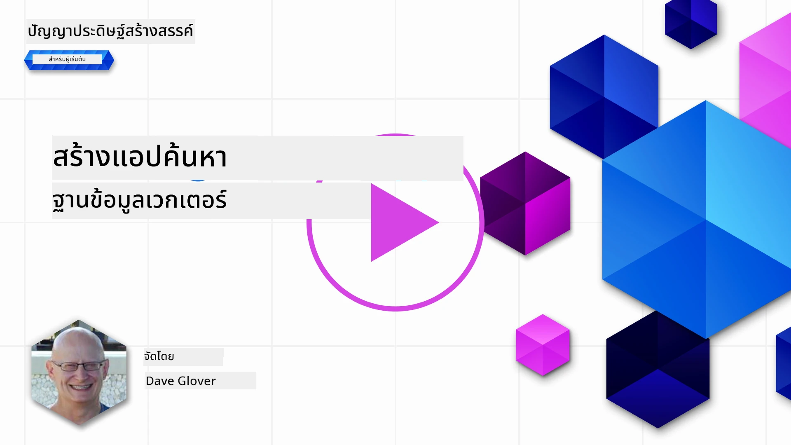
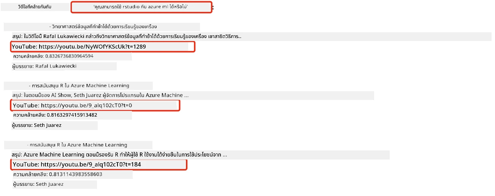
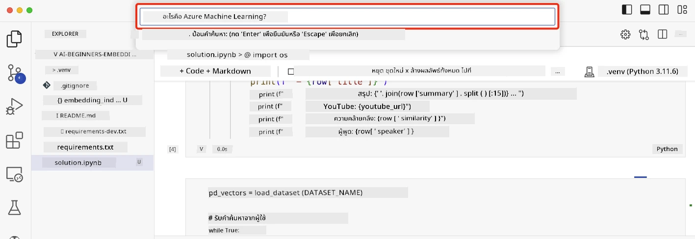

# การสร้างแอปพลิเคชันค้นหา

[](https://youtu.be/W0-nzXjOjr0?si=GcsqiTTvd7RKbo7V)

> > _คลิกที่ภาพด้านบนเพื่อดูวิดีโอบทเรียนนี้_

LLMs มีมากกว่าแชทบอทและการสร้างข้อความเท่านั้น ยังสามารถสร้างแอปพลิเคชันค้นหาโดยใช้ Embeddings ได้ Embeddings คือการแทนค่าข้อมูลในรูปแบบตัวเลขหรือเวกเตอร์ และสามารถใช้สำหรับการค้นหาเชิงความหมายสำหรับข้อมูล

ในบทเรียนนี้ คุณจะสร้างแอปพลิเคชันค้นหาสำหรับสตาร์ทอัพด้านการศึกษา สตาร์ทอัพของเราเป็นองค์กรไม่มุ่งหวังกำไรที่ให้การศึกษาฟรีแก่ผู้เรียนในประเทศกำลังพัฒนา สตาร์ทอัพของเรามีวิดีโอยูทูบจำนวนมากที่นักเรียนสามารถใช้เรียนรู้เกี่ยวกับ AI สตาร์ทอัพของเราต้องการสร้างแอปพลิเคชันค้นหาที่อนุญาตให้นักเรียนค้นหาวิดีโอยูทูบโดยการพิมพ์คำถาม

ตัวอย่างเช่น นักเรียนอาจพิมพ์ว่า 'Jupyter Notebooks คืออะไร?' หรือ 'Azure ML คืออะไร' และแอปพลิเคชันค้นหาจะส่งคืนรายการวิดีโอยูทูบที่เกี่ยวข้องกับคำถาม และยิ่งไปกว่านั้น แอปพลิเคชันค้นหาจะส่งคืนลิงก์ไปยังตำแหน่งในวิดีโอที่คำตอบของคำถามนั้นอยู่

## บทนำ

ในบทเรียนนี้ เราจะครอบคลุม:

- การค้นหาเชิงความหมายกับการค้นหาด้วยคีย์เวิร์ด
- Text Embeddings คืออะไร
- การสร้างดัชนี Text Embeddings
- การค้นหาในดัชนี Text Embeddings

## เป้าหมายการเรียนรู้

หลังจากทำบทเรียนนี้เสร็จ คุณจะสามารถ:

- บอกความแตกต่างระหว่างการค้นหาเชิงความหมายและการค้นหาด้วยคีย์เวิร์ด
- อธิบายว่า Text Embeddings คืออะไร
- สร้างแอปพลิเคชันโดยใช้ Embeddings เพื่อค้นหาข้อมูล

## ทำไมต้องสร้างแอปพลิเคชันค้นหา?

การสร้างแอปพลิเคชันค้นหาจะช่วยให้คุณเข้าใจการใช้ Embeddings เพื่อค้นหาข้อมูล นอกจากนี้คุณยังจะได้เรียนรู้วิธีสร้างแอปพลิเคชันค้นหาที่นักเรียนสามารถใช้เพื่อค้นหาข้อมูลได้อย่างรวดเร็ว

บทเรียนมีดัชนี Embedding ของข้อความถอดเสียงวิดีโอยูทูบจากช่อง Microsoft [AI Show](https://www.youtube.com/playlist?list=PLlrxD0HtieHi0mwteKBOfEeOYf0LJU4O1) ช่อง AI Show เป็นช่องยูทูบที่สอนเกี่ยวกับ AI และการเรียนรู้ของเครื่อง ดัชนี Embedding ประกอบด้วย Embeddings สำหรับข้อความถอดเสียงยูทูบแต่ละตอนจนถึงเดือนตุลาคม 2023 คุณจะใช้ดัชนี Embedding นี้ในการสร้างแอปพลิเคชันค้นหาสำหรับสตาร์ทอัพของเรา แอปพลิเคชันค้นหาจะส่งคืนลิงก์ไปยังตำแหน่งในวิดีโอที่คำตอบของคำถามอยู่ นี่เป็นวิธีที่ยอดเยี่ยมสำหรับนักเรียนในการค้นหาข้อมูลที่ต้องการได้อย่างรวดเร็ว

ตัวอย่างต่อไปนี้เป็นการสืบค้นเชิงความหมายสำหรับคำถาม 'คุณสามารถใช้ rstudio กับ Azure ML ได้ไหม?' ตรวจสอบ url ของ YouTube คุณจะเห็นว่า url มี timestamp ที่พาคุณไปยังตำแหน่งในวิดีโอที่คำตอบของคำถามนั้นอยู่



## การค้นหาเชิงความหมายคืออะไร?

คุณอาจสงสัยว่า การค้นหาเชิงความหมายคืออะไร? การค้นหาเชิงความหมายเป็นเทคนิคการค้นหาที่ใช้ความหมายของคำในสืบค้นเพื่อส่งคืนผลลัพธ์ที่เกี่ยวข้อง

นี่คือตัวอย่างของการค้นหาเชิงความหมาย สมมติว่าคุณต้องการซื้อรถ คุณอาจค้นหาคำว่า 'รถในฝันของฉัน' การค้นหาเชิงความหมายจะเข้าใจว่าคุณไม่ได้ `ฝัน` ถึงรถ แต่ว่าคุณกำลังมองหารถ `ในอุดมคติ` ของคุณ การค้นหาเชิงความหมายเข้าใจเจตนาของคุณและส่งคืนผลลัพธ์ที่เกี่ยวข้อง อย่างไรก็ตาม การค้นหาด้วย `คีย์เวิร์ด` จะค้นหาอย่างตรงตัวเกี่ยวกับความฝันถึงรถและมักส่งผลลัพธ์ที่ไม่เกี่ยวข้อง

## Text Embeddings คืออะไร?

[Text embeddings](https://en.wikipedia.org/wiki/Word_embedding?WT.mc_id=academic-105485-koreyst) คือเทคนิคการแทนข้อความที่ใช้ใน [natural language processing](https://en.wikipedia.org/wiki/Natural_language_processing?WT.mc_id=academic-105485-koreyst) Text embeddings คือการแทนค่าทางตัวเลขเชิงความหมายของข้อความ Embeddings ถูกใช้เพื่อแทนข้อมูลในรูปแบบที่เครื่องสามารถเข้าใจได้ง่าย มีโมเดลหลายแบบสำหรับการสร้าง text embeddings ในบทเรียนนี้ เราจะมุ่งเน้นที่การสร้าง embeddings โดยใช้โมเดล OpenAI Embedding

ตัวอย่างเช่น สมมตive ข้อความต่อไปนี้เป็นข้อความถอดเสียงจากตอนหนึ่งในช่อง AI Show บน YouTube:

```text
Today we are going to learn about Azure Machine Learning.
```

เราจะส่งข้อความนี้ไปยัง OpenAI Embedding API และมันจะส่ง embedding ที่ประกอบด้วยตัวเลข 1536 ตัว หรือที่เรียกว่าเวกเตอร์กลับมา ตัวเลขแต่ละตัวในเวกเตอร์แทนแง่มุมที่แตกต่างกันของข้อความ สำหรับความกระชับ นี่คือตัวเลข 10 ตัวแรกในเวกเตอร์

```python
[-0.006655829958617687, 0.0026128944009542465, 0.008792596869170666, -0.02446001023054123, -0.008540431968867779, 0.022071078419685364, -0.010703742504119873, 0.003311325330287218, -0.011632772162556648, -0.02187200076878071, ...]
```

## ดัชนี Embedding ถูกสร้างขึ้นอย่างไร?

ดัชนี Embedding สำหรับบทเรียนนี้ถูกสร้างขึ้นด้วยชุดสคริปต์ Python คุณจะพบสคริปต์พร้อมคำแนะนำใน [README](./scripts/README.md?WT.mc_id=academic-105485-koreyst) ในโฟลเดอร์ 'scripts' ของบทเรียนนี้ คุณไม่จำเป็นต้องเรียกใช้สคริปต์เหล่านี้ในการทำบทเรียนให้เสร็จ เพราะดัชนี Embedding ได้ถูกจัดเตรียมไว้ให้แล้ว

สคริปต์ทำงานตามขั้นตอนดังนี้:

1. ดาวน์โหลดข้อความถอดเสียงของวิดีโอยูทูบแต่ละตอนในเพลย์ลิสต์ [AI Show](https://www.youtube.com/playlist?list=PLlrxD0HtieHi0mwteKBOfEeOYf0LJU4O1)
2. ใช้ [OpenAI Functions](https://learn.microsoft.com/azure/ai-foundry/openai/how-to/function-calling?WT.mc_id=academic-105485-koreyst) เพื่อพยายามดึงชื่อผู้พูดจาก 3 นาทีแรกของข้อความถอดเสียงวิดีโอยูทูบ ชื่อผู้พูดสำหรับแต่ละวิดีโอจะถูกจัดเก็บในดัชนี Embedding ที่ชื่อ `embedding_index_3m.json`
3. ข้อความถอดเสียงถูกแบ่งเป็น **เศษข้อความขนาด 3 นาที** เศษส่วนนี้รวมคำประมาณ 20 คำที่ซ้อนทับในส่วนถัดไปเพื่อให้ embedding ของเศษส่วนไม่ถูกตัดและเพื่อให้บริบทของการค้นหาดีขึ้น
4. เศษข้อความแต่ละส่วนถูกส่งไปยัง OpenAI Chat API เพื่อสรุปข้อความเป็น 60 คำ สรุปนี้ก็จะถูกเก็บไว้ในดัชนี Embedding `embedding_index_3m.json`
5. สุดท้าย ข้อความในเศษส่วนถูกส่งไปยัง OpenAI Embedding API Embedding API จะส่งกลับเวกเตอร์ที่ประกอบด้วยตัวเลข 1536 ตัวซึ่งแทนความหมายเชิงความหมายของเศษส่วน ข้อมูลของเศษส่วนพร้อมกับเวกเตอร์ OpenAI Embedding จะถูกเก็บไว้ในดัชนี Embedding `embedding_index_3m.json`

### ฐานข้อมูลเวกเตอร์

เพื่อความเรียบง่ายของบทเรียน ดัชนี Embedding จะถูกเก็บในไฟล์ JSON ชื่อ `embedding_index_3m.json` และโหลดเข้าสู่ Pandas DataFrame อย่างไรก็ตาม ในการใช้งานจริง ดัชนี Embedding จะถูกเก็บไว้ในฐานข้อมูลเวกเตอร์ เช่น [Azure Cognitive Search](https://learn.microsoft.com/training/modules/improve-search-results-vector-search?WT.mc_id=academic-105485-koreyst), [Redis](https://cookbook.openai.com/examples/vector_databases/redis/readme?WT.mc_id=academic-105485-koreyst), [Pinecone](https://cookbook.openai.com/examples/vector_databases/pinecone/readme?WT.mc_id=academic-105485-koreyst), [Weaviate](https://cookbook.openai.com/examples/vector_databases/weaviate/readme?WT.mc_id=academic-105485-koreyst) เป็นต้น

## การทำความเข้าใจความคล้ายคลึงกันแบบโคไซน์

เราได้เรียนรู้เกี่ยวกับ Text Embeddings ขั้นตอนต่อไปคือเรียนรู้วิธีใช้งาน text embeddings เพื่อค้นหาข้อมูล และโดยเฉพาะการหาความคล้ายกันที่สูงที่สุดของ embeddings กับการสืบค้นโดยใช้ cosine similarity

### ความคล้ายคลึงแบบโคไซน์คืออะไร?

ความคล้ายคลึงแบบโคไซน์เป็นมาตรวัดความคล้ายกันระหว่างเวกเตอร์สองตัว คุณจะได้ยินอีกว่าเป็น `nearest neighbor search` เพื่อทำการค้นหาแบบ cosine similarity คุณต้อง _แปลงเป็นเวกเตอร์_ สำหรับข้อความ _query_ โดยใช้ OpenAI Embedding API จากนั้นคำนวณ _cosine similarity_ ระหว่างเวกเตอร์ query กับเวกเตอร์แต่ละตัวในดัชนี Embedding จำไว้ว่า ดัชนี Embedding มีเวกเตอร์สำหรับแต่ละเศษข้อความถอดเสียงวิดีโอยูทูบ สุดท้าย จัดเรียงผลตามค่า cosine similarity และเศษข้อความที่มีค่า cosine similarity สูงสุดคือข้อความที่คล้ายกับ query มากที่สุด

ในแง่คณิตศาสตร์ cosine similarity วัดค่าโคไซน์ของมุมระหว่างเวกเตอร์สองตัวในพื้นที่มิติหลายมิติ การวัดนี้มีประโยชน์เพราะถึงแม้เอกสารสองชิ้นจะอยู่ห่างไกลด้วยระยะทาง Euclidean เพราะขนาด แต่ก็อาจมีมุมระหว่างกันน้อยและจึงมีค่า cosine similarity สูงกว่า สำหรับข้อมูลเพิ่มเติมเกี่ยวกับสมการ cosine similarity ดูที่ [Cosine similarity](https://en.wikipedia.org/wiki/Cosine_similarity?WT.mc_id=academic-105485-koreyst)

## การสร้างแอปพลิเคชันค้นหาแรกของคุณ

ต่อไป เราจะเรียนรู้วิธีสร้างแอปพลิเคชันค้นหาโดยใช้ Embeddings แอปพลิเคชันค้นหาจะช่วยให้นักเรียนค้นหาวิดีโอโดยพิมพ์คำถาม แอปพลิเคชันจะส่งคืนรายการวิดีโอที่เกี่ยวข้องกับคำถาม และจะส่งคืนลิงก์ไปยังตำแหน่งในวิดีโอที่คำตอบของคำถามอยู่

โซลูชันนี้ถูกสร้างและทดสอบบน Windows 11, macOS และ Ubuntu 22.04 โดยใช้ Python 3.10 หรือสูงกว่า คุณสามารถดาวน์โหลด Python ได้จาก [python.org](https://www.python.org/downloads/?WT.mc_id=academic-105485-koreyst)

## การบ้าน - การสร้างแอปพลิเคชันค้นหาเพื่อให้นักเรียนใช้งานได้

เราได้แนะนำสตาร์ทอัพของเราตั้งแต่ต้นบทเรียน ตอนนี้ถึงเวลาที่จะเปิดให้นักเรียนสร้างแอปพลิเคชันค้นหาสำหรับการประเมินของพวกเขาแล้ว

ในการบ้านนี้ คุณจะสร้าง Azure OpenAI Services ที่จะใช้ในการสร้างแอปพลิเคชันค้นหา คุณจะสร้าง Azure OpenAI Services ดังต่อไปนี้ คุณจะต้องมีการสมัครใช้งาน Azure เพื่อทำการบ้านนี้ให้เสร็จ

### เริ่มต้น Azure Cloud Shell

1. ลงชื่อเข้าใช้ที่ [Azure portal](https://portal.azure.com/?WT.mc_id=academic-105485-koreyst)
2. เลือกไอคอน Cloud Shell ที่มุมบนขวาของ Azure portal
3. เลือก **Bash** สำหรับประเภทสภาพแวดล้อม

#### สร้าง resource group

> สำหรับคำแนะนำนี้ เราจะใช้ resource group ชื่อ "semantic-video-search" ใน East US
> คุณสามารถเปลี่ยนชื่อ resource group ได้ แต่เมื่อเปลี่ยนตำแหน่งที่ตั้งของทรัพยากร
> โปรดตรวจสอบ [ตารางความพร้อมใช้งานโมเดล](https://aka.ms/oai/models?WT.mc_id=academic-105485-koreyst)

```shell
az group create --name semantic-video-search --location eastus
```

#### สร้าง Azure OpenAI Service resource

จาก Azure Cloud Shell ให้รันคำสั่งต่อไปนี้เพื่อสร้าง resource ของ Azure OpenAI Service

```shell
az cognitiveservices account create --name semantic-video-openai --resource-group semantic-video-search \
    --location eastus --kind OpenAI --sku s0
```

#### ดึง endpoint และกุญแจสำหรับการใช้งานในแอปนี้

จาก Azure Cloud Shell ให้รันคำสั่งต่อไปนี้เพื่อดึง endpoint และกุญแจสำหรับ resource ของ Azure OpenAI Service

```shell
az cognitiveservices account show --name semantic-video-openai \
   --resource-group  semantic-video-search | jq -r .properties.endpoint
az cognitiveservices account keys list --name semantic-video-openai \
   --resource-group semantic-video-search | jq -r .key1
```

#### เปิดใช้โมเดล OpenAI Embedding

จาก Azure Cloud Shell ให้รันคำสั่งต่อไปนี้เพื่อเปิดใช้โมเดล OpenAI Embedding

```shell
az cognitiveservices account deployment create \
    --name semantic-video-openai \
    --resource-group  semantic-video-search \
    --deployment-name text-embedding-ada-002 \
    --model-name text-embedding-ada-002 \
    --model-version "2"  \
    --model-format OpenAI \
    --sku-capacity 100 --sku-name "Standard"
```

## โซลูชัน

เปิด [solution notebook](./python/aoai-solution.ipynb?WT.mc_id=academic-105485-koreyst) ใน GitHub Codespaces และทำตามคำแนะนำใน Jupyter Notebook

เมื่อคุณรันสมุดบันทึก คุณจะได้รับแจ้งให้ป้อนสืบค้น ช่องป้อนข้อมูลจะมีลักษณะดังนี้:



## เยี่ยมมาก! เรียนรู้ต่อได้เลย

หลังจากทำบทเรียนนี้เสร็จแล้ว ลองดู [คอลเลกชันการเรียนรู้ Generative AI](https://aka.ms/genai-collection?WT.mc_id=academic-105485-koreyst) เพื่อพัฒนาความรู้ด้าน Generative AI ต่อไป!

ไปที่บทเรียน 9 เราจะดูวิธี [สร้างแอปพลิเคชันสร้างภาพ](../09-building-image-applications/README.md?WT.mc_id=academic-105485-koreyst)!

---

<!-- CO-OP TRANSLATOR DISCLAIMER START -->
**ปฏิเสธความรับผิดชอบ**:
เอกสารนี้ได้รับการแปลโดยใช้บริการแปลภาษา AI [Co-op Translator](https://github.com/Azure/co-op-translator) ขณะที่เราพยายามให้ความถูกต้อง โปรดทราบว่าการแปลโดยอัตโนมัติอาจมีข้อผิดพลาดหรือความไม่ถูกต้อง เอกสารต้นฉบับในภาษาต้นทางควรถูกพิจารณาเป็นแหล่งข้อมูลที่เชื่อถือได้ สำหรับข้อมูลที่สำคัญ แนะนำให้ใช้การแปลโดยมนุษย์มืออาชีพ เราไม่รับผิดชอบต่อความเข้าใจผิดหรือการตีความที่ผิดพลาดที่เกิดขึ้นจากการใช้การแปลนี้
<!-- CO-OP TRANSLATOR DISCLAIMER END -->