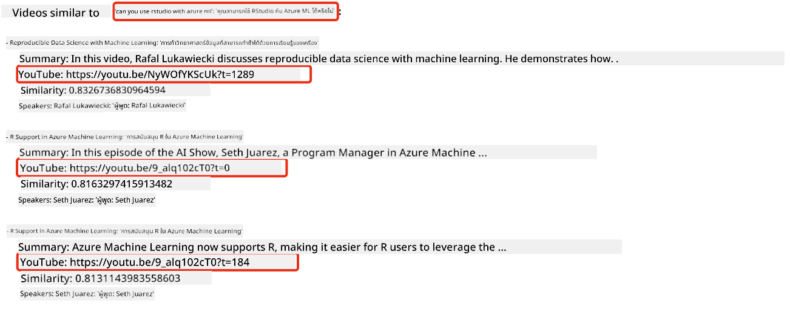
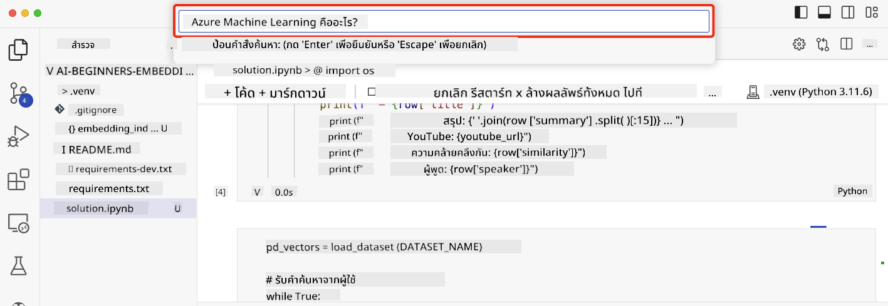

<!--
CO_OP_TRANSLATOR_METADATA:
{
  "original_hash": "d46aad0917a1a342d613e2c13d457da5",
  "translation_date": "2025-06-25T16:30:19+00:00",
  "source_file": "08-building-search-applications/README.md",
  "language_code": "th"
}
-->
# การสร้างแอปพลิเคชันค้นหา

[](https://aka.ms/gen-ai-lesson8-gh?WT.mc_id=academic-105485-koreyst)

> > _คลิกที่ภาพด้านบนเพื่อดูวิดีโอของบทเรียนนี้_

มีมากกว่าที่ LLMs สามารถทำได้มากกว่าการเป็นแชทบอทและการสร้างข้อความ ยังสามารถสร้างแอปพลิเคชันค้นหาโดยใช้ Embeddings ได้อีกด้วย Embeddings เป็นการแทนค่าข้อมูลเป็นตัวเลขที่เรียกว่าวิเตอร์ และสามารถใช้ในการค้นหาความหมายของข้อมูลได้

ในบทเรียนนี้ คุณจะสร้างแอปพลิเคชันค้นหาสำหรับการเริ่มต้นการศึกษาของเรา การเริ่มต้นของเราเป็นองค์กรไม่แสวงหาผลกำไรที่ให้การศึกษาฟรีแก่ผู้เรียนในประเทศกำลังพัฒนา การเริ่มต้นของเรามีวิดีโอ YouTube จำนวนมากที่นักเรียนสามารถใช้เพื่อเรียนรู้เกี่ยวกับ AI การเริ่มต้นของเราต้องการสร้างแอปพลิเคชันค้นหาที่ช่วยให้นักเรียนค้นหาวิดีโอ YouTube โดยการพิมพ์คำถาม

ตัวอย่างเช่น นักเรียนอาจพิมพ์ว่า 'Jupyter Notebooks คืออะไร?' หรือ 'Azure ML คืออะไร?' และแอปพลิเคชันค้นหาจะส่งคืนรายการวิดีโอ YouTube ที่เกี่ยวข้องกับคำถาม และดียิ่งขึ้น แอปพลิเคชันค้นหาจะส่งคืนลิงก์ไปยังตำแหน่งในวิดีโอที่มีคำตอบของคำถามนั้นอยู่

## บทนำ

ในบทเรียนนี้ เราจะครอบคลุม:

- การค้นหาความหมายกับการค้นหาคำสำคัญ
- Text Embeddings คืออะไร
- การสร้างดัชนี Text Embeddings
- การค้นหาดัชนี Text Embeddings

## เป้าหมายการเรียนรู้

หลังจากจบบทเรียนนี้ คุณจะสามารถ:

- บอกความแตกต่างระหว่างการค้นหาความหมายและการค้นหาคำสำคัญ
- อธิบายว่า Text Embeddings คืออะไร
- สร้างแอปพลิเคชันโดยใช้ Embeddings เพื่อค้นหาข้อมูล

## ทำไมต้องสร้างแอปพลิเคชันค้นหา?

การสร้างแอปพลิเคชันค้นหาจะช่วยให้คุณเข้าใจวิธีการใช้ Embeddings ในการค้นหาข้อมูล คุณจะได้เรียนรู้วิธีสร้างแอปพลิเคชันค้นหาที่นักเรียนสามารถใช้เพื่อค้นหาข้อมูลได้อย่างรวดเร็ว

บทเรียนนี้มีดัชนี Embedding ของการถอดความวิดีโอ YouTube สำหรับช่อง [AI Show](https://www.youtube.com/playlist?list=PLlrxD0HtieHi0mwteKBOfEeOYf0LJU4O1) ของ Microsoft AI Show เป็นช่อง YouTube ที่สอนเกี่ยวกับ AI และการเรียนรู้ของเครื่อง ดัชนี Embedding ประกอบด้วย Embeddings สำหรับการถอดความวิดีโอ YouTube จนถึงเดือนตุลาคม 2023 คุณจะใช้ดัชนี Embedding เพื่อสร้างแอปพลิเคชันค้นหาสำหรับการเริ่มต้นของเรา แอปพลิเคชันค้นหาจะส่งคืนลิงก์ไปยังตำแหน่งในวิดีโอที่มีคำตอบของคำถามอยู่ นี่เป็นวิธีที่ดีสำหรับนักเรียนในการค้นหาข้อมูลที่ต้องการได้อย่างรวดเร็ว

ต่อไปนี้คือตัวอย่างของการค้นหาความหมายสำหรับคำถาม 'คุณสามารถใช้ rstudio กับ azure ml ได้หรือไม่?' ดูที่ URL ของ YouTube คุณจะเห็นว่า URL มีการประทับเวลาที่นำคุณไปยังตำแหน่งในวิดีโอที่มีคำตอบของคำถามอยู่



## การค้นหาความหมายคืออะไร?

ตอนนี้คุณอาจสงสัยว่าการค้นหาความหมายคืออะไร การค้นหาความหมายเป็นเทคนิคการค้นหาที่ใช้ความหมายของคำในคำค้นหาเพื่อส่งคืนผลลัพธ์ที่เกี่ยวข้อง

นี่คือตัวอย่างของการค้นหาความหมาย สมมติว่าคุณกำลังมองหารถยนต์ คุณอาจค้นหา 'รถในฝันของฉัน' การค้นหาความหมายจะเข้าใจว่าคุณไม่ได้ `dreaming` เกี่ยวกับรถยนต์ แต่คุณกำลังมองหารถ `ideal` ของคุณ การค้นหาความหมายเข้าใจเจตนาของคุณและส่งคืนผลลัพธ์ที่เกี่ยวข้อง ทางเลือกคือ `keyword search` ซึ่งจะค้นหาความฝันเกี่ยวกับรถยนต์และมักจะส่งคืนผลลัพธ์ที่ไม่เกี่ยวข้อง

## Text Embeddings คืออะไร?

[Text embeddings](https://en.wikipedia.org/wiki/Word_embedding?WT.mc_id=academic-105485-koreyst) เป็นเทคนิคการแทนข้อความที่ใช้ใน [การประมวลผลภาษาธรรมชาติ](https://en.wikipedia.org/wiki/Natural_language_processing?WT.mc_id=academic-105485-koreyst) Text embeddings เป็นการแทนค่าข้อความเป็นตัวเลขที่มีความหมาย Embeddings ใช้ในการแทนข้อมูลในรูปแบบที่เครื่องสามารถเข้าใจได้ง่าย มีหลายโมเดลสำหรับการสร้าง Text Embeddings ในบทเรียนนี้ เราจะเน้นการสร้าง Embeddings โดยใช้ OpenAI Embedding Model

นี่คือตัวอย่าง ลองจินตนาการว่าข้อความต่อไปนี้อยู่ในการถอดความจากหนึ่งในตอนของช่อง AI Show บน YouTube:

```text
Today we are going to learn about Azure Machine Learning.
```

เราจะส่งข้อความไปยัง OpenAI Embedding API และมันจะส่งคืน Embedding ที่ประกอบด้วยตัวเลข 1536 ตัวที่เรียกว่าวิเตอร์ แต่ละตัวเลขในวิเตอร์แทนแง่มุมต่าง ๆ ของข้อความ เพื่อความย่อ นี่คือตัวเลข 10 ตัวแรกในวิเตอร์

```python
[-0.006655829958617687, 0.0026128944009542465, 0.008792596869170666, -0.02446001023054123, -0.008540431968867779, 0.022071078419685364, -0.010703742504119873, 0.003311325330287218, -0.011632772162556648, -0.02187200076878071, ...]
```

## ดัชนี Embedding ถูกสร้างขึ้นอย่างไร?

ดัชนี Embedding สำหรับบทเรียนนี้ถูกสร้างขึ้นด้วยชุดสคริปต์ Python คุณจะพบสคริปต์พร้อมคำแนะนำใน [README](./scripts/README.md?WT.mc_id=academic-105485-koreyst) ในโฟลเดอร์ 'scripts` สำหรับบทเรียนนี้ คุณไม่จำเป็นต้องเรียกใช้สคริปต์เหล่านี้เพื่อจบบทเรียนนี้เนื่องจากมีการจัดเตรียมดัชนี Embedding ให้คุณแล้ว

สคริปต์ดำเนินการดังต่อไปนี้:

1. การถอดความสำหรับวิดีโอ YouTube แต่ละรายการใน [AI Show](https://www.youtube.com/playlist?list=PLlrxD0HtieHi0mwteKBOfEeOYf0LJU4O1) ถูกดาวน์โหลด
2. โดยใช้ [OpenAI Functions](https://learn.microsoft.com/azure/ai-services/openai/how-to/function-calling?WT.mc_id=academic-105485-koreyst) มีความพยายามที่จะดึงชื่อผู้พูดจาก 3 นาทีแรกของการถอดความ YouTube ชื่อผู้พูดสำหรับแต่ละวิดีโอถูกจัดเก็บในดัชนี Embedding ที่ชื่อ `embedding_index_3m.json`
3. ข้อความการถอดความจะถูกแบ่งออกเป็น **ช่วงข้อความ 3 นาที** ช่วงนี้มีประมาณ 20 คำที่ซ้อนทับจากช่วงถัดไปเพื่อให้แน่ใจว่า Embedding สำหรับช่วงนั้นไม่ถูกตัดออกและเพื่อให้บริบทการค้นหาดีขึ้น
4. แต่ละช่วงข้อความจะถูกส่งไปยัง OpenAI Chat API เพื่อสรุปข้อความให้เหลือ 60 คำ สรุปนี้จะถูกจัดเก็บในดัชนี Embedding `embedding_index_3m.json`
5. สุดท้าย ข้อความช่วงจะถูกส่งไปยัง OpenAI Embedding API Embedding API ส่งคืนวิเตอร์ที่ประกอบด้วยตัวเลข 1536 ตัวที่แทนความหมายของช่วง ข้อความช่วงพร้อมกับวิเตอร์ Embedding ของ OpenAI ถูกจัดเก็บในดัชนี Embedding `embedding_index_3m.json`

### ฐานข้อมูลวิเตอร์

เพื่อความเรียบง่ายของบทเรียน ดัชนี Embedding ถูกจัดเก็บในไฟล์ JSON ชื่อ `embedding_index_3m.json` และโหลดลงใน Pandas DataFrame อย่างไรก็ตาม ในการผลิต ดัชนี Embedding จะถูกจัดเก็บในฐานข้อมูลวิเตอร์ เช่น [Azure Cognitive Search](https://learn.microsoft.com/training/modules/improve-search-results-vector-search?WT.mc_id=academic-105485-koreyst), [Redis](https://cookbook.openai.com/examples/vector_databases/redis/readme?WT.mc_id=academic-105485-koreyst), [Pinecone](https://cookbook.openai.com/examples/vector_databases/pinecone/readme?WT.mc_id=academic-105485-koreyst), [Weaviate](https://cookbook.openai.com/examples/vector_databases/weaviate/readme?WT.mc_id=academic-105485-koreyst), เป็นต้น

## การทำความเข้าใจความคล้ายคลึงของโคไซน์

เราได้เรียนรู้เกี่ยวกับ text embeddings ขั้นตอนต่อไปคือการเรียนรู้วิธีการใช้ text embeddings ในการค้นหาข้อมูลและโดยเฉพาะการค้นหา embeddings ที่คล้ายที่สุดกับคำค้นหาที่กำหนดโดยใช้ความคล้ายคลึงของโคไซน์

### ความคล้ายคลึงของโคไซน์คืออะไร?

ความคล้ายคลึงของโคไซน์เป็นการวัดความคล้ายคลึงระหว่างสองวิเตอร์ คุณจะได้ยินสิ่งนี้เรียกว่า `nearest neighbor search` ในการทำการค้นหาความคล้ายคลึงของโคไซน์ คุณต้อง _vectorize_ สำหรับ _query_ ข้อความโดยใช้ OpenAI Embedding API จากนั้นคำนวณ _cosine similarity_ ระหว่างวิเตอร์คำค้นหาและแต่ละวิเตอร์ในดัชนี Embedding จำไว้ว่า ดัชนี Embedding มีวิเตอร์สำหรับแต่ละข้อความการถอดความ YouTube สุดท้าย เรียงลำดับผลลัพธ์ตามความคล้ายคลึงของโคไซน์ และข้อความช่วงที่มีความคล้ายคลึงของโคไซน์สูงสุดคือข้อความที่คล้ายที่สุดกับคำค้นหา

จากมุมมองทางคณิตศาสตร์ ความคล้ายคลึงของโคไซน์วัดโคไซน์ของมุมระหว่างสองวิเตอร์ที่ฉายลงในพื้นที่หลายมิติ การวัดนี้มีประโยชน์ เพราะหากสองเอกสารอยู่ห่างกันด้วยระยะทางยุคลิดเนื่องจากขนาด พวกมันยังคงสามารถมีมุมที่เล็กกว่าระหว่างพวกมันและดังนั้นมีความคล้ายคลึงของโคไซน์สูงขึ้น สำหรับข้อมูลเพิ่มเติมเกี่ยวกับสมการความคล้ายคลึงของโคไซน์ ดู [Cosine similarity](https://en.wikipedia.org/wiki/Cosine_similarity?WT.mc_id=academic-105485-koreyst)

## การสร้างแอปพลิเคชันค้นหาแรกของคุณ

ต่อไปเราจะเรียนรู้วิธีการสร้างแอปพลิเคชันค้นหาโดยใช้ Embeddings แอปพลิเคชันค้นหาจะช่วยให้นักเรียนค้นหาวิดีโอโดยการพิมพ์คำถาม แอปพลิเคชันค้นหาจะส่งคืนรายการวิดีโอที่เกี่ยวข้องกับคำถาม แอปพลิเคชันค้นหายังจะส่งคืนลิงก์ไปยังตำแหน่งในวิดีโอที่มีคำตอบของคำถามอยู่

โซลูชันนี้ถูกสร้างและทดสอบบน Windows 11, macOS, และ Ubuntu 22.04 โดยใช้ Python 3.10 หรือใหม่กว่า คุณสามารถดาวน์โหลด Python ได้จาก [python.org](https://www.python.org/downloads/?WT.mc_id=academic-105485-koreyst)

## งาน - สร้างแอปพลิเคชันค้นหา เพื่อให้นักเรียนสามารถใช้งานได้

เราได้แนะนำการเริ่มต้นของเราตั้งแต่ต้นบทเรียนนี้ ตอนนี้ถึงเวลาที่จะให้นักเรียนสร้างแอปพลิเคชันค้นหาสำหรับการประเมินของพวกเขา

ในงานนี้ คุณจะสร้างบริการ Azure OpenAI ที่จะใช้ในการสร้างแอปพลิเคชันค้นหา คุณจะสร้างบริการ Azure OpenAI ต่อไปนี้ คุณจะต้องมีการสมัคร Azure เพื่อทำงานนี้ให้เสร็จสิ้น

### เริ่มต้น Azure Cloud Shell

1. ลงชื่อเข้าใช้ [Azure portal](https://portal.azure.com/?WT.mc_id=academic-105485-koreyst)
2. เลือกไอคอน Cloud Shell ที่มุมขวาบนของ Azure portal
3. เลือก **Bash** สำหรับประเภทของสภาพแวดล้อม

#### สร้างกลุ่มทรัพยากร

> สำหรับคำแนะนำเหล่านี้ เราใช้กลุ่มทรัพยากรที่ชื่อ "semantic-video-search" ใน East US
> คุณสามารถเปลี่ยนชื่อกลุ่มทรัพยากรได้ แต่เมื่อเปลี่ยนตำแหน่งสำหรับทรัพยากร
> ตรวจสอบ [ตารางความพร้อมใช้งานของโมเดล](https://aka.ms/oai/models?WT.mc_id=academic-105485-koreyst)

```shell
az group create --name semantic-video-search --location eastus
```

#### สร้างทรัพยากรบริการ Azure OpenAI

จาก Azure Cloud Shell ให้รันคำสั่งต่อไปนี้เพื่อสร้างทรัพยากรบริการ Azure OpenAI

```shell
az cognitiveservices account create --name semantic-video-openai --resource-group semantic-video-search \
    --location eastus --kind OpenAI --sku s0
```

#### รับจุดสิ้นสุดและคีย์สำหรับการใช้งานในแอปพลิเคชันนี้

จาก Azure Cloud Shell ให้รันคำสั่งต่อไปนี้เพื่อรับจุดสิ้นสุดและคีย์สำหรับทรัพยากรบริการ Azure OpenAI

```shell
az cognitiveservices account show --name semantic-video-openai \
   --resource-group  semantic-video-search | jq -r .properties.endpoint
az cognitiveservices account keys list --name semantic-video-openai \
   --resource-group semantic-video-search | jq -r .key1
```

#### ปรับใช้โมเดล Embedding ของ OpenAI

จาก Azure Cloud Shell ให้รันคำสั่งต่อไปนี้เพื่อปรับใช้โมเดล Embedding ของ OpenAI

```shell
az cognitiveservices account deployment create \
    --name semantic-video-openai \
    --resource-group  semantic-video-search \
    --deployment-name text-embedding-ada-002 \
    --model-name text-embedding-ada-002 \
    --model-version "2"  \
    --model-format OpenAI \
    --sku-capacity 100 --sku-name "Standard"
```

## โซลูชัน

เปิด [solution notebook](../../../08-building-search-applications/python/aoai-solution.ipynb) ใน GitHub Codespaces และทำตามคำแนะนำใน Jupyter Notebook

เมื่อคุณรัน notebook คุณจะได้รับการแจ้งให้ป้อนคำค้นหา กล่องป้อนข้อมูลจะมีลักษณะดังนี้:



## ทำได้ดีมาก! ดำเนินการเรียนรู้ต่อไป

หลังจากจบบทเรียนนี้ ตรวจสอบ [Generative AI Learning collection](https://aka.ms/genai-collection?WT.mc_id=academic-105485-koreyst) ของเราเพื่อเพิ่มพูนความรู้เกี่ยวกับ Generative AI ของคุณ!

ไปที่บทเรียน 9 ที่เราจะดูวิธี [สร้างแอปพลิเคชันการสร้างภาพ](../09-building-image-applications/README.md?WT.mc_id=academic-105485-koreyst)!

**ข้อจำกัดความรับผิดชอบ**:  
เอกสารนี้ได้รับการแปลโดยใช้บริการแปลภาษา AI [Co-op Translator](https://github.com/Azure/co-op-translator) แม้ว่าเราจะพยายามอย่างดีที่สุดเพื่อความถูกต้อง แต่โปรดทราบว่าการแปลอัตโนมัติอาจมีข้อผิดพลาดหรือความไม่ถูกต้อง เอกสารต้นฉบับในภาษาต้นฉบับควรถือเป็นแหล่งข้อมูลที่เชื่อถือได้ สำหรับข้อมูลที่สำคัญ แนะนำให้ใช้การแปลโดยมนุษย์ที่เป็นมืออาชีพ เราจะไม่รับผิดชอบต่อความเข้าใจผิดหรือการตีความผิดพลาดที่เกิดจากการใช้การแปลนี้