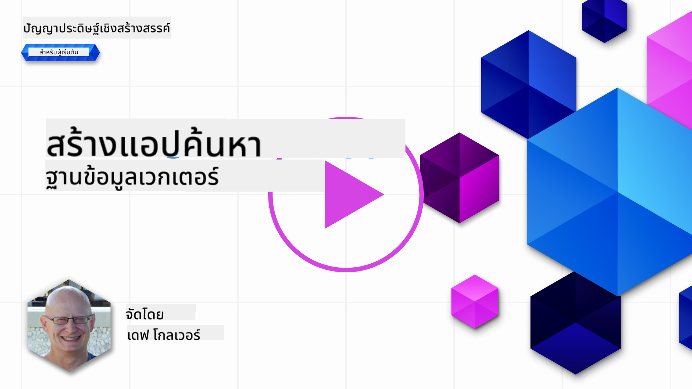
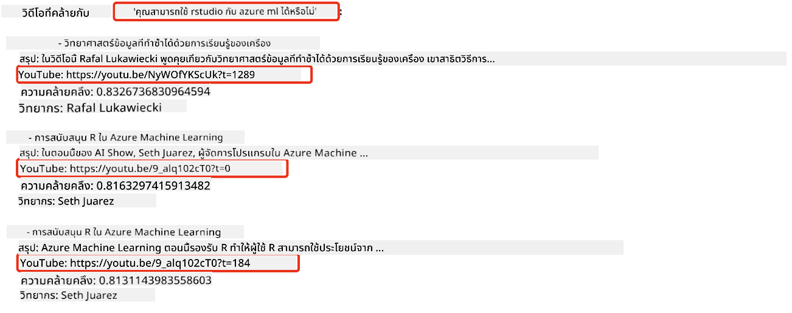
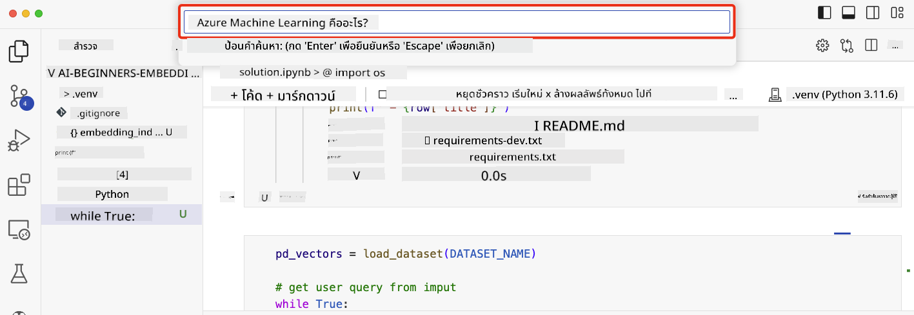

<!--
CO_OP_TRANSLATOR_METADATA:
{
  "original_hash": "d46aad0917a1a342d613e2c13d457da5",
  "translation_date": "2025-07-09T12:55:44+00:00",
  "source_file": "08-building-search-applications/README.md",
  "language_code": "th"
}
-->
# การสร้างแอปพลิเคชันค้นหา

[](https://aka.ms/gen-ai-lesson8-gh?WT.mc_id=academic-105485-koreyst)

> > _คลิกที่ภาพด้านบนเพื่อดูวิดีโอของบทเรียนนี้_

LLM ไม่ได้มีแค่แชทบอทและการสร้างข้อความเท่านั้น เรายังสามารถสร้างแอปพลิเคชันค้นหาโดยใช้ Embeddings ได้ Embeddings คือการแทนข้อมูลในรูปแบบตัวเลขที่เรียกอีกอย่างว่าเวกเตอร์ และสามารถใช้สำหรับการค้นหาเชิงความหมายของข้อมูลได้

ในบทเรียนนี้ คุณจะได้สร้างแอปพลิเคชันค้นหาสำหรับสตาร์ทอัพด้านการศึกษา สตาร์ทอัพของเราเป็นองค์กรไม่แสวงหากำไรที่ให้การศึกษาฟรีแก่ผู้เรียนในประเทศกำลังพัฒนา สตาร์ทอัพของเรามีวิดีโอ YouTube จำนวนมากที่นักเรียนสามารถใช้เรียนรู้เกี่ยวกับ AI ได้ สตาร์ทอัพของเราต้องการสร้างแอปพลิเคชันค้นหาที่ให้นักเรียนสามารถค้นหาวิดีโอ YouTube โดยพิมพ์คำถามเข้าไป

ตัวอย่างเช่น นักเรียนอาจพิมพ์ว่า 'Jupyter Notebooks คืออะไร?' หรือ 'Azure ML คืออะไร' และแอปพลิเคชันค้นหาจะส่งคืนรายการวิดีโอ YouTube ที่เกี่ยวข้องกับคำถาม และที่ดียิ่งกว่านั้น แอปพลิเคชันค้นหาจะส่งลิงก์ไปยังตำแหน่งในวิดีโอที่มีคำตอบของคำถามนั้น

## บทนำ

ในบทเรียนนี้ เราจะครอบคลุมเรื่อง:

- การค้นหาเชิงความหมายกับการค้นหาด้วยคำสำคัญ
- Text Embeddings คืออะไร
- การสร้างดัชนี Text Embeddings
- การค้นหาในดัชนี Text Embeddings

## เป้าหมายการเรียนรู้

หลังจากจบบทเรียนนี้ คุณจะสามารถ:

- บอกความแตกต่างระหว่างการค้นหาเชิงความหมายและการค้นหาด้วยคำสำคัญได้
- อธิบายว่า Text Embeddings คืออะไร
- สร้างแอปพลิเคชันโดยใช้ Embeddings เพื่อค้นหาข้อมูลได้

## ทำไมต้องสร้างแอปพลิเคชันค้นหา?

การสร้างแอปพลิเคชันค้นหาจะช่วยให้คุณเข้าใจวิธีใช้ Embeddings ในการค้นหาข้อมูล นอกจากนี้คุณยังจะได้เรียนรู้วิธีสร้างแอปพลิเคชันค้นหาที่นักเรียนสามารถใช้ค้นหาข้อมูลได้อย่างรวดเร็ว

บทเรียนนี้มีดัชนี Embedding ของคำบรรยายวิดีโอ YouTube สำหรับช่อง Microsoft [AI Show](https://www.youtube.com/playlist?list=PLlrxD0HtieHi0mwteKBOfEeOYf0LJU4O1) AI Show เป็นช่อง YouTube ที่สอนเกี่ยวกับ AI และการเรียนรู้ของเครื่อง ดัชนี Embedding นี้ประกอบด้วย Embeddings สำหรับคำบรรยายวิดีโอ YouTube ทุกตอนจนถึงเดือนตุลาคม 2023 คุณจะใช้ดัชนี Embedding นี้เพื่อสร้างแอปพลิเคชันค้นหาสำหรับสตาร์ทอัพของเรา แอปพลิเคชันค้นหาจะส่งลิงก์ไปยังตำแหน่งในวิดีโอที่มีคำตอบของคำถาม ซึ่งเป็นวิธีที่ดีมากสำหรับนักเรียนในการค้นหาข้อมูลที่ต้องการได้อย่างรวดเร็ว

ตัวอย่างต่อไปนี้เป็นการค้นหาเชิงความหมายสำหรับคำถาม 'can you use rstudio with azure ml?' ลองดู URL ของ YouTube คุณจะเห็นว่า URL มีการระบุเวลาที่พาไปยังตำแหน่งในวิดีโอที่มีคำตอบของคำถามนั้น



## การค้นหาเชิงความหมายคืออะไร?

ตอนนี้คุณอาจสงสัยว่าการค้นหาเชิงความหมายคืออะไร? การค้นหาเชิงความหมายเป็นเทคนิคการค้นหาที่ใช้ความหมายของคำในคำค้นหาเพื่อส่งคืนผลลัพธ์ที่เกี่ยวข้อง

นี่คือตัวอย่างของการค้นหาเชิงความหมาย สมมติว่าคุณกำลังมองหารถยนต์ คุณอาจค้นหาว่า 'my dream car' การค้นหาเชิงความหมายจะเข้าใจว่าคุณไม่ได้ `ฝัน` ถึงรถยนต์ แต่คุณกำลังมองหารถยนต์ `ในฝัน` หรือรถยนต์ที่คุณต้องการจริงๆ การค้นหาเชิงความหมายเข้าใจเจตนาของคุณและส่งคืนผลลัพธ์ที่เกี่ยวข้อง ทางเลือกอื่นคือ `การค้นหาด้วยคำสำคัญ` ซึ่งจะค้นหาคำว่า "ฝัน" และ "รถยนต์" ตามตัวอักษรและมักจะส่งคืนผลลัพธ์ที่ไม่เกี่ยวข้อง

## Text Embeddings คืออะไร?

[Text embeddings](https://en.wikipedia.org/wiki/Word_embedding?WT.mc_id=academic-105485-koreyst) คือเทคนิคการแทนข้อความที่ใช้ใน [การประมวลผลภาษาธรรมชาติ](https://en.wikipedia.org/wiki/Natural_language_processing?WT.mc_id=academic-105485-koreyst) Text embeddings คือการแทนข้อความในรูปแบบตัวเลขเชิงความหมาย Embeddings ใช้แทนข้อมูลในรูปแบบที่เครื่องสามารถเข้าใจได้ง่าย มีโมเดลหลายแบบสำหรับสร้าง text embeddings ในบทเรียนนี้ เราจะเน้นการสร้าง embeddings โดยใช้ OpenAI Embedding Model

นี่คือตัวอย่าง สมมติว่าข้อความต่อไปนี้มาจากคำบรรยายในหนึ่งในตอนของช่อง AI Show บน YouTube:

```text
Today we are going to learn about Azure Machine Learning.
```

เราจะส่งข้อความนี้ไปยัง OpenAI Embedding API และจะได้รับ embedding ที่ประกอบด้วยตัวเลข 1536 ตัว หรือที่เรียกว่าเวกเตอร์ ตัวเลขแต่ละตัวในเวกเตอร์แทนแง่มุมต่างๆ ของข้อความ เพื่อความกระชับ นี่คือตัวเลข 10 ตัวแรกในเวกเตอร์

```python
[-0.006655829958617687, 0.0026128944009542465, 0.008792596869170666, -0.02446001023054123, -0.008540431968867779, 0.022071078419685364, -0.010703742504119873, 0.003311325330287218, -0.011632772162556648, -0.02187200076878071, ...]
```

## ดัชนี Embedding ถูกสร้างขึ้นอย่างไร?

ดัชนี Embedding สำหรับบทเรียนนี้ถูกสร้างขึ้นด้วยชุดสคริปต์ Python คุณจะพบสคริปต์พร้อมคำแนะนำใน [README](./scripts/README.md?WT.mc_id=academic-105485-koreyst) ในโฟลเดอร์ 'scripts' สำหรับบทเรียนนี้ คุณไม่จำเป็นต้องรันสคริปต์เหล่านี้เพื่อทำบทเรียนให้เสร็จ เพราะดัชนี Embedding ได้ถูกจัดเตรียมไว้ให้แล้ว

สคริปต์ทำงานดังนี้:

1. ดาวน์โหลดคำบรรยายของวิดีโอ YouTube แต่ละรายการในเพลย์ลิสต์ [AI Show](https://www.youtube.com/playlist?list=PLlrxD0HtieHi0mwteKBOfEeOYf0LJU4O1)
2. ใช้ [OpenAI Functions](https://learn.microsoft.com/azure/ai-services/openai/how-to/function-calling?WT.mc_id=academic-105485-koreyst) เพื่อพยายามดึงชื่อผู้พูดจาก 3 นาทีแรกของคำบรรยายวิดีโอ ชื่อผู้พูดของแต่ละวิดีโอจะถูกเก็บไว้ในดัชนี Embedding ชื่อ `embedding_index_3m.json`
3. แบ่งข้อความคำบรรยายออกเป็น **ช่วงข้อความละ 3 นาที** โดยแต่ละช่วงจะมีคำประมาณ 20 คำซ้อนทับกับช่วงถัดไป เพื่อให้ Embedding ของช่วงนั้นไม่ถูกตัดและเพื่อให้บริบทการค้นหาดีขึ้น
4. ส่งข้อความแต่ละช่วงไปยัง OpenAI Chat API เพื่อสรุปข้อความให้เหลือ 60 คำ สรุปนี้จะถูกเก็บไว้ในดัชนี Embedding `embedding_index_3m.json`
5. สุดท้าย ส่งข้อความช่วงนั้นไปยัง OpenAI Embedding API ซึ่งจะส่งคืนเวกเตอร์ที่มีตัวเลข 1536 ตัวแทนความหมายเชิงความหมายของช่วงข้อความ ช่วงข้อความพร้อมเวกเตอร์ Embedding จะถูกเก็บไว้ในดัชนี Embedding `embedding_index_3m.json`

### ฐานข้อมูลเวกเตอร์

เพื่อความง่ายของบทเรียน ดัชนี Embedding จะถูกเก็บในไฟล์ JSON ชื่อ `embedding_index_3m.json` และโหลดเข้า Pandas DataFrame อย่างไรก็ตาม ในการใช้งานจริง ดัชนี Embedding จะถูกเก็บในฐานข้อมูลเวกเตอร์ เช่น [Azure Cognitive Search](https://learn.microsoft.com/training/modules/improve-search-results-vector-search?WT.mc_id=academic-105485-koreyst), [Redis](https://cookbook.openai.com/examples/vector_databases/redis/readme?WT.mc_id=academic-105485-koreyst), [Pinecone](https://cookbook.openai.com/examples/vector_databases/pinecone/readme?WT.mc_id=academic-105485-koreyst), [Weaviate](https://cookbook.openai.com/examples/vector_databases/weaviate/readme?WT.mc_id=academic-105485-koreyst) เป็นต้น

## ความเข้าใจเกี่ยวกับ cosine similarity

เราได้เรียนรู้เกี่ยวกับ text embeddings ขั้นตอนต่อไปคือการเรียนรู้วิธีใช้ text embeddings เพื่อค้นหาข้อมูล โดยเฉพาะการหาค่า embeddings ที่เหมือนกับคำค้นหามากที่สุดโดยใช้ cosine similarity

### cosine similarity คืออะไร?

cosine similarity คือการวัดความคล้ายคลึงกันระหว่างเวกเตอร์สองตัว คุณอาจได้ยินเรียกอีกอย่างว่า `nearest neighbor search` ในการค้นหาโดยใช้ cosine similarity คุณต้อง _แปลงข้อความคำค้นหาเป็นเวกเตอร์_ โดยใช้ OpenAI Embedding API จากนั้นคำนวณ _cosine similarity_ ระหว่างเวกเตอร์คำค้นหากับเวกเตอร์แต่ละตัวในดัชนี Embedding จำไว้ว่าดัชนี Embedding มีเวกเตอร์สำหรับแต่ละช่วงข้อความคำบรรยายวิดีโอ YouTube สุดท้ายจัดเรียงผลลัพธ์ตามค่า cosine similarity โดยช่วงข้อความที่มีค่า cosine similarity สูงสุดจะเป็นช่วงที่เหมือนกับคำค้นหามากที่สุด

ในเชิงคณิตศาสตร์ cosine similarity วัดค่าคอสายน์ของมุมระหว่างเวกเตอร์สองตัวที่ฉายในพื้นที่หลายมิติ การวัดนี้มีประโยชน์เพราะถึงแม้เอกสารสองฉบับจะอยู่ห่างกันตามระยะทาง Euclidean เพราะขนาดต่างกัน แต่ก็อาจมีมุมระหว่างกันเล็กและมีค่า cosine similarity สูงกว่า สำหรับข้อมูลเพิ่มเติมเกี่ยวกับสมการ cosine similarity ดูที่ [Cosine similarity](https://en.wikipedia.org/wiki/Cosine_similarity?WT.mc_id=academic-105485-koreyst)

## การสร้างแอปพลิเคชันค้นหาแรกของคุณ

ต่อไป เราจะเรียนรู้วิธีสร้างแอปพลิเคชันค้นหาโดยใช้ Embeddings แอปพลิเคชันค้นหาจะให้นักเรียนค้นหาวิดีโอโดยพิมพ์คำถาม แอปพลิเคชันจะส่งคืนรายการวิดีโอที่เกี่ยวข้องกับคำถาม และยังส่งลิงก์ไปยังตำแหน่งในวิดีโอที่มีคำตอบของคำถามนั้น

โซลูชันนี้ถูกสร้างและทดสอบบน Windows 11, macOS และ Ubuntu 22.04 โดยใช้ Python 3.10 ขึ้นไป คุณสามารถดาวน์โหลด Python ได้จาก [python.org](https://www.python.org/downloads/?WT.mc_id=academic-105485-koreyst)

## การบ้าน - สร้างแอปพลิเคชันค้นหาเพื่อให้นักเรียนใช้งาน

เราได้แนะนำสตาร์ทอัพของเราตั้งแต่ต้นบทเรียน ตอนนี้ถึงเวลาที่จะให้นักเรียนสร้างแอปพลิเคชันค้นหาเพื่อใช้ในการประเมินผล

ในการบ้านนี้ คุณจะสร้าง Azure OpenAI Services ที่จะใช้ในการสร้างแอปพลิเคชันค้นหา คุณจะสร้าง Azure OpenAI Services ดังต่อไปนี้ คุณจะต้องมีบัญชี Azure เพื่อทำการบ้านนี้ให้เสร็จ

### เริ่มต้น Azure Cloud Shell

1. ลงชื่อเข้าใช้ [Azure portal](https://portal.azure.com/?WT.mc_id=academic-105485-koreyst)
2. เลือกไอคอน Cloud Shell ที่มุมขวาบนของ Azure portal
3. เลือก **Bash** สำหรับประเภทสภาพแวดล้อม

#### สร้าง resource group

> สำหรับคำแนะนำนี้ เราใช้ resource group ชื่อ "semantic-video-search" ใน East US  
> คุณสามารถเปลี่ยนชื่อ resource group ได้ แต่ถ้าจะเปลี่ยนตำแหน่งของทรัพยากร  
> ให้ตรวจสอบ [ตารางความพร้อมของโมเดล](https://aka.ms/oai/models?WT.mc_id=academic-105485-koreyst)

```shell
az group create --name semantic-video-search --location eastus
```

#### สร้าง Azure OpenAI Service resource

จาก Azure Cloud Shell ให้รันคำสั่งต่อไปนี้เพื่อสร้าง Azure OpenAI Service resource

```shell
az cognitiveservices account create --name semantic-video-openai --resource-group semantic-video-search \
    --location eastus --kind OpenAI --sku s0
```

#### ดึง endpoint และ keys สำหรับใช้งานในแอปพลิเคชันนี้

จาก Azure Cloud Shell ให้รันคำสั่งต่อไปนี้เพื่อดึง endpoint และ keys สำหรับ Azure OpenAI Service resource

```shell
az cognitiveservices account show --name semantic-video-openai \
   --resource-group  semantic-video-search | jq -r .properties.endpoint
az cognitiveservices account keys list --name semantic-video-openai \
   --resource-group semantic-video-search | jq -r .key1
```

#### ติดตั้งโมเดล OpenAI Embedding

จาก Azure Cloud Shell ให้รันคำสั่งต่อไปนี้เพื่อติดตั้งโมเดล OpenAI Embedding

```shell
az cognitiveservices account deployment create \
    --name semantic-video-openai \
    --resource-group  semantic-video-search \
    --deployment-name text-embedding-ada-002 \
    --model-name text-embedding-ada-002 \
    --model-version "2"  \
    --model-format OpenAI \
    --sku-capacity 100 --sku-name "Standard"
```

## โซลูชัน

เปิด [solution notebook](python/aoai-solution.ipynb) ใน GitHub Codespaces และทำตามคำแนะนำใน Jupyter Notebook

เมื่อคุณรันโน้ตบุ๊ก คุณจะถูกขอให้ป้อนคำค้นหา กล่องป้อนข้อมูลจะมีลักษณะดังนี้:



## ทำได้ดีมาก! เรียนรู้ต่อไป

หลังจากจบบทเรียนนี้แล้ว ลองดู [คอลเลกชันการเรียนรู้ Generative AI](https://aka.ms/genai-collection?WT.mc_id=academic-105485-koreyst) ของเราเพื่อพัฒนาความรู้ด้าน Generative AI ให้มากขึ้น!

ไปที่บทเรียนที่ 9 ซึ่งเราจะเรียนรู้วิธี [สร้างแอปพลิเคชันสร้างภาพ](../09-building-image-applications/README.md?WT.mc_id=academic-105485-koreyst)!

**ข้อจำกัดความรับผิดชอบ**:  
เอกสารนี้ได้รับการแปลโดยใช้บริการแปลภาษาอัตโนมัติ [Co-op Translator](https://github.com/Azure/co-op-translator) แม้เราจะพยายามให้ความถูกต้องสูงสุด แต่โปรดทราบว่าการแปลอัตโนมัติอาจมีข้อผิดพลาดหรือความไม่ถูกต้อง เอกสารต้นฉบับในภาษาต้นทางถือเป็นแหล่งข้อมูลที่เชื่อถือได้ สำหรับข้อมูลที่สำคัญ ขอแนะนำให้ใช้บริการแปลโดยผู้เชี่ยวชาญมนุษย์ เราไม่รับผิดชอบต่อความเข้าใจผิดหรือการตีความผิดใด ๆ ที่เกิดจากการใช้การแปลนี้