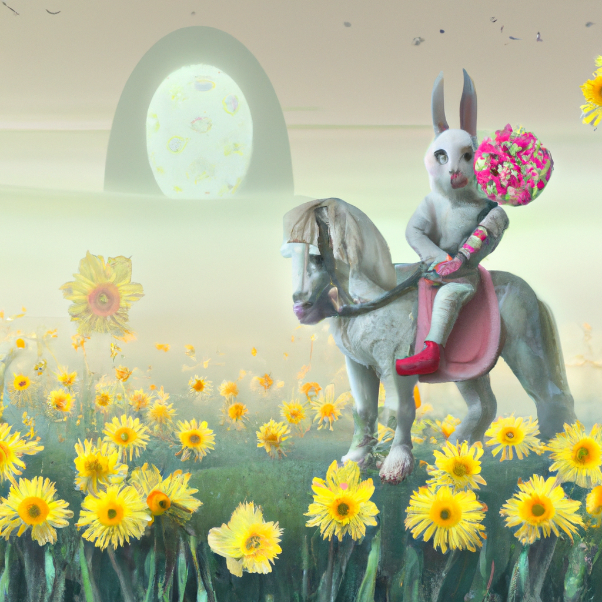

<!--
CO_OP_TRANSLATOR_METADATA:
{
  "original_hash": "ef74ad58fc01f7ad80788f79505f9816",
  "translation_date": "2025-08-26T17:13:37+00:00",
  "source_file": "09-building-image-applications/README.md",
  "language_code": "th"
}
-->
# การสร้างแอปพลิเคชันสร้างภาพ

[](https://aka.ms/gen-ai-lesson9-gh?WT.mc_id=academic-105485-koreyst)

LLM ไม่ได้มีดีแค่การสร้างข้อความเท่านั้น แต่ยังสามารถสร้างภาพจากคำบรรยายได้ด้วย การมีภาพเป็นอีกหนึ่งรูปแบบข้อมูลช่วยให้ใช้งานได้หลากหลาย ไม่ว่าจะเป็นด้านเทคโนโลยีการแพทย์ สถาปัตยกรรม การท่องเที่ยว การพัฒนาเกม และอื่น ๆ อีกมากมาย ในบทนี้ เราจะมาดูโมเดลสร้างภาพยอดนิยมสองตัว ได้แก่ DALL-E และ Midjourney

## บทนำ

ในบทเรียนนี้ คุณจะได้เรียนรู้เกี่ยวกับ:

- การสร้างภาพและประโยชน์ของมัน
- DALL-E และ Midjourney คืออะไร และทำงานอย่างไร
- วิธีสร้างแอปพลิเคชันสร้างภาพ

## เป้าหมายการเรียนรู้

หลังจากจบบทเรียนนี้ คุณจะสามารถ:

- สร้างแอปพลิเคชันสร้างภาพได้
- กำหนดขอบเขตของแอปพลิเคชันด้วย meta prompt
- ใช้งาน DALL-E และ Midjourney ได้

## ทำไมต้องสร้างแอปพลิเคชันสร้างภาพ?

แอปพลิเคชันสร้างภาพเป็นวิธีที่ดีในการสำรวจศักยภาพของ Generative AI สามารถนำไปใช้ได้หลากหลาย เช่น

- **การแก้ไขและสังเคราะห์ภาพ** คุณสามารถสร้างภาพสำหรับการใช้งานต่าง ๆ เช่น การแก้ไขภาพ หรือการสังเคราะห์ภาพใหม่

- **ประยุกต์ใช้ในหลายอุตสาหกรรม** สามารถนำไปสร้างภาพสำหรับอุตสาหกรรมต่าง ๆ เช่น เทคโนโลยีการแพทย์ การท่องเที่ยว การพัฒนาเกม และอื่น ๆ

## ตัวอย่างสถานการณ์: Edu4All

ในบทเรียนนี้ เราจะทำงานร่วมกับสตาร์ทอัพของเรา Edu4All ต่อไป นักเรียนจะได้สร้างภาพสำหรับงานประเมินของตนเอง โดยจะสร้างภาพอะไรก็ขึ้นอยู่กับนักเรียนเอง เช่น ภาพประกอบนิทานที่แต่งเอง สร้างตัวละครใหม่สำหรับเรื่องราว หรือช่วยให้เห็นภาพแนวคิดของตนเองได้ชัดเจนขึ้น

ตัวอย่างเช่น ถ้านักเรียนกำลังเรียนเรื่องอนุสรณ์สถานในห้องเรียน ก็อาจสร้างภาพแบบนี้ได้:


โดยใช้ prompt ประมาณนี้

> "สุนัขอยู่ข้างหอไอเฟลในแสงแดดยามเช้า"

## DALL-E และ Midjourney คืออะไร?

[DALL-E](https://openai.com/dall-e-2?WT.mc_id=academic-105485-koreyst) และ [Midjourney](https://www.midjourney.com/?WT.mc_id=academic-105485-koreyst) เป็นโมเดลสร้างภาพยอดนิยมสองตัว ที่ให้คุณใช้ prompt เพื่อสร้างภาพได้

### DALL-E

มาเริ่มที่ DALL-E ซึ่งเป็นโมเดล Generative AI ที่สร้างภาพจากคำบรรยายข้อความ

> [DALL-E เป็นการผสมผสานระหว่างสองโมเดล คือ CLIP และ diffused attention](https://towardsdatascience.com/openais-dall-e-and-clip-101-a-brief-introduction-3a4367280d4e?WT.mc_id=academic-105485-koreyst)

- **CLIP** เป็นโมเดลที่สร้าง embedding หรือการแทนข้อมูลเป็นตัวเลข จากทั้งภาพและข้อความ

- **Diffused attention** เป็นโมเดลที่สร้างภาพจาก embedding DALL-E ได้รับการฝึกด้วยชุดข้อมูลภาพและข้อความ จึงสามารถสร้างภาพจากคำบรรยายได้ เช่น สร้างภาพแมวใส่หมวก หรือสุนัขทรงผมโมฮอว์ก

### Midjourney

Midjourney ทำงานคล้ายกับ DALL-E คือสร้างภาพจากข้อความ prompt เช่นกัน Midjourney ก็สามารถสร้างภาพจาก prompt อย่าง “แมวใส่หมวก” หรือ “สุนัขทรงผมโมฮอว์ก” ได้เช่นกัน


_เครดิตภาพ Wikipedia, ภาพสร้างโดย Midjourney_

## DALL-E และ Midjourney ทำงานอย่างไร

เริ่มจาก [DALL-E](https://arxiv.org/pdf/2102.12092.pdf?WT.mc_id=academic-105485-koreyst) DALL-E เป็นโมเดล Generative AI ที่ใช้สถาปัตยกรรม transformer แบบ _autoregressive transformer_

_autoregressive transformer_ คือวิธีที่โมเดลสร้างภาพจากคำบรรยาย โดยจะสร้างทีละพิกเซล แล้วใช้พิกเซลที่สร้างขึ้นมาเพื่อสร้างพิกเซลถัดไป ผ่านหลายชั้นของ neural network จนได้ภาพสมบูรณ์

ด้วยกระบวนการนี้ DALL-E สามารถควบคุมคุณลักษณะ วัตถุ ลักษณะต่าง ๆ ในภาพที่สร้างขึ้นได้ แต่ DALL-E 2 และ 3 จะควบคุมรายละเอียดได้มากขึ้น

## สร้างแอปพลิเคชันสร้างภาพแรกของคุณ

แล้วต้องใช้อะไรบ้างในการสร้างแอปพลิเคชันสร้างภาพ? คุณจะต้องใช้ไลบรารีเหล่านี้:

- **python-dotenv** แนะนำให้ใช้ไลบรารีนี้เพื่อเก็บข้อมูลลับไว้ในไฟล์ _.env_ แยกจากโค้ด
- **openai** ไลบรารีนี้ใช้สำหรับเชื่อมต่อกับ OpenAI API
- **pillow** สำหรับจัดการภาพใน Python
- **requests** สำหรับช่วยส่ง HTTP request

## สร้างและดีพลอยโมเดล Azure OpenAI

หากยังไม่ได้ทำ ให้ทำตามคำแนะนำในหน้า [Microsoft Learn](https://learn.microsoft.com/azure/ai-foundry/openai/how-to/create-resource?pivots=web-portal)
เพื่อสร้าง resource และโมเดล Azure OpenAI โดยเลือก DALL-E 3 เป็นโมเดล

## สร้างแอป

1. สร้างไฟล์ _.env_ ด้วยเนื้อหาดังนี้:

   ```text
   AZURE_OPENAI_ENDPOINT=<your endpoint>
   AZURE_OPENAI_API_KEY=<your key>
   AZURE_OPENAI_DEPLOYMENT="dall-e-3"
   ```

   ข้อมูลนี้หาได้จาก Azure OpenAI Foundry Portal ของ resource คุณ ในส่วน "Deployments"

1. รวมไลบรารีข้างต้นไว้ในไฟล์ _requirements.txt_ ดังนี้:

   ```text
   python-dotenv
   openai
   pillow
   requests
   ```

1. จากนั้น สร้าง virtual environment และติดตั้งไลบรารี:

   ```bash
   python3 -m venv venv
   source venv/bin/activate
   pip install -r requirements.txt
   ```

   สำหรับ Windows ใช้คำสั่งนี้เพื่อสร้างและเปิดใช้งาน virtual environment:

   ```bash
   python3 -m venv venv
   venv\Scripts\activate.bat
   ```

1. เพิ่มโค้ดต่อไปนี้ในไฟล์ชื่อ _app.py_:

    ```python
    import openai
    import os
    import requests
    from PIL import Image
    import dotenv
    from openai import OpenAI, AzureOpenAI
    
    # import dotenv
    dotenv.load_dotenv()
    
    # configure Azure OpenAI service client 
    client = AzureOpenAI(
      azure_endpoint = os.environ["AZURE_OPENAI_ENDPOINT"],
      api_key=os.environ['AZURE_OPENAI_API_KEY'],
      api_version = "2024-02-01"
      )
    try:
        # Create an image by using the image generation API
        generation_response = client.images.generate(
                                prompt='Bunny on horse, holding a lollipop, on a foggy meadow where it grows daffodils',
                                size='1024x1024', n=1,
                                model=os.environ['AZURE_OPENAI_DEPLOYMENT']
                              )

        # Set the directory for the stored image
        image_dir = os.path.join(os.curdir, 'images')

        # If the directory doesn't exist, create it
        if not os.path.isdir(image_dir):
            os.mkdir(image_dir)

        # Initialize the image path (note the filetype should be png)
        image_path = os.path.join(image_dir, 'generated-image.png')

        # Retrieve the generated image
        image_url = generation_response.data[0].url  # extract image URL from response
        generated_image = requests.get(image_url).content  # download the image
        with open(image_path, "wb") as image_file:
            image_file.write(generated_image)

        # Display the image in the default image viewer
        image = Image.open(image_path)
        image.show()

    # catch exceptions
    except openai.InvalidRequestError as err:
        print(err)
   ```

ขออธิบายโค้ดนี้:

- ขั้นแรก เรานำเข้าไลบรารีที่ต้องใช้ ได้แก่ OpenAI, dotenv, requests และ Pillow

  ```python
  import openai
  import os
  import requests
  from PIL import Image
  import dotenv
  ```

- จากนั้น โหลด environment variable จากไฟล์ _.env_

  ```python
  # import dotenv
  dotenv.load_dotenv()
  ```

- ต่อมา ตั้งค่าการเชื่อมต่อกับ Azure OpenAI service client

  ```python
  # Get endpoint and key from environment variables
  client = AzureOpenAI(
      azure_endpoint = os.environ["AZURE_OPENAI_ENDPOINT"],
      api_key=os.environ['AZURE_OPENAI_API_KEY'],
      api_version = "2024-02-01"
      )
  ```

- ถัดไป สร้างภาพ:

  ```python
  # Create an image by using the image generation API
  generation_response = client.images.generate(
                        prompt='Bunny on horse, holding a lollipop, on a foggy meadow where it grows daffodils',
                        size='1024x1024', n=1,
                        model=os.environ['AZURE_OPENAI_DEPLOYMENT']
                      )
  ```

  โค้ดข้างต้นจะตอบกลับเป็น JSON ที่มี URL ของภาพที่สร้างขึ้น เราสามารถใช้ URL นี้ดาวน์โหลดภาพและบันทึกเป็นไฟล์ได้

- สุดท้าย เปิดภาพและใช้โปรแกรมดูภาพมาตรฐานแสดงผล

  ```python
  image = Image.open(image_path)
  image.show()
  ```

### รายละเอียดเพิ่มเติมเกี่ยวกับการสร้างภาพ

มาดูโค้ดที่ใช้สร้างภาพอย่างละเอียด:

    ```python
      generation_response = client.images.generate(
                                prompt='Bunny on horse, holding a lollipop, on a foggy meadow where it grows daffodils',
                                size='1024x1024', n=1,
                                model=os.environ['AZURE_OPENAI_DEPLOYMENT']
                            )
    ```

- **prompt** คือข้อความที่ใช้สร้างภาพ ตัวอย่างนี้ใช้ prompt ว่า "กระต่ายขี่ม้า ถืออมยิ้ม อยู่ในทุ่งหญ้าหมอกที่มีดอกแดฟโฟดิล"
- **size** คือขนาดของภาพที่สร้างขึ้น ตัวอย่างนี้สร้างภาพขนาด 1024x1024 พิกเซล
- **n** คือจำนวนภาพที่ต้องการสร้าง ตัวอย่างนี้สร้าง 2 ภาพ
- **temperature** เป็นพารามิเตอร์ที่ควบคุมความสุ่มของผลลัพธ์จาก Generative AI ค่า temperature อยู่ระหว่าง 0 ถึง 1 โดย 0 คือผลลัพธ์แน่นอน 1 คือสุ่มเต็มที่ ค่าเริ่มต้นคือ 0.7

ยังมีสิ่งที่ทำกับภาพได้อีกมาก ซึ่งจะพูดถึงในหัวข้อต่อไป

## ความสามารถเพิ่มเติมของการสร้างภาพ

คุณได้เห็นแล้วว่าเราสามารถสร้างภาพด้วยโค้ด Python ไม่กี่บรรทัด แต่ยังมีสิ่งที่ทำกับภาพได้อีก

คุณยังสามารถทำสิ่งเหล่านี้ได้:

- **แก้ไขภาพ** โดยให้ภาพต้นฉบับ มาสก์ และ prompt คุณสามารถเปลี่ยนแปลงบางส่วนของภาพได้ เช่น เพิ่มหมวกให้กระต่าย วิธีทำคือให้ภาพต้นฉบับ มาสก์ (ระบุส่วนที่ต้องการเปลี่ยน) และ prompt อธิบายสิ่งที่ต้องการให้เกิดขึ้น
> หมายเหตุ: DALL-E 3 ยังไม่รองรับฟีเจอร์นี้

ตัวอย่างการใช้ GPT Image:

    ```python
    response = client.images.edit(
        model="gpt-image-1",
        image=open("sunlit_lounge.png", "rb"),
        mask=open("mask.png", "rb"),
        prompt="A sunlit indoor lounge area with a pool containing a flamingo"
    )
    image_url = response.data[0].url
    ```

  ภาพต้นฉบับจะมีแค่เลานจ์กับสระว่ายน้ำ แต่ภาพสุดท้ายจะมีนกฟลามิงโกเพิ่มเข้ามา

<div style="display: flex; justify-content: space-between; align-items: center; margin: 20px 0;">
  
  
  
</div>


- **สร้างภาพแปรผัน** แนวคิดคือใช้ภาพต้นฉบับแล้วขอให้สร้างภาพแปรผันขึ้นมา โดยให้ภาพและ prompt พร้อมโค้ดแบบนี้:

  ```python
  response = openai.Image.create_variation(
    image=open("bunny-lollipop.png", "rb"),
    n=1,
    size="1024x1024"
  )
  image_url = response['data'][0]['url']
  ```

  > หมายเหตุ ฟีเจอร์นี้รองรับเฉพาะ OpenAI

## Temperature

Temperature คือพารามิเตอร์ที่ควบคุมความสุ่มของผลลัพธ์จาก Generative AI ค่า temperature อยู่ระหว่าง 0 ถึง 1 โดย 0 คือผลลัพธ์แน่นอน 1 คือสุ่มเต็มที่ ค่าเริ่มต้นคือ 0.7

มาดูตัวอย่างการทำงานของ temperature โดยรัน prompt นี้สองครั้ง:

> Prompt : "กระต่ายขี่ม้า ถืออมยิ้ม อยู่ในทุ่งหญ้าหมอกที่มีดอกแดฟโฟดิล"


ลองรัน prompt เดิมอีกครั้ง จะเห็นว่าได้ภาพไม่เหมือนเดิม:


จะเห็นว่าภาพคล้ายกันแต่ไม่เหมือนกัน ลองเปลี่ยนค่า temperature เป็น 0.1 ดูว่าเกิดอะไรขึ้น:

```python
 generation_response = client.images.create(
        prompt='Bunny on horse, holding a lollipop, on a foggy meadow where it grows daffodils',    # Enter your prompt text here
        size='1024x1024',
        n=2
    )
```

### การเปลี่ยนค่า temperature

ลองทำให้ผลลัพธ์แน่นอนมากขึ้น จากสองภาพที่สร้างก่อนหน้านี้จะเห็นว่าภาพแรกเป็นกระต่าย ภาพที่สองเป็นม้า ภาพจึงแตกต่างกันมาก

ดังนั้นลองเปลี่ยนโค้ดโดยตั้งค่า temperature เป็น 0 แบบนี้:

```python
generation_response = client.images.create(
        prompt='Bunny on horse, holding a lollipop, on a foggy meadow where it grows daffodils',    # Enter your prompt text here
        size='1024x1024',
        n=2,
        temperature=0
    )
```

เมื่อรันโค้ดนี้ จะได้สองภาพนี้:

- 
- 

จะเห็นได้ชัดว่าภาพทั้งสองคล้ายกันมากขึ้น

## การกำหนดขอบเขตของแอปพลิเคชันด้วย metaprompt

ด้วยเดโมของเรา เราสามารถสร้างภาพให้ลูกค้าได้แล้ว แต่เราต้องกำหนดขอบเขตให้แอปพลิเคชันด้วย

เช่น เราไม่ต้องการสร้างภาพที่ไม่เหมาะสม หรือไม่เหมาะกับเด็ก

เราสามารถทำได้ด้วย _metaprompt_ ซึ่งเป็นข้อความที่ใช้ควบคุมผลลัพธ์ของ Generative AI เช่น ใช้ metaprompt เพื่อให้แน่ใจว่าภาพที่สร้างขึ้นเหมาะสมกับการใช้งาน หรือเหมาะกับเด็ก

### ทำงานอย่างไร?

แล้ว metaprompt ทำงานอย่างไร?

metaprompt คือข้อความที่ใช้ควบคุมผลลัพธ์ของ Generative AI โดยจะวางไว้ก่อน prompt หลัก ใช้ควบคุมผลลัพธ์ของโมเดล และฝังไว้ในแอปพลิเคชันเพื่อควบคุมผลลัพธ์ โดยรวม prompt หลักและ metaprompt ไว้ในข้อความเดียวกัน

ตัวอย่าง metaprompt เช่น

```text
You are an assistant designer that creates images for children.

The image needs to be safe for work and appropriate for children.

The image needs to be in color.

The image needs to be in landscape orientation.

The image needs to be in a 16:9 aspect ratio.

Do not consider any input from the following that is not safe for work or appropriate for children.

(Input)

```

มาดูวิธีใช้ metaprompt ในเดโมของเรา

```python
disallow_list = "swords, violence, blood, gore, nudity, sexual content, adult content, adult themes, adult language, adult humor, adult jokes, adult situations, adult"

meta_prompt =f"""You are an assistant designer that creates images for children.

The image needs to be safe for work and appropriate for children.

The image needs to be in color.

The image needs to be in landscape orientation.

The image needs to be in a 16:9 aspect ratio.

Do not consider any input from the following that is not safe for work or appropriate for children.
{disallow_list}
"""

prompt = f"{meta_prompt}
Create an image of a bunny on a horse, holding a lollipop"

# TODO add request to generate image
```

จาก prompt ข้างต้น จะเห็นว่าภาพที่สร้างขึ้นทั้งหมดจะคำนึงถึง metaprompt ด้วย

## แบบฝึกหัด - ให้นักเรียนได้ลองสร้าง

เราได้แนะนำ Edu4All ไปแล้ว ตอนนี้ถึงเวลาที่จะให้นักเรียนสร้างภาพสำหรับงานประเมินของตนเอง

นักเรียนจะสร้างภาพที่มีอนุสรณ์สถานต่าง ๆ โดยจะเลือกอนุสรณ์สถานใดก็ได้ และขอให้นักเรียนใช้ความคิดสร้างสรรค์ในการนำอนุสรณ์สถานเหล่านั้นไปอยู่ในบริบทใหม่ ๆ

## ตัวอย่างคำตอบ

นี่คือตัวอย่างคำตอบหนึ่ง:

```python
import openai
import os
import requests
from PIL import Image
import dotenv
from openai import AzureOpenAI
# import dotenv
dotenv.load_dotenv()

# Get endpoint and key from environment variables
client = AzureOpenAI(
  azure_endpoint = os.environ["AZURE_OPENAI_ENDPOINT"],
  api_key=os.environ['AZURE_OPENAI_API_KEY'],
  api_version = "2024-02-01"
  )


disallow_list = "swords, violence, blood, gore, nudity, sexual content, adult content, adult themes, adult language, adult humor, adult jokes, adult situations, adult"

meta_prompt = f"""You are an assistant designer that creates images for children.

The image needs to be safe for work and appropriate for children.

The image needs to be in color.

The image needs to be in landscape orientation.

The image needs to be in a 16:9 aspect ratio.

Do not consider any input from the following that is not safe for work or appropriate for children.
{disallow_list}
"""

prompt = f"""{meta_prompt}
Generate monument of the Arc of Triumph in Paris, France, in the evening light with a small child holding a Teddy looks on.
""""

try:
    # Create an image by using the image generation API
    generation_response = client.images.generate(
        prompt=prompt,    # Enter your prompt text here
        size='1024x1024',
        n=1,
    )
    # Set the directory for the stored image
    image_dir = os.path.join(os.curdir, 'images')

    # If the directory doesn't exist, create it
    if not os.path.isdir(image_dir):
        os.mkdir(image_dir)

    # Initialize the image path (note the filetype should be png)
    image_path = os.path.join(image_dir, 'generated-image.png')

    # Retrieve the generated image
    image_url = generation_response.data[0].url  # extract image URL from response
    generated_image = requests.get(image_url).content  # download the image
    with open(image_path, "wb") as image_file:
        image_file.write(generated_image)

    # Display the image in the default image viewer
    image = Image.open(image_path)
    image.show()

# catch exceptions
except openai.BadRequestError as err:
    print(err)
```

## เยี่ยมมาก! ไปต่อกันเลย
หลังจากเรียนจบบทเรียนนี้แล้ว อย่าลืมไปดู [ชุดการเรียนรู้ Generative AI](https://aka.ms/genai-collection?WT.mc_id=academic-105485-koreyst) เพื่อพัฒนาความรู้ด้าน Generative AI ของคุณให้มากขึ้น!

ไปต่อที่บทเรียนที่ 10 ซึ่งเราจะไปดูวิธี [สร้างแอปพลิเคชัน AI ด้วย low-code](../10-building-low-code-ai-applications/README.md?WT.mc_id=academic-105485-koreyst)

---

**ข้อจำกัดความรับผิดชอบ**:  
เอกสารฉบับนี้ได้รับการแปลโดยใช้บริการแปลภาษา AI [Co-op Translator](https://github.com/Azure/co-op-translator) แม้ว่าเราจะพยายามอย่างเต็มที่เพื่อความถูกต้อง แต่โปรดทราบว่าการแปลโดยระบบอัตโนมัติอาจมีข้อผิดพลาดหรือความไม่ถูกต้อง เอกสารต้นฉบับในภาษาต้นทางควรถือเป็นแหล่งข้อมูลที่เชื่อถือได้ สำหรับข้อมูลที่มีความสำคัญ แนะนำให้ใช้บริการแปลโดยนักแปลมืออาชีพ ทางเราจะไม่รับผิดชอบต่อความเข้าใจผิดหรือการตีความที่คลาดเคลื่อนซึ่งเกิดจากการใช้การแปลนี้