# การสร้างแอปพลิเคชัน AI แบบรหัสต่ำ

> _(คลิกที่ภาพด้านบนเพื่อดูวิดีโอของบทเรียนนี้)_

## บทนำ

ตอนนี้ที่เราได้เรียนรู้วิธีสร้างแอปพลิเคชันสร้างภาพแล้ว มาเรามาพูดคุยเกี่ยวกับโค้ดต่ำกัน Generative AI สามารถนำไปใช้ในพื้นที่ต่าง ๆ ได้หลากหลายรวมถึงโค้ดต่ำ แต่โค้ดต่ำคืออะไรและเราจะเพิ่ม AI เข้าไปได้อย่างไร?

การสร้างแอปพลิเคชันและโซลูชันได้ง่ายขึ้นสำหรับนักพัฒนาซอฟต์แวร์แบบดั้งเดิมและผู้ที่ไม่ใช่นักพัฒนา ผ่านการใช้แพลตฟอร์มพัฒนารหัสต่ำ Low Code Development Platforms ช่วยให้คุณสามารถสร้างแอปและโซลูชันโดยใช้โค้ดเพียงเล็กน้อยหรือไม่มีเลย ซึ่งทำได้โดยจัดเตรียมสภาพแวดล้อมการพัฒนาที่เป็นภาพที่ช่วยให้คุณลากและวางส่วนประกอบเพื่อสร้างแอปและโซลูชันได้ ซึ่งช่วยให้คุณสร้างแอปและโซลูชันได้เร็วขึ้นและใช้ทรัพยากรน้อยลง ในบทเรียนนี้ เราจะลงลึกถึงวิธีการใช้โค้ดต่ำและวิธีการเสริมการพัฒนาด้วยโค้ดต่ำด้วย AI โดยใช้ Power Platform

Power Platform มอบโอกาสให้องค์กรเสริมพลังให้ทีมงานของตนสร้างโซลูชันของตนเองผ่านสภาพแวดล้อมแบบโค้ดต่ำหรือไม่มีโค้ดที่ใช้งานง่าย สภาพแวดล้อมนี้ช่วยให้ง่ายขึ้นในการสร้างโซลูชัน ด้วย Power Platform การสร้างโซลูชันสามารถทำได้ภายในไม่กี่วันหรือสัปดาห์ แทนที่จะเป็นเดือนหรือปี Power Platform ประกอบด้วยผลิตภัณฑ์หลักห้าตัว ได้แก่ Power Apps, Power Automate, Power BI, Power Pages และ Copilot Studio

บทเรียนนี้ครอบคลุม:

- แนะนำ Generative AI ใน Power Platform
- แนะนำ Copilot และวิธีการใช้งาน
- การใช้ Generative AI เพื่อสร้างแอปและโฟลว์ใน Power Platform
- ทำความเข้าใจโมเดล AI ใน Power Platform ด้วย AI Builder
- การสร้างเอเจนต์อัจฉริยะด้วย Microsoft Copilot Studio

## เป้าหมายการเรียนรู้

เมื่อจบบทเรียนนี้ คุณจะสามารถ:

- เข้าใจวิธีที่ Copilot ทำงานใน Power Platform

- สร้างแอปติดตามงานนักเรียนสำหรับสตาร์ทอัพด้านการศึกษา

- สร้างโฟลว์ประมวลผลใบแจ้งหนี้ที่ใช้ AI เพื่อดึงข้อมูลจากใบแจ้งหนี้

- นำแนวทางปฏิบัติที่ดีที่สุดมาประยุกต์ใช้เมื่อต้องใช้โมเดล AI สร้างข้อความด้วย GPT

- เข้าใจว่า Microsoft Copilot Studio คืออะไรและวิธีการสร้างเอเจนต์อัจฉริยะด้วยมัน

เครื่องมือและเทคโนโลยีที่คุณจะใช้ในบทเรียนนี้คือ:

- **Power Apps** สำหรับแอปติดตามงานนักเรียน ซึ่งเป็นสภาพแวดล้อมการพัฒนารหัสต่ำสำหรับสร้างแอปเพื่อการติดตาม จัดการ และโต้ตอบกับข้อมูล

- **Dataverse** สำหรับเก็บข้อมูลแอปติดตามงานนักเรียน โดย Dataverse จะเป็นแพลตฟอร์มข้อมูลแบบโค้ดต่ำสำหรับเก็บข้อมูลของแอป

- **Power Automate** สำหรับโฟลว์ประมวลผลใบแจ้งหนี้ โดยคุณจะมีสภาพแวดล้อมการพัฒนารหัสต่ำสำหรับสร้างเวิร์กโฟลว์เพื่ออัตโนมัติกระบวนการใบแจ้งหนี้

- **AI Builder** สำหรับโมเดล AI ประมวลผลใบแจ้งหนี้ โดยคุณจะใช้โมเดล AI ที่สร้างไว้ล่วงหน้าเพื่อประมวลผลใบแจ้งหนี้สำหรับสตาร์ทอัพของเรา

## Generative AI ใน Power Platform

การเสริมการพัฒนาและแอปพลิเคชันแบบโค้ดต่ำด้วย Generative AI เป็นจุดสนใจหลักของ Power Platform เป้าหมายคือการเปิดโอกาสให้ทุกคนสร้างแอป เว็บไซต์ แดชบอร์ดที่ผสาน AI และอัตโนมัติกระบวนการด้วย AI _โดยไม่ต้องมีความเชี่ยวชาญด้านวิทยาศาสตร์ข้อมูลใดๆ_ เป้าหมายนี้ทำได้โดยการผสาน Generative AI เข้ากับประสบการณ์การพัฒนารหัสต่ำใน Power Platform ในรูปแบบของ Copilot และ AI Builder

### มันทำงานอย่างไร?

Copilot คือผู้ช่วย AI ที่ช่วยให้คุณสร้างโซลูชัน Power Platform ได้โดยการบรรยายความต้องการของคุณด้วยขั้นตอนการสนทนาโดยใช้ภาษาธรรมชาติ คุณสามารถสั่งผู้ช่วย AI ให้ระบุฟิลด์ที่แอปของคุณจะใช้ และมันจะสร้างทั้งแอปและโมเดลข้อมูลพื้นฐาน หรือคุณอาจระบุวิธีตั้งค่าโฟลว์ใน Power Automate

คุณสามารถใช้ฟังก์ชัน Copilot เป็นคุณลักษณะในหน้าจอแอปของคุณเพื่อให้ผู้ใช้ค้นพบข้อมูลเชิงลึกผ่านการโต้ตอบแบบสนทนา

AI Builder คือฟีเจอร์ AI แบบโค้ดต่ำใน Power Platform ที่ช่วยให้คุณใช้โมเดล AI เพื่อช่วยคุณอัตโนมัติกระบวนการและทำนายผลลัพธ์ ด้วย AI Builder คุณสามารถนำ AI มาใช้ในแอปและโฟลว์ของคุณที่เชื่อมต่อกับข้อมูลใน Dataverse หรือแหล่งข้อมูลคลาวด์ต่าง ๆ เช่น SharePoint, OneDrive หรือ Azure

Copilot มีให้ในผลิตภัณฑ์ Power Platform ทุกตัว ได้แก่ Power Apps, Power Automate, Power BI, Power Pages และ Copilot Studio (ก่อนหน้านี้คือ Power Virtual Agents) ส่วน AI Builder มีให้ใช้ใน Power Apps และ Power Automate ในบทเรียนนี้ เราจะเน้นวิธีใช้ Copilot และ AI Builder ใน Power Apps และ Power Automate เพื่อสร้างโซลูชันสำหรับสตาร์ทอัพด้านการศึกษาของเรา

### Copilot ใน Power Apps

ในฐานะส่วนหนึ่งของ Power Platform, Power Apps ให้สภาพแวดล้อมการพัฒนารหัสต่ำสำหรับสร้างแอปเพื่อการติดตาม จัดการ และโต้ตอบกับข้อมูล เป็นชุดบริการการพัฒนาแอปพร้อมแพลตฟอร์มข้อมูลที่สามารถขยายได้และความสามารถในการเชื่อมต่อกับบริการคลาวด์และข้อมูลในองค์กร Power Apps ช่วยให้คุณสร้างแอปที่ทำงานบนเบราว์เซอร์ แท็บเล็ต และโทรศัพท์ และสามารถแชร์กับเพื่อนร่วมงานได้ Power Apps ช่วยให้ผู้ใช้เข้าสู่การพัฒนาแอปด้วยอินเทอร์เฟซที่เรียบง่าย เพื่อให้ผู้ใช้ธุรกิจทุกคนหรือนักพัฒนามืออาชีพสามารถสร้างแอปที่กำหนดเองได้ ประสบการณ์การพัฒนาแอปยังได้รับการปรับปรุงด้วย Generative AI ผ่าน Copilot

ฟีเจอร์ผู้ช่วย AI Copilot ใน Power Apps ช่วยให้คุณบรรยายลักษณะแอปที่ต้องการและข้อมูลที่ต้องการให้แอปติดตาม รวบรวม หรือแสดง จากนั้น Copilot จะสร้างแอป Canvas ที่ตอบสนองตามคำอธิบายของคุณ คุณสามารถปรับแต่งแอปให้ตรงกับความต้องการได้ AI Copilot ยังสร้างและแนะนำตาราง Dataverse พร้อมฟิลด์ที่คุณต้องการเพื่อเก็บข้อมูลที่ต้องการติดตามและข้อมูลตัวอย่าง เราจะมาดูว่า Dataverse คืออะไรและวิธีใช้งานใน Power Apps ในบทเรียนนี้ในภายหลัง คุณสามารถปรับแต่งตารางให้เหมาะสมกับความต้องการโดยใช้ฟีเจอร์ผู้ช่วย AI Copilot ผ่านขั้นตอนการสนทนา ฟีเจอร์นี้พร้อมใช้งานทันทีจากหน้าจอหลักของ Power Apps

### Copilot ใน Power Automate

ในฐานะส่วนหนึ่งของ Power Platform, Power Automate ช่วยให้ผู้ใช้สร้างเวิร์กโฟลว์อัตโนมัติระหว่างแอปพลิเคชันและบริการ ช่วยอัตโนมัติกระบวนการธุรกิจที่ทำซ้ำ เช่น การสื่อสาร รวบรวมข้อมูล และอนุมัติการตัดสินใจ อินเทอร์เฟซที่เรียบง่ายช่วยให้ผู้ใช้ทุกระดับความสามารถทางเทคนิค (ตั้งแต่ผู้เริ่มต้นจนถึงนักพัฒนามืออาชีพ) สามารถอัตโนมัติงานต่าง ๆ ได้ ประสบการณ์การพัฒนาเวิร์กโฟลว์ยังได้รับการปรับปรุงด้วย Generative AI ผ่าน Copilot

ฟีเจอร์ผู้ช่วย AI Copilot ใน Power Automate ช่วยให้คุณบรรยายลักษณะโฟลว์ที่ต้องการและการกระทำที่คุณต้องการให้โฟลว์ทำ จากนั้น Copilot จะสร้างโฟลว์ตามคำอธิบายของคุณ คุณสามารถปรับแต่งโฟลว์ให้ตรงกับความต้องการได้ AI Copilot ยังสร้างและแนะนำการกระทำที่คุณต้องใช้เพื่อทำงานที่ต้องการให้เป็นอัตโนมัติ เราจะมาดูว่าโฟลว์คืออะไรและวิธีใช้งานใน Power Automate ในบทเรียนนี้ในภายหลัง คุณสามารถปรับแต่งการกระทำให้เหมาะสมกับความต้องการได้โดยใช้ฟีเจอร์ผู้ช่วย AI Copilot ผ่านขั้นตอนการสนทนา ฟีเจอร์นี้พร้อมใช้งานทันทีจากหน้าจอหลักของ Power Automate

## การสร้างเอเจนต์อัจฉริยะด้วย Microsoft Copilot Studio

[Microsoft Copilot Studio](https://learn.microsoft.com/microsoft-copilot-studio/fundamentals-what-is-copilot-studio?WT.mc_id=academic-105485-koreyst) (เดิมชื่อ Power Virtual Agents) คือสมาชิกในฐานะแพลตฟอร์มโค้ดต่ำของ Power Platform สำหรับสร้าง **เอเจนต์ AI** — ผู้ช่วยสนทนาที่สามารถตอบคำถาม ดำเนินการ และอัตโนมัติงานแทนผู้ใช้ของคุณ เช่นเดียวกับ Power Platform อื่น ๆ คุณสร้างเอเจนต์เหล่านี้ด้วยประสบการณ์ใช้งานที่เป็นภาพและเน้นภาษาธรรมชาติ: คุณบอกสิ่งที่คุณต้องการให้เอเจนต์ทำ และ Copilot Studio ช่วยจัดการคำสั่ง ความรู้ และการกระทำของมัน

สำหรับสตาร์ทอัพด้านการศึกษาของเรา คุณสามารถสร้างเอเจนต์ที่ตอบคำถามของนักเรียนเกี่ยวกับหลักสูตร ตรวจสอบกำหนดส่งงาน และแม้แต่ส่งอีเมลถึงผู้สอน — ทั้งหมดนี้โดยไม่ต้องเขียนโค้ด

นี่คือความสามารถล่าสุดบางอย่างที่ทำให้ Copilot Studio มีพลัง:

- **คำตอบสร้างสรรค์จากความรู้ของคุณ** แทนที่จะต้องเขียนทุกการสนทนาเอง คุณสามารถเชื่อมต่อ **แหล่งความรู้** — เว็บไซต์สาธารณะ, SharePoint, OneDrive, Dataverse, ไฟล์ที่อัปโหลด หรือข้อมูลองค์กรผ่านคอนเน็คเตอร์ — และเอเจนต์จะสร้างคำตอบที่มีพื้นฐานจากข้อมูลเหล่านั้น

- **การประสานงานแบบสร้างสรรค์** แทนที่จะพึ่งพาวลีทริกเกอร์ที่ตายตัว เอเจนต์จะใช้ AI ในการเข้าใจคำขอและตัดสินใจแบบไดนามิกว่าความรู้ หัวข้อ และการกระทำใดบ้างควรถูกผสมผสานเพื่อทำให้สำเร็จ รวมถึงการเชื่อมต่อหลายขั้นตอนเข้าด้วยกัน

- **การกระทำและคอนเน็คเตอร์** เอเจนต์สามารถ *ทำ* สิ่งต่าง ๆ ได้ ไม่ใช่แค่แชท คุณสามารถให้เอเจนต์ทำงานด้วยการสนับสนุนจากคอนเน็คเตอร์ Power Platform ที่สร้างไว้ล่วงหน้ากว่า 1,500 ตัว, โฟลว์ Power Automate, REST API ที่กำหนดเอง, โพร้มต์ หรือ **Model Context Protocol (MCP)** เซิร์ฟเวอร์

- **เอเจนต์อิสระ** เอเจนต์ไม่ได้จำกัดแค่การตอบในหน้าต่างสนทนา คุณสามารถสร้าง **เอเจนต์อิสระ** ที่ถูกทริกเกอร์โดยเหตุการณ์ เช่น อีเมลใหม่, ระเบียนใหม่ใน Dataverse หรือไฟล์ที่ถูกอัปโหลด — และจากนั้นทำงานเบื้องหลังเพื่่อทำงานให้สำเร็จ

- **การประสานงานหลายเอเจนต์** เอเจนต์สามารถเรียกเอเจนต์อื่นได้ เอเจนต์ Copilot Studio สามารถโอนงานให้ หรือขยายโดยเอเจนต์อื่น รวมถึงเอเจนต์ที่เผยแพร่สู่ Microsoft 365 Copilot และเอเจนต์ที่สร้างใน Microsoft Foundry

- **การเลือกโมเดล** นอกจากโมเดลที่มีในตัว คุณสามารถนำโมเดลจากแคตาล็อกโมเดล Microsoft Foundry มาปรับแต่งวิธีคิดและตอบสนองของเอเจนต์

- **เผยแพร่ได้ทุกที่** เมื่อสร้างเสร็จแล้ว เอเจนต์สามารถเผยแพร่ผ่านช่องทางต่าง ๆ — Microsoft Teams, Microsoft 365 Copilot, เว็บไซต์ หรือแอปพลิเคชันที่กำหนดเอง และอื่น ๆ — โดยมีการจัดการความปลอดภัย การยืนยันตัวตน และการวิเคราะห์ผ่านประสบการณ์ผู้ดูแลระบบ Power Platform

คุณสามารถเริ่มสร้างเอเจนต์แรกของคุณได้ที่ [copilotstudio.microsoft.com](https://copilotstudio.microsoft.com?WT.mc_id=academic-105485-koreyst) และเรียนรู้เพิ่มเติมใน [เอกสาร Microsoft Copilot Studio](https://learn.microsoft.com/microsoft-copilot-studio/?WT.mc_id=academic-105485-koreyst)

## งานมอบหมาย: จัดการงานนักเรียนและใบแจ้งหนี้สำหรับสตาร์ทอัพของเราโดยใช้ Copilot

สตาร์ทอัพของเราจัดหาหลักสูตรออนไลน์แก่นักเรียน สตาร์ทอัพเติบโตเร็วและกำลังประสบปัญหาไม่สามารถรับมือกับความต้องการของหลักสูตรได้ สตาร์ทอัพจ้างคุณเป็นนักพัฒนา Power Platform เพื่อช่วยสร้างโซลูชันโค้ดต่ำเพื่อช่วยจัดการงานนักเรียนและใบแจ้งหนี้ โซลูชันนี้ควรช่วยติดตามและจัดการงานนักเรียนผ่านแอป และอัตโนมัติกระบวนการประมวลผลใบแจ้งหนี้ผ่านเวิร์กโฟลว์ คุณได้รับมอบหมายให้ใช้ Generative AI เพื่อพัฒนาโซลูชันนี้

เมื่อคุณเริ่มต้นใช้ Copilot คุณสามารถใช้ [ห้องสมุดคำสั่งของ Power Platform Copilot](https://github.com/pnp/powerplatform-prompts?WT.mc_id=academic-109639-somelezediko) เพื่อเริ่มต้นกับคำสั่งต่าง ๆ ห้องสมุดนี้มีรายการคำสั่งที่คุณสามารถใช้เพื่อสร้างแอปและโฟลว์ด้วย Copilot คุณยังสามารถใช้คำสั่งในห้องสมุดเพื่อเป็นแนวทางในการบรรยายความต้องการของคุณกับ Copilot

### สร้างแอปติดตามงานนักเรียนสำหรับสตาร์ทอัพของเรา

ผู้สอนในสตาร์ทอัพของเรากำลังประสบปัญหาในการติดตามงานของนักเรียน พวกเขาเคยใช้สเปรดชีตเพื่อติดตามงานแต่การจัดการกลายเป็นยากขึ้นเมื่อจำนวนนักเรียนเพิ่มมากขึ้น พวกเขาขอมอบหมายให้คุณสร้างแอปที่จะช่วยติดตามและจัดการงานของนักเรียน แอปควรให้ผู้ใช้เพิ่มงานใหม่ ดูงาน อัปเดตงาน และลบงานได้ แอปควรให้ทั้งผู้สอนและนักเรียนดูงานที่ได้รับการให้คะแนนและงานที่ยังไม่ได้รับการให้คะแนนได้

คุณจะสร้างแอปโดยใช้ Copilot ใน Power Apps ตามขั้นตอนด้านล่างนี้:

1. ไปที่หน้าจอหลักของ [Power Apps](https://make.powerapps.com?WT.mc_id=academic-105485-koreyst)

1. ใช้พื้นที่ข้อความบนหน้าจอหลักเพื่อบรรยายแอปที่คุณต้องการสร้าง เช่น **_ฉันต้องการสร้างแอปเพื่อติดตามและจัดการงานนักเรียน_** คลิกที่ปุ่ม **ส่ง** เพื่อส่งคำสั่งให้ AI Copilot

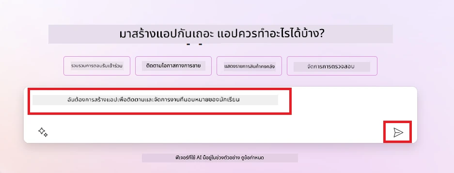

1. AI Copilot จะแนะนำตาราง Dataverse พร้อมฟิลด์ที่คุณต้องการเพื่อเก็บข้อมูลที่ต้องการติดตามและข้อมูลตัวอย่าง จากนั้นคุณสามารถปรับแต่งตารางให้ตรงความต้องการโดยใช้ฟีเจอร์ผู้ช่วย AI Copilot ผ่านขั้นตอนการสนทนา

   > **สำคัญ**: Dataverse คือแพลตฟอร์มข้อมูลพื้นฐานของ Power Platform เป็นแพลตฟอร์มข้อมูลโค้ดต่ำสำหรับเก็บข้อมูลของแอป เป็นบริการที่ได้รับการจัดการอย่างเต็มที่ที่เก็บข้อมูลอย่างปลอดภัยใน Microsoft Cloud และถูกจัดสรรภายในสภาพแวดล้อม Power Platform ของคุณ พร้อมด้วยความสามารถในการกำกับดูแลข้อมูลภายในตัว เช่น การจัดประเภทข้อมูล, เส้นทางข้อมูล, การควบคุมการเข้าถึงอย่างละเอียด และอื่น ๆ คุณสามารถเรียนรู้เพิ่มเติมเกี่ยวกับ Dataverse ได้ที่ [นี่](https://docs.microsoft.com/powerapps/maker/data-platform/data-platform-intro?WT.mc_id=academic-109639-somelezediko)

   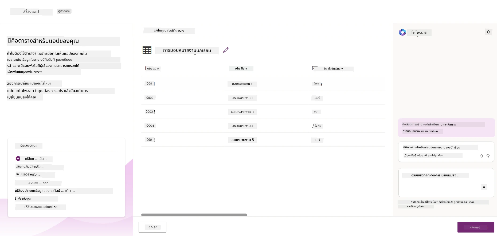

1. ผู้สอนต้องการส่งอีเมลหานักเรียนที่ส่งงานเพื่อแจ้งสถานะความคืบหน้าของงาน คุณสามารถใช้ Copilot เพิ่มฟิลด์ใหม่ในตารางเพื่อเก็บอีเมลดังกล่าวได้ เช่น คุณอาจใช้คำสั่งนี้เพื่อเพิ่มคอลัมน์ใหม่: **_ฉันต้องการเพิ่มคอลัมน์สำหรับเก็บอีเมลนักเรียน_** คลิกที่ปุ่ม **ส่ง** เพื่อส่งคำสั่งให้ AI Copilot

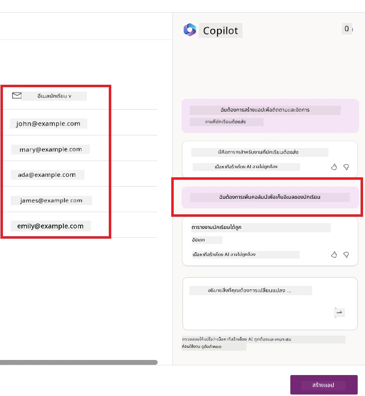

1. AI Copilot จะสร้างฟิลด์ใหม่ จากนั้นคุณสามารถปรับแต่งฟิลด์ให้ตรงตามความต้องการ

1. เมื่อคุณทำตารางเสร็จแล้ว ให้คลิกที่ปุ่ม **Create app** เพื่อสร้างแอป

1. AI Copilot จะสร้างแอป Canvas ที่ตอบสนองตามคำอธิบายของคุณ จากนั้นคุณสามารถปรับแต่งแอปให้ตรงกับความต้องการของคุณได้

1. สำหรับครูผู้สอนในการส่งอีเมลถึงนักเรียน คุณสามารถใช้ Copilot เพื่อเพิ่มหน้าจอใหม่ให้กับแอป เช่น คุณสามารถใช้พรอมต์ต่อไปนี้เพื่อเพิ่มหน้าจอใหม่ในแอป: **_ฉันต้องการเพิ่มหน้าจอเพื่อส่งอีเมลถึงนักเรียน_** คลิกที่ปุ่ม **Send** เพื่อส่งพรอมต์ไปยัง AI Copilot

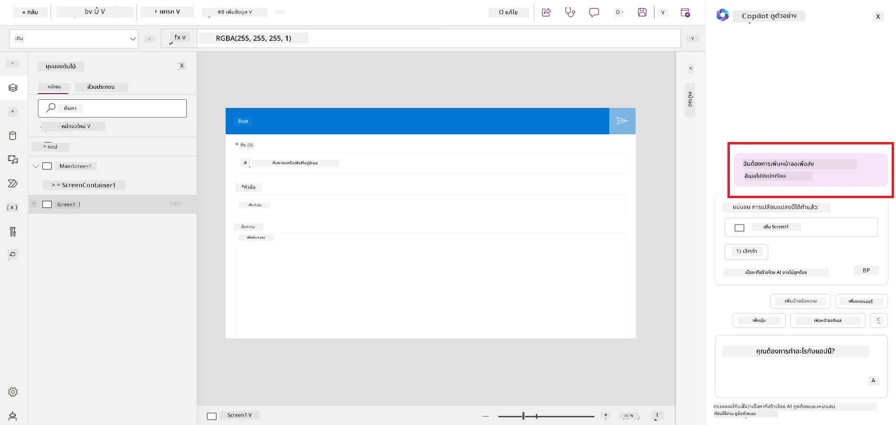

1. AI Copilot จะสร้างหน้าจอใหม่ขึ้นมา จากนั้นคุณสามารถปรับแต่งหน้าจอให้ตรงกับความต้องการของคุณได้

1. เมื่อคุณทำแอปเสร็จแล้ว คลิกที่ปุ่ม **Save** เพื่อบันทึกแอป

1. เพื่อแชร์แอปกับครูผู้สอน ให้คลิกที่ปุ่ม **Share** จากนั้นคลิกที่ปุ่ม **Share** อีกครั้ง คุณสามารถแชร์แอปกับครูผู้สอนได้โดยการป้อนที่อยู่อีเมลของพวกเขา

> **การบ้านของคุณ**: แอปที่คุณสร้างขึ้นมาเป็นจุดเริ่มต้นที่ดีแต่ยังสามารถพัฒนาได้อีก ด้วยฟีเจอร์อีเมล ครูผู้สอนสามารถส่งอีเมลถึงนักเรียนได้เท่านั้นโดยต้องพิมพ์อีเมลด้วยตนเอง คุณจะใช้ Copilot สร้างระบบอัตโนมัติที่จะช่วยให้ครูผู้สอนส่งอีเมลถึงนักเรียนโดยอัตโนมัติเมื่อพวกเขาส่งงานได้หรือไม่? คำใบ้ของคุณคือ ด้วยพรอมต์ที่ถูกต้องคุณสามารถใช้ Copilot ใน Power Automate เพื่อสร้างสิ่งนี้ได้

### สร้างตารางข้อมูลใบแจ้งหนี้สำหรับสตาร์ทอัพของเรา

ทีมการเงินของสตาร์ทอัพของเราประสบปัญหาในการติดตามใบแจ้งหนี้ พวกเขาใช้สเปรดชีตในการติดตามใบแจ้งหนี้แต่ตอนนี้การจัดการยากขึ้นเนื่องจากจำนวนใบแจ้งหนี้เพิ่มมากขึ้น พวกเขาขอให้คุณสร้างตารางที่จะช่วยเก็บข้อมูล ติดตาม และจัดการข้อมูลใบแจ้งหนี้ที่ได้รับ ตารางนี้จะใช้สร้างระบบอัตโนมัติที่ดึงข้อมูลใบแจ้งหนี้ทั้งหมดมาเก็บไว้ในตาราง ตารางนี้ยังช่วยให้ทีมการเงินสามารถดูใบแจ้งหนี้ที่ชำระแล้วและยังไม่ได้ชำระได้

Power Platform มีแพลตฟอร์มข้อมูลพื้นฐานชื่อว่า Dataverse ที่ช่วยให้คุณเก็บข้อมูลสำหรับแอปและโซลูชันของคุณ Dataverse เป็นแพลตฟอร์มข้อมูลแบบ low-code สำหรับเก็บข้อมูลของแอป เป็นบริการที่ได้รับการจัดการอย่างเต็มที่ที่เก็บข้อมูลอย่างปลอดภัยใน Microsoft Cloud และจัดเตรียมไว้ภายในสภาพแวดล้อม Power Platform ของคุณ มาพร้อมกับความสามารถในการจัดการข้อมูลในตัว เช่น การจำแนกข้อมูล การติดตามแหล่งที่มา การควบคุมการเข้าถึงอย่างละเอียด และอื่นๆ คุณสามารถเรียนรู้เพิ่มเติม [เกี่ยวกับ Dataverse ที่นี่](https://docs.microsoft.com/powerapps/maker/data-platform/data-platform-intro?WT.mc_id=academic-109639-somelezediko)

ทำไมเราควรใช้ Dataverse สำหรับสตาร์ทอัพของเรา? ตารางมาตรฐานและตารางที่กำหนดเองใน Dataverse ให้ตัวเลือกการจัดเก็บข้อมูลที่ปลอดภัยและอยู่บนคลาวด์ ตารางช่วยให้คุณเก็บข้อมูลหลากหลายประเภท เหมือนกับการใช้เวิร์กชีตหลายแผ่นในเวิร์กบุ๊ก Excel เดียว คุณสามารถใช้ตารางเพื่อเก็บข้อมูลที่เฉพาะกับองค์กรหรือความต้องการทางธุรกิจของคุณ ข้อดีบางประการที่สตาร์ทอัพของเราจะได้รับจากการใช้ Dataverse มีดังนี้แต่ไม่จำกัดเพียงเท่านี้:

- **ง่ายต่อการจัดการ**: ทั้งข้อมูลเมตาและข้อมูลถูกจัดเก็บบนคลาวด์ ดังนั้นคุณไม่ต้องกังวลเกี่ยวกับรายละเอียดของการจัดเก็บหรือการจัดการ คุณสามารถมุ่งเน้นไปที่การสร้างแอปและโซลูชันของคุณ

- **ปลอดภัย**: Dataverse ให้ตัวเลือกการจัดเก็บข้อมูลบนคลาวด์ที่ปลอดภัย คุณสามารถควบคุมว่าใครสามารถเข้าถึงข้อมูลในตารางของคุณและวิธีที่พวกเขาเข้าถึงโดยใช้การรักษาความปลอดภัยตามบทบาท

- **ข้อมูลเมตาที่สมบูรณ์**: ประเภทข้อมูลและความสัมพันธ์ถูกใช้โดยตรงใน Power Apps

- **ตรรกะและการตรวจสอบ**: คุณสามารถใช้กฎทางธุรกิจ, ฟิลด์ที่คำนวณได้ และกฎการตรวจสอบเพื่อบังคับใช้ตรรกะทางธุรกิจและรักษาความถูกต้องของข้อมูล

เมื่อคุณทราบว่า Dataverse คืออะไรและเหตุใดคุณจึงควรใช้ มาดูกันว่าคุณสามารถใช้ Copilot เพื่อสร้างตารางใน Dataverse เพื่อตอบสนองความต้องการของทีมการเงินของเราได้อย่างไร

> **หมายเหตุ** : คุณจะใช้ตารางนี้ในส่วนถัดไปเพื่อสร้างระบบอัตโนมัติที่ดึงข้อมูลใบแจ้งหนี้ทั้งหมดและเก็บไว้ในตาราง

การสร้างตารางใน Dataverse ด้วย Copilot ให้ทำตามขั้นตอนดังนี้:

1. ไปที่หน้าจอหลักของ [Power Apps](https://make.powerapps.com?WT.mc_id=academic-105485-koreyst)

2. ในแถบนำทางด้านซ้าย ให้เลือก **Tables** แล้วคลิกที่ **Describe the new Table**

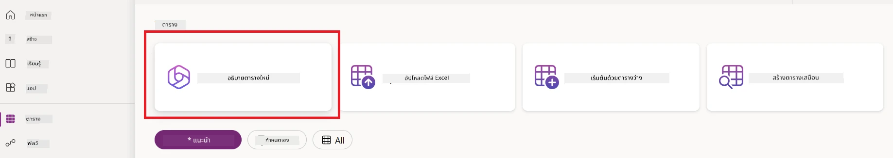

1. ในหน้าจอ **Describe the new Table** ใช้พื้นที่ข้อความเพื่ออธิบายตารางที่คุณต้องการสร้าง เช่น **_ฉันต้องการสร้างตารางเพื่อเก็บข้อมูลใบแจ้งหนี้_** คลิกที่ปุ่ม **Send** เพื่อส่งพรอมต์ไปที่ AI Copilot

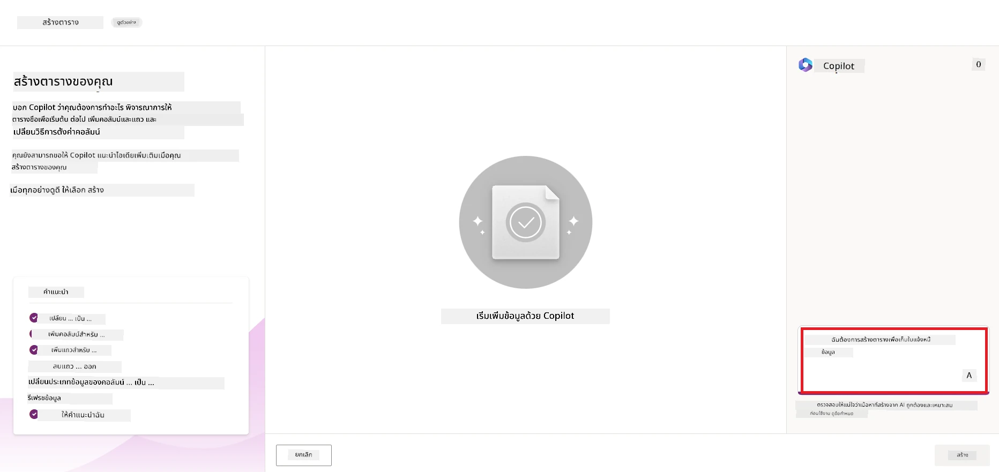

1. AI Copilot จะเสนอ Dataverse Table พร้อมฟิลด์ที่คุณต้องใช้เก็บข้อมูลที่คุณต้องการติดตามและข้อมูลตัวอย่างบางส่วน จากนั้นคุณสามารถปรับแต่งตารางให้ตรงกับความต้องการโดยใช้ฟีเจอร์ผู้ช่วย AI Copilot ผ่านขั้นตอนการสนทนา

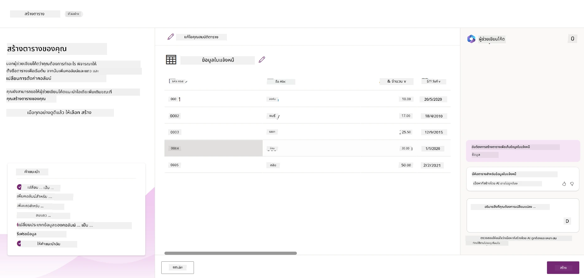

1. ทีมการเงินต้องการส่งอีเมลถึงผู้จัดส่งเพื่อติดตามสถานะใบแจ้งหนี้ในปัจจุบัน คุณสามารถใช้ Copilot เพื่อเพิ่มฟิลด์ใหม่ในตารางเพื่อเก็บอีเมลผู้จัดส่ง เช่น คุณสามารถใช้พรอมต์ต่อไปนี้เพื่อเพิ่มฟิลด์ใหม่ในตาราง: **_ฉันต้องการเพิ่มคอลัมน์เพื่อเก็บอีเมลผู้จัดส่ง_** คลิกที่ปุ่ม **Send** เพื่อส่งพรอมต์ไปยัง AI Copilot

1. AI Copilot จะสร้างฟิลด์ใหม่ให้คุณ จากนั้นคุณสามารถปรับแต่งฟิลด์ให้ตรงกับความต้องการของคุณ

1. เมื่อคุณทำตารางเสร็จแล้ว ให้คลิกที่ปุ่ม **Create** เพื่อสร้างตาราง

## โมเดล AI ใน Power Platform กับ AI Builder

AI Builder คือฟีเจอร์ AI แบบ low-code ที่มีใน Power Platform ที่ช่วยให้คุณใช้โมเดล AI เพื่อช่วยสร้างกระบวนการอัตโนมัติและทำนายผลลัพธ์ ด้วย AI Builder คุณสามารถนำ AI มาใช้ในแอปและโฟลว์ที่เชื่อมต่อกับข้อมูลใน Dataverse หรือแหล่งข้อมูลบนคลาวด์ต่างๆ เช่น SharePoint, OneDrive หรือ Azure

## โมเดล AI ที่สร้างไว้ล่วงหน้าเทียบกับโมเดล AI ที่กำหนดเอง

AI Builder มีโมเดล AI สองประเภท: โมเดล AI ที่สร้างไว้ล่วงหน้าและโมเดล AI ที่กำหนดเอง โมเดล AI ที่สร้างไว้ล่วงหน้าคือโมเดล AI ที่พร้อมใช้งานและถูกฝึกโดย Microsoft มีให้ใช้ใน Power Platform ช่วยให้คุณเพิ่มความฉลาดให้กับแอปและโฟลว์โดยไม่ต้องรวบรวมข้อมูลแล้วสร้าง ฝึก และเผยแพร่โมเดลเอง คุณสามารถใช้โมเดลเหล่านี้เพื่อสร้างกระบวนการอัตโนมัติและทำนายผลลัพธ์ได้

โมเดล AI ที่สร้างไว้ล่วงหน้าบางตัวที่มีใน Power Platform ได้แก่:

- **Key Phrase Extraction**: โมเดลนี้จะดึงวลีสำคัญจากข้อความ
- **Language Detection**: โมเดลนี้จะตรวจจับภาษาของข้อความ
- **Sentiment Analysis**: โมเดลนี้จะตรวจจับอารมณ์ความรู้สึกในข้อความว่าเป็นบวก ลบ กลาง หรือผสม
- **Business Card Reader**: โมเดลนี้จะดึงข้อมูลจากนามบัตร
- **Text Recognition**: โมเดลนี้จะดึงข้อความจากภาพ
- **Object Detection**: โมเดลนี้จะตรวจจับและดึงวัตถุจากภาพ
- **Document processing**: โมเดลนี้จะดึงข้อมูลจากแบบฟอร์ม
- **Invoice Processing**: โมเดลนี้จะดึงข้อมูลจากใบแจ้งหนี้

ด้วยโมเดล AI ที่กำหนดเอง คุณสามารถนำโมเดลของคุณมาใช้ใน AI Builder เพื่อให้ทำงานเหมือนโมเดล AI Builder ที่กำหนดเองอื่น ๆ ให้คุณฝึกโมเดลด้วยข้อมูลของคุณเองได้ คุณสามารถใช้โมเดลเหล่านี้เพื่อสร้างกระบวนการอัตโนมัติและทำนายผลลัพธ์ทั้งใน Power Apps และ Power Automate เมื่อใช้โมเดลของคุณเองจะมีข้อจำกัดที่ใช้บังคับ อ่านเพิ่มเติมเกี่ยวกับ [ข้อจำกัด](https://learn.microsoft.com/ai-builder/byo-model#limitations?WT.mc_id=academic-105485-koreyst)

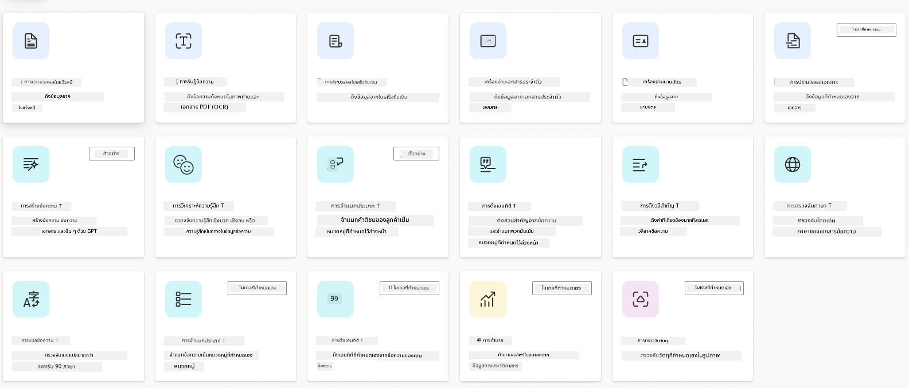

## การบ้านหมายเลข 2 - สร้างโฟลว์การประมวลผลใบแจ้งหนี้สำหรับสตาร์ทอัพของเรา

ทีมการเงินประสบปัญหาในการประมวลผลใบแจ้งหนี้ พวกเขาใช้สเปรดชีตในการติดตามใบแจ้งหนี้แต่ตอนนี้การจัดการยุ่งยากขึ้นเนื่องจากจำนวนใบแจ้งหนี้เพิ่มขึ้น พวกเขาขอให้คุณสร้างเวิร์กโฟลว์ที่จะช่วยประมวลผลใบแจ้งหนี้โดยใช้ AI เวิร์กโฟลว์นี้ต้องช่วยดึงข้อมูลจากใบแจ้งหนี้และเก็บข้อมูลในตาราง Dataverse รวมทั้งต้องช่วยส่งอีเมลถึงทีมการเงินพร้อมข้อมูลที่ดึงมาได้

ตอนนี้คุณรู้แล้วว่า AI Builder คืออะไรและเหตุใดคุณจึงควรใช้ มาดูกันว่าคุณจะใช้โมเดล AI Processing Invoice ใน AI Builder ซึ่งเราได้กล่าวถึงก่อนหน้านี้ เพื่อสร้างเวิร์กโฟลว์ที่ช่วยทีมการเงินประมวลผลใบแจ้งหนี้ได้อย่างไร

เพื่อสร้างเวิร์กโฟลว์ที่จะช่วยทีมการเงินประมวลผลใบแจ้งหนี้โดยใช้โมเดล AI Processing Invoice ใน AI Builder ให้ทำตามขั้นตอนดังนี้:

1. ไปที่หน้าจอหลักของ [Power Automate](https://make.powerautomate.com?WT.mc_id=academic-105485-koreyst)

2. ใช้พื้นที่ข้อความที่หน้าจอหลักเพื่ออธิบายเวิร์กโฟลว์ที่คุณต้องการสร้าง เช่น **_ประมวลผลใบแจ้งหนี้เมื่อได้รับในกล่องจดหมายของฉัน_** คลิกที่ปุ่ม **Send** เพื่อส่งพรอมต์ไปยัง AI Copilot

   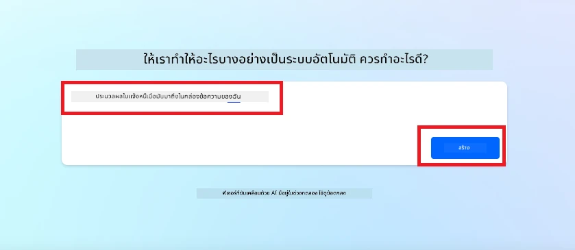

3. AI Copilot จะแนะนำการทำงานที่คุณต้องใช้เพื่อทำงานที่คุณต้องการอัตโนมัติ คุณสามารถคลิกที่ปุ่ม **Next** เพื่อดำเนินการในขั้นตอนถัดไป

4. ในขั้นตอนถัดไป Power Automate จะขอให้คุณตั้งค่าการเชื่อมต่อที่จำเป็นสำหรับโฟลว์ เมื่อเสร็จแล้วคลิกที่ปุ่ม **Create flow** เพื่อสร้างโฟลว์

5. AI Copilot จะสร้างโฟลว์ให้คุณ จากนั้นคุณสามารถปรับแต่งโฟลว์ให้ตรงกับความต้องการของคุณ

6. ปรับปรุงทริกเกอร์ของโฟลว์และตั้งค่า **Folder** ไปยังโฟลเดอร์ที่เก็บใบแจ้งหนี้ เช่น ตั้งค่าเป็น **Inbox** คลิกที่ **Show advanced options** และตั้งค่า **Only with Attachments** เป็น **Yes** เพื่อให้แน่ใจว่าโฟลว์ทำงานเฉพาะเมื่อได้รับอีเมลที่มีไฟล์แนบในโฟลเดอร์นั้น

7. ลบการทำงานต่อไปนี้ออกจากโฟลว์: **HTML to text**, **Compose**, **Compose 2**, **Compose 3** และ **Compose 4** เพราะคุณจะไม่ใช้

8. ลบการทำงาน **Condition** ออกจากโฟลว์ เพราะคุณจะไม่ใช้ ควรเป็นลักษณะตามภาพตัวอย่างด้านล่าง:

   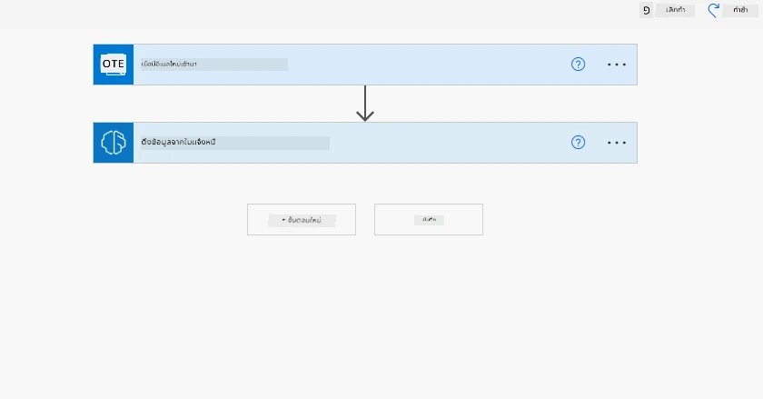

9. คลิกที่ปุ่ม **Add an action** แล้วค้นหา **Dataverse** เลือกการทำงาน **Add a new row**

10. ในการทำงาน **Extract Information from invoices** ให้ปรับ **Invoice File** ชี้ไปที่ **Attachment Content** จากอีเมล เพื่อให้โฟลว์ดึงข้อมูลจากไฟล์แนบใบแจ้งหนี้

11. เลือกตารางที่คุณสร้างไว้ก่อนหน้านี้ เช่น คุณสามารถเลือกตาราง **Invoice Information** จากนั้นเลือกเนื้อหาไดนามิกจากการทำงานก่อนหน้าเพื่อกรอกฟิลด์ต่อไปนี้:

    - ID
    - จำนวนเงิน
    - วันที่
    - ชื่อ
    - สถานะ - ตั้งค่า **Status** เป็น **Pending**
    - อีเมลผู้จัดส่ง - ใช้เนื้อหาไดนามิก **From** จากทริกเกอร์ **When a new email arrives**

    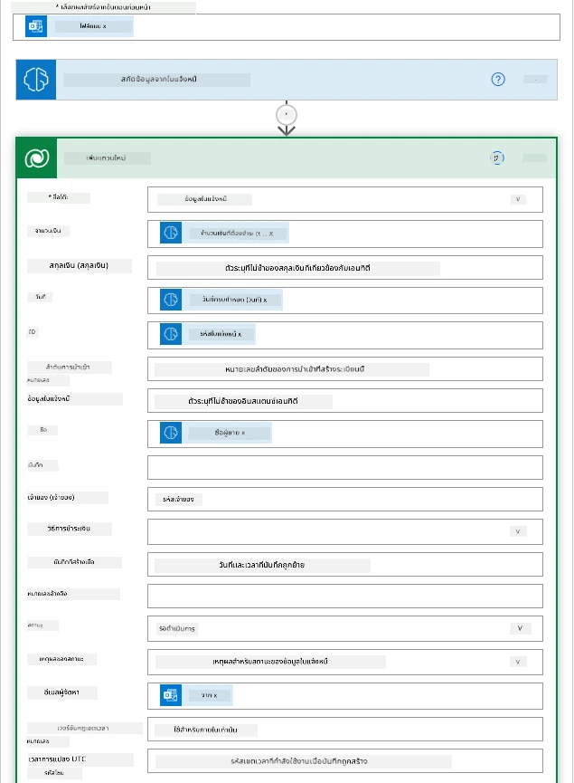

12. เมื่อคุณทำโฟลว์เสร็จแล้ว ให้คลิกที่ปุ่ม **Save** เพื่อบันทึกโฟลว์ คุณสามารถทดสอบโฟลว์ได้โดยการส่งอีเมลที่มีใบแจ้งหนี้ไปยังโฟลเดอร์ที่คุณกำหนดในทริกเกอร์

> **การบ้านของคุณ**: โฟลว์ที่คุณสร้างขึ้นเป็นจุดเริ่มต้นที่ดี ตอนนี้คุณต้องคิดว่าคุณจะสร้างระบบอัตโนมัติที่จะช่วยให้ทีมการเงินของเราส่งอีเมลถึงผู้จัดส่งเพื่อติดตามสถานะใบแจ้งหนี้ปัจจุบันได้อย่างไร คำใบ้ของคุณคือ โฟลว์ต้องทำงานเมื่อสถานะของใบแจ้งหนี้เปลี่ยนแปลง

## ใช้โมเดล AI สร้างข้อความใน Power Automate

โมเดล Create Text with GPT ใน AI Builder ช่วยให้คุณสร้างข้อความตามพรอมต์และขับเคลื่อนโดย Microsoft Azure OpenAI Service ด้วยความสามารถนี้ คุณสามารถผสมผสานเทคโนโลยี GPT (Generative Pre-Trained Transformer) ลงในแอปและโฟลว์ของคุณเพื่อสร้างโฟลว์อัตโนมัติต่าง ๆ และแอปพลิเคชันที่ให้ข้อมูลเชิงลึก

โมเดล GPT ผ่านการฝึกอบรมอย่างกว้างขวางด้วยข้อมูลจำนวนมาก ทำให้สามารถผลิตข้อความที่คล้ายภาษามนุษย์อย่างมากเมื่อได้รับพรอมต์ เมื่อผนวกเข้ากับการทำงานอัตโนมัติของเวิร์กโฟลว์ โมเดล AI เช่น GPT สามารถนำมาใช้เพื่อเพิ่มประสิทธิภาพและอัตโนมัติงานต่าง ๆ ได้หลากหลาย

ตัวอย่างเช่น คุณสามารถสร้างโฟลว์เพื่อสร้างข้อความโดยอัตโนมัติสำหรับกรณีการใช้งานต่างๆ เช่น ร่างอีเมล คำอธิบายสินค้า และอื่น ๆ คุณยังสามารถใช้โมเดลนี้เพื่อสร้างข้อความสำหรับแอปต่าง ๆ เช่น แชทบอทและแอปบริการลูกค้าที่ช่วยให้เจ้าหน้าที่บริการตอบสนองคำถามลูกค้าได้มีประสิทธิภาพและรวดเร็ว

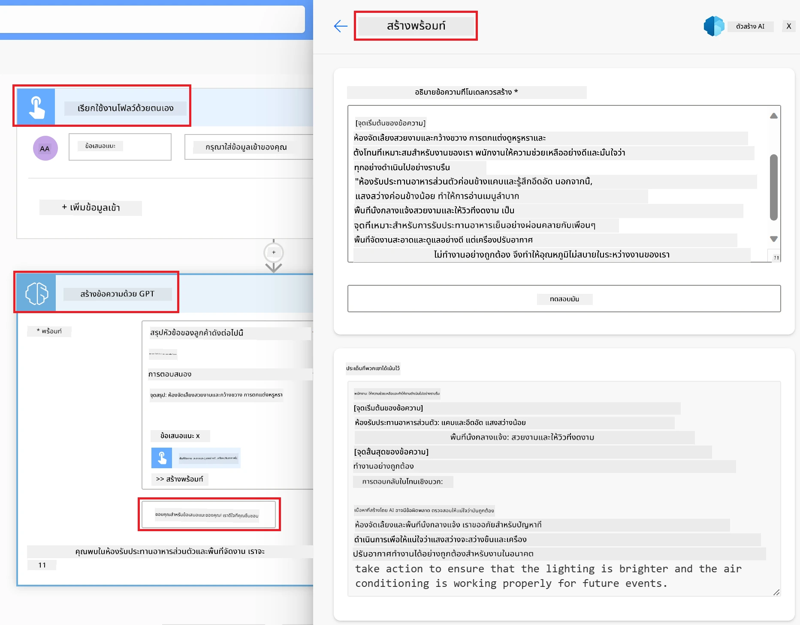

หากต้องการเรียนรู้วิธีใช้ AI Model นี้ใน Power Automate ให้ผ่านโมดูล [เพิ่มความชาญฉลาดด้วย AI Builder และ GPT](https://learn.microsoft.com/training/modules/ai-builder-text-generation/?WT.mc_id=academic-109639-somelezediko)

## ทำได้ยอดเยี่ยม! เรียนรู้ต่อไป

หลังจากเรียนบทนี้เสร็จแล้ว ลองดูที่ [ชุดการเรียนรู้ Generative AI ของเรา](https://aka.ms/genai-collection?WT.mc_id=academic-105485-koreyst) เพื่อยกระดับความรู้ Generative AI ของคุณต่อไป!

ต้องการปรับแต่งและใช้ประโยชน์จาก Copilot ให้มากขึ้นหรือไม่? สำรวจ [Awesome Copilot](https://github.com/github/awesome-copilot?WT.mc_id=academic-105485-koreyst) — ชุดคำแนะนำ ตัวแทน ทักษะ และการตั้งค่าที่ผู้ชุมชนช่วยกันรวบรวมเพื่อช่วยให้คุณใช้ GitHub Copilot ได้อย่างเต็มที่

ไปที่บทเรียนที่ 11 ซึ่งเราจะพิจารณาวิธีการ [รวม Generative AI กับการเรียกฟังก์ชัน](../11-integrating-with-function-calling/README.md?WT.mc_id=academic-105485-koreyst)!

---

<!-- CO-OP TRANSLATOR DISCLAIMER START -->
**ปฏิเสธความรับผิดชอบ**:
เอกสารนี้ได้รับการแปลโดยใช้บริการแปลภาษา AI [Co-op Translator](https://github.com/Azure/co-op-translator) ขณะที่เราพยายามให้ความถูกต้อง โปรดทราบว่าการแปลโดยอัตโนมัติอาจมีข้อผิดพลาดหรือความไม่ถูกต้อง เอกสารต้นฉบับในภาษาต้นทางควรถูกพิจารณาเป็นแหล่งข้อมูลที่เชื่อถือได้ สำหรับข้อมูลที่สำคัญ แนะนำให้ใช้การแปลโดยมนุษย์มืออาชีพ เราไม่รับผิดชอบต่อความเข้าใจผิดหรือการตีความที่ผิดพลาดที่เกิดขึ้นจากการใช้การแปลนี้
<!-- CO-OP TRANSLATOR DISCLAIMER END -->