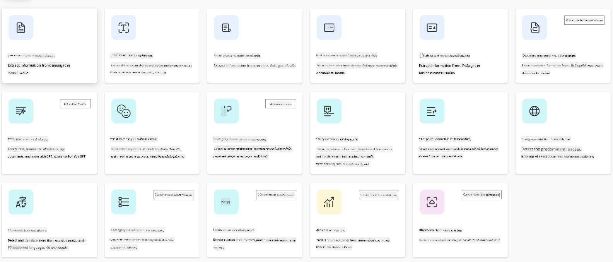
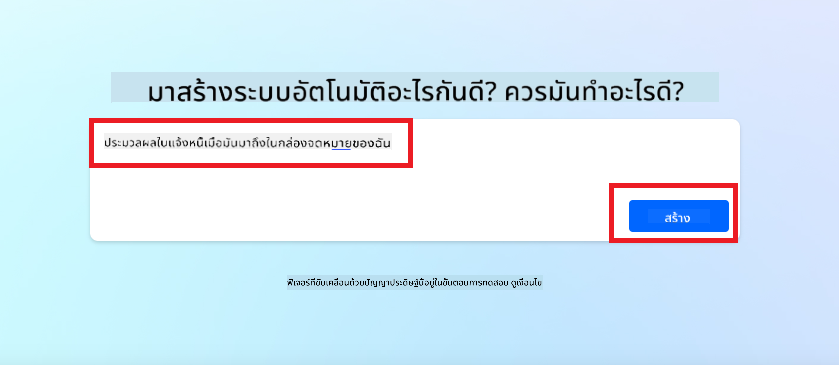
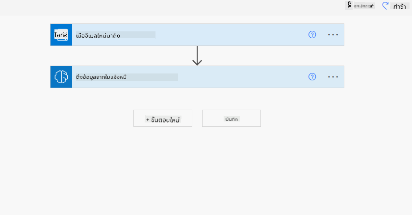
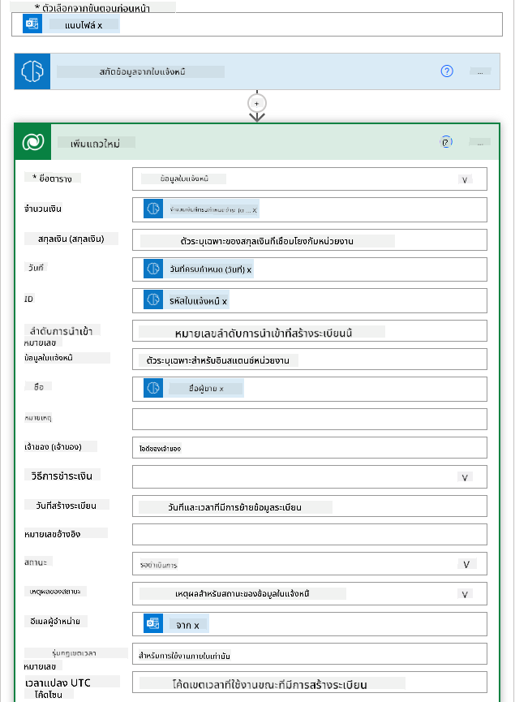
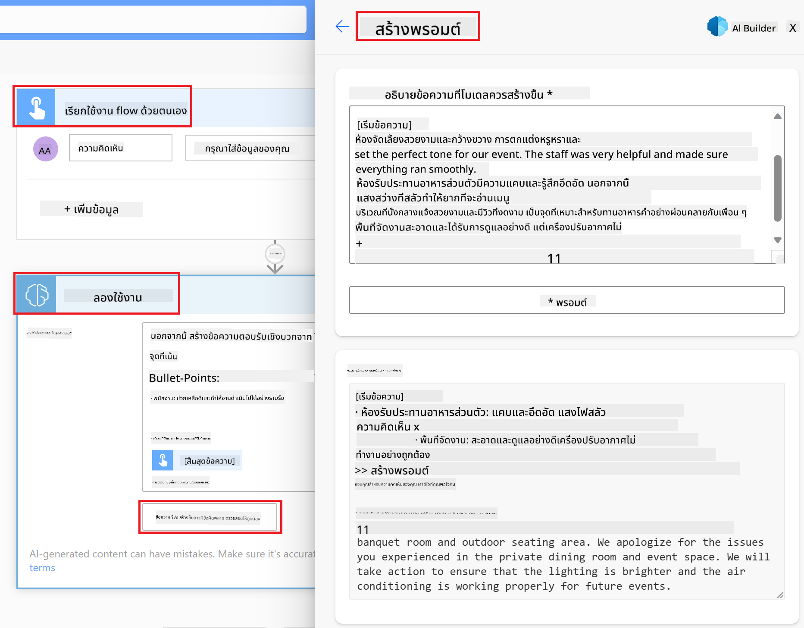

<!--
CO_OP_TRANSLATOR_METADATA:
{
  "original_hash": "f5ff3b6204a695a117d6f452403c95f7",
  "translation_date": "2025-06-25T18:46:06+00:00",
  "source_file": "10-building-low-code-ai-applications/README.md",
  "language_code": "th"
}
-->
# การสร้างแอปพลิเคชัน AI ด้วย Low Code

## บทนำ

ตอนนี้ที่เราได้เรียนรู้วิธีสร้างแอปพลิเคชันที่สร้างภาพแล้ว เรามาพูดถึง Low Code กันบ้าง Generative AI สามารถนำไปใช้ในหลายพื้นที่ รวมถึง Low Code แต่ Low Code คืออะไรและเราสามารถเพิ่ม AI เข้าไปได้อย่างไร?

การสร้างแอปและโซลูชั่นได้กลายเป็นเรื่องง่ายขึ้นสำหรับนักพัฒนาแบบดั้งเดิมและผู้ที่ไม่ใช่นักพัฒนาด้วยการใช้แพลตฟอร์มพัฒนา Low Code แพลตฟอร์มเหล่านี้ช่วยให้คุณสร้างแอปและโซลูชั่นได้ด้วยการเขียนโค้ดน้อยหรือแทบไม่ต้องเขียนโค้ดเลย ซึ่งทำได้โดยการให้สภาพแวดล้อมการพัฒนาแบบภาพที่ช่วยให้คุณลากและวางส่วนประกอบเพื่อสร้างแอปและโซลูชั่น สิ่งนี้ช่วยให้คุณสร้างแอปและโซลูชั่นได้เร็วขึ้นและใช้ทรัพยากรน้อยลง ในบทเรียนนี้เราจะเจาะลึกถึงวิธีการใช้ Low Code และวิธีการเพิ่มประสิทธิภาพการพัฒนา Low Code ด้วย AI โดยใช้ Power Platform

Power Platform ให้โอกาสองค์กรในการเสริมศักยภาพทีมของพวกเขาในการสร้างโซลูชั่นของตัวเองผ่านสภาพแวดล้อมที่ใช้งานง่ายแบบ Low Code หรือ No Code สภาพแวดล้อมนี้ช่วยให้กระบวนการสร้างโซลูชั่นง่ายขึ้น ด้วย Power Platform โซลูชั่นสามารถสร้างได้ในไม่กี่วันหรือสัปดาห์แทนที่จะเป็นเดือนหรือปี Power Platform ประกอบด้วยผลิตภัณฑ์หลักห้าตัว: Power Apps, Power Automate, Power BI, Power Pages และ Copilot Studio

บทเรียนนี้ครอบคลุมถึง:

- การแนะนำ Generative AI ใน Power Platform
- การแนะนำ Copilot และวิธีการใช้งาน
- การใช้ Generative AI ในการสร้างแอปและกระบวนการใน Power Platform
- การทำความเข้าใจ AI Models ใน Power Platform ด้วย AI Builder

## เป้าหมายการเรียนรู้

เมื่อจบบทเรียนนี้ คุณจะสามารถ:

- เข้าใจการทำงานของ Copilot ใน Power Platform

- สร้างแอปติดตามงานนักเรียนสำหรับการเริ่มต้นธุรกิจการศึกษาของเรา

- สร้างกระบวนการประมวลผลใบแจ้งหนี้ที่ใช้ AI ในการดึงข้อมูลจากใบแจ้งหนี้

- ใช้แนวทางปฏิบัติที่ดีที่สุดเมื่อใช้ Create Text กับ GPT AI Model

เครื่องมือและเทคโนโลยีที่คุณจะใช้ในบทเรียนนี้คือ:

- **Power Apps**, สำหรับแอปติดตามงานนักเรียน ซึ่งให้สภาพแวดล้อมการพัฒนาแบบ Low Code สำหรับการสร้างแอปเพื่อติดตาม จัดการ และโต้ตอบกับข้อมูล

- **Dataverse**, สำหรับการจัดเก็บข้อมูลสำหรับแอปติดตามงานนักเรียนที่ Dataverse จะให้แพลตฟอร์มข้อมูลแบบ Low Code สำหรับการจัดเก็บข้อมูลของแอป

- **Power Automate**, สำหรับกระบวนการประมวลผลใบแจ้งหนี้ที่คุณจะมีสภาพแวดล้อมการพัฒนาแบบ Low Code สำหรับการสร้างการทำงานอัตโนมัติเพื่อประมวลผลใบแจ้งหนี้

- **AI Builder**, สำหรับ AI Model ประมวลผลใบแจ้งหนี้ที่คุณจะใช้ AI Models ที่สร้างไว้ล่วงหน้าในการประมวลผลใบแจ้งหนี้สำหรับการเริ่มต้นธุรกิจของเรา

## Generative AI ใน Power Platform

การเพิ่มประสิทธิภาพการพัฒนาและแอปพลิเคชันแบบ Low Code ด้วย Generative AI เป็นพื้นที่ที่มีความสำคัญสำหรับ Power Platform เป้าหมายคือการทำให้ทุกคนสามารถสร้างแอปที่มี AI เป็นพลังงานได้ โดยไม่ต้องมีความเชี่ยวชาญด้านวิทยาศาสตร์ข้อมูล เป้าหมายนี้สามารถทำได้โดยการผสานรวม Generative AI เข้ากับประสบการณ์การพัฒนาแบบ Low Code ใน Power Platform ในรูปแบบของ Copilot และ AI Builder

### สิ่งนี้ทำงานอย่างไร?

Copilot เป็นผู้ช่วย AI ที่ช่วยให้คุณสร้างโซลูชั่น Power Platform โดยการอธิบายความต้องการของคุณในขั้นตอนการสนทนาโดยใช้ภาษาธรรมชาติ คุณสามารถสั่งให้ผู้ช่วย AI ของคุณระบุว่าฟิลด์ใดที่แอปของคุณจะใช้ และมันจะสร้างทั้งแอปและโมเดลข้อมูลพื้นฐาน หรือคุณสามารถระบุวิธีการตั้งค่ากระบวนการใน Power Automate

คุณสามารถใช้ฟังก์ชันที่ขับเคลื่อนด้วย Copilot เป็นคุณสมบัติในหน้าจอแอปของคุณเพื่อให้ผู้ใช้ค้นพบข้อมูลเชิงลึกผ่านการโต้ตอบแบบสนทนา

AI Builder เป็นความสามารถ AI แบบ Low Code ที่มีอยู่ใน Power Platform ที่ช่วยให้คุณใช้ AI Models เพื่อช่วยในการทำงานอัตโนมัติและทำนายผลลัพธ์ ด้วย AI Builder คุณสามารถนำ AI มาสู่แอปและกระบวนการที่เชื่อมต่อกับข้อมูลของคุณใน Dataverse หรือในแหล่งข้อมูลคลาวด์ต่างๆ เช่น SharePoint, OneDrive หรือ Azure

Copilot มีให้ในทุกผลิตภัณฑ์ของ Power Platform: Power Apps, Power Automate, Power BI, Power Pages และ Power Virtual Agents AI Builder มีให้ใน Power Apps และ Power Automate ในบทเรียนนี้เราจะเน้นที่วิธีการใช้ Copilot และ AI Builder ใน Power Apps และ Power Automate เพื่อสร้างโซลูชั่นสำหรับการเริ่มต้นธุรกิจการศึกษาของเรา

### Copilot ใน Power Apps

ในส่วนของ Power Platform, Power Apps ให้สภาพแวดล้อมการพัฒนาแบบ Low Code สำหรับการสร้างแอปเพื่อติดตาม จัดการ และโต้ตอบกับข้อมูล เป็นชุดบริการการพัฒนาแอปที่มีแพลตฟอร์มข้อมูลที่สามารถขยายได้และความสามารถในการเชื่อมต่อกับบริการคลาวด์และข้อมูลในสถานที่ Power Apps ช่วยให้คุณสร้างแอปที่ทำงานบนเบราว์เซอร์ แท็บเล็ต และโทรศัพท์ และสามารถแชร์กับเพื่อนร่วมงานได้ Power Apps ช่วยให้ผู้ใช้เข้าสู่การพัฒนาแอปด้วยอินเทอร์เฟซที่เรียบง่าย ดังนั้นผู้ใช้ธุรกิจหรือโปรแกรมเมอร์ทุกคนสามารถสร้างแอปที่กำหนดเองได้ ประสบการณ์การพัฒนาแอปยังได้รับการปรับปรุงด้วย Generative AI ผ่าน Copilot

ฟีเจอร์ผู้ช่วย AI Copilot ใน Power Apps ช่วยให้คุณอธิบายว่าแอปที่คุณต้องการเป็นอย่างไรและข้อมูลที่คุณต้องการให้แอปติดตาม รวบรวม หรือแสดง Copilot จะสร้างแอป Canvas ที่ตอบสนองตามคำอธิบายของคุณ คุณสามารถปรับแต่งแอปให้ตรงกับความต้องการของคุณได้ ผู้ช่วย AI Copilot ยังสร้างและแนะนำตาราง Dataverse พร้อมฟิลด์ที่คุณต้องการเพื่อจัดเก็บข้อมูลที่คุณต้องการติดตามและข้อมูลตัวอย่างบางส่วน เราจะดูว่า Dataverse คืออะไรและวิธีการใช้งานใน Power Apps ในบทเรียนนี้ภายหลัง คุณสามารถปรับแต่งตารางให้ตรงกับความต้องการของคุณโดยใช้ฟีเจอร์ผู้ช่วย AI Copilot ผ่านขั้นตอนการสนทนา ฟีเจอร์นี้มีอยู่ในหน้าจอหลักของ Power Apps

### Copilot ใน Power Automate

ในส่วนของ Power Platform, Power Automate ช่วยให้ผู้ใช้สร้างการทำงานอัตโนมัติระหว่างแอปพลิเคชันและบริการ มันช่วยให้กระบวนการทางธุรกิจที่ซ้ำซ้อนเช่นการสื่อสาร การรวบรวมข้อมูล และการอนุมัติการตัดสินใจเป็นไปโดยอัตโนมัติ อินเทอร์เฟซที่เรียบง่ายช่วยให้ผู้ใช้ที่มีความเชี่ยวชาญทางเทคนิคทุกระดับ (ตั้งแต่ผู้เริ่มต้นไปจนถึงนักพัฒนาที่มีประสบการณ์) สามารถทำงานอัตโนมัติได้ ประสบการณ์การพัฒนากระบวนการยังได้รับการปรับปรุงด้วย Generative AI ผ่าน Copilot

ฟีเจอร์ผู้ช่วย AI Copilot ใน Power Automate ช่วยให้คุณอธิบายว่ากระบวนการที่คุณต้องการเป็นอย่างไรและการกระทำที่คุณต้องการให้กระบวนการของคุณทำ Copilot จะสร้างกระบวนการตามคำอธิบายของคุณ คุณสามารถปรับแต่งกระบวนการให้ตรงกับความต้องการของคุณได้ ผู้ช่วย AI Copilot ยังสร้างและแนะนำการกระทำที่คุณต้องการเพื่อทำงานที่คุณต้องการทำให้เป็นอัตโนมัติ เราจะดูว่ากระบวนการคืออะไรและวิธีการใช้งานใน Power Automate ในบทเรียนนี้ภายหลัง คุณสามารถปรับแต่งการกระทำให้ตรงกับความต้องการของคุณโดยใช้ฟีเจอร์ผู้ช่วย AI Copilot ผ่านขั้นตอนการสนทนา ฟีเจอร์นี้มีอยู่ในหน้าจอหลักของ Power Automate

## งานที่ได้รับมอบหมาย: จัดการงานนักเรียนและใบแจ้งหนี้สำหรับการเริ่มต้นธุรกิจของเราโดยใช้ Copilot

การเริ่มต้นธุรกิจของเรามีการให้คอร์สออนไลน์แก่ผู้เรียน ธุรกิจเริ่มต้นได้เติบโตอย่างรวดเร็วและกำลังประสบปัญหาในการตอบสนองความต้องการของคอร์ส ธุรกิจเริ่มต้นได้ว่าจ้างคุณเป็นนักพัฒนา Power Platform เพื่อช่วยสร้างโซลูชั่นแบบ Low Code เพื่อช่วยในการจัดการงานนักเรียนและใบแจ้งหนี้ โซลูชั่นของพวกเขาควรช่วยในการติดตามและจัดการงานนักเรียนผ่านแอปและทำให้กระบวนการประมวลผลใบแจ้งหนี้เป็นอัตโนมัติผ่านกระบวนการ คุณได้รับการขอให้ใช้ Generative AI ในการพัฒนาโซลูชั่น

เมื่อคุณเริ่มต้นการใช้ Copilot คุณสามารถใช้ [Power Platform Copilot Prompt Library](https://github.com/pnp/powerplatform-prompts?WT.mc_id=academic-109639-somelezediko) เพื่อเริ่มต้นการใช้งาน prompt ไลบรารีนี้มีรายการ prompt ที่คุณสามารถใช้ในการสร้างแอปและกระบวนการด้วย Copilot คุณยังสามารถใช้ prompt ในไลบรารีเพื่อรับแนวคิดในการอธิบายความต้องการของคุณให้กับ Copilot

### สร้างแอปติดตามงานนักเรียนสำหรับธุรกิจเริ่มต้นของเรา

ครูในธุรกิจเริ่มต้นของเรากำลังประสบปัญหาในการติดตามงานนักเรียน พวกเขาได้ใช้สเปรดชีตในการติดตามงานแต่การจัดการได้ยากขึ้นเมื่อจำนวนผู้เรียนเพิ่มขึ้น พวกเขาได้ขอให้คุณสร้างแอปที่ช่วยในการติดตามและจัดการงานนักเรียน แอปควรช่วยให้พวกเขาสามารถเพิ่มงานใหม่ ดูงาน อัปเดตงาน และลบงาน แอปยังควรช่วยให้ครูและนักเรียนสามารถดูงานที่ได้รับการให้คะแนนแล้วและงานที่ยังไม่ได้รับการให้คะแนน

คุณจะสร้างแอปโดยใช้ Copilot ใน Power Apps ตามขั้นตอนด้านล่าง:

1. เข้าสู่หน้าจอหลักของ [Power Apps](https://make.powerapps.com?WT.mc_id=academic-105485-koreyst)

1. ใช้พื้นที่ข้อความบนหน้าจอหลักเพื่ออธิบายแอปที่คุณต้องการสร้าง เช่น **_ฉันต้องการสร้างแอปเพื่อติดตามและจัดการงานนักเรียน_** คลิกปุ่ม **Send** เพื่อส่ง prompt ไปยัง AI Copilot

1. AI Copilot จะเสนอแนะตาราง Dataverse พร้อมฟิลด์ที่คุณต้องการเพื่อจัดเก็บข้อมูลที่คุณต้องการติดตามและข้อมูลตัวอย่างบางส่วน คุณสามารถปรับแต่งตารางให้ตรงกับความต้องการของคุณโดยใช้ฟีเจอร์ผู้ช่วย AI Copilot ผ่านขั้นตอนการสนทนา

1. ครูต้องการส่งอีเมลไปยังนักเรียนที่ได้ส่งงานเพื่ออัปเดตพวกเขาเกี่ยวกับความคืบหน้าของงาน คุณสามารถใช้ Copilot เพื่อเพิ่มฟิลด์ใหม่ในตารางเพื่อจัดเก็บอีเมลของนักเรียน เช่น คุณสามารถใช้ prompt ต่อไปนี้เพื่อเพิ่มฟิลด์ใหม่ในตาราง: **_ฉันต้องการเพิ่มคอลัมน์เพื่อจัดเก็บอีเมลของนักเรียน_** คลิกปุ่ม **Send** เพื่อส่ง prompt ไปยัง AI Copilot

1. AI Copilot จะสร้างฟิลด์ใหม่และคุณสามารถปรับแต่งฟิลด์ให้ตรงกับความต้องการของคุณ

1. เมื่อคุณทำเสร็จแล้วกับตาราง คลิกปุ่ม **Create app** เพื่อสร้างแอป

1. AI Copilot จะสร้างแอป Canvas ที่ตอบสนองตามคำอธิบายของคุณ คุณสามารถปรับแต่งแอปให้ตรงกับความต้องการของคุณได้

1. สำหรับครูที่จะส่งอีเมลไปยังนักเรียน คุณสามารถใช้ Copilot เพื่อเพิ่มหน้าจอใหม่ในแอป เช่น คุณสามารถใช้ prompt ต่อไปนี้เพื่อเพิ่มหน้าจอใหม่ในแอป: **_ฉันต้องการเพิ่มหน้าจอเพื่อส่งอีเมลไปยังนักเรียน_** คลิกปุ่ม **Send** เพื่อส่ง prompt ไปยัง AI Copilot

1. AI Copilot จะสร้างหน้าจอใหม่และคุณสามารถปรับแต่งหน้าจอให้ตรงกับความต้องการของคุณได้

1. เมื่อคุณทำเสร็จแล้วกับแอป คลิกปุ่ม **Save** เพื่อบันทึกแอป

1. เพื่อแชร์แอปกับครู คลิกปุ่ม **Share** แล้วคลิกปุ่ม **Share** อีกครั้ง คุณสามารถแชร์แอปกับครูโดยการป้อนที่อยู่อีเมลของพวกเขา

> **การบ้านของคุณ**: แอปที่คุณเพิ่งสร้างเป็นการเริ่มต้นที่ดีแต่สามารถปรับปรุงได้ ด้วยฟีเจอร์อีเมล ครูสามารถส่งอีเมลไปยังนักเรียนได้ด้วยการพิมพ์อีเมลของพวกเขาเท่านั้น คุณสามารถใช้ Copilot เพื่อสร้างการทำงานอัตโนมัติที่จะช่วยให้ครูสามารถส่งอีเมลไปยังนักเรียนโดยอัตโนมัติเมื่อพวกเขาส่งงานของพวกเขาได้หรือไม่? คำแนะนำของคุณคือด้วย prompt ที่ถูกต้องคุณสามารถใช้ Copilot ใน Power Automate เพื่อสร้างสิ่งนี้

### สร้างตารางข้อมูลใบแจ้งหนี้สำหรับธุรกิจเริ่มต้นของเรา

ทีมการเงินของธุรกิจเริ่มต้นของเรากำลังประสบปัญหาในการติดตามใบแจ้งหนี้ พวกเขาได้ใช้สเปรดชีตในการติดตามใบแจ้งหนี้แต่การจัดการได้ยากขึ้นเมื่อจำนวนใบแจ้งหนี้เพิ่มขึ้น พวกเขาได้ขอให้คุณสร้างตารางที่จะช่วยในการจัดเก็บ ติดตาม และจัดการข้อมูลของใบแจ้งหนี้ที่ได้รับ ตารางควรใช้ในการสร้างการทำงานอัตโนมัติที่จะดึงข้อมูลใบแจ้งหนี้ทั้งหมดและจัดเก็บในตาราง ตารางยังควรช่วยให้ทีมการเงินสามารถดูใบแจ้งหนี้ที่ได้รับการชำระเงินแล้วและใบแจ้งหนี้ที่ยังไม่ได้รับการชำระเงิน

Power Platform มีแพลตฟอร์มข้อมูลพื้นฐานที่เรียกว่า Dataverse ที่ช่วยให้คุณสามารถจัดเก็บข้อมูลสำหรับแอปและโซลูชั่นของคุณ Dataverse ให้แพลตฟอร์มข้อมูลแบบ Low Code สำหรับการจัดเก็บข้อมูลของแอป เป็นบริการที่มีการจัดการเต็มรูปแบบที่จัดเก็บข้อมูลใน Microsoft Cloud อย่างปลอดภัยและถูกจัดเตรียมในสภาพแวดล้อม Power Platform ของคุณ มันมาพร้อมกับความสามารถในการควบคุมข้อมูลที่สร้างไว้ในตัว เช่น การจัดประเภทข้อมูล การกำหนดเส้นทางข้อมูล การควบคุมการเข้าถึงที่ละเอียด และอื่นๆ คุณสามารถเรียนรู้เพิ่มเติม [เกี่ยวกับ Dataverse ที่นี่](https://docs.microsoft.com/powerapps/maker/data-platform/data-platform-intro?WT.mc_id=academic-109639-somelezediko)

ทำไมเราควรใช้ Dataverse สำหรับธุรกิจเริ่มต้นของเรา? ตารางมาตรฐานและตารางที่กำหนดเองภายใน Dataverse ให้ตัวเลือกการจัดเก็บข้อมูลที่ปลอดภัยและเป็นคลาวด์สำหรับข้อมูลของคุณ ตารางช่วยให้คุณจัดเก็บข้อมูลประเภทต่างๆ คล้ายกับการใช้หลายแผ่นงานในสมุดงาน Excel เดียว คุณสามารถใช้ตารางในการจัดเก็บข้อมูลที่เฉพาะเจาะจงกับองค์กรหรือความต้องการทางธุรกิจของคุณ ประโยชน์บางประการที่ธุรกิจเริ่มต้นของเราจะได้รับจากการใช้ Dataverse ได้แก่แต่ไม่จำกัดเพียง:

- **จัดการง่าย**: ทั้งเมตาดาต้าและข้อมูลถูกจัดเก็บในคลาวด์ ดังนั้นคุณไม่ต้องกังวลเกี่ยวกับรายละเอียดของการจัดเก็บหรือการจัดการ คุณสามารถมุ่งเน้นไปที่การสร้างแอปและโซลูชั่นของคุณ

- **ปลอดภัย**: Dataverse ให้ตัวเลือกการจัดเก็บข้อมูลที่ปลอดภัยและเป็นคลาวด์สำหรับข้อมูลของคุณ คุณสามารถควบคุมว่าใครมีสิทธิ์เข้าถึงข้อมูลในตารางของคุณและวิธีการเข้าถึงโดยใช้การรักษาความปลอดภัยตามบทบาท

- **เมตาดาต้าที่สมบูรณ์**: ประเภทข้อมูลและความสัมพันธ์ถูกใช้โดยตรงภายใน Power Apps

- **ตรรกะและการตรวจสอบความถูกต้อง**: คุณสามารถใช้กฎธุรกิจ ฟิลด์ที่คำนวณได้ และกฎการตรวจสอบความถูกต้องเพื่อบังคับใช้ตรรกะธุรกิจและรักษาความถูกต้องของข้อมูล

ตอนนี้ที่คุณรู้ว่า Dataverse คืออะไรและทำไมคุณควรใช้มัน เรามาดูวิธีการใช้ Copilot ในการสร้างตารางใน Dataverse เพื่อตอบสนองความต้องการของทีมการเงินของเรา

> **หมายเหตุ**: คุณจะใช้ตารางนี้ใน
ข้อความ - **การวิเคราะห์อารมณ์**: โมเดลนี้ตรวจจับอารมณ์เชิงบวก เชิงลบ กลางๆ หรือแบบผสมในข้อความ - **เครื่องอ่านนามบัตร**: โมเดลนี้ดึงข้อมูลจากนามบัตร - **การรู้จำข้อความ**: โมเดลนี้ดึงข้อความจากภาพ - **การตรวจจับวัตถุ**: โมเดลนี้ตรวจจับและดึงวัตถุจากภาพ - **การประมวลผลเอกสาร**: โมเดลนี้ดึงข้อมูลจากแบบฟอร์ม - **การประมวลผลใบแจ้งหนี้**: โมเดลนี้ดึงข้อมูลจากใบแจ้งหนี้ ด้วยโมเดล AI ที่ปรับแต่งเอง คุณสามารถนำโมเดลของคุณมาใช้ใน AI Builder เพื่อให้มันทำงานเหมือนกับโมเดล AI Builder ที่ปรับแต่งเอง ซึ่งจะช่วยให้คุณฝึกโมเดลด้วยข้อมูลของคุณเอง คุณสามารถใช้โมเดลเหล่านี้ในการทำให้กระบวนการเป็นอัตโนมัติและคาดการณ์ผลลัพธ์ในทั้ง Power Apps และ Power Automate เมื่อใช้โมเดลของคุณเองจะมีข้อจำกัดที่ต้องพิจารณา อ่านเพิ่มเติมเกี่ยวกับ [ข้อจำกัด](https://learn.microsoft.com/ai-builder/byo-model#limitations?WT.mc_id=academic-105485-koreyst) เหล่านี้ 

## งานที่ 2 - สร้างกระบวนการประมวลผลใบแจ้งหนี้สำหรับสตาร์ทอัพของเรา

ทีมการเงินมีปัญหาในการประมวลผลใบแจ้งหนี้ พวกเขาใช้สเปรดชีตในการติดตามใบแจ้งหนี้แต่การจัดการเริ่มยากขึ้นเมื่อจำนวนใบแจ้งหนี้เพิ่มขึ้น พวกเขาขอให้คุณสร้างเวิร์กโฟลว์ที่จะช่วยพวกเขาประมวลผลใบแจ้งหนี้โดยใช้ AI เวิร์กโฟลว์ควรช่วยให้พวกเขาดึงข้อมูลจากใบแจ้งหนี้และเก็บข้อมูลในตาราง Dataverse เวิร์กโฟลว์ควรช่วยให้พวกเขาส่งอีเมลไปยังทีมการเงินพร้อมข้อมูลที่ดึงมา ตอนนี้คุณรู้แล้วว่า AI Builder คืออะไรและทำไมคุณควรใช้มัน ลองมาดูวิธีที่คุณสามารถใช้โมเดล AI การประมวลผลใบแจ้งหนี้ใน AI Builder ซึ่งเราได้พูดถึงก่อนหน้านี้เพื่อสร้างเวิร์กโฟลว์ที่จะช่วยทีมการเงินในการประมวลผลใบแจ้งหนี้

ในการสร้างเวิร์กโฟลว์ที่จะช่วยทีมการเงินในการประมวลผลใบแจ้งหนี้โดยใช้โมเดล AI การประมวลผลใบแจ้งหนี้ใน AI Builder ให้ทำตามขั้นตอนดังนี้:

1. ไปที่หน้าหลักของ [Power Automate](https://make.powerautomate.com?WT.mc_id=academic-105485-koreyst)
2. ใช้พื้นที่ข้อความบนหน้าหลักเพื่ออธิบายเวิร์กโฟลว์ที่คุณต้องการสร้าง ตัวอย่างเช่น **_ประมวลผลใบแจ้งหนี้เมื่อมันมาถึงในกล่องจดหมายของฉัน_** คลิกที่ปุ่ม **ส่ง** เพื่อส่งคำสั่งไปยัง AI Copilot 
3. AI Copilot จะเสนอแนะการกระทำที่คุณต้องทำเพื่อให้งานที่คุณต้องการเป็นอัตโนมัติ คุณสามารถคลิกที่ปุ่ม **ถัดไป** เพื่อดำเนินการในขั้นตอนถัดไป
4. ในขั้นตอนถัดไป Power Automate จะขอให้คุณตั้งค่าการเชื่อมต่อที่จำเป็นสำหรับการไหล เมื่อเสร็จแล้ว คลิกที่ปุ่ม **สร้างการไหล** เพื่อสร้างการไหล
5. AI Copilot จะสร้างการไหลและคุณสามารถปรับแต่งการไหลให้ตรงตามความต้องการของคุณได้
6. อัปเดตทริกเกอร์ของการไหลและตั้งค่า **โฟลเดอร์** ไปยังโฟลเดอร์ที่ใบแจ้งหนี้จะถูกจัดเก็บ ตัวอย่างเช่น คุณสามารถตั้งค่าโฟลเดอร์เป็น **กล่องขาเข้า** คลิกที่ **แสดงตัวเลือกขั้นสูง** และตั้งค่า **เฉพาะกับไฟล์แนบ** เป็น **ใช่** ซึ่งจะทำให้การไหลทำงานเฉพาะเมื่อได้รับอีเมลที่มีไฟล์แนบในโฟลเดอร์
7. ลบการกระทำต่อไปนี้ออกจากการไหล: **HTML to text**, **Compose**, **Compose 2**, **Compose 3** และ **Compose 4** เพราะคุณจะไม่ใช้มัน
8. ลบการกระทำ **Condition** ออกจากการไหลเพราะคุณจะไม่ใช้มัน ควรมีลักษณะเหมือนภาพหน้าจอต่อไปนี้: 
9. คลิกที่ปุ่ม **เพิ่มการกระทำ** และค้นหา **Dataverse** เลือกการกระทำ **เพิ่มแถวใหม่**
10. ในการกระทำ **ดึงข้อมูลจากใบแจ้งหนี้** อัปเดต **ไฟล์ใบแจ้งหนี้** เพื่อชี้ไปที่ **เนื้อหาไฟล์แนบ** จากอีเมล ซึ่งจะทำให้การไหลดึงข้อมูลจากไฟล์แนบใบแจ้งหนี้
11. เลือก **ตาราง** ที่คุณสร้างไว้ก่อนหน้านี้ ตัวอย่างเช่น คุณสามารถเลือกตาราง **ข้อมูลใบแจ้งหนี้** เลือกเนื้อหาแบบไดนามิกจากการกระทำก่อนหน้าเพื่อเติมข้อมูลในฟิลด์ต่อไปนี้: - ID - จำนวนเงิน - วันที่ - ชื่อ - สถานะ - ตั้งค่า **สถานะ** เป็น **รอดำเนินการ** - อีเมลของผู้จัดหา - ใช้เนื้อหาแบบไดนามิก **จาก** จากทริกเกอร์ **เมื่อมีอีเมลใหม่มาถึง** 
12. เมื่อคุณเสร็จสิ้นการไหล คลิกที่ปุ่ม **บันทึก** เพื่อบันทึกการไหล คุณสามารถทดสอบการไหลโดยส่งอีเมลพร้อมใบแจ้งหนี้ไปยังโฟลเดอร์ที่คุณระบุในทริกเกอร์

> **การบ้านของคุณ**: การไหลที่คุณเพิ่งสร้างเป็นการเริ่มต้นที่ดี ตอนนี้คุณต้องคิดถึงวิธีที่คุณสามารถสร้างการอัตโนมัติที่จะช่วยให้ทีมการเงินของเราส่งอีเมลไปยังผู้จัดหาเพื่ออัปเดตพวกเขาด้วยสถานะปัจจุบันของใบแจ้งหนี้ของพวกเขา คำแนะนำของคุณ: การไหลต้องทำงานเมื่อสถานะของใบแจ้งหนี้เปลี่ยนแปลง

## ใช้โมเดล AI การสร้างข้อความใน Power Automate

โมเดล AI สร้างข้อความด้วย GPT ใน AI Builder ช่วยให้คุณสร้างข้อความตามคำสั่งและขับเคลื่อนโดยบริการ Microsoft Azure OpenAI ด้วยความสามารถนี้ คุณสามารถรวมเทคโนโลยี GPT (Generative Pre-Trained Transformer) เข้ากับแอปและการไหลของคุณเพื่อสร้างการไหลอัตโนมัติและแอปพลิเคชันที่มีข้อมูลเชิงลึกหลากหลาย

โมเดล GPT ได้รับการฝึกอบรมอย่างละเอียดด้วยข้อมูลจำนวนมาก ทำให้สามารถผลิตข้อความที่คล้ายคลึงกับภาษามนุษย์เมื่อได้รับคำสั่ง เมื่อรวมเข้ากับการอัตโนมัติของเวิร์กโฟลว์ โมเดล AI เช่น GPT สามารถนำมาใช้เพื่อปรับปรุงและทำให้หลากหลายงานเป็นอัตโนมัติ

ตัวอย่างเช่น คุณสามารถสร้างการไหลเพื่อสร้างข้อความอัตโนมัติสำหรับกรณีการใช้งานหลากหลาย เช่น ร่างอีเมล คำอธิบายผลิตภัณฑ์ และอื่นๆ คุณยังสามารถใช้โมเดลเพื่อสร้างข้อความสำหรับแอปหลากหลาย เช่น แชทบอทและแอปบริการลูกค้าที่ช่วยให้ตัวแทนบริการลูกค้าตอบคำถามลูกค้าได้อย่างมีประสิทธิภาพและรวดเร็ว

เรียนรู้วิธีใช้โมเดล AI นี้ใน Power Automate โดยผ่านโมดูล [เพิ่มความฉลาดด้วย AI Builder และ GPT](https://learn.microsoft.com/training/modules/ai-builder-text-generation/?WT.mc_id=academic-109639-somelezediko)

## ทำได้ดี! เรียนรู้ต่อไป

หลังจากจบบทเรียนนี้ ลองดู [คอลเลกชันการเรียนรู้ AI สร้างสรรค์](https://aka.ms/genai-collection?WT.mc_id=academic-105485-koreyst) ของเราเพื่อเพิ่มพูนความรู้ AI สร้างสรรค์ของคุณ!

ไปที่บทเรียนที่ 11 ที่เราจะดูวิธี [ผสานรวม AI สร้างสรรค์กับการเรียกฟังก์ชัน](../11-integrating-with-function-calling/README.md?WT.mc_id=academic-105485-koreyst)!

**ข้อจำกัดความรับผิดชอบ**:  
เอกสารนี้ได้รับการแปลโดยใช้บริการแปล AI [Co-op Translator](https://github.com/Azure/co-op-translator) แม้ว่าเราจะพยายามให้มีความถูกต้อง แต่โปรดทราบว่าการแปลอัตโนมัติอาจมีข้อผิดพลาดหรือความไม่ถูกต้อง เอกสารต้นฉบับในภาษาที่เป็นต้นฉบับควรถือเป็นแหล่งข้อมูลที่เชื่อถือได้ สำหรับข้อมูลที่สำคัญ แนะนำให้ใช้บริการแปลโดยมนุษย์มืออาชีพ เราไม่รับผิดชอบต่อความเข้าใจผิดหรือการตีความผิดที่เกิดจากการใช้การแปลนี้