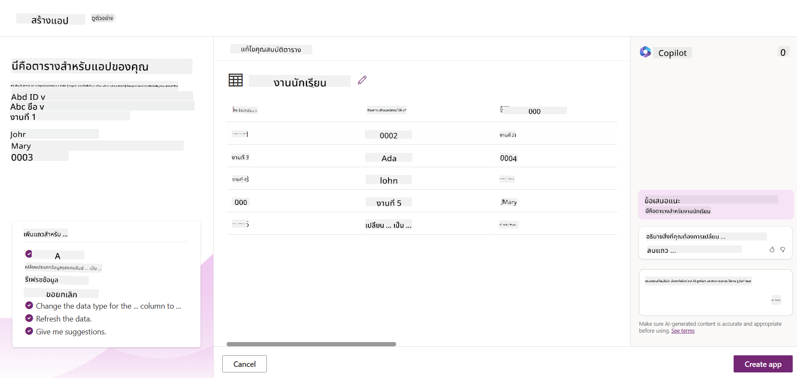
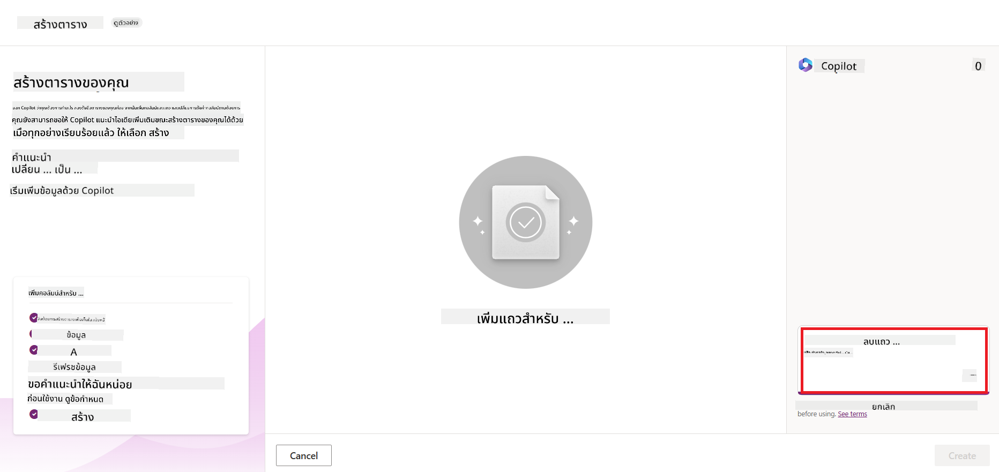
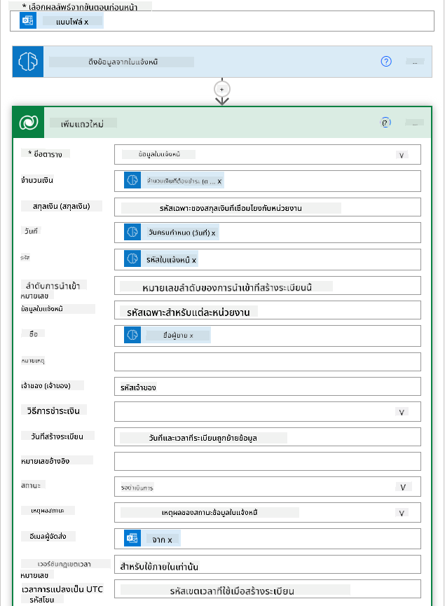
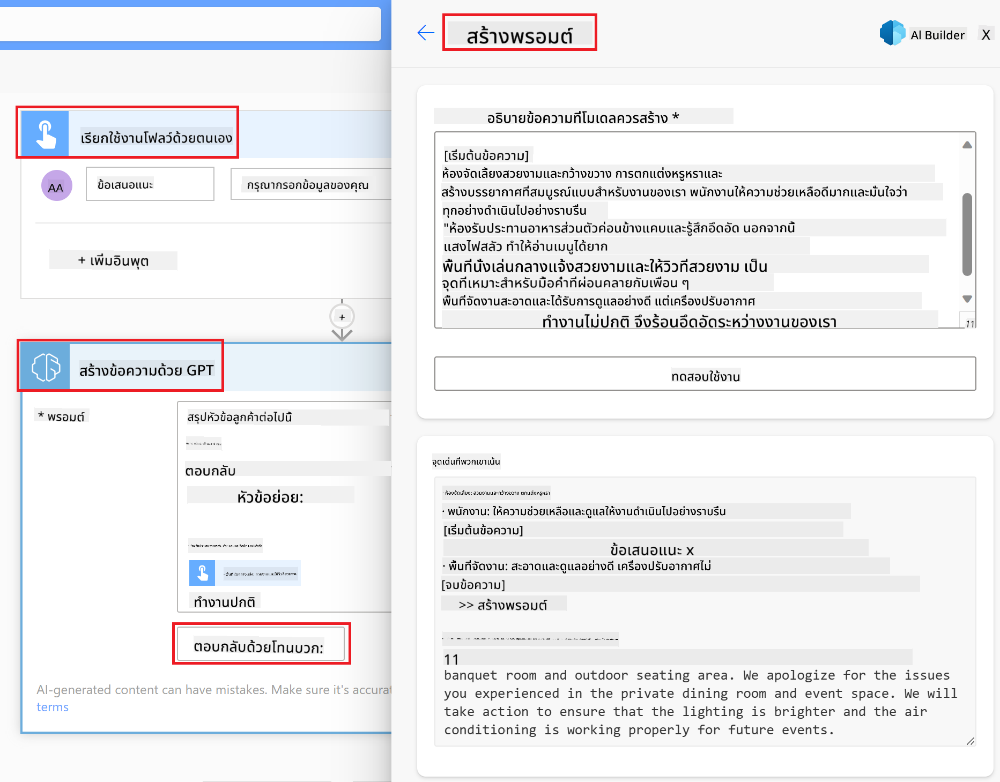

<!--
CO_OP_TRANSLATOR_METADATA:
{
  "original_hash": "846ac8e3b7dcfb697d3309fec05f0fea",
  "translation_date": "2025-10-17T18:38:31+00:00",
  "source_file": "10-building-low-code-ai-applications/README.md",
  "language_code": "th"
}
-->
# การสร้างแอปพลิเคชัน AI แบบ Low Code

> _(คลิกที่ภาพด้านบนเพื่อดูวิดีโอของบทเรียนนี้)_

## บทนำ

ตอนนี้เราได้เรียนรู้วิธีการสร้างแอปพลิเคชันที่สร้างภาพแล้ว มาพูดถึงเรื่อง Low Code กันบ้าง Generative AI สามารถนำไปใช้ในหลายๆ ด้าน รวมถึง Low Code แต่ Low Code คืออะไร และเราจะเพิ่ม AI เข้าไปในนั้นได้อย่างไร?

การสร้างแอปและโซลูชันกลายเป็นเรื่องง่ายขึ้นสำหรับนักพัฒนาทั่วไปและผู้ที่ไม่ใช่นักพัฒนาผ่านการใช้แพลตฟอร์มการพัฒนาแบบ Low Code แพลตฟอร์มเหล่านี้ช่วยให้คุณสร้างแอปและโซลูชันด้วยการเขียนโค้ดเพียงเล็กน้อยหรือไม่ต้องเขียนเลย โดยใช้สภาพแวดล้อมการพัฒนาแบบภาพที่ช่วยให้คุณลากและวางองค์ประกอบเพื่อสร้างแอปและโซลูชัน ซึ่งช่วยให้คุณสร้างแอปและโซลูชันได้เร็วขึ้นและใช้ทรัพยากรน้อยลง ในบทเรียนนี้ เราจะเจาะลึกถึงวิธีการใช้ Low Code และวิธีการเพิ่มประสิทธิภาพการพัฒนาแบบ Low Code ด้วย AI โดยใช้ Power Platform

Power Platform มอบโอกาสให้กับองค์กรในการเสริมสร้างทีมของพวกเขาให้สามารถสร้างโซลูชันของตัวเองผ่านสภาพแวดล้อมแบบ Low Code หรือ No Code ที่ใช้งานง่าย สภาพแวดล้อมนี้ช่วยลดความซับซ้อนของกระบวนการสร้างโซลูชัน ด้วย Power Platform โซลูชันสามารถสร้างได้ในเวลาเพียงไม่กี่วันหรือไม่กี่สัปดาห์แทนที่จะใช้เวลาหลายเดือนหรือหลายปี Power Platform ประกอบด้วยผลิตภัณฑ์หลัก 5 รายการ ได้แก่ Power Apps, Power Automate, Power BI, Power Pages และ Copilot Studio

บทเรียนนี้ครอบคลุม:

- การแนะนำ Generative AI ใน Power Platform
- การแนะนำ Copilot และวิธีการใช้งาน
- การใช้ Generative AI เพื่อสร้างแอปและโฟลว์ใน Power Platform
- การทำความเข้าใจโมเดล AI ใน Power Platform ด้วย AI Builder

## เป้าหมายการเรียนรู้

เมื่อจบบทเรียนนี้ คุณจะสามารถ:

- เข้าใจวิธีการทำงานของ Copilot ใน Power Platform

- สร้างแอปติดตามงานมอบหมายของนักเรียนสำหรับสตาร์ทอัพด้านการศึกษา

- สร้างโฟลว์การประมวลผลใบแจ้งหนี้ที่ใช้ AI เพื่อดึงข้อมูลจากใบแจ้งหนี้

- ใช้แนวทางปฏิบัติที่ดีที่สุดเมื่อใช้โมเดล AI Create Text with GPT

เครื่องมือและเทคโนโลยีที่คุณจะใช้ในบทเรียนนี้ ได้แก่:

- **Power Apps** สำหรับแอปติดตามงานมอบหมายของนักเรียน ซึ่งให้สภาพแวดล้อมการพัฒนาแบบ Low Code สำหรับการสร้างแอปเพื่อการติดตาม จัดการ และโต้ตอบกับข้อมูล

- **Dataverse** สำหรับการจัดเก็บข้อมูลของแอปติดตามงานมอบหมายของนักเรียน โดย Dataverse จะให้แพลตฟอร์มข้อมูลแบบ Low Code สำหรับการจัดเก็บข้อมูลของแอป

- **Power Automate** สำหรับโฟลว์การประมวลผลใบแจ้งหนี้ ซึ่งคุณจะมีสภาพแวดล้อมการพัฒนาแบบ Low Code สำหรับการสร้างเวิร์กโฟลว์เพื่อทำให้กระบวนการประมวลผลใบแจ้งหนี้เป็นอัตโนมัติ

- **AI Builder** สำหรับโมเดล AI การประมวลผลใบแจ้งหนี้ ซึ่งคุณจะใช้โมเดล AI ที่สร้างไว้ล่วงหน้าเพื่อประมวลผลใบแจ้งหนี้สำหรับสตาร์ทอัพของเรา

## Generative AI ใน Power Platform

การเพิ่มประสิทธิภาพการพัฒนาแบบ Low Code และแอปพลิเคชันด้วย Generative AI เป็นจุดสำคัญสำหรับ Power Platform เป้าหมายคือการทำให้ทุกคนสามารถสร้างแอปที่มี AI, เว็บไซต์, แดชบอร์ด และกระบวนการอัตโนมัติด้วย AI _โดยไม่จำเป็นต้องมีความเชี่ยวชาญด้านวิทยาศาสตร์ข้อมูล_ เป้าหมายนี้สำเร็จได้โดยการรวม Generative AI เข้ากับประสบการณ์การพัฒนาแบบ Low Code ใน Power Platform ในรูปแบบของ Copilot และ AI Builder

### มันทำงานอย่างไร?

Copilot เป็นผู้ช่วย AI ที่ช่วยให้คุณสร้างโซลูชัน Power Platform โดยการอธิบายความต้องการของคุณในขั้นตอนการสนทนาโดยใช้ภาษาธรรมชาติ ตัวอย่างเช่น คุณสามารถสั่งให้ผู้ช่วย AI ระบุว่าต้องการใช้ฟิลด์ใดในแอปของคุณ และมันจะสร้างทั้งแอปและโมเดลข้อมูลพื้นฐาน หรือคุณสามารถระบุวิธีการตั้งค่าโฟลว์ใน Power Automate

คุณสามารถใช้ฟังก์ชันที่ขับเคลื่อนด้วย Copilot เป็นฟีเจอร์ในหน้าจอแอปของคุณเพื่อช่วยให้ผู้ใช้ค้นพบข้อมูลเชิงลึกผ่านการโต้ตอบแบบสนทนา

AI Builder เป็นความสามารถ AI แบบ Low Code ที่มีอยู่ใน Power Platform ซึ่งช่วยให้คุณใช้โมเดล AI เพื่อช่วยทำให้กระบวนการเป็นอัตโนมัติและคาดการณ์ผลลัพธ์ ด้วย AI Builder คุณสามารถนำ AI มาใช้ในแอปและโฟลว์ที่เชื่อมต่อกับข้อมูลของคุณใน Dataverse หรือในแหล่งข้อมูลคลาวด์ต่างๆ เช่น SharePoint, OneDrive หรือ Azure

Copilot มีอยู่ในผลิตภัณฑ์ทั้งหมดของ Power Platform ได้แก่ Power Apps, Power Automate, Power BI, Power Pages และ Power Virtual Agents ส่วน AI Builder มีอยู่ใน Power Apps และ Power Automate ในบทเรียนนี้ เราจะเน้นที่วิธีการใช้ Copilot และ AI Builder ใน Power Apps และ Power Automate เพื่อสร้างโซลูชันสำหรับสตาร์ทอัพด้านการศึกษาของเรา

### Copilot ใน Power Apps

ในฐานะส่วนหนึ่งของ Power Platform, Power Apps ให้สภาพแวดล้อมการพัฒนาแบบ Low Code สำหรับการสร้างแอปเพื่อการติดตาม จัดการ และโต้ตอบกับข้อมูล เป็นชุดบริการพัฒนาแอปที่มีแพลตฟอร์มข้อมูลที่สามารถขยายได้และความสามารถในการเชื่อมต่อกับบริการคลาวด์และข้อมูลในองค์กร Power Apps ช่วยให้คุณสร้างแอปที่ทำงานบนเบราว์เซอร์ แท็บเล็ต และโทรศัพท์ และสามารถแชร์กับเพื่อนร่วมงานได้ Power Apps ช่วยให้ผู้ใช้เข้าสู่การพัฒนาแอปด้วยอินเทอร์เฟซที่เรียบง่าย เพื่อให้ผู้ใช้ธุรกิจทุกคนหรือผู้พัฒนามืออาชีพสามารถสร้างแอปที่กำหนดเองได้ ประสบการณ์การพัฒนาแอปยังได้รับการปรับปรุงด้วย Generative AI ผ่าน Copilot

ฟีเจอร์ผู้ช่วย AI Copilot ใน Power Apps ช่วยให้คุณอธิบายว่าแอปที่คุณต้องการควรมีลักษณะอย่างไร และข้อมูลใดที่คุณต้องการให้แอปติดตาม รวบรวม หรือแสดง Copilot จะสร้างแอป Canvas ที่ตอบสนองตามคำอธิบายของคุณ จากนั้นคุณสามารถปรับแต่งแอปให้ตรงกับความต้องการของคุณได้ ผู้ช่วย AI Copilot ยังสร้างและแนะนำตาราง Dataverse พร้อมฟิลด์ที่คุณต้องการเพื่อจัดเก็บข้อมูลที่คุณต้องการติดตามและตัวอย่างข้อมูลบางส่วน เราจะดูว่า Dataverse คืออะไรและวิธีการใช้ใน Power Apps ในบทเรียนนี้ในภายหลัง จากนั้นคุณสามารถปรับแต่งตารางให้ตรงกับความต้องการของคุณโดยใช้ฟีเจอร์ผู้ช่วย AI Copilot ผ่านขั้นตอนการสนทนา ฟีเจอร์นี้พร้อมใช้งานได้จากหน้าจอหลักของ Power Apps

### Copilot ใน Power Automate

ในฐานะส่วนหนึ่งของ Power Platform, Power Automate ช่วยให้ผู้ใช้สร้างเวิร์กโฟลว์อัตโนมัติระหว่างแอปพลิเคชันและบริการ มันช่วยทำให้กระบวนการธุรกิจที่ซ้ำซาก เช่น การสื่อสาร การรวบรวมข้อมูล และการอนุมัติการตัดสินใจเป็นอัตโนมัติ อินเทอร์เฟซที่เรียบง่ายช่วยให้ผู้ใช้ทุกระดับความสามารถทางเทคนิค (ตั้งแต่ผู้เริ่มต้นจนถึงนักพัฒนาที่มีประสบการณ์) สามารถทำงานอัตโนมัติได้ ประสบการณ์การพัฒนาเวิร์กโฟลว์ยังได้รับการปรับปรุงด้วย Generative AI ผ่าน Copilot

ฟีเจอร์ผู้ช่วย AI Copilot ใน Power Automate ช่วยให้คุณอธิบายว่าโฟลว์ที่คุณต้องการควรมีลักษณะอย่างไร และการดำเนินการใดที่คุณต้องการให้โฟลว์ของคุณทำ Copilot จะสร้างโฟลว์ตามคำอธิบายของคุณ จากนั้นคุณสามารถปรับแต่งโฟลว์ให้ตรงกับความต้องการของคุณได้ ผู้ช่วย AI Copilot ยังสร้างและแนะนำการดำเนินการที่คุณต้องการเพื่อทำงานที่คุณต้องการทำให้เป็นอัตโนมัติ เราจะดูว่าโฟลว์คืออะไรและวิธีการใช้ใน Power Automate ในบทเรียนนี้ในภายหลัง จากนั้นคุณสามารถปรับแต่งการดำเนินการให้ตรงกับความต้องการของคุณโดยใช้ฟีเจอร์ผู้ช่วย AI Copilot ผ่านขั้นตอนการสนทนา ฟีเจอร์นี้พร้อมใช้งานได้จากหน้าจอหลักของ Power Automate

## งาน: จัดการงานมอบหมายของนักเรียนและใบแจ้งหนี้สำหรับสตาร์ทอัพของเราโดยใช้ Copilot

สตาร์ทอัพของเรามีการให้บริการคอร์สออนไลน์แก่นักเรียน สตาร์ทอัพเติบโตอย่างรวดเร็วและตอนนี้กำลังประสบปัญหาในการตอบสนองความต้องการของคอร์ส สตาร์ทอัพได้จ้างคุณเป็นนักพัฒนา Power Platform เพื่อช่วยสร้างโซลูชันแบบ Low Code เพื่อช่วยจัดการงานมอบหมายของนักเรียนและใบแจ้งหนี้ โซลูชันของพวกเขาควรสามารถช่วยติดตามและจัดการงานมอบหมายของนักเรียนผ่านแอป และทำให้กระบวนการประมวลผลใบแจ้งหนี้เป็นอัตโนมัติผ่านเวิร์กโฟลว์ คุณได้รับมอบหมายให้ใช้ Generative AI เพื่อพัฒนาโซลูชันนี้

เมื่อคุณเริ่มต้นใช้งาน Copilot คุณสามารถใช้ [Power Platform Copilot Prompt Library](https://github.com/pnp/powerplatform-prompts?WT.mc_id=academic-109639-somelezediko) เพื่อเริ่มต้นใช้งานไลบรารีนี้มีรายการคำสั่งที่คุณสามารถใช้เพื่อสร้างแอปและโฟลว์ด้วย Copilot คุณยังสามารถใช้คำสั่งในไลบรารีเพื่อดูตัวอย่างวิธีการอธิบายความต้องการของคุณให้ Copilot

### สร้างแอปติดตามงานมอบหมายของนักเรียนสำหรับสตาร์ทอัพของเรา

ครูในสตาร์ทอัพของเรากำลังประสบปัญหาในการติดตามงานมอบหมายของนักเรียน พวกเขาใช้สเปรดชีตในการติดตามงานมอบหมาย แต่การจัดการเริ่มยากขึ้นเมื่อจำนวนนักเรียนเพิ่มขึ้น พวกเขาได้ขอให้คุณสร้างแอปที่ช่วยติดตามและจัดการงานมอบหมายของนักเรียน แอปควรช่วยให้พวกเขาเพิ่มงานมอบหมายใหม่ ดูงานมอบหมาย อัปเดตงานมอบหมาย และลบงานมอบหมาย แอปควรช่วยให้ครูและนักเรียนสามารถดูงานมอบหมายที่ได้รับการตรวจแล้วและยังไม่ได้รับการตรวจ

คุณจะสร้างแอปโดยใช้ Copilot ใน Power Apps ตามขั้นตอนด้านล่าง:

1. ไปที่หน้าจอหลักของ [Power Apps](https://make.powerapps.com?WT.mc_id=academic-105485-koreyst)

1. ใช้พื้นที่ข้อความบนหน้าจอหลักเพื่ออธิบายแอปที่คุณต้องการสร้าง ตัวอย่างเช่น **_ฉันต้องการสร้างแอปเพื่อการติดตามและจัดการงานมอบหมายของนักเรียน_** คลิกที่ปุ่ม **Send** เพื่อส่งคำสั่งไปยัง AI Copilot

1. AI Copilot จะเสนอแนะตาราง Dataverse พร้อมฟิลด์ที่คุณต้องการเพื่อจัดเก็บข้อมูลที่คุณต้องการติดตามและตัวอย่างข้อมูลบางส่วน จากนั้นคุณสามารถปรับแต่งตารางให้ตรงกับความต้องการของคุณโดยใช้ฟีเจอร์ผู้ช่วย AI Copilot ผ่านขั้นตอนการสนทนา

   > **สำคัญ**: Dataverse เป็นแพลตฟอร์มข้อมูลพื้นฐานสำหรับ Power Platform เป็นแพลตฟอร์มข้อมูลแบบ Low Code สำหรับการจัดเก็บข้อมูลของแอป เป็นบริการที่มีการจัดการอย่างสมบูรณ์ที่จัดเก็บข้อมูลอย่างปลอดภัยใน Microsoft Cloud และถูกจัดเตรียมไว้ในสภาพแวดล้อม Power Platform ของคุณ มันมาพร้อมกับความสามารถในการกำกับดูแลข้อมูลในตัว เช่น การจำแนกประเภทข้อมูล การติดตามข้อมูล การควบคุมการเข้าถึงที่ละเอียด และอื่นๆ คุณสามารถเรียนรู้เพิ่มเติมเกี่ยวกับ Dataverse [ที่นี่](https://docs.microsoft.com/powerapps/maker/data-platform/data-platform-intro?WT.mc_id=academic-109639-somelezediko)

   

1. ครูต้องการส่งอีเมลถึงนักเรียนที่ส่งงานมอบหมายเพื่ออัปเดตความคืบหน้าของงานมอบหมาย คุณสามารถใช้ Copilot เพื่อเพิ่มฟิลด์ใหม่ในตารางเพื่อจัดเก็บอีเมลของนักเรียน ตัวอย่างเช่น คุณสามารถใช้คำสั่งต่อไปนี้เพื่อเพิ่มฟิลด์ใหม่ในตาราง: **_ฉันต้องการเพิ่มคอลัมน์เพื่อจัดเก็บอีเมลของนักเรียน_** คลิกที่ปุ่ม **Send** เพื่อส่งคำสั่งไปยัง AI Copilot

1. AI Copilot จะสร้างฟิลด์ใหม่และคุณสามารถปรับแต่งฟิลด์ให้ตรงกับความต้องการของคุณ

1. เมื่อคุณทำตารางเสร็จแล้ว คลิกที่ปุ่ม **Create app** เพื่อสร้างแอป

1. AI Copilot จะสร้างแอป Canvas ที่ตอบสนองตามคำอธิบายของคุณ จากนั้นคุณสามารถปรับแต่งแอปให้ตรงกับความต้องการของคุณ

1. สำหรับครูที่จะส่งอีเมลถึงนักเรียน คุณสามารถใช้ Copilot เพื่อเพิ่มหน้าจอใหม่ในแอป ตัวอย่างเช่น คุณสามารถใช้คำสั่งต่อไปนี้เพื่อเพิ่มหน้าจอใหม่ในแอป: **_ฉันต้องการเพิ่มหน้าจอเพื่อส่งอีเมลถึงนักเรียน_** คลิกที่ปุ่ม **Send** เพื่อส่งคำสั่งไปยัง AI Copilot

1. AI Copilot จะสร้างหน้าจอใหม่และคุณสามารถปรับแต่งหน้าจอให้ตรงกับความต้องการของคุณ

1. เมื่อคุณทำแอปเสร็จแล้ว คลิกที่ปุ่ม **Save** เพื่อบันทึกแอป

1. เพื่อแชร์แอปกับครู คลิกที่ปุ่ม **Share** และคลิกที่ปุ่ม **Share** อีกครั้ง จากนั้นคุณสามารถแชร์แอปกับครูโดยการป้อนที่อยู่อีเมลของพวกเขา

> **การบ้านของคุณ**: แอปที่คุณเพิ่งสร้างขึ้นเป็นจุดเริ่มต้นที่ดี แต่สามารถปรับปรุงได้ ด้วยฟีเจอร์อีเมล ครูสามารถส่งอีเมลถึงนักเรียนได้เฉพาะแบบแมนนวลโดยต้องพิมพ์อีเมลของพวกเขา คุณสามารถใช้ Copilot เพื่อสร้างระบบอัตโนมัติที่ช่วยให้ครูส่งอีเมลถึงนักเรียนโดยอัตโนมัติเมื่อพวกเขาส่งงานมอบหมายได้หรือไม่? คำแนะนำของคุณคือด้วยคำสั่งที่เหมาะสม คุณสามารถใช้ Copilot ใน Power Automate เพื่อสร้างสิ่งนี้ได้

### สร้างตารางข้อมูลใบแจ้งหนี้สำหรับสตาร์ทอัพของเรา

ทีมการเงินของสตาร์ทอัพของเรากำลังประสบปัญหาในการติดตามใบแจ้งหนี้ พวกเขาใช้สเปรดชีตในการติดตามใบแจ้งหนี้ แต่การจัดการเริ่มยากขึ้นเมื่อจำนวนใบแจ้งหนี้เพิ่มขึ้น พวกเขาได้ขอให้คุณสร้างตารางที่จะช่วยให้พวกเขาจัดเก็บ ติดตาม และจัดการข้อมูลของใบแจ้งหนี้ที่ได้รับ ตารางนี้ควรใช้เพื่อสร้างระบบอัตโนมัติที่จะดึงข้อมูลใบแจ้งหนี้ทั้งหมดและจัดเก็บไว้ในตาราง ตารางนี้ควรช่วยให้ทีมการเงินสามารถดูใบแจ้งหนี้ที่ชำระแล้วและยังไม่ได้ชำระ

Power Platform มีแพลตฟอร์มข้อมูลพื้นฐานที่เรียกว่า Dataverse ซึ่งช่วยให้คุณจัดเก็บข้อมูลสำหรับแอปและโซลูชันของคุณ Dataverse ให้แพลตฟ
ทำไมเราควรใช้ Dataverse สำหรับธุรกิจสตาร์ทอัพของเรา? ตารางมาตรฐานและตารางที่ปรับแต่งได้ใน Dataverse ให้ตัวเลือกการจัดเก็บข้อมูลที่ปลอดภัยและอยู่บนคลาวด์ ตารางช่วยให้คุณจัดเก็บข้อมูลประเภทต่าง ๆ คล้ายกับการใช้แผ่นงานหลายแผ่นในไฟล์ Excel เดียว คุณสามารถใช้ตารางเพื่อจัดเก็บข้อมูลที่เฉพาะเจาะจงต่อองค์กรหรือความต้องการทางธุรกิจของคุณ ข้อดีบางประการที่ธุรกิจสตาร์ทอัพของเราจะได้รับจากการใช้ Dataverse ได้แก่:

- **จัดการง่าย**: ทั้งข้อมูลเมตาและข้อมูลถูกจัดเก็บในคลาวด์ คุณจึงไม่ต้องกังวลเกี่ยวกับรายละเอียดของการจัดเก็บหรือการจัดการ คุณสามารถมุ่งเน้นไปที่การสร้างแอปและโซลูชันของคุณได้

- **ปลอดภัย**: Dataverse ให้ตัวเลือกการจัดเก็บข้อมูลที่ปลอดภัยและอยู่บนคลาวด์ คุณสามารถควบคุมว่าใครสามารถเข้าถึงข้อมูลในตารางของคุณและวิธีการเข้าถึงโดยใช้การรักษาความปลอดภัยตามบทบาท

- **ข้อมูลเมตาที่หลากหลาย**: ประเภทข้อมูลและความสัมพันธ์ถูกใช้งานโดยตรงใน Power Apps

- **ตรรกะและการตรวจสอบ**: คุณสามารถใช้กฎทางธุรกิจ ฟิลด์ที่คำนวณได้ และกฎการตรวจสอบเพื่อบังคับใช้ตรรกะทางธุรกิจและรักษาความถูกต้องของข้อมูล

เมื่อคุณทราบแล้วว่า Dataverse คืออะไรและทำไมคุณควรใช้มัน ลองมาดูวิธีการใช้ Copilot เพื่อสร้างตารางใน Dataverse เพื่อตอบสนองความต้องการของทีมการเงินของเรา

> **Note**: คุณจะใช้ตารางนี้ในส่วนถัดไปเพื่อสร้างระบบอัตโนมัติที่ดึงข้อมูลใบแจ้งหนี้ทั้งหมดและจัดเก็บไว้ในตาราง

ในการสร้างตารางใน Dataverse โดยใช้ Copilot ให้ทำตามขั้นตอนด้านล่าง:

1. ไปที่หน้าหลักของ [Power Apps](https://make.powerapps.com?WT.mc_id=academic-105485-koreyst)

2. ในแถบนำทางด้านซ้าย เลือก **Tables** แล้วคลิก **Describe the new Table**

3. ในหน้าจอ **Describe the new Table** ใช้พื้นที่ข้อความเพื่ออธิบายตารางที่คุณต้องการสร้าง เช่น **_ฉันต้องการสร้างตารางเพื่อจัดเก็บข้อมูลใบแจ้งหนี้_** คลิกปุ่ม **Send** เพื่อส่งคำสั่งไปยัง AI Copilot

4. AI Copilot จะเสนอแนะตาราง Dataverse พร้อมฟิลด์ที่คุณต้องการเพื่อจัดเก็บข้อมูลที่คุณต้องการติดตาม และตัวอย่างข้อมูลบางส่วน คุณสามารถปรับแต่งตารางให้ตรงกับความต้องการของคุณโดยใช้ฟีเจอร์ผู้ช่วย AI Copilot ผ่านขั้นตอนการสนทนา

5. ทีมการเงินต้องการส่งอีเมลไปยังผู้จัดจำหน่ายเพื่ออัปเดตสถานะปัจจุบันของใบแจ้งหนี้ คุณสามารถใช้ Copilot เพื่อเพิ่มฟิลด์ใหม่ในตารางเพื่อจัดเก็บอีเมลของผู้จัดจำหน่าย เช่น คุณสามารถใช้คำสั่งต่อไปนี้เพื่อเพิ่มฟิลด์ใหม่ในตาราง: **_ฉันต้องการเพิ่มคอลัมน์เพื่อจัดเก็บอีเมลของผู้จัดจำหน่าย_** คลิกปุ่ม **Send** เพื่อส่งคำสั่งไปยัง AI Copilot

6. AI Copilot จะสร้างฟิลด์ใหม่ และคุณสามารถปรับแต่งฟิลด์ให้ตรงกับความต้องการของคุณ

7. เมื่อคุณเสร็จสิ้นการปรับแต่งตารางแล้ว คลิกปุ่ม **Create** เพื่อสร้างตาราง

## โมเดล AI ใน Power Platform กับ AI Builder

AI Builder เป็นความสามารถ AI แบบ low-code ที่มีอยู่ใน Power Platform ซึ่งช่วยให้คุณใช้โมเดล AI เพื่อช่วยคุณในการทำงานอัตโนมัติและคาดการณ์ผลลัพธ์ ด้วย AI Builder คุณสามารถนำ AI เข้าสู่แอปและโฟลว์ที่เชื่อมต่อกับข้อมูลใน Dataverse หรือแหล่งข้อมูลคลาวด์ต่าง ๆ เช่น SharePoint, OneDrive หรือ Azure

## โมเดล AI ที่สร้างไว้ล่วงหน้ากับโมเดล AI ที่ปรับแต่งเอง

AI Builder มีโมเดล AI สองประเภท: โมเดล AI ที่สร้างไว้ล่วงหน้าและโมเดล AI ที่ปรับแต่งเอง โมเดล AI ที่สร้างไว้ล่วงหน้าเป็นโมเดล AI ที่พร้อมใช้งานซึ่งได้รับการฝึกฝนโดย Microsoft และมีอยู่ใน Power Platform สิ่งนี้ช่วยให้คุณเพิ่มความฉลาดให้กับแอปและโฟลว์ของคุณโดยไม่ต้องรวบรวมข้อมูลและสร้าง ฝึกฝน และเผยแพร่โมเดลของคุณเอง คุณสามารถใช้โมเดลเหล่านี้เพื่อทำงานอัตโนมัติและคาดการณ์ผลลัพธ์

โมเดล AI ที่สร้างไว้ล่วงหน้าบางส่วนที่มีอยู่ใน Power Platform ได้แก่:

- **การดึงคำสำคัญ**: โมเดลนี้ดึงคำสำคัญจากข้อความ
- **การตรวจจับภาษา**: โมเดลนี้ตรวจจับภาษาของข้อความ
- **การวิเคราะห์ความรู้สึก**: โมเดลนี้ตรวจจับความรู้สึกเชิงบวก เชิงลบ เป็นกลาง หรือผสมในข้อความ
- **เครื่องอ่านนามบัตร**: โมเดลนี้ดึงข้อมูลจากนามบัตร
- **การรู้จำข้อความ**: โมเดลนี้ดึงข้อความจากภาพ
- **การตรวจจับวัตถุ**: โมเดลนี้ตรวจจับและดึงวัตถุจากภาพ
- **การประมวลผลเอกสาร**: โมเดลนี้ดึงข้อมูลจากแบบฟอร์ม
- **การประมวลผลใบแจ้งหนี้**: โมเดลนี้ดึงข้อมูลจากใบแจ้งหนี้

ด้วยโมเดล AI ที่ปรับแต่งเอง คุณสามารถนำโมเดลของคุณเองเข้าสู่ AI Builder เพื่อให้มันทำงานเหมือนโมเดล AI Builder ที่ปรับแต่งเอง ช่วยให้คุณฝึกฝนโมเดลโดยใช้ข้อมูลของคุณเอง คุณสามารถใช้โมเดลเหล่านี้เพื่อทำงานอัตโนมัติและคาดการณ์ผลลัพธ์ในทั้ง Power Apps และ Power Automate เมื่อใช้โมเดลของคุณเองจะมีข้อจำกัดที่ใช้ อ่านเพิ่มเติมเกี่ยวกับ [ข้อจำกัด](https://learn.microsoft.com/ai-builder/byo-model#limitations?WT.mc_id=academic-105485-koreyst)

## งานที่ 2 - สร้างโฟลว์การประมวลผลใบแจ้งหนี้สำหรับธุรกิจสตาร์ทอัพของเรา

ทีมการเงินกำลังประสบปัญหาในการประมวลผลใบแจ้งหนี้ พวกเขาใช้สเปรดชีตในการติดตามใบแจ้งหนี้ แต่สิ่งนี้กลายเป็นเรื่องยากที่จะจัดการเมื่อจำนวนใบแจ้งหนี้เพิ่มขึ้น พวกเขาขอให้คุณสร้างโฟลว์ที่จะช่วยพวกเขาประมวลผลใบแจ้งหนี้โดยใช้ AI โฟลว์นี้ควรช่วยให้พวกเขาดึงข้อมูลจากใบแจ้งหนี้และจัดเก็บข้อมูลในตาราง Dataverse โฟลว์นี้ควรช่วยให้พวกเขาส่งอีเมลไปยังทีมการเงินพร้อมข้อมูลที่ดึงมา

เมื่อคุณทราบแล้วว่า AI Builder คืออะไรและทำไมคุณควรใช้มัน ลองมาดูวิธีการใช้โมเดล AI การประมวลผลใบแจ้งหนี้ใน AI Builder ซึ่งเราได้กล่าวถึงก่อนหน้านี้ เพื่อสร้างโฟลว์ที่จะช่วยทีมการเงินประมวลผลใบแจ้งหนี้

ในการสร้างโฟลว์ที่จะช่วยทีมการเงินประมวลผลใบแจ้งหนี้โดยใช้โมเดล AI การประมวลผลใบแจ้งหนี้ใน AI Builder ให้ทำตามขั้นตอนด้านล่าง:

1. ไปที่หน้าหลักของ [Power Automate](https://make.powerautomate.com?WT.mc_id=academic-105485-koreyst)

2. ใช้พื้นที่ข้อความในหน้าหลักเพื่ออธิบายโฟลว์ที่คุณต้องการสร้าง เช่น **_ประมวลผลใบแจ้งหนี้เมื่อมันมาถึงในกล่องจดหมายของฉัน_** คลิกปุ่ม **Send** เพื่อส่งคำสั่งไปยัง AI Copilot

   

3. AI Copilot จะเสนอแนะการดำเนินการที่คุณต้องการเพื่อทำงานที่คุณต้องการทำให้เป็นอัตโนมัติ คุณสามารถคลิกปุ่ม **Next** เพื่อดำเนินการในขั้นตอนถัดไป

4. ในขั้นตอนถัดไป Power Automate จะขอให้คุณตั้งค่าการเชื่อมต่อที่จำเป็นสำหรับโฟลว์ เมื่อคุณเสร็จสิ้น คลิกปุ่ม **Create flow** เพื่อสร้างโฟลว์

5. AI Copilot จะสร้างโฟลว์ และคุณสามารถปรับแต่งโฟลว์ให้ตรงกับความต้องการของคุณ

6. อัปเดตตัวกระตุ้นของโฟลว์และตั้งค่า **Folder** ไปยังโฟลเดอร์ที่ใบแจ้งหนี้จะถูกจัดเก็บ เช่น คุณสามารถตั้งค่าโฟลเดอร์เป็น **Inbox** คลิก **Show advanced options** และตั้งค่า **Only with Attachments** เป็น **Yes** สิ่งนี้จะทำให้โฟลว์ทำงานเฉพาะเมื่ออีเมลที่มีไฟล์แนบถูกส่งไปยังโฟลเดอร์

7. ลบการดำเนินการต่อไปนี้ออกจากโฟลว์: **HTML to text**, **Compose**, **Compose 2**, **Compose 3** และ **Compose 4** เพราะคุณจะไม่ใช้มัน

8. ลบการดำเนินการ **Condition** ออกจากโฟลว์เพราะคุณจะไม่ใช้มัน โฟลว์ควรมีลักษณะดังภาพด้านล่าง:

   

9. คลิกปุ่ม **Add an action** และค้นหา **Dataverse** เลือกการดำเนินการ **Add a new row**

10. ในการดำเนินการ **Extract Information from invoices** อัปเดต **Invoice File** ให้ชี้ไปที่ **Attachment Content** จากอีเมล สิ่งนี้จะทำให้โฟลว์ดึงข้อมูลจากไฟล์แนบใบแจ้งหนี้

11. เลือก **Table** ที่คุณสร้างไว้ก่อนหน้านี้ เช่น คุณสามารถเลือกตาราง **Invoice Information** เลือกเนื้อหาไดนามิกจากการดำเนินการก่อนหน้าเพื่อเติมฟิลด์ต่อไปนี้:

    - ID
    - Amount
    - Date
    - Name
    - Status - ตั้งค่า **Status** เป็น **Pending**
    - Supplier Email - ใช้เนื้อหาไดนามิก **From** จากตัวกระตุ้น **When a new email arrives**

    

12. เมื่อคุณเสร็จสิ้นโฟลว์ คลิกปุ่ม **Save** เพื่อบันทึกโฟลว์ คุณสามารถทดสอบโฟลว์โดยการส่งอีเมลที่มีใบแจ้งหนี้ไปยังโฟลเดอร์ที่คุณระบุในตัวกระตุ้น

> **การบ้านของคุณ**: โฟลว์ที่คุณสร้างขึ้นเป็นจุดเริ่มต้นที่ดี ตอนนี้คุณต้องคิดว่าจะสร้างระบบอัตโนมัติที่ช่วยให้ทีมการเงินของเราส่งอีเมลไปยังผู้จัดจำหน่ายเพื่ออัปเดตสถานะปัจจุบันของใบแจ้งหนี้ได้อย่างไร คำใบ้ของคุณ: โฟลว์ต้องทำงานเมื่อสถานะของใบแจ้งหนี้เปลี่ยนแปลง

## ใช้โมเดล AI สร้างข้อความใน Power Automate

โมเดล AI Create Text with GPT ใน AI Builder ช่วยให้คุณสร้างข้อความตามคำสั่ง และขับเคลื่อนโดย Microsoft Azure OpenAI Service ด้วยความสามารถนี้ คุณสามารถรวมเทคโนโลยี GPT (Generative Pre-Trained Transformer) เข้ากับแอปและโฟลว์ของคุณเพื่อสร้างโฟลว์อัตโนมัติและแอปพลิเคชันที่มีข้อมูลเชิงลึกหลากหลาย

โมเดล GPT ผ่านการฝึกฝนอย่างเข้มข้นด้วยข้อมูลจำนวนมหาศาล ทำให้สามารถสร้างข้อความที่คล้ายคลึงกับภาษามนุษย์เมื่อได้รับคำสั่ง เมื่อรวมกับการทำงานอัตโนมัติของโฟลว์ โมเดล AI เช่น GPT สามารถนำมาใช้เพื่อปรับปรุงและทำงานอัตโนมัติในหลากหลายงาน

ตัวอย่างเช่น คุณสามารถสร้างโฟลว์เพื่อสร้างข้อความอัตโนมัติสำหรับการใช้งานต่าง ๆ เช่น ร่างอีเมล คำอธิบายผลิตภัณฑ์ และอื่น ๆ คุณยังสามารถใช้โมเดลเพื่อสร้างข้อความสำหรับแอปต่าง ๆ เช่น แชทบอทและแอปบริการลูกค้าที่ช่วยให้ตัวแทนบริการลูกค้าตอบสนองต่อคำถามของลูกค้าได้อย่างมีประสิทธิภาพ

เรียนรู้วิธีใช้โมเดล AI นี้ใน Power Automate โดยไปที่โมดูล [Add intelligence with AI Builder and GPT](https://learn.microsoft.com/training/modules/ai-builder-text-generation/?WT.mc_id=academic-109639-somelezediko)

## ทำได้ดีมาก! เรียนรู้เพิ่มเติมต่อไป

หลังจากจบบทเรียนนี้ ลองดู [Generative AI Learning collection](https://aka.ms/genai-collection?WT.mc_id=academic-105485-koreyst) เพื่อเพิ่มพูนความรู้เกี่ยวกับ Generative AI ของคุณ!

ไปที่บทเรียนที่ 11 ซึ่งเราจะดูวิธี [รวม Generative AI กับ Function Calling](../11-integrating-with-function-calling/README.md?WT.mc_id=academic-105485-koreyst)!

---

**ข้อจำกัดความรับผิดชอบ**:  
เอกสารนี้ได้รับการแปลโดยใช้บริการแปลภาษา AI [Co-op Translator](https://github.com/Azure/co-op-translator) แม้ว่าเราจะพยายามให้การแปลมีความถูกต้อง แต่โปรดทราบว่าการแปลอัตโนมัติอาจมีข้อผิดพลาดหรือความไม่ถูกต้อง เอกสารต้นฉบับในภาษาดั้งเดิมควรถือเป็นแหล่งข้อมูลที่เชื่อถือได้ สำหรับข้อมูลที่สำคัญ ขอแนะนำให้ใช้บริการแปลภาษามืออาชีพ เราไม่รับผิดชอบต่อความเข้าใจผิดหรือการตีความผิดที่เกิดจากการใช้การแปลนี้