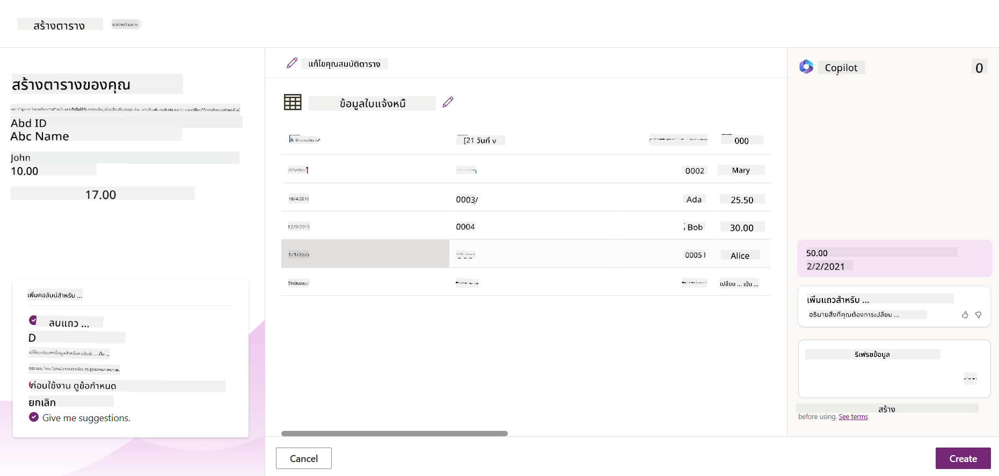
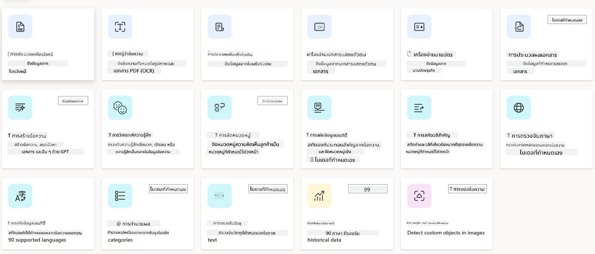

<!--
CO_OP_TRANSLATOR_METADATA:
{
  "original_hash": "f5ff3b6204a695a117d6f452403c95f7",
  "translation_date": "2025-07-09T14:00:27+00:00",
  "source_file": "10-building-low-code-ai-applications/README.md",
  "language_code": "th"
}
-->
# การสร้างแอปพลิเคชัน AI แบบ Low Code

> _(คลิกที่ภาพด้านบนเพื่อดูวิดีโอบทเรียนนี้)_

## บทนำ

ตอนนี้ที่เราได้เรียนรู้วิธีสร้างแอปพลิเคชันสร้างภาพแล้ว มาพูดถึงเรื่อง Low Code กัน Generative AI สามารถนำไปใช้ในหลายด้านรวมถึง Low Code แต่ Low Code คืออะไร และเราจะเพิ่ม AI เข้าไปได้อย่างไร?

การสร้างแอปและโซลูชันกลายเป็นเรื่องง่ายขึ้นสำหรับนักพัฒนาทั้งแบบดั้งเดิมและไม่ใช่นักพัฒนา ผ่านการใช้ Low Code Development Platforms แพลตฟอร์มเหล่านี้ช่วยให้คุณสร้างแอปและโซลูชันโดยใช้โค้ดน้อยหรือแทบไม่ต้องเขียนโค้ดเลย โดยการจัดเตรียมสภาพแวดล้อมการพัฒนาแบบภาพที่ให้คุณลากและวางส่วนประกอบเพื่อสร้างแอปและโซลูชันได้อย่างรวดเร็วและใช้ทรัพยากรน้อยลง ในบทเรียนนี้ เราจะเจาะลึกวิธีใช้ Low Code และวิธีเพิ่มประสิทธิภาพการพัฒนา Low Code ด้วย AI ผ่าน Power Platform

Power Platform เปิดโอกาสให้องค์กรสามารถเสริมพลังให้ทีมงานสร้างโซลูชันของตนเองผ่านสภาพแวดล้อมแบบ low-code หรือ no-code ที่ใช้งานง่าย สภาพแวดล้อมนี้ช่วยให้กระบวนการสร้างโซลูชันง่ายขึ้น ด้วย Power Platform โซลูชันสามารถสร้างได้ภายในไม่กี่วันหรือสัปดาห์ แทนที่จะใช้เวลาหลายเดือนหรือหลายปี Power Platform ประกอบด้วยผลิตภัณฑ์หลัก 5 ตัว ได้แก่ Power Apps, Power Automate, Power BI, Power Pages และ Copilot Studio

บทเรียนนี้ครอบคลุม:

- แนะนำ Generative AI ใน Power Platform
- แนะนำ Copilot และวิธีใช้งาน
- การใช้ Generative AI เพื่อสร้างแอปและโฟลว์ใน Power Platform
- ทำความเข้าใจโมเดล AI ใน Power Platform ด้วย AI Builder

## เป้าหมายการเรียนรู้

เมื่อจบบทเรียนนี้ คุณจะสามารถ:

- เข้าใจการทำงานของ Copilot ใน Power Platform

- สร้างแอป Student Assignment Tracker สำหรับสตาร์ทอัพด้านการศึกษา

- สร้างโฟลว์ Invoice Processing ที่ใช้ AI ในการดึงข้อมูลจากใบแจ้งหนี้

- นำแนวปฏิบัติที่ดีที่สุดมาใช้เมื่อใช้โมเดล AI สร้างข้อความด้วย GPT

เครื่องมือและเทคโนโลยีที่คุณจะใช้ในบทเรียนนี้ ได้แก่:

- **Power Apps** สำหรับแอป Student Assignment Tracker ซึ่งเป็นสภาพแวดล้อมการพัฒนาแบบ low-code สำหรับสร้างแอปเพื่อติดตาม จัดการ และโต้ตอบกับข้อมูล

- **Dataverse** สำหรับเก็บข้อมูลของแอป Student Assignment Tracker โดย Dataverse จะเป็นแพลตฟอร์มข้อมูลแบบ low-code สำหรับเก็บข้อมูลของแอป

- **Power Automate** สำหรับโฟลว์ Invoice Processing ซึ่งเป็นสภาพแวดล้อมการพัฒนาแบบ low-code สำหรับสร้างเวิร์กโฟลว์เพื่อทำให้งานประมวลผลใบแจ้งหนี้เป็นอัตโนมัติ

- **AI Builder** สำหรับโมเดล AI ในการประมวลผลใบแจ้งหนี้ โดยคุณจะใช้โมเดล AI ที่สร้างไว้ล่วงหน้าเพื่อประมวลผลใบแจ้งหนี้สำหรับสตาร์ทอัพของเรา

## Generative AI ใน Power Platform

การเพิ่มประสิทธิภาพการพัฒนาและแอปพลิเคชันแบบ low-code ด้วย generative AI เป็นจุดสนใจหลักของ Power Platform เป้าหมายคือการเปิดโอกาสให้ทุกคนสามารถสร้างแอป เว็บไซต์ แดชบอร์ดที่ขับเคลื่อนด้วย AI และทำงานอัตโนมัติด้วย AI _โดยไม่จำเป็นต้องมีความเชี่ยวชาญด้านวิทยาศาสตร์ข้อมูล_ เป้าหมายนี้ทำได้โดยการผสาน generative AI เข้ากับประสบการณ์การพัฒนาแบบ low-code ใน Power Platform ในรูปแบบของ Copilot และ AI Builder

### มันทำงานอย่างไร?

Copilot คือผู้ช่วย AI ที่ช่วยให้คุณสร้างโซลูชัน Power Platform โดยการอธิบายความต้องการของคุณผ่านขั้นตอนการสนทนาโดยใช้ภาษาธรรมชาติ เช่น คุณสามารถสั่งให้ผู้ช่วย AI ระบุว่าฟิลด์ใดบ้างที่แอปของคุณจะใช้ แล้วมันจะสร้างทั้งแอปและโมเดลข้อมูลพื้นฐาน หรือคุณอาจระบุวิธีตั้งค่าโฟลว์ใน Power Automate

คุณสามารถใช้ฟีเจอร์ที่ขับเคลื่อนด้วย Copilot ในหน้าจอแอปของคุณเพื่อให้ผู้ใช้ค้นพบข้อมูลเชิงลึกผ่านการโต้ตอบแบบสนทนา

AI Builder คือความสามารถ AI แบบ low-code ที่มีใน Power Platform ซึ่งช่วยให้คุณใช้โมเดล AI เพื่อช่วยทำงานอัตโนมัติและทำนายผลลัพธ์ ด้วย AI Builder คุณสามารถนำ AI มาใช้ในแอปและโฟลว์ที่เชื่อมต่อกับข้อมูลใน Dataverse หรือแหล่งข้อมูลคลาวด์ต่างๆ เช่น SharePoint, OneDrive หรือ Azure

Copilot มีให้ใช้งานในผลิตภัณฑ์ Power Platform ทุกตัว ได้แก่ Power Apps, Power Automate, Power BI, Power Pages และ Power Virtual Agents ส่วน AI Builder มีให้ใช้งานใน Power Apps และ Power Automate ในบทเรียนนี้ เราจะเน้นวิธีใช้ Copilot และ AI Builder ใน Power Apps และ Power Automate เพื่อสร้างโซลูชันสำหรับสตาร์ทอัพด้านการศึกษาของเรา

### Copilot ใน Power Apps

ในฐานะส่วนหนึ่งของ Power Platform, Power Apps ให้สภาพแวดล้อมการพัฒนาแบบ low-code สำหรับสร้างแอปเพื่อติดตาม จัดการ และโต้ตอบกับข้อมูล เป็นชุดบริการพัฒนาแอปที่มีแพลตฟอร์มข้อมูลที่ปรับขนาดได้และสามารถเชื่อมต่อกับบริการคลาวด์และข้อมูลในองค์กร Power Apps ช่วยให้คุณสร้างแอปที่ทำงานบนเบราว์เซอร์ แท็บเล็ต และโทรศัพท์มือถือ และสามารถแชร์กับเพื่อนร่วมงานได้ Power Apps ช่วยให้ผู้ใช้เริ่มต้นพัฒนาแอปได้ง่ายด้วยอินเทอร์เฟซที่เรียบง่าย เพื่อให้ผู้ใช้ธุรกิจทั่วไปหรือผู้พัฒนามืออาชีพสามารถสร้างแอปที่กำหนดเองได้ ประสบการณ์การพัฒนาแอปยังได้รับการปรับปรุงด้วย Generative AI ผ่าน Copilot

ฟีเจอร์ผู้ช่วย AI Copilot ใน Power Apps ช่วยให้คุณอธิบายว่าแอปแบบไหนที่คุณต้องการและข้อมูลอะไรที่คุณต้องการให้แอปติดตาม รวบรวม หรือแสดง จากนั้น Copilot จะสร้างแอป Canvas ที่ตอบสนองตามคำอธิบายของคุณ คุณสามารถปรับแต่งแอปให้ตรงกับความต้องการได้ AI Copilot ยังสร้างและแนะนำ Dataverse Table ที่มีฟิลด์ที่คุณต้องการเพื่อเก็บข้อมูลที่ต้องการติดตาม พร้อมตัวอย่างข้อมูล เราจะมาดูว่า Dataverse คืออะไรและคุณจะใช้มันใน Power Apps อย่างไรในบทเรียนนี้ต่อไป คุณสามารถปรับแต่งตารางให้ตรงกับความต้องการโดยใช้ฟีเจอร์ผู้ช่วย AI Copilot ผ่านขั้นตอนการสนทนา ฟีเจอร์นี้สามารถใช้งานได้ทันทีจากหน้าจอหลักของ Power Apps

### Copilot ใน Power Automate

ในฐานะส่วนหนึ่งของ Power Platform, Power Automate ช่วยให้ผู้ใช้สร้างเวิร์กโฟลว์อัตโนมัติระหว่างแอปและบริการต่างๆ ช่วยทำให้งานธุรกิจที่ทำซ้ำๆ เช่น การสื่อสาร การเก็บข้อมูล และการอนุมัติการตัดสินใจเป็นอัตโนมัติ อินเทอร์เฟซที่เรียบง่ายช่วยให้ผู้ใช้ทุกระดับทักษะ (ตั้งแต่ผู้เริ่มต้นจนถึงนักพัฒนามืออาชีพ) สามารถสร้างงานอัตโนมัติได้ ประสบการณ์การพัฒนาเวิร์กโฟลว์ยังได้รับการปรับปรุงด้วย Generative AI ผ่าน Copilot

ฟีเจอร์ผู้ช่วย AI Copilot ใน Power Automate ช่วยให้คุณอธิบายว่าโฟลว์แบบไหนที่คุณต้องการและการกระทำใดที่คุณต้องการให้โฟลว์ทำ จากนั้น Copilot จะสร้างโฟลว์ตามคำอธิบายของคุณ คุณสามารถปรับแต่งโฟลว์ให้ตรงกับความต้องการได้ AI Copilot ยังสร้างและแนะนำการกระทำที่คุณต้องใช้เพื่อทำงานที่ต้องการอัตโนมัติ เราจะมาดูว่าโฟลว์คืออะไรและคุณจะใช้มันใน Power Automate อย่างไรในบทเรียนนี้ต่อไป คุณสามารถปรับแต่งการกระทำให้ตรงกับความต้องการโดยใช้ฟีเจอร์ผู้ช่วย AI Copilot ผ่านขั้นตอนการสนทนา ฟีเจอร์นี้สามารถใช้งานได้ทันทีจากหน้าจอหลักของ Power Automate

## การบ้าน: จัดการงานนักเรียนและใบแจ้งหนี้สำหรับสตาร์ทอัพของเรา โดยใช้ Copilot

สตาร์ทอัพของเราจัดคอร์สออนไลน์ให้กับนักเรียน สตาร์ทอัพเติบโตอย่างรวดเร็วและกำลังประสบปัญหาในการตอบสนองความต้องการของคอร์ส สตาร์ทอัพจึงจ้างคุณในฐานะนักพัฒนา Power Platform เพื่อช่วยสร้างโซลูชัน low code ที่ช่วยจัดการงานนักเรียนและใบแจ้งหนี้ โซลูชันนี้ควรช่วยติดตามและจัดการงานนักเรียนผ่านแอป และทำให้งานประมวลผลใบแจ้งหนี้เป็นอัตโนมัติผ่านเวิร์กโฟลว์ คุณได้รับมอบหมายให้ใช้ Generative AI ในการพัฒนาโซลูชันนี้

เมื่อเริ่มต้นใช้ Copilot คุณสามารถใช้ [Power Platform Copilot Prompt Library](https://github.com/pnp/powerplatform-prompts?WT.mc_id=academic-109639-somelezediko) เพื่อเริ่มต้นกับคำสั่ง prompt ไลบรารีนี้มีรายการ prompt ที่คุณสามารถใช้สร้างแอปและโฟลว์ด้วย Copilot คุณยังสามารถใช้ prompt ในไลบรารีเพื่อเป็นแนวทางในการอธิบายความต้องการของคุณกับ Copilot

### สร้างแอป Student Assignment Tracker สำหรับสตาร์ทอัพของเรา

ครูผู้สอนในสตาร์ทอัพของเรากำลังประสบปัญหาในการติดตามงานนักเรียน พวกเขาใช้สเปรดชีตในการติดตามงาน แต่เริ่มจัดการยากขึ้นเมื่อจำนวนนักเรียนเพิ่มขึ้น พวกเขาขอให้คุณสร้างแอปที่ช่วยติดตามและจัดการงานนักเรียน แอปควรให้ผู้ใช้เพิ่มงานใหม่ ดูงาน อัปเดตงาน และลบงานได้ แอปยังควรให้ครูและนักเรียนดูงานที่ได้รับการให้คะแนนแล้วและงานที่ยังไม่ได้ให้คะแนนได้

คุณจะสร้างแอปโดยใช้ Copilot ใน Power Apps ตามขั้นตอนดังนี้:

1. ไปที่หน้าจอหลักของ [Power Apps](https://make.powerapps.com?WT.mc_id=academic-105485-koreyst)

2. ใช้พื้นที่ข้อความบนหน้าจอหลักเพื่ออธิบายแอปที่คุณต้องการสร้าง เช่น **_ฉันต้องการสร้างแอปเพื่อติดตามและจัดการงานนักเรียน_** คลิกปุ่ม **Send** เพื่อส่ง prompt ไปยัง AI Copilot

3. AI Copilot จะแนะนำ Dataverse Table ที่มีฟิลด์ที่คุณต้องการเพื่อเก็บข้อมูลที่ต้องการติดตาม พร้อมตัวอย่างข้อมูล คุณสามารถปรับแต่งตารางให้ตรงกับความต้องการโดยใช้ฟีเจอร์ผู้ช่วย AI Copilot ผ่านขั้นตอนการสนทนา

   > **สำคัญ**: Dataverse คือแพลตฟอร์มข้อมูลพื้นฐานของ Power Platform เป็นแพลตฟอร์มข้อมูลแบบ low-code สำหรับเก็บข้อมูลของแอป เป็นบริการที่มีการจัดการเต็มรูปแบบที่เก็บข้อมูลอย่างปลอดภัยใน Microsoft Cloud และถูกจัดเตรียมภายในสภาพแวดล้อม Power Platform ของคุณ มาพร้อมกับความสามารถในการบริหารจัดการข้อมูล เช่น การจัดประเภทข้อมูล การติดตามแหล่งที่มาของข้อมูล การควบคุมการเข้าถึงอย่างละเอียด และอื่นๆ คุณสามารถเรียนรู้เพิ่มเติมเกี่ยวกับ Dataverse ได้ [ที่นี่](https://docs.microsoft.com/powerapps/maker/data-platform/data-platform-intro?WT.mc_id=academic-109639-somelezediko)

   

4. ครูต้องการส่งอีเมลถึงนักเรียนที่ส่งงานมาเพื่อแจ้งความคืบหน้าของงาน คุณสามารถใช้ Copilot เพื่อเพิ่มฟิลด์ใหม่ในตารางเพื่อเก็บอีเมลนักเรียน เช่น คุณสามารถใช้ prompt นี้เพื่อเพิ่มฟิลด์ใหม่ในตาราง: **_ฉันต้องการเพิ่มคอลัมน์เพื่อเก็บอีเมลนักเรียน_** คลิกปุ่ม **Send** เพื่อส่ง prompt ไปยัง AI Copilot

5. AI Copilot จะสร้างฟิลด์ใหม่ให้ และคุณสามารถปรับแต่งฟิลด์ให้ตรงกับความต้องการได้

6. เมื่อเสร็จสิ้นการจัดการตารางแล้ว ให้คลิกปุ่ม **Create app** เพื่อสร้างแอป

7. AI Copilot จะสร้างแอป Canvas ที่ตอบสนองตามคำอธิบายของคุณ คุณสามารถปรับแต่งแอปให้ตรงกับความต้องการได้

8. เพื่อให้ครูส่งอีเมลถึงนักเรียน คุณสามารถใช้ Copilot เพื่อเพิ่มหน้าจอใหม่ในแอป เช่น คุณสามารถใช้ prompt นี้เพื่อเพิ่มหน้าจอใหม่: **_ฉันต้องการเพิ่มหน้าจอเพื่อส่งอีเมลถึงนักเรียน_** คลิกปุ่ม **Send** เพื่อส่ง prompt ไปยัง AI Copilot

9. AI Copilot จะสร้างหน้าจอใหม่ให้ และคุณสามารถปรับแต่งหน้าจอให้ตรงกับความต้องการได้

10. เมื่อเสร็จสิ้นการสร้างแอปแล้ว ให้คลิกปุ่ม **Save** เพื่อบันทึกแอป

11. เพื่อแชร์แอปกับครู ให้คลิกปุ่ม **Share** แล้วคลิกปุ่ม **Share** อีกครั้ง จากนั้นคุณสามารถแชร์แอปโดยใส่อีเมลของครู

> **การบ้านของคุณ**: แอปที่คุณสร้างขึ้นเป็นจุดเริ่มต้นที่ดี แต่ยังสามารถพัฒนาได้อีก ด้วยฟีเจอร์อีเมล ครูสามารถส่งอีเมลถึงนักเรียนได้แค่แบบแมนนวลโดยต้องพิมพ์อีเมลเอง คุณสามารถใช้ Copilot สร้างระบบอัตโนมัติที่ช่วยให้ครูส่งอีเมลถึงนักเรียนโดยอัตโนมัติเมื่อพวกเขาส่งงานได้หรือไม่? คำใบ้คือ ด้วย prompt ที่เหมาะสม คุณสามารถใช้ Copilot ใน Power Automate เพื่อสร้างระบบนี้ได้

### สร้างตารางข้อมูลใบแจ้งหนี้สำหรับสตาร์ทอัพของเรา

ทีมการเงินของสตาร์ทอัพของเรากำลังประสบปัญหาในการติดตามใบแจ้งหนี้ พวกเขาใช้สเปรดชีตในการติดตามใบแจ้งหนี้ แต่เริ่มจัดการยากขึ้นเมื่อจำนวนใบแจ้งหนี้เพิ่มขึ้น พวกเขาขอให้คุณสร้างตารางที่ช่วยเก็บ ติดตาม และจัดการข้อมูลใบแจ้งหนี้ที่ได้รับ ตารางนี้จะใช้สร้างระบบอัตโนมัติที่ดึงข้อมูลใบแจ้งหนี้ทั้งหมดและเก็บไว้ในตาราง ตารางนี้ยังควรช่วยให้ทีมการเงินดูใบแจ้งหนี้ที่ชำระแล้วและยังไม่ชำระได้

Power Platform มีแพลตฟอร์มข้อมูลพื้นฐานชื่อ Dataverse ที่ช่วยให้คุณเก็บข้อมูลสำหรับแอปและโซลูชันของคุณ Dataverse เป็นแพลตฟอร์มข้อมูลแบบ low-code สำหรับเก็บข้อมูลของแอป เป็นบริการที่มีการจัดการเต็มรูปแบบที่เก็บข้อมูลอย่างปลอดภัยใน Microsoft Cloud และถูกจัดเตรียมภายในสภาพแวดล้อม Power Platform ของคุณ มาพร้อมกับความสามารถในการบริหารจัดการข้อมูล เช่น การจัดประเภทข้อมูล การติดตามแหล่งที่มาของข้อมูล การควบคุมการเข้าถึงอย่างละเอียด และอื่นๆ คุณสามารถเรียนรู้เพิ่มเติม [เกี่ยวกับ Dataverse ได้ที่นี่](https://docs.microsoft.com/powerapps/maker/data-platform/data-platform-intro?WT.mc_id=academic-109639-somelezediko)

ทำไมเราควรใช้ Dataverse สำหรับสตาร์ทอัพของเรา? ตารางมาตรฐานและตารางที่กำหนดเองใน Dataverse ให้ตัวเลือกการเก็บข้อมูลที่ปลอดภัยและอยู่บนคลาวด์ ตารางช่วยให้คุณเก็บข้อมูลประเภทต่างๆ ได้ คล้ายกับการใช้หลายแผ่นงานในสมุดงาน Excel เดียวกัน คุณสามารถใช้ตารางเพื่อเก็บข้อมูลที่เฉพาะเจาะจงกับองค์กรหรือความต้องการทางธุรกิจของคุณ ประโยชน์บางประการที่สตาร์ทอัพของเราจะได้รับจากการใช้ Dataverse รวมถึงแต่ไม่จำกัดเพียง:
- **จัดการง่าย**: ทั้งเมตาดาต้าและข้อมูลจะถูกเก็บไว้บนคลาวด์ ดังนั้นคุณไม่ต้องกังวลเกี่ยวกับรายละเอียดของการจัดเก็บหรือการจัดการ คุณสามารถมุ่งเน้นไปที่การสร้างแอปและโซลูชันของคุณได้

- **ปลอดภัย**: Dataverse มีตัวเลือกการจัดเก็บข้อมูลบนคลาวด์ที่ปลอดภัย คุณสามารถควบคุมว่าใครสามารถเข้าถึงข้อมูลในตารางของคุณและวิธีการเข้าถึงโดยใช้ระบบความปลอดภัยตามบทบาท

- **เมตาดาต้าที่ครบถ้วน**: ประเภทข้อมูลและความสัมพันธ์ถูกใช้งานโดยตรงภายใน Power Apps

- **ตรรกะและการตรวจสอบความถูกต้อง**: คุณสามารถใช้กฎทางธุรกิจ ฟิลด์ที่คำนวณ และกฎการตรวจสอบความถูกต้องเพื่อบังคับใช้ตรรกะทางธุรกิจและรักษาความถูกต้องของข้อมูล

ตอนนี้ที่คุณเข้าใจว่า Dataverse คืออะไรและทำไมคุณควรใช้ มาดูกันว่าคุณจะใช้ Copilot สร้างตารางใน Dataverse เพื่อตอบสนองความต้องการของทีมการเงินของเราได้อย่างไร

> **Note** : คุณจะใช้ตารางนี้ในส่วนถัดไปเพื่อสร้างระบบอัตโนมัติที่จะดึงข้อมูลใบแจ้งหนี้ทั้งหมดและเก็บไว้ในตารางนี้

ในการสร้างตารางใน Dataverse โดยใช้ Copilot ให้ทำตามขั้นตอนด้านล่างนี้:

1. ไปที่หน้าจอหลักของ [Power Apps](https://make.powerapps.com?WT.mc_id=academic-105485-koreyst)

2. ที่แถบนำทางด้านซ้าย เลือก **Tables** แล้วคลิกที่ **Describe the new Table**

3. ที่หน้าจอ **Describe the new Table** ใช้พื้นที่ข้อความเพื่ออธิบายตารางที่คุณต้องการสร้าง เช่น **_ฉันต้องการสร้างตารางเพื่อเก็บข้อมูลใบแจ้งหนี้_** คลิกปุ่ม **Send** เพื่อส่งคำสั่งไปยัง AI Copilot

4. AI Copilot จะแนะนำตาราง Dataverse พร้อมฟิลด์ที่คุณต้องการเพื่อเก็บข้อมูลที่ต้องการติดตามและตัวอย่างข้อมูล คุณสามารถปรับแต่งตารางให้ตรงกับความต้องการของคุณโดยใช้ฟีเจอร์ผู้ช่วย AI Copilot ผ่านขั้นตอนการสนทนา

5. ทีมการเงินต้องการส่งอีเมลถึงซัพพลายเออร์เพื่ออัปเดตสถานะปัจจุบันของใบแจ้งหนี้ คุณสามารถใช้ Copilot เพื่อเพิ่มฟิลด์ใหม่ในตารางเพื่อเก็บอีเมลของซัพพลายเออร์ เช่น คุณสามารถใช้คำสั่งนี้เพื่อเพิ่มคอลัมน์ใหม่ในตาราง: **_ฉันต้องการเพิ่มคอลัมน์เพื่อเก็บอีเมลของซัพพลายเออร์_** คลิกปุ่ม **Send** เพื่อส่งคำสั่งไปยัง AI Copilot

6. AI Copilot จะสร้างฟิลด์ใหม่ขึ้นมา และคุณสามารถปรับแต่งฟิลด์นั้นให้ตรงกับความต้องการของคุณ

7. เมื่อเสร็จสิ้นการสร้างตารางแล้ว ให้คลิกปุ่ม **Create** เพื่อสร้างตาราง

## AI Models ใน Power Platform กับ AI Builder

AI Builder คือความสามารถ AI แบบ low-code ที่มีใน Power Platform ซึ่งช่วยให้คุณใช้ AI Models เพื่อช่วยในการทำงานอัตโนมัติและทำนายผลลัพธ์ ด้วย AI Builder คุณสามารถนำ AI มาใช้ในแอปและโฟลว์ที่เชื่อมต่อกับข้อมูลใน Dataverse หรือแหล่งข้อมูลบนคลาวด์ต่างๆ เช่น SharePoint, OneDrive หรือ Azure

## AI Models ที่สร้างไว้ล่วงหน้ากับ AI Models ที่สร้างเอง

AI Builder มี AI Models อยู่สองประเภท คือ AI Models ที่สร้างไว้ล่วงหน้าและ AI Models ที่สร้างเอง AI Models ที่สร้างไว้ล่วงหน้าเป็นโมเดลที่ Microsoft ฝึกสอนและพร้อมใช้งานใน Power Platform ช่วยให้คุณเพิ่มความชาญฉลาดให้กับแอปและโฟลว์โดยไม่ต้องรวบรวมข้อมูล สร้าง ฝึก และเผยแพร่โมเดลเอง คุณสามารถใช้โมเดลเหล่านี้เพื่อทำงานอัตโนมัติและทำนายผลลัพธ์ได้

ตัวอย่าง AI Models ที่สร้างไว้ล่วงหน้าที่มีใน Power Platform ได้แก่:

- **Key Phrase Extraction**: โมเดลนี้ดึงวลีสำคัญจากข้อความ
- **Language Detection**: โมเดลนี้ตรวจจับภาษาของข้อความ
- **Sentiment Analysis**: โมเดลนี้ตรวจจับความรู้สึกในข้อความว่าเป็นบวก ลบ กลาง หรือผสม
- **Business Card Reader**: โมเดลนี้ดึงข้อมูลจากนามบัตร
- **Text Recognition**: โมเดลนี้ดึงข้อความจากภาพ
- **Object Detection**: โมเดลนี้ตรวจจับและดึงวัตถุจากภาพ
- **Document processing**: โมเดลนี้ดึงข้อมูลจากแบบฟอร์ม
- **Invoice Processing**: โมเดลนี้ดึงข้อมูลจากใบแจ้งหนี้

สำหรับ AI Models ที่สร้างเอง คุณสามารถนำโมเดลของคุณเข้ามาใน AI Builder เพื่อให้ทำงานเหมือนโมเดลที่สร้างเองใน AI Builder โดยคุณสามารถฝึกโมเดลด้วยข้อมูลของคุณเอง ใช้โมเดลเหล่านี้เพื่อทำงานอัตโนมัติและทำนายผลลัพธ์ได้ทั้งใน Power Apps และ Power Automate เมื่อใช้โมเดลของคุณเองจะมีข้อจำกัดบางประการ อ่านเพิ่มเติมเกี่ยวกับ [ข้อจำกัดเหล่านี้](https://learn.microsoft.com/ai-builder/byo-model#limitations?WT.mc_id=academic-105485-koreyst)

## งานที่ 2 - สร้างโฟลว์ประมวลผลใบแจ้งหนี้สำหรับสตาร์ทอัพของเรา

ทีมการเงินประสบปัญหาในการประมวลผลใบแจ้งหนี้ พวกเขาใช้สเปรดชีตเพื่อติดตามใบแจ้งหนี้ แต่เริ่มจัดการได้ยากขึ้นเมื่อจำนวนใบแจ้งหนี้เพิ่มขึ้น พวกเขาขอให้คุณสร้างเวิร์กโฟลว์ที่จะช่วยประมวลผลใบแจ้งหนี้โดยใช้ AI เวิร์กโฟลว์นี้ควรช่วยดึงข้อมูลจากใบแจ้งหนี้และเก็บข้อมูลไว้ในตาราง Dataverse รวมถึงช่วยส่งอีเมลถึงทีมการเงินพร้อมข้อมูลที่ดึงมา

ตอนนี้ที่คุณรู้ว่า AI Builder คืออะไรและทำไมควรใช้ มาดูกันว่าคุณจะใช้โมเดล Invoice Processing AI Model ใน AI Builder ที่เราได้พูดถึงก่อนหน้านี้ เพื่อสร้างเวิร์กโฟลว์ที่ช่วยทีมการเงินประมวลผลใบแจ้งหนี้ได้อย่างไร

ในการสร้างเวิร์กโฟลว์ที่จะช่วยทีมการเงินประมวลผลใบแจ้งหนี้โดยใช้ Invoice Processing AI Model ใน AI Builder ให้ทำตามขั้นตอนนี้:

1. ไปที่หน้าจอหลักของ [Power Automate](https://make.powerautomate.com?WT.mc_id=academic-105485-koreyst)

2. ใช้พื้นที่ข้อความบนหน้าจอหลักเพื่ออธิบายเวิร์กโฟลว์ที่คุณต้องการสร้าง เช่น **_ประมวลผลใบแจ้งหนี้เมื่อได้รับในกล่องจดหมายของฉัน_** คลิกปุ่ม **Send** เพื่อส่งคำสั่งไปยัง AI Copilot

   

3. AI Copilot จะแนะนำการกระทำที่คุณต้องทำเพื่อทำงานที่ต้องการอัตโนมัติ คุณสามารถคลิกปุ่ม **Next** เพื่อดำเนินขั้นตอนถัดไป

4. ในขั้นตอนถัดไป Power Automate จะขอให้คุณตั้งค่าการเชื่อมต่อที่จำเป็นสำหรับโฟลว์ เมื่อเสร็จแล้ว คลิกปุ่ม **Create flow** เพื่อสร้างโฟลว์

5. AI Copilot จะสร้างโฟลว์ให้ และคุณสามารถปรับแต่งโฟลว์ให้ตรงกับความต้องการของคุณ

6. อัปเดตทริกเกอร์ของโฟลว์และตั้งค่า **Folder** เป็นโฟลเดอร์ที่เก็บใบแจ้งหนี้ เช่น ตั้งเป็น **Inbox** คลิก **Show advanced options** และตั้งค่า **Only with Attachments** เป็น **Yes** เพื่อให้โฟลว์ทำงานเฉพาะเมื่อได้รับอีเมลที่มีไฟล์แนบในโฟลเดอร์นั้น

7. ลบการกระทำต่อไปนี้ออกจากโฟลว์: **HTML to text**, **Compose**, **Compose 2**, **Compose 3** และ **Compose 4** เพราะคุณจะไม่ใช้การกระทำเหล่านี้

8. ลบการกระทำ **Condition** ออกจากโฟลว์ เพราะคุณจะไม่ใช้ มันควรจะดูเหมือนภาพหน้าจอด้านล่างนี้:

   

9. คลิกปุ่ม **Add an action** และค้นหา **Dataverse** เลือกการกระทำ **Add a new row**

10. ในการกระทำ **Extract Information from invoices** อัปเดต **Invoice File** ให้ชี้ไปที่ **Attachment Content** จากอีเมล เพื่อให้โฟลว์ดึงข้อมูลจากไฟล์แนบใบแจ้งหนี้

11. เลือก **Table** ที่คุณสร้างไว้ก่อนหน้านี้ เช่น ตาราง **Invoice Information** เลือกเนื้อหาไดนามิกจากการกระทำก่อนหน้าเพื่อเติมข้อมูลในฟิลด์ต่อไปนี้:

    - ID
    - Amount
    - Date
    - Name
    - Status - ตั้งค่า **Status** เป็น **Pending**
    - Supplier Email - ใช้เนื้อหาไดนามิก **From** จากทริกเกอร์ **When a new email arrives**

    

12. เมื่อเสร็จสิ้นการสร้างโฟลว์แล้ว คลิกปุ่ม **Save** เพื่อบันทึกโฟลว์ จากนั้นคุณสามารถทดสอบโฟลว์โดยส่งอีเมลที่มีใบแจ้งหนี้ไปยังโฟลเดอร์ที่คุณตั้งค่าในทริกเกอร์

> **งานบ้านของคุณ**: โฟลว์ที่คุณสร้างขึ้นเป็นจุดเริ่มต้นที่ดี ตอนนี้คุณต้องคิดว่าจะสร้างระบบอัตโนมัติอย่างไรที่จะช่วยให้ทีมการเงินส่งอีเมลถึงซัพพลายเออร์เพื่ออัปเดตสถานะปัจจุบันของใบแจ้งหนี้ได้ คำใบ้: โฟลว์ต้องทำงานเมื่อสถานะของใบแจ้งหนี้เปลี่ยนแปลง

## ใช้ Text Generation AI Model ใน Power Automate

โมเดล Create Text with GPT AI Model ใน AI Builder ช่วยให้คุณสร้างข้อความตามคำสั่ง โดยใช้บริการ Microsoft Azure OpenAI Service ด้วยความสามารถนี้ คุณสามารถผนวกเทคโนโลยี GPT (Generative Pre-Trained Transformer) เข้ากับแอปและโฟลว์ของคุณเพื่อสร้างโฟลว์อัตโนมัติและแอปพลิเคชันที่มีความเข้าใจลึกซึ้ง

โมเดล GPT ผ่านการฝึกฝนอย่างเข้มข้นกับข้อมูลจำนวนมาก ทำให้สามารถสร้างข้อความที่คล้ายภาษามนุษย์ได้เมื่อได้รับคำสั่ง เมื่อผนวกกับการทำงานอัตโนมัติของเวิร์กโฟลว์ โมเดล AI อย่าง GPT สามารถช่วยให้การทำงานหลายอย่างเป็นไปอย่างราบรื่นและอัตโนมัติ

ตัวอย่างเช่น คุณสามารถสร้างโฟลว์เพื่อสร้างข้อความอัตโนมัติสำหรับกรณีการใช้งานต่างๆ เช่น ร่างอีเมล คำอธิบายสินค้า และอื่นๆ นอกจากนี้ยังสามารถใช้โมเดลนี้สร้างข้อความสำหรับแอปต่างๆ เช่น แชทบอทและแอปบริการลูกค้าที่ช่วยให้เจ้าหน้าที่ตอบคำถามลูกค้าได้อย่างมีประสิทธิภาพ

หากต้องการเรียนรู้วิธีใช้โมเดล AI นี้ใน Power Automate ให้ศึกษาจากโมดูล [Add intelligence with AI Builder and GPT](https://learn.microsoft.com/training/modules/ai-builder-text-generation/?WT.mc_id=academic-109639-somelezediko)

## ทำได้ดีมาก! เรียนรู้ต่อไป

หลังจากเรียนจบบทเรียนนี้แล้ว อย่าลืมดู [คอลเลกชันการเรียนรู้ Generative AI](https://aka.ms/genai-collection?WT.mc_id=academic-105485-koreyst) เพื่อพัฒนาความรู้ด้าน Generative AI ของคุณให้ก้าวหน้าไปอีกขั้น!

ไปที่บทเรียนที่ 11 ซึ่งเราจะเรียนรู้วิธี [ผนวก Generative AI กับ Function Calling](../11-integrating-with-function-calling/README.md?WT.mc_id=academic-105485-koreyst)!

**ข้อจำกัดความรับผิดชอบ**:  
เอกสารนี้ได้รับการแปลโดยใช้บริการแปลภาษาอัตโนมัติ [Co-op Translator](https://github.com/Azure/co-op-translator) แม้เราจะพยายามให้ความถูกต้องสูงสุด แต่โปรดทราบว่าการแปลอัตโนมัติอาจมีข้อผิดพลาดหรือความไม่ถูกต้อง เอกสารต้นฉบับในภาษาต้นทางถือเป็นแหล่งข้อมูลที่เชื่อถือได้ สำหรับข้อมูลที่สำคัญ ขอแนะนำให้ใช้บริการแปลโดยผู้เชี่ยวชาญมนุษย์ เราไม่รับผิดชอบต่อความเข้าใจผิดหรือการตีความผิดใด ๆ ที่เกิดจากการใช้การแปลนี้