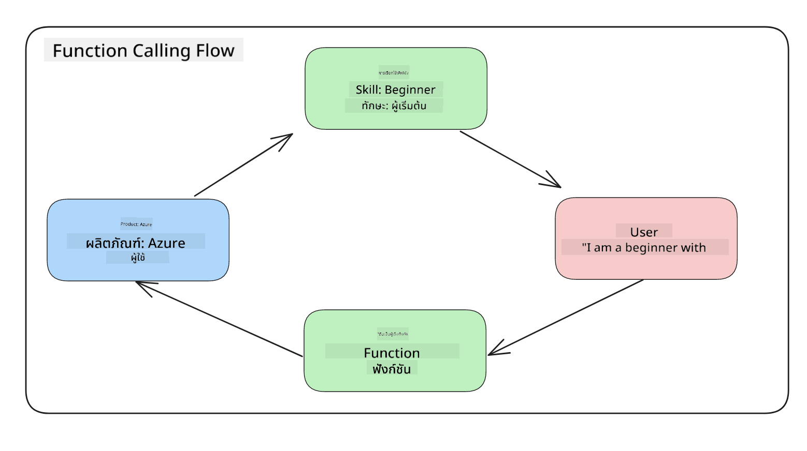
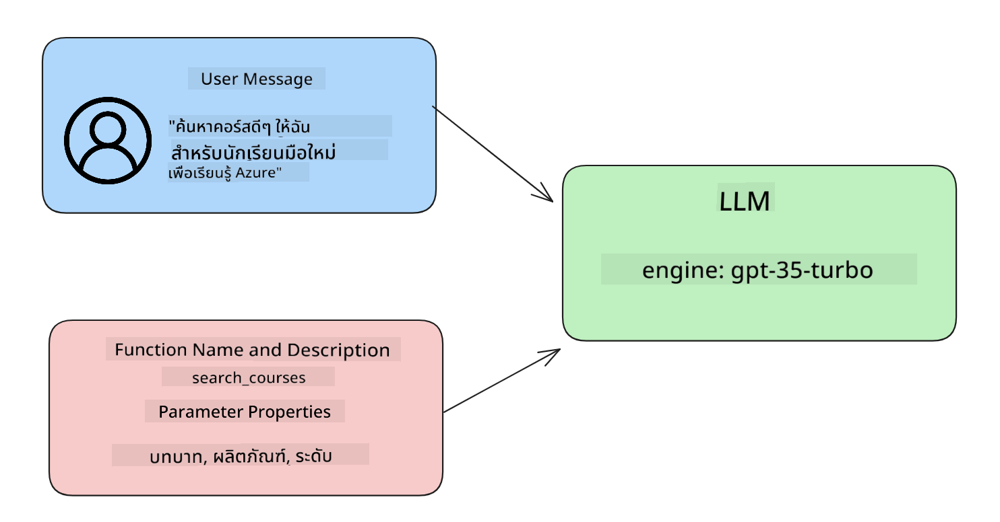

<!--
CO_OP_TRANSLATOR_METADATA:
{
  "original_hash": "77a48a201447be19aa7560706d6f93a0",
  "translation_date": "2025-07-09T14:34:49+00:00",
  "source_file": "11-integrating-with-function-calling/README.md",
  "language_code": "th"
}
-->
# การผสานรวมกับการเรียกใช้ฟังก์ชัน

[](https://aka.ms/gen-ai-lesson11-gh?WT.mc_id=academic-105485-koreyst)

คุณได้เรียนรู้มาพอสมควรจากบทเรียนก่อนหน้าแล้ว แต่เรายังสามารถพัฒนาได้อีก บางอย่างที่เราสามารถปรับปรุงได้คือการทำให้รูปแบบการตอบกลับมีความสม่ำเสมอมากขึ้น เพื่อให้ง่ายต่อการนำไปใช้งานต่อในขั้นตอนถัดไป นอกจากนี้ เรายังอาจต้องการเพิ่มข้อมูลจากแหล่งอื่นเพื่อเสริมความสมบูรณ์ให้กับแอปพลิเคชันของเรา

ปัญหาที่กล่าวมาข้างต้นคือสิ่งที่บทนี้ต้องการแก้ไข

## บทนำ

บทเรียนนี้จะครอบคลุม:

- อธิบายว่า function calling คืออะไรและกรณีการใช้งาน
- การสร้างการเรียกใช้ฟังก์ชันด้วย Azure OpenAI
- วิธีการผสานรวมการเรียกใช้ฟังก์ชันเข้ากับแอปพลิเคชัน

## เป้าหมายการเรียนรู้

เมื่อจบบทเรียนนี้ คุณจะสามารถ:

- อธิบายวัตถุประสงค์ของการใช้ function calling
- ตั้งค่า Function Call โดยใช้ Azure OpenAI Service
- ออกแบบการเรียกใช้ฟังก์ชันที่มีประสิทธิภาพสำหรับกรณีการใช้งานของแอปพลิเคชันคุณ

## กรณีศึกษา: การพัฒนาช่องแชทบอทด้วยฟังก์ชัน

สำหรับบทเรียนนี้ เราต้องการสร้างฟีเจอร์สำหรับสตาร์ทอัพด้านการศึกษา ที่ช่วยให้ผู้ใช้สามารถใช้แชทบอทค้นหาหลักสูตรเทคนิคต่างๆ ได้ เราจะแนะนำหลักสูตรที่เหมาะสมกับระดับทักษะ บทบาทปัจจุบัน และเทคโนโลยีที่สนใจของผู้ใช้

เพื่อทำกรณีศึกษานี้ให้สำเร็จ เราจะใช้การผสมผสานของ:

- `Azure OpenAI` เพื่อสร้างประสบการณ์แชทสำหรับผู้ใช้
- `Microsoft Learn Catalog API` เพื่อช่วยผู้ใช้ค้นหาหลักสูตรตามคำขอ
- `Function Calling` เพื่อรับคำถามของผู้ใช้และส่งไปยังฟังก์ชันเพื่อทำการเรียก API

เริ่มต้นกันเลย มาดูกันว่าทำไมเราถึงอยากใช้ function calling ตั้งแต่แรก:

## ทำไมต้องใช้ Function Calling

ก่อนจะมี function calling คำตอบจาก LLM มักไม่มีโครงสร้างและไม่สม่ำเสมอ นักพัฒนาต้องเขียนโค้ดยืนยันความถูกต้องที่ซับซ้อนเพื่อจัดการกับรูปแบบคำตอบที่หลากหลาย ผู้ใช้ไม่สามารถถามคำถามเช่น "สภาพอากาศปัจจุบันที่สต็อกโฮล์มเป็นอย่างไร?" และได้รับคำตอบได้ เพราะโมเดลถูกจำกัดด้วยข้อมูลที่ถูกฝึกมาในช่วงเวลาหนึ่ง

Function Calling เป็นฟีเจอร์ของ Azure OpenAI Service ที่ช่วยแก้ข้อจำกัดเหล่านี้:

- **รูปแบบการตอบกลับที่สม่ำเสมอ** หากเราควบคุมรูปแบบการตอบกลับได้ดีขึ้น เราจะสามารถผสานข้อมูลไปยังระบบอื่นได้ง่ายขึ้น
- **ข้อมูลภายนอก** สามารถใช้ข้อมูลจากแหล่งอื่นของแอปพลิเคชันในบริบทของแชทได้

## อธิบายปัญหาผ่านกรณีศึกษา

> เราแนะนำให้ใช้ [notebook ที่แนบมา](../../../11-integrating-with-function-calling/python/aoai-assignment.ipynb) หากคุณต้องการรันกรณีศึกษาด้านล่าง หรือจะอ่านตามเพื่อทำความเข้าใจปัญหาที่ฟังก์ชันสามารถช่วยแก้ไขก็ได้

มาดูตัวอย่างที่แสดงปัญหาเรื่องรูปแบบการตอบกลับ:

สมมติว่าเราต้องการสร้างฐานข้อมูลข้อมูลนักเรียนเพื่อแนะนำหลักสูตรที่เหมาะสมให้กับพวกเขา ด้านล่างนี้มีคำอธิบายของนักเรียนสองคนที่มีข้อมูลคล้ายกันมาก

1. สร้างการเชื่อมต่อกับ Azure OpenAI ของเรา:

   ```python
   import os
   import json
   from openai import AzureOpenAI
   from dotenv import load_dotenv
   load_dotenv()

   client = AzureOpenAI(
   api_key=os.environ['AZURE_OPENAI_API_KEY'],  # this is also the default, it can be omitted
   api_version = "2023-07-01-preview"
   )

   deployment=os.environ['AZURE_OPENAI_DEPLOYMENT']
   ```

   ด้านล่างเป็นโค้ด Python สำหรับตั้งค่าการเชื่อมต่อกับ Azure OpenAI โดยกำหนด `api_type`, `api_base`, `api_version` และ `api_key`

1. สร้างคำอธิบายของนักเรียนสองคนโดยใช้ตัวแปร `student_1_description` และ `student_2_description`

   ```python
   student_1_description="Emily Johnson is a sophomore majoring in computer science at Duke University. She has a 3.7 GPA. Emily is an active member of the university's Chess Club and Debate Team. She hopes to pursue a career in software engineering after graduating."

   student_2_description = "Michael Lee is a sophomore majoring in computer science at Stanford University. He has a 3.8 GPA. Michael is known for his programming skills and is an active member of the university's Robotics Club. He hopes to pursue a career in artificial intelligence after finishing his studies."
   ```

   เราต้องการส่งคำอธิบายของนักเรียนเหล่านี้ไปยัง LLM เพื่อแยกข้อมูล ข้อมูลนี้จะถูกนำไปใช้ในแอปพลิเคชันและส่งต่อไปยัง API หรือเก็บในฐานข้อมูลได้

1. สร้าง prompt สองอันที่เหมือนกัน โดยสั่งให้ LLM รู้ว่าข้อมูลที่เราสนใจคืออะไร:

   ```python
   prompt1 = f'''
   Please extract the following information from the given text and return it as a JSON object:

   name
   major
   school
   grades
   club

   This is the body of text to extract the information from:
   {student_1_description}
   '''

   prompt2 = f'''
   Please extract the following information from the given text and return it as a JSON object:

   name
   major
   school
   grades
   club

   This is the body of text to extract the information from:
   {student_2_description}
   '''
   ```

   prompt ข้างต้นสั่งให้ LLM ดึงข้อมูลและส่งกลับในรูปแบบ JSON

1. หลังจากตั้งค่า prompt และเชื่อมต่อกับ Azure OpenAI แล้ว เราจะส่ง prompt ไปยัง LLM โดยใช้ `openai.ChatCompletion` เราเก็บ prompt ในตัวแปร `messages` และกำหนดบทบาทเป็น `user` เพื่อจำลองข้อความจากผู้ใช้ที่ส่งไปยังแชทบอท

   ```python
   # response from prompt one
   openai_response1 = client.chat.completions.create(
   model=deployment,
   messages = [{'role': 'user', 'content': prompt1}]
   )
   openai_response1.choices[0].message.content

   # response from prompt two
   openai_response2 = client.chat.completions.create(
   model=deployment,
   messages = [{'role': 'user', 'content': prompt2}]
   )
   openai_response2.choices[0].message.content
   ```

ตอนนี้เราสามารถส่งคำขอทั้งสองไปยัง LLM และตรวจสอบคำตอบที่ได้รับโดยใช้ `openai_response1['choices'][0]['message']['content']`

1. สุดท้าย เราสามารถแปลงคำตอบเป็นรูปแบบ JSON โดยเรียกใช้ `json.loads`:

   ```python
   # Loading the response as a JSON object
   json_response1 = json.loads(openai_response1.choices[0].message.content)
   json_response1
   ```

   คำตอบที่ 1:

   ```json
   {
     "name": "Emily Johnson",
     "major": "computer science",
     "school": "Duke University",
     "grades": "3.7",
     "club": "Chess Club"
   }
   ```

   คำตอบที่ 2:

   ```json
   {
     "name": "Michael Lee",
     "major": "computer science",
     "school": "Stanford University",
     "grades": "3.8 GPA",
     "club": "Robotics Club"
   }
   ```

   แม้ว่า prompt จะเหมือนกันและคำอธิบายคล้ายกัน แต่ค่าของคุณสมบัติ `Grades` กลับมีรูปแบบต่างกัน เช่น บางครั้งได้เป็น `3.7` บางครั้งเป็น `3.7 GPA`

   ผลลัพธ์นี้เกิดจาก LLM รับข้อมูลที่ไม่มีโครงสร้างในรูปแบบ prompt ที่เขียน และส่งกลับข้อมูลที่ไม่มีโครงสร้างเช่นกัน เราจำเป็นต้องมีรูปแบบที่มีโครงสร้างเพื่อให้รู้ว่าจะคาดหวังอะไรเมื่อเก็บหรือใช้งานข้อมูลนี้

แล้วเราจะแก้ปัญหารูปแบบนี้อย่างไร? ด้วยการใช้ function calling เราจะมั่นใจได้ว่าได้รับข้อมูลที่มีโครงสร้างกลับมา เมื่อใช้ function calling จริงๆ แล้ว LLM ไม่ได้เรียกหรือรันฟังก์ชันใดๆ แต่เราสร้างโครงสร้างให้ LLM ปฏิบัติตามสำหรับการตอบกลับ จากนั้นเราจะใช้การตอบกลับที่มีโครงสร้างเหล่านั้นเพื่อรู้ว่าควรเรียกฟังก์ชันใดในแอปพลิเคชันของเรา



เราสามารถนำผลลัพธ์ที่ได้จากฟังก์ชันส่งกลับไปยัง LLM อีกครั้ง LLM จะตอบกลับด้วยภาษาธรรมชาติเพื่อตอบคำถามของผู้ใช้

## กรณีการใช้งานของ function calls

มีหลายกรณีที่ function calls สามารถช่วยปรับปรุงแอปของคุณได้ เช่น:

- **เรียกใช้เครื่องมือภายนอก** แชทบอทเหมาะสำหรับตอบคำถามจากผู้ใช้ โดยใช้ function calling แชทบอทสามารถใช้ข้อความจากผู้ใช้เพื่อทำงานบางอย่าง เช่น นักเรียนอาจขอให้แชทบอท "ส่งอีเมลถึงอาจารย์ของฉันว่าฉันต้องการความช่วยเหลือเพิ่มเติมในวิชานี้" ซึ่งจะเรียกฟังก์ชัน `send_email(to: string, body: string)`

- **สร้างคำสั่ง API หรือฐานข้อมูล** ผู้ใช้สามารถค้นหาข้อมูลโดยใช้ภาษาธรรมชาติที่ถูกแปลงเป็นคำสั่งหรือคำขอ API ที่มีรูปแบบ เช่น ครูอาจถามว่า "ใครคือผู้ที่ส่งงานล่าสุดครบถ้วน" ซึ่งอาจเรียกฟังก์ชัน `get_completed(student_name: string, assignment: int, current_status: string)`

- **สร้างข้อมูลที่มีโครงสร้าง** ผู้ใช้สามารถนำข้อความหรือ CSV มาสกัดข้อมูลสำคัญโดยใช้ LLM เช่น นักเรียนอาจแปลงบทความวิกิพีเดียเกี่ยวกับข้อตกลงสันติภาพเพื่อสร้างแฟลชการ์ด AI โดยใช้ฟังก์ชัน `get_important_facts(agreement_name: string, date_signed: string, parties_involved: list)`

## การสร้าง Function Call แรกของคุณ

กระบวนการสร้าง function call มี 3 ขั้นตอนหลัก:

1. **เรียกใช้** Chat Completions API พร้อมรายการฟังก์ชันและข้อความจากผู้ใช้
2. **อ่าน** การตอบกลับของโมเดลเพื่อทำการกระทำ เช่น เรียกใช้ฟังก์ชันหรือ API
3. **ทำ** การเรียกอีกครั้งไปยัง Chat Completions API พร้อมผลลัพธ์จากฟังก์ชันเพื่อสร้างคำตอบให้ผู้ใช้



### ขั้นตอนที่ 1 - สร้างข้อความ

ขั้นตอนแรกคือการสร้างข้อความจากผู้ใช้ ซึ่งสามารถกำหนดค่าแบบไดนามิกโดยรับค่าจากอินพุตข้อความ หรือกำหนดค่าคงที่ก็ได้ หากนี่เป็นครั้งแรกที่คุณใช้ Chat Completions API เราต้องกำหนด `role` และ `content` ของข้อความ

`role` อาจเป็น `system` (สร้างกฎ), `assistant` (โมเดล) หรือ `user` (ผู้ใช้ปลายทาง) สำหรับ function calling เราจะกำหนดเป็น `user` พร้อมตัวอย่างคำถาม

```python
messages= [ {"role": "user", "content": "Find me a good course for a beginner student to learn Azure."} ]
```

การกำหนดบทบาทต่างๆ ช่วยให้ LLM เข้าใจว่าใครเป็นผู้พูด ซึ่งช่วยสร้างประวัติการสนทนาที่ LLM สามารถใช้ต่อยอดได้

### ขั้นตอนที่ 2 - สร้างฟังก์ชัน

ถัดไป เราจะกำหนดฟังก์ชันและพารามิเตอร์ของฟังก์ชันนั้น เราจะใช้ฟังก์ชันเดียวชื่อ `search_courses` แต่คุณสามารถสร้างหลายฟังก์ชันได้

> **สำคัญ** : ฟังก์ชันจะถูกรวมอยู่ในข้อความระบบที่ส่งไปยัง LLM และจะนับรวมในจำนวนโทเค็นที่คุณมี

ด้านล่างนี้ เราสร้างฟังก์ชันเป็นอาร์เรย์ของรายการ แต่ละรายการคือฟังก์ชันที่มีคุณสมบัติ `name`, `description` และ `parameters`:

```python
functions = [
   {
      "name":"search_courses",
      "description":"Retrieves courses from the search index based on the parameters provided",
      "parameters":{
         "type":"object",
         "properties":{
            "role":{
               "type":"string",
               "description":"The role of the learner (i.e. developer, data scientist, student, etc.)"
            },
            "product":{
               "type":"string",
               "description":"The product that the lesson is covering (i.e. Azure, Power BI, etc.)"
            },
            "level":{
               "type":"string",
               "description":"The level of experience the learner has prior to taking the course (i.e. beginner, intermediate, advanced)"
            }
         },
         "required":[
            "role"
         ]
      }
   }
]
```

มาดูรายละเอียดของแต่ละฟังก์ชัน:

- `name` - ชื่อฟังก์ชันที่เราต้องการให้เรียกใช้
- `description` - คำอธิบายการทำงานของฟังก์ชัน ควรชัดเจนและเจาะจง
- `parameters` - รายการค่าพร้อมรูปแบบที่ต้องการให้โมเดลสร้างในคำตอบ พารามิเตอร์เป็นอาร์เรย์ของรายการที่มีคุณสมบัติดังนี้:
  1. `type` - ชนิดข้อมูลของคุณสมบัติที่จะเก็บ
  2. `properties` - รายการค่าที่โมเดลจะใช้ในคำตอบ
     1. `name` - ชื่อคีย์ของคุณสมบัติที่โมเดลจะใช้ในคำตอบ เช่น `product`
     2. `type` - ชนิดข้อมูลของคุณสมบัติ เช่น `string`
     3. `description` - คำอธิบายของคุณสมบัตินั้น

นอกจากนี้ยังมีคุณสมบัติทางเลือก `required` - ระบุว่าคุณสมบัติใดจำเป็นสำหรับการเรียกฟังก์ชันให้สำเร็จ

### ขั้นตอนที่ 3 - การเรียกใช้ฟังก์ชัน

หลังจากกำหนดฟังก์ชันแล้ว เราต้องรวมฟังก์ชันนั้นในการเรียก Chat Completion API โดยเพิ่ม `functions` ในคำขอ ในที่นี้คือ `functions=functions`

นอกจากนี้ยังมีตัวเลือกตั้งค่า `function_call` เป็น `auto` หมายความว่าเราจะปล่อยให้ LLM ตัดสินใจเองว่าจะเรียกฟังก์ชันใดตามข้อความของผู้ใช้ แทนที่จะกำหนดเอง

โค้ดด้านล่างแสดงการเรียก `ChatCompletion.create` โดยตั้งค่า `functions=functions` และ `function_call="auto"` เพื่อให้ LLM เลือกเวลาที่จะเรียกฟังก์ชันที่เรากำหนด:

```python
response = client.chat.completions.create(model=deployment,
                                        messages=messages,
                                        functions=functions,
                                        function_call="auto")

print(response.choices[0].message)
```

คำตอบที่ได้จะมีลักษณะดังนี้:

```json
{
  "role": "assistant",
  "function_call": {
    "name": "search_courses",
    "arguments": "{\n  \"role\": \"student\",\n  \"product\": \"Azure\",\n  \"level\": \"beginner\"\n}"
  }
}
```

เราจะเห็นว่าฟังก์ชัน `search_courses` ถูกเรียกพร้อมกับอาร์กิวเมนต์ที่ระบุในคุณสมบัติ `arguments` ของคำตอบ JSON

สรุปคือ LLM สามารถค้นหาข้อมูลที่เหมาะสมกับอาร์กิวเมนต์ของฟังก์ชันได้จากค่าที่ส่งไปยังพารามิเตอร์ `messages` ในการเรียก chat completion ด้านล่างนี้เป็นการเตือนความจำของค่าตัวแปร `messages`:

```python
messages= [ {"role": "user", "content": "Find me a good course for a beginner student to learn Azure."} ]
```

อย่างที่เห็น `student`, `Azure` และ `beginner` ถูกดึงออกมาจาก `messages` และตั้งเป็นอินพุตของฟังก์ชัน การใช้ฟังก์ชันแบบนี้เป็นวิธีที่ดีในการดึงข้อมูลจาก prompt และยังช่วยสร้างโครงสร้างให้กับ LLM พร้อมฟังก์ชันที่นำกลับมาใช้ใหม่ได้

ต่อไปเราจะดูวิธีใช้สิ่งนี้ในแอปของเรา

## การผสานรวม Function Calls เข้ากับแอปพลิเคชัน

หลังจากทดสอบคำตอบที่มีโครงสร้างจาก LLM แล้ว เราสามารถผสานรวมเข้ากับแอปพลิเคชันได้

### การจัดการลำดับขั้นตอน

เพื่อผสานรวมเข้ากับแอปพลิเคชัน ให้ทำตามขั้นตอนดังนี้:

1. เรียกใช้บริการ OpenAI และเก็บข้อความในตัวแปรชื่อ `response_message`

   ```python
   response_message = response.choices[0].message
   ```

1. กำหนดฟังก์ชันที่จะเรียก Microsoft Learn API เพื่อดึงรายชื่อหลักสูตร:

   ```python
   import requests

   def search_courses(role, product, level):
     url = "https://learn.microsoft.com/api/catalog/"
     params = {
        "role": role,
        "product": product,
        "level": level
     }
     response = requests.get(url, params=params)
     modules = response.json()["modules"]
     results = []
     for module in modules[:5]:
        title = module["title"]
        url = module["url"]
        results.append({"title": title, "url": url})
     return str(results)
   ```

   สังเกตว่าเราสร้างฟังก์ชัน Python จริงที่แมปกับชื่อฟังก์ชันในตัวแปร `functions` และเรียก API ภายนอกจริงเพื่อดึงข้อมูลที่ต้องการ ในกรณีนี้คือการค้นหาหลักสูตรฝึกอบรมจาก Microsoft Learn API

โอเค เราสร้างตัวแปร `functions` และฟังก์ชัน Python ที่สอดคล้องกันแล้ว เราจะบอก LLM อย่างไรให้แมปสองสิ่งนี้เข้าด้วยกันเพื่อเรียกใช้ฟังก์ชัน Python ของเรา?

1. เพื่อตรวจสอบว่าต้องเรียกฟังก์ชัน Python หรือไม่ ให้ดูในคำตอบของ LLM ว่ามี `function_call` หรือไม่ และเรียกฟังก์ชันที่ระบุไว้ วิธีตรวจสอบมีดังนี้:

   ```python
   # Check if the model wants to call a function
   if response_message.function_call.name:
    print("Recommended Function call:")
    print(response_message.function_call.name)
    print()

    # Call the function.
    function_name = response_message.function_call.name

    available_functions = {
            "search_courses": search_courses,
    }
    function_to_call = available_functions[function_name]

    function_args = json.loads(response_message.function_call.arguments)
    function_response = function_to_call(**function_args)

    print("Output of function call:")
    print(function_response)
    print(type(function_response))


    # Add the assistant response and function response to the messages
    messages.append( # adding assistant response to messages
        {
            "role": response_message.role,
            "function_call": {
                "name": function_name,
                "arguments": response_message.function_call.arguments,
            },
            "content": None
        }
    )
    messages.append( # adding function response to messages
        {
            "role": "function",
            "name": function_name,
            "content":function_response,
        }
    )
   ```

   สามบรรทัดนี้ช่วยดึงชื่อฟังก์ชัน อาร์กิวเมนต์ และเรียกฟังก์ชัน:

   ```python
   function_to_call = available_functions[function_name]

   function_args = json.loads(response_message.function_call.arguments)
   function_response = function_to_call(**function_args)
   ```

   ด้านล่างเป็นผลลัพธ์จากการรันโค้ดของเรา:

   **ผลลัพธ์**

   ```Recommended Function call:
   {
     "name": "search_courses",
     "arguments": "{\n  \"role\": \"student\",\n  \"product\": \"Azure\",\n  \"level\": \"beginner\"\n}"
   }

   Output of function call:
   [{'title': 'Describe concepts of cryptography', 'url': 'https://learn.microsoft.com/training/modules/describe-concepts-of-cryptography/?
   WT.mc_id=api_CatalogApi'}, {'title': 'Introduction to audio classification with TensorFlow', 'url': 'https://learn.microsoft.com/en-
   us/training/modules/intro-audio-classification-tensorflow/?WT.mc_id=api_CatalogApi'}, {'title': 'Design a Performant Data Model in Azure SQL
   Database with Azure Data Studio', 'url': 'https://learn.microsoft.com/training/modules/design-a-data-model-with-ads/?
   WT.mc_id=api_CatalogApi'}, {'title': 'Getting started with the Microsoft Cloud Adoption Framework for Azure', 'url':
   'https://learn.microsoft.com/training/modules/cloud-adoption-framework-getting-started/?WT.mc_id=api_CatalogApi'}, {'title': 'Set up the
   Rust development environment', 'url': 'https://learn.microsoft.com/training/modules/rust-set-up-environment/?WT.mc_id=api_CatalogApi'}]
   <class 'str'>
   ```

1. ส่งข้อความที่อัปเดต `messages` ไปยัง LLM อีกครั้งเพื่อรับคำตอบเป็นภาษาธรรมชาติแทนคำตอบ JSON จาก API

   ```python
   print("Messages in next request:")
   print(messages)
   print()

   second_response = client.chat.completions.create(
      messages=messages,
      model=deployment,
      function_call="auto",
      functions=functions,
      temperature=0
         )  # get a new response from GPT where it can see the function response


   print(second_response.choices[0].message)
   ```

   **ผลลัพธ์**

   ```python
   {
     "role": "assistant",
     "content": "I found some good courses for beginner students to learn Azure:\n\n1. [Describe concepts of cryptography] (https://learn.microsoft.com/training/modules/describe-concepts-of-cryptography/?WT.mc_id=api_CatalogApi)\n2. [Introduction to audio classification with TensorFlow](https://learn.microsoft.com/training/modules/intro-audio-classification-tensorflow/?WT.mc_id=api_CatalogApi)\n3. [Design a Performant Data Model in Azure SQL Database with Azure Data Studio](https://learn.microsoft.com/training/modules/design-a-data-model-with-ads/?WT.mc_id=api_CatalogApi)\n4. [Getting started with the Microsoft Cloud Adoption Framework for Azure](https://learn.microsoft.com/training/modules/cloud-adoption-framework-getting-started/?WT.mc_id=api_CatalogApi)\n5. [Set up the Rust development environment](https://learn.microsoft.com/training/modules/rust-set-up-environment/?WT.mc_id=api_CatalogApi)\n\nYou can click on the links to access the courses."
   }

   ```

## การบ้าน

เพื่อเรียนรู้เพิ่มเติมเกี่ยวกับ Azure OpenAI Function Calling คุณสามารถสร้าง:

- พารามิเตอร์เพิ่มเติมของฟังก์ชันที่ช่วยให้ผู้เรียนค้นหาหลักสูตรได้มากขึ้น
- สร้างการเรียกฟังก์ชันอีกอันที่รับข้อมูลเพิ่มเติมจากผู้เรียน เช่น ภาษาพื้นเมืองของพวกเขา
- สร้างการจัดการข้อผิดพลาดเมื่อการเรียกฟังก์ชันและ/หรือการเรียก API ไม่คืนหลักสูตรที่เหมาะสมใดๆ
## ทำได้ดีมาก! ต่อเนื่องการเดินทาง

หลังจากจบบทเรียนนี้แล้ว ลองดูที่ [คอลเลกชันการเรียนรู้ Generative AI](https://aka.ms/genai-collection?WT.mc_id=academic-105485-koreyst) เพื่อพัฒนาความรู้ด้าน Generative AI ของคุณให้ก้าวหน้าไปอีกขั้น!

ไปที่บทเรียนที่ 12 ซึ่งเราจะมาดูวิธี [ออกแบบ UX สำหรับแอปพลิเคชัน AI](../12-designing-ux-for-ai-applications/README.md?WT.mc_id=academic-105485-koreyst)!

**ข้อจำกัดความรับผิดชอบ**:  
เอกสารนี้ได้รับการแปลโดยใช้บริการแปลภาษาอัตโนมัติ [Co-op Translator](https://github.com/Azure/co-op-translator) แม้เราจะพยายามให้ความถูกต้องสูงสุด แต่โปรดทราบว่าการแปลอัตโนมัติอาจมีข้อผิดพลาดหรือความไม่ถูกต้อง เอกสารต้นฉบับในภาษาต้นทางถือเป็นแหล่งข้อมูลที่เชื่อถือได้ สำหรับข้อมูลที่สำคัญ ขอแนะนำให้ใช้บริการแปลโดยผู้เชี่ยวชาญมนุษย์ เราไม่รับผิดชอบต่อความเข้าใจผิดหรือการตีความผิดใด ๆ ที่เกิดจากการใช้การแปลนี้