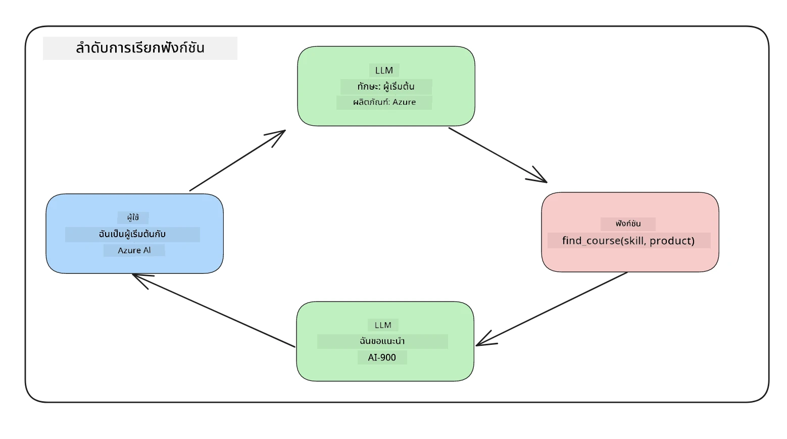
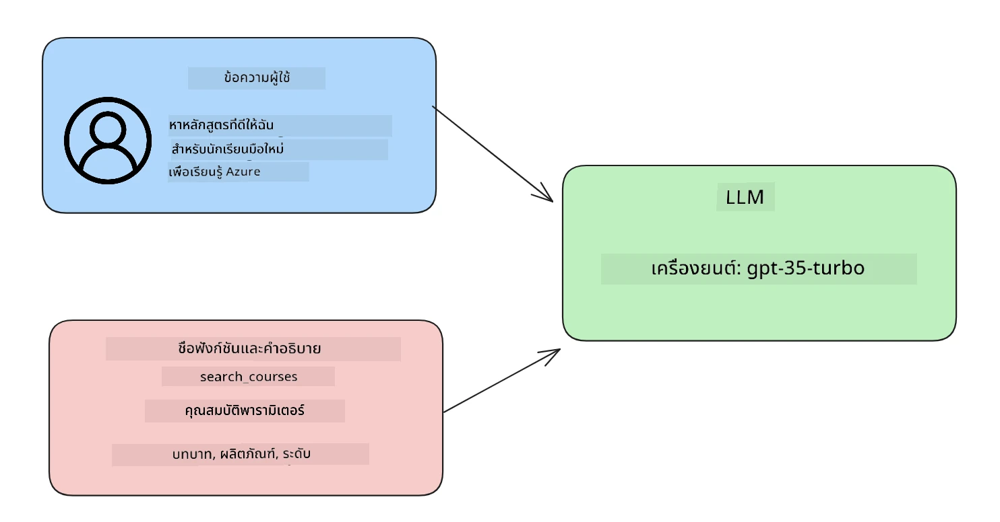

# การรวมเข้ากับการเรียกฟังก์ชัน

[](https://youtu.be/DgUdCLX8qYQ?si=f1ouQU5HQx6F8Gl2)

คุณได้เรียนรู้มาอย่างมากในบทเรียนก่อนหน้านี้ อย่างไรก็ตาม เรายังสามารถพัฒนาได้อีก บางอย่างที่เราต้องจัดการคือ วิธีที่เราจะได้รับรูปแบบการตอบกลับที่สม่ำเสมอยิ่งขึ้นเพื่อให้ง่ายต่อการทำงานกับการตอบกลับในขั้นตอนถัดไป นอกจากนี้เราอาจต้องการเพิ่มข้อมูลจากแหล่งอื่นเพื่อเพิ่มคุณค่าให้กับแอปพลิเคชันของเรา

ปัญหาที่กล่าวมาเป็นสิ่งที่บทนี้ตั้งใจจะแก้ไข

## บทนำ

บทเรียนนี้จะครอบคลุม:

- อธิบายว่าการเรียกฟังก์ชันคืออะไรและกรณีการใช้งานของมัน
- การสร้างการเรียกฟังก์ชันโดยใช้ Azure OpenAI
- วิธีการรวมการเรียกฟังก์ชันเข้ากับแอปพลิเคชัน

## เป้าหมายการเรียนรู้

เมื่อสิ้นสุดบทเรียนนี้ คุณจะสามารถ:

- อธิบายวัตถุประสงค์ของการใช้การเรียกฟังก์ชัน
- ตั้งค่าการเรียกฟังก์ชันโดยใช้บริการ Azure OpenAI
- ออกแบบการเรียกฟังก์ชันที่มีประสิทธิภาพสำหรับกรณีการใช้งานของแอปพลิเคชันของคุณ

## สถานการณ์: การปรับปรุงแชทบอทของเราด้วยฟังก์ชัน

สำหรับบทเรียนนี้ เราต้องการสร้างคุณสมบัติสำหรับสตาร์ทอัปด้านการศึกษาของเรา ที่อนุญาตให้ผู้ใช้ใช้แชทบอทเพื่อค้นหาหลักสูตรเทคนิค เราจะให้คำแนะนำหลักสูตรที่เหมาะสมกับระดับทักษะ บทบาทปัจจุบัน และเทคโนโลยีที่สนใจ

ในการทำสถานการณ์นี้ให้เสร็จสิ้น เราจะใช้การผสมผสานของ:

- `Azure OpenAI` เพื่อสร้างประสบการณ์แชทสำหรับผู้ใช้
- `Microsoft Learn Catalog API` เพื่อช่วยให้ผู้ใช้ค้นหาหลักสูตรตามคำขอของผู้ใช้
- `Function Calling` เพื่อนำคำค้นหาของผู้ใช้และส่งไปยังฟังก์ชันเพื่อดำเนินการร้องขอ API

เพื่อเริ่มต้น มาดูกันว่าทำไมเราถึงต้องการใช้การเรียกฟังก์ชันในตอนแรก:

## ทำไมต้องเรียกฟังก์ชัน

ก่อนการเรียกฟังก์ชัน การตอบกลับจาก LLM ไม่มีโครงสร้างและไม่สม่ำเสมอ นักพัฒนาต้องเขียนโค้ดตรวจสอบที่ซับซ้อนเพื่อให้แน่ใจว่าสามารถจัดการกับความแปรปรวนของการตอบกลับได้ ผู้ใช้ไม่สามารถรับคำตอบเช่น "สภาพอากาศปัจจุบันในสตอกโฮล์มเป็นอย่างไร?" เพราะโมเดลถูกจำกัดด้วยข้อมูลที่ฝึกสอนในช่วงเวลาหนึ่ง

การเรียกฟังก์ชันเป็นคุณสมบัติของบริการ Azure OpenAI เพื่อแก้ไขข้อจำกัดดังต่อไปนี้:

- **รูปแบบการตอบกลับที่สม่ำเสมอ** ถ้าเราสามารถควบคุมรูปแบบการตอบกลับได้ดีขึ้น เราจะรวมการตอบกลับเข้ากับระบบอื่นได้ง่ายขึ้น
- **ข้อมูลภายนอก** ความสามารถในการใช้ข้อมูลจากแหล่งอื่นของแอปพลิเคชันในบริบทของการสนทนา

## อธิบายปัญหาผ่านสถานการณ์

> เราขอแนะนำให้ใช้ [สมุดบันทึกที่แนบมา](./python/aoai-assignment.ipynb?WT.mc_id=academic-105485-koreyst) หากคุณต้องการรันสถานการณ์ด้านล่าง คุณยังสามารถอ่านตามไปด้วยในขณะที่เราพยายามอธิบายปัญหาที่ฟังก์ชันช่วยแก้ได้

มาดูตัวอย่างที่แสดงปัญหารูปแบบการตอบกลับ:

สมมติว่าเราต้องการสร้างฐานข้อมูลข้อมูลนักเรียนเพื่อที่จะเสนอหลักสูตรที่เหมาะสมแก่พวกเขา ด้านล่างนี้เรามีคำอธิบายสองรายการของนักเรียนที่เกือบเหมือนกันในข้อมูลที่พวกเขามี

1. สร้างการเชื่อมต่อไปยังทรัพยากร Azure OpenAI ของเรา:

   ```python
   import os
   import json
   from openai import OpenAI
   from dotenv import load_dotenv
   load_dotenv()

   # API ตอบกลับให้บริการจาก Azure OpenAI (Microsoft Foundry) v1
   # จุดเชื่อมต่อ ดังนั้นเราจึงชี้ไคลเอนต์ OpenAI ไปที่ <your-endpoint>/openai/v1/.
   endpoint = os.environ['AZURE_OPENAI_ENDPOINT']
   client = OpenAI(
   api_key=os.environ['AZURE_OPENAI_API_KEY'],
   base_url=f"{endpoint.rstrip('/')}/openai/v1/",
   )

   deployment=os.environ['AZURE_OPENAI_DEPLOYMENT']
   ```

   ด้านล่างนี้เป็นโค้ด Python สำหรับกำหนดค่าการเชื่อมต่อของเราไปยัง Azure OpenAI เนื่องจากเราใช้ปลายทาง v1 เราจึงเพียงตั้งค่า `api_key` และ `base_url` เท่านั้น (ไม่ต้องตั้งค่า `api_version`)

1. สร้างคำอธิบายนักเรียนสองคนโดยใช้ตัวแปร `student_1_description` และ `student_2_description`

   ```python
   student_1_description="Emily Johnson is a sophomore majoring in computer science at Duke University. She has a 3.7 GPA. Emily is an active member of the university's Chess Club and Debate Team. She hopes to pursue a career in software engineering after graduating."

   student_2_description = "Michael Lee is a sophomore majoring in computer science at Stanford University. He has a 3.8 GPA. Michael is known for his programming skills and is an active member of the university's Robotics Club. He hopes to pursue a career in artificial intelligence after finishing his studies."
   ```

   เราต้องการส่งคำอธิบายของนักเรียนข้างต้นไปยัง LLM เพื่อวิเคราะห์ข้อมูล ข้อมูลนี้สามารถใช้ในแอปพลิเคชันของเราและส่งไปยัง API หรือเก็บในฐานข้อมูลได้

1. สร้างพรอมต์สองตัวเหมือนกันซึ่งเราสั่งให้ LLM ว่าสิ่งที่เราสนใจคืออะไร:

   ```python
   prompt1 = f'''
   Please extract the following information from the given text and return it as a JSON object:

   name
   major
   school
   grades
   club

   This is the body of text to extract the information from:
   {student_1_description}
   '''

   prompt2 = f'''
   Please extract the following information from the given text and return it as a JSON object:

   name
   major
   school
   grades
   club

   This is the body of text to extract the information from:
   {student_2_description}
   '''
   ```

   พรอมต์ด้านบนสั่งให้ LLM ดึงข้อมูลและส่งกลับการตอบสนองในรูปแบบ JSON

1. หลังจากตั้งค่าพรอมต์และการเชื่อมต่อไปยัง Azure OpenAI แล้ว เราจะส่งพรอมต์ไปยัง LLM โดยใช้ `client.responses.create` เราจัดเก็บพรอมต์ในตัวแปร `input` และกำหนดบทบาทเป็น `user` เพื่อเลียนแบบข้อความที่ผู้ใช้เขียนให้แชทบอท

   ```python
   # การตอบกลับจากพรอมต์หนึ่ง
   openai_response1 = client.responses.create(
   model=deployment,
   input = [{'role': 'user', 'content': prompt1}],
   store=False,
   )
   openai_response1.output_text

   # การตอบกลับจากพรอมต์สอง
   openai_response2 = client.responses.create(
   model=deployment,
   input = [{'role': 'user', 'content': prompt2}],
   store=False,
   )
   openai_response2.output_text
   ```

ตอนนี้เราสามารถส่งคำขอทั้งสองไปยัง LLM และตรวจสอบการตอบกลับที่ได้รับโดยการค้นหาเช่น `openai_response1.output_text`

1. สุดท้าย เราสามารถแปลงการตอบกลับเป็นรูปแบบ JSON โดยเรียกใช้ `json.loads`:

   ```python
   # กำลังโหลดการตอบสนองในรูปแบบวัตถุ JSON
   json_response1 = json.loads(openai_response1.output_text)
   json_response1
   ```

   การตอบกลับ 1:

   ```json
   {
     "name": "Emily Johnson",
     "major": "computer science",
     "school": "Duke University",
     "grades": "3.7",
     "club": "Chess Club"
   }
   ```

   การตอบกลับ 2:

   ```json
   {
     "name": "Michael Lee",
     "major": "computer science",
     "school": "Stanford University",
     "grades": "3.8 GPA",
     "club": "Robotics Club"
   }
   ```

   แม้ว่าพรอมต์จะเหมือนกันและคำอธิบายจะคล้ายกัน แต่เราจะเห็นค่าของคุณสมบัติ `Grades` ที่มีรูปแบบต่างกัน บางครั้งเราอาจได้รูปแบบ `3.7` หรือ `3.7 GPA` เป็นตัวอย่าง

   ผลลัพธ์นี้เกิดจาก LLM รับข้อมูลที่ไม่มีโครงสร้างในรูปแบบของพรอมต์ที่เขียน แล้วส่งกลับข้อมูลที่ไม่มีโครงสร้างเช่นกัน เราจำเป็นต้องมีรูปแบบที่มีโครงสร้างเพื่อให้ทราบว่าจะคาดหวังอะไรเมื่อเก็บหรือใช้งานข้อมูลนี้

แล้วเราจะแก้ปัญหารูปแบบนี้อย่างไร? โดยใช้การเรียกฟังก์ชัน เราสามารถมั่นใจว่าได้รับข้อมูลที่มีโครงสร้างกลับมา เมื่อใช้การเรียกฟังก์ชัน LLM จะไม่ได้เรียกใช้หรือลงมือทำฟังก์ชันใด ๆ จริง ๆ แต่เราสร้างโครงสร้างให้ LLM เป็นแนวทางสำหรับการตอบกลับ จากนั้นเราใช้การตอบกลับที่มีโครงสร้างเหล่านั้นเพื่อทราบว่าควรเรียกใช้ฟังก์ชันใดในแอปพลิเคชันของเรา



จากนั้นเราสามารถนำสิ่งที่ได้รับจากฟังก์ชันนั้นไปส่งกลับไปยัง LLM ได้ LLM จะตอบกลับโดยใช้ภาษาธรรมชาติเพื่อตอบสนองคำถามของผู้ใช้

## กรณีการใช้งานของการใช้การเรียกฟังก์ชัน

มีกรณีการใช้งานหลายกรณีที่การเรียกฟังก์ชันสามารถปรับปรุงแอปของคุณได้ เช่น:

- **การเรียกเครื่องมือภายนอก** แชทบอทมีความสามารถดีในการให้คำตอบต่อคำถามของผู้ใช้ ด้วยการใช้การเรียกฟังก์ชัน แชทบอทสามารถใช้ข้อความจากผู้ใช้เพื่อตอบสนองงานบางอย่าง เช่น นักเรียนอาจขอให้แชทบอท "ส่งอีเมลถึงผู้สอนของฉันว่า ฉันต้องการความช่วยเหลือเพิ่มเติมในวิชานี้" ซึ่งจะทำการเรียกฟังก์ชัน `send_email(to: string, body: string)`

- **สร้างคำขอ API หรือฐานข้อมูล** ผู้ใช้สามารถค้นหาข้อมูลโดยใช้ภาษาธรรมชาติที่ถูกแปลงเป็นคำค้นหรือคำขอ API ที่มีรูปแบบ ตัวอย่างเช่น ครูที่ร้องขอว่า "ใครเป็นนักเรียนที่ส่งงานล่าสุดแล้ว" ซึ่งอาจทำการเรียกฟังก์ชันที่ชื่อ `get_completed(student_name: string, assignment: int, current_status: string)`

- **การสร้างข้อมูลที่มีโครงสร้าง** ผู้ใช้สามารถนำข้อความหรือ CSV และใช้ LLM เพื่อดึงข้อมูลสำคัญ ตัวอย่างเช่น นักเรียนสามารถแปลงบทความวิกิพีเดียเกี่ยวกับข้อตกลงสันติภาพเพื่อสร้างแฟลชการ์ด AI ได้ ซึ่งสามารถทำได้โดยใช้ฟังก์ชัน `get_important_facts(agreement_name: string, date_signed: string, parties_involved: list)`

## การสร้างการเรียกฟังก์ชันครั้งแรกของคุณ

กระบวนการสร้างการเรียกฟังก์ชันประกอบด้วย 3 ขั้นตอนหลัก:

1. **เรียกใช้** Responses API พร้อมรายการของฟังก์ชัน (เครื่องมือ) และข้อความจากผู้ใช้
2. **อ่าน** การตอบกลับของโมเดลเพื่อดำเนินการ เช่น การเรียกฟังก์ชันหรือการเรียก API
3. **ทำ** การเรียกอีกครั้งหนึ่งไปยัง Responses API โดยใช้ผลลัพธ์จากการทำงานของฟังก์ชันเพื่อใช้ข้อมูลนั้นสร้างการตอบกลับให้กับผู้ใช้



### ขั้นตอนที่ 1 - การสร้างข้อความ

ขั้นตอนแรกคือการสร้างข้อความผู้ใช้ ข้อความนี้อาจถูกกำหนดแบบไดนามิกโดยการรับค่าจากอินพุตข้อความ หรือคุณสามารถกำหนดค่าได้ที่นี่ หากนี่เป็นครั้งแรกที่คุณทำงานกับ Responses API คุณต้องกำหนด `role` และ `content` ของข้อความ

`role` สามารถเป็น `system` (สร้างกฎ), `assistant` (โมเดล) หรือ `user` (ผู้ใช้ปลายทาง) สำหรับการเรียกฟังก์ชัน เราจะกำหนดเป็น `user` และถามคำถามตัวอย่าง

```python
messages= [ {"role": "user", "content": "Find me a good course for a beginner student to learn Azure."} ]
```

โดยการกำหนดบทบาทต่างกัน ทำให้ LLM รับรู้ว่าข้อความมาจากระบบหรือผู้ใช้ ซึ่งช่วยสร้างประวัติการสนทนาให้ LLM สามารถใช้ต่อยอดได้

### ขั้นตอนที่ 2 - การสร้างฟังก์ชัน

ต่อไปเราจะกำหนดฟังก์ชันและพารามิเตอร์ของฟังก์ชันนั้น ที่นี่เราใช้ฟังก์ชันเดียวชื่อ `search_courses` แต่คุณสามารถสร้างหลายฟังก์ชันได้

> **สำคัญ**: ฟังก์ชันจะถูกรวมในข้อความระบบถึง LLM และจะนับรวมในจำนวนโทเคนที่คุณมีใช้งาน

ด้านล่างนี้ เราสร้างฟังก์ชันเป็นอาร์เรย์ของรายการ แต่ละรายการเป็นเครื่องมือในรูปแบบ Responses API แบบง่าย โดยมีคุณสมบัติ `type`, `name`, `description` และ `parameters`:

```python
functions = [
   {
      "type":"function",
      "name":"search_courses",
      "description":"Retrieves courses from the search index based on the parameters provided",
      "parameters":{
         "type":"object",
         "properties":{
            "role":{
               "type":"string",
               "description":"The role of the learner (i.e. developer, data scientist, student, etc.)"
            },
            "product":{
               "type":"string",
               "description":"The product that the lesson is covering (i.e. Azure, Power BI, etc.)"
            },
            "level":{
               "type":"string",
               "description":"The level of experience the learner has prior to taking the course (i.e. beginner, intermediate, advanced)"
            }
         },
         "required":[
            "role"
         ]
      }
   }
]
```

มาดูรายละเอียดของแต่ละอินสแตนซ์ของฟังก์ชันด้านล่าง:

- `name` - ชื่อของฟังก์ชันที่ต้องการให้เรียกใช้
- `description` - คำอธิบายว่าฟังก์ชันทำงานอย่างไร ซึ่งควรชัดเจนและเฉพาะเจาะจง
- `parameters` - รายการของค่าที่ต้องการและรูปแบบที่ต้องการให้โมเดลสร้างในการตอบกลับ อาร์เรย์นี้ประกอบด้วยรายการที่มีคุณสมบัติดังนี้:
  1.  `type` - ประเภทข้อมูลของคุณสมบัติที่จะจัดเก็บ
  1.  `properties` - รายการของค่าที่เจาะจงที่โมเดลจะใช้ในการตอบกลับ
      1. `name` - กุญแจเป็นชื่อคุณสมบัติที่โมเดลจะใช้ในรูปแบบที่จัดเรียง เช่น `product`
      1. `type` - ประเภทข้อมูลของคุณสมบัตินี้ เช่น `string`
      1. `description` - คำอธิบายของคุณสมบัติเฉพาะ

ยังมีคุณสมบัติเสริม `required` - คุณสมบัติที่จำเป็นสำหรับการเรียกฟังก์ชันให้สำเร็จ

### ขั้นตอนที่ 3 - การเรียกใช้ฟังก์ชัน

หลังจากกำหนดฟังก์ชันเสร็จแล้ว เราต้องใส่ฟังก์ชันนั้นในการเรียก Responses API โดยเพิ่ม `tools` เข้าไปในคำขอ ในกรณีนี้คือ `tools=functions`

นอกจากนี้ยังมีตัวเลือกกำหนด `tool_choice` เป็น `auto` ซึ่งหมายความว่าเราจะปล่อยให้ LLM ตัดสินใจว่าเมื่อใดควรเรียกฟังก์ชันตามข้อความของผู้ใช้แทนที่จะกำหนดเอง

นี่คือตัวอย่างโค้ดที่เรียก `client.responses.create` สังเกตวิธีตั้งค่า `tools=functions` และ `tool_choice="auto"` เพื่อให้ LLM เลือกว่าจะเรียกฟังก์ชันเมื่อใดที่เราจัดเตรียมให้:

```python
response = client.responses.create(model=deployment,
                                        input=messages,
                                        tools=functions,
                                        tool_choice="auto",
                                        store=False)

print(response.output)
```

การตอบกลับที่ได้รับตอนนี้มีรายการ `function_call` ใน `response.output` ที่มีลักษณะดังนี้:

```json
{
  "type": "function_call",
  "name": "search_courses",
  "call_id": "call_abc123",
  "arguments": "{\n  \"role\": \"student\",\n  \"product\": \"Azure\",\n  \"level\": \"beginner\"\n}"
}
```

ที่นี่เราจะเห็นว่าฟังก์ชัน `search_courses` ถูกเรียกใช้พร้อมกับอาร์กิวเมนต์อะไรบ้าง ที่ระบุในคุณสมบัติ `arguments` ในการตอบกลับ JSON

ข้อสรุปคือ LLM สามารถค้นหาข้อมูลที่เหมาะสมกับอาร์กิวเมนต์ของฟังก์ชันได้ เนื่องจากมันดึงข้อมูลจากค่าที่ส่งเข้าพารามิเตอร์ `input` ในการเรียก Responses API ด้านล่างนี้เป็นการเตือนความจำของค่า `messages`:

```python
messages= [ {"role": "user", "content": "Find me a good course for a beginner student to learn Azure."} ]
```

อย่างที่เห็นว่า `student`, `Azure` และ `beginner` ถูกดึงมาจาก `messages` และตั้งเป็นอินพุตของฟังก์ชัน การใช้ฟังก์ชันแบบนี้เป็นวิธีที่ดีในการดึงข้อมูลจากพรอมต์แต่ยังช่วยให้มีโครงสร้างแก่ LLM และทำให้มีฟังก์ชันการใช้งานที่นำกลับมาใช้ใหม่ได้

ต่อไป เราต้องดูวิธีใช้งานสิ่งนี้ในแอปของเรา

## การรวมการเรียกฟังก์ชันเข้ากับแอปพลิเคชัน

หลังจากเราทดสอบการตอบกลับที่มีรูปแบบจาก LLM แล้ว เราสามารถรวมสิ่งนี้เข้ากับแอปพลิเคชันได้

### การจัดการลำดับงาน

เพื่อรวมสิ่งนี้เข้ากับแอปพลิเคชันของเรา ให้ทำตามขั้นตอนต่อไปนี้:

1. ขั้นแรก ให้เรียกใช้บริการ OpenAI และดึงรายการการเรียกฟังก์ชันจากการตอบกลับ `output`

   ```python
   response_items = response.output
   tool_calls = [item for item in response_items if item.type == "function_call"]
   ```

1. ตอนนี้เราจะกำหนดฟังก์ชันที่จะเรียก Microsoft Learn API เพื่อดึงรายการหลักสูตร:

   ```python
   import requests

   def search_courses(role, product, level):
     url = "https://learn.microsoft.com/api/catalog/"
     params = {
        "role": role,
        "product": product,
        "level": level
     }
     response = requests.get(url, params=params)
     modules = response.json()["modules"]
     results = []
     for module in modules[:5]:
        title = module["title"]
        url = module["url"]
        results.append({"title": title, "url": url})
     return str(results)
   ```

   สังเกตว่าเราได้สร้างฟังก์ชัน Python จริงที่แมปกับชื่อฟังก์ชันที่กล่าวไว้ในตัวแปร `functions` เราเรียกใช้ API ภายนอกจริง ๆ เพื่อดึงข้อมูลที่เราต้องการ ในกรณีนี้คือค้นหาหลักสูตรฝึกอบรมจาก Microsoft Learn API

โอเค ดังนั้นเราสร้างตัวแปร `functions` และกำหนดฟังก์ชันใน Python ที่สอดคล้องกันแล้ว เราจะบอก LLM ให้จับคู่สองสิ่งนี้อย่างไรเพื่อให้ฟังก์ชัน Python ของเราได้ถูกเรียก?

1. เพื่อดูว่าเราต้องเรียกฟังก์ชัน Python หรือไม่ ให้ดูในการตอบกลับของ LLM ว่ามีรายการ `function_call` หรือไม่ และเรียกใช้ฟังก์ชันที่ถูกชี้ชัด นี่คือวิธีตรวจสอบตามที่กล่าวไว้ด้านล่าง:

   ```python
   # ตรวจสอบว่ารุ่นต้องการเรียกใช้ฟังก์ชันหรือไม่
   if tool_calls:
    for tool_call in tool_calls:
     print("Recommended Function call:")
     print(tool_call.name)
     print()

     # เรียกใช้ฟังก์ชัน
     function_name = tool_call.name

     available_functions = {
             "search_courses": search_courses,
     }
     function_to_call = available_functions[function_name]

     function_args = json.loads(tool_call.arguments)
     function_response = function_to_call(**function_args)

     print("Output of function call:")
     print(function_response)
     print(type(function_response))

     # เพิ่มการเรียกใช้ฟังก์ชันและผลลัพธ์กลับไปยังบทสนทนา
     # รายการ function_call ของรุ่นจะต้องถูกแนบก่อนผลลัพธ์ของมัน
     messages.append(tool_call)  # รายการ function_call ของผู้ช่วย
     messages.append( # ผลลัพธ์ของฟังก์ชัน
         {
             "type": "function_call_output",
             "call_id": tool_call.call_id,
             "output": function_response,
         }
     )
   ```

   สามบรรทัดนี้ ทำให้แน่ใจว่าเราดึงชื่อฟังก์ชันและอาร์กิวเมนต์ออกมาแล้วเรียกฟังก์ชันนั้น:

   ```python
   function_to_call = available_functions[function_name]

   function_args = json.loads(tool_call.arguments)
   function_response = function_to_call(**function_args)
   ```

   ด้านล่างนี้เป็นผลลัพธ์จากการรันโค้ดของเรา:

   **ผลลัพธ์**

   ```Recommended Function call:
   {
     "name": "search_courses",
     "arguments": "{\n  \"role\": \"student\",\n  \"product\": \"Azure\",\n  \"level\": \"beginner\"\n}"
   }

   Output of function call:
   [{'title': 'Describe concepts of cryptography', 'url': 'https://learn.microsoft.com/training/modules/describe-concepts-of-cryptography/?
   WT.mc_id=api_CatalogApi'}, {'title': 'Introduction to audio classification with TensorFlow', 'url': 'https://learn.microsoft.com/en-
   us/training/modules/intro-audio-classification-tensorflow/?WT.mc_id=api_CatalogApi'}, {'title': 'Design a Performant Data Model in Azure SQL
   Database with Azure Data Studio', 'url': 'https://learn.microsoft.com/training/modules/design-a-data-model-with-ads/?
   WT.mc_id=api_CatalogApi'}, {'title': 'Getting started with the Microsoft Cloud Adoption Framework for Azure', 'url':
   'https://learn.microsoft.com/training/modules/cloud-adoption-framework-getting-started/?WT.mc_id=api_CatalogApi'}, {'title': 'Set up the
   Rust development environment', 'url': 'https://learn.microsoft.com/training/modules/rust-set-up-environment/?WT.mc_id=api_CatalogApi'}]
   <class 'str'>
   ```

1. ตอนนี้เราจะส่งข้อความที่อัพเดตแล้ว คือ `messages` ต่อไปยัง LLM เพื่อให้เราได้รับการตอบกลับด้วยภาษาธรรมชาติแทนการตอบกลับในรูปแบบ JSON API

   ```python
   print("Messages in next request:")
   print(messages)
   print()

   second_response = client.responses.create(
      input=messages,
      model=deployment,
      tool_choice="auto",
      tools=functions,
      temperature=0,
      store=False,
         )  # รับการตอบกลับใหม่จากโมเดลที่สามารถเห็นการตอบกลับของฟังก์ชันได้


   print(second_response.output_text)
   ```

   **ผลลัพธ์**

   ```text
   I found some good courses for beginner students to learn Azure:

   1. [Describe concepts of cryptography](https://learn.microsoft.com/training/modules/describe-concepts-of-cryptography/?WT.mc_id=api_CatalogApi)
   2. [Introduction to audio classification with TensorFlow](https://learn.microsoft.com/training/modules/intro-audio-classification-tensorflow/?WT.mc_id=api_CatalogApi)
   3. [Design a Performant Data Model in Azure SQL Database with Azure Data Studio](https://learn.microsoft.com/training/modules/design-a-data-model-with-ads/?WT.mc_id=api_CatalogApi)
   4. [Getting started with the Microsoft Cloud Adoption Framework for Azure](https://learn.microsoft.com/training/modules/cloud-adoption-framework-getting-started/?WT.mc_id=api_CatalogApi)
   5. [Set up the Rust development environment](https://learn.microsoft.com/training/modules/rust-set-up-environment/?WT.mc_id=api_CatalogApi)

   You can click on the links to access the courses.
   ```

## แบบฝึกหัด

เพื่อเรียนรู้เพิ่มเติมเกี่ยวกับ Azure OpenAI Function Calling คุณสามารถสร้าง:

- พารามิเตอร์เพิ่มเติมของฟังก์ชันที่อาจช่วยให้ผู้เรียนค้นหาหลักสูตรได้มากขึ้น

- สร้างฟังก์ชันเรียกใช้งานอีกตัวที่รับข้อมูลเพิ่มเติมจากผู้เรียน เช่น ภาษาแม่ของพวกเขา
- สร้างการจัดการข้อผิดพลาดเมื่อฟังก์ชันเรียกใช้งานและ/หรือการเรียก API ไม่ส่งคืนหลักสูตรที่เหมาะสม

เคล็ดลับ: ทำตามหน้าของ [เอกสารอ้างอิง API การเรียนรู้](https://learn.microsoft.com/training/support/catalog-api-developer-reference?WT.mc_id=academic-105485-koreyst) เพื่อดูว่าข้อมูลนี้มีให้ที่ไหนและอย่างไร

## งานดีมาก! ดำเนินการเดินทางต่อไป

หลังจากเสร็จบทเรียนนี้แล้ว ลองดูที่ [คอลเลกชันการเรียนรู้ Generative AI ของเรา](https://aka.ms/genai-collection?WT.mc_id=academic-105485-koreyst) เพื่อพัฒนาความรู้เกี่ยวกับ Generative AI ให้มากขึ้น!

ไปที่บทเรียนที่ 12 ซึ่งเราจะดูวิธี [ออกแบบ UX สำหรับแอปพลิเคชัน AI](../12-designing-ux-for-ai-applications/README.md?WT.mc_id=academic-105485-koreyst)!

---

<!-- CO-OP TRANSLATOR DISCLAIMER START -->
**ปฏิเสธความรับผิดชอบ**:
เอกสารนี้ได้รับการแปลโดยใช้บริการแปลภาษา AI [Co-op Translator](https://github.com/Azure/co-op-translator) ขณะที่เราพยายามให้ความถูกต้อง โปรดทราบว่าการแปลโดยอัตโนมัติอาจมีข้อผิดพลาดหรือความไม่ถูกต้อง เอกสารต้นฉบับในภาษาต้นทางควรถูกพิจารณาเป็นแหล่งข้อมูลที่เชื่อถือได้ สำหรับข้อมูลที่สำคัญ แนะนำให้ใช้การแปลโดยมนุษย์มืออาชีพ เราไม่รับผิดชอบต่อความเข้าใจผิดหรือการตีความที่ผิดพลาดที่เกิดขึ้นจากการใช้การแปลนี้
<!-- CO-OP TRANSLATOR DISCLAIMER END -->