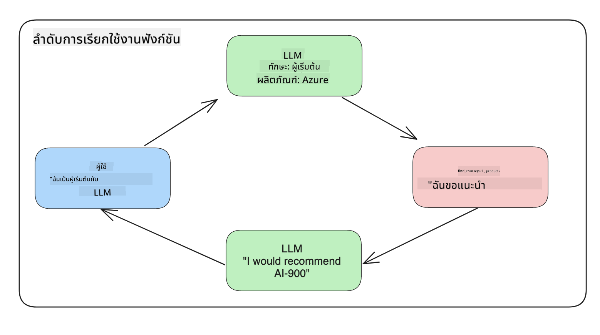
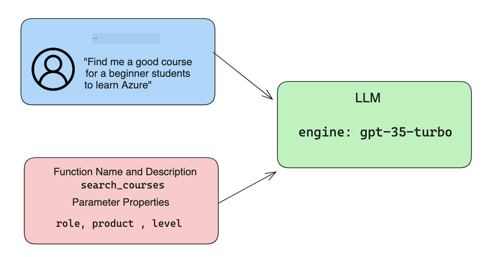

<!--
CO_OP_TRANSLATOR_METADATA:
{
  "original_hash": "f6f84f9ef2d066cd25850cab93580a50",
  "translation_date": "2025-10-17T18:34:51+00:00",
  "source_file": "11-integrating-with-function-calling/README.md",
  "language_code": "th"
}
-->
# การรวมเข้ากับการเรียกฟังก์ชัน

[](https://youtu.be/DgUdCLX8qYQ?si=f1ouQU5HQx6F8Gl2)

คุณได้เรียนรู้มามากพอสมควรในบทเรียนก่อนหน้า อย่างไรก็ตาม เรายังสามารถปรับปรุงเพิ่มเติมได้ สิ่งที่เราสามารถแก้ไขได้คือการทำให้รูปแบบการตอบกลับมีความสม่ำเสมอมากขึ้นเพื่อให้ง่ายต่อการใช้งานในขั้นตอนต่อไป นอกจากนี้ เราอาจต้องการเพิ่มข้อมูลจากแหล่งอื่นเพื่อเพิ่มคุณค่าให้กับแอปพลิเคชันของเรา

ปัญหาที่กล่าวถึงข้างต้นคือสิ่งที่บทนี้มุ่งเน้นแก้ไข

## บทนำ

บทเรียนนี้จะครอบคลุม:

- อธิบายว่าการเรียกฟังก์ชันคืออะไรและกรณีการใช้งาน
- การสร้างการเรียกฟังก์ชันโดยใช้ Azure OpenAI
- วิธีการรวมการเรียกฟังก์ชันเข้ากับแอปพลิเคชัน

## เป้าหมายการเรียนรู้

เมื่อจบบทเรียนนี้ คุณจะสามารถ:

- อธิบายวัตถุประสงค์ของการใช้การเรียกฟังก์ชัน
- ตั้งค่าการเรียกฟังก์ชันโดยใช้บริการ Azure OpenAI
- ออกแบบการเรียกฟังก์ชันที่มีประสิทธิภาพสำหรับกรณีการใช้งานของแอปพลิเคชันของคุณ

## สถานการณ์: ปรับปรุงแชทบอทของเราด้วยฟังก์ชัน

สำหรับบทเรียนนี้ เราต้องการสร้างฟีเจอร์สำหรับสตาร์ทอัพด้านการศึกษาของเราที่ช่วยให้ผู้ใช้สามารถใช้แชทบอทเพื่อค้นหาคอร์สเทคนิค เราจะแนะนำคอร์สที่เหมาะสมกับระดับทักษะ บทบาทปัจจุบัน และเทคโนโลยีที่สนใจของพวกเขา

เพื่อทำให้สถานการณ์นี้สำเร็จ เราจะใช้การผสมผสานของ:

- `Azure OpenAI` เพื่อสร้างประสบการณ์การแชทสำหรับผู้ใช้
- `Microsoft Learn Catalog API` เพื่อช่วยผู้ใช้ค้นหาคอร์สตามคำขอของผู้ใช้
- `Function Calling` เพื่อรับคำถามของผู้ใช้และส่งไปยังฟังก์ชันเพื่อทำการเรียก API

เริ่มต้นกันเลย มาดูกันว่าทำไมเราถึงต้องการใช้การเรียกฟังก์ชันตั้งแต่แรก:

## ทำไมต้องใช้การเรียกฟังก์ชัน

ก่อนการเรียกฟังก์ชัน การตอบกลับจาก LLM นั้นไม่มีโครงสร้างและไม่สม่ำเสมอ นักพัฒนาต้องเขียนโค้ดการตรวจสอบที่ซับซ้อนเพื่อให้แน่ใจว่าสามารถจัดการกับรูปแบบการตอบกลับที่หลากหลายได้ ผู้ใช้ไม่สามารถรับคำตอบเช่น "สภาพอากาศปัจจุบันในสตอกโฮล์มเป็นอย่างไร?" ได้ เนื่องจากโมเดลถูกจำกัดอยู่ที่เวลาที่ข้อมูลถูกฝึกฝน

การเรียกฟังก์ชันเป็นฟีเจอร์ของบริการ Azure OpenAI เพื่อเอาชนะข้อจำกัดดังต่อไปนี้:

- **รูปแบบการตอบกลับที่สม่ำเสมอ** หากเราสามารถควบคุมรูปแบบการตอบกลับได้ดีขึ้น เราก็สามารถรวมการตอบกลับเข้ากับระบบอื่นได้ง่ายขึ้น
- **ข้อมูลภายนอก** ความสามารถในการใช้ข้อมูลจากแหล่งอื่นของแอปพลิเคชันในบริบทการแชท

## การแสดงปัญหาผ่านสถานการณ์

> เราแนะนำให้คุณใช้ [notebook ที่รวมอยู่](./python/aoai-assignment.ipynb?WT.mc_id=academic-105485-koreyst) หากคุณต้องการรันสถานการณ์ด้านล่างนี้ หรือคุณสามารถอ่านตามไปเพื่อดูปัญหาที่ฟังก์ชันสามารถช่วยแก้ไขได้

มาดูตัวอย่างที่แสดงปัญหารูปแบบการตอบกลับ:

สมมติว่าเราต้องการสร้างฐานข้อมูลของข้อมูลนักเรียนเพื่อที่เราจะสามารถแนะนำคอร์สที่เหมาะสมให้กับพวกเขา ด้านล่างนี้เรามีคำอธิบายของนักเรียนสองคนที่มีข้อมูลที่คล้ายกันมาก

1. สร้างการเชื่อมต่อกับทรัพยากร Azure OpenAI ของเรา:

   ```python
   import os
   import json
   from openai import AzureOpenAI
   from dotenv import load_dotenv
   load_dotenv()

   client = AzureOpenAI(
   api_key=os.environ['AZURE_OPENAI_API_KEY'],  # this is also the default, it can be omitted
   api_version = "2023-07-01-preview"
   )

   deployment=os.environ['AZURE_OPENAI_DEPLOYMENT']
   ```

   ด้านล่างนี้เป็นโค้ด Python สำหรับการตั้งค่าการเชื่อมต่อกับ Azure OpenAI โดยเรากำหนด `api_type`, `api_base`, `api_version` และ `api_key`

1. สร้างคำอธิบายของนักเรียนสองคนโดยใช้ตัวแปร `student_1_description` และ `student_2_description`

   ```python
   student_1_description="Emily Johnson is a sophomore majoring in computer science at Duke University. She has a 3.7 GPA. Emily is an active member of the university's Chess Club and Debate Team. She hopes to pursue a career in software engineering after graduating."

   student_2_description = "Michael Lee is a sophomore majoring in computer science at Stanford University. He has a 3.8 GPA. Michael is known for his programming skills and is an active member of the university's Robotics Club. He hopes to pursue a career in artificial intelligence after finishing his studies."
   ```

   เราต้องการส่งคำอธิบายของนักเรียนด้านบนไปยัง LLM เพื่อแยกข้อมูล ข้อมูลนี้สามารถใช้ในแอปพลิเคชันของเราและส่งไปยัง API หรือเก็บไว้ในฐานข้อมูล

1. สร้างคำสั่งสองคำที่เหมือนกันซึ่งเราสั่งให้ LLM เกี่ยวกับข้อมูลที่เราสนใจ:

   ```python
   prompt1 = f'''
   Please extract the following information from the given text and return it as a JSON object:

   name
   major
   school
   grades
   club

   This is the body of text to extract the information from:
   {student_1_description}
   '''

   prompt2 = f'''
   Please extract the following information from the given text and return it as a JSON object:

   name
   major
   school
   grades
   club

   This is the body of text to extract the information from:
   {student_2_description}
   '''
   ```

   คำสั่งด้านบนสั่งให้ LLM ดึงข้อมูลและส่งกลับในรูปแบบ JSON

1. หลังจากตั้งค่าคำสั่งและการเชื่อมต่อกับ Azure OpenAI เราจะส่งคำสั่งไปยัง LLM โดยใช้ `openai.ChatCompletion` เราเก็บคำสั่งไว้ในตัวแปร `messages` และกำหนดบทบาทเป็น `user` เพื่อเลียนแบบข้อความจากผู้ใช้ที่เขียนถึงแชทบอท

   ```python
   # response from prompt one
   openai_response1 = client.chat.completions.create(
   model=deployment,
   messages = [{'role': 'user', 'content': prompt1}]
   )
   openai_response1.choices[0].message.content

   # response from prompt two
   openai_response2 = client.chat.completions.create(
   model=deployment,
   messages = [{'role': 'user', 'content': prompt2}]
   )
   openai_response2.choices[0].message.content
   ```

ตอนนี้เราสามารถส่งคำขอทั้งสองไปยัง LLM และตรวจสอบการตอบกลับที่เราได้รับโดยค้นหาเช่นนี้ `openai_response1['choices'][0]['message']['content']`

1. สุดท้าย เราสามารถแปลงการตอบกลับเป็นรูปแบบ JSON โดยเรียกใช้ `json.loads`:

   ```python
   # Loading the response as a JSON object
   json_response1 = json.loads(openai_response1.choices[0].message.content)
   json_response1
   ```

   การตอบกลับ 1:

   ```json
   {
     "name": "Emily Johnson",
     "major": "computer science",
     "school": "Duke University",
     "grades": "3.7",
     "club": "Chess Club"
   }
   ```

   การตอบกลับ 2:

   ```json
   {
     "name": "Michael Lee",
     "major": "computer science",
     "school": "Stanford University",
     "grades": "3.8 GPA",
     "club": "Robotics Club"
   }
   ```

   แม้ว่าคำสั่งจะเหมือนกันและคำอธิบายจะคล้ายกัน เราเห็นค่าของคุณสมบัติ `Grades` ถูกจัดรูปแบบแตกต่างกัน เช่น บางครั้งเราได้รูปแบบ `3.7` หรือ `3.7 GPA`

   ผลลัพธ์นี้เกิดจาก LLM ที่รับข้อมูลไม่มีโครงสร้างในรูปแบบของคำสั่งที่เขียนและส่งกลับข้อมูลไม่มีโครงสร้าง เราจำเป็นต้องมีรูปแบบที่มีโครงสร้างเพื่อที่เราจะได้รู้ว่าจะคาดหวังอะไรเมื่อเก็บหรือใช้ข้อมูลนี้

ดังนั้นเราจะแก้ปัญหาการจัดรูปแบบได้อย่างไร? โดยการใช้การเรียกฟังก์ชัน เราสามารถมั่นใจได้ว่าเราจะได้รับข้อมูลที่มีโครงสร้างกลับมา เมื่อใช้การเรียกฟังก์ชัน LLM จะไม่เรียกหรือรันฟังก์ชันจริง ๆ แต่เราสร้างโครงสร้างให้ LLM ปฏิบัติตามสำหรับการตอบกลับ จากนั้นเราจะใช้การตอบกลับที่มีโครงสร้างเหล่านั้นเพื่อทราบว่าควรรันฟังก์ชันใดในแอปพลิเคชันของเรา



เราสามารถนำสิ่งที่ได้จากฟังก์ชันกลับไปยัง LLM จากนั้น LLM จะตอบกลับโดยใช้ภาษาธรรมชาติเพื่อตอบคำถามของผู้ใช้

## กรณีการใช้งานสำหรับการเรียกฟังก์ชัน

มีกรณีการใช้งานที่หลากหลายที่การเรียกฟังก์ชันสามารถปรับปรุงแอปของคุณได้ เช่น:

- **การเรียกเครื่องมือภายนอก** แชทบอทเหมาะสำหรับการให้คำตอบแก่คำถามจากผู้ใช้ โดยการใช้การเรียกฟังก์ชัน แชทบอทสามารถใช้ข้อความจากผู้ใช้เพื่อทำงานบางอย่าง ตัวอย่างเช่น นักเรียนสามารถขอให้แชทบอท "ส่งอีเมลถึงอาจารย์ของฉันว่าฉันต้องการความช่วยเหลือเพิ่มเติมในหัวข้อนี้" ซึ่งสามารถทำการเรียกฟังก์ชัน `send_email(to: string, body: string)`

- **สร้างคำขอ API หรือฐานข้อมูล** ผู้ใช้สามารถค้นหาข้อมูลโดยใช้ภาษาธรรมชาติที่ถูกแปลงเป็นคำขอที่มีรูปแบบหรือคำขอ API ตัวอย่างเช่น อาจารย์ที่ขอ "นักเรียนคนใดที่ทำงานเสร็จในครั้งล่าสุด" ซึ่งสามารถเรียกฟังก์ชัน `get_completed(student_name: string, assignment: int, current_status: string)`

- **สร้างข้อมูลที่มีโครงสร้าง** ผู้ใช้สามารถนำข้อความหรือ CSV และใช้ LLM เพื่อดึงข้อมูลสำคัญจากมัน ตัวอย่างเช่น นักเรียนสามารถแปลงบทความ Wikipedia เกี่ยวกับข้อตกลงสันติภาพเพื่อสร้างแฟลชการ์ด AI สิ่งนี้สามารถทำได้โดยใช้ฟังก์ชัน `get_important_facts(agreement_name: string, date_signed: string, parties_involved: list)`

## การสร้างการเรียกฟังก์ชันครั้งแรกของคุณ

กระบวนการสร้างการเรียกฟังก์ชันประกอบด้วย 3 ขั้นตอนหลัก:

1. **การเรียก** API Chat Completions พร้อมรายการฟังก์ชันของคุณและข้อความจากผู้ใช้
2. **การอ่าน** การตอบกลับของโมเดลเพื่อดำเนินการ เช่น การรันฟังก์ชันหรือการเรียก API
3. **การทำ** การเรียก API Chat Completions อีกครั้งพร้อมการตอบกลับจากฟังก์ชันของคุณเพื่อใช้ข้อมูลนั้นในการสร้างการตอบกลับให้ผู้ใช้



### ขั้นตอนที่ 1 - การสร้างข้อความ

ขั้นตอนแรกคือการสร้างข้อความจากผู้ใช้ สิ่งนี้สามารถกำหนดค่าได้แบบไดนามิกโดยการรับค่าจากการป้อนข้อความหรือคุณสามารถกำหนดค่าได้ที่นี่ หากนี่เป็นครั้งแรกที่คุณทำงานกับ API Chat Completions เราจำเป็นต้องกำหนด `role` และ `content` ของข้อความ

`role` สามารถเป็น `system` (สร้างกฎ), `assistant` (โมเดล) หรือ `user` (ผู้ใช้ปลายทาง) สำหรับการเรียกฟังก์ชัน เราจะกำหนดเป็น `user` และคำถามตัวอย่าง

```python
messages= [ {"role": "user", "content": "Find me a good course for a beginner student to learn Azure."} ]
```

โดยการกำหนดบทบาทที่แตกต่างกัน จะทำให้ LLM เข้าใจได้ชัดเจนว่าข้อความมาจากระบบหรือผู้ใช้ ซึ่งช่วยสร้างประวัติการสนทนาที่ LLM สามารถสร้างต่อได้

### ขั้นตอนที่ 2 - การสร้างฟังก์ชัน

ต่อไป เราจะกำหนดฟังก์ชันและพารามิเตอร์ของฟังก์ชันนั้น เราจะใช้เพียงฟังก์ชันเดียวที่นี่ชื่อ `search_courses` แต่คุณสามารถสร้างฟังก์ชันหลายตัวได้

> **สำคัญ**: ฟังก์ชันจะถูกรวมอยู่ในข้อความระบบที่ส่งไปยัง LLM และจะรวมอยู่ในจำนวนโทเค็นที่คุณมีอยู่

ด้านล่างนี้ เราสร้างฟังก์ชันเป็นอาร์เรย์ของรายการ แต่ละรายการเป็นฟังก์ชันและมีคุณสมบัติ `name`, `description` และ `parameters`:

```python
functions = [
   {
      "name":"search_courses",
      "description":"Retrieves courses from the search index based on the parameters provided",
      "parameters":{
         "type":"object",
         "properties":{
            "role":{
               "type":"string",
               "description":"The role of the learner (i.e. developer, data scientist, student, etc.)"
            },
            "product":{
               "type":"string",
               "description":"The product that the lesson is covering (i.e. Azure, Power BI, etc.)"
            },
            "level":{
               "type":"string",
               "description":"The level of experience the learner has prior to taking the course (i.e. beginner, intermediate, advanced)"
            }
         },
         "required":[
            "role"
         ]
      }
   }
]
```

มาดูรายละเอียดของแต่ละฟังก์ชันด้านล่าง:

- `name` - ชื่อของฟังก์ชันที่เราต้องการให้เรียกใช้
- `description` - คำอธิบายเกี่ยวกับวิธีการทำงานของฟังก์ชัน ที่นี่สำคัญที่จะต้องชัดเจนและเฉพาะเจาะจง
- `parameters` - รายการค่าที่คุณต้องการให้โมเดลสร้างในคำตอบของมัน อาร์เรย์ `parameters` ประกอบด้วยรายการที่มีคุณสมบัติดังนี้:
  1.  `type` - ประเภทข้อมูลที่คุณสมบัติจะถูกเก็บไว้
  1.  `properties` - รายการค่าที่เฉพาะเจาะจงที่โมเดลจะใช้สำหรับคำตอบของมัน
      1. `name` - คีย์คือชื่อของคุณสมบัติที่โมเดลจะใช้ในคำตอบที่มีรูปแบบ เช่น `product`
      1. `type` - ประเภทข้อมูลของคุณสมบัติ เช่น `string`
      1. `description` - คำอธิบายของคุณสมบัติเฉพาะ

มีคุณสมบัติที่เป็นตัวเลือก `required` - คุณสมบัติที่จำเป็นสำหรับการเรียกฟังก์ชันให้เสร็จสมบูรณ์

### ขั้นตอนที่ 3 - การทำการเรียกฟังก์ชัน

หลังจากกำหนดฟังก์ชันแล้ว เราจำเป็นต้องรวมมันไว้ในคำขอไปยัง API Chat Completion เราทำสิ่งนี้โดยการเพิ่ม `functions` ลงในคำขอ ในกรณีนี้ `functions=functions`

มีตัวเลือกในการตั้งค่า `function_call` เป็น `auto` ซึ่งหมายความว่าเราจะให้ LLM ตัดสินใจว่าควรเรียกฟังก์ชันใดตามข้อความของผู้ใช้แทนที่จะกำหนดเอง

นี่คือโค้ดด้านล่างที่เราเรียก `ChatCompletion.create` สังเกตว่าเราตั้งค่า `functions=functions` และ `function_call="auto"` และให้ LLM ตัดสินใจเมื่อควรเรียกฟังก์ชันที่เรามอบให้:

```python
response = client.chat.completions.create(model=deployment,
                                        messages=messages,
                                        functions=functions,
                                        function_call="auto")

print(response.choices[0].message)
```

การตอบกลับที่กลับมาจะมีลักษณะดังนี้:

```json
{
  "role": "assistant",
  "function_call": {
    "name": "search_courses",
    "arguments": "{\n  \"role\": \"student\",\n  \"product\": \"Azure\",\n  \"level\": \"beginner\"\n}"
  }
}
```

ที่นี่เราสามารถเห็นได้ว่าฟังก์ชัน `search_courses` ถูกเรียกใช้และมีอาร์กิวเมนต์อะไรบ้างที่ระบุไว้ในคุณสมบัติ `arguments` ในการตอบกลับ JSON

สรุปได้ว่า LLM สามารถค้นหาข้อมูลที่เหมาะสมกับอาร์กิวเมนต์ของฟังก์ชันได้โดยการดึงข้อมูลจากค่าที่ให้ไว้ในพารามิเตอร์ `messages` ในการเรียก chat completion ด้านล่างนี้คือการเตือนความจำเกี่ยวกับค่าของ `messages`:

```python
messages= [ {"role": "user", "content": "Find me a good course for a beginner student to learn Azure."} ]
```

ดังที่คุณเห็น `student`, `Azure` และ `beginner` ถูกดึงออกจาก `messages` และตั้งค่าเป็นข้อมูลนำเข้าให้กับฟังก์ชัน การใช้ฟังก์ชันในลักษณะนี้เป็นวิธีที่ดีในการดึงข้อมูลจากคำสั่งและยังให้โครงสร้างแก่ LLM และมีฟังก์ชันที่สามารถนำกลับมาใช้ใหม่ได้

ต่อไป เราจำเป็นต้องดูว่าเราสามารถใช้สิ่งนี้ในแอปของเราได้อย่างไร

## การรวมการเรียกฟังก์ชันเข้ากับแอปพลิเคชัน

หลังจากที่เราทดสอบการตอบกลับที่มีรูปแบบจาก LLM แล้ว เราสามารถรวมสิ่งนี้เข้ากับแอปพลิเคชันของเราได้

### การจัดการโฟลว์

เพื่อรวมสิ่งนี้เข้ากับแอปพลิเคชันของเรา มาดำเนินการตามขั้นตอนต่อไปนี้:

1. ก่อนอื่น ให้ทำการเรียกบริการ OpenAI และเก็บข้อความไว้ในตัวแปรชื่อ `response_message`

   ```python
   response_message = response.choices[0].message
   ```

1. ตอนนี้เราจะกำหนดฟังก์ชันที่จะเรียก Microsoft Learn API เพื่อรับรายการคอร์ส:

   ```python
   import requests

   def search_courses(role, product, level):
     url = "https://learn.microsoft.com/api/catalog/"
     params = {
        "role": role,
        "product": product,
        "level": level
     }
     response = requests.get(url, params=params)
     modules = response.json()["modules"]
     results = []
     for module in modules[:5]:
        title = module["title"]
        url = module["url"]
        results.append({"title": title, "url": url})
     return str(results)
   ```

   สังเกตว่าเราสร้างฟังก์ชัน Python จริงที่แมปกับชื่อฟังก์ชันที่แนะนำในตัวแปร `functions` เรากำลังทำการเรียก API ภายนอกจริงเพื่อดึงข้อมูลที่เราต้องการ ในกรณีนี้ เราเรียก Microsoft Learn API เพื่อค้นหาโมดูลการฝึกอบรม

โอเค เราสร้างตัวแปร `functions` และฟังก์ชัน Python ที่สอดคล้องกันแล้ว เราจะบอก LLM ได้อย่างไรว่าให้แมปสองสิ่งนี้เข้าด้วยกันเพื่อให้ฟังก์ชัน Python ของเราเรียกใช้?

1. เพื่อดูว่าเราจำเป็นต้องเรียกฟังก์ชัน Python หรือไม่ เราจำเป็นต้องดูการตอบกลับของ LLM และดูว่ามี `function_call` อยู่หรือไม่ และเรียกฟังก์ชันที่ระบุ นี่คือวิธีที่คุณสามารถทำการตรวจสอบดังกล่าวด้านล่าง:

   ```python
   # Check if the model wants to call a function
   if response_message.function_call.name:
    print("Recommended Function call:")
    print(response_message.function_call.name)
    print()

    # Call the function.
    function_name = response_message.function_call.name

    available_functions = {
            "search_courses": search_courses,
    }
    function_to_call = available_functions[function_name]

    function_args = json.loads(response_message.function_call.arguments)
    function_response = function_to_call(**function_args)

    print("Output of function call:")
    print(function_response)
    print(type(function_response))


    # Add the assistant response and function response to the messages
    messages.append( # adding assistant response to messages
        {
            "role": response_message.role,
            "function_call": {
                "name": function_name,
                "arguments": response_message.function_call.arguments,
            },
            "content": None
        }
    )
    messages.append( # adding function response to messages
        {
            "role": "function",
            "name": function_name,
            "content":function_response,
        }
    )
   ```

   บรรทัดสามบรรทัดนี้ทำให้มั่นใจว่าเราดึงชื่อฟังก์ชัน อาร์กิวเมนต์ และทำการเรียก:

   ```python
   function_to_call = available_functions[function_name]

   function_args = json.loads(response_message.function_call.arguments)
   function_response = function_to_call(**function_args)
   ```

   ด้านล่างนี้คือผลลัพธ์จากการรันโค้ดของเรา:

   **ผลลัพธ์**

   ```Recommended Function call:
   {
     "name": "search_courses",
     "arguments": "{\n  \"role\": \"student\",\n  \"product\": \"Azure\",\n  \"level\": \"beginner\"\n}"
   }

   Output of function call:
   [{'title': 'Describe concepts of cryptography', 'url': 'https://learn.microsoft.com/training/modules/describe-concepts-of-cryptography/?
   WT.mc_id=api_CatalogApi'}, {'title': 'Introduction to audio classification with TensorFlow', 'url': 'https://learn.microsoft.com/en-
   us/training/modules/intro-audio-classification-tensorflow/?WT.mc_id=api_CatalogApi'}, {'title': 'Design a Performant Data Model in Azure SQL
   Database with Azure Data Studio', 'url': 'https://learn.microsoft.com/training/modules/design-a-data-model-with-ads/?
   WT.mc_id=api_CatalogApi'}, {'title': 'Getting started with the Microsoft Cloud Adoption Framework for Azure', 'url':
   'https://learn.microsoft.com/training/modules/cloud-adoption-framework-getting-started/?WT.mc_id=api_CatalogApi'}, {'title': 'Set up the
   Rust development environment', 'url': 'https://learn.microsoft.com/training/modules/rust-set-up-environment/?WT.mc_id=api_CatalogApi'}]
   <class 'str'>
   ```

1. ตอนนี้เราจะส่งข้อความที่อัปเดตแล้ว `messages` ไปยัง LLM เพื่อที่เราจะได้รับการตอบกลับในภาษาธรรมชาติแทนที่จะเป็นการตอบกลับในรูปแบบ JSON ของ API

   ```python
   print("Messages in next request:")
   print(messages)
   print()

   second_response = client.chat.completions.create(
      messages=messages,
      model=deployment,
      function_call="auto",
      functions=functions,
      temperature=0
         )  # get a new response from GPT where it can see the function response


   print(second_response.choices[0].message)
   ```

   **ผลลัพธ์**

   ```python
   {
     "role": "assistant",
     "content": "I found some good courses for beginner students to learn Azure:\n\n1. [Describe concepts of cryptography] (https://learn.microsoft.com/training/modules/describe-concepts-of-cryptography/?WT.mc_id=api_CatalogApi)\n2. [Introduction to audio classification with TensorFlow](https://learn.microsoft.com/training/modules/intro-audio-classification-tensorflow/?WT.mc_id=api_CatalogApi)\n3. [Design a Performant Data Model in Azure SQL Database with Azure Data Studio](https://learn.microsoft.com/training/modules/design-a-data-model-with-ads/?WT.mc_id=api_CatalogApi)\n4. [Getting started with the Microsoft Cloud Adoption Framework for Azure](https://learn.microsoft.com/training/modules/cloud-adoption-framework-getting-started/?WT.mc_id=api_CatalogApi)\n5. [Set up the Rust development environment](https://learn.microsoft.com/training/modules/rust-set-up-environment/?WT.mc_id=api_CatalogApi)\n\nYou can click on the links to access the courses."
   }

   ```

## งานที่ได้รับมอบหมาย

เพื่อเรียนรู้เพิ่มเติมเกี่ยวกับ Azure OpenAI Function Calling คุณสามารถสร้าง:

- พารามิเตอร์เพิ่มเติมของฟังก์ชันที่อาจช่วยให้ผู้เรียนค้นหาคอร์สเพิ่มเติม
- สร้างการเรียกฟังก์ชันอีก
- สร้างการจัดการข้อผิดพลาดเมื่อการเรียกฟังก์ชันและ/หรือการเรียก API ไม่ส่งคืนคอร์สที่เหมาะสม

คำแนะนำ: ดูหน้า [เอกสารอ้างอิง API Learn](https://learn.microsoft.com/training/support/catalog-api-developer-reference?WT.mc_id=academic-105485-koreyst) เพื่อดูว่าข้อมูลนี้มีอยู่ที่ไหนและอย่างไร

## ทำได้ดีมาก! เดินหน้าต่อไป

หลังจากจบบทเรียนนี้ ลองดู [คอลเลกชันการเรียนรู้ Generative AI](https://aka.ms/genai-collection?WT.mc_id=academic-105485-koreyst) เพื่อเพิ่มพูนความรู้เกี่ยวกับ Generative AI ของคุณ!

ไปที่บทเรียนที่ 12 ซึ่งเราจะมาดูวิธี [ออกแบบ UX สำหรับแอปพลิเคชัน AI](../12-designing-ux-for-ai-applications/README.md?WT.mc_id=academic-105485-koreyst)!

---

**ข้อจำกัดความรับผิดชอบ**:  
เอกสารนี้ได้รับการแปลโดยใช้บริการแปลภาษา AI [Co-op Translator](https://github.com/Azure/co-op-translator) แม้ว่าเราจะพยายามให้การแปลมีความถูกต้อง แต่โปรดทราบว่าการแปลอัตโนมัติอาจมีข้อผิดพลาดหรือความไม่ถูกต้อง เอกสารต้นฉบับในภาษาดั้งเดิมควรถือเป็นแหล่งข้อมูลที่เชื่อถือได้ สำหรับข้อมูลที่สำคัญ ขอแนะนำให้ใช้บริการแปลภาษามืออาชีพ เราจะไม่รับผิดชอบต่อความเข้าใจผิดหรือการตีความผิดที่เกิดจากการใช้การแปลนี้