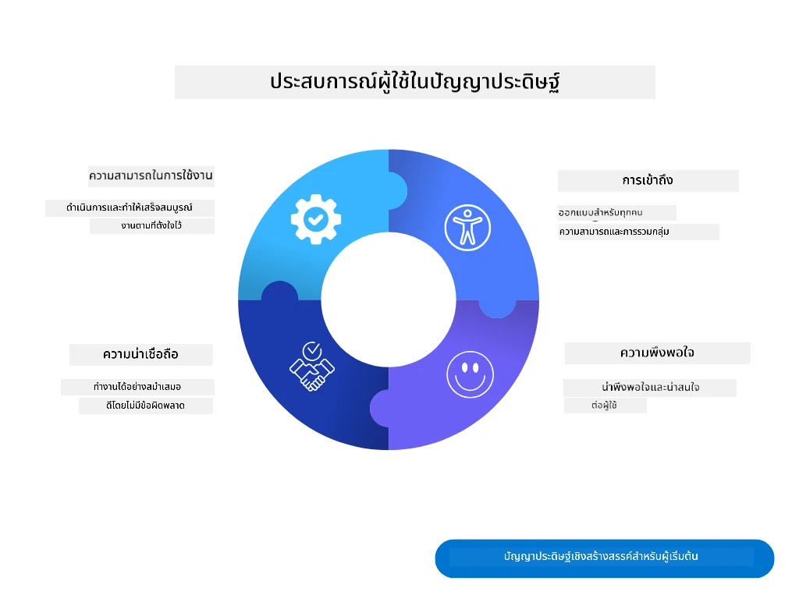
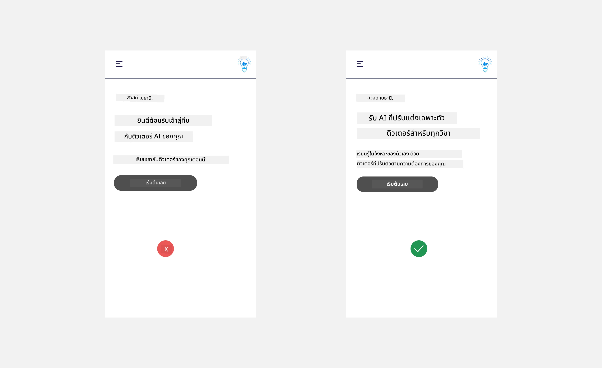
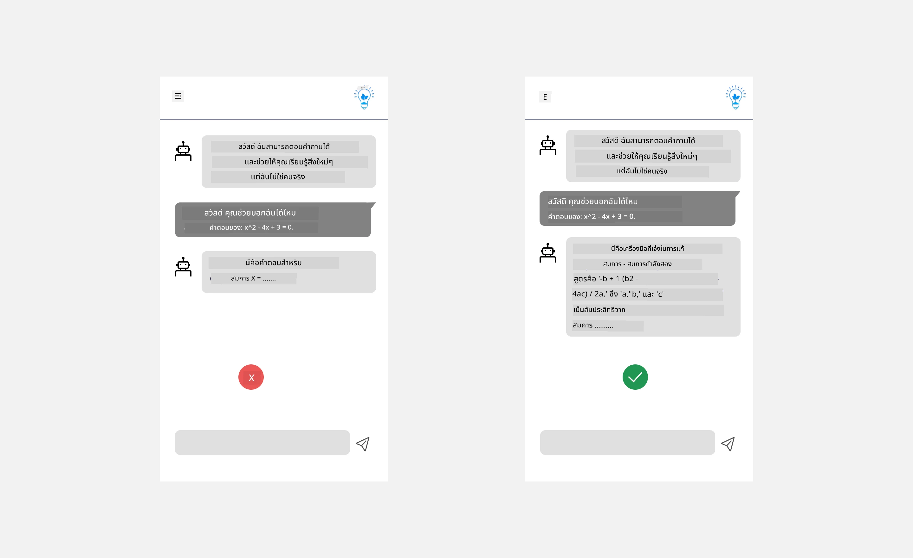
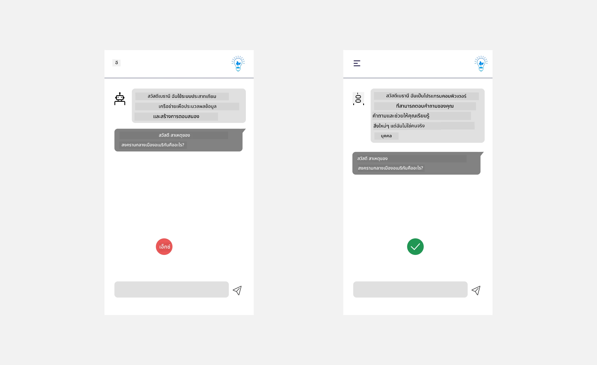
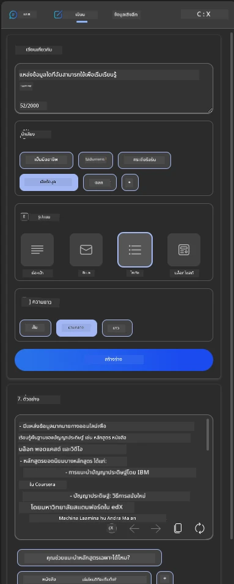
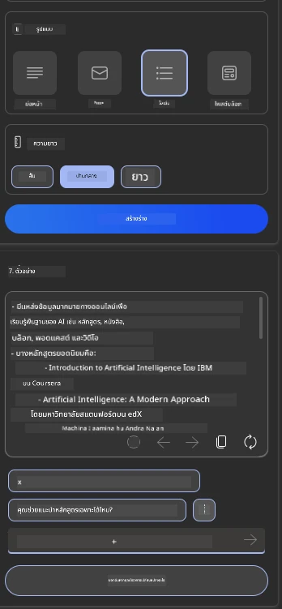
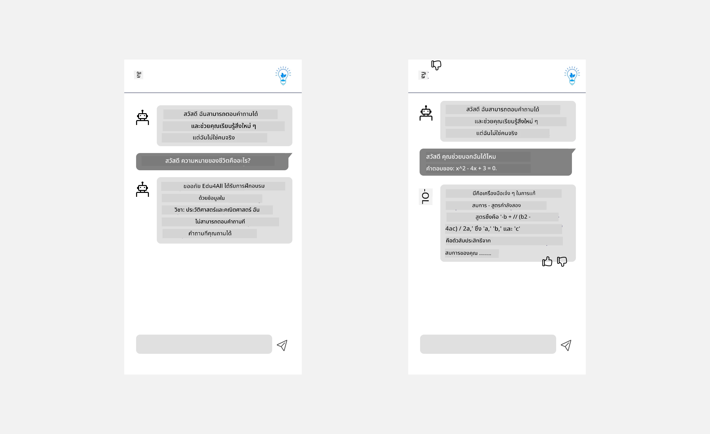

# การออกแบบ UX สำหรับแอป AI

> _(คลิกที่ภาพด้านบนเพื่อดูวิดีโอบทเรียนนี้)_

ประสบการณ์ผู้ใช้เป็นแง่มุมที่สำคัญมากของการสร้างแอป ผู้ใช้จำเป็นต้องสามารถใช้แอปของคุณได้อย่างมีประสิทธิภาพเพื่อทำงาน การมีประสิทธิภาพเป็นเรื่องหนึ่ง แต่คุณยังต้องออกแบบแอปให้ทุกคนสามารถใช้งานได้ เพื่อให้แอป _สามารถเข้าถึงได้_ บทนี้จะเน้นในส่วนนี้เพื่อให้คุณได้ออกแบบแอปที่ผู้คนสามารถและต้องการใช้

## บทนำ

ประสบการณ์ผู้ใช้คือวิธีที่ผู้ใช้โต้ตอบและใช้ผลิตภัณฑ์หรือบริการเฉพาะ ไม่ว่าจะเป็นระบบ เครื่องมือ หรือการออกแบบ เมื่อพัฒนาแอป AI นักพัฒนาไม่เพียงแต่ให้ความสำคัญกับการทำให้ประสบการณ์ผู้ใช้มีประสิทธิภาพเท่านั้น แต่ยังต้องมีจริยธรรมด้วย ในบทเรียนนี้เราจะพูดถึงวิธีการสร้างแอปปัญญาประดิษฐ์ (AI) ที่ตอบสนองความต้องการของผู้ใช้

บทเรียนจะครอบคลุมพื้นที่ดังต่อไปนี้:

- บทนำสู่ประสบการณ์ผู้ใช้และความเข้าใจความต้องการของผู้ใช้
- การออกแบบแอป AI เพื่อความน่าเชื่อถือและความโปร่งใส
- การออกแบบแอป AI เพื่อความร่วมมือและข้อเสนอแนะ

## เป้าหมายการเรียนรู้

หลังจากเรียนบทนี้ คุณจะสามารถ:

- เข้าใจวิธีการสร้างแอป AI ที่ตอบสนองความต้องการของผู้ใช้
- ออกแบบแอป AI ที่ส่งเสริมความน่าเชื่อถือและความร่วมมือ

### ความรู้เบื้องต้น

ใช้เวลาสักครู่และอ่านเพิ่มเติมเกี่ยวกับ [ประสบการณ์ผู้ใช้และการคิดเชิงออกแบบ](https://learn.microsoft.com/training/modules/ux-design?WT.mc_id=academic-105485-koreyst)

## บทนำสู่ประสบการณ์ผู้ใช้และความเข้าใจความต้องการของผู้ใช้

ในสตาร์ทอัพการศึกษาจำลองของเรา เรามีผู้ใช้หลักสองกลุ่ม คือ ครูและนักเรียน แต่ละกลุ่มมีความต้องการเฉพาะ การออกแบบที่เน้นผู้ใช้จะให้ความสำคัญกับผู้ใช้เพื่อให้ผลิตภัณฑ์มีความเกี่ยวข้องและเป็นประโยชน์สำหรับผู้ที่ตั้งใจจะใช้

แอปควรมีความ **มีประโยชน์ เชื่อถือได้ สามารถเข้าถึงได้ และน่าใช้** เพื่อมอบประสบการณ์ผู้ใช้ที่ดี

### ความสามารถในการใช้งาน

ความมีประโยชน์หมายความว่าแอปมีฟังก์ชันตรงตามวัตถุประสงค์ที่ตั้งไว้ เช่น การทำกระบวนการให้คะแนนอัตโนมัติหรือสร้างแฟลชการ์ดเพื่อทบทวน แอปที่ทำกระบวนการให้คะแนนอัตโนมัติควรสามารถให้คะแนนงานของนักเรียนอย่างแม่นยำและมีประสิทธิภาพตามเกณฑ์ที่กำหนด ในทำนองเดียวกัน แอปที่สร้างแฟลชการ์ดทบทวนควรสามารถสร้างคำถามที่เกี่ยวข้องและหลากหลายตามข้อมูลที่มี

### ความน่าเชื่อถือ

ความน่าเชื่อถือหมายความว่าแอปสามารถทำงานตามหน้าที่อย่างสม่ำเสมอและไม่มีข้อผิดพลาด อย่างไรก็ตาม AI เหมือนมนุษย์ไม่สมบูรณ์แบบและอาจเกิดข้อผิดพลาดได้ แอปอาจเผชิญกับข้อผิดพลาดหรือตัวแปรที่ไม่คาดคิดซึ่งต้องการการแทรกแซงหรือการแก้ไขจากมนุษย์ คุณจัดการข้อผิดพลาดอย่างไร? ในส่วนท้ายของบทเรียนนี้ เราจะพูดถึงวิธีการออกแบบระบบและแอป AI สำหรับความร่วมมือและข้อเสนอแนะ

### การเข้าถึง

การสามารถเข้าถึงหมายถึงการขยายประสบการณ์ผู้ใช้ให้ครอบคลุมถึงผู้ใช้ที่มีความสามารถหลากหลาย รวมถึงผู้ที่มีความพิการ เพื่อให้ไม่มีใครถูกละเลย การปฏิบัติตามแนวทางและหลักการการเข้าถึงจะทำให้โซลูชัน AI มีความครอบคลุม ใช้งานง่าย และเป็นประโยชน์ต่อผู้ใช้ทุกคนมากขึ้น

### ความน่าใช้

ความน่าใช้หมายความว่าแอปเป็นที่น่าสนใจและสนุกสนานในการใช้ ประสบการณ์ผู้ใช้ที่น่าดึงดูดสามารถส่งผลดีต่อผู้ใช้ กระตุ้นให้พวกเขากลับมาใช้แอปอีกครั้งและเพิ่มรายได้ธุรกิจ

ไม่ใช่ทุกความท้าทายจะสามารถแก้ไขได้ด้วย AI AI มีบทบาทเสริมสร้างประสบการณ์ผู้ใช้ไม่ว่าจะเป็นการทำงานที่ต้องใช้แรงงานด้วยมือให้เป็นอัตโนมัติ หรือการปรับแต่งประสบการณ์ผู้ใช้ให้เหมาะสม

## การออกแบบแอป AI เพื่อความน่าเชื่อถือและความโปร่งใส

การสร้างความไว้วางใจเป็นเรื่องสำคัญมากเมื่อออกแบบแอป AI ความไว้วางใจทำให้ผู้ใช้มั่นใจว่าแอปจะทำงานเสร็จสมบูรณ์ ส่งมอบผลลัพธ์อย่างสม่ำเสมอและผลลัพธ์เป็นไปตามที่ผู้ใช้ต้องการ ความเสี่ยงในด้านนี้คือความไม่ไว้วางใจและความไว้วางใจเกินไป ความไม่ไว้วางใจเกิดขึ้นเมื่อผู้ใช้มีความเชื่อมั่นในระบบ AI น้อยหรือไม่มีเลย ซึ่งจะนำไปสู่การปฏิเสธใช้แอป ความไว้วางใจเกินไปเกิดขึ้นเมื่อผู้ใช้ประเมินความสามารถของระบบ AI สูงเกินไป ซึ่งทำให้ผู้ใช้ไว้วางใจระบบ AI มากเกินไป ตัวอย่างเช่น ระบบการให้คะแนนอัตโนมัติในกรณีของความไว้วางใจเกินไปอาจทำให้ครูไม่ตรวจทานเอกสารบางส่วนเพื่อให้แน่ใจว่าระบบการให้คะแนนทำงานได้ดี ซึ่งอาจทำให้คะแนนของนักเรียนไม่เป็นธรรมหรือไม่ถูกต้อง หรือมีโอกาสในการรับข้อเสนอแนะและปรับปรุงที่พลาดไป

สองวิธีที่จะทำให้ความไว้วางใจเป็นหัวใจของการออกแบบคือ ความสามารถในการอธิบาย และการควบคุม

### ความสามารถในการอธิบาย

เมื่อ AI ช่วยแจ้งการตัดสินใจ เช่น การถ่ายทอดความรู้ให้กับคนรุ่นหลัง ครูและผู้ปกครองจำเป็นต้องเข้าใจว่าการตัดสินใจของ AI เป็นอย่างไร นี่คือความสามารถในการอธิบาย — การเข้าใจว่าแอป AI ตัดสินใจอย่างไร การออกแบบเพื่อความสามารถในการอธิบายรวมถึงการเพิ่มรายละเอียดที่แสดงว่า AI มาถึงผลลัพธ์อย่างไร ผู้ชมต้องตระหนักว่าผลลัพธ์ถูกสร้างโดย AI ไม่ใช่มนุษย์ ตัวอย่างเช่น แทนที่จะพูดว่า "เริ่มแชทกับติวเตอร์ของคุณตอนนี้" ให้พูดว่า "ใช้ติวเตอร์ AI ที่ปรับตามความต้องการของคุณและช่วยให้คุณเรียนรู้ตามจังหวะของคุณ"

ตัวอย่างอีกอย่างคือวิธีที่ AI ใช้ข้อมูลผู้ใช้และข้อมูลส่วนตัว เช่น ผู้ใช้ที่มีบุคลิกภาพแบบนักเรียนอาจมีข้อจำกัดตามบุคลิกภาพของตน AI อาจไม่สามารถเปิดเผยคำตอบของคำถามได้ แต่สามารถช่วยชี้แนะผู้ใช้ให้คิดผ่านวิธีแก้ปัญหาได้

ส่วนสุดท้ายที่สำคัญของความสามารถในการอธิบายคือการทำให้อธิบายง่ายขึ้น นักเรียนและครูอาจไม่ใช่ผู้เชี่ยวชาญด้าน AI ดังนั้นการอธิบายถึงสิ่งที่แอปสามารถหรือไม่สามารถทำได้ควรเป็นแบบง่ายและเข้าใจง่าย

### การควบคุม

Generative AI สร้างความร่วมมือระหว่าง AI และผู้ใช้ โดยที่ผู้ใช้สามารถแก้ไขคำสั่งเพื่อให้ได้ผลลัพธ์ที่แตกต่างกัน นอกจากนี้ เมื่อผลลัพธ์ถูกสร้างแล้ว ผู้ใช้ควรสามารถแก้ไขผลลัพธ์เพื่อให้รู้สึกว่ามีการควบคุม ตัวอย่างเช่น เมื่อใช้ Microsoft Copilot (ชื่อเดิม Bing Chat) คุณสามารถปรับแต่งคำสั่งของคุณตามรูปแบบ โทนเสียง และความยาว นอกจากนี้คุณยังสามารถเพิ่มการเปลี่ยนแปลงผลลัพธ์และแก้ไขผลลัพธ์ได้ตามที่แสดงด้านล่าง

อีกฟีเจอร์หนึ่งใน Microsoft Copilot ที่ช่วยให้ผู้ใช้ควบคุมแอปได้คือ ความสามารถในการเลือกเข้าร่วมหรือไม่เข้าร่วมการใช้ข้อมูลที่ AI ใช้ สำหรับแอปโรงเรียน นักเรียนอาจต้องการใช้บันทึกของตนเองและทรัพยากรของครูเป็นวัสดุทบทวน

> เมื่อออกแบบแอป AI ความมีเจตนาเป็นกุญแจสำคัญในการป้องกันไม่ให้ผู้ใช้ไว้วางใจเกินไปและตั้งความคาดหวังที่ไม่สมจริงเกี่ยวกับความสามารถของแอป หนึ่งวิธีในการทำเช่นนี้คือการสร้างความเสียดทานระหว่างคำสั่งและผลลัพธ์ เตือนผู้ใช้ว่า นี่คือ AI ไม่ใช่มนุษย์ธรรมดา

## การออกแบบแอป AI เพื่อความร่วมมือและข้อเสนอแนะ

ดังที่กล่าวมาแล้ว generative AI สร้างความร่วมมือระหว่างผู้ใช้และ AI โดยปกติการมีปฏิสัมพันธ์จะเป็นการป้อนคำสั่งโดยผู้ใช้และ AI สร้างผลลัพธ์ แต่ถ้าผลลัพธ์ไม่ถูกต้อง แอปจะจัดการกับข้อผิดพลาดอย่างไร? AI จะโทษผู้ใช้หรือใช้เวลาอธิบายข้อผิดพลาดหรือไม่?

แอป AI ควรถูกสร้างให้รับและให้ข้อเสนอแนะ ซึ่งไม่เพียงช่วยให้ระบบ AI ดีขึ้น แต่ยังสร้างความไว้วางใจในผู้ใช้ด้วย วงจรข้อเสนอแนะควรรวมอยู่ในการออกแบบ ตัวอย่างเช่น อาจเป็นไอคอนนิ้วโป้งขึ้นหรือลงสำหรับผลลัพธ์

อีกวิธีหนึ่งที่จัดการเรื่องนี้คือการสื่อสารอย่างชัดเจนถึงความสามารถและข้อจำกัดของระบบ เมื่อผู้ใช้ทำผิดโดยขอสิ่งที่เกินความสามารถของ AI ควรมีวิธีจัดการกับเรื่องนี้ ตามตัวอย่างด้านล่าง

ข้อผิดพลาดของระบบเป็นเรื่องปกติกับแอปที่ผู้ใช้อาจต้องการความช่วยเหลือข้อมูลนอกขอบเขตของ AI หรือแอปอาจจำกัดจำนวนคำถาม/หัวข้อที่ผู้ใช้สามารถสร้างสรุปได้ ตัวอย่างเช่น แอป AI ที่ได้รับการฝึกด้วยข้อมูลเฉพาะวิชา เช่น ประวัติศาสตร์และคณิตศาสตร์ อาจไม่สามารถตอบคำถามเกี่ยวกับภูมิศาสตร์ได้ เพื่อแก้ไขปัญหานี้ ระบบ AI สามารถแสดงข้อความเช่น: "ขออภัย ผลิตภัณฑ์ของเราถูกฝึกด้วยข้อมูลในวิชาดังต่อไปนี้..... ฉันไม่สามารถตอบคำถามที่คุณถามได้"

แอป AI ไม่สมบูรณ์แบบ ดังนั้นจึงหลีกเลี่ยงข้อผิดพลาดไม่ได้ เมื่อออกแบบแอปของคุณ คุณควรสร้างพื้นที่สำหรับการรับข้อเสนอแนะจากผู้ใช้และการจัดการข้อผิดพลาดในแบบที่ง่ายและอธิบายได้ง่าย

## การบ้าน

นำแอป AI ที่คุณสร้างจนถึงตอนนี้ มาพิจารณานำขั้นตอนต่อไปนี้ไปใช้ในแอปของคุณ:

- **น่าใช้:** พิจารณาว่าคุณจะทำให้แอปของคุณน่าใช้ขึ้นได้อย่างไร คุณเพิ่มคำอธิบายทุกที่หรือไม่? คุณส่งเสริมให้ผู้ใช้สำรวจหรือไม่? คุณตั้งค่าข้อความแสดงข้อผิดพลาดของคุณอย่างไร?

- **การใช้งาน:** สร้างเว็บแอป ตรวจสอบให้แน่ใจว่าแอปของคุณสามารถนำทางได้ทั้งเมาส์และคีย์บอร์ด

- **ความน่าเชื่อถือและความโปร่งใส:** อย่าไว้ใจ AI และผลลัพธ์อย่างสมบูรณ์ พิจารณาวิธีที่จะเพิ่มมนุษย์เข้ามาในกระบวนการเพื่อตรวจสอบผลลัพธ์ รวมถึงพิจารณาและนำวิธีอื่นๆ มาใช้เพื่อสร้างความน่าเชื่อถือและความโปร่งใส

- **การควบคุม:** ให้ผู้ใช้ควบคุมข้อมูลที่พวกเขาให้แอป ใช้วิธีให้ผู้ใช้เลือกเข้าร่วมหรือไม่เข้าร่วมในการเก็บข้อมูลในแอป AI

<!-- ## [Post-lecture quiz](../../../12-designing-ux-for-ai-applications/quiz-url) -->

## เรียนรู้ต่อ!

หลังเรียนจบบทนี้ ลองดู [คอลเลกชันการเรียนรู้ Generative AI](https://aka.ms/genai-collection?WT.mc_id=academic-105485-koreyst) ของเราเพื่อเพิ่มพูนความรู้ Generative AI ของคุณให้มากขึ้น!

ไปที่บทที่ 13 ซึ่งเราจะพูดถึงวิธี [รักษาความปลอดภัยแอป AI](../13-securing-ai-applications/README.md?WT.mc_id=academic-105485-koreyst)!

---

<!-- CO-OP TRANSLATOR DISCLAIMER START -->
**ปฏิเสธความรับผิดชอบ**:
เอกสารนี้ได้รับการแปลโดยใช้บริการแปลภาษา AI [Co-op Translator](https://github.com/Azure/co-op-translator) ขณะที่เราพยายามให้ความถูกต้อง โปรดทราบว่าการแปลโดยอัตโนมัติอาจมีข้อผิดพลาดหรือความไม่ถูกต้อง เอกสารต้นฉบับในภาษาต้นทางควรถูกพิจารณาเป็นแหล่งข้อมูลที่เชื่อถือได้ สำหรับข้อมูลที่สำคัญ แนะนำให้ใช้การแปลโดยมนุษย์มืออาชีพ เราไม่รับผิดชอบต่อความเข้าใจผิดหรือการตีความที่ผิดพลาดที่เกิดขึ้นจากการใช้การแปลนี้
<!-- CO-OP TRANSLATOR DISCLAIMER END -->