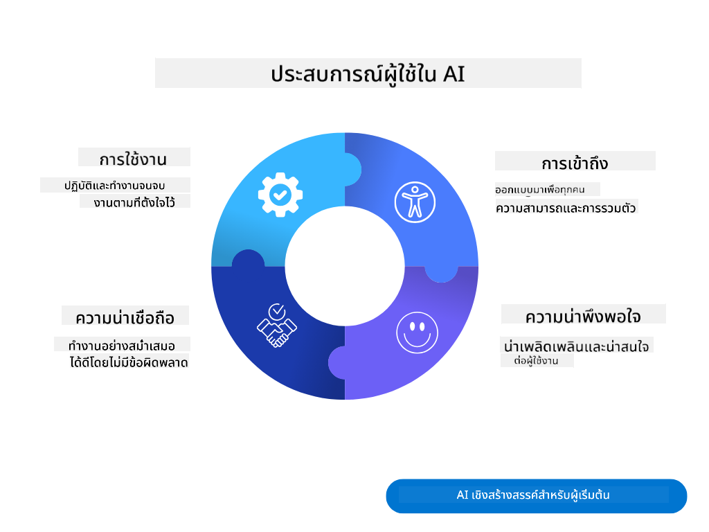
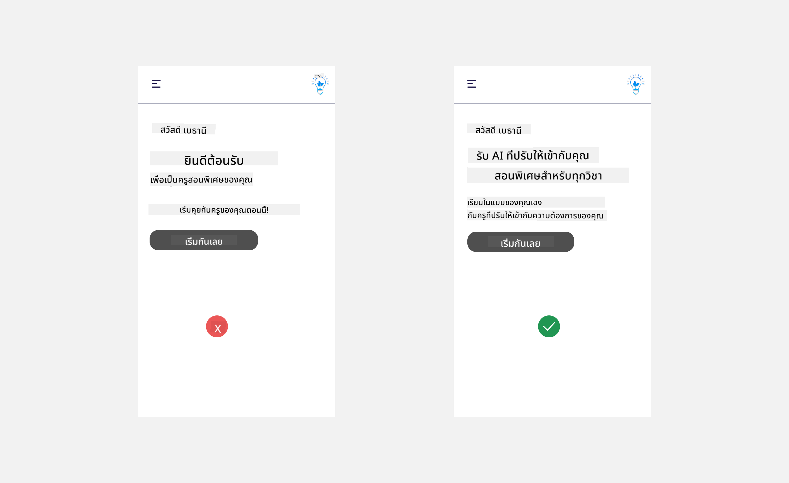
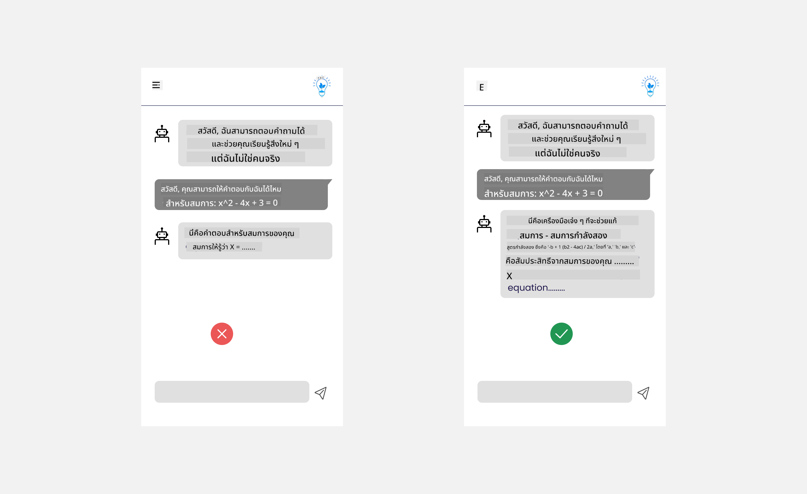
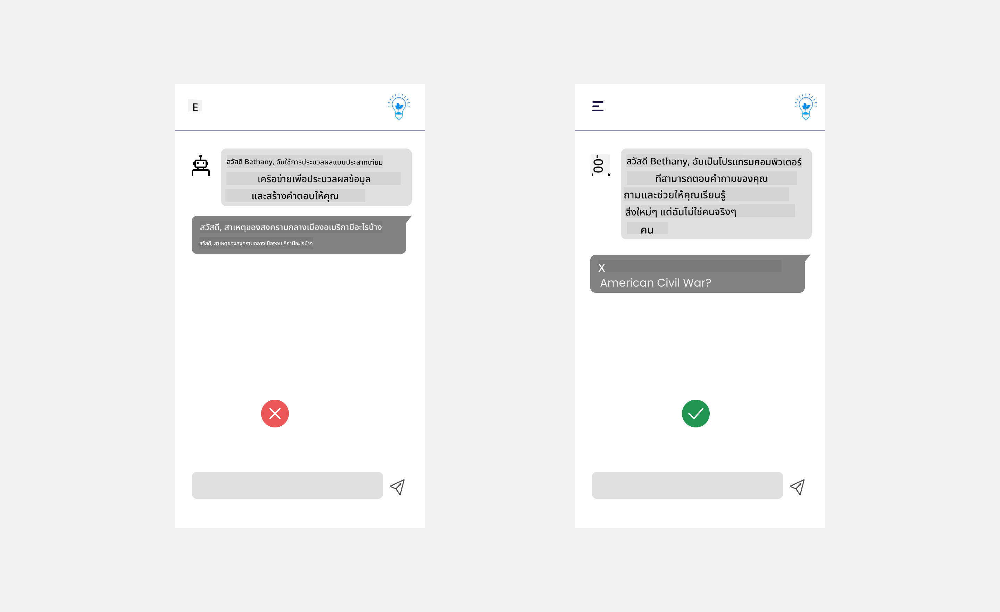
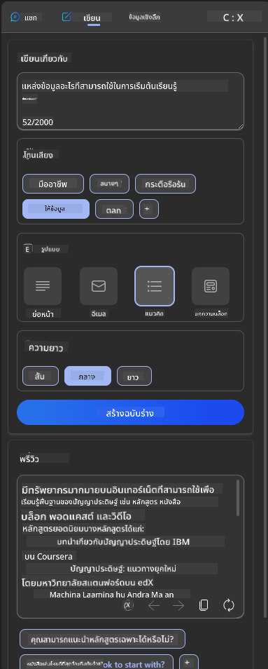
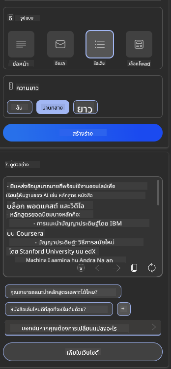
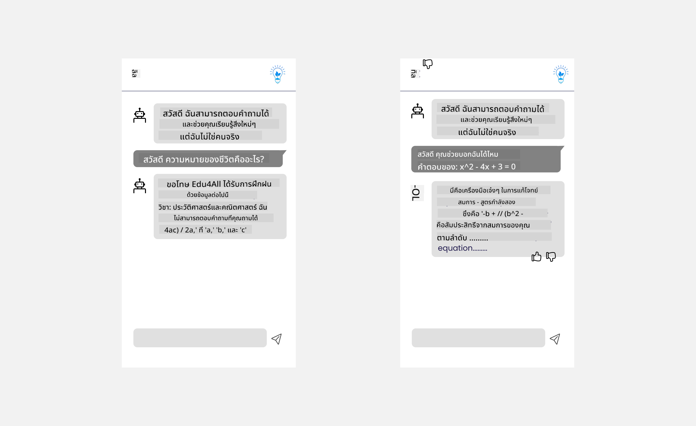

<!--
CO_OP_TRANSLATOR_METADATA:
{
  "original_hash": "ec385b41ee50579025d50cc03bfb3a25",
  "translation_date": "2025-06-25T20:23:52+00:00",
  "source_file": "12-designing-ux-for-ai-applications/README.md",
  "language_code": "th"
}
-->
# การออกแบบ UX สำหรับแอปพลิเคชัน AI

> _(คลิกที่ภาพด้านบนเพื่อดูวิดีโอของบทเรียนนี้)_

ประสบการณ์ผู้ใช้เป็นส่วนสำคัญมากในการสร้างแอป ผู้ใช้จำเป็นต้องสามารถใช้แอปของคุณได้อย่างมีประสิทธิภาพเพื่อทำงานต่างๆ การมีประสิทธิภาพเป็นสิ่งหนึ่ง แต่คุณยังต้องออกแบบแอปเพื่อให้ทุกคนสามารถใช้งานได้ เพื่อทำให้มัน _เข้าถึงได้_ บทนี้จะมุ่งเน้นไปที่พื้นที่นี้เพื่อให้คุณสามารถออกแบบแอปที่ผู้คนสามารถและต้องการใช้ได้

## บทนำ

ประสบการณ์ผู้ใช้คือวิธีที่ผู้ใช้โต้ตอบและใช้ผลิตภัณฑ์หรือบริการเฉพาะ ไม่ว่าจะเป็นระบบ เครื่องมือ หรือการออกแบบ เมื่อพัฒนาแอปพลิเคชัน AI นักพัฒนาไม่เพียงแต่ให้ความสำคัญกับการทำให้ประสบการณ์ผู้ใช้มีประสิทธิภาพ แต่ยังต้องคำนึงถึงจริยธรรมด้วย ในบทเรียนนี้ เราจะกล่าวถึงวิธีการสร้างแอปพลิเคชันปัญญาประดิษฐ์ (AI) ที่ตอบสนองความต้องการของผู้ใช้

บทเรียนจะครอบคลุมพื้นที่ต่อไปนี้:

- บทนำเกี่ยวกับประสบการณ์ผู้ใช้และการเข้าใจความต้องการของผู้ใช้
- การออกแบบแอปพลิเคชัน AI เพื่อความเชื่อถือและความโปร่งใส
- การออกแบบแอปพลิเคชัน AI สำหรับการร่วมมือและการตอบกลับ

## เป้าหมายการเรียนรู้

หลังจากเรียนบทนี้ คุณจะสามารถ:

- เข้าใจวิธีการสร้างแอปพลิเคชัน AI ที่ตอบสนองความต้องการของผู้ใช้
- ออกแบบแอปพลิเคชัน AI ที่ส่งเสริมความเชื่อถือและการร่วมมือ

### ความต้องการเบื้องต้น

ใช้เวลาศึกษาเพิ่มเติมเกี่ยวกับ [ประสบการณ์ผู้ใช้และการคิดเชิงออกแบบ](https://learn.microsoft.com/training/modules/ux-design?WT.mc_id=academic-105485-koreyst)

## บทนำเกี่ยวกับประสบการณ์ผู้ใช้และการเข้าใจความต้องการของผู้ใช้

ในสตาร์ทอัพด้านการศึกษาสมมติของเรา เรามีผู้ใช้หลักสองคนคือครูและนักเรียน ผู้ใช้ทั้งสองมีความต้องการเฉพาะ การออกแบบที่มีผู้ใช้เป็นศูนย์กลางจะให้ความสำคัญกับผู้ใช้เพื่อให้แน่ใจว่าผลิตภัณฑ์นั้นมีความเกี่ยวข้องและเป็นประโยชน์สำหรับผู้ที่มันถูกสร้างขึ้นเพื่อ

แอปพลิเคชันควร **มีประโยชน์ เชื่อถือได้ เข้าถึงได้ และน่าใช้** เพื่อให้ประสบการณ์ผู้ใช้ดี

### การใช้งาน

การมีประโยชน์หมายความว่าแอปพลิเคชันมีฟังก์ชันที่ตรงกับวัตถุประสงค์ เช่น การทำให้กระบวนการให้คะแนนเป็นอัตโนมัติหรือการสร้างแฟลชการ์ดสำหรับการทบทวน แอปพลิเคชันที่ทำให้กระบวนการให้คะแนนเป็นอัตโนมัติควรสามารถให้คะแนนงานของนักเรียนได้อย่างถูกต้องและมีประสิทธิภาพตามเกณฑ์ที่กำหนดไว้ล่วงหน้า เช่นเดียวกับแอปพลิเคชันที่สร้างแฟลชการ์ดสำหรับการทบทวนควรสามารถสร้างคำถามที่เกี่ยวข้องและหลากหลายตามข้อมูลที่มีอยู่

### ความเชื่อถือได้

การมีความเชื่อถือได้หมายความว่าแอปพลิเคชันสามารถทำงานได้อย่างสม่ำเสมอและไม่มีข้อผิดพลาด อย่างไรก็ตาม AI เช่นเดียวกับมนุษย์ไม่สมบูรณ์แบบและอาจมีแนวโน้มที่จะเกิดข้อผิดพลาด แอปพลิเคชันอาจพบข้อผิดพลาดหรือสถานการณ์ที่ไม่คาดคิดที่ต้องการการแทรกแซงหรือแก้ไขจากมนุษย์ คุณจะจัดการกับข้อผิดพลาดอย่างไร? ในส่วนสุดท้ายของบทเรียนนี้ เราจะกล่าวถึงวิธีการออกแบบระบบและแอปพลิเคชัน AI เพื่อการร่วมมือและการตอบกลับ

### การเข้าถึง

การมีการเข้าถึงหมายถึงการขยายประสบการณ์ผู้ใช้ไปยังผู้ใช้ที่มีความสามารถหลากหลาย รวมถึงผู้ที่มีความพิการ เพื่อให้แน่ใจว่าไม่มีใครถูกทิ้งไว้เบื้องหลัง ด้วยการปฏิบัติตามแนวทางและหลักการการเข้าถึง โซลูชัน AI จะกลายเป็นสิ่งที่ครอบคลุม ใช้งานได้ และเป็นประโยชน์สำหรับผู้ใช้ทุกคน

### น่าใช้

การมีความน่าใช้หมายความว่าแอปพลิเคชันนั้นน่าใช้ ประสบการณ์ผู้ใช้ที่น่าดึงดูดสามารถมีผลกระทบเชิงบวกต่อผู้ใช้ กระตุ้นให้พวกเขากลับมาใช้แอปพลิเคชันและเพิ่มรายได้ธุรกิจ

ไม่ใช่ทุกปัญหาที่สามารถแก้ไขได้ด้วย AI AI เข้ามาเพื่อเพิ่มประสบการณ์ผู้ใช้ของคุณ ไม่ว่าจะเป็นการทำให้กระบวนการที่ทำด้วยมือเป็นอัตโนมัติ หรือการปรับแต่งประสบการณ์ผู้ใช้

## การออกแบบแอปพลิเคชัน AI เพื่อความเชื่อถือและความโปร่งใส

การสร้างความเชื่อถือเป็นสิ่งสำคัญเมื่อออกแบบแอปพลิเคชัน AI ความเชื่อถือทำให้ผู้ใช้มั่นใจว่าแอปพลิเคชันจะทำงานได้อย่างดี ให้ผลลัพธ์ที่สม่ำเสมอและผลลัพธ์นั้นเป็นสิ่งที่ผู้ใช้ต้องการ ความเสี่ยงในพื้นที่นี้คือการไม่เชื่อถือและการเชื่อถือมากเกินไป การไม่เชื่อถือเกิดขึ้นเมื่อผู้ใช้มีความเชื่อถือในระบบ AI น้อยหรือไม่มีเลย ซึ่งทำให้ผู้ใช้ปฏิเสธแอปพลิเคชันของคุณ การเชื่อถือมากเกินไปเกิดขึ้นเมื่อผู้ใช้ประเมินความสามารถของระบบ AI สูงเกินไป ซึ่งทำให้ผู้ใช้เชื่อถือระบบ AI มากเกินไป ตัวอย่างเช่น ระบบให้คะแนนอัตโนมัติในกรณีของการเชื่อถือมากเกินไปอาจทำให้ครูไม่ตรวจสอบบางส่วนของเอกสารเพื่อให้แน่ใจว่าระบบให้คะแนนทำงานได้ดี ซึ่งอาจส่งผลให้เกิดคะแนนที่ไม่เป็นธรรมหรือไม่ถูกต้องสำหรับนักเรียน หรือพลาดโอกาสในการให้คำตอบและปรับปรุง

สองวิธีในการทำให้ความเชื่อถือเป็นศูนย์กลางของการออกแบบคือการอธิบายและการควบคุม

### การอธิบาย

เมื่อ AI ช่วยให้ข้อมูลการตัดสินใจ เช่น การส่งเสริมความรู้ให้กับคนรุ่นต่อไป การทำให้ครูและผู้ปกครองเข้าใจวิธีการตัดสินใจของ AI เป็นสิ่งสำคัญ นี่คือการอธิบาย - การเข้าใจวิธีการที่แอปพลิเคชัน AI ตัดสินใจ การออกแบบเพื่อการอธิบายรวมถึงการเพิ่มรายละเอียดของตัวอย่างสิ่งที่แอปพลิเคชัน AI สามารถทำได้ ตัวอย่างเช่น แทนที่จะใช้ "เริ่มต้นกับครู AI" ระบบสามารถใช้ "สรุปโน้ตของคุณเพื่อการทบทวนที่ง่ายขึ้นด้วย AI"

อีกตัวอย่างหนึ่งคือวิธีการที่ AI ใช้ข้อมูลผู้ใช้และข้อมูลส่วนบุคคล ตัวอย่างเช่น ผู้ใช้ที่มีบุคคลที่เป็นนักเรียนอาจมีข้อจำกัดตามบุคคลของพวกเขา AI อาจไม่สามารถเปิดเผยคำตอบให้กับคำถามได้ แต่สามารถช่วยแนะนำผู้ใช้ให้คิดวิธีการแก้ปัญหา

ส่วนสำคัญสุดท้ายของการอธิบายคือการทำให้คำอธิบายง่ายขึ้น นักเรียนและครูอาจไม่ใช่ผู้เชี่ยวชาญด้าน AI ดังนั้นคำอธิบายเกี่ยวกับสิ่งที่แอปพลิเคชันสามารถหรือไม่สามารถทำได้ควรทำให้เข้าใจง่ายและง่ายต่อการเข้าใจ

### การควบคุม

AI สร้างการร่วมมือระหว่าง AI และผู้ใช้ ซึ่งในกรณีที่ผู้ใช้สามารถแก้ไขคำสั่งเพื่อให้ได้ผลลัพธ์ที่แตกต่าง นอกจากนี้เมื่อผลลัพธ์ถูกสร้างขึ้น ผู้ใช้ควรสามารถแก้ไขผลลัพธ์เพื่อให้มีความรู้สึกว่ามีการควบคุม ตัวอย่างเช่นเมื่อใช้ Bing คุณสามารถปรับคำสั่งของคุณตามรูปแบบ โทน และความยาว นอกจากนี้คุณยังสามารถเพิ่มการเปลี่ยนแปลงให้กับผลลัพธ์และแก้ไขผลลัพธ์ตามที่แสดงด้านล่าง:

อีกฟีเจอร์หนึ่งใน Bing ที่ให้ผู้ใช้มีการควบคุมแอปพลิเคชันคือความสามารถในการเลือกเข้าและเลือกออกจากข้อมูลที่ AI ใช้ สำหรับแอปพลิเคชันโรงเรียน นักเรียนอาจต้องการใช้โน้ตของตนเองรวมถึงทรัพยากรของครูเป็นวัสดุทบทวน

> เมื่อออกแบบแอปพลิเคชัน AI ความตั้งใจเป็นกุญแจสำคัญในการทำให้แน่ใจว่าผู้ใช้ไม่เชื่อถือมากเกินไปและตั้งความคาดหวังที่ไม่สมจริงต่อความสามารถของมัน หนึ่งวิธีในการทำเช่นนี้คือการสร้างแรงเสียดทานระหว่างคำสั่งและผลลัพธ์ เตือนผู้ใช้ว่านี่คือ AI ไม่ใช่มนุษย์

## การออกแบบแอปพลิเคชัน AI สำหรับการร่วมมือและการตอบกลับ

อย่างที่กล่าวไว้ก่อนหน้านี้ AI สร้างการร่วมมือระหว่างผู้ใช้และ AI ส่วนใหญ่จะมีการโต้ตอบกับผู้ใช้ที่ป้อนคำสั่งและ AI สร้างผลลัพธ์ แล้วถ้าผลลัพธ์ผิดพลาดล่ะ? แอปพลิเคชันจัดการกับข้อผิดพลาดอย่างไรหากเกิดขึ้น? AI โทษผู้ใช้หรือใช้เวลาที่จะอธิบายข้อผิดพลาดหรือไม่?

แอปพลิเคชัน AI ควรสร้างขึ้นเพื่อรับและให้การตอบกลับ สิ่งนี้ไม่เพียงช่วยให้ระบบ AI ปรับปรุง แต่ยังสร้างความเชื่อถือกับผู้ใช้ วงจรการตอบกลับควรรวมอยู่ในการออกแบบ ตัวอย่างเช่นอาจเป็นเพียงการกดไลค์หรือไม่ไลค์ในผลลัพธ์

อีกวิธีในการจัดการกับนี้คือการสื่อสารความสามารถและข้อจำกัดของระบบอย่างชัดเจน เมื่อผู้ใช้ทำผิดพลาดในการร้องขอสิ่งที่เกินความสามารถของ AI ควรมีวิธีการจัดการกับนี้ ดังที่แสดงด้านล่าง

ข้อผิดพลาดของระบบเป็นเรื่องธรรมดากับแอปพลิเคชันที่ผู้ใช้อาจต้องการความช่วยเหลือเกี่ยวกับข้อมูลนอกเหนือจากขอบเขตของ AI หรือแอปพลิเคชันอาจมีข้อจำกัดในการจำนวนคำถาม/หัวข้อที่ผู้ใช้สามารถสร้างสรุปได้ ตัวอย่างเช่น แอปพลิเคชัน AI ที่ฝึกฝนด้วยข้อมูลในหัวข้อที่จำกัด เช่น ประวัติศาสตร์และคณิตศาสตร์อาจไม่สามารถจัดการกับคำถามเกี่ยวกับภูมิศาสตร์ได้ เพื่อแก้ไขนี้ ระบบ AI สามารถให้คำตอบเช่น: "ขอโทษค่ะ ผลิตภัณฑ์ของเราได้รับการฝึกฝนด้วยข้อมูลในหัวข้อดังต่อไปนี้..... ฉันไม่สามารถตอบคำถามที่คุณถามได้"

แอปพลิเคชัน AI ไม่สมบูรณ์แบบ ดังนั้นจึงมีแนวโน้มที่จะเกิดข้อผิดพลาด เมื่อออกแบบแอปพลิเคชันของคุณ คุณควรแน่ใจว่าคุณสร้างพื้นที่สำหรับการตอบกลับจากผู้ใช้และการจัดการข้อผิดพลาดในวิธีที่ง่ายและเข้าใจง่าย

## การมอบหมาย

ใช้แอป AI ที่คุณได้สร้างขึ้นมาจนถึงตอนนี้ พิจารณาการนำขั้นตอนด้านล่างไปใช้ในแอปของคุณ:

- **น่าใช้:** พิจารณาว่าคุณสามารถทำให้แอปของคุณน่าใช้มากขึ้นได้อย่างไร คุณได้เพิ่มคำอธิบายทุกที่หรือไม่? คุณกำลังส่งเสริมให้ผู้ใช้สำรวจหรือไม่? คุณใช้คำในข้อความข้อผิดพลาดอย่างไร?

- **การใช้งาน:** สร้างเว็บแอป ตรวจสอบให้แน่ใจว่าแอปของคุณสามารถนำทางได้ทั้งเมาส์และคีย์บอร์ด

- **ความเชื่อถือและความโปร่งใส:** อย่าเชื่อถือ AI และผลลัพธ์ของมันอย่างสมบูรณ์ พิจารณาว่าคุณจะเพิ่มมนุษย์ในกระบวนการเพื่อยืนยันผลลัพธ์ได้อย่างไร นอกจากนี้ยังพิจารณาและนำวิธีอื่นๆ เพื่อสร้างความเชื่อถือและความโปร่งใส

- **การควบคุม:** ให้ผู้ใช้ควบคุมข้อมูลที่พวกเขาให้แก่แอปพลิเคชัน นำวิธีที่ผู้ใช้สามารถเลือกเข้าและเลือกออกจากการเก็บข้อมูลในแอปพลิเคชัน AI

## ดำเนินการเรียนรู้ของคุณต่อ!

หลังจากจบบทเรียนนี้ ตรวจสอบคอลเลกชันการเรียนรู้ Generative AI ของเรา [Generative AI Learning collection](https://aka.ms/genai-collection?WT.mc_id=academic-105485-koreyst) เพื่อเพิ่มพูนความรู้ด้าน Generative AI ของคุณ!

ไปที่บทเรียนที่ 13 ซึ่งเราจะดูวิธีการ [รักษาความปลอดภัยแอปพลิเคชัน AI](../13-securing-ai-applications/README.md?WT.mc_id=academic-105485-koreyst)!

**ข้อจำกัดความรับผิดชอบ**:  
เอกสารนี้ได้รับการแปลโดยใช้บริการแปลภาษา AI [Co-op Translator](https://github.com/Azure/co-op-translator) แม้ว่าเราจะพยายามอย่างเต็มที่เพื่อความถูกต้อง แต่โปรดทราบว่าการแปลอัตโนมัติอาจมีข้อผิดพลาดหรือความไม่ถูกต้อง เอกสารต้นฉบับในภาษาต้นฉบับควรถูกพิจารณาว่าเป็นแหล่งข้อมูลที่เชื่อถือได้ สำหรับข้อมูลสำคัญ ขอแนะนำให้ใช้การแปลโดยมนุษย์ที่มีความเชี่ยวชาญ เราจะไม่รับผิดชอบต่อความเข้าใจผิดหรือการตีความผิดที่เกิดจากการใช้การแปลนี้