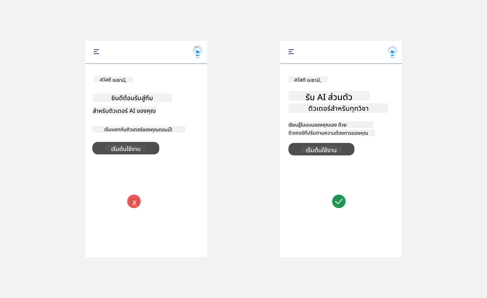
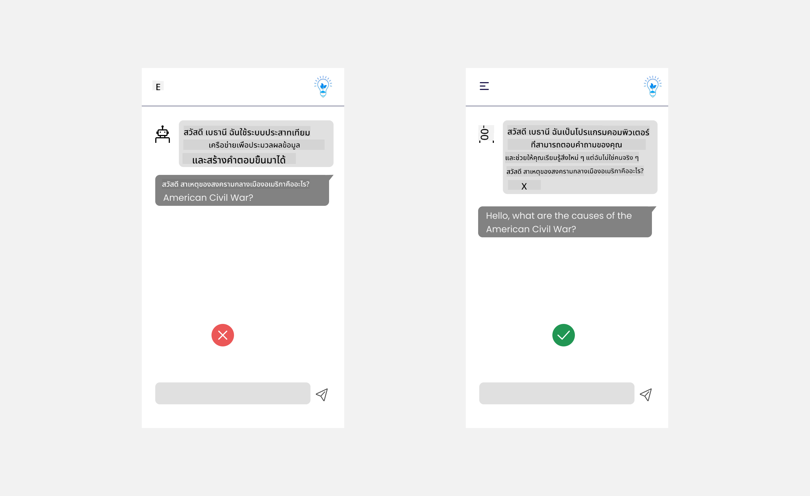
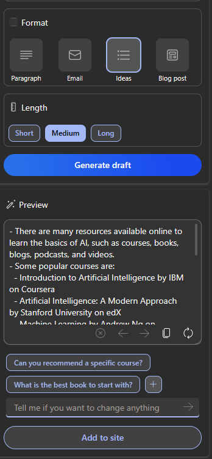

<!--
CO_OP_TRANSLATOR_METADATA:
{
  "original_hash": "78bbeed50fd4dc9fdee931f5daf98cb3",
  "translation_date": "2025-10-17T18:33:59+00:00",
  "source_file": "12-designing-ux-for-ai-applications/README.md",
  "language_code": "th"
}
-->
# การออกแบบ UX สำหรับแอปพลิเคชัน AI

> _(คลิกที่ภาพด้านบนเพื่อดูวิดีโอของบทเรียนนี้)_

ประสบการณ์ผู้ใช้ (User Experience) เป็นส่วนสำคัญมากในการสร้างแอปพลิเคชัน ผู้ใช้ต้องสามารถใช้งานแอปของคุณได้อย่างมีประสิทธิภาพเพื่อทำงานต่าง ๆ ให้สำเร็จ การใช้งานที่มีประสิทธิภาพเป็นสิ่งสำคัญ แต่คุณยังต้องออกแบบแอปพลิเคชันให้สามารถใช้งานได้โดยทุกคน เพื่อทำให้แอปพลิเคชันนั้น _เข้าถึงได้_ บทนี้จะเน้นในด้านนี้เพื่อให้คุณสามารถออกแบบแอปที่ผู้คนสามารถและอยากใช้งานได้

## บทนำ

ประสบการณ์ผู้ใช้คือวิธีที่ผู้ใช้โต้ตอบและใช้งานผลิตภัณฑ์หรือบริการเฉพาะ ไม่ว่าจะเป็นระบบ เครื่องมือ หรือการออกแบบ เมื่อพัฒนาแอปพลิเคชัน AI นักพัฒนาจะไม่เพียงแค่เน้นให้ประสบการณ์ผู้ใช้มีประสิทธิภาพ แต่ยังต้องคำนึงถึงจริยธรรมด้วย ในบทเรียนนี้ เราจะพูดถึงวิธีการสร้างแอปพลิเคชันปัญญาประดิษฐ์ (AI) ที่ตอบสนองความต้องการของผู้ใช้

บทเรียนนี้จะครอบคลุมหัวข้อต่อไปนี้:

- บทนำเกี่ยวกับประสบการณ์ผู้ใช้และการเข้าใจความต้องการของผู้ใช้
- การออกแบบแอปพลิเคชัน AI เพื่อสร้างความไว้วางใจและความโปร่งใส
- การออกแบบแอปพลิเคชัน AI เพื่อการทำงานร่วมกันและการให้ข้อเสนอแนะ

## เป้าหมายการเรียนรู้

หลังจากเรียนบทนี้ คุณจะสามารถ:

- เข้าใจวิธีการสร้างแอปพลิเคชัน AI ที่ตอบสนองความต้องการของผู้ใช้
- ออกแบบแอปพลิเคชัน AI ที่ส่งเสริมความไว้วางใจและการทำงานร่วมกัน

### ความรู้พื้นฐานที่ควรมี

ใช้เวลาอ่านเพิ่มเติมเกี่ยวกับ [ประสบการณ์ผู้ใช้และการคิดเชิงออกแบบ](https://learn.microsoft.com/training/modules/ux-design?WT.mc_id=academic-105485-koreyst)

## บทนำเกี่ยวกับประสบการณ์ผู้ใช้และการเข้าใจความต้องการของผู้ใช้

ในสตาร์ทอัพด้านการศึกษาสมมติของเรา เรามีผู้ใช้หลักสองกลุ่มคือ ครูและนักเรียน แต่ละกลุ่มมีความต้องการเฉพาะตัว การออกแบบที่เน้นผู้ใช้จะให้ความสำคัญกับผู้ใช้เพื่อให้มั่นใจว่าผลิตภัณฑ์นั้นมีความเกี่ยวข้องและเป็นประโยชน์ต่อผู้ที่ตั้งใจใช้งาน

แอปพลิเคชันควร **มีประโยชน์ เชื่อถือได้ เข้าถึงได้ และน่าใช้งาน** เพื่อมอบประสบการณ์ผู้ใช้ที่ดี

### การใช้งาน

การมีประโยชน์หมายถึงแอปพลิเคชันมีฟังก์ชันที่ตรงกับวัตถุประสงค์ เช่น การทำให้กระบวนการให้คะแนนเป็นอัตโนมัติ หรือการสร้างแฟลชการ์ดสำหรับการทบทวน แอปพลิเคชันที่ทำให้กระบวนการให้คะแนนเป็นอัตโนมัติควรสามารถให้คะแนนงานของนักเรียนได้อย่างถูกต้องและรวดเร็วตามเกณฑ์ที่กำหนดไว้ เช่นเดียวกับแอปพลิเคชันที่สร้างแฟลชการ์ดสำหรับการทบทวน ควรสามารถสร้างคำถามที่เกี่ยวข้องและหลากหลายตามข้อมูลที่มีอยู่

### ความน่าเชื่อถือ

การมีความน่าเชื่อถือหมายถึงแอปพลิเคชันสามารถทำงานได้อย่างสม่ำเสมอและไม่มีข้อผิดพลาด อย่างไรก็ตาม AI เช่นเดียวกับมนุษย์ไม่สมบูรณ์แบบและอาจเกิดข้อผิดพลาดได้ แอปพลิเคชันอาจพบข้อผิดพลาดหรือสถานการณ์ที่ไม่คาดคิดซึ่งต้องการการแทรกแซงหรือการแก้ไขจากมนุษย์ คุณจะจัดการกับข้อผิดพลาดอย่างไร? ในส่วนสุดท้ายของบทเรียนนี้ เราจะพูดถึงวิธีการออกแบบระบบและแอปพลิเคชัน AI เพื่อการทำงานร่วมกันและการให้ข้อเสนอแนะ

### การเข้าถึง

การเข้าถึงหมายถึงการขยายประสบการณ์ผู้ใช้ไปยังผู้ใช้ที่มีความสามารถหลากหลาย รวมถึงผู้ที่มีความพิการ เพื่อให้มั่นใจว่าไม่มีใครถูกละเลย การปฏิบัติตามแนวทางและหลักการการเข้าถึงทำให้โซลูชัน AI มีความครอบคลุม ใช้งานได้ และเป็นประโยชน์ต่อผู้ใช้ทุกคน

### ความน่าใช้งาน

การมีความน่าใช้งานหมายถึงแอปพลิเคชันนั้นใช้งานได้อย่างสนุกสนาน ประสบการณ์ผู้ใช้ที่น่าดึงดูดสามารถส่งผลดีต่อผู้ใช้ กระตุ้นให้พวกเขากลับมาใช้งานแอปพลิเคชันอีกครั้ง และเพิ่มรายได้ให้กับธุรกิจ

ไม่ใช่ทุกปัญหาที่สามารถแก้ไขได้ด้วย AI AI เข้ามาเพื่อเสริมประสบการณ์ผู้ใช้ ไม่ว่าจะเป็นการทำงานที่ต้องใช้แรงงานคนให้เป็นอัตโนมัติ หรือการปรับแต่งประสบการณ์ผู้ใช้ให้เหมาะสม

## การออกแบบแอปพลิเคชัน AI เพื่อสร้างความไว้วางใจและความโปร่งใส

การสร้างความไว้วางใจเป็นสิ่งสำคัญเมื่อออกแบบแอปพลิเคชัน AI ความไว้วางใจทำให้ผู้ใช้มั่นใจว่าแอปพลิเคชันจะทำงานได้สำเร็จ ส่งมอบผลลัพธ์อย่างสม่ำเสมอ และผลลัพธ์นั้นตรงกับความต้องการของผู้ใช้ ความเสี่ยงในด้านนี้คือการขาดความไว้วางใจและการไว้วางใจมากเกินไป การขาดความไว้วางใจเกิดขึ้นเมื่อผู้ใช้มีความไว้วางใจในระบบ AI น้อยหรือไม่มีเลย ซึ่งนำไปสู่การปฏิเสธแอปพลิเคชันของคุณ การไว้วางใจมากเกินไปเกิดขึ้นเมื่อผู้ใช้ประเมินความสามารถของระบบ AI สูงเกินไป ทำให้ผู้ใช้ไว้วางใจระบบ AI มากเกินไป ตัวอย่างเช่น ระบบการให้คะแนนอัตโนมัติในกรณีของการไว้วางใจมากเกินไป อาจทำให้ครูไม่ตรวจสอบงานบางส่วนเพื่อให้แน่ใจว่าระบบการให้คะแนนทำงานได้ดี สิ่งนี้อาจส่งผลให้เกิดคะแนนที่ไม่ยุติธรรมหรือไม่ถูกต้องสำหรับนักเรียน หรือพลาดโอกาสในการให้ข้อเสนอแนะและการปรับปรุง

สองวิธีในการทำให้ความไว้วางใจเป็นศูนย์กลางของการออกแบบคือ ความสามารถในการอธิบายและการควบคุม

### ความสามารถในการอธิบาย

เมื่อ AI ช่วยในการตัดสินใจ เช่น การถ่ายทอดความรู้ให้กับคนรุ่นต่อไป เป็นสิ่งสำคัญสำหรับครูและผู้ปกครองที่จะเข้าใจว่า AI ตัดสินใจอย่างไร นี่คือความสามารถในการอธิบาย - การเข้าใจว่าแอปพลิเคชัน AI ตัดสินใจอย่างไร การออกแบบเพื่อความสามารถในการอธิบายรวมถึงการเพิ่มรายละเอียดที่เน้นว่า AI มาถึงผลลัพธ์ได้อย่างไร ผู้ใช้ต้องทราบว่าผลลัพธ์นั้นถูกสร้างขึ้นโดย AI ไม่ใช่มนุษย์ ตัวอย่างเช่น แทนที่จะพูดว่า "เริ่มแชทกับติวเตอร์ของคุณตอนนี้" ให้พูดว่า "ใช้ติวเตอร์ AI ที่ปรับให้เหมาะกับความต้องการของคุณและช่วยให้คุณเรียนรู้ในจังหวะของคุณ"

อีกตัวอย่างหนึ่งคือวิธีที่ AI ใช้ข้อมูลผู้ใช้และข้อมูลส่วนตัว ตัวอย่างเช่น ผู้ใช้ที่มีบุคลิกเป็นนักเรียนอาจมีข้อจำกัดตามบุคลิกของพวกเขา AI อาจไม่สามารถเปิดเผยคำตอบของคำถามได้ แต่สามารถช่วยแนะนำผู้ใช้ให้คิดถึงวิธีแก้ปัญหาได้

ส่วนสำคัญสุดท้ายของความสามารถในการอธิบายคือการทำให้คำอธิบายง่ายขึ้น นักเรียนและครูอาจไม่ใช่ผู้เชี่ยวชาญด้าน AI ดังนั้นคำอธิบายเกี่ยวกับสิ่งที่แอปพลิเคชันสามารถหรือไม่สามารถทำได้ควรเรียบง่ายและเข้าใจง่าย

### การควบคุม

Generative AI สร้างการทำงานร่วมกันระหว่าง AI และผู้ใช้ โดยที่ผู้ใช้สามารถปรับเปลี่ยนคำสั่งเพื่อให้ได้ผลลัพธ์ที่แตกต่างกัน นอกจากนี้ เมื่อผลลัพธ์ถูกสร้างขึ้น ผู้ใช้ควรสามารถปรับเปลี่ยนผลลัพธ์ได้เพื่อให้รู้สึกว่ามีการควบคุม ตัวอย่างเช่น เมื่อใช้ Bing คุณสามารถปรับแต่งคำสั่งของคุณตามรูปแบบ น้ำเสียง และความยาว นอกจากนี้ คุณยังสามารถเพิ่มการเปลี่ยนแปลงในผลลัพธ์และปรับเปลี่ยนผลลัพธ์ได้ดังที่แสดงด้านล่าง:

อีกฟีเจอร์หนึ่งใน Bing ที่ช่วยให้ผู้ใช้มีการควบคุมแอปพลิเคชันคือความสามารถในการเลือกเข้าร่วมและไม่เข้าร่วมข้อมูลที่ AI ใช้ สำหรับแอปพลิเคชันในโรงเรียน นักเรียนอาจต้องการใช้บันทึกของตนเองรวมถึงทรัพยากรของครูเป็นวัสดุสำหรับการทบทวน

> เมื่อออกแบบแอปพลิเคชัน AI ความตั้งใจเป็นสิ่งสำคัญในการทำให้ผู้ใช้ไม่ไว้วางใจมากเกินไปจนตั้งความคาดหวังที่ไม่สมจริงเกี่ยวกับความสามารถของ AI วิธีหนึ่งในการทำเช่นนี้คือการสร้างความขัดแย้งระหว่างคำสั่งและผลลัพธ์ โดยเตือนผู้ใช้ว่านี่คือ AI ไม่ใช่มนุษย์

## การออกแบบแอปพลิเคชัน AI เพื่อการทำงานร่วมกันและการให้ข้อเสนอแนะ

ดังที่กล่าวไว้ก่อนหน้านี้ Generative AI สร้างการทำงานร่วมกันระหว่างผู้ใช้และ AI การโต้ตอบส่วนใหญ่เกิดขึ้นเมื่อผู้ใช้ป้อนคำสั่งและ AI สร้างผลลัพธ์ หากผลลัพธ์ไม่ถูกต้อง แอปพลิเคชันจะจัดการกับข้อผิดพลาดอย่างไร? แอปพลิเคชันจะโทษผู้ใช้หรือใช้เวลาอธิบายข้อผิดพลาดหรือไม่?

แอปพลิเคชัน AI ควรสร้างขึ้นเพื่อรับและให้ข้อเสนอแนะ สิ่งนี้ไม่เพียงช่วยให้ระบบ AI พัฒนา แต่ยังสร้างความไว้วางใจให้กับผู้ใช้ด้วย วงจรข้อเสนอแนะควรเป็นส่วนหนึ่งของการออกแบบ ตัวอย่างเช่น อาจเป็นการให้ผู้ใช้กดไลค์หรือไม่ชอบผลลัพธ์ที่ได้

อีกวิธีหนึ่งในการจัดการเรื่องนี้คือการสื่อสารความสามารถและข้อจำกัดของระบบอย่างชัดเจน เมื่อผู้ใช้ทำข้อผิดพลาดโดยขอสิ่งที่เกินความสามารถของ AI ก็ควรมีวิธีจัดการกับเรื่องนี้ เช่นที่แสดงด้านล่าง

ข้อผิดพลาดของระบบเป็นเรื่องปกติในแอปพลิเคชันที่ผู้ใช้อาจต้องการความช่วยเหลือเกี่ยวกับข้อมูลที่อยู่นอกขอบเขตของ AI หรือแอปพลิเคชันอาจมีข้อจำกัดเกี่ยวกับจำนวนคำถาม/หัวข้อที่ผู้ใช้สามารถสร้างสรุปได้ ตัวอย่างเช่น แอปพลิเคชัน AI ที่ได้รับการฝึกอบรมด้วยข้อมูลในหัวข้อที่จำกัด เช่น ประวัติศาสตร์และคณิตศาสตร์ อาจไม่สามารถจัดการกับคำถามเกี่ยวกับภูมิศาสตร์ได้ เพื่อแก้ไขปัญหานี้ ระบบ AI สามารถตอบกลับได้ว่า: "ขออภัย ผลิตภัณฑ์ของเราได้รับการฝึกอบรมด้วยข้อมูลในหัวข้อต่อไปนี้..... ฉันไม่สามารถตอบคำถามที่คุณถามได้"

แอปพลิเคชัน AI ไม่สมบูรณ์แบบ ดังนั้นจึงมีโอกาสที่จะเกิดข้อผิดพลาดได้ เมื่อออกแบบแอปพลิเคชันของคุณ คุณควรมั่นใจว่าคุณสร้างพื้นที่สำหรับข้อเสนอแนะจากผู้ใช้และการจัดการข้อผิดพลาดในลักษณะที่เรียบง่ายและเข้าใจง่าย

## งานที่มอบหมาย

นำแอปพลิเคชัน AI ที่คุณเคยสร้างมาพิจารณาและลองนำขั้นตอนด้านล่างนี้ไปปรับใช้ในแอปของคุณ:

- **ความน่าใช้งาน:** พิจารณาว่าคุณสามารถทำให้แอปของคุณน่าใช้งานมากขึ้นได้อย่างไร คุณได้เพิ่มคำอธิบายในทุกที่หรือไม่? คุณได้กระตุ้นให้ผู้ใช้สำรวจหรือไม่? คุณใช้คำพูดในข้อความข้อผิดพลาดอย่างไร?

- **การใช้งาน:** สร้างเว็บแอปพลิเคชัน ตรวจสอบให้แน่ใจว่าแอปของคุณสามารถใช้งานได้ทั้งเมาส์และคีย์บอร์ด

- **ความไว้วางใจและความโปร่งใส:** อย่าไว้วางใจ AI และผลลัพธ์ของมันอย่างสมบูรณ์ พิจารณาว่าคุณจะเพิ่มมนุษย์ในกระบวนการเพื่อยืนยันผลลัพธ์ได้อย่างไร นอกจากนี้ พิจารณาและนำวิธีอื่น ๆ มาใช้เพื่อสร้างความไว้วางใจและความโปร่งใส

- **การควบคุม:** ให้ผู้ใช้ควบคุมข้อมูลที่พวกเขาให้กับแอปพลิเคชัน สร้างวิธีที่ผู้ใช้สามารถเลือกเข้าร่วมและไม่เข้าร่วมการเก็บข้อมูลในแอปพลิเคชัน AI

## เรียนรู้เพิ่มเติม!

หลังจากจบบทเรียนนี้ ลองดู [คอลเลกชันการเรียนรู้ Generative AI](https://aka.ms/genai-collection?WT.mc_id=academic-105485-koreyst) เพื่อเพิ่มพูนความรู้เกี่ยวกับ Generative AI ของคุณ!

ไปที่บทเรียนที่ 13 ซึ่งเราจะพูดถึง [การรักษาความปลอดภัยแอปพลิเคชัน AI](../13-securing-ai-applications/README.md?WT.mc_id=academic-105485-koreyst)!

---

**ข้อจำกัดความรับผิดชอบ**:  
เอกสารนี้ได้รับการแปลโดยใช้บริการแปลภาษา AI [Co-op Translator](https://github.com/Azure/co-op-translator) แม้ว่าเราจะพยายามให้การแปลมีความถูกต้อง แต่โปรดทราบว่าการแปลโดยอัตโนมัติอาจมีข้อผิดพลาดหรือความไม่ถูกต้อง เอกสารต้นฉบับในภาษาดั้งเดิมควรถือเป็นแหล่งข้อมูลที่เชื่อถือได้ สำหรับข้อมูลที่สำคัญ ขอแนะนำให้ใช้บริการแปลภาษามืออาชีพ เราไม่รับผิดชอบต่อความเข้าใจผิดหรือการตีความผิดที่เกิดจากการใช้การแปลนี้