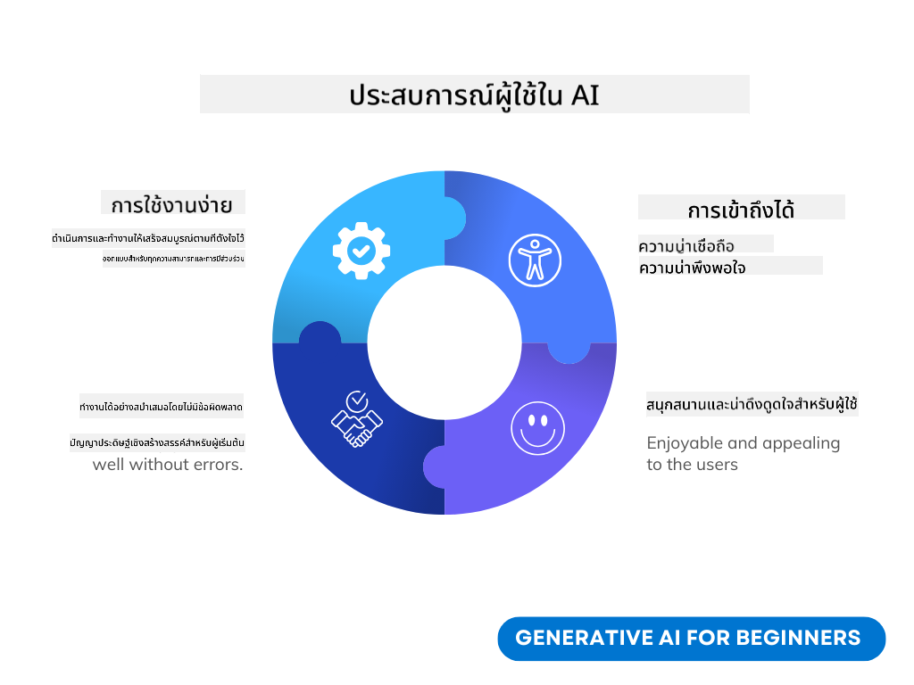
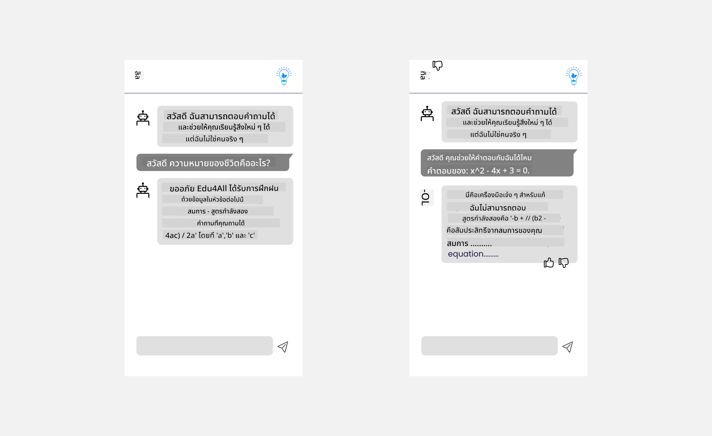

<!--
CO_OP_TRANSLATOR_METADATA:
{
  "original_hash": "747668e4c53d067369f06e9ec2e6313e",
  "translation_date": "2025-08-26T17:14:52+00:00",
  "source_file": "12-designing-ux-for-ai-applications/README.md",
  "language_code": "th"
}
-->
# การออกแบบ UX สำหรับแอปพลิเคชัน AI

> _(คลิกที่ภาพด้านบนเพื่อดูวิดีโอของบทเรียนนี้)_

ประสบการณ์ผู้ใช้เป็นเรื่องสำคัญมากในการสร้างแอป ผู้ใช้ต้องสามารถใช้งานแอปของคุณได้อย่างมีประสิทธิภาพเพื่อทำงานต่าง ๆ ให้สำเร็จ การออกแบบให้ใช้งานง่ายเป็นเรื่องหนึ่ง แต่คุณยังต้องออกแบบแอปให้ทุกคนสามารถใช้งานได้ เพื่อให้แอป _เข้าถึงได้_ บทนี้จะเน้นเรื่องนี้ เพื่อให้คุณออกแบบแอปที่คนอยากใช้และใช้ได้จริง

## บทนำ

ประสบการณ์ผู้ใช้คือวิธีที่ผู้ใช้โต้ตอบและใช้งานผลิตภัณฑ์หรือบริการ ไม่ว่าจะเป็นระบบ เครื่องมือ หรือการออกแบบ เมื่อพัฒนาแอปพลิเคชัน AI นักพัฒนาไม่เพียงแต่ต้องคำนึงถึงประสบการณ์ผู้ใช้ที่มีประสิทธิภาพ แต่ยังต้องคำนึงถึงจริยธรรมด้วย ในบทเรียนนี้ เราจะพูดถึงวิธีสร้างแอปพลิเคชันปัญญาประดิษฐ์ (AI) ที่ตอบโจทย์ความต้องการของผู้ใช้

เนื้อหาบทเรียนนี้ประกอบด้วย:

- แนะนำประสบการณ์ผู้ใช้และการเข้าใจความต้องการของผู้ใช้
- การออกแบบแอปพลิเคชัน AI เพื่อสร้างความเชื่อมั่นและความโปร่งใส
- การออกแบบแอปพลิเคชัน AI เพื่อการร่วมมือและการรับฟังความคิดเห็น

## เป้าหมายการเรียนรู้

หลังจากเรียนบทนี้ คุณจะสามารถ:

- เข้าใจวิธีสร้างแอปพลิเคชัน AI ที่ตอบโจทย์ความต้องการของผู้ใช้
- ออกแบบแอปพลิเคชัน AI ที่ส่งเสริมความเชื่อมั่นและการร่วมมือ

### ความรู้พื้นฐานที่ควรมี

ลองใช้เวลาศึกษาเพิ่มเติมเกี่ยวกับ [ประสบการณ์ผู้ใช้และการคิดเชิงออกแบบ](https://learn.microsoft.com/training/modules/ux-design?WT.mc_id=academic-105485-koreyst)

## แนะนำประสบการณ์ผู้ใช้และการเข้าใจความต้องการของผู้ใช้

ในสตาร์ทอัพด้านการศึกษาสมมติของเรา มีผู้ใช้หลักสองกลุ่มคือ ครูและนักเรียน ซึ่งแต่ละกลุ่มก็มีความต้องการเฉพาะตัว การออกแบบโดยยึดผู้ใช้เป็นศูนย์กลางจะเน้นให้ผลิตภัณฑ์มีความเกี่ยวข้องและเป็นประโยชน์กับกลุ่มเป้าหมาย

แอปพลิเคชันควร **มีประโยชน์ เชื่อถือได้ เข้าถึงง่าย และใช้งานแล้วรู้สึกดี** เพื่อสร้างประสบการณ์ผู้ใช้ที่ดี

### การใช้งานง่าย

การมีประโยชน์หมายถึงแอปพลิเคชันมีฟังก์ชันที่ตรงกับวัตถุประสงค์ เช่น การตรวจข้อสอบอัตโนมัติ หรือสร้างแฟลชการ์ดสำหรับทบทวน แอปที่ตรวจข้อสอบอัตโนมัติควรสามารถให้คะแนนงานของนักเรียนได้อย่างถูกต้องและรวดเร็วตามเกณฑ์ที่กำหนด เช่นเดียวกับแอปที่สร้างแฟลชการ์ดก็ควรสร้างคำถามที่เกี่ยวข้องและหลากหลายตามข้อมูลที่มี

### ความน่าเชื่อถือ

ความน่าเชื่อถือหมายถึงแอปพลิเคชันสามารถทำงานได้อย่างสม่ำเสมอและไม่เกิดข้อผิดพลาด อย่างไรก็ตาม AI ก็เหมือนมนุษย์ที่ไม่สมบูรณ์แบบและอาจเกิดข้อผิดพลาดได้ แอปอาจเจอปัญหาหรือสถานการณ์ที่ไม่คาดคิดซึ่งต้องให้มนุษย์เข้ามาแก้ไข คุณจะจัดการกับข้อผิดพลาดอย่างไร? ในส่วนท้ายของบทเรียนนี้ เราจะพูดถึงการออกแบบระบบ AI เพื่อการร่วมมือและการรับฟังความคิดเห็น

### การเข้าถึงได้

การเข้าถึงได้หมายถึงการขยายประสบการณ์ผู้ใช้ไปยังผู้ใช้ที่มีความสามารถหลากหลาย รวมถึงผู้ที่มีความพิการ เพื่อให้ทุกคนสามารถใช้งานได้ โดยการปฏิบัติตามแนวทางและหลักการด้านการเข้าถึง AI จะเป็นโซลูชันที่ครอบคลุมและเป็นประโยชน์กับทุกคน

### ความรู้สึกดีในการใช้งาน

การใช้งานแล้วรู้สึกดีหมายถึงแอปพลิเคชันใช้งานสนุกและน่าประทับใจ ประสบการณ์ผู้ใช้ที่ดีจะส่งผลให้ผู้ใช้กลับมาใช้งานอีก และช่วยเพิ่มรายได้ให้ธุรกิจ

ไม่ใช่ทุกปัญหาจะใช้ AI แก้ไขได้ AI เข้ามาช่วยเสริมประสบการณ์ผู้ใช้ เช่น การทำงานอัตโนมัติ หรือการปรับแต่งประสบการณ์ให้เหมาะกับแต่ละคน

## การออกแบบแอปพลิเคชัน AI เพื่อสร้างความเชื่อมั่นและความโปร่งใส

การสร้างความเชื่อมั่นเป็นสิ่งสำคัญเมื่อออกแบบแอปพลิเคชัน AI ความเชื่อมั่นทำให้ผู้ใช้มั่นใจว่าแอปจะทำงานได้จริง ส่งผลลัพธ์อย่างสม่ำเสมอ และผลลัพธ์ตรงกับความต้องการ ความเสี่ยงในเรื่องนี้คือการไม่เชื่อใจหรือเชื่อใจมากเกินไป การไม่เชื่อใจเกิดขึ้นเมื่อผู้ใช้ไม่มั่นใจในระบบ AI ส่งผลให้ผู้ใช้ปฏิเสธแอปของคุณ ส่วนการเชื่อใจมากเกินไปเกิดเมื่อผู้ใช้ประเมินความสามารถของ AI สูงเกินจริง เช่น ระบบตรวจข้อสอบอัตโนมัติ หากครูเชื่อใจมากเกินไป อาจไม่ตรวจทานงานบางส่วนเอง ซึ่งอาจทำให้เกิดคะแนนที่ไม่ยุติธรรมหรือผิดพลาด หรือพลาดโอกาสในการให้คำแนะนำและปรับปรุง

สองวิธีที่จะทำให้ความเชื่อมั่นเป็นหัวใจของการออกแบบคือ การอธิบายได้ (Explainability) และการควบคุม (Control)

### การอธิบายได้

เมื่อ AI มีส่วนช่วยในการตัดสินใจ เช่น การถ่ายทอดความรู้ให้คนรุ่นใหม่ ครูและผู้ปกครองควรเข้าใจว่า AI ตัดสินใจอย่างไร นี่คือเรื่องของการอธิบายได้ - การเข้าใจว่าแอปพลิเคชัน AI ตัดสินใจอย่างไร การออกแบบให้สามารถอธิบายได้ควรมีรายละเอียดที่แสดงให้เห็นว่า AI ได้ผลลัพธ์มาอย่างไร ผู้ใช้ควรทราบว่าผลลัพธ์นั้นสร้างโดย AI ไม่ใช่มนุษย์ เช่น แทนที่จะบอกว่า "เริ่มแชทกับติวเตอร์ของคุณตอนนี้" ให้บอกว่า "ใช้ติวเตอร์ AI ที่ปรับตามความต้องการของคุณและช่วยให้คุณเรียนรู้ในแบบของคุณ"

อีกตัวอย่างคือการที่ AI ใช้ข้อมูลผู้ใช้และข้อมูลส่วนตัว เช่น นักเรียนอาจมีข้อจำกัดตามบทบาทของตน AI อาจไม่สามารถเปิดเผยคำตอบได้ แต่สามารถช่วยชี้แนะให้นักเรียนคิดหาวิธีแก้ปัญหาเอง

อีกส่วนสำคัญของการอธิบายได้คือการอธิบายให้เข้าใจง่าย นักเรียนและครูอาจไม่ใช่ผู้เชี่ยวชาญด้าน AI ดังนั้นการอธิบายว่าแอปทำอะไรได้หรือไม่ได้ควรเรียบง่ายและเข้าใจง่าย

### การควบคุม

Generative AI สร้างความร่วมมือระหว่าง AI กับผู้ใช้ เช่น ผู้ใช้สามารถปรับแต่งคำสั่งเพื่อให้ได้ผลลัพธ์ที่ต่างกัน และเมื่อได้ผลลัพธ์แล้ว ผู้ใช้ควรสามารถปรับแต่งผลลัพธ์ได้เองเพื่อให้รู้สึกว่าควบคุมได้ เช่น เมื่อใช้ Bing คุณสามารถปรับแต่งคำสั่งตามรูปแบบ น้ำเสียง และความยาว และยังสามารถแก้ไขผลลัพธ์ได้ตามต้องการ ดังภาพด้านล่าง:

อีกฟีเจอร์หนึ่งใน Bing ที่ให้ผู้ใช้ควบคุมแอปได้คือการเลือกว่าจะให้ AI ใช้ข้อมูลอะไรบ้าง เช่น ในแอปโรงเรียน นักเรียนอาจต้องการใช้โน้ตของตัวเองและแหล่งข้อมูลของครูในการทบทวน

> เมื่อออกแบบแอปพลิเคชัน AI ความตั้งใจเป็นสิ่งสำคัญเพื่อไม่ให้ผู้ใช้เชื่อใจมากเกินไปและคาดหวังเกินจริง วิธีหนึ่งคือสร้างความแตกต่างระหว่างคำสั่งและผลลัพธ์ เตือนผู้ใช้ว่านี่คือ AI ไม่ใช่มนุษย์

## การออกแบบแอปพลิเคชัน AI เพื่อการร่วมมือและการรับฟังความคิดเห็น

อย่างที่กล่าวไป Generative AI สร้างความร่วมมือระหว่างผู้ใช้กับ AI ส่วนใหญ่ผู้ใช้จะป้อนคำสั่งและ AI สร้างผลลัพธ์ แล้วถ้าผลลัพธ์ผิดล่ะ? แอปจะจัดการกับข้อผิดพลาดอย่างไร? AI จะโทษผู้ใช้หรืออธิบายข้อผิดพลาดให้เข้าใจ?

แอปพลิเคชัน AI ควรสามารถรับและให้ความคิดเห็นได้ สิ่งนี้ไม่เพียงช่วยให้ระบบ AI พัฒนาขึ้น แต่ยังสร้างความเชื่อมั่นกับผู้ใช้ด้วย ควรมีช่องทางรับฟังความคิดเห็น เช่น ปุ่มกดถูกใจหรือไม่ถูกใจที่ผลลัพธ์

อีกวิธีคือการสื่อสารอย่างชัดเจนถึงขีดความสามารถและข้อจำกัดของระบบ เมื่อผู้ใช้ขอสิ่งที่เกินขีดความสามารถของ AI ก็ควรมีวิธีจัดการ เช่นตัวอย่างด้านล่าง

ข้อผิดพลาดของระบบเป็นเรื่องปกติในแอปพลิเคชัน เช่น ผู้ใช้อาจต้องการข้อมูลที่อยู่นอกขอบเขตของ AI หรือแอปอาจจำกัดจำนวนคำถาม/วิชาที่ผู้ใช้สามารถสร้างสรุปได้ เช่น แอป AI ที่ฝึกด้วยข้อมูลเฉพาะบางวิชา เช่น ประวัติศาสตร์และคณิตศาสตร์ อาจไม่สามารถตอบคำถามเกี่ยวกับภูมิศาสตร์ได้ เพื่อแก้ไขปัญหานี้ ระบบ AI สามารถตอบกลับว่า "ขออภัย ผลิตภัณฑ์ของเราฝึกด้วยข้อมูลในวิชาต่อไปนี้..... ฉันไม่สามารถตอบคำถามที่คุณถามได้"

แอปพลิเคชัน AI ไม่สมบูรณ์แบบ จึงมีโอกาสผิดพลาดได้ เมื่อออกแบบแอปของคุณ ควรสร้างช่องทางรับฟังความคิดเห็นจากผู้ใช้และจัดการข้อผิดพลาดในแบบที่เรียบง่ายและอธิบายได้ง่าย

## งานที่ต้องทำ

ลองนำแอป AI ที่คุณเคยสร้างมาปรับปรุงตามขั้นตอนด้านล่างนี้:

- **ความรู้สึกดีในการใช้งาน:** ลองคิดดูว่าจะทำให้แอปของคุณใช้งานสนุกขึ้นได้อย่างไร คุณอธิบายทุกจุดหรือยัง? คุณกระตุ้นให้ผู้ใช้ลองใช้งานหรือเปล่า? คุณเขียนข้อความข้อผิดพลาดอย่างไร?

- **การใช้งานง่าย:** หากสร้างเว็บแอป ตรวจสอบให้แน่ใจว่าแอปของคุณสามารถใช้งานได้ทั้งเมาส์และคีย์บอร์ด

- **ความเชื่อมั่นและความโปร่งใส:** อย่าเชื่อใจ AI และผลลัพธ์ทั้งหมด ลองคิดว่าจะเพิ่มมนุษย์เข้าไปในกระบวนการตรวจสอบผลลัพธ์อย่างไร และลองนำวิธีอื่น ๆ มาใช้เพื่อสร้างความเชื่อมั่นและความโปร่งใส

- **การควบคุม:** ให้ผู้ใช้ควบคุมข้อมูลที่ให้กับแอปพลิเคชัน สร้างวิธีให้ผู้ใช้เลือกว่าจะให้ AI เก็บข้อมูลหรือไม่ในแอปพลิเคชัน AI

## เรียนรู้ต่อ!

หลังจากเรียนบทนี้แล้ว ลองดู [คอลเลกชันการเรียนรู้ Generative AI](https://aka.ms/genai-collection?WT.mc_id=academic-105485-koreyst) เพื่อเพิ่มพูนความรู้ด้าน Generative AI ของคุณ!

ไปต่อที่บทที่ 13 ซึ่งเราจะพูดถึงเรื่อง [การรักษาความปลอดภัยแอปพลิเคชัน AI](../13-securing-ai-applications/README.md?WT.mc_id=academic-105485-koreyst)!

---

**ข้อจำกัดความรับผิดชอบ**:
เอกสารนี้ได้รับการแปลโดยใช้บริการแปลภาษา AI [Co-op Translator](https://github.com/Azure/co-op-translator) แม้เราจะพยายามให้ความถูกต้องแม่นยำ แต่โปรดทราบว่าการแปลโดยอัตโนมัติอาจมีข้อผิดพลาดหรือความไม่ถูกต้อง เอกสารต้นฉบับในภาษาต้นทางควรถือเป็นแหล่งข้อมูลที่เชื่อถือได้ สำหรับข้อมูลสำคัญ แนะนำให้ใช้บริการแปลโดยนักแปลมืออาชีพ ทางเราจะไม่รับผิดชอบต่อความเข้าใจผิดหรือการตีความที่เกิดจากการใช้การแปลนี้