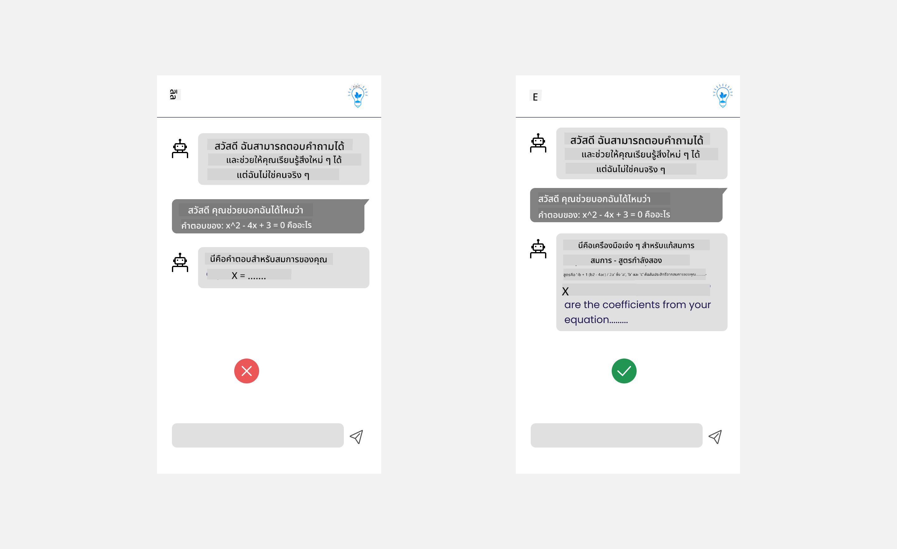

<!--
CO_OP_TRANSLATOR_METADATA:
{
  "original_hash": "ec385b41ee50579025d50cc03bfb3a25",
  "translation_date": "2025-07-09T14:58:14+00:00",
  "source_file": "12-designing-ux-for-ai-applications/README.md",
  "language_code": "th"
}
-->
# การออกแบบ UX สำหรับแอปพลิเคชัน AI

> _(คลิกที่ภาพด้านบนเพื่อดูวิดีโอบทเรียนนี้)_

ประสบการณ์ผู้ใช้เป็นสิ่งสำคัญมากในการสร้างแอป ผู้ใช้ต้องสามารถใช้งานแอปของคุณได้อย่างมีประสิทธิภาพเพื่อทำงานให้สำเร็จ การมีประสิทธิภาพเป็นสิ่งหนึ่ง แต่คุณยังต้องออกแบบแอปให้ทุกคนสามารถใช้งานได้ เพื่อให้แอปนั้น _เข้าถึงได้_ บทนี้จะเน้นในส่วนนี้ เพื่อให้คุณออกแบบแอปที่ผู้คนสามารถและอยากใช้งานได้

## บทนำ

ประสบการณ์ผู้ใช้คือวิธีที่ผู้ใช้โต้ตอบและใช้งานผลิตภัณฑ์หรือบริการเฉพาะ ไม่ว่าจะเป็นระบบ เครื่องมือ หรือการออกแบบ เมื่อพัฒนาแอป AI นักพัฒนาไม่เพียงแต่เน้นให้ประสบการณ์ผู้ใช้มีประสิทธิผลเท่านั้น แต่ยังต้องคำนึงถึงจริยธรรมด้วย ในบทเรียนนี้ เราจะพูดถึงวิธีการสร้างแอปปัญญาประดิษฐ์ (AI) ที่ตอบสนองความต้องการของผู้ใช้

บทเรียนจะครอบคลุมหัวข้อต่อไปนี้:

- บทนำสู่ประสบการณ์ผู้ใช้และการเข้าใจความต้องการของผู้ใช้
- การออกแบบแอป AI เพื่อความน่าเชื่อถือและความโปร่งใส
- การออกแบบแอป AI เพื่อความร่วมมือและการรับข้อเสนอแนะ

## เป้าหมายการเรียนรู้

หลังจากเรียนบทนี้ คุณจะสามารถ:

- เข้าใจวิธีสร้างแอป AI ที่ตอบสนองความต้องการของผู้ใช้
- ออกแบบแอป AI ที่ส่งเสริมความน่าเชื่อถือและความร่วมมือ

### ข้อกำหนดเบื้องต้น

ใช้เวลาศึกษาเพิ่มเติมเกี่ยวกับ [ประสบการณ์ผู้ใช้และการคิดเชิงออกแบบ](https://learn.microsoft.com/training/modules/ux-design?WT.mc_id=academic-105485-koreyst)

## บทนำสู่ประสบการณ์ผู้ใช้และการเข้าใจความต้องการของผู้ใช้

ในสตาร์ทอัพการศึกษาที่สมมติขึ้น เรามีผู้ใช้หลักสองกลุ่ม คือ ครูและนักเรียน ผู้ใช้แต่ละกลุ่มมีความต้องการเฉพาะตัว การออกแบบที่เน้นผู้ใช้เป็นศูนย์กลางจะให้ความสำคัญกับผู้ใช้ เพื่อให้ผลิตภัณฑ์มีความเกี่ยวข้องและเป็นประโยชน์กับกลุ่มเป้าหมาย

แอปควรมีความ **มีประโยชน์ เชื่อถือได้ เข้าถึงได้ และน่าใช้งาน** เพื่อมอบประสบการณ์ผู้ใช้ที่ดี

### การใช้งานง่าย

การมีประโยชน์หมายถึงแอปมีฟังก์ชันที่ตรงกับวัตถุประสงค์ เช่น การทำให้กระบวนการให้คะแนนอัตโนมัติ หรือการสร้างแฟลชการ์ดสำหรับทบทวน แอปที่ทำการให้คะแนนอัตโนมัติควรสามารถให้คะแนนงานของนักเรียนได้อย่างแม่นยำและรวดเร็วตามเกณฑ์ที่กำหนด เช่นเดียวกับแอปที่สร้างแฟลชการ์ดทบทวน ควรสร้างคำถามที่เกี่ยวข้องและหลากหลายตามข้อมูลที่มี

### ความน่าเชื่อถือ

ความน่าเชื่อถือหมายถึงแอปสามารถทำงานได้อย่างสม่ำเสมอและไม่มีข้อผิดพลาด อย่างไรก็ตาม AI ก็เหมือนมนุษย์ที่ไม่สมบูรณ์แบบและอาจเกิดข้อผิดพลาดได้ แอปอาจเจอข้อผิดพลาดหรือสถานการณ์ที่ไม่คาดคิดซึ่งต้องการการแทรกแซงหรือแก้ไขจากมนุษย์ คุณจะจัดการกับข้อผิดพลาดอย่างไร? ในส่วนท้ายของบทเรียนนี้ เราจะพูดถึงการออกแบบระบบ AI และแอปเพื่อความร่วมมือและการรับข้อเสนอแนะ

### การเข้าถึง

การเข้าถึงหมายถึงการขยายประสบการณ์ผู้ใช้ให้ครอบคลุมผู้ใช้ที่มีความสามารถหลากหลาย รวมถึงผู้ที่มีความบกพร่อง เพื่อให้ไม่มีใครถูกทิ้งไว้ข้างหลัง โดยการปฏิบัติตามแนวทางและหลักการการเข้าถึง โซลูชัน AI จะมีความครอบคลุม ใช้งานง่าย และเป็นประโยชน์กับผู้ใช้ทุกคนมากขึ้น

### ความน่าใช้งาน

ความน่าใช้งานหมายถึงแอปใช้งานได้อย่างสนุกสนาน ประสบการณ์ผู้ใช้ที่น่าดึงดูดสามารถส่งผลดีต่อผู้ใช้ กระตุ้นให้พวกเขากลับมาใช้แอปอีก และเพิ่มรายได้ทางธุรกิจ

ไม่ใช่ทุกปัญหาที่จะแก้ได้ด้วย AI AI เข้ามาช่วยเสริมประสบการณ์ผู้ใช้ ไม่ว่าจะเป็นการทำงานอัตโนมัติ หรือการปรับแต่งประสบการณ์ผู้ใช้ให้เหมาะสม

## การออกแบบแอป AI เพื่อความน่าเชื่อถือและความโปร่งใส

การสร้างความน่าเชื่อถือเป็นสิ่งสำคัญเมื่อออกแบบแอป AI ความน่าเชื่อถือทำให้ผู้ใช้มั่นใจว่าแอปจะทำงานได้ตามที่ต้องการ ส่งมอบผลลัพธ์อย่างสม่ำเสมอ และผลลัพธ์นั้นตรงกับความต้องการของผู้ใช้ ความเสี่ยงในส่วนนี้คือความไม่ไว้วางใจและความไว้วางใจเกินไป ความไม่ไว้วางใจเกิดขึ้นเมื่อผู้ใช้มีความเชื่อมั่นในระบบ AI น้อยหรือไม่มีเลย ซึ่งนำไปสู่การปฏิเสธแอปของคุณ ความไว้วางใจเกินไปเกิดขึ้นเมื่อผู้ใช้ประเมินความสามารถของระบบ AI สูงเกินจริง ทำให้ไว้วางใจระบบ AI มากเกินไป เช่น ระบบให้คะแนนอัตโนมัติในกรณีความไว้วางใจเกินไป อาจทำให้ครูไม่ตรวจสอบงานบางส่วนเพื่อให้แน่ใจว่าระบบให้คะแนนทำงานได้ดี ซึ่งอาจส่งผลให้คะแนนไม่ยุติธรรมหรือไม่ถูกต้องสำหรับนักเรียน หรือพลาดโอกาสในการให้ข้อเสนอแนะและปรับปรุง

สองวิธีในการทำให้ความน่าเชื่อถือเป็นหัวใจของการออกแบบคือ ความสามารถในการอธิบาย และการควบคุม

### ความสามารถในการอธิบาย

เมื่อ AI ช่วยในการตัดสินใจ เช่น การถ่ายทอดความรู้สู่คนรุ่นหลัง ครูและผู้ปกครองจึงต้องเข้าใจว่าการตัดสินใจของ AI เป็นอย่างไร นี่คือความสามารถในการอธิบาย - การเข้าใจวิธีที่แอป AI ตัดสินใจ การออกแบบเพื่อความสามารถในการอธิบายรวมถึงการเพิ่มรายละเอียดตัวอย่างของสิ่งที่แอป AI สามารถทำได้ เช่น แทนที่จะใช้คำว่า "เริ่มต้นกับ AI teacher" ระบบอาจใช้ว่า "สรุปบันทึกของคุณเพื่อทบทวง่ายขึ้นด้วย AI"

ตัวอย่างอีกอย่างคือวิธีที่ AI ใช้ข้อมูลผู้ใช้และข้อมูลส่วนบุคคล เช่น ผู้ใช้ที่มีบุคลิกภาพเป็นนักเรียนอาจมีข้อจำกัดตามบุคลิกภาพนั้น AI อาจไม่สามารถเปิดเผยคำตอบของคำถามได้ แต่ช่วยชี้แนะแนวทางให้ผู้ใช้คิดแก้ปัญหาเอง

ส่วนสำคัญอีกอย่างของความสามารถในการอธิบายคือการทำให้อธิบายง่ายขึ้น นักเรียนและครูอาจไม่ใช่ผู้เชี่ยวชาญด้าน AI ดังนั้นคำอธิบายเกี่ยวกับสิ่งที่แอปทำได้หรือทำไม่ได้ควรเรียบง่ายและเข้าใจง่าย

### การควบคุม

Generative AI สร้างความร่วมมือระหว่าง AI กับผู้ใช้ เช่น ผู้ใช้สามารถปรับแต่ง prompt เพื่อให้ได้ผลลัพธ์ที่แตกต่างกัน นอกจากนี้ เมื่อได้ผลลัพธ์แล้ว ผู้ใช้ควรสามารถแก้ไขผลลัพธ์นั้นได้ เพื่อให้รู้สึกว่ามีการควบคุม เช่น เมื่อใช้ Bing คุณสามารถปรับแต่ง prompt ตามรูปแบบ น้ำเสียง และความยาว นอกจากนี้ยังสามารถแก้ไขผลลัพธ์ได้ตามภาพด้านล่างนี้:

ฟีเจอร์อีกอย่างใน Bing ที่ช่วยให้ผู้ใช้ควบคุมแอปได้คือความสามารถในการเลือกเข้าร่วมหรือไม่เข้าร่วมการใช้ข้อมูล AI สำหรับแอปโรงเรียน นักเรียนอาจต้องการใช้บันทึกของตนเองรวมถึงทรัพยากรของครูเป็นวัสดุทบทวน

> เมื่อออกแบบแอป AI ความตั้งใจเป็นกุญแจสำคัญในการป้องกันไม่ให้ผู้ใช้ไว้วางใจเกินไปจนตั้งความคาดหวังที่ไม่สมจริง วิธีหนึ่งคือสร้างความล่าช้าระหว่าง prompt กับผลลัพธ์ เพื่อเตือนผู้ใช้ว่านี่คือ AI ไม่ใช่มนุษย์คนหนึ่ง

## การออกแบบแอป AI เพื่อความร่วมมือและการรับข้อเสนอแนะ

อย่างที่กล่าวไว้ Generative AI สร้างความร่วมมือระหว่างผู้ใช้กับ AI ส่วนใหญ่เป็นการที่ผู้ใช้ป้อน prompt และ AI สร้างผลลัพธ์ ถ้าผลลัพธ์ผิดพลาด แอปจะจัดการกับข้อผิดพลาดอย่างไร? AI จะโทษผู้ใช้หรือใช้เวลาอธิบายข้อผิดพลาดหรือไม่?

แอป AI ควรถูกออกแบบให้รับและให้ข้อเสนอแนะ ซึ่งไม่เพียงช่วยให้ระบบ AI พัฒนา แต่ยังสร้างความน่าเชื่อถือกับผู้ใช้ด้วย วงจรข้อเสนอแนะควรถูกใส่ไว้ในการออกแบบ เช่น การกดไลค์หรือไม่ชอบผลลัพธ์อย่างง่าย

อีกวิธีจัดการคือสื่อสารอย่างชัดเจนถึงความสามารถและข้อจำกัดของระบบ เมื่อผู้ใช้ทำผิดพลาดโดยขอสิ่งที่เกินความสามารถของ AI ควรมีวิธีจัดการดังภาพด้านล่าง

ข้อผิดพลาดของระบบเป็นเรื่องปกติในแอปที่ผู้ใช้อาจต้องการความช่วยเหลือในข้อมูลที่อยู่นอกขอบเขตของ AI หรือแอปอาจจำกัดจำนวนคำถาม/หัวข้อที่ผู้ใช้สามารถสร้างสรุปได้ เช่น แอป AI ที่ฝึกด้วยข้อมูลในหัวข้อจำกัด เช่น ประวัติศาสตร์และคณิตศาสตร์ อาจไม่สามารถตอบคำถามเกี่ยวกับภูมิศาสตร์ได้ เพื่อแก้ไขปัญหานี้ ระบบ AI อาจตอบว่า: "ขออภัย ผลิตภัณฑ์ของเราฝึกด้วยข้อมูลในหัวข้อต่อไปนี้..... ฉันไม่สามารถตอบคำถามที่คุณถามได้"

แอป AI ไม่สมบูรณ์แบบ จึงต้องมีข้อผิดพลาด เมื่อออกแบบแอปของคุณ ควรสร้างช่องทางให้ผู้ใช้ส่งข้อเสนอแนะและจัดการข้อผิดพลาดในรูปแบบที่เรียบง่ายและอธิบายได้ง่าย

## การบ้าน

นำแอป AI ที่คุณสร้างจนถึงตอนนี้มาพิจารณานำขั้นตอนต่อไปนี้ไปใช้ในแอปของคุณ:

- **ความน่าใช้งาน:** คิดว่าคุณจะทำให้แอปของคุณน่าใช้งานมากขึ้นได้อย่างไร คุณใส่คำอธิบายทุกที่หรือไม่? คุณส่งเสริมให้ผู้ใช้สำรวจหรือเปล่า? คุณใช้ถ้อยคำอย่างไรในข้อความแสดงข้อผิดพลาด?

- **การใช้งานง่าย:** สร้างเว็บแอป ตรวจสอบให้แน่ใจว่าแอปของคุณสามารถใช้งานได้ทั้งด้วยเมาส์และคีย์บอร์ด

- **ความน่าเชื่อถือและความโปร่งใส:** อย่าไว้วางใจ AI และผลลัพธ์ของมันทั้งหมด คิดว่าคุณจะเพิ่มมนุษย์เข้ามาตรวจสอบผลลัพธ์อย่างไร และพิจารณาใช้วิธีอื่นๆ เพื่อสร้างความน่าเชื่อถือและความโปร่งใส

- **การควบคุม:** ให้ผู้ใช้ควบคุมข้อมูลที่พวกเขาให้กับแอป ใช้วิธีให้ผู้ใช้เลือกเข้าร่วมหรือไม่เข้าร่วมการเก็บข้อมูลในแอป AI

## เรียนรู้ต่อเนื่อง!

หลังจากเรียนบทนี้เสร็จแล้ว ลองดู [คอลเลกชันการเรียนรู้ Generative AI](https://aka.ms/genai-collection?WT.mc_id=academic-105485-koreyst) เพื่อพัฒนาความรู้ด้าน Generative AI ของคุณต่อไป!

ไปที่บทเรียนที่ 13 ซึ่งเราจะพูดถึงวิธี [การรักษาความปลอดภัยแอป AI](../13-securing-ai-applications/README.md?WT.mc_id=academic-105485-koreyst)!

**ข้อจำกัดความรับผิดชอบ**:  
เอกสารนี้ได้รับการแปลโดยใช้บริการแปลภาษาอัตโนมัติ [Co-op Translator](https://github.com/Azure/co-op-translator) แม้เราจะพยายามให้ความถูกต้องสูงสุด แต่โปรดทราบว่าการแปลอัตโนมัติอาจมีข้อผิดพลาดหรือความไม่ถูกต้อง เอกสารต้นฉบับในภาษาต้นทางถือเป็นแหล่งข้อมูลที่เชื่อถือได้ สำหรับข้อมูลที่สำคัญ ขอแนะนำให้ใช้บริการแปลโดยผู้เชี่ยวชาญมนุษย์ เราไม่รับผิดชอบต่อความเข้าใจผิดหรือการตีความผิดใด ๆ ที่เกิดจากการใช้การแปลนี้