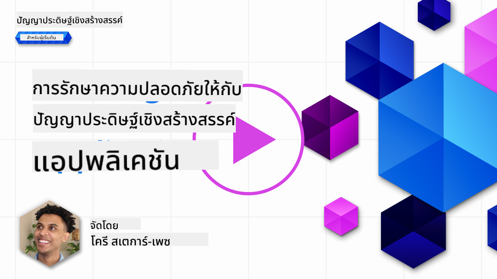
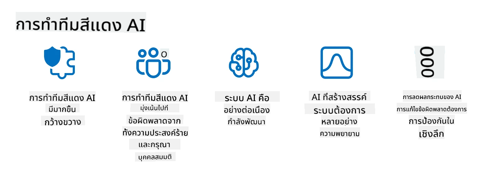

<!--
CO_OP_TRANSLATOR_METADATA:
{
  "original_hash": "f3cac698e9eea47dd563633bd82daf8c",
  "translation_date": "2025-07-09T15:27:56+00:00",
  "source_file": "13-securing-ai-applications/README.md",
  "language_code": "th"
}
-->
# การรักษาความปลอดภัยสำหรับแอปพลิเคชัน Generative AI ของคุณ

## บทนำ

บทเรียนนี้จะครอบคลุม:

- ความปลอดภัยในบริบทของระบบ AI
- ความเสี่ยงและภัยคุกคามทั่วไปต่อระบบ AI
- วิธีการและข้อควรพิจารณาในการรักษาความปลอดภัยของระบบ AI

## เป้าหมายการเรียนรู้

หลังจากเรียนบทเรียนนี้จบ คุณจะเข้าใจเกี่ยวกับ:

- ภัยคุกคามและความเสี่ยงต่อระบบ AI
- วิธีการและแนวปฏิบัติทั่วไปในการรักษาความปลอดภัยของระบบ AI
- วิธีการทดสอบความปลอดภัยเพื่อป้องกันผลลัพธ์ที่ไม่คาดคิดและการเสื่อมความเชื่อมั่นของผู้ใช้

## ความหมายของความปลอดภัยในบริบทของ generative AI คืออะไร?

เมื่อเทคโนโลยีปัญญาประดิษฐ์ (AI) และการเรียนรู้ของเครื่อง (ML) มีบทบาทมากขึ้นในชีวิตประจำวัน การปกป้องไม่เพียงแต่ข้อมูลลูกค้าเท่านั้น แต่รวมถึงระบบ AI เองก็เป็นสิ่งสำคัญ AI/ML ถูกนำมาใช้สนับสนุนกระบวนการตัดสินใจที่มีมูลค่าสูงในอุตสาหกรรมที่การตัดสินใจผิดพลาดอาจส่งผลร้ายแรง

ประเด็นสำคัญที่ควรพิจารณามีดังนี้:

- **ผลกระทบของ AI/ML**: AI/ML มีผลกระทบอย่างมากต่อชีวิตประจำวัน ดังนั้นการปกป้องจึงเป็นสิ่งจำเป็น
- **ความท้าทายด้านความปลอดภัย**: ผลกระทบนี้ต้องได้รับความสนใจอย่างเหมาะสมเพื่อปกป้องผลิตภัณฑ์ที่ใช้ AI จากการโจมตีที่ซับซ้อน ไม่ว่าจะเป็นจากผู้ก่อกวนหรือกลุ่มที่มีการจัดตั้ง
- **ปัญหาทางยุทธศาสตร์**: อุตสาหกรรมเทคโนโลยีต้องแก้ไขปัญหาทางยุทธศาสตร์อย่างรอบคอบเพื่อความปลอดภัยของลูกค้าและข้อมูลในระยะยาว

นอกจากนี้ โมเดลการเรียนรู้ของเครื่องส่วนใหญ่ไม่สามารถแยกแยะระหว่างข้อมูลที่เป็นอันตรายกับข้อมูลผิดปกติที่ไม่มีเจตนาได้ แหล่งข้อมูลฝึกสอนส่วนใหญ่ได้มาจากชุดข้อมูลสาธารณะที่ไม่ได้รับการคัดกรองหรือควบคุม ซึ่งเปิดให้บุคคลที่สามเข้ามามีส่วนร่วมได้ ผู้โจมตีไม่จำเป็นต้องเจาะชุดข้อมูลเมื่อพวกเขาสามารถส่งข้อมูลเข้ามาได้เอง เมื่อเวลาผ่านไป ข้อมูลที่เป็นอันตรายซึ่งมีความน่าเชื่อถือต่ำจะกลายเป็นข้อมูลที่เชื่อถือได้ถ้ารูปแบบและโครงสร้างข้อมูลยังถูกต้อง

นี่คือเหตุผลที่การรักษาความสมบูรณ์และการปกป้องฐานข้อมูลที่โมเดลของคุณใช้ในการตัดสินใจจึงเป็นสิ่งสำคัญอย่างยิ่ง

## ทำความเข้าใจภัยคุกคามและความเสี่ยงของ AI

ในแง่ของ AI และระบบที่เกี่ยวข้อง การโจมตีด้วยการปนเปื้อนข้อมูล (data poisoning) ถือเป็นภัยคุกคามด้านความปลอดภัยที่สำคัญที่สุดในปัจจุบัน การปนเปื้อนข้อมูลคือการที่ใครบางคนเปลี่ยนแปลงข้อมูลที่ใช้ฝึก AI โดยเจตนา ทำให้ AI ทำงานผิดพลาด เนื่องจากไม่มีวิธีการตรวจจับและบรรเทาที่เป็นมาตรฐาน และเรายังต้องพึ่งพาชุดข้อมูลสาธารณะที่ไม่ได้รับการตรวจสอบในการฝึกสอน เพื่อรักษาความสมบูรณ์ของข้อมูลและป้องกันกระบวนการฝึกที่ผิดพลาด จำเป็นต้องติดตามแหล่งที่มาและประวัติของข้อมูล มิฉะนั้นคำกล่าวที่ว่า “ขยะเข้า ขยะออก” จะเป็นจริง ส่งผลให้ประสิทธิภาพของโมเดลลดลง

ตัวอย่างของผลกระทบจากการปนเปื้อนข้อมูลต่อโมเดลของคุณ ได้แก่:

1. **การสลับป้ายกำกับ (Label Flipping)**: ในงานจำแนกประเภทแบบไบนารี ผู้โจมตีจะสลับป้ายกำกับของข้อมูลฝึกสอนบางส่วน เช่น ตัวอย่างที่ไม่มีอันตรายถูกติดป้ายว่าเป็นอันตราย ทำให้โมเดลเรียนรู้ความสัมพันธ์ผิดพลาด\
   **ตัวอย่าง**: ระบบกรองสแปมที่จำแนกอีเมลที่ถูกต้องเป็นสแปมเนื่องจากป้ายกำกับถูกแก้ไข
2. **การปนเปื้อนคุณลักษณะ (Feature Poisoning)**: ผู้โจมตีแก้ไขคุณลักษณะในข้อมูลฝึกสอนอย่างละเอียดเพื่อสร้างอคติหรือหลอกโมเดล\
   **ตัวอย่าง**: การเพิ่มคำสำคัญที่ไม่เกี่ยวข้องในคำอธิบายสินค้าเพื่อบิดเบือนระบบแนะนำสินค้า
3. **การฉีดข้อมูล (Data Injection)**: การแทรกข้อมูลที่เป็นอันตรายเข้าไปในชุดข้อมูลฝึกสอนเพื่อเปลี่ยนพฤติกรรมของโมเดล\
   **ตัวอย่าง**: การแทรกรีวิวปลอมเพื่อบิดเบือนผลวิเคราะห์ความรู้สึก
4. **การโจมตีแบบประตูหลัง (Backdoor Attacks)**: ผู้โจมตีแทรกแบบแผนซ่อนเร้น (backdoor) ลงในข้อมูลฝึกสอน โมเดลจะเรียนรู้และตอบสนองอย่างเป็นอันตรายเมื่อเจอแบบแผนนั้น\
   **ตัวอย่าง**: ระบบจดจำใบหน้าที่ถูกฝึกด้วยภาพที่มีประตูหลัง ทำให้ระบุบุคคลเฉพาะผิดพลาด

MITRE Corporation ได้สร้าง [ATLAS (Adversarial Threat Landscape for Artificial-Intelligence Systems)](https://atlas.mitre.org/?WT.mc_id=academic-105485-koreyst) ซึ่งเป็นฐานความรู้เกี่ยวกับยุทธวิธีและเทคนิคที่ผู้โจมตีใช้ในการโจมตีระบบ AI ในโลกจริง

> มีช่องโหว่ในระบบที่ใช้ AI เพิ่มขึ้นเรื่อยๆ เนื่องจากการผนวก AI ทำให้พื้นผิวการโจมตีของระบบขยายกว่าการโจมตีไซเบอร์แบบดั้งเดิม เราพัฒนา ATLAS เพื่อเพิ่มความตระหนักถึงช่องโหว่เฉพาะและที่กำลังพัฒนาเหล่านี้ เนื่องจากชุมชนทั่วโลกนำ AI ไปใช้ในระบบต่างๆ ATLAS ถูกออกแบบตามกรอบ MITRE ATT&CK® โดยยุทธวิธี เทคนิค และขั้นตอน (TTPs) ของ ATLAS จะเสริมกับ ATT&CK

เช่นเดียวกับกรอบ MITRE ATT&CK® ที่ใช้กันอย่างแพร่หลายในความปลอดภัยไซเบอร์แบบดั้งเดิมสำหรับวางแผนการจำลองภัยคุกคามขั้นสูง ATLAS ให้ชุด TTPs ที่ค้นหาได้ง่าย ช่วยให้เข้าใจและเตรียมพร้อมป้องกันการโจมตีที่เกิดขึ้นใหม่ได้ดีขึ้น

นอกจากนี้ Open Web Application Security Project (OWASP) ได้สร้าง "[รายชื่อ 10 อันดับแรก](https://llmtop10.com/?WT.mc_id=academic-105485-koreyst)" ของช่องโหว่ที่สำคัญที่สุดในแอปพลิเคชันที่ใช้ LLM รายการนี้เน้นความเสี่ยงจากภัยคุกคาม เช่น การปนเปื้อนข้อมูลที่กล่าวมา รวมถึง:

- **Prompt Injection**: เทคนิคที่ผู้โจมตีใช้ป้อนข้อมูลที่ออกแบบมาอย่างระมัดระวังเพื่อบังคับให้ Large Language Model (LLM) ทำงานนอกเหนือจากพฤติกรรมที่ตั้งใจไว้
- **ช่องโหว่ในห่วงโซ่อุปทาน (Supply Chain Vulnerabilities)**: ส่วนประกอบและซอฟต์แวร์ที่ประกอบเป็นแอปพลิเคชันที่ LLM ใช้ เช่น โมดูล Python หรือชุดข้อมูลภายนอก อาจถูกโจมตี ทำให้เกิดผลลัพธ์ที่ไม่คาดคิด อคติ หรือช่องโหว่ในโครงสร้างพื้นฐาน
- **การพึ่งพามากเกินไป (Overreliance)**: LLM มีข้อผิดพลาดและมักสร้างข้อมูลที่ไม่ถูกต้องหรือไม่ปลอดภัย ในหลายกรณีที่มีการบันทึกไว้ ผู้คนเชื่อผลลัพธ์โดยไม่ตรวจสอบ ส่งผลให้เกิดผลเสียในโลกจริงโดยไม่ตั้งใจ

Microsoft Cloud Advocate Rod Trent ได้เขียนหนังสืออิเล็กทรอนิกส์ฟรี [Must Learn AI Security](https://github.com/rod-trent/OpenAISecurity/tree/main/Must_Learn/Book_Version?WT.mc_id=academic-105485-koreyst) ที่เจาะลึกภัยคุกคาม AI ที่เกิดขึ้นใหม่และให้คำแนะนำอย่างละเอียดเกี่ยวกับวิธีจัดการกับสถานการณ์เหล่านี้

## การทดสอบความปลอดภัยสำหรับระบบ AI และ LLM

ปัญญาประดิษฐ์ (AI) กำลังเปลี่ยนแปลงหลายสาขาและอุตสาหกรรม เปิดโอกาสและประโยชน์ใหม่ๆ ให้กับสังคม อย่างไรก็ตาม AI ก็สร้างความท้าทายและความเสี่ยงที่สำคัญ เช่น ความเป็นส่วนตัวของข้อมูล อคติ ขาดความสามารถในการอธิบาย และการใช้งานในทางที่ผิด ดังนั้นจึงจำเป็นต้องมั่นใจว่าระบบ AI มีความปลอดภัยและรับผิดชอบ หมายถึงปฏิบัติตามมาตรฐานทางจริยธรรมและกฎหมาย และได้รับความไว้วางใจจากผู้ใช้และผู้มีส่วนได้ส่วนเสีย

การทดสอบความปลอดภัยคือกระบวนการประเมินความปลอดภัยของระบบ AI หรือ LLM โดยการระบุและใช้ประโยชน์จากช่องโหว่ ซึ่งสามารถทำได้โดยนักพัฒนา ผู้ใช้ หรือผู้ตรวจสอบภายนอก ขึ้นอยู่กับวัตถุประสงค์และขอบเขตของการทดสอบ วิธีการทดสอบความปลอดภัยที่พบบ่อยสำหรับระบบ AI และ LLM ได้แก่:

- **การทำความสะอาดข้อมูล (Data sanitization)**: กระบวนการลบหรือทำให้ข้อมูลที่เป็นความลับหรือส่วนตัวในข้อมูลฝึกสอนหรือข้อมูลนำเข้าของระบบ AI หรือ LLM เป็นนิรนาม การทำความสะอาดข้อมูลช่วยป้องกันการรั่วไหลของข้อมูลและการแก้ไขข้อมูลโดยเจตนาโดยลดการเปิดเผยข้อมูลที่เป็นความลับหรือส่วนบุคคล
- **การทดสอบแบบโจมตี (Adversarial testing)**: กระบวนการสร้างและใช้ตัวอย่างโจมตีกับข้อมูลนำเข้าหรือผลลัพธ์ของระบบ AI หรือ LLM เพื่อประเมินความทนทานและความแข็งแกร่งต่อการโจมตี การทดสอบแบบโจมตีช่วยระบุและบรรเทาช่องโหว่และจุดอ่อนที่ผู้โจมตีอาจใช้ประโยชน์
- **การตรวจสอบโมเดล (Model verification)**: กระบวนการตรวจสอบความถูกต้องและความสมบูรณ์ของพารามิเตอร์หรือสถาปัตยกรรมของโมเดล AI หรือ LLM การตรวจสอบโมเดลช่วยป้องกันการขโมยโมเดลโดยการรับรองว่าโมเดลได้รับการปกป้องและยืนยันตัวตน
- **การตรวจสอบผลลัพธ์ (Output validation)**: กระบวนการตรวจสอบคุณภาพและความน่าเชื่อถือของผลลัพธ์จากระบบ AI หรือ LLM การตรวจสอบผลลัพธ์ช่วยตรวจจับและแก้ไขการแก้ไขผลลัพธ์โดยเจตนาโดยมั่นใจว่าผลลัพธ์มีความสอดคล้องและถูกต้อง

OpenAI ซึ่งเป็นผู้นำด้านระบบ AI ได้ตั้งชุด _การประเมินความปลอดภัย_ เป็นส่วนหนึ่งของโครงการ red teaming เพื่อทดสอบผลลัพธ์ของระบบ AI โดยหวังว่าจะช่วยเสริมสร้างความปลอดภัยของ AI

> การประเมินสามารถมีตั้งแต่การทดสอบถามตอบง่ายๆ ไปจนถึงการจำลองสถานการณ์ที่ซับซ้อน ตัวอย่างที่ชัดเจน ได้แก่ การประเมินที่ OpenAI พัฒนาขึ้นเพื่อประเมินพฤติกรรม AI จากหลายมุมมอง:

#### การชักจูง

- [MakeMeSay](https://github.com/openai/evals/tree/main/evals/elsuite/make_me_say/readme.md?WT.mc_id=academic-105485-koreyst): ระบบ AI สามารถหลอกอีกระบบ AI ให้พูดคำลับได้ดีแค่ไหน?
- [MakeMePay](https://github.com/openai/evals/tree/main/evals/elsuite/make_me_pay/readme.md?WT.mc_id=academic-105485-koreyst): ระบบ AI สามารถชักชวนอีกระบบ AI ให้บริจาคเงินได้ดีแค่ไหน?
- [Ballot Proposal](https://github.com/openai/evals/tree/main/evals/elsuite/ballots/readme.md?WT.mc_id=academic-105485-koreyst): ระบบ AI สามารถมีอิทธิพลต่อการสนับสนุนข้อเสนอทางการเมืองของอีกระบบ AI ได้ดีแค่ไหน?

#### การซ่อนข้อความ (Steganography)

- [Steganography](https://github.com/openai/evals/tree/main/evals/elsuite/steganography/readme.md?WT.mc_id=academic-105485-koreyst): ระบบ AI สามารถส่งข้อความลับโดยไม่ถูกจับได้จากอีกระบบ AI ได้ดีแค่ไหน?
- [Text Compression](https://github.com/openai/evals/tree/main/evals/elsuite/text_compression/readme.md?WT.mc_id=academic-105485-koreyst): ระบบ AI สามารถบีบอัดและขยายข้อความเพื่อซ่อนข้อความลับได้ดีแค่ไหน?
- [Schelling Point](https://github.com/openai/evals/blob/main/evals/elsuite/schelling_point/README.md?WT.mc_id=academic-105485-koreyst): ระบบ AI สามารถประสานงานกับอีกระบบ AI โดยไม่ต้องสื่อสารโดยตรงได้ดีแค่ไหน?

### ความปลอดภัยของ AI

เราจำเป็นต้องปกป้องระบบ AI จากการโจมตีที่เป็นอันตราย การใช้งานผิดวัตถุประสงค์ หรือผลลัพธ์ที่ไม่ตั้งใจ ซึ่งรวมถึงการดำเนินการเพื่อให้ระบบ AI มีความปลอดภัย เชื่อถือได้ และน่าไว้วางใจ เช่น:

- รักษาความปลอดภัยของข้อมูลและอัลกอริทึมที่ใช้ฝึกและใช้งานโมเดล AI
- ป้องกันการเข้าถึง การแก้ไข หรือการทำลายระบบ AI โดยไม่ได้รับอนุญาต
- ตรวจจับและลดอคติ การเลือกปฏิบัติ หรือปัญหาทางจริยธรรมในระบบ AI
- รับผิดชอบ โปร่งใส และสามารถอธิบายการตัดสินใจและการกระทำของ AI ได้
- สอดคล้องเป้าหมายและค่านิยมของระบบ AI กับมนุษย์และสังคม

ความปลอดภัยของ AI มีความสำคัญต่อการรักษาความสมบูรณ์ การเข้าถึง และความลับของระบบ AI และข้อมูล ความท้าทายและโอกาสของความปลอดภัย AI ได้แก่:

- โอกาส: การนำ AI มาใช้ในกลยุทธ์ความปลอดภัยไซเบอร์ เพราะ AI สามารถช่วยระบุภัยคุกคามและปรับปรุงเวลาตอบสนองได้ AI ช่วยอัตโนมัติและเสริมการตรวจจับและบรรเทาการโจมตีไซเบอร์ เช่น ฟิชชิง มัลแวร์ หรือแรนซัมแวร์
- ความท้าทาย: AI อาจถูกใช้โดยผู้โจมตีเพื่อสร้างการโจมตีที่ซับซ้อน เช่น การสร้างเนื้อหาปลอม หรือนำเสนอข้อมูลผิด การแอบอ้างผู้ใช้ หรือใช้ประโยชน์จากช่องโหว่ในระบบ AI ดังนั้นนักพัฒนา AI มีความรับผิดชอบพิเศษในการออกแบบระบบที่แข็งแกร่งและทนทานต่อการใช้งานผิดวัตถุประสงค์

### การปกป้องข้อมูล

LLM อาจก่อให้เกิดความเสี่ยงต่อความเป็นส่วนตัวและความปลอดภัยของข้อมูลที่ใช้ เช่น LLM อาจจดจำและรั่วไหลข้อมูลที่ละเอียดอ่อนจากชุดข้อมูลฝึก เช่น ชื่อ ที่อยู่ รหัสผ่าน หรือหมายเลขบัตรเครดิต นอกจากนี้ยังอาจถูกโจมตีหรือถูกใช้โดยผู้ประสงค์ร้ายที่ต้องการใช้ประโยชน์จากช่องโหว่หรืออคติของมัน ดังนั้นจึงสำคัญที่จะต้องตระหนักถึงความเสี่ยงเหล่านี้และดำเนินมาตรการที่เหมาะสมเพื่อปกป้องข้อมูลที่ใช้กับ LLM

มีขั้นตอนหลายอย่างที่คุณสามารถทำได้เพื่อปกป้องข้อมูลที่ใช้กับ LLM ได้แก่:

- **จำกัดปริมาณและประเภทของข้อมูลที่แชร์กับ LLM**: แชร์เฉพาะข้อมูลที่จำเป็นและเกี่ยวข้องกับวัตถุประสงค์เท่านั้น หลีกเลี่ยงการแชร์ข้อมูลที่ละเอียดอ่อน เป็นความลับ หรือส่วนบุคคล ผู้ใช้ควรทำให้ข้อมูลที่แชร์กับ LLM เป็นนิรนามหรือเข้ารหัส เช่น การลบหรือปกปิดข้อมูลระบุตัวตน หรือใช้ช่องทางสื่อสารที่ปลอดภัย
- **ตรวจสอบข้อมูลที่ LLM สร้างขึ้น**: ตรวจสอบความถูกต้องและคุณภาพของผลลัพธ์ที่ LLM สร้างขึ้นเสมอ เพื่อให้แน่
> การทำ AI red teaming ได้พัฒนาไปสู่ความหมายที่กว้างขึ้น: ไม่เพียงแต่ตรวจสอบหาช่องโหว่ด้านความปลอดภัยเท่านั้น แต่ยังรวมถึงการตรวจสอบความล้มเหลวอื่น ๆ ของระบบ เช่น การสร้างเนื้อหาที่อาจเป็นอันตราย ระบบ AI มาพร้อมกับความเสี่ยงใหม่ ๆ และ red teaming เป็นหัวใจสำคัญในการเข้าใจความเสี่ยงเหล่านั้น เช่น การโจมตีด้วย prompt injection และการสร้างเนื้อหาที่ไม่มีพื้นฐาน - [Microsoft AI Red Team building future of safer AI](https://www.microsoft.com/security/blog/2023/08/07/microsoft-ai-red-team-building-future-of-safer-ai/?WT.mc_id=academic-105485-koreyst)

ด้านล่างนี้คือข้อมูลเชิงลึกสำคัญที่เป็นแนวทางในการพัฒนาโปรแกรม AI Red Team ของ Microsoft

1. **ขอบเขตที่กว้างของ AI Red Teaming:**  
   AI red teaming ในปัจจุบันครอบคลุมทั้งด้านความปลอดภัยและผลลัพธ์ของ Responsible AI (RAI) โดยในอดีต red teaming มุ่งเน้นที่ด้านความปลอดภัยเป็นหลัก โดยมองโมเดลเป็นช่องทางโจมตี (เช่น การขโมยโมเดลพื้นฐาน) อย่างไรก็ตาม ระบบ AI นำมาซึ่งช่องโหว่ด้านความปลอดภัยรูปแบบใหม่ (เช่น การโจมตีด้วย prompt injection, poisoning) ที่ต้องให้ความสนใจเป็นพิเศษ นอกจากความปลอดภัยแล้ว AI red teaming ยังตรวจสอบประเด็นความเป็นธรรม (เช่น การเหมารวม) และเนื้อหาที่เป็นอันตราย (เช่น การยกย่องความรุนแรง) การระบุปัญหาเหล่านี้ตั้งแต่เนิ่นๆ ช่วยให้สามารถจัดลำดับความสำคัญในการลงทุนป้องกันได้

2. **ความล้มเหลวทั้งที่เกิดจากเจตนาร้ายและไม่เจตนา:**  
   AI red teaming พิจารณาความล้มเหลวทั้งจากมุมมองของผู้ประสงค์ร้ายและผู้ใช้ทั่วไป เช่น เมื่อทำ red teaming กับ Bing รุ่นใหม่ เราจะสำรวจไม่เพียงแต่การที่ผู้โจมตีสามารถบิดเบือนระบบได้ แต่ยังรวมถึงการที่ผู้ใช้ทั่วไปอาจเจอเนื้อหาที่มีปัญหาหรือเป็นอันตราย แตกต่างจาก red teaming ด้านความปลอดภัยแบบดั้งเดิมที่เน้นเฉพาะผู้ประสงค์ร้าย AI red teaming จึงครอบคลุมบุคลิกและความล้มเหลวที่หลากหลายมากขึ้น

3. **ธรรมชาติที่เปลี่ยนแปลงตลอดเวลาของระบบ AI:**  
   แอปพลิเคชัน AI มีการพัฒนาอย่างต่อเนื่อง ในแอปพลิเคชันที่ใช้ large language model นักพัฒนาจะปรับตัวตามความต้องการที่เปลี่ยนไป การทำ red teaming อย่างต่อเนื่องช่วยให้สามารถเฝ้าระวังและปรับตัวรับความเสี่ยงที่เปลี่ยนแปลงได้

AI red teaming ไม่ใช่การครอบคลุมทุกอย่างและควรถูกมองว่าเป็นการเสริมควบคู่ไปกับมาตรการควบคุมอื่นๆ เช่น [role-based access control (RBAC)](https://learn.microsoft.com/azure/ai-services/openai/how-to/role-based-access-control?WT.mc_id=academic-105485-koreyst) และโซลูชันการจัดการข้อมูลอย่างครบถ้วน โดยมีเป้าหมายเพื่อสนับสนุนกลยุทธ์ความปลอดภัยที่เน้นการใช้ AI ที่ปลอดภัยและรับผิดชอบ ซึ่งคำนึงถึงความเป็นส่วนตัวและความปลอดภัย พร้อมทั้งลดอคติ เนื้อหาที่เป็นอันตราย และข้อมูลผิดพลาดที่อาจทำลายความเชื่อมั่นของผู้ใช้

นี่คือรายการอ่านเพิ่มเติมที่จะช่วยให้คุณเข้าใจดีขึ้นว่า red teaming สามารถช่วยระบุและลดความเสี่ยงในระบบ AI ของคุณได้อย่างไร:

- [การวางแผน red teaming สำหรับ large language models (LLMs) และแอปพลิเคชันของพวกเขา](https://learn.microsoft.com/azure/ai-services/openai/concepts/red-teaming?WT.mc_id=academic-105485-koreyst)  
- [OpenAI Red Teaming Network คืออะไร?](https://openai.com/blog/red-teaming-network?WT.mc_id=academic-105485-koreyst)  
- [AI Red Teaming - แนวปฏิบัติสำคัญในการสร้างโซลูชัน AI ที่ปลอดภัยและรับผิดชอบมากขึ้น](https://rodtrent.substack.com/p/ai-red-teaming?WT.mc_id=academic-105485-koreyst)  
- MITRE [ATLAS (Adversarial Threat Landscape for Artificial-Intelligence Systems)](https://atlas.mitre.org/?WT.mc_id=academic-105485-koreyst) ฐานความรู้เกี่ยวกับยุทธวิธีและเทคนิคที่ผู้โจมตีใช้ในการโจมตีระบบ AI ในโลกจริง

## ตรวจสอบความรู้

วิธีที่ดีในการรักษาความสมบูรณ์ของข้อมูลและป้องกันการใช้งานผิดวัตถุประสงค์คืออะไร?

1. มีการควบคุมการเข้าถึงข้อมูลและการจัดการข้อมูลโดยใช้บทบาทที่ชัดเจน  
1. ดำเนินการและตรวจสอบการติดป้ายข้อมูลเพื่อป้องกันการบิดเบือนหรือใช้งานข้อมูลผิดวัตถุประสงค์  
1. ตรวจสอบให้แน่ใจว่าโครงสร้างพื้นฐาน AI ของคุณรองรับการกรองเนื้อหา

คำตอบ: 1 แม้ว่าทั้งสามข้อจะเป็นคำแนะนำที่ดี แต่การกำหนดสิทธิ์การเข้าถึงข้อมูลที่เหมาะสมให้กับผู้ใช้จะช่วยป้องกันการบิดเบือนและการแสดงข้อมูลผิดพลาดที่ใช้โดย LLMs ได้อย่างมาก

## 🚀 ความท้าทาย

อ่านเพิ่มเติมเกี่ยวกับวิธีที่คุณสามารถ [บริหารจัดการและปกป้องข้อมูลที่ละเอียดอ่อน](https://learn.microsoft.com/training/paths/purview-protect-govern-ai/?WT.mc_id=academic-105485-koreyst) ในยุค AI

## ทำได้ดีมาก ต่อเนื่องกับการเรียนรู้ของคุณ

หลังจากเรียนบทนี้เสร็จแล้ว ลองดู [คอลเลกชันการเรียนรู้ Generative AI](https://aka.ms/genai-collection?WT.mc_id=academic-105485-koreyst) เพื่อพัฒนาความรู้ด้าน Generative AI ของคุณต่อไป!

ไปที่บทที่ 14 ซึ่งเราจะพูดถึง [วงจรชีวิตของแอปพลิเคชัน Generative AI](../14-the-generative-ai-application-lifecycle/README.md?WT.mc_id=academic-105485-koreyst)!

**ข้อจำกัดความรับผิดชอบ**:  
เอกสารนี้ได้รับการแปลโดยใช้บริการแปลภาษาอัตโนมัติ [Co-op Translator](https://github.com/Azure/co-op-translator) แม้เราจะพยายามให้ความถูกต้องสูงสุด แต่โปรดทราบว่าการแปลอัตโนมัติอาจมีข้อผิดพลาดหรือความไม่ถูกต้อง เอกสารต้นฉบับในภาษาต้นทางถือเป็นแหล่งข้อมูลที่เชื่อถือได้ สำหรับข้อมูลที่สำคัญ ขอแนะนำให้ใช้บริการแปลโดยผู้เชี่ยวชาญมนุษย์ เราไม่รับผิดชอบต่อความเข้าใจผิดหรือการตีความผิดใด ๆ ที่เกิดจากการใช้การแปลนี้