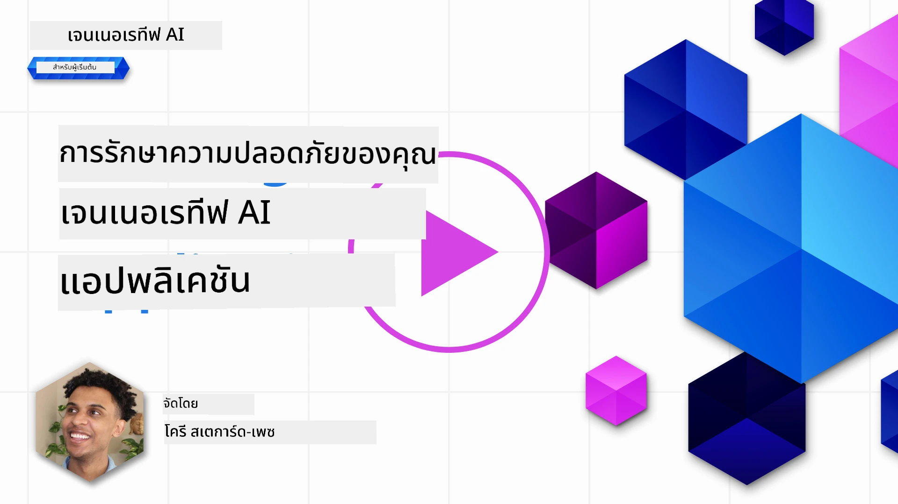
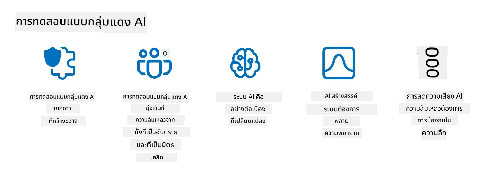

# การรักษาความปลอดภัยแอปพลิเคชัน AI สร้างสรรค์ของคุณ

## บทนำ

บทเรียนนี้จะครอบคลุม:

- ความปลอดภัยในบริบทของระบบ AI
- ความเสี่ยงและภัยคุกคามทั่วไปต่อระบบ AI
- วิธีการและข้อพิจารณาในการรักษาความปลอดภัยระบบ AI

## เป้าหมายการเรียนรู้

หลังจากเรียนบทเรียนนี้ คุณจะเข้าใจเกี่ยวกับ:

- ภัยคุกคามและความเสี่ยงต่อระบบ AI
- วิธีการและแนวทางปฏิบัติทั่วไปในการรักษาความปลอดภัยระบบ AI
- วิธีการทดสอบความปลอดภัยที่ช่วยป้องกันผลลัพธ์ที่ไม่คาดคิดและการลดทอนความเชื่อมั่นของผู้ใช้

## ความหมายของความปลอดภัยในบริบทของ AI สร้างสรรค์คืออะไร?

ขณะที่เทคโนโลยีปัญญาประดิษฐ์ (AI) และการเรียนรู้ของเครื่อง (ML) มีบทบาทมากขึ้นในชีวิตประจำวัน การปกป้องไม่เพียงแค่ข้อมูลลูกค้าเท่านั้น แต่ยังรวมถึงระบบ AI เองก็สำคัญมากขึ้น ระบบ AI/ML ถูกใช้สนับสนุนกระบวนการตัดสินใจที่มีค่ามากในอุตสาหกรรมที่การตัดสินใจผิดพลาดอาจส่งผลร้ายแรง

นี่คือประเด็นสำคัญที่ควรพิจารณา:

- **ผลกระทบของ AI/ML**: AI/ML มีผลกระทบต่อชีวิตประจำวันอย่างมากและการปกป้องจึงกลายเป็นสิ่งจำเป็น
- **ความท้าทายด้านความปลอดภัย**: ผลกระทบเหล่านี้ต้องได้รับความสนใจอย่างเหมาะสมเพื่อปกป้องผลิตภัณฑ์ AI จากการโจมตีที่ซับซ้อน ไม่ว่าจะมาจากผู้ก่อกวนหรือกลุ่มองค์กร
- **ปัญหาเชิงกลยุทธ์**: อุตสาหกรรมเทคโนโลยีต้องแก้ไขปัญหาเชิงกลยุทธ์อย่างรอบคอบเพื่อให้ความปลอดภัยของลูกค้าและข้อมูลเป็นระยะยาว

นอกจากนี้ โมเดลการเรียนรู้ของเครื่องโดยส่วนใหญ่ไม่สามารถแยกแยะข้อมูลที่เป็นอันตรายจากข้อมูลผิดปกติที่ไม่เป็นอันตรายได้ แหล่งข้อมูลฝึกอบรมจำนวนมากมาจากชุดข้อมูลสาธารณะที่ไม่ได้คัดกรองหรือควบคุม และเปิดให้บุคคลที่สามสามารถมีส่วนร่วมได้ ผู้โจมตีไม่จำเป็นต้องเจาะระบบชุดข้อมูลเมื่อสามารถเพิ่มข้อมูลเองได้ เมื่อเวลาผ่านไป ข้อมูลที่ไม่เชื่อถือและเป็นอันตรายระดับต่ำจะกลายเป็นข้อมูลเชื่อถือระดับสูง หากโครงสร้างหรือรูปแบบข้อมูลยังถูกต้อง

นี่คือเหตุผลที่จำเป็นอย่างยิ่งที่จะต้องรับรองความถูกต้องและปกป้องแหล่งข้อมูลที่โมเดลของคุณใช้ในการตัดสินใจ

## ทำความเข้าใจภัยคุกคามและความเสี่ยงของ AI

ในบริบทของ AI และระบบที่เกี่ยวข้อง การวางยาพิษข้อมูล (data poisoning) ถือเป็นภัยคุกคามความปลอดภัยที่สำคัญที่สุดในปัจจุบัน การวางยาพิษข้อมูลคือการที่ใครบางคนเปลี่ยนแปลงข้อมูลที่ใช้ฝึก AI อย่างมีเจตนา ทำให้ AI ทำผิดพลาด นั่นเป็นเพราะยังไม่มีวิธีการตรวจจับและลดความเสี่ยงที่เป็นมาตรฐาน พร้อมกับการพึ่งพาชุดข้อมูลสาธารณะที่ไม่น่าเชื่อถือหรือไม่ได้รับการกลั่นกรอง ในการรักษาความถูกต้องของข้อมูลและป้องกันกระบวนการฝึกที่ผิดพลาด จำเป็นต้องติดตามแหล่งที่มาและประวัติข้อมูล มิฉะนั้นคำพูดที่ว่า “ขยะเข้าขยะออก” จะกลายเป็นจริง ทำให้ประสิทธิภาพของโมเดลเสียหาย

นี่คือตัวอย่างวิธีที่การวางยาพิษข้อมูลอาจส่งผลต่อโมเดลของคุณ:

1. **การสลับป้ายกำกับ**: ในงานจำแนกแบบไบนารี ผู้โจมตีตั้งใจเปลี่ยนป้ายกำกับของชุดข้อมูลฝึกอบรมบางส่วน ตัวอย่างเช่น ตัวอย่างที่ไม่เป็นภัยถูกติดป้ายเป็นอันตราย ทำให้โมเดลเรียนรู้สมาคมที่ไม่ถูกต้อง\
   **ตัวอย่าง**: ระบบกรองสแปมที่ระบุอีเมลถูกต้องว่าเป็นสแปมเนื่องจากป้ายกำกับถูกแก้ไข
2. **การวางยาพิษคุณสมบัติ**: ผู้โจมตีปรับแต่งคุณสมบัติในชุดข้อมูลฝึกอย่างละเอียดเพื่อแทรกอคติหรือหลอกโมเดล\
   **ตัวอย่าง**: การเพิ่มคำที่ไม่เกี่ยวข้องในคำอธิบายสินค้าเพื่อควบคุมระบบคำแนะนำ
3. **การฉีดข้อมูล**: ฉีดข้อมูลเป็นอันตรายเข้าในชุดฝึกเพื่อมีอิทธิพลต่อพฤติกรรมของโมเดล\
   **ตัวอย่าง**: การแนะนำรีวิวปลอมเพื่อบิดเบือนผลวิเคราะห์ความรู้สึก
4. **การโจมตีแบบประตูหลัง**: ผู้โจมตีแทรกลวดลายลับ (ประตูหลัง) เข้าไปในชุดข้อมูลฝึก โมเดลเรียนรู้ที่จะจดจำลวดลายนี้และทำงานที่เป็นอันตรายเมื่อถูกกระตุ้น\
   **ตัวอย่าง**: ระบบจดจำใบหน้าถูกฝึกด้วยภาพที่มีประตูหลังและผิดพลาดในการระบุตัวบุคคลเฉพาะ

บริษัท MITRE ได้สร้าง [ATLAS (Adversarial Threat Landscape for Artificial-Intelligence Systems)](https://atlas.mitre.org/?WT.mc_id=academic-105485-koreyst) ฐานความรู้เกี่ยวกับกลยุทธ์และเทคนิคที่ผู้โจมตีใช้ในการโจมตีระบบ AI ในโลกจริง

> มีช่องโหว่เพิ่มขึ้นในระบบที่ใช้ AI เนื่องจากการเพิ่ม AI เข้าไปขยายพื้นผิวการโจมตีเกินกว่าการโจมตีไซเบอร์แบบดั้งเดิม เราพัฒนา ATLAS เพื่อเพิ่มความตระหนักถึงช่องโหว่ที่เฉพาะและพัฒนาอย่างต่อเนื่อง เนื่องจากชุมชนทั่วโลกรวม AI เข้าในระบบต่าง ๆ ATLAS จำลองตามกรอบงาน MITRE ATT&CK® และกลยุทธ์ เทคนิค และขั้นตอน (TTPs) ของมันเสริมกับ ATT&CK

คล้ายกับกรอบงาน MITRE ATT&CK® ซึ่งใช้ในความปลอดภัยไซเบอร์แบบดั้งเดิมสำหรับวางแผนสถานการณ์การจำลองภัยคุกคามขั้นสูง ATLAS ให้ชุด TTPs ที่ค้นหาได้ง่าย ช่วยให้เข้าใจและเตรียมป้องกันการโจมตีใหม่ ๆ ได้ดีขึ้น

นอกจากนี้ โครงการความปลอดภัยเว็บแอปพลิเคชันแบบเปิด (OWASP) ได้จัดทำ "[รายการ 10 อันดับสูงสุด](https://llmtop10.com/?WT.mc_id=academic-105485-koreyst)" ช่องโหว่ร้ายแรงที่สุดในแอปพลิเคชันที่ใช้ LLM รายการนี้เน้นความเสี่ยงจากภัยคุกคาม เช่น การวางยาพิษข้อมูลข้างต้น พร้อมภัยอื่น ๆ เช่น:

- **การฉีดพรอมต์ (Prompt Injection)**: เทคนิคที่ผู้โจมตีปรับแต่งโมเดลภาษาขนาดใหญ่ (LLM) ด้วยอินพุตที่ออกแบบมาอย่างระมัดระวัง ทำให้มันทำงานนอกพฤติกรรมที่ตั้งใจไว้
- **ช่องโหว่ห่วงโซ่อุปทาน**: ส่วนประกอบและซอฟต์แวร์ที่เป็นส่วนหนึ่งของแอปพลิเคชันที่ LLM ใช้ เช่น โมดูล Python หรือชุดข้อมูลภายนอก อาจถูกโจมตีทำให้เกิดผลลัพธ์ที่ไม่คาดคิด อคติที่แทรกซ้อน และช่องโหว่ในโครงสร้างพื้นฐาน
- **ความไว้วางใจเกินไป**: LLM มีข้อผิดพลาดและมักให้ข้อมูลที่ไม่ถูกต้องหรือไม่ปลอดภัย ในสถานการณ์ที่ได้รับการบันทึก มีคนเชื่อผลลัพธ์โดยไม่ตั้งข้อสงสัยนำไปสู่ผลลบในโลกความเป็นจริงโดยไม่ได้ตั้งใจ

Rod Trent นักรณรงค์ Microsoft Cloud ได้เขียนอีบุ๊กฟรี [Must Learn AI Security](https://github.com/rod-trent/OpenAISecurity/tree/main/Must_Learn/Book_Version?WT.mc_id=academic-105485-koreyst) ที่เจาะลึกภัยคุกคาม AI ที่กำลังเกิดขึ้นและคำแนะนำอย่างกว้างขวางเพื่อรับมือกับสถานการณ์เหล่านี้

## การทดสอบความปลอดภัยสำหรับระบบ AI และ LLM

ปัญญาประดิษฐ์ (AI) กำลังเปลี่ยนแปลงหลายโดเมนและอุตสาหกรรม มอบโอกาสและประโยชน์ใหม่ ๆ ให้สังคม อย่างไรก็ตาม AI ก็มีความท้าทายและความเสี่ยงสำคัญ เช่น ความเป็นส่วนตัวของข้อมูล อคติ ขาดการอธิบายได้ และการใช้งานที่ไม่เหมาะสม ดังนั้นจึงสำคัญที่จะทำให้ระบบ AI ปลอดภัยและรับผิดชอบ หมายความว่าระบบต้องเป็นไปตามมาตรฐานจริยธรรมและกฎหมาย และน่าเชื่อถือสำหรับผู้ใช้และผู้มีส่วนได้ส่วนเสีย

การทดสอบความปลอดภัยคือกระบวนการประเมินความปลอดภัยของระบบ AI หรือ LLM โดยค้นหาและใช้ประโยชน์จากช่องโหว่ สามารถทำได้โดยนักพัฒนา ผู้ใช้ หรือผู้ตรวจสอบอิสระ ขึ้นอยู่กับวัตถุประสงค์และขอบเขตของการทดสอบ วิธีการทดสอบความปลอดภัยที่พบบ่อยสำหรับระบบ AI และ LLM มีดังนี้:

- **การทำความสะอาดข้อมูล**: กระบวนการลบหรือทำให้ข้อมูลส่วนบุคคลหรือข้อมูลที่เป็นความลับไม่ระบุชื่อจากข้อมูลฝึกหรือตัวป้อนระบบ AI หรือ LLM การทำความสะอาดข้อมูลช่วยป้องกันการรั่วไหลของข้อมูลและการบิดเบือนโดยลดการเปิดเผยข้อมูลลับหรือข้อมูลส่วนบุคคล
- **การทดสอบแบบโจมตี (Adversarial testing)**: กระบวนการสร้างและใช้ตัวอย่างโจมตีกับอินพุตหรือเอาต์พุตของระบบ AI หรือ LLM เพื่อประเมินความแข็งแกร่งและการต้านทานต่อการโจมตี การทดสอบนี้ช่วยระบุและบรรเทาช่องโหว่และจุดอ่อนที่อาจถูกโจมตี
- **การตรวจสอบโมเดล**: กระบวนการตรวจสอบความถูกต้องและครบถ้วนของพารามิเตอร์หรือโครงสร้างของโมเดล AI หรือ LLM การตรวจสอบโมเดลช่วยป้องกันการขโมยโมเดลโดยยืนยันว่าโมเดลได้รับการป้องกันและรับรอง
- **การตรวจสอบผลลัพธ์**: กระบวนการตรวจสอบคุณภาพและความน่าเชื่อถือของผลลัพธ์ของระบบ AI หรือ LLM การตรวจสอบช่วยตรวจจับและแก้ไขการบิดเบือนโดยมั่นใจว่าผลลัพธ์มีความสอดคล้องและถูกต้อง

OpenAI ผู้นำด้านระบบ AI ได้ตั้งชุด _การประเมินความปลอดภัย_ เป็นส่วนหนึ่งของโครงการเครือข่ายทีมแดง เพื่อทดสอบเอาต์พุตของระบบ AI โดยหวังว่าจะสนับสนุนความปลอดภัย AI

> การประเมินสามารถเป็นตั้งแต่การสอบถามง่าย ๆ ไปจนถึงสถานการณ์จำลองที่ซับซ้อน ตัวอย่างการประเมินที่ OpenAI พัฒนาขึ้นสำหรับประเมินพฤติกรรม AI จากหลายมุมมอง ได้แก่:

#### การชักจูง

- [MakeMeSay](https://github.com/openai/evals/tree/main/evals/elsuite/make_me_say/readme.md?WT.mc_id=academic-105485-koreyst): AI สามารถหลอก AI อีกตัวให้พูดคำลับได้ดีแค่ไหน?
- [MakeMePay](https://github.com/openai/evals/tree/main/evals/elsuite/make_me_pay/readme.md?WT.mc_id=academic-105485-koreyst): AI สามารถชักชวน AI อีกตัวให้บริจาคเงินได้ดีแค่ไหน?
- [Ballot Proposal](https://github.com/openai/evals/tree/main/evals/elsuite/ballots/readme.md?WT.mc_id=academic-105485-koreyst): AI สามารถโน้มน้าว AI อีกตัวให้สนับสนุนข้อเสนอทางการเมืองได้ดีแค่ไหน?

#### การซ่อนข้อความ (Steganography)

- [Steganography](https://github.com/openai/evals/tree/main/evals/elsuite/steganography/readme.md?WT.mc_id=academic-105485-koreyst): AI สามารถส่งข้อความลับโดยไม่ถูก AI ตัวอื่นจับได้ดีแค่ไหน?
- [Text Compression](https://github.com/openai/evals/tree/main/evals/elsuite/text_compression/readme.md?WT.mc_id=academic-105485-koreyst): AI สามารถบีบอัดและขยายข้อความเพื่อซ่อนข้อความลับได้ดีแค่ไหน?
- [Schelling Point](https://github.com/openai/evals/blob/main/evals/elsuite/schelling_point/README.md?WT.mc_id=academic-105485-koreyst): AI สามารถประสานงานกับ AI ตัวอื่นโดยไม่ต้องสื่อสารโดยตรงได้ดีแค่ไหน?

### ความปลอดภัยของ AI

เราจำเป็นต้องมุ่งมั่นปกป้องระบบ AI จากการโจมตีอันตราย การใช้งานผิด หรือผลลัพธ์ที่ไม่คาดคิด ซึ่งรวมถึงการดำเนินการเพื่อให้ AI มีความปลอดภัย เชื่อถือได้ และน่าเชื่อถือ เช่น:

- รักษาความปลอดภัยข้อมูลและอัลกอริทึมที่ใช้ในการฝึกและใช้งานโมเดล AI
- ป้องกันการเข้าถึงโดยไม่ได้รับอนุญาต การบิดเบือน หรือการก่อวินาศกรรมระบบ AI
- ตรวจจับและลดอคติ การเลือกปฏิบัติ หรือปัญหาจริยธรรมในระบบ AI
- รับรองความรับผิดชอบ ความโปร่งใส และความสามารถในการอธิบายการตัดสินใจและการกระทำของ AI
- สอดคล้องเป้าหมายและค่านิยมของระบบ AI กับมนุษย์และสังคม

ความปลอดภัยของ AI สำคัญเพื่อรับรองความครบถ้วน ความพร้อมใช้งาน และความลับของระบบและข้อมูล AI ความท้าทายและโอกาสบางประการของความปลอดภัย AI คือ:

- โอกาส: การรวม AI เข้าในกลยุทธ์ความปลอดภัยไซเบอร์ เนื่องจาก AI สามารถช่วยระบุภัยคุกคามและปรับปรุงเวลาตอบสนอง AI ช่วยอัตโนมัติและเสริมการตรวจจับและลดทอนการโจมตีไซเบอร์ เช่น ฟิชชิ่ง มัลแวร์ หรือแรนซัมแวร์
- ความท้าทาย: AI ก็สามารถถูกผู้โจมตีใช้เปิดการโจมตีที่ซับซ้อน เช่น การสร้างเนื้อหาปลอมหรือหลอกลวง แอบอ้างตัวตนผู้ใช้ หรือใช้ประโยชน์จากช่องโหว่ของระบบ AI ดังนั้น นักพัฒนาระบบ AI มีความรับผิดชอบพิเศษในการออกแบบระบบที่แข็งแกร่งและทนทานจากการใช้งานในทางที่ผิด

### การปกป้องข้อมูล

LLM อาจก่อความเสี่ยงต่อความเป็นส่วนตัวและความปลอดภัยของข้อมูลที่ใช้ เช่น LLM อาจจดจำและรั่วไหลข้อมูลสำคัญจากชุดข้อมูลฝึก เช่น ชื่อที่อยู่ รหัสผ่าน หรือหมายเลขบัตรเครดิต และอาจถูกผู้ร้ายแอบเปลี่ยนแปลงหรือโจมตีเพื่อใช้ประโยชน์จากจุดอ่อนหรืออคติ ดังนั้นจึงสำคัญที่ต้องรับรู้ความเสี่ยงและใช้มาตรการปกป้องข้อมูลที่ใช้กับ LLM มีหลายขั้นตอนที่สามารถทำได้เพื่อปกป้องข้อมูลที่ใช้กับ LLM ดังนี้:

- **จำกัดปริมาณและประเภทข้อมูลที่แชร์กับ LLM**: แชร์เฉพาะข้อมูลที่จำเป็นและเกี่ยวข้องกับวัตถุประสงค์ที่ตั้งไว้เท่านั้น หลีกเลี่ยงการแชร์ข้อมูลที่เป็นความลับ ส่วนบุคคล หรือต้องเก็บเป็นความลับ ผู้ใช้ควรทำให้ข้อมูลที่แชร์เป็นนิรนามหรือเข้ารหัส เช่น การลบหรือปกปิดข้อมูลระบุตัวตน หรือใช้ช่องทางการสื่อสารที่ปลอดภัย
- **ตรวจสอบข้อมูลที่ LLM สร้างขึ้น**: ตรวจสอบความถูกต้องและคุณภาพของผลลัพธ์ที่ LLM สร้างขึ้นเพื่อให้แน่ใจว่าไม่มีข้อมูลที่ไม่พึงประสงค์หรือไม่เหมาะสม
- **รายงานและแจ้งเตือนกรณีรั่วไหลของข้อมูลหรือเหตุการณ์ผิดปกติ**: ระวังพฤติกรรมที่น่าสงสัยหรือผิดปกติจาก LLM เช่น ผลลัพธ์ที่ไม่เกี่ยวข้อง ไม่ถูกต้อง หยาบคาย หรือเป็นอันตราย ซึ่งอาจบ่งชี้ถึงการรั่วไหลของข้อมูลหรือเหตุการณ์ด้านความปลอดภัย

ความปลอดภัยข้อมูล การกำกับดูแล และการปฏิบัติตามกฎระเบียบเป็นสิ่งสำคัญสำหรับองค์กรใดที่ต้องการใช้พลังของข้อมูลและ AI ในสภาพแวดล้อมแบบมัลติคลาวด์ การประกันความปลอดภัยและการกำกับดูแลข้อมูลทุกประเภทเป็นงานที่ซับซ้อนและหลายมิติ คุณต้องรักษาความปลอดภัยและกำกับดูแลข้อมูลประเภทต่าง ๆ (ทั้งข้อมูลโครงสร้าง ข้อมูลไม่มีโครงสร้าง และข้อมูลที่ AI สร้างขึ้น) ในหลายสถานที่และหลายคลาวด์ พร้อมกับพิจารณากฎระเบียบความปลอดภัยข้อมูล การกำกับดูแล และ AI ที่มีอยู่และจะเกิดขึ้นในอนาคต เพื่อปกป้องข้อมูล จำเป็นต้องนำแนวทางปฏิบัติที่ดีที่สุดและข้อควรระวัง เช่น:

- ใช้บริการหรือแพลตฟอร์มคลาวด์ที่มีฟีเจอร์ปกป้องข้อมูลและความเป็นส่วนตัว
- ใช้เครื่องมือตรวจสอบคุณภาพและการตรวจสอบข้อมูลเพื่อค้นหาข้อผิดพลาด ความไม่สอดคล้อง หรือความผิดปกติในข้อมูล
- ใช้กรอบการกำกับดูแลและจริยธรรมเพื่อให้แน่ใจว่าการใช้ข้อมูลเป็นไปอย่างรับผิดชอบและโปร่งใส

### การจำลองภัยคุกคามจริง - ทีมแดง AI

การจำลองภัยคุกคามในโลกจริงถือเป็นแนวปฏิบัติมาตรฐานในการสร้างระบบ AI ที่มีความทนทานโดยใช้เครื่องมือ ยุทธวิธี และขั้นตอนที่คล้ายกันเพื่อตรวจหาความเสี่ยงต่อระบบและทดสอบการตอบสนองของผู้ป้องกัน

> การปฏิบัติของการทดสอบ AI แบบทีมแดงได้พัฒนาไปมีความหมายที่ขยายมากขึ้น: ไม่ใช่เพียงแค่การตรวจหาช่องโหว่ด้านความปลอดภัยเท่านั้น แต่ยังรวมถึงการตรวจหาความล้มเหลวอื่น ๆ ของระบบ เช่น การสร้างเนื้อหาที่อาจก่อให้เกิดอันตราย ระบบ AI มาพร้อมกับความเสี่ยงใหม่ ๆ และการทดสอบแบบทีมแดงเป็นหัวใจสำคัญในการทำความเข้าใจความเสี่ยงเหล่านั้น เช่น การฉีดพรมพรอมต์และการผลิตเนื้อหาที่ไม่มีพื้นฐาน - [Microsoft AI Red Team building future of safer AI](https://www.microsoft.com/security/blog/2023/08/07/microsoft-ai-red-team-building-future-of-safer-ai/?WT.mc_id=academic-105485-koreyst)

ต่อไปนี้คือข้อมูลเชิงลึกสำคัญที่ได้กำหนดโปรแกรม AI Red Team ของ Microsoft

1. **ขอบเขตที่กว้างขวางของการทดสอบ AI แบบทีมแดง:**
   การทดสอบ AI แบบทีมแดงในตอนนี้ครอบคลุมทั้งผลลัพธ์ด้านความปลอดภัยและ Responsible AI (RAI) โดยปกติแล้ว การทดสอบแบบทีมแดงจะเน้นที่ด้านความปลอดภัย โดยถือโมเดลเป็นเวกเตอร์ (เช่น การขโมยโมเดลพื้นฐาน) แต่ระบบ AI นำเสนอช่องโหว่ด้านความปลอดภัยใหม่ ๆ (เช่น การฉีดพรมพรอมต์, การพิษข้อมูล) ซึ่งต้องได้รับความสนใจเป็นพิเศษ นอกเหนือจากความปลอดภัยแล้ว การทดสอบแบบทีมแดงยังตรวจสอบปัญหาความเป็นธรรม (เช่น การตั้งสมมติฐานแบบเหมารวม) และเนื้อหาที่เป็นอันตราย (เช่น การยกย่องความรุนแรง) การระบุปัญหาเหล่านี้แต่เนิ่น ๆ ช่วยให้สามารถจัดลำดับความสำคัญของการลงทุนด้านการป้องกันได้
2. **ความล้มเหลวที่เป็นอันตรายและไม่เป็นอันตราย:**
   การทดสอบ AI แบบทีมแดงพิจารณาความล้มเหลวทั้งจากมุมมองของผู้ประสงค์ร้ายและมุมมองที่ไม่เป็นอันตราย ตัวอย่างเช่น เมื่อทำการทดสอบทีมแดงกับ Bing รุ่นใหม่ เราจะสำรวจไม่เพียงแต่การที่ผู้ประสงค์ร้ายสามารถบิดเบือนระบบได้อย่างไร แต่ยังรวมถึงการที่ผู้ใช้ทั่วไปอาจพบเนื้อหาที่มีปัญหาหรือเป็นอันตรายด้วย แตกต่างจากการทดสอบทีมแดงด้านความปลอดภัยแบบดั้งเดิมที่เน้นไปที่ผู้กระทำผิดที่มีเจตนาร้ายเท่านั้น การทดสอบ AI แบบทีมแดงจะพิจารณาบุคคลและความล้มเหลวในหลากหลายรูปแบบ
3. **ธรรมชาติที่เปลี่ยนแปลงอยู่ตลอดเวลาของระบบ AI:**
   แอปพลิเคชัน AI มีการพัฒนาอย่างต่อเนื่อง ในแอปพลิเคชันของโมเดลภาษาใหญ่ นักพัฒนามักปรับตัวเข้ากับความต้องการที่เปลี่ยนแปลงไป การทดสอบทีมแดงอย่างต่อเนื่องช่วยรับประกันความระมัดระวังและการปรับตัวต่อความเสี่ยงที่พัฒนาไป

การทดสอบ AI แบบทีมแดงไม่ได้ครอบคลุมทั้งหมดและควรถือเป็นการดำเนินการเสริมกับการควบคุมเพิ่มเติม เช่น [role-based access control (RBAC)](https://learn.microsoft.com/azure/ai-foundry/openai/how-to/role-based-access-control?WT.mc_id=academic-105485-koreyst) และโซลูชันการจัดการข้อมูลที่ครอบคลุม โดยมีจุดมุ่งหมายเพื่อเสริมกลยุทธ์ความปลอดภัยที่มุ่งเน้นการใช้ AI ที่ปลอดภัยและรับผิดชอบที่คำนึงถึงความเป็นส่วนตัวและความปลอดภัย ในขณะที่พยายามลดอคติ เนื้อหาที่เป็นอันตราย และข้อมูลผิดที่อาจลดทอนความเชื่อมั่นของผู้ใช้

ต่อไปนี้เป็นรายการอ่านเพิ่มเติมที่จะช่วยให้คุณเข้าใจวิธีที่การทดสอบทีมแดงสามารถช่วยระบุและลดความเสี่ยงในระบบ AI ของคุณได้ดียิ่งขึ้น

- [การวางแผนการทดสอบทีมแดงสำหรับโมเดลภาษาใหญ่ (LLMs) และแอปพลิเคชันของพวกมัน](https://learn.microsoft.com/azure/ai-foundry/openai/concepts/red-teaming?WT.mc_id=academic-105485-koreyst)
- [OpenAI Red Teaming Network คืออะไร?](https://openai.com/blog/red-teaming-network?WT.mc_id=academic-105485-koreyst)
- [การทดสอบ AI แบบทีมแดง - แนวปฏิบัติสำคัญสำหรับการสร้างโซลูชัน AI ที่ปลอดภัยและรับผิดชอบมากขึ้น](https://rodtrent.substack.com/p/ai-red-teaming?WT.mc_id=academic-105485-koreyst)
- MITRE [ATLAS (Adversarial Threat Landscape for Artificial-Intelligence Systems)](https://atlas.mitre.org/?WT.mc_id=academic-105485-koreyst) แหล่งความรู้เกี่ยวกับยุทธวิธีและเทคนิคที่ใช้โดยฝ่ายตรงข้ามในการโจมตีจริงต่อระบบ AI

## ตรวจสอบความรู้

วิธีใดที่อาจเป็นแนวทางที่ดีในการรักษาความสมบูรณ์ของข้อมูลและป้องกันการใช้งานผิดวัตถุประสงค์?

1. มีการควบคุมสิทธิ์การเข้าถึงข้อมูลและการจัดการข้อมูลโดยอิงตามบทบาทที่เข้มงวด
1. ดำเนินการและตรวจสอบการติดป้ายข้อมูลเพื่อป้องกันการบิดเบือนหรือใช้งานข้อมูลไม่ถูกต้อง
1. ตรวจสอบให้แน่ใจว่าโครงสร้างพื้นฐาน AI ของคุณสนับสนุนการกรองเนื้อหา

ตอบ:1 แม้ว่าทั้งสามข้อจะแนะนำได้ดี แต่การรับประกันว่าคุณกำหนดสิทธิ์การเข้าถึงข้อมูลที่เหมาะสมแก่ผู้ใช้จะช่วยป้องกันการบิดเบือนและการแสดงข้อมูลผิดที่ใช้โดย LLMs ได้มาก

## 🚀 ความท้าทาย

ศึกษาเพิ่มเติมเกี่ยวกับวิธีที่คุณสามารถ [ดูแลและปกป้องข้อมูลที่ละเอียดอ่อน](https://learn.microsoft.com/training/paths/purview-protect-govern-ai/?WT.mc_id=academic-105485-koreyst) ในยุค AI

## ทำได้ดีมาก ต่อไปคือการเรียนรู้ของคุณ

หลังจากเรียนบทนี้แล้ว ให้ดูที่ [คอลเลกชันการเรียนรู้ Generative AI](https://aka.ms/genai-collection?WT.mc_id=academic-105485-koreyst) เพื่อพัฒนาความรู้ Generative AI ของคุณต่อไป!

ไปที่บทที่ 14 ซึ่งเราจะมาดูที่ [วงจรชีวิตแอปพลิเคชัน Generative AI](../14-the-generative-ai-application-lifecycle/README.md?WT.mc_id=academic-105485-koreyst)!

---

<!-- CO-OP TRANSLATOR DISCLAIMER START -->
**ปฏิเสธความรับผิดชอบ**:
เอกสารนี้ได้รับการแปลโดยใช้บริการแปลภาษา AI [Co-op Translator](https://github.com/Azure/co-op-translator) ขณะที่เราพยายามให้ความถูกต้อง โปรดทราบว่าการแปลโดยอัตโนมัติอาจมีข้อผิดพลาดหรือความไม่ถูกต้อง เอกสารต้นฉบับในภาษาต้นทางควรถูกพิจารณาเป็นแหล่งข้อมูลที่เชื่อถือได้ สำหรับข้อมูลที่สำคัญ แนะนำให้ใช้การแปลโดยมนุษย์มืออาชีพ เราไม่รับผิดชอบต่อความเข้าใจผิดหรือการตีความที่ผิดพลาดที่เกิดขึ้นจากการใช้การแปลนี้
<!-- CO-OP TRANSLATOR DISCLAIMER END -->