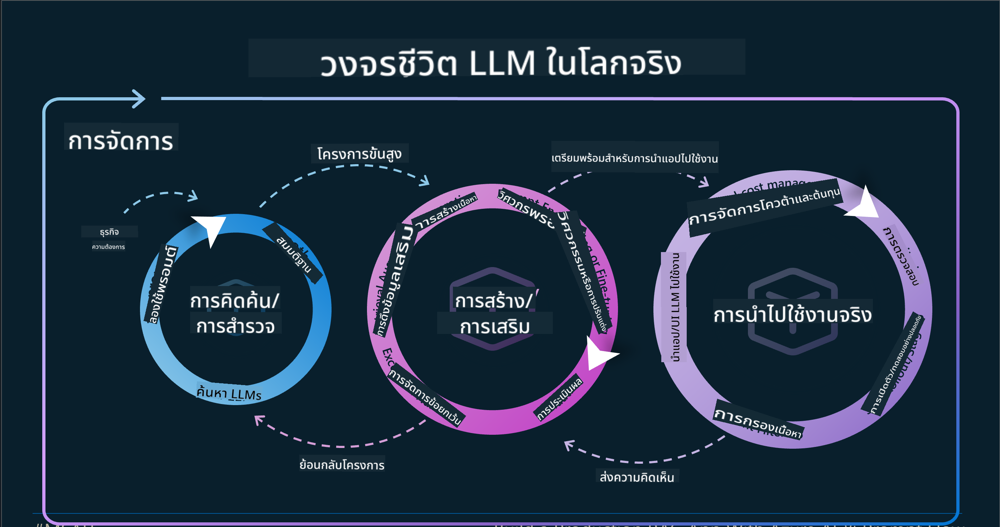

<!--
CO_OP_TRANSLATOR_METADATA:
{
  "original_hash": "df44972d5575ea8cef3c52ee31696d04",
  "translation_date": "2025-12-19T15:12:22+00:00",
  "source_file": "14-the-generative-ai-application-lifecycle/README.md",
  "language_code": "th"
}
-->

# วงจรชีวิตแอปพลิเคชัน Generative AI

คำถามสำคัญสำหรับแอปพลิเคชัน AI ทุกตัวคือความเกี่ยวข้องของฟีเจอร์ AI เนื่องจาก AI เป็นสาขาที่พัฒนาอย่างรวดเร็ว เพื่อให้แอปพลิเคชันของคุณยังคงมีความเกี่ยวข้อง เชื่อถือได้ และแข็งแกร่ง คุณจำเป็นต้องติดตาม ประเมินผล และปรับปรุงอย่างต่อเนื่อง นี่คือที่มาของวงจรชีวิต generative AI

วงจรชีวิต generative AI เป็นกรอบการทำงานที่ชี้นำคุณผ่านขั้นตอนการพัฒนา การปรับใช้ และการบำรุงรักษาแอปพลิเคชัน generative AI ช่วยให้คุณกำหนดเป้าหมาย วัดผลการทำงาน ระบุปัญหา และดำเนินการแก้ไข นอกจากนี้ยังช่วยให้แอปพลิเคชันของคุณสอดคล้องกับมาตรฐานทางจริยธรรมและกฎหมายของโดเมนและผู้มีส่วนได้ส่วนเสียของคุณ โดยการปฏิบัติตามวงจรชีวิต generative AI คุณสามารถมั่นใจได้ว่าแอปพลิเคชันของคุณจะส่งมอบคุณค่าและตอบสนองความต้องการของผู้ใช้เสมอ

## บทนำ

ในบทนี้ คุณจะได้:

- เข้าใจการเปลี่ยนแปลงแนวคิดจาก MLOps ไปสู่ LLMOps
- วงจรชีวิตของ LLM
- เครื่องมือสำหรับวงจรชีวิต
- การวัดและประเมินผลวงจรชีวิต

## เข้าใจการเปลี่ยนแปลงแนวคิดจาก MLOps ไปสู่ LLMOps

LLM เป็นเครื่องมือใหม่ในคลังแสงของปัญญาประดิษฐ์ พวกมันมีพลังมหาศาลในการวิเคราะห์และสร้างสรรค์งานสำหรับแอปพลิเคชัน อย่างไรก็ตามพลังนี้มีผลกระทบบางประการต่อวิธีที่เราปรับกระบวนการ AI และ Machine Learning แบบคลาสสิก

ด้วยเหตุนี้ เราจึงต้องมีแนวคิดใหม่เพื่อปรับใช้เครื่องมือนี้อย่างมีพลวัต พร้อมแรงจูงใจที่เหมาะสม เราสามารถจัดประเภทแอป AI รุ่นเก่าเป็น "ML Apps" และแอป AI รุ่นใหม่เป็น "GenAI Apps" หรือแค่ "AI Apps" ซึ่งสะท้อนเทคโนโลยีและเทคนิคหลักที่ใช้ในเวลานั้น การเปลี่ยนแปลงนี้เปลี่ยนแปลงเรื่องราวของเราในหลายด้าน ดูการเปรียบเทียบต่อไปนี้

สังเกตว่าใน LLMOps เรามุ่งเน้นที่นักพัฒนาแอปพลิเคชันมากขึ้น โดยใช้การผสานรวมเป็นจุดสำคัญ ใช้ "Models-as-a-Service" และคิดในประเด็นต่อไปนี้สำหรับเมตริก

- คุณภาพ: คุณภาพของการตอบสนอง
- อันตราย: AI ที่รับผิดชอบ
- ความซื่อสัตย์: ความมีเหตุผลของการตอบสนอง (สมเหตุสมผลหรือไม่? ถูกต้องหรือไม่?)
- ค่าใช้จ่าย: งบประมาณโซลูชัน
- ความหน่วง: เวลาเฉลี่ยสำหรับการตอบกลับแต่ละโทเค็น

## วงจรชีวิตของ LLM

ก่อนอื่น เพื่อเข้าใจวงจรชีวิตและการปรับเปลี่ยน ให้สังเกตอินโฟกราฟิกต่อไปนี้

อย่างที่คุณอาจสังเกต นี่แตกต่างจากวงจรชีวิตปกติของ MLOps LLM มีข้อกำหนดใหม่มากมาย เช่น การใช้ Prompting เทคนิคต่าง ๆ เพื่อปรับปรุงคุณภาพ (Fine-Tuning, RAG, Meta-Prompts) การประเมินและความรับผิดชอบกับ AI ที่รับผิดชอบ และสุดท้าย เมตริกการประเมินใหม่ (คุณภาพ อันตราย ความซื่อสัตย์ ค่าใช้จ่าย และความหน่วง)

ตัวอย่างเช่น ลองดูวิธีที่เราคิดไอเดีย โดยใช้ prompt engineering เพื่อทดลองกับ LLMs ต่าง ๆ เพื่อสำรวจความเป็นไปได้และทดสอบว่าข้อสมมติฐานของพวกเขาถูกต้องหรือไม่

โปรดทราบว่านี่ไม่ใช่เส้นตรง แต่เป็นวงจรที่บูรณาการ มีการทำซ้ำ และมีวงจรครอบคลุม

เราจะสำรวจขั้นตอนเหล่านั้นได้อย่างไร? มาดูรายละเอียดว่าทำอย่างไรจึงจะสร้างวงจรชีวิตได้

นี่อาจดูซับซ้อนเล็กน้อย ให้เรามุ่งเน้นที่สามขั้นตอนใหญ่ก่อน

1. การคิดไอเดีย/การสำรวจ: การสำรวจ ที่นี่เราสามารถสำรวจตามความต้องการทางธุรกิจของเรา การสร้างต้นแบบ สร้าง [PromptFlow](https://microsoft.github.io/promptflow/index.html?WT.mc_id=academic-105485-koreyst) และทดสอบว่ามีประสิทธิภาพเพียงพอสำหรับสมมติฐานของเราหรือไม่
1. การสร้าง/การเสริม: การดำเนินการ ตอนนี้ เราเริ่มประเมินข้อมูลชุดใหญ่ขึ้น ใช้เทคนิคต่าง ๆ เช่น Fine-tuning และ RAG เพื่อตรวจสอบความแข็งแกร่งของโซลูชันของเรา หากไม่เป็นไปตามนั้น การดำเนินการใหม่ การเพิ่มขั้นตอนใหม่ในกระบวนการ หรือการจัดโครงสร้างข้อมูลใหม่ อาจช่วยได้ หลังจากทดสอบกระบวนการและขนาดของเราแล้ว หากใช้งานได้และตรวจสอบเมตริกของเราแล้ว ก็พร้อมสำหรับขั้นตอนถัดไป
1. การปฏิบัติการ: การผสานรวม ตอนนี้เพิ่มระบบการติดตามและแจ้งเตือนในระบบของเรา การปรับใช้และการผสานรวมแอปพลิเคชันกับแอปพลิเคชันของเรา

จากนั้น เรามีวงจรครอบคลุมของการจัดการ โดยเน้นที่ความปลอดภัย การปฏิบัติตามกฎระเบียบ และการกำกับดูแล

ขอแสดงความยินดี ตอนนี้คุณมีแอป AI พร้อมใช้งานและปฏิบัติการ สำหรับประสบการณ์จริง ลองดูที่ [Contoso Chat Demo.](https://nitya.github.io/contoso-chat/?WT.mc_id=academic-105485-koreys)

ตอนนี้ เราจะใช้เครื่องมืออะไรได้บ้าง?

## เครื่องมือสำหรับวงจรชีวิต

สำหรับเครื่องมือ Microsoft มี [Azure AI Platform](https://azure.microsoft.com/solutions/ai/?WT.mc_id=academic-105485-koreys) และ [PromptFlow](https://microsoft.github.io/promptflow/index.html?WT.mc_id=academic-105485-koreyst) ที่ช่วยอำนวยความสะดวกและทำให้วงจรของคุณง่ายต่อการดำเนินการและพร้อมใช้งาน

[Azure AI Platform](https://azure.microsoft.com/solutions/ai/?WT.mc_id=academic-105485-koreys) ช่วยให้คุณใช้ [AI Studio](https://ai.azure.com/?WT.mc_id=academic-105485-koreys) AI Studio เป็นพอร์ทัลเว็บที่ช่วยให้คุณสำรวจโมเดล ตัวอย่าง และเครื่องมือต่าง ๆ จัดการทรัพยากรของคุณ พัฒนากระบวนการ UI และตัวเลือก SDK/CLI สำหรับการพัฒนาแบบ Code-First

Azure AI ช่วยให้คุณใช้ทรัพยากรหลายอย่างเพื่อจัดการการดำเนินงาน บริการ โครงการ การค้นหาเวกเตอร์ และความต้องการฐานข้อมูลของคุณ

สร้างตั้งแต่ Proof-of-Concept (POC) จนถึงแอปพลิเคชันขนาดใหญ่ด้วย PromptFlow:

- ออกแบบและสร้างแอปจาก VS Code ด้วยเครื่องมือที่เป็นภาพและฟังก์ชัน
- ทดสอบและปรับแต่งแอปของคุณเพื่อ AI คุณภาพสูงได้อย่างง่ายดาย
- ใช้ Azure AI Studio เพื่อผสานรวมและทำซ้ำกับคลาวด์ กดและปรับใช้เพื่อการผสานรวมที่รวดเร็ว

## ดีมาก! เรียนรู้ต่อไป!

สุดยอด ตอนนี้เรียนรู้เพิ่มเติมเกี่ยวกับวิธีที่เราจัดโครงสร้างแอปพลิเคชันเพื่อใช้แนวคิดเหล่านี้กับ [Contoso Chat App](https://nitya.github.io/contoso-chat/?WT.mc_id=academic-105485-koreyst) เพื่อตรวจสอบว่า Cloud Advocacy เพิ่มแนวคิดเหล่านี้ในงานสาธิตอย่างไร สำหรับเนื้อหาเพิ่มเติม ตรวจสอบ [Ignite breakout session!](https://www.youtube.com/watch?v=DdOylyrTOWg)

ตอนนี้ ไปดูบทเรียนที่ 15 เพื่อเข้าใจว่า [Retrieval Augmented Generation และ Vector Databases](../15-rag-and-vector-databases/README.md?WT.mc_id=academic-105485-koreyst) มีผลกระทบต่อ Generative AI อย่างไร และเพื่อสร้างแอปพลิเคชันที่น่าสนใจยิ่งขึ้น!

---

<!-- CO-OP TRANSLATOR DISCLAIMER START -->
**ข้อจำกัดความรับผิดชอบ**:  
เอกสารนี้ได้รับการแปลโดยใช้บริการแปลภาษาอัตโนมัติ [Co-op Translator](https://github.com/Azure/co-op-translator) แม้เราจะพยายามให้ความถูกต้องสูงสุด แต่โปรดทราบว่าการแปลโดยอัตโนมัติอาจมีข้อผิดพลาดหรือความไม่ถูกต้อง เอกสารต้นฉบับในภาษาต้นทางถือเป็นแหล่งข้อมูลที่เชื่อถือได้ สำหรับข้อมูลที่สำคัญ ขอแนะนำให้ใช้บริการแปลโดยผู้เชี่ยวชาญมนุษย์ เราไม่รับผิดชอบต่อความเข้าใจผิดหรือการตีความผิดใด ๆ ที่เกิดจากการใช้การแปลนี้
<!-- CO-OP TRANSLATOR DISCLAIMER END -->