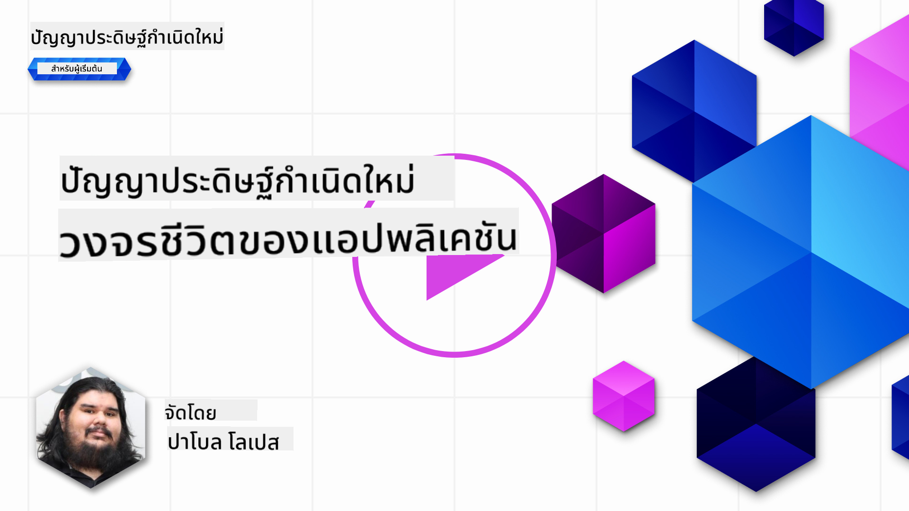
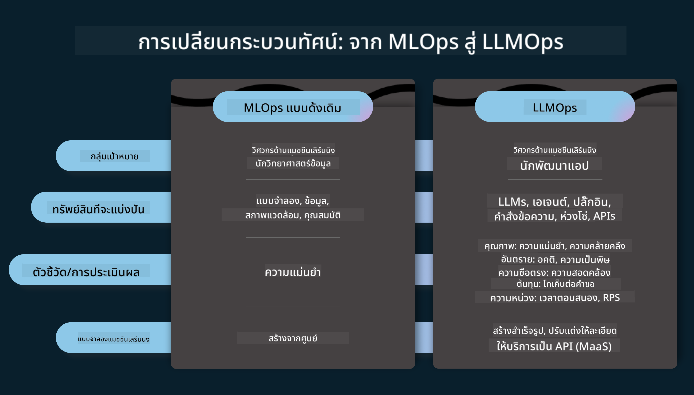
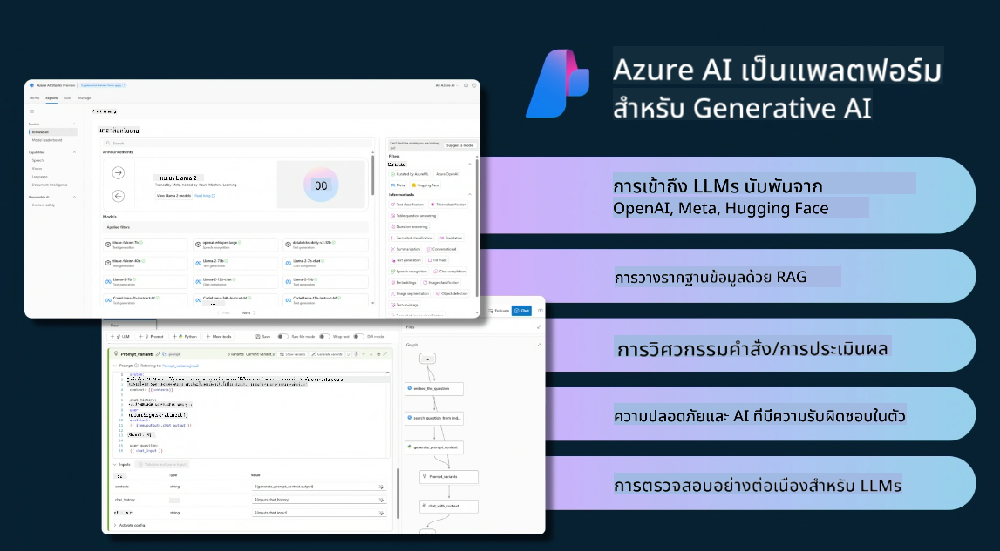
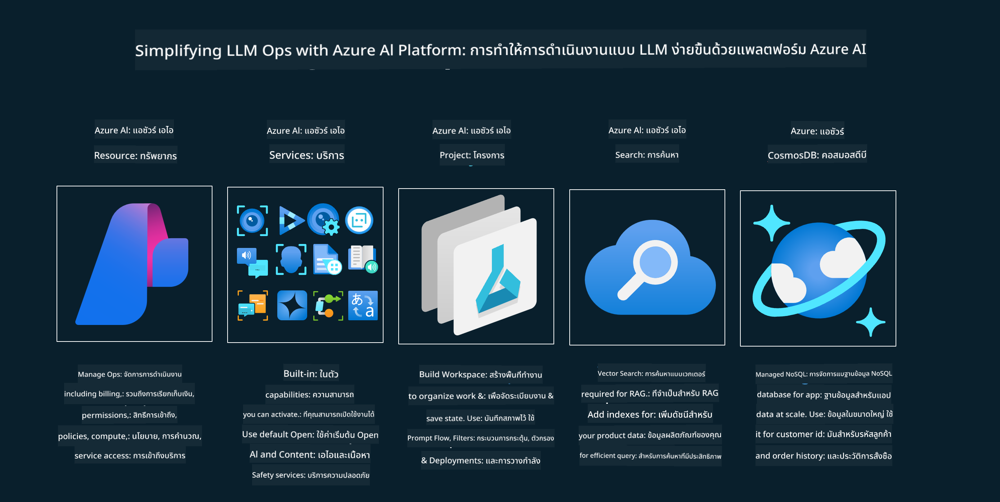
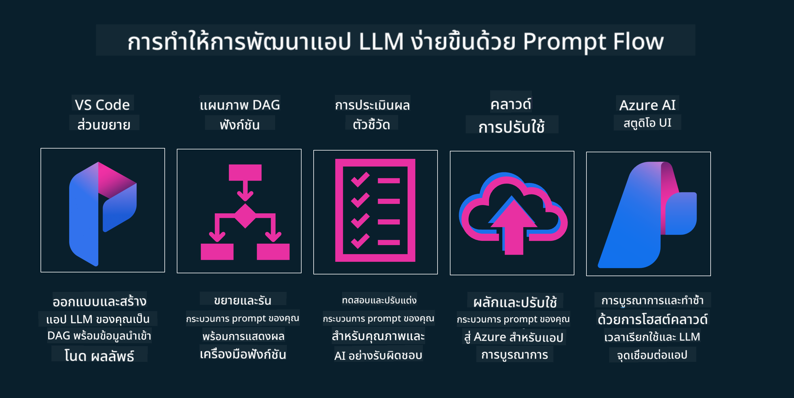

<!--
CO_OP_TRANSLATOR_METADATA:
{
  "original_hash": "27a5347a5022d5ef0a72ab029b03526a",
  "translation_date": "2025-05-19T23:28:16+00:00",
  "source_file": "14-the-generative-ai-application-lifecycle/README.md",
  "language_code": "th"
}
-->

# วงจรชีวิตของแอปพลิเคชัน Generative AI

คำถามสำคัญสำหรับแอปพลิเคชัน AI ทุกประเภทคือความเกี่ยวข้องของคุณสมบัติ AI เนื่องจาก AI เป็นสาขาที่พัฒนาอย่างรวดเร็ว เพื่อให้แน่ใจว่าแอปพลิเคชันของคุณยังคงมีความเกี่ยวข้อง น่าเชื่อถือ และแข็งแกร่ง คุณจำเป็นต้องติดตาม ประเมิน และปรับปรุงอย่างต่อเนื่อง นี่คือที่มาของวงจรชีวิตของ Generative AI

วงจรชีวิตของ Generative AI เป็นกรอบที่แนะนำคุณผ่านขั้นตอนการพัฒนา การปรับใช้ และการดูแลรักษาแอปพลิเคชัน Generative AI มันช่วยให้คุณกำหนดเป้าหมาย วัดผลการทำงาน ระบุความท้าทาย และดำเนินการแก้ไข นอกจากนี้ยังช่วยให้คุณสอดคล้องกับมาตรฐานทางจริยธรรมและกฎหมายของโดเมนและผู้มีส่วนได้ส่วนเสียของคุณ โดยการปฏิบัติตามวงจรชีวิตของ Generative AI คุณสามารถมั่นใจได้ว่าแอปพลิเคชันของคุณจะให้คุณค่าและตอบสนองความต้องการของผู้ใช้เสมอ

## บทนำ

ในบทนี้ คุณจะได้:

- เข้าใจการเปลี่ยนแปลงแนวคิดจาก MLOps เป็น LLMOps
- วงจรชีวิตของ LLM
- เครื่องมือสำหรับวงจรชีวิต
- การวัดผลและการประเมินวงจรชีวิต

## เข้าใจการเปลี่ยนแปลงแนวคิดจาก MLOps เป็น LLMOps

LLM เป็นเครื่องมือใหม่ในคลังแสงของปัญญาประดิษฐ์ มันมีพลังมากในงานวิเคราะห์และการสร้างสำหรับแอปพลิเคชัน แต่พลังนี้มีผลที่ตามมาในวิธีที่เราปรับปรุงงาน AI และ Machine Learning แบบคลาสสิก

ด้วยเหตุนี้ เราจึงต้องการแนวคิดใหม่เพื่อปรับเครื่องมือนี้ให้เข้ากับไดนามิกที่มีแรงจูงใจที่ถูกต้อง เราสามารถจัดประเภทแอป AI เก่าเป็น "ML Apps" และแอป AI ใหม่เป็น "GenAI Apps" หรือเพียงแค่ "AI Apps" เพื่อสะท้อนเทคโนโลยีและเทคนิคที่ใช้กันทั่วไปในขณะนั้น การเปลี่ยนแปลงนี้ทำให้เรามีมุมมองที่หลากหลาย ดูการเปรียบเทียบต่อไปนี้

สังเกตว่าใน LLMOps เรามุ่งเน้นไปที่นักพัฒนาแอปพลิเคชันมากขึ้น โดยใช้การผสานรวมเป็นจุดสำคัญ โดยใช้ "Models-as-a-Service" และคิดในประเด็นต่อไปนี้สำหรับเมตริก

- คุณภาพ: คุณภาพของการตอบสนอง
- อันตราย: AI ที่รับผิดชอบ
- ความซื่อสัตย์: ความสมเหตุสมผลของการตอบสนอง (มีเหตุผลหรือไม่? ถูกต้องหรือไม่?)
- ต้นทุน: งบประมาณของโซลูชัน
- ความล่าช้า: เวลาเฉลี่ยในการตอบสนองของโทเค็น

## วงจรชีวิตของ LLM

ก่อนอื่น เพื่อทำความเข้าใจวงจรชีวิตและการปรับเปลี่ยน ลองดูที่อินโฟกราฟิกต่อไปนี้

ตามที่คุณอาจสังเกต นี่แตกต่างจากวงจรชีวิตทั่วไปจาก MLOps LLM มีข้อกำหนดใหม่หลายอย่าง เช่น การตั้งค่าการกระตุ้น เทคนิคต่างๆ เพื่อปรับปรุงคุณภาพ (การปรับแต่ง การดึงข้อมูล การตั้งค่าการกระตุ้น) การประเมินและความรับผิดชอบที่แตกต่างกันด้วย AI ที่รับผิดชอบ สุดท้าย เมตริกการประเมินใหม่ (คุณภาพ อันตราย ความซื่อสัตย์ ต้นทุน และความล่าช้า)

ตัวอย่างเช่น ดูวิธีที่เราคิดค้น โดยใช้วิศวกรรมการกระตุ้นเพื่อทดลองกับ LLM ต่างๆ เพื่อสำรวจความเป็นไปได้ในการทดสอบว่าข้อสมมติฐานของพวกเขาถูกต้องหรือไม่

โปรดทราบว่านี่ไม่ใช่เชิงเส้น แต่เป็นลูปที่บูรณาการ ซ้ำๆ และมีวงจรที่ครอบคลุม

เราจะสำรวจขั้นตอนเหล่านั้นได้อย่างไร? มาดูรายละเอียดวิธีสร้างวงจรชีวิต

อาจดูซับซ้อนเล็กน้อย ลองมุ่งเน้นที่สามขั้นตอนใหญ่ก่อน

1. การคิด/การสำรวจ: การสำรวจ ที่นี่เราสามารถสำรวจตามความต้องการทางธุรกิจของเรา การสร้างต้นแบบ สร้าง [PromptFlow](https://microsoft.github.io/promptflow/index.html?WT.mc_id=academic-105485-koreyst) และทดสอบว่ามีประสิทธิภาพเพียงพอสำหรับข้อสมมติฐานของเราหรือไม่
2. การสร้าง/การขยาย: การดำเนินการ ตอนนี้เราเริ่มประเมินข้อมูลชุดใหญ่ขึ้น ใช้เทคนิค เช่น การปรับแต่งและ RAG เพื่อตรวจสอบความแข็งแกร่งของโซลูชันของเรา หากไม่เป็นเช่นนั้น การนำไปใช้ใหม่ การเพิ่มขั้นตอนใหม่ในกระบวนการของเราหรือการปรับโครงสร้างข้อมูลอาจช่วยได้ หลังจากทดสอบกระบวนการและขนาดของเราแล้ว หากใช้งานได้และตรวจสอบเมตริกของเราแล้ว ก็พร้อมสำหรับขั้นตอนถัดไป
3. การทำให้เป็นระบบ: การผสานรวม ตอนนี้เพิ่มระบบการตรวจสอบและการแจ้งเตือนให้กับระบบของเรา การปรับใช้และการผสานรวมแอปพลิเคชันกับแอปพลิเคชันของเรา

จากนั้น เรามีวงจรที่ครอบคลุมของการจัดการ โดยมุ่งเน้นที่ความปลอดภัย การปฏิบัติตามข้อกำหนด และการบริหารจัดการ

ยินดีด้วย ตอนนี้คุณมีแอป AI พร้อมใช้งานและทำงานได้แล้ว สำหรับประสบการณ์จริง ลองดู [ตัวอย่าง Contoso Chat.](https://nitya.github.io/contoso-chat/?WT.mc_id=academic-105485-koreys)

ตอนนี้ เราสามารถใช้เครื่องมืออะไรได้บ้าง?

## เครื่องมือสำหรับวงจรชีวิต

สำหรับเครื่องมือ Microsoft มี [Azure AI Platform](https://azure.microsoft.com/solutions/ai/?WT.mc_id=academic-105485-koreys) และ [PromptFlow](https://microsoft.github.io/promptflow/index.html?WT.mc_id=academic-105485-koreyst) ช่วยให้วงจรของคุณง่ายต่อการนำไปใช้และพร้อมใช้งาน

[Azure AI Platform](https://azure.microsoft.com/solutions/ai/?WT.mc_id=academic-105485-koreys) ให้คุณใช้ [AI Studio](https://ai.azure.com/?WT.mc_id=academic-105485-koreys) AI Studio เป็นพอร์ทัลเว็บที่ให้คุณสำรวจโมเดล ตัวอย่าง และเครื่องมือ การจัดการทรัพยากรของคุณ การพัฒนาการไหลของ UI และตัวเลือก SDK/CLI สำหรับการพัฒนา Code-First

Azure AI ช่วยให้คุณใช้ทรัพยากรหลายอย่าง เพื่อจัดการการดำเนินงาน บริการ โครงการ การค้นหาเวกเตอร์ และความต้องการฐานข้อมูลของคุณ

สร้างตั้งแต่ Proof-of-Concept(POC) จนถึงแอปพลิเคชันขนาดใหญ่ด้วย PromptFlow:

- ออกแบบและสร้างแอปจาก VS Code ด้วยเครื่องมือที่มีภาพและฟังก์ชัน
- ทดสอบและปรับแต่งแอปของคุณเพื่อคุณภาพ AI อย่างง่ายดาย
- ใช้ Azure AI Studio เพื่อผสานรวมและทำซ้ำกับคลาวด์ ผลักดันและปรับใช้เพื่อการผสานรวมอย่างรวดเร็ว

## ยอดเยี่ยม! ดำเนินการเรียนรู้ของคุณต่อไป!

ยอดเยี่ยม ตอนนี้เรียนรู้เพิ่มเติมเกี่ยวกับวิธีที่เราจัดโครงสร้างแอปพลิเคชันเพื่อใช้แนวคิดกับ [แอป Contoso Chat](https://nitya.github.io/contoso-chat/?WT.mc_id=academic-105485-koreyst) เพื่อตรวจสอบว่า Cloud Advocacy นำแนวคิดเหล่านั้นไปใช้ในสาธิตอย่างไร สำหรับเนื้อหาเพิ่มเติม ตรวจสอบ [เซสชัน Ignite breakout ของเรา!
](https://www.youtube.com/watch?v=DdOylyrTOWg)

ตอนนี้ตรวจสอบบทเรียนที่ 15 เพื่อทำความเข้าใจว่า [การสร้างแบบดึงข้อมูลและฐานข้อมูลเวกเตอร์](../15-rag-and-vector-databases/README.md?WT.mc_id=academic-105485-koreyst) ส่งผลต่อ Generative AI อย่างไรและเพื่อสร้างแอปพลิเคชันที่น่าสนใจยิ่งขึ้น!

**ข้อจำกัดความรับผิดชอบ**:  
เอกสารนี้ได้รับการแปลโดยใช้บริการแปลภาษา AI [Co-op Translator](https://github.com/Azure/co-op-translator) แม้ว่าเราจะพยายามอย่างเต็มที่เพื่อความถูกต้อง แต่โปรดทราบว่าการแปลอัตโนมัติอาจมีข้อผิดพลาดหรือความไม่ถูกต้อง เอกสารต้นฉบับในภาษาต้นฉบับควรถือเป็นแหล่งข้อมูลที่เชื่อถือได้ สำหรับข้อมูลที่สำคัญ ขอแนะนำให้ใช้บริการแปลโดยมนุษย์มืออาชีพ เราไม่รับผิดชอบต่อความเข้าใจผิดหรือการตีความที่ผิดพลาดซึ่งเกิดจากการใช้การแปลนี้