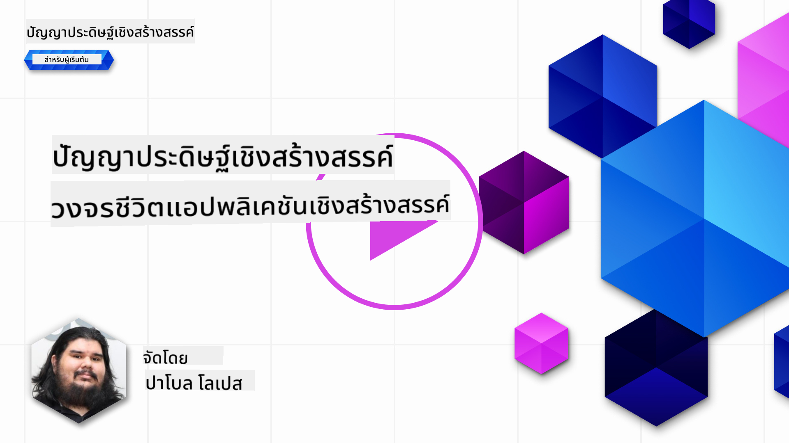
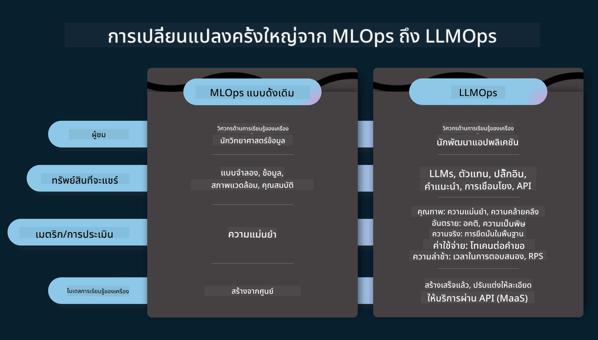
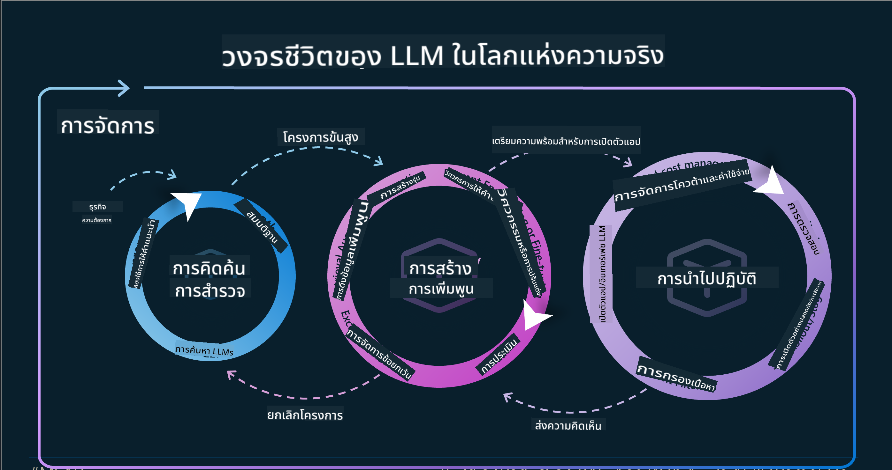
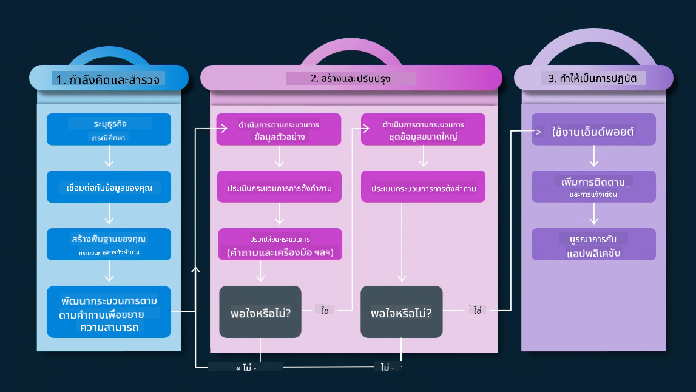
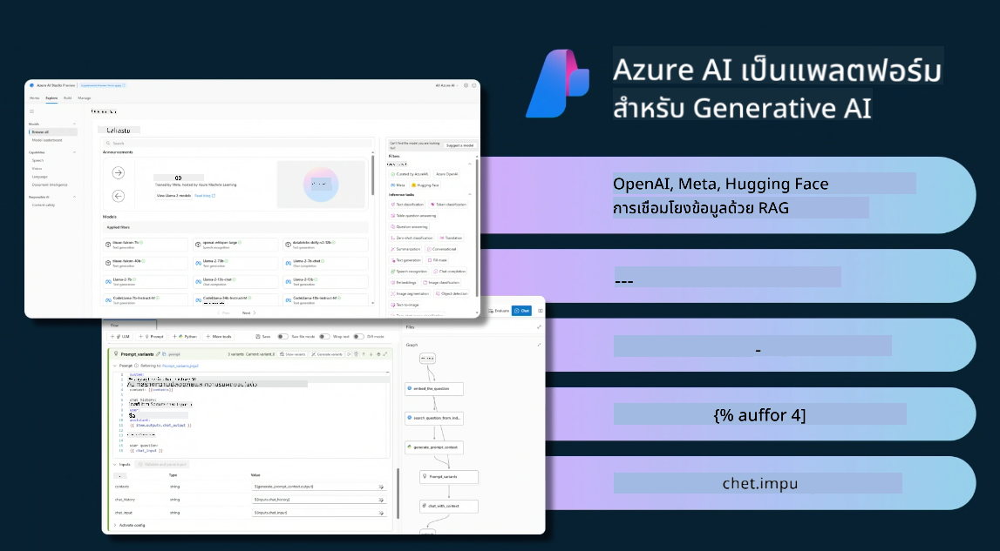
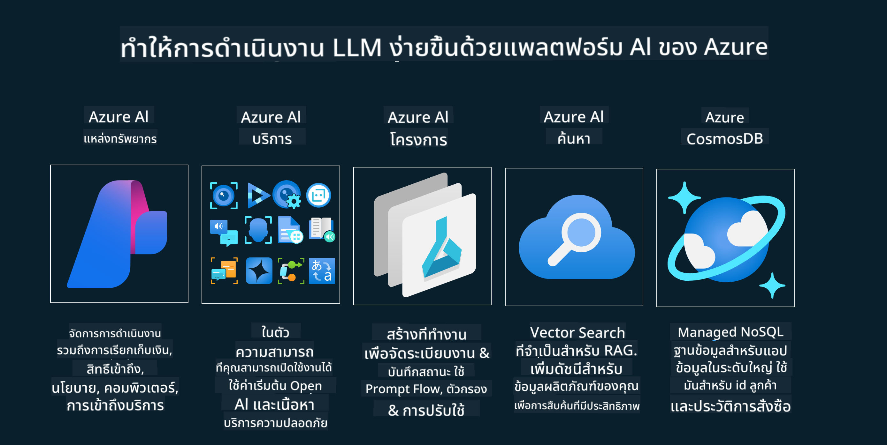
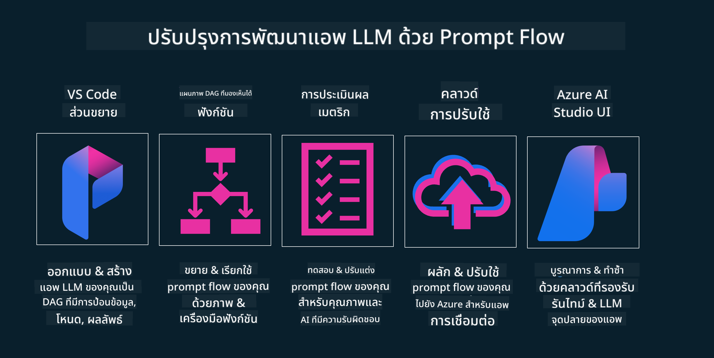

<!--
CO_OP_TRANSLATOR_METADATA:
{
  "original_hash": "27a5347a5022d5ef0a72ab029b03526a",
  "translation_date": "2025-06-25T22:04:02+00:00",
  "source_file": "14-the-generative-ai-application-lifecycle/README.md",
  "language_code": "th"
}
-->

# วงจรชีวิตของแอปพลิเคชัน AI เชิงสร้างสรรค์

คำถามสำคัญสำหรับแอปพลิเคชัน AI ทุกประเภทคือความเกี่ยวข้องของฟีเจอร์ AI เนื่องจาก AI เป็นสาขาที่พัฒนาอย่างรวดเร็ว เพื่อให้แอปพลิเคชันของคุณยังคงมีความเกี่ยวข้อง เชื่อถือได้ และแข็งแกร่ง คุณจำเป็นต้องติดตาม ประเมินผล และปรับปรุงอย่างต่อเนื่อง ซึ่งนี่คือที่มาของวงจรชีวิต AI เชิงสร้างสรรค์

วงจรชีวิต AI เชิงสร้างสรรค์เป็นกรอบที่นำทางคุณผ่านขั้นตอนของการพัฒนา การปรับใช้ และการบำรุงรักษาแอปพลิเคชัน AI เชิงสร้างสรรค์ ช่วยให้คุณกำหนดเป้าหมาย วัดผลการทำงาน ระบุความท้าทาย และดำเนินการแก้ไข นอกจากนี้ยังช่วยให้คุณปรับแอปพลิเคชันให้สอดคล้องกับมาตรฐานทางจริยธรรมและกฎหมายของโดเมนและผู้มีส่วนได้ส่วนเสียของคุณ ด้วยการปฏิบัติตามวงจรชีวิต AI เชิงสร้างสรรค์ คุณสามารถมั่นใจได้ว่าแอปพลิเคชันของคุณจะให้คุณค่าและตอบสนองผู้ใช้เสมอ

## บทนำ

ในบทนี้ คุณจะ:

- เข้าใจการเปลี่ยนแปลงจาก MLOps ไปสู่ LLMOps
- วงจรชีวิตของ LLM
- เครื่องมือวงจรชีวิต
- การวัดและประเมินวงจรชีวิต

## เข้าใจการเปลี่ยนแปลงจาก MLOps ไปสู่ LLMOps

LLM เป็นเครื่องมือใหม่ในคลังแสงของปัญญาประดิษฐ์ มีความสามารถสูงในงานวิเคราะห์และสร้างสรรค์สำหรับแอปพลิเคชัน อย่างไรก็ตามพลังนี้มีผลกระทบบางอย่างต่อวิธีที่เราปรับปรุงงาน AI และงานเรียนรู้ของเครื่องแบบคลาสสิก

ด้วยเหตุนี้เราจึงต้องการกรอบใหม่เพื่อปรับเครื่องมือนี้ให้เข้ากับการทำงานที่มีแรงจูงใจที่ถูกต้อง เราสามารถจัดหมวดหมู่แอป AI เก่าเป็น "ML Apps" และแอป AI ใหม่เป็น "GenAI Apps" หรือแค่ "AI Apps" สะท้อนเทคโนโลยีและเทคนิคที่ใช้ในเวลานั้น การเปลี่ยนแปลงนี้เปลี่ยนเรื่องราวของเราในหลายวิธี ดูการเปรียบเทียบต่อไปนี้

สังเกตว่าใน LLMOps เราให้ความสำคัญกับนักพัฒนาแอปมากขึ้น โดยใช้การบูรณาการเป็นจุดสำคัญ ใช้ "Models-as-a-Service" และพิจารณาในจุดต่อไปนี้สำหรับการวัดผล

- คุณภาพ: คุณภาพของการตอบสนอง
- อันตราย: AI ที่มีความรับผิดชอบ
- ความซื่อสัตย์: ความถูกต้องของการตอบสนอง (สมเหตุสมผลหรือไม่? ถูกต้องหรือไม่?)
- ค่าใช้จ่าย: งบประมาณของโซลูชัน
- ความล่าช้า: เวลาเฉลี่ยในการตอบสนองของโทเค็น

## วงจรชีวิตของ LLM

ก่อนอื่น เพื่อเข้าใจวงจรชีวิตและการปรับเปลี่ยน ลองดูที่อินโฟกราฟิกต่อไปนี้

ตามที่คุณสังเกต นี่แตกต่างจากวงจรชีวิตทั่วไปจาก MLOps LLM มีข้อกำหนดใหม่มากมาย เช่น การกระตุ้น เทคนิคต่างๆ เพื่อปรับปรุงคุณภาพ (การปรับแต่ง, RAG, Meta-Prompts) การประเมินและความรับผิดชอบที่แตกต่างกับ AI ที่มีความรับผิดชอบ สุดท้ายคือเมตริกการประเมินใหม่ (คุณภาพ, อันตราย, ความซื่อสัตย์, ค่าใช้จ่าย และความล่าช้า)

ตัวอย่างเช่น ดูวิธีที่เราคิดค้น โดยใช้การออกแบบคำถามเพื่อทดลองกับ LLM ต่างๆ เพื่อสำรวจความเป็นไปได้ในการทดสอบว่าข้อสมมติฐานของพวกเขาถูกต้องหรือไม่

สังเกตว่านี่ไม่ใช่แบบเชิงเส้น แต่เป็นวงจรรวม วนซ้ำ และมีวงจรรวมใหญ่กว่า

เราจะสำรวจขั้นตอนเหล่านี้ได้อย่างไร? มาดูรายละเอียดวิธีการสร้างวงจรชีวิตกันเถอะ

นี่อาจดูซับซ้อน ลองมุ่งเน้นที่สามขั้นตอนใหญ่ก่อน

1. การคิดค้น/การสำรวจ: การสำรวจ ที่นี่เราสามารถสำรวจตามความต้องการทางธุรกิจของเรา การสร้างต้นแบบ สร้าง [PromptFlow](https://microsoft.github.io/promptflow/index.html?WT.mc_id=academic-105485-koreyst) และทดสอบว่ามีประสิทธิภาพเพียงพอสำหรับข้อสมมติฐานของเราหรือไม่
2. การสร้าง/การเพิ่ม: การดำเนินการ ตอนนี้เราเริ่มประเมินสำหรับชุดข้อมูลที่ใหญ่ขึ้น ใช้เทคนิค เช่น การปรับแต่งและ RAG เพื่อตรวจสอบความแข็งแกร่งของโซลูชันของเรา หากไม่ได้ผล การปรับโครงสร้างใหม่ เพิ่มขั้นตอนใหม่ในกระบวนการหรือปรับโครงสร้างข้อมูล อาจช่วยได้ หลังจากทดสอบกระบวนการและขนาดของเรา หากได้ผลและตรวจสอบเมตริกของเราแล้ว มันก็พร้อมสำหรับขั้นตอนต่อไป
3. การทำงาน: การบูรณาการ ตอนนี้เพิ่มระบบการติดตามและการแจ้งเตือนในระบบของเรา การปรับใช้และการบูรณาการแอปพลิเคชันกับแอปพลิเคชันของเรา

จากนั้นเรามีวงจรรวมใหญ่กว่าของการจัดการ มุ่งเน้นที่ความปลอดภัย การปฏิบัติตามกฎระเบียบ และการกำกับดูแล

ยินดีด้วย ตอนนี้คุณมี AI App พร้อมใช้งานและทำงานแล้ว สำหรับประสบการณ์การใช้งาน ลองดูที่ [Contoso Chat Demo](https://nitya.github.io/contoso-chat/?WT.mc_id=academic-105485-koreys)

ตอนนี้เราจะใช้เครื่องมืออะไรได้บ้าง?

## เครื่องมือวงจรชีวิต

สำหรับเครื่องมือ Microsoft ให้บริการ [Azure AI Platform](https://azure.microsoft.com/solutions/ai/?WT.mc_id=academic-105485-koreys) และ [PromptFlow](https://microsoft.github.io/promptflow/index.html?WT.mc_id=academic-105485-koreyst) เพื่ออำนวยความสะดวกและทำให้วงจรของคุณง่ายต่อการดำเนินการและพร้อมใช้งาน

[Azure AI Platform](https://azure.microsoft.com/solutions/ai/?WT.mc_id=academic-105485-koreys) ให้คุณใช้ [AI Studio](https://ai.azure.com/?WT.mc_id=academic-105485-koreys) AI Studio เป็นเว็บพอร์ทัลที่ให้คุณสำรวจโมเดล ตัวอย่าง และเครื่องมือ การจัดการทรัพยากรของคุณ การพัฒนา UI และตัวเลือก SDK/CLI สำหรับการพัฒนาแบบ Code-First

Azure AI ให้คุณใช้ทรัพยากรหลายชนิด เพื่อจัดการการดำเนินงาน บริการ โครงการ การค้นหาเวกเตอร์ และความต้องการฐานข้อมูลของคุณ

สร้างตั้งแต่ Proof-of-Concept(POC) จนถึงแอปพลิเคชันขนาดใหญ่ด้วย PromptFlow:

- ออกแบบและสร้างแอปจาก VS Code ด้วยเครื่องมือทางภาพและฟังก์ชัน
- ทดสอบและปรับแต่งแอปของคุณเพื่อ AI ที่มีคุณภาพ ได้อย่างง่ายดาย
- ใช้ Azure AI Studio เพื่อบูรณาการและวนซ้ำกับคลาวด์ ผลักดันและปรับใช้เพื่อการบูรณาการอย่างรวดเร็ว

## เยี่ยมมาก! เรียนรู้เพิ่มเติม!

ยอดเยี่ยม ตอนนี้เรียนรู้เพิ่มเติมเกี่ยวกับวิธีการจัดโครงสร้างแอปพลิเคชันเพื่อใช้แนวคิดกับ [Contoso Chat App](https://nitya.github.io/contoso-chat/?WT.mc_id=academic-105485-koreyst) เพื่อดูวิธีที่ Cloud Advocacy เพิ่มแนวคิดเหล่านั้นในการสาธิต สำหรับเนื้อหาเพิ่มเติม ดูเซสชั่น [Ignite breakout!
](https://www.youtube.com/watch?v=DdOylyrTOWg)

ตอนนี้ดูบทที่ 15 เพื่อเข้าใจวิธีที่ [Retrieval Augmented Generation และฐานข้อมูลเวกเตอร์](../15-rag-and-vector-databases/README.md?WT.mc_id=academic-105485-koreyst) มีผลต่อ AI เชิงสร้างสรรค์และทำให้แอปพลิเคชันมีความน่าสนใจมากขึ้น!

**คำปฏิเสธความรับผิดชอบ**:  
เอกสารนี้ได้รับการแปลโดยใช้บริการแปลภาษา AI [Co-op Translator](https://github.com/Azure/co-op-translator) แม้ว่าเราจะพยายามให้การแปลถูกต้องที่สุด แต่โปรดทราบว่าการแปลอัตโนมัติอาจมีข้อผิดพลาดหรือความไม่ถูกต้อง เอกสารต้นฉบับในภาษาดั้งเดิมควรถือเป็นแหล่งข้อมูลที่เชื่อถือได้ สำหรับข้อมูลสำคัญ แนะนำให้ใช้การแปลโดยมนุษย์ที่เป็นมืออาชีพ เราไม่รับผิดชอบต่อความเข้าใจผิดหรือการตีความที่ผิดพลาดซึ่งเกิดจากการใช้การแปลนี้