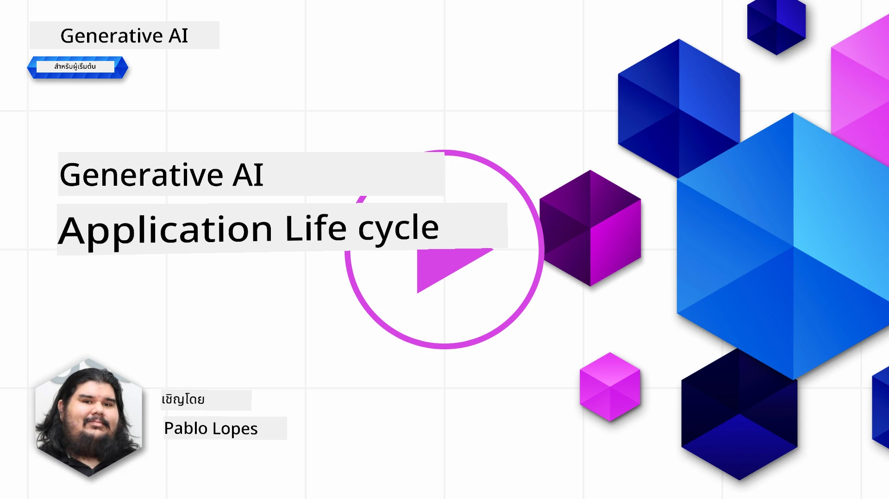
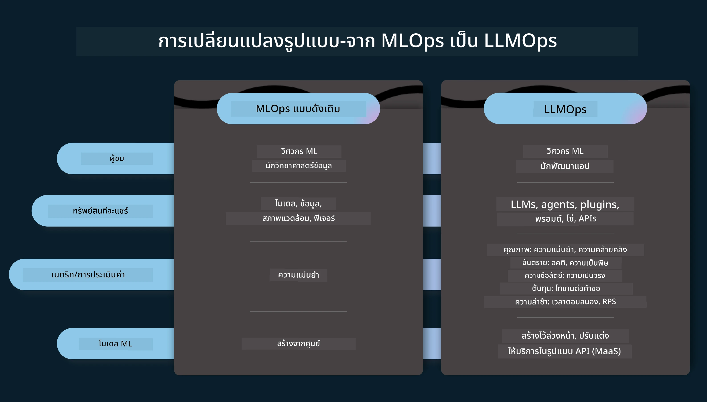
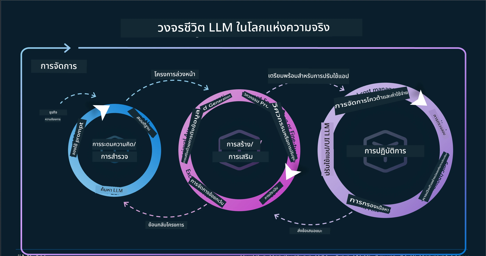
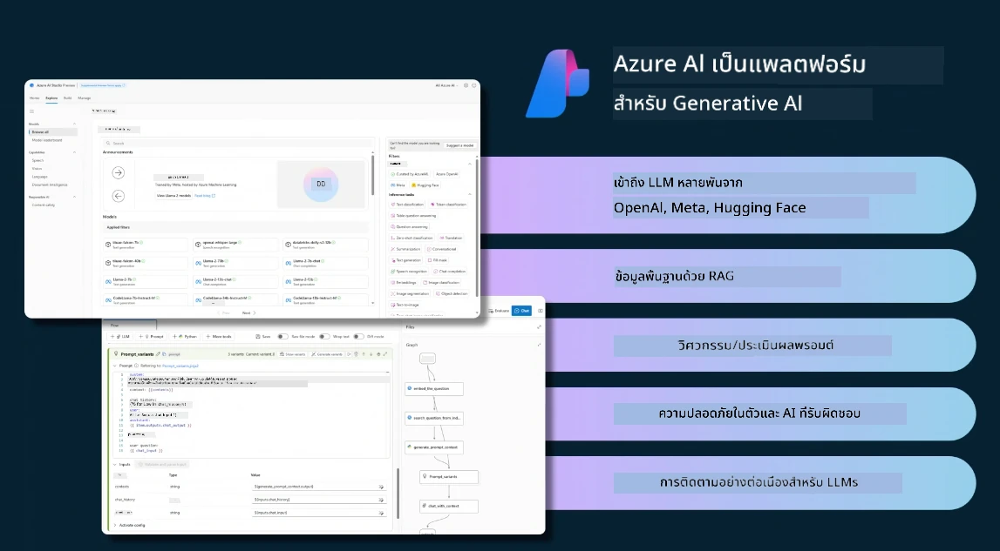
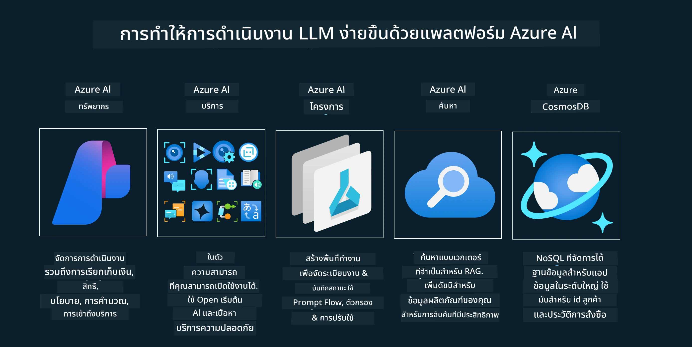
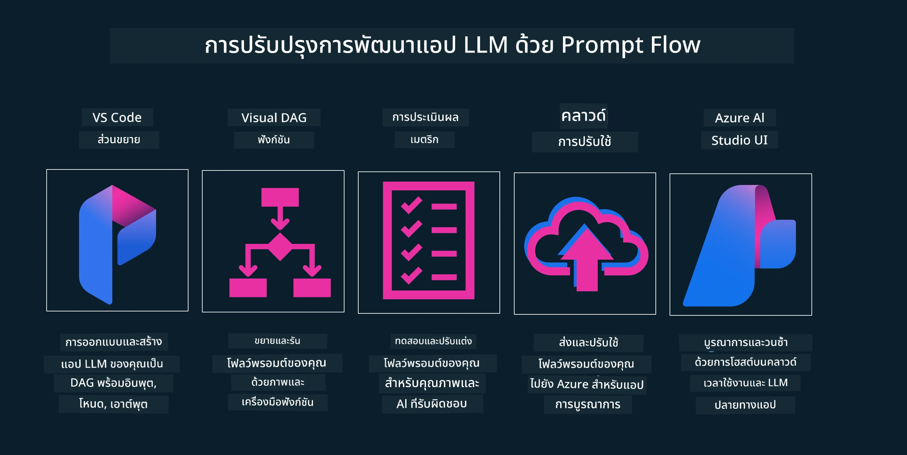

# วงจรชีวิตของแอปพลิเคชันปัญญาประดิษฐ์เชิงสร้างสรรค์

คำถามสำคัญสำหรับแอปพลิเคชัน AI ทั้งหมดคือความเกี่ยวข้องของฟีเจอร์ AI เนื่องจาก AI เป็นสาขาที่พัฒนาอย่างรวดเร็ว เพื่อให้มั่นใจว่าแอปพลิเคชันของคุณยังคงมีความเกี่ยวข้อง น่าเชื่อถือ และแข็งแกร่ง คุณจึงต้องติดตาม ประเมินผล และปรับปรุงอย่างต่อเนื่อง นี่คือจุดที่วงจรชีวิตของปัญญาประดิษฐ์เชิงสร้างสรรค์เข้ามามีบทบาท

วงจรชีวิตของปัญญาประดิษฐ์เชิงสร้างสรรค์คือกรอบแนวทางที่ชี้แนะคุณผ่านขั้นตอนการพัฒนา การปรับใช้ และการบำรุงรักษาแอปพลิเคชันปัญญาประดิษฐ์เชิงสร้างสรรค์ ช่วยให้คุณกำหนดเป้าหมาย วัดผลการปฏิบัติงาน ระบุความท้าทาย และดำเนินการแก้ไข นอกจากนี้ยังช่วยให้แอปของคุณสอดคล้องกับมาตรฐานทางจริยธรรมและกฎหมายของโดเมนและผู้มีส่วนได้ส่วนเสียของคุณ โดยการปฏิบัติตามวงจรชีวิตของปัญญาประดิษฐ์เชิงสร้างสรรค์ คุณจะมั่นใจได้ว่าแอปพลิเคชันของคุณจะมอบคุณค่าและตอบสนองความต้องการของผู้ใช้เสมอ

## บทนำ

ในบทนี้ คุณจะได้:

- เข้าใจการเปลี่ยนแปลงของพาราไดม์จาก MLOps เป็น LLMOps
- วงจรชีวิตของ LLM
- เครื่องมือสำหรับวงจรชีวิต
- การวัดผลและการประเมินวงจรชีวิต

## เข้าใจการเปลี่ยนแปลงของพาราไดม์จาก MLOps เป็น LLMOps

LLM คือเครื่องมือใหม่ในคลังอาวุธของปัญญาประดิษฐ์ พวกมันมีพลังมหาศาลในการวิเคราะห์และสร้างเนื้อหาสำหรับแอปพลิเคชัน อย่างไรก็ตามพลังนี้มีผลกระทบบางประการต่อวิธีการเร่งกระบวนการ AI และงาน Machine Learning แบบคลาสสิก

ด้วยเหตุนี้ เราจึงต้องการพาราไดม์ใหม่เพื่อปรับตัวกับเครื่องมือนี้ในรูปแบบที่มีพลวัตและแรงจูงใจที่ถูกต้อง เราสามารถจัดหมวดหมู่แอป AI รุ่นเก่าเป็น "แอป ML" และแอป AI รุ่นใหม่เป็น "แอป GenAI" หรือเพียงแค่ "แอป AI" เพื่อสะท้อนเทคโนโลยีและเทคนิคหลักในเวลานั้น ซึ่งเปลี่ยนแปลงเรื่องราวของเราในหลายๆ ด้าน ดูการเปรียบเทียบต่อไปนี้

สังเกตว่าใน LLMOps เรามุ่งเน้นที่นักพัฒนาแอป ใช้การผสานรวมเป็นจุดสำคัญ ใช้ "โมเดลเป็นบริการ" และคิดในแง่ของจุดวัดต่อไปนี้

- คุณภาพ: คุณภาพการตอบกลับ
- ความเสียหาย: AI ที่รับผิดชอบ
- ความซื่อสัตย์: ความน่าเชื่อถือของการตอบกลับ (มีความสมเหตุสมผล? ถูกต้องหรือไม่?)
- ค่าใช้จ่าย: งบประมาณของโซลูชัน
- ความหน่วง: เวลาเฉลี่ยในการตอบกลับแต่ละโทเค็น

## วงจรชีวิตของ LLM

ก่อนอื่นเพื่อเข้าใจวงจรชีวิตและการปรับเปลี่ยน ให้สังเกตุรูปข้อมูลถัดไป

อย่างที่คุณอาจสังเกตุ นี่แตกต่างจากวงจรชีวิตปกติของ MLOps อย่างมาก LLM มีความต้องการใหม่หลายอย่าง เช่น การสร้างคำสั่ง (Prompting) เทคนิคต่างๆ เพื่อปรับปรุงคุณภาพ (Fine-Tuning, RAG, Meta-Prompts) การประเมินและความรับผิดชอบกับ AI ที่มีความรับผิดชอบ สุดท้ายคือเมตริกการประเมินใหม่ๆ (คุณภาพ ความเสียหาย ความซื่อสัตย์ ค่าใช้จ่าย และความหน่วง)

ตัวอย่างเช่น ดูวิธีการระดมความคิด ใช้การออกแบบคำสั่งทดลองกับ LLM ต่างๆ เพื่อสำรวจความเป็นไปได้และทดสอบว่าข้อสันนิษฐานของพวกเขาอาจถูกต้องหรือไม่

สังเกตว่านี่ไม่ใช่เส้นตรง แต่เป็นลูปที่ผสานกัน ทำซ้ำ และมีวงจรหลักครอบคลุม

เราจะสำรวจขั้นตอนเหล่านี้ได้อย่างไร? ลองลงรายละเอียดว่าการสร้างวงจรชีวิตมีขั้นตอนอย่างไร

อาจดูซับซ้อนไปบ้าง แต่ให้เรามุ่งเน้นที่ 3 ขั้นตอนใหญ่ก่อน

1. การระดมความคิด/การสำรวจ: การสำรวจ ที่นี่เราสำรวจตามความต้องการทางธุรกิจของเรา การสร้างต้นแบบ สร้าง [PromptFlow](https://microsoft.github.io/promptflow/index.html?WT.mc_id=academic-105485-koreyst) และทดสอบว่าเพียงพอสำหรับข้อสันนิษฐานของเราหรือไม่
1. การสร้าง/การเพิ่มประสิทธิภาพ: การดำเนินการ ขณะนี้เราจะประเมินกับชุดข้อมูลขนาดใหญ่ขึ้น และปรับใช้เทคนิค เช่น Fine-tuning และ RAG เพื่อตรวจสอบความแข็งแกร่งของโซลูชัน หากไม่สำเร็จ อาจต้องสร้างใหม่ เพิ่มขั้นตอนในกระบวนการ หรือจัดโครงสร้างข้อมูลใหม่ก็อาจช่วยได้ หลังจากทดสอบการทำงานและขนาดของเราแล้ว หากดีและผ่านการตรวจสอบเมตริก ก็พร้อมสำหรับขั้นตอนถัดไป
1. การปฏิบัติการ: การผสานรวม ตอนนี้เพิ่มระบบตรวจสอบและแจ้งเตือนไปยังระบบ การปรับใช้ และการผสานเข้ากับแอปพลิเคชันของเรา

แล้วเรามีวงจรหลักของการจัดการที่มุ่งเน้นที่ความปลอดภัย การปฏิบัติตามกฎ และการกำกับดูแล

ยินดีด้วย ตอนนี้คุณมีแอป AI พร้อมใช้งานและดำเนินการ สำหรับประสบการณ์จริง ลองดูที่ [Contoso Chat Demo.](https://nitya.github.io/contoso-chat/?WT.mc_id=academic-105485-koreyst)

แล้วเราจะใช้เครื่องมืออะไรได้บ้าง?

## เครื่องมือสำหรับวงจรชีวิต

สำหรับเครื่องมือ Microsoft มี [Azure AI Platform](https://azure.microsoft.com/solutions/ai/?WT.mc_id=academic-105485-koreyst) และ [PromptFlow](https://microsoft.github.io/promptflow/index.html?WT.mc_id=academic-105485-koreyst) ที่ช่วยให้วงจรชีวิตของคุณง่ายต่อการใช้งานและพร้อมนำไปใช้

[Azure AI Platform](https://azure.microsoft.com/solutions/ai/?WT.mc_id=academic-105485-koreyst) ช่วยให้คุณใช้ [AI Studio](https://ai.azure.com/?WT.mc_id=academic-105485-koreyst) ซึ่งเป็นเว็บพอร์ทัลที่ให้คุณสำรวจโมเดล ตัวอย่าง และเครื่องมือ จัดการทรัพยากรของคุณ พัฒนา UI workflow และตัวเลือก SDK/CLI สำหรับการพัฒนารูปแบบโค้ดเป็นหลัก

Azure AI ช่วยให้คุณใช้ทรัพยากรต่างๆ เพื่อจัดการการปฏิบัติงาน บริการ โปรเจกต์ การค้นหาเวกเตอร์ และความต้องการฐานข้อมูล

สร้าง ตั้งแต่ Proof-of-Concept (POC) จนถึงแอปพลิเคชันขนาดใหญ่ด้วย PromptFlow:

- ออกแบบและสร้างแอปจาก VS Code ด้วยเครื่องมือที่เป็นภาพและฟังก์ชัน
- ทดสอบและปรับแต่งแอปสำหรับ AI คุณภาพสูงได้ง่ายๆ
- ใช้ Azure AI Studio เพื่อผสานรวมและวนรอบกับคลาวด์ ดันและปรับใช้เพื่อการผสานรวมอย่างรวดเร็ว

## ยอดเยี่ยม! เรียนรู้ต่อไป!

เยี่ยมมาก ตอนนี้เรียนรู้เพิ่มเติมเกี่ยวกับการโครงสร้างแอปพลิเคชันเพื่อใช้แนวคิดเหล่านี้กับ [Contoso Chat App](https://nitya.github.io/contoso-chat/?WT.mc_id=academic-105485-koreyst) เพื่อดูว่าทีม Cloud Advocacy นำเสนอแนวคิดเหล่านี้อย่างไรผ่านการสาธิต สำหรับเนื้อหาเพิ่มเติม ตรวจสอบ [Ignite breakout session!](https://www.youtube.com/watch?v=DdOylyrTOWg)

ตอนนี้ไปดูบทเรียนที่ 15 เพื่อเข้าใจว่า [Retrieval Augmented Generation and Vector Databases](../15-rag-and-vector-databases/README.md?WT.mc_id=academic-105485-koreyst) มีผลกระทบอย่างไรกับ Generative AI และเพื่อสร้างแอปพลิเคชันที่มีความน่าสนใจมากขึ้น!

---

<!-- CO-OP TRANSLATOR DISCLAIMER START -->
**ข้อจำกัดความรับผิดชอบ**:
เอกสารนี้ได้รับการแปลโดยใช้บริการแปลภาษาด้วย AI [Co-op Translator](https://github.com/Azure/co-op-translator) แม้เราจะพยายามให้ความถูกต้องสูงสุด โปรดทราบว่าการแปลอัตโนมัติอาจมีข้อผิดพลาดหรือตำหนิได้ เอกสารต้นฉบับในภาษาต้นทางถือเป็นแหล่งข้อมูลที่ถูกต้องที่สุด สำหรับข้อมูลที่สำคัญ แนะนำให้ใช้บริการแปลโดยผู้เชี่ยวชาญมนุษย์ เราไม่มีส่วนรับผิดชอบต่อความเข้าใจผิดหรือความคลาดเคลื่อนที่อาจเกิดจากการใช้การแปลนี้
<!-- CO-OP TRANSLATOR DISCLAIMER END -->