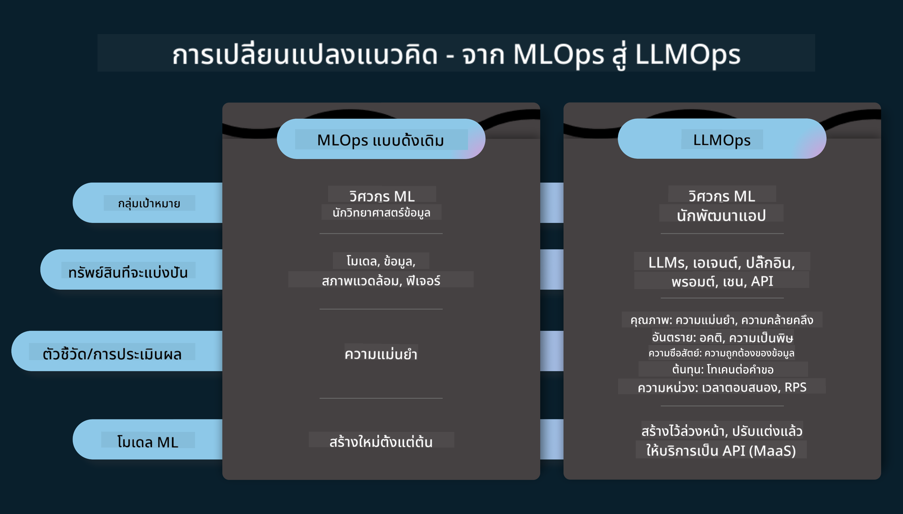
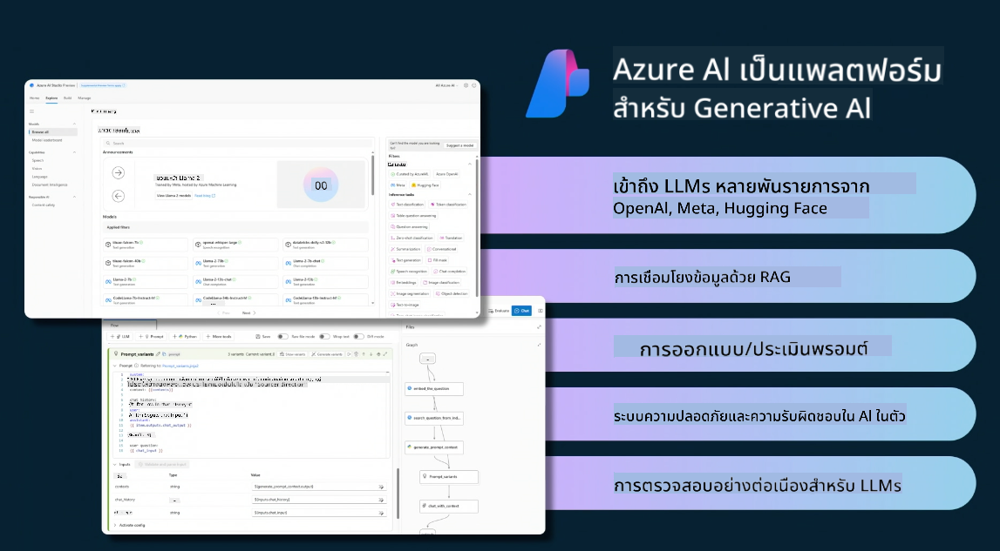
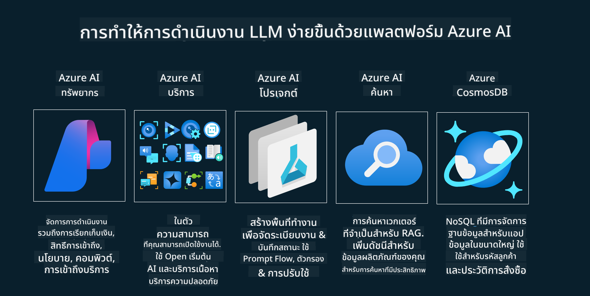

<!--
CO_OP_TRANSLATOR_METADATA:
{
  "original_hash": "b9d32511b27373a1b21b5789d4fda057",
  "translation_date": "2025-10-17T18:39:57+00:00",
  "source_file": "14-the-generative-ai-application-lifecycle/README.md",
  "language_code": "th"
}
-->

# วงจรชีวิตของแอปพลิเคชัน Generative AI

คำถามสำคัญสำหรับแอปพลิเคชัน AI ทุกประเภทคือความเกี่ยวข้องของฟีเจอร์ AI เนื่องจาก AI เป็นสาขาที่พัฒนาอย่างรวดเร็ว เพื่อให้แอปพลิเคชันของคุณยังคงมีความเกี่ยวข้อง เชื่อถือได้ และแข็งแกร่ง คุณจำเป็นต้องติดตาม ประเมินผล และปรับปรุงอย่างต่อเนื่อง นี่คือจุดที่วงจรชีวิตของ Generative AI เข้ามามีบทบาท

วงจรชีวิตของ Generative AI เป็นกรอบแนวทางที่ช่วยนำคุณผ่านขั้นตอนต่างๆ ในการพัฒนา การปรับใช้ และการดูแลรักษาแอปพลิเคชัน Generative AI มันช่วยให้คุณกำหนดเป้าหมาย วัดผลการดำเนินงาน ระบุความท้าทาย และดำเนินการแก้ไข นอกจากนี้ยังช่วยให้คุณปรับแอปพลิเคชันให้สอดคล้องกับมาตรฐานทางจริยธรรมและกฎหมายในสาขาของคุณและผู้มีส่วนได้ส่วนเสียของคุณ ด้วยการปฏิบัติตามวงจรชีวิตของ Generative AI คุณสามารถมั่นใจได้ว่าแอปพลิเคชันของคุณจะมอบคุณค่าและตอบสนองความต้องการของผู้ใช้เสมอ

## บทนำ

ในบทนี้ คุณจะได้:

- เข้าใจการเปลี่ยนแปลงจาก MLOps ไปสู่ LLMOps
- วงจรชีวิตของ LLM
- เครื่องมือสำหรับวงจรชีวิต
- การวัดผลและการประเมินวงจรชีวิต

## เข้าใจการเปลี่ยนแปลงจาก MLOps ไปสู่ LLMOps

LLMs เป็นเครื่องมือใหม่ในคลังแสงของปัญญาประดิษฐ์ พวกมันทรงพลังอย่างมากในงานวิเคราะห์และการสร้างสำหรับแอปพลิเคชัน อย่างไรก็ตามพลังนี้มีผลกระทบต่อวิธีที่เราปรับปรุงงาน AI และ Machine Learning แบบคลาสสิก

ด้วยเหตุนี้ เราจำเป็นต้องมีกรอบแนวคิดใหม่เพื่อปรับเครื่องมือนี้ให้เข้ากับการทำงานแบบไดนามิกและมีแรงจูงใจที่เหมาะสม เราสามารถจัดหมวดหมู่แอป AI รุ่นเก่าเป็น "ML Apps" และแอป AI รุ่นใหม่เป็น "GenAI Apps" หรือเพียงแค่ "AI Apps" เพื่อสะท้อนเทคโนโลยีและเทคนิคที่ใช้ในช่วงเวลานั้น การเปลี่ยนแปลงนี้ส่งผลต่อการเล่าเรื่องในหลายๆ ด้าน ลองดูการเปรียบเทียบต่อไปนี้

สังเกตว่าใน LLMOps เรามุ่งเน้นไปที่นักพัฒนาแอปมากขึ้น โดยใช้การรวมระบบเป็นจุดสำคัญ ใช้ "Models-as-a-Service" และพิจารณาประเด็นต่อไปนี้สำหรับการวัดผล

- คุณภาพ: คุณภาพของการตอบกลับ
- อันตราย: AI ที่มีความรับผิดชอบ
- ความซื่อสัตย์: ความสมเหตุสมผลของการตอบกลับ (สมเหตุสมผลหรือไม่? ถูกต้องหรือไม่?)
- ค่าใช้จ่าย: งบประมาณของโซลูชัน
- ความล่าช้า: เวลาตอบกลับเฉลี่ยต่อโทเค็น

## วงจรชีวิตของ LLM

ก่อนอื่น เพื่อทำความเข้าใจวงจรชีวิตและการปรับเปลี่ยน ลองดูอินโฟกราฟิกต่อไปนี้

คุณอาจสังเกตว่านี่แตกต่างจากวงจรชีวิตปกติของ MLOps LLMs มีข้อกำหนดใหม่ๆ มากมาย เช่น การตั้งค่าคำสั่ง (Prompting) เทคนิคต่างๆ เพื่อปรับปรุงคุณภาพ (Fine-Tuning, RAG, Meta-Prompts) การประเมินผลและความรับผิดชอบที่แตกต่างกันด้วย AI ที่มีความรับผิดชอบ และสุดท้ายคือเมตริกการประเมินผลใหม่ (คุณภาพ อันตราย ความซื่อสัตย์ ค่าใช้จ่าย และความล่าช้า)

ตัวอย่างเช่น ลองดูวิธีที่เราสร้างแนวคิด โดยใช้การออกแบบคำสั่ง (Prompt Engineering) เพื่อทดลองกับ LLMs ต่างๆ เพื่อสำรวจความเป็นไปได้และทดสอบว่าข้อสมมติฐานของพวกเขาอาจถูกต้องหรือไม่

โปรดทราบว่านี่ไม่ใช่กระบวนการเชิงเส้น แต่เป็นการวนซ้ำแบบบูรณาการและมีวงจรที่ครอบคลุม

เราจะสำรวจขั้นตอนเหล่านั้นได้อย่างไร? ลองมาดูรายละเอียดเกี่ยวกับวิธีการสร้างวงจรชีวิต

อาจดูซับซ้อนเล็กน้อย ลองมุ่งเน้นไปที่สามขั้นตอนใหญ่ก่อน

1. การสร้างแนวคิด/การสำรวจ: การสำรวจ ที่นี่เราสามารถสำรวจตามความต้องการทางธุรกิจของเรา การสร้างต้นแบบ การสร้าง [PromptFlow](https://microsoft.github.io/promptflow/index.html?WT.mc_id=academic-105485-koreyst) และทดสอบว่ามีประสิทธิภาพเพียงพอสำหรับข้อสมมติฐานของเราหรือไม่
1. การสร้าง/การปรับปรุง: การดำเนินการ ตอนนี้เราเริ่มประเมินสำหรับชุดข้อมูลขนาดใหญ่ขึ้น ใช้เทคนิค เช่น Fine-tuning และ RAG เพื่อตรวจสอบความแข็งแกร่งของโซลูชันของเรา หากไม่เป็นไปตามที่คาดหวัง การดำเนินการใหม่ การเพิ่มขั้นตอนใหม่ในกระบวนการ หรือการปรับโครงสร้างข้อมูลอาจช่วยได้ หลังจากทดสอบกระบวนการและขนาดของเรา หากมันทำงานและตรวจสอบเมตริกของเรา ก็พร้อมสำหรับขั้นตอนต่อไป
1. การดำเนินการ: การรวมระบบ ตอนนี้เพิ่มระบบการติดตามและการแจ้งเตือนในระบบของเรา การปรับใช้และการรวมแอปพลิเคชันเข้ากับแอปพลิเคชันของเรา

จากนั้นเรามีวงจรที่ครอบคลุมของการจัดการ โดยมุ่งเน้นที่ความปลอดภัย การปฏิบัติตามข้อกำหนด และการกำกับดูแล

ยินดีด้วย ตอนนี้คุณมีแอป AI ที่พร้อมใช้งานและดำเนินการได้แล้ว สำหรับประสบการณ์แบบลงมือปฏิบัติ ลองดู [Contoso Chat Demo.](https://nitya.github.io/contoso-chat/?WT.mc_id=academic-105485-koreys)

ตอนนี้เราสามารถใช้เครื่องมืออะไรได้บ้าง?

## เครื่องมือสำหรับวงจรชีวิต

สำหรับเครื่องมือ Microsoft มี [Azure AI Platform](https://azure.microsoft.com/solutions/ai/?WT.mc_id=academic-105485-koreys) และ [PromptFlow](https://microsoft.github.io/promptflow/index.html?WT.mc_id=academic-105485-koreyst) ที่ช่วยให้การดำเนินการวงจรชีวิตของคุณง่ายและพร้อมใช้งาน

[Azure AI Platform](https://azure.microsoft.com/solutions/ai/?WT.mc_id=academic-105485-koreys) ช่วยให้คุณใช้ [AI Studio](https://ai.azure.com/?WT.mc_id=academic-105485-koreys) AI Studio เป็นพอร์ทัลเว็บที่ช่วยให้คุณสำรวจโมเดล ตัวอย่าง และเครื่องมือ จัดการทรัพยากรของคุณ การพัฒนา UI และตัวเลือก SDK/CLI สำหรับการพัฒนาที่เน้นโค้ดเป็นหลัก

Azure AI ช่วยให้คุณใช้ทรัพยากรหลายอย่างเพื่อจัดการการดำเนินงาน บริการ โครงการ การค้นหาแบบเวกเตอร์ และความต้องการฐานข้อมูลของคุณ

สร้างตั้งแต่ Proof-of-Concept (POC) จนถึงแอปพลิเคชันขนาดใหญ่ด้วย PromptFlow:

- ออกแบบและสร้างแอปจาก VS Code ด้วยเครื่องมือที่มีทั้งภาพและฟังก์ชัน
- ทดสอบและปรับแต่งแอปของคุณเพื่อให้ได้ AI ที่มีคุณภาพอย่างง่ายดาย
- ใช้ Azure AI Studio เพื่อรวมและปรับปรุงกับคลาวด์ ผลักดันและปรับใช้เพื่อการรวมระบบอย่างรวดเร็ว

## เยี่ยม! เรียนรู้ต่อไป!

ยอดเยี่ยม ตอนนี้เรียนรู้เพิ่มเติมเกี่ยวกับวิธีที่เราโครงสร้างแอปพลิเคชันเพื่อใช้แนวคิดเหล่านี้กับ [Contoso Chat App](https://nitya.github.io/contoso-chat/?WT.mc_id=academic-105485-koreyst) เพื่อดูว่า Cloud Advocacy นำแนวคิดเหล่านี้ไปใช้ในตัวอย่างได้อย่างไร สำหรับเนื้อหาเพิ่มเติม ลองดู [Ignite breakout session!
](https://www.youtube.com/watch?v=DdOylyrTOWg)

ตอนนี้ ลองดูบทเรียนที่ 15 เพื่อทำความเข้าใจว่า [Retrieval Augmented Generation และ Vector Databases](../15-rag-and-vector-databases/README.md?WT.mc_id=academic-105485-koreyst) ส่งผลต่อ Generative AI และช่วยสร้างแอปพลิเคชันที่น่าสนใจมากขึ้น!

---

**ข้อจำกัดความรับผิดชอบ**:  
เอกสารนี้ได้รับการแปลโดยใช้บริการแปลภาษา AI [Co-op Translator](https://github.com/Azure/co-op-translator) แม้ว่าเราจะพยายามให้การแปลมีความถูกต้อง แต่โปรดทราบว่าการแปลโดยอัตโนมัติอาจมีข้อผิดพลาดหรือความไม่ถูกต้อง เอกสารต้นฉบับในภาษาดั้งเดิมควรถือเป็นแหล่งข้อมูลที่เชื่อถือได้ สำหรับข้อมูลที่สำคัญ ขอแนะนำให้ใช้บริการแปลภาษามืออาชีพ เราไม่รับผิดชอบต่อความเข้าใจผิดหรือการตีความผิดที่เกิดจากการใช้การแปลนี้