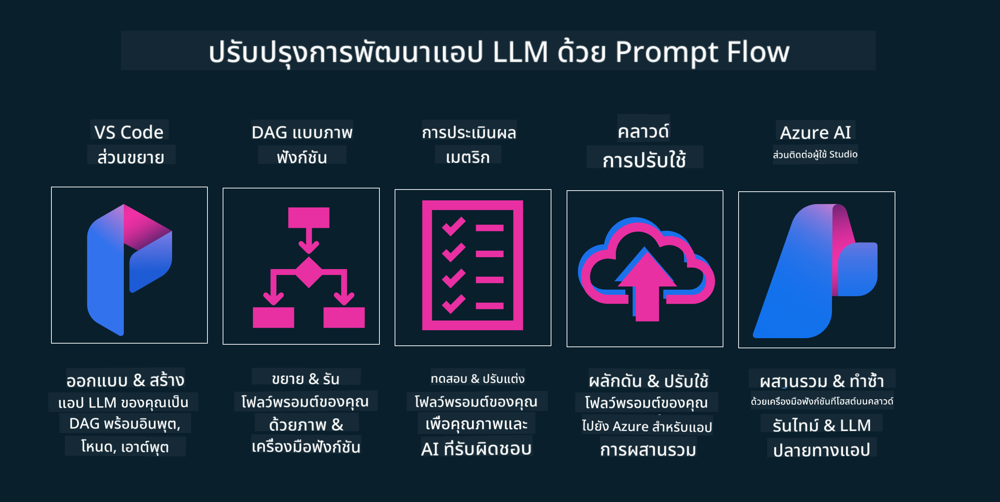

<!--
CO_OP_TRANSLATOR_METADATA:
{
  "original_hash": "27a5347a5022d5ef0a72ab029b03526a",
  "translation_date": "2025-07-09T15:53:55+00:00",
  "source_file": "14-the-generative-ai-application-lifecycle/README.md",
  "language_code": "th"
}
-->

# วงจรชีวิตแอปพลิเคชัน Generative AI

คำถามสำคัญสำหรับแอปพลิเคชัน AI ทุกตัวคือความเกี่ยวข้องของฟีเจอร์ AI เนื่องจาก AI เป็นสาขาที่พัฒนาอย่างรวดเร็ว เพื่อให้แอปพลิเคชันของคุณยังคงมีความเกี่ยวข้อง เชื่อถือได้ และแข็งแกร่ง คุณจึงต้องติดตาม ประเมินผล และปรับปรุงอย่างต่อเนื่อง นี่คือจุดที่วงจรชีวิตของ generative AI เข้ามามีบทบาท

วงจรชีวิต generative AI เป็นกรอบแนวทางที่ช่วยนำทางคุณผ่านขั้นตอนการพัฒนา การนำไปใช้ และการดูแลรักษาแอปพลิเคชัน generative AI ช่วยให้คุณกำหนดเป้าหมาย วัดผลการทำงาน ระบุปัญหา และนำแนวทางแก้ไขมาใช้ นอกจากนี้ยังช่วยให้แอปพลิเคชันของคุณสอดคล้องกับมาตรฐานทางจริยธรรมและกฎหมายของสาขาและผู้มีส่วนได้ส่วนเสีย ด้วยการปฏิบัติตามวงจรชีวิต generative AI คุณจะมั่นใจได้ว่าแอปพลิเคชันของคุณจะสร้างคุณค่าและตอบสนองความต้องการของผู้ใช้เสมอ

## บทนำ

ในบทนี้ คุณจะได้เรียนรู้เกี่ยวกับ:

- ความเปลี่ยนแปลงแนวคิดจาก MLOps สู่ LLMOps
- วงจรชีวิตของ LLM
- เครื่องมือสำหรับวงจรชีวิต
- การวัดผลและประเมินผลวงจรชีวิต

## ความเปลี่ยนแปลงแนวคิดจาก MLOps สู่ LLMOps

LLM เป็นเครื่องมือใหม่ในคลัง AI ที่มีพลังมหาศาลในการวิเคราะห์และสร้างเนื้อหาสำหรับแอปพลิเคชัน อย่างไรก็ตามพลังนี้ก็ส่งผลต่อวิธีการจัดการงาน AI และ Machine Learning แบบดั้งเดิม

ด้วยเหตุนี้ เราจึงต้องมีแนวคิดใหม่เพื่อปรับใช้เครื่องมือนี้อย่างเหมาะสมและมีแรงจูงใจที่ถูกต้อง เราสามารถแบ่งแอป AI รุ่นเก่าเป็น "ML Apps" และแอป AI รุ่นใหม่เป็น "GenAI Apps" หรือแค่ "AI Apps" เพื่อสะท้อนเทคโนโลยีและเทคนิคที่ใช้ในแต่ละช่วงเวลา การเปลี่ยนแปลงนี้ส่งผลต่อแนวคิดของเราในหลายด้าน ดูการเปรียบเทียบต่อไปนี้

สังเกตว่าใน LLMOps เราจะเน้นไปที่นักพัฒนาแอป ใช้การผสานรวมเป็นจุดสำคัญ ใช้ "Models-as-a-Service" และพิจารณาเมตริกในประเด็นต่อไปนี้

- คุณภาพ: คุณภาพของการตอบกลับ
- อันตราย: AI ที่รับผิดชอบ
- ความซื่อสัตย์: ความถูกต้องของการตอบกลับ (สมเหตุสมผลหรือไม่? ถูกต้องหรือเปล่า?)
- ค่าใช้จ่าย: งบประมาณของโซลูชัน
- ความหน่วง: เวลาตอบสนองเฉลี่ยต่อโทเค็น

## วงจรชีวิตของ LLM

ก่อนอื่น เพื่อเข้าใจวงจรชีวิตและการปรับเปลี่ยนต่าง ๆ ให้ดูอินโฟกราฟิกต่อไปนี้

อย่างที่คุณเห็น วงจรชีวิตนี้แตกต่างจากวงจรชีวิตทั่วไปของ MLOps อย่างมาก LLM มีความต้องการใหม่ ๆ มากมาย เช่น การใช้ Prompting เทคนิคต่าง ๆ เพื่อปรับปรุงคุณภาพ (Fine-Tuning, RAG, Meta-Prompts) การประเมินและความรับผิดชอบใน AI ที่รับผิดชอบ และเมตริกการประเมินใหม่ ๆ (คุณภาพ อันตราย ความซื่อสัตย์ ค่าใช้จ่าย และความหน่วง)

ตัวอย่างเช่น ลองดูวิธีการคิดไอเดีย เราใช้ prompt engineering เพื่อทดลองกับ LLM หลายตัวเพื่อสำรวจความเป็นไปได้และทดสอบสมมติฐานว่าถูกต้องหรือไม่

โปรดทราบว่านี่ไม่ใช่กระบวนการเชิงเส้น แต่เป็นวงจรที่บูรณาการ มีการทำซ้ำและมีวงจรหลักครอบคลุม

เราจะสำรวจขั้นตอนเหล่านี้อย่างไร? มาดูรายละเอียดของการสร้างวงจรชีวิตกัน

อาจดูซับซ้อนเล็กน้อย ให้เรามุ่งเน้นที่สามขั้นตอนใหญ่ก่อน

1. การคิดไอเดีย/การสำรวจ: การสำรวจ ในขั้นตอนนี้เราสามารถสำรวจตามความต้องการทางธุรกิจของเรา สร้างต้นแบบ สร้าง [PromptFlow](https://microsoft.github.io/promptflow/index.html?WT.mc_id=academic-105485-koreyst) และทดสอบว่ามีประสิทธิภาพพอสำหรับสมมติฐานของเราหรือไม่
1. การสร้าง/การเสริม: การนำไปใช้ ตอนนี้เริ่มประเมินข้อมูลชุดใหญ่ขึ้น ใช้เทคนิคต่าง ๆ เช่น Fine-tuning และ RAG เพื่อตรวจสอบความแข็งแกร่งของโซลูชัน หากไม่ผ่าน อาจต้องนำไปใช้ใหม่ เพิ่มขั้นตอนใหม่ในกระบวนการ หรือปรับโครงสร้างข้อมูล หลังจากทดสอบกระบวนการและขนาดแล้ว หากผ่านและตรวจสอบเมตริกเรียบร้อย ก็พร้อมสำหรับขั้นตอนถัดไป
1. การปฏิบัติการ: การผสานรวม ตอนนี้เพิ่มระบบการติดตามและแจ้งเตือน การนำไปใช้ และการผสานรวมแอปพลิเคชันเข้ากับระบบของเรา

จากนั้นจะมีวงจรหลักของการบริหารจัดการที่เน้นเรื่องความปลอดภัย การปฏิบัติตามกฎระเบียบ และการกำกับดูแล

ขอแสดงความยินดี ตอนนี้แอป AI ของคุณพร้อมใช้งานแล้ว สำหรับประสบการณ์จริง ลองดู [Contoso Chat Demo.](https://nitya.github.io/contoso-chat/?WT.mc_id=academic-105485-koreys)

แล้วเราจะใช้เครื่องมืออะไรได้บ้าง?

## เครื่องมือสำหรับวงจรชีวิต

สำหรับเครื่องมือ Microsoft มี [Azure AI Platform](https://azure.microsoft.com/solutions/ai/?WT.mc_id=academic-105485-koreys) และ [PromptFlow](https://microsoft.github.io/promptflow/index.html?WT.mc_id=academic-105485-koreyst) ที่ช่วยให้วงจรชีวิตของคุณง่ายต่อการนำไปใช้และพร้อมใช้งาน

[Azure AI Platform](https://azure.microsoft.com/solutions/ai/?WT.mc_id=academic-105485-koreys) ช่วยให้คุณใช้ [AI Studio](https://ai.azure.com/?WT.mc_id=academic-105485-koreys) ซึ่งเป็นเว็บพอร์ทัลที่ให้คุณสำรวจโมเดล ตัวอย่าง และเครื่องมือต่าง ๆ จัดการทรัพยากรของคุณ พัฒนากระบวนการ UI และตัวเลือก SDK/CLI สำหรับการพัฒนาแบบ Code-First

Azure AI ช่วยให้คุณใช้ทรัพยากรหลากหลายเพื่อจัดการการดำเนินงาน บริการ โครงการ การค้นหาเวกเตอร์ และฐานข้อมูล

สร้างตั้งแต่ Proof-of-Concept (POC) จนถึงแอปพลิเคชันขนาดใหญ่ด้วย PromptFlow:

- ออกแบบและสร้างแอปจาก VS Code ด้วยเครื่องมือที่ใช้งานง่ายทั้งแบบภาพและฟังก์ชัน
- ทดสอบและปรับแต่งแอปของคุณเพื่อให้ได้ AI คุณภาพสูงอย่างง่ายดาย
- ใช้ Azure AI Studio เพื่อผสานรวมและทำซ้ำกับคลาวด์ พร้อมส่งและนำไปใช้เพื่อการผสานรวมที่รวดเร็ว

## ดีมาก! เรียนรู้ต่อไป!

เยี่ยมมาก ตอนนี้เรียนรู้เพิ่มเติมเกี่ยวกับการจัดโครงสร้างแอปพลิเคชันเพื่อใช้แนวคิดเหล่านี้กับ [Contoso Chat App](https://nitya.github.io/contoso-chat/?WT.mc_id=academic-105485-koreyst) เพื่อดูว่า Cloud Advocacy นำแนวคิดเหล่านี้ไปใช้ในงานสาธิตอย่างไร สำหรับเนื้อหาเพิ่มเติม ดู [Ignite breakout session!](https://www.youtube.com/watch?v=DdOylyrTOWg)

ตอนนี้ ไปดูบทเรียนที่ 15 เพื่อเข้าใจว่า [Retrieval Augmented Generation และ Vector Databases](../15-rag-and-vector-databases/README.md?WT.mc_id=academic-105485-koreyst) ส่งผลต่อ Generative AI อย่างไร และช่วยสร้างแอปพลิเคชันที่น่าสนใจมากขึ้น!

**ข้อจำกัดความรับผิดชอบ**:  
เอกสารนี้ได้รับการแปลโดยใช้บริการแปลภาษาอัตโนมัติ [Co-op Translator](https://github.com/Azure/co-op-translator) แม้เราจะพยายามให้ความถูกต้องสูงสุด แต่โปรดทราบว่าการแปลอัตโนมัติอาจมีข้อผิดพลาดหรือความไม่ถูกต้อง เอกสารต้นฉบับในภาษาต้นทางถือเป็นแหล่งข้อมูลที่เชื่อถือได้ สำหรับข้อมูลที่สำคัญ ขอแนะนำให้ใช้บริการแปลโดยผู้เชี่ยวชาญมนุษย์ เราไม่รับผิดชอบต่อความเข้าใจผิดหรือการตีความผิดใด ๆ ที่เกิดจากการใช้การแปลนี้