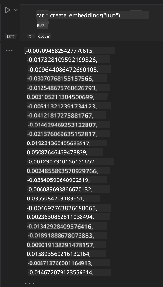

<!--
CO_OP_TRANSLATOR_METADATA:
{
  "original_hash": "e2861bbca91c0567ef32bc77fe054f9e",
  "translation_date": "2025-05-20T01:19:29+00:00",
  "source_file": "15-rag-and-vector-databases/README.md",
  "language_code": "th"
}
-->
# การสร้างเนื้อหาจากการดึงข้อมูล (RAG) และฐานข้อมูลเวกเตอร์

ในบทเรียนเกี่ยวกับแอปพลิเคชันการค้นหา เราได้เรียนรู้แบบย่อๆ ว่าจะรวมข้อมูลของคุณเข้ากับโมเดลภาษาขนาดใหญ่ (LLMs) ได้อย่างไร ในบทเรียนนี้ เราจะเจาะลึกลงไปในแนวคิดของการตั้งค่าข้อมูลของคุณในแอปพลิเคชัน LLM กลไกของกระบวนการและวิธีการจัดเก็บข้อมูล รวมถึงการฝังและข้อความ

> **วิดีโอจะมาเร็วๆ นี้**

## บทนำ

ในบทเรียนนี้เราจะครอบคลุมถึง:

- การแนะนำ RAG ว่าคืออะไรและทำไมจึงใช้ใน AI (ปัญญาประดิษฐ์)

- ความเข้าใจว่าอะไรคือฐานข้อมูลเวกเตอร์และการสร้างหนึ่งในแอปพลิเคชันของเรา

- ตัวอย่างปฏิบัติวิธีการรวม RAG เข้ากับแอปพลิเคชัน

## วัตถุประสงค์การเรียนรู้

หลังจากจบบทเรียนนี้ คุณจะสามารถ:

- อธิบายความสำคัญของ RAG ในการดึงและประมวลผลข้อมูล

- ตั้งค่าแอปพลิเคชัน RAG และตั้งค่าข้อมูลของคุณให้กับ LLM

- การรวม RAG และฐานข้อมูลเวกเตอร์ในแอปพลิเคชัน LLM อย่างมีประสิทธิภาพ

## สถานการณ์ของเรา: การปรับปรุง LLMs ของเราด้วยข้อมูลของเราเอง

สำหรับบทเรียนนี้ เราต้องการเพิ่มบันทึกของเราเองเข้าไปในสตาร์ทอัพด้านการศึกษา ซึ่งจะช่วยให้แชทบอทได้รับข้อมูลเพิ่มเติมเกี่ยวกับหัวข้อต่างๆ โดยใช้บันทึกที่เรามี ผู้เรียนจะสามารถศึกษาดีขึ้นและเข้าใจหัวข้อต่างๆ ได้ง่ายขึ้น ทำให้ง่ายต่อการทบทวนเพื่อสอบ ในการสร้างสถานการณ์ของเรา เราจะใช้:

- `Azure OpenAI:` LLM ที่เราจะใช้สร้างแชทบอทของเรา

- `AI for beginners' lesson on Neural Networks`: นี่จะเป็นข้อมูลที่เราตั้งค่า LLM ของเรา

- `Azure AI Search` และ `Azure Cosmos DB:` ฐานข้อมูลเวกเตอร์เพื่อเก็บข้อมูลของเราและสร้างดัชนีการค้นหา

ผู้ใช้จะสามารถสร้างแบบทดสอบฝึกฝนจากบันทึกของพวกเขา การ์ดทบทวน และสรุปเป็นภาพรวมที่กระชับ เพื่อเริ่มต้น ให้เราดูว่า RAG คืออะไรและทำงานอย่างไร:

## การสร้างเนื้อหาจากการดึงข้อมูล (RAG)

แชทบอทที่ขับเคลื่อนด้วย LLM ประมวลผลคำถามของผู้ใช้เพื่อสร้างการตอบกลับ มันถูกออกแบบมาให้โต้ตอบและมีส่วนร่วมกับผู้ใช้ในหัวข้อที่หลากหลาย อย่างไรก็ตาม การตอบสนองของมันถูกจำกัดตามบริบทที่ให้ไว้และข้อมูลการฝึกอบรมพื้นฐาน ตัวอย่างเช่น ข้อมูลของ GPT-4 ตัดขาดที่กันยายน 2021 หมายความว่ามันขาดความรู้เกี่ยวกับเหตุการณ์ที่เกิดขึ้นหลังจากช่วงเวลานี้ นอกจากนี้ ข้อมูลที่ใช้ในการฝึกอบรม LLMs ยังไม่รวมข้อมูลที่เป็นความลับ เช่น บันทึกส่วนตัวหรือคู่มือผลิตภัณฑ์ของบริษัท

### วิธีการทำงานของ RAGs (การสร้างเนื้อหาจากการดึงข้อมูล)

สมมติว่าคุณต้องการเปิดตัวแชทบอทที่สร้างแบบทดสอบจากบันทึกของคุณ คุณจะต้องการการเชื่อมต่อกับฐานความรู้ นี่คือที่ที่ RAG เข้ามาช่วยเหลือ RAGs ทำงานดังนี้:

- **ฐานความรู้:** ก่อนการดึงข้อมูล เอกสารเหล่านี้จำเป็นต้องถูกนำเข้าและประมวลผลล่วงหน้า โดยปกติจะแบ่งเอกสารขนาดใหญ่เป็นชิ้นเล็กๆ แปลงเป็นการฝังข้อความและเก็บไว้ในฐานข้อมูล

- **คำถามของผู้ใช้:** ผู้ใช้ถามคำถาม

- **การดึงข้อมูล:** เมื่อผู้ใช้ถามคำถาม โมเดลการฝังจะดึงข้อมูลที่เกี่ยวข้องจากฐานความรู้ของเราเพื่อให้บริบทเพิ่มเติมที่จะแทรกเข้าไปในคำถาม

- **การสร้างเนื้อหาที่เพิ่มขึ้น:** LLM ปรับปรุงการตอบสนองตามข้อมูลที่ดึงมา มันทำให้การตอบสนองที่สร้างขึ้นไม่เพียงแต่ขึ้นอยู่กับข้อมูลที่ฝึกอบรมมา แต่ยังรวมถึงข้อมูลที่เกี่ยวข้องจากบริบทที่เพิ่มขึ้น ข้อมูลที่ดึงมาใช้เพื่อเสริมการตอบสนองของ LLM จากนั้น LLM จะส่งคำตอบกลับไปยังคำถามของผู้ใช้

สถาปัตยกรรมของ RAGs ถูกนำมาใช้โดยใช้ตัวแปลงซึ่งประกอบด้วยสองส่วน: ตัวเข้ารหัสและตัวถอดรหัส ตัวอย่างเช่น เมื่อผู้ใช้ถามคำถาม ข้อความที่ป้อน 'เข้ารหัส' เป็นเวกเตอร์ที่จับความหมายของคำและเวกเตอร์จะถูก 'ถอดรหัส' เป็นดัชนีเอกสารของเราและสร้างข้อความใหม่ตามคำถามของผู้ใช้ LLM ใช้ทั้งโมเดลตัวเข้ารหัส-ตัวถอดรหัสเพื่อสร้างผลลัพธ์

สองวิธีเมื่อใช้ RAG ตามเอกสารที่เสนอ: [Retrieval-Augmented Generation for Knowledge intensive NLP (natural language processing software) Tasks](https://arxiv.org/pdf/2005.11401.pdf?WT.mc_id=academic-105485-koreyst) ได้แก่:

- **_RAG-Sequence_** ใช้เอกสารที่ดึงมาเพื่อทำนายคำตอบที่ดีที่สุดสำหรับคำถามของผู้ใช้

- **RAG-Token** ใช้เอกสารเพื่อสร้างโทเค็นถัดไป แล้วดึงมาเพื่อตอบคำถามของผู้ใช้

### ทำไมคุณถึงใช้ RAGs?

- **ความสมบูรณ์ของข้อมูล:** ทำให้การตอบสนองของข้อความทันสมัยและเป็นปัจจุบัน ดังนั้นจึงช่วยเพิ่มประสิทธิภาพในงานเฉพาะโดเมนโดยการเข้าถึงฐานความรู้ภายใน

- ลดการสร้างข้อมูลที่ไม่ถูกต้องโดยใช้ **ข้อมูลที่ตรวจสอบได้** ในฐานความรู้เพื่อให้บริบทแก่คำถามของผู้ใช้

- มัน **ประหยัดค่าใช้จ่าย** เนื่องจากมีความคุ้มค่ามากกว่าการปรับแต่ง LLM

## การสร้างฐานความรู้

แอปพลิเคชันของเราขึ้นอยู่กับข้อมูลส่วนตัวของเรา เช่น บทเรียนเกี่ยวกับเครือข่ายประสาทในหลักสูตร AI For Beginners

### ฐานข้อมูลเวกเตอร์

ฐานข้อมูลเวกเตอร์ แตกต่างจากฐานข้อมูลแบบดั้งเดิม เป็นฐานข้อมูลเฉพาะที่ออกแบบมาเพื่อจัดเก็บ จัดการ และค้นหาเวกเตอร์ที่ฝัง มันเก็บตัวแทนเชิงตัวเลขของเอกสาร การแบ่งข้อมูลออกเป็นการฝังเชิงตัวเลขทำให้ง่ายต่อระบบ AI ของเราในการเข้าใจและประมวลผลข้อมูล

เราเก็บการฝังของเราในฐานข้อมูลเวกเตอร์เนื่องจาก LLMs มีข้อจำกัดในจำนวนโทเค็นที่พวกเขารับเป็นข้อมูลเข้า เนื่องจากคุณไม่สามารถส่งการฝังทั้งหมดไปยัง LLM ได้ เราจะต้องแบ่งมันออกเป็นชิ้นๆ และเมื่อผู้ใช้ถามคำถาม การฝังที่เหมือนกับคำถามมากที่สุดจะถูกส่งกลับพร้อมกับคำถาม การแบ่งชิ้นยังช่วยลดค่าใช้จ่ายในจำนวนโทเค็นที่ผ่าน LLM

ฐานข้อมูลเวกเตอร์ยอดนิยมบางตัว ได้แก่ Azure Cosmos DB, Clarifyai, Pinecone, Chromadb, ScaNN, Qdrant และ DeepLake คุณสามารถสร้างโมเดล Azure Cosmos DB โดยใช้ Azure CLI ด้วยคำสั่งต่อไปนี้:

```bash
az login
az group create -n <resource-group-name> -l <location>
az cosmosdb create -n <cosmos-db-name> -r <resource-group-name>
az cosmosdb list-keys -n <cosmos-db-name> -g <resource-group-name>
```

### จากข้อความไปสู่การฝัง

ก่อนที่เราจะเก็บข้อมูลของเรา เราจะต้องแปลงมันเป็นการฝังเวกเตอร์ก่อนที่จะเก็บไว้ในฐานข้อมูล หากคุณกำลังทำงานกับเอกสารขนาดใหญ่หรือข้อความยาว คุณสามารถแบ่งมันตามคำถามที่คุณคาดหวัง การแบ่งสามารถทำได้ที่ระดับประโยคหรือระดับย่อหน้า เนื่องจากการแบ่งได้ความหมายจากคำรอบข้าง คุณสามารถเพิ่มบริบทอื่นๆ ให้กับชิ้น เช่น โดยการเพิ่มชื่อเอกสารหรือรวมข้อความบางส่วนก่อนหรือหลังชิ้น คุณสามารถแบ่งข้อมูลดังนี้:

```python
def split_text(text, max_length, min_length):
    words = text.split()
    chunks = []
    current_chunk = []

    for word in words:
        current_chunk.append(word)
        if len(' '.join(current_chunk)) < max_length and len(' '.join(current_chunk)) > min_length:
            chunks.append(' '.join(current_chunk))
            current_chunk = []

    # If the last chunk didn't reach the minimum length, add it anyway
    if current_chunk:
        chunks.append(' '.join(current_chunk))

    return chunks
```

เมื่อแบ่งเสร็จแล้ว เราสามารถฝังข้อความของเราโดยใช้โมเดลการฝังต่างๆ โมเดลบางตัวที่คุณสามารถใช้ได้แก่: word2vec, ada-002 โดย OpenAI, Azure Computer Vision และอื่นๆ อีกมากมาย การเลือกโมเดลที่จะใช้จะขึ้นอยู่กับภาษาที่คุณใช้ ประเภทของเนื้อหาที่เข้ารหัส (ข้อความ/รูปภาพ/เสียง) ขนาดของข้อมูลเข้าที่สามารถเข้ารหัสได้และความยาวของผลลัพธ์การฝัง

ตัวอย่างของข้อความที่ฝังโดยใช้โมเดล `text-embedding-ada-002` ของ OpenAI คือ:


## การดึงข้อมูลและการค้นหาเวกเตอร์

เมื่อผู้ใช้ถามคำถาม ตัวดึงข้อมูลจะแปลงมันเป็นเวกเตอร์โดยใช้ตัวเข้ารหัสคำถาม จากนั้นค้นหาผ่านดัชนีการค้นหาเอกสารของเราสำหรับเวกเตอร์ที่เกี่ยวข้องในเอกสารที่เกี่ยวข้องกับข้อมูลเข้า เมื่อเสร็จสิ้น มันจะแปลงทั้งเวกเตอร์ข้อมูลเข้าและเวกเตอร์เอกสารเป็นข้อความและส่งผ่าน LLM

### การดึงข้อมูล

การดึงข้อมูลเกิดขึ้นเมื่อระบบพยายามค้นหาเอกสารจากดัชนีที่ตรงตามเกณฑ์การค้นหาอย่างรวดเร็ว เป้าหมายของตัวดึงข้อมูลคือการรับเอกสารที่จะใช้เพื่อให้บริบทและตั้งค่า LLM บนข้อมูลของคุณ

มีหลายวิธีในการทำการค้นหาภายในฐานข้อมูลของเรา เช่น:

- **การค้นหาด้วยคำหลัก** - ใช้สำหรับการค้นหาข้อความ

- **การค้นหาด้วยความหมาย** - ใช้ความหมายของคำ

- **การค้นหาด้วยเวกเตอร์** - แปลงเอกสารจากข้อความเป็นตัวแทนเวกเตอร์โดยใช้โมเดลการฝัง การดึงข้อมูลจะทำโดยการค้นหาเอกสารที่ตัวแทนเวกเตอร์ใกล้เคียงกับคำถามของผู้ใช้มากที่สุด

- **ไฮบริด** - การผสมผสานระหว่างการค้นหาด้วยคำหลักและการค้นหาด้วยเวกเตอร์

ปัญหากับการดึงข้อมูลเกิดขึ้นเมื่อไม่มีการตอบสนองที่คล้ายคลึงกับคำถามในฐานข้อมูล ระบบจะส่งคืนข้อมูลที่ดีที่สุดที่สามารถหาได้ อย่างไรก็ตาม คุณสามารถใช้กลยุทธ์เช่นการตั้งค่าระยะทางสูงสุดสำหรับความเกี่ยวข้องหรือใช้การค้นหาแบบไฮบริดที่รวมทั้งคำหลักและการค้นหาด้วยเวกเตอร์ ในบทเรียนนี้เราจะใช้การค้นหาแบบไฮบริด การผสมผสานระหว่างการค้นหาด้วยเวกเตอร์และคำหลัก เราจะเก็บข้อมูลของเราในกรอบข้อมูลที่มีคอลัมน์ที่มีชิ้นส่วนและการฝัง

### ความคล้ายคลึงของเวกเตอร์

ตัวดึงข้อมูลจะค้นหาผ่านฐานข้อมูลความรู้สำหรับการฝังที่อยู่ใกล้กัน เพื่อนบ้านที่ใกล้ที่สุด เนื่องจากพวกเขาเป็นข้อความที่คล้ายกัน ในสถานการณ์ที่ผู้ใช้ถามคำถาม มันจะถูกฝังแล้วจับคู่กับการฝังที่คล้ายกัน การวัดทั่วไปที่ใช้ในการค้นหาความคล้ายคลึงของเวกเตอร์ต่างๆ คือความคล้ายคลึงของโคไซน์ซึ่งขึ้นอยู่กับมุมระหว่างสองเวกเตอร์

เราสามารถวัดความคล้ายคลึงได้โดยใช้อื่นๆ ที่เราสามารถใช้ได้คือระยะทางยูคลิดซึ่งเป็นเส้นตรงระหว่างจุดปลายของเวกเตอร์และผลคูณจุดซึ่งวัดผลรวมของผลคูณขององค์ประกอบที่สอดคล้องกันของสองเวกเตอร์

### ดัชนีการค้นหา

เมื่อทำการดึงข้อมูล เราจะต้องสร้างดัชนีการค้นหาสำหรับฐานความรู้ของเราก่อนที่เราจะทำการค้นหา ดัชนีจะเก็บการฝังของเราและสามารถดึงชิ้นที่คล้ายกันที่สุดได้อย่างรวดเร็วแม้ในฐานข้อมูลขนาดใหญ่ เราสามารถสร้างดัชนีของเราในเครื่องโดยใช้:

```python
from sklearn.neighbors import NearestNeighbors

embeddings = flattened_df['embeddings'].to_list()

# Create the search index
nbrs = NearestNeighbors(n_neighbors=5, algorithm='ball_tree').fit(embeddings)

# To query the index, you can use the kneighbors method
distances, indices = nbrs.kneighbors(embeddings)
```

### การจัดลำดับใหม่

เมื่อคุณได้ทำการค้นหาฐานข้อมูล คุณอาจต้องจัดเรียงผลลัพธ์จากที่เกี่ยวข้องที่สุด LLM การจัดลำดับใหม่ใช้การเรียนรู้ของเครื่องเพื่อปรับปรุงความเกี่ยวข้องของผลลัพธ์การค้นหาโดยการจัดเรียงจากที่เกี่ยวข้องที่สุด การใช้ Azure AI Search การจัดลำดับใหม่จะทำโดยอัตโนมัติให้คุณโดยใช้การจัดลำดับความหมาย ตัวอย่างของวิธีการจัดลำดับใหม่โดยใช้เพื่อนบ้านที่ใกล้ที่สุด:

```python
# Find the most similar documents
distances, indices = nbrs.kneighbors([query_vector])

index = []
# Print the most similar documents
for i in range(3):
    index = indices[0][i]
    for index in indices[0]:
        print(flattened_df['chunks'].iloc[index])
        print(flattened_df['path'].iloc[index])
        print(flattened_df['distances'].iloc[index])
    else:
        print(f"Index {index} not found in DataFrame")
```

## การนำทุกอย่างมารวมกัน

ขั้นตอนสุดท้ายคือการเพิ่ม LLM ของเราเข้าไปในส่วนผสมเพื่อให้สามารถรับการตอบสนองที่ตั้งอยู่บนข้อมูลของเรา เราสามารถนำไปใช้ดังนี้:

```python
user_input = "what is a perceptron?"

def chatbot(user_input):
    # Convert the question to a query vector
    query_vector = create_embeddings(user_input)

    # Find the most similar documents
    distances, indices = nbrs.kneighbors([query_vector])

    # add documents to query  to provide context
    history = []
    for index in indices[0]:
        history.append(flattened_df['chunks'].iloc[index])

    # combine the history and the user input
    history.append(user_input)

    # create a message object
    messages=[
        {"role": "system", "content": "You are an AI assistant that helps with AI questions."},
        {"role": "user", "content": history[-1]}
    ]

    # use chat completion to generate a response
    response = openai.chat.completions.create(
        model="gpt-4",
        temperature=0.7,
        max_tokens=800,
        messages=messages
    )

    return response.choices[0].message

chatbot(user_input)
```

## การประเมินแอปพลิเคชันของเรา

### เมตริกการประเมิน

- คุณภาพของการตอบสนองที่ให้แน่ใจว่ามันฟังดูเป็นธรรมชาติ คล่องแคล่ว และเหมือนมนุษย์

- การตั้งค่าของข้อมูล: การประเมินว่าการตอบสนองที่มาจากเอกสารที่ให้ไว้

- ความเกี่ยวข้อง: การประเมินว่าการตอบสนองตรงกับและเกี่ยวข้องกับคำถามที่ถาม

- ความคล่องแคล่ว - ว่าการตอบสนองมีความหมายทางไวยากรณ์หรือไม่

## กรณีการใช้งานสำหรับการใช้ RAG (การสร้างเนื้อหาจากการดึงข้อมูล) และฐานข้อมูลเวกเตอร์

มีกรณีการใช้งานที่หลากหลายที่การเรียกฟังก์ชันสามารถปรับปรุงแอปของคุณได้ เช่น:

- การถามตอบ: การตั้งค่าข้อมูลของบริษัทของคุณให้กับแชทที่สามารถใช้โดยพนักงานเพื่อถามคำถาม

- ระบบแนะนำ: ที่คุณสามารถสร้างระบบที่จับคู่ค่าที่คล้ายคลึงที่สุด เช่น ภาพยนตร์ ร้านอาหาร และอื่นๆ อีกมากมาย

- บริการแชทบอท: คุณสามารถเก็บประวัติการแชทและปรับการสนทนาตามข้อมูลของผู้ใช้

- การค้นหารูปภาพตามการฝังเวกเตอร์ มีประโยชน์เมื่อทำการจดจำรูปภาพและการตรวจจับความผิดปกติ

## สรุป

เราได้ครอบคลุมพื้นที่พื้นฐานของ RAG ตั้งแต่การเพิ่มข้อมูลของเราไปยังแอปพลิเคชัน คำถามของผู้ใช้และผลลัพธ์ เพื่อให้ง่ายต่อการสร้าง RAG คุณสามารถใช้เฟรมเวิร์กเช่น Semanti Kernel, Langchain หรือ Autogen

## การมอบหมาย

เพื่อดำเนินการเรียนรู้เกี่ยวกับการสร้างเนื้อหาจากการดึงข้อมูล (RAG) คุณสามารถสร้าง:

- สร้างส่วนหน้าแอปพลิเคชันโดยใช้เฟรมเวิร์กที่คุณเลือก

- ใช้เฟรมเวิร์ก ไม่ว่าจะเป็น LangChain หรือ Semantic Kernel และสร้างแอปพลิเคชันของคุณขึ้นมาใหม่

ขอแสดงความยินดีที่จบบทเรียน 👏

## การเรียนรู้ไม่ได้หยุดเพียงแค่นี้ ดำเนินการต่อไป

หลังจากจบบทเรียนนี้ ดูคอลเล็กชันการเรียนรู้ AI เชิงสร้างสรรค์ของเรา [Generative AI Learning collection](https://aka.ms/genai-collection?WT.mc_id=academic-105485-koreyst) เพื่อเพิ่มพูนความรู้ AI เชิงสร้างสรรค์ของคุณ!

**ข้อจำกัดความรับผิดชอบ**:  
เอกสารนี้ได้รับการแปลโดยใช้บริการแปลภาษา AI [Co-op Translator](https://github.com/Azure/co-op-translator) แม้ว่าเราจะพยายามอย่างเต็มที่เพื่อความถูกต้อง แต่โปรดทราบว่าการแปลอัตโนมัติอาจมีข้อผิดพลาดหรือความไม่ถูกต้อง เอกสารต้นฉบับในภาษาดั้งเดิมควรถูกพิจารณาว่าเป็นแหล่งข้อมูลที่เชื่อถือได้ สำหรับข้อมูลสำคัญ แนะนำให้ใช้บริการแปลภาษามนุษย์มืออาชีพ เราไม่รับผิดชอบต่อความเข้าใจผิดหรือการตีความผิดที่เกิดจากการใช้การแปลนี้