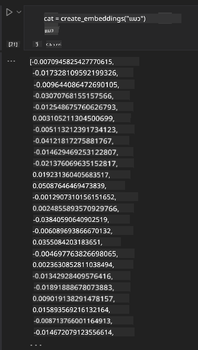

<!--
CO_OP_TRANSLATOR_METADATA:
{
  "original_hash": "e2861bbca91c0567ef32bc77fe054f9e",
  "translation_date": "2025-06-25T22:34:02+00:00",
  "source_file": "15-rag-and-vector-databases/README.md",
  "language_code": "th"
}
-->
# การสร้างข้อมูลเสริมเพื่อการดึงข้อมูล (RAG) และฐานข้อมูลเวกเตอร์

ในบทเรียนเกี่ยวกับแอปพลิเคชันการค้นหา เราได้เรียนรู้แบบสั้นๆ ว่าจะรวมข้อมูลของคุณเข้ากับโมเดลภาษาใหญ่ (LLMs) อย่างไร ในบทเรียนนี้ เราจะเจาะลึกถึงแนวคิดในการทำให้ข้อมูลของคุณเป็นฐานในแอปพลิเคชัน LLM ของคุณ กลไกของกระบวนการและวิธีการจัดเก็บข้อมูล รวมถึงการฝังข้อมูลและข้อความ

> **วิดีโอกำลังจะมาเร็วๆ นี้**

## บทนำ

ในบทเรียนนี้เราจะครอบคลุมเนื้อหาต่อไปนี้:

- การแนะนำ RAG คืออะไรและเหตุใดจึงใช้ใน AI (ปัญญาประดิษฐ์)

- ทำความเข้าใจว่าอะไรคือฐานข้อมูลเวกเตอร์และสร้างหนึ่งสำหรับแอปพลิเคชันของเรา

- ตัวอย่างการปฏิบัติในการรวม RAG เข้ากับแอปพลิเคชัน

## เป้าหมายการเรียนรู้

หลังจากจบบทเรียนนี้ คุณจะสามารถ:

- อธิบายความสำคัญของ RAG ในการดึงข้อมูลและการประมวลผล

- ตั้งค่าแอปพลิเคชัน RAG และทำให้ข้อมูลของคุณเป็นฐานใน LLM

- การรวม RAG และฐานข้อมูลเวกเตอร์อย่างมีประสิทธิภาพในแอปพลิเคชัน LLM

## สถานการณ์ของเรา: เสริม LLM ของเราด้วยข้อมูลของเราเอง

สำหรับบทเรียนนี้ เราต้องการเพิ่มโน้ตของเราเองในสตาร์ทอัพด้านการศึกษา ซึ่งช่วยให้แชทบอทได้รับข้อมูลเพิ่มเติมเกี่ยวกับวิชาต่างๆ โดยใช้โน้ตที่เรามี ผู้เรียนจะสามารถศึกษาได้ดีขึ้นและเข้าใจหัวข้อต่างๆ ได้ง่ายขึ้น ทำให้การทบทวนเพื่อสอบง่ายขึ้น ในการสร้างสถานการณ์ของเรา เราจะใช้:

- `Azure OpenAI:` LLM ที่เราจะใช้สร้างแชทบอทของเรา

- `AI for beginners' lesson on Neural Networks`: นี่จะเป็นข้อมูลที่เราทำให้ LLM ของเราเป็นฐาน

- `Azure AI Search` และ `Azure Cosmos DB:` ฐานข้อมูลเวกเตอร์เพื่อจัดเก็บข้อมูลของเราและสร้างดัชนีการค้นหา

ผู้ใช้จะสามารถสร้างแบบทดสอบฝึกฝนจากโน้ตของพวกเขา บัตรทบทวน และสรุปเป็นภาพรวมที่ชัดเจนได้ เพื่อเริ่มต้น ลองมาดูว่า RAG คืออะไรและทำงานอย่างไร:

## การสร้างข้อมูลเสริมเพื่อการดึงข้อมูล (RAG)

แชทบอทที่ใช้พลังงานจาก LLM ประมวลผลคำถามของผู้ใช้เพื่อสร้างการตอบสนอง มันถูกออกแบบให้มีปฏิสัมพันธ์และมีส่วนร่วมกับผู้ใช้ในหัวข้อที่หลากหลาย อย่างไรก็ตาม การตอบสนองของมันถูกจำกัดด้วยบริบทที่ให้ไว้และข้อมูลการฝึกอบรมพื้นฐานของมัน ตัวอย่างเช่น ข้อจำกัดความรู้ของ GPT-4 คือเดือนกันยายน 2021 ซึ่งหมายความว่ามันขาดความรู้เกี่ยวกับเหตุการณ์ที่เกิดขึ้นหลังจากช่วงเวลานี้ นอกจากนี้ ข้อมูลที่ใช้ในการฝึกอบรม LLM ยังไม่รวมข้อมูลที่เป็นความลับ เช่น โน้ตส่วนตัวหรือคู่มือผลิตภัณฑ์ของบริษัท

### RAGs (การสร้างข้อมูลเสริมเพื่อการดึงข้อมูล) ทำงานอย่างไร

สมมติว่าคุณต้องการปรับใช้แชทบอทที่สร้างแบบทดสอบจากโน้ตของคุณ คุณจะต้องมีการเชื่อมต่อกับฐานความรู้ นี่คือที่ที่ RAG เข้ามาช่วยเหลือ RAGs ทำงานดังนี้:

- **ฐานความรู้:** ก่อนการดึงข้อมูล เอกสารเหล่านี้จำเป็นต้องถูกนำเข้าและประมวลผลเบื้องต้น โดยทั่วไปจะแบ่งเอกสารขนาดใหญ่เป็นชิ้นเล็กๆ แปลงเป็นการฝังข้อความและจัดเก็บในฐานข้อมูล

- **คำถามของผู้ใช้:** ผู้ใช้ถามคำถาม

- **การดึงข้อมูล:** เมื่อผู้ใช้ถามคำถาม โมเดลการฝังข้อมูลจะดึงข้อมูลที่เกี่ยวข้องจากฐานความรู้ของเราเพื่อให้บริบทเพิ่มเติมที่จะถูกรวมเข้ากับคำถาม

- **การสร้างข้อมูลเสริม:** LLM ปรับปรุงการตอบสนองตามข้อมูลที่ดึงมา มันช่วยให้การตอบสนองที่สร้างขึ้นไม่ได้อิงเพียงข้อมูลที่ฝึกอบรม แต่ยังข้อมูลที่เกี่ยวข้องจากบริบทที่เพิ่มเข้ามา ข้อมูลที่ดึงมาใช้ในการเสริมการตอบสนองของ LLM จากนั้น LLM จะส่งคำตอบกลับไปยังคำถามของผู้ใช้

สถาปัตยกรรมสำหรับ RAGs ถูกนำไปใช้โดยใช้ตัวแปลงประกอบด้วยสองส่วน: ตัวเข้ารหัสและตัวถอดรหัส ตัวอย่างเช่น เมื่อผู้ใช้ถามคำถาม ข้อความที่ป้อน 'ถูกเข้ารหัส' เป็นเวกเตอร์ที่จับความหมายของคำและเวกเตอร์ถูก 'ถอดรหัส' เป็นดัชนีเอกสารของเราและสร้างข้อความใหม่ตามคำถามของผู้ใช้ LLM ใช้ทั้งโมเดลตัวเข้ารหัส-ตัวถอดรหัสเพื่อสร้างผลลัพธ์

สองวิธีเมื่อใช้ RAG ตามเอกสารที่เสนอ: [Retrieval-Augmented Generation for Knowledge intensive NLP (natural language processing software) Tasks](https://arxiv.org/pdf/2005.11401.pdf?WT.mc_id=academic-105485-koreyst) คือ:

- **_RAG-Sequence_** ใช้เอกสารที่ดึงมาเพื่อทำนายคำตอบที่ดีที่สุดสำหรับคำถามของผู้ใช้

- **RAG-Token** ใช้เอกสารเพื่อสร้างโทเค็นถัดไป จากนั้นดึงข้อมูลเหล่านั้นเพื่อตอบคำถามของผู้ใช้

### ทำไมคุณถึงใช้ RAGs?

- **ความร่ำรวยของข้อมูล:** ทำให้มั่นใจว่าการตอบสนองทางข้อความเป็นปัจจุบันและทันสมัย ดังนั้นมันจะเพิ่มประสิทธิภาพในการทำงานเฉพาะด้านโดยการเข้าถึงฐานความรู้ภายใน

- ลดการสร้างข้อมูลโดยใช้ **ข้อมูลที่ตรวจสอบได้** ในฐานความรู้เพื่อให้บริบทกับคำถามของผู้ใช้

- มัน **คุ้มค่า** เนื่องจากประหยัดมากกว่าเมื่อเทียบกับการปรับแต่ง LLM

## การสร้างฐานความรู้

แอปพลิเคชันของเราขึ้นอยู่กับข้อมูลส่วนบุคคลของเรา เช่น บทเรียนเครือข่ายประสาทในหลักสูตร AI สำหรับผู้เริ่มต้น

### ฐานข้อมูลเวกเตอร์

ฐานข้อมูลเวกเตอร์ แตกต่างจากฐานข้อมูลแบบดั้งเดิม เป็นฐานข้อมูลเฉพาะที่ออกแบบมาเพื่อจัดเก็บ จัดการ และค้นหาเวกเตอร์ฝังข้อมูล มันจัดเก็บการแสดงตัวเลขของเอกสาร การแบ่งข้อมูลเป็นการฝังตัวเลขทำให้ระบบ AI ของเราเข้าใจและประมวลผลข้อมูลได้ง่ายขึ้น

เราเก็บการฝังข้อมูลของเราในฐานข้อมูลเวกเตอร์ เนื่องจาก LLM มีข้อจำกัดในจำนวนโทเค็นที่รับเป็นข้อมูลเข้า เนื่องจากคุณไม่สามารถส่งการฝังข้อมูลทั้งหมดไปยัง LLM เราจะต้องแบ่งมันออกเป็นชิ้นๆ และเมื่อผู้ใช้ถามคำถาม การฝังข้อมูลที่คล้ายกับคำถามจะถูกส่งกลับพร้อมกับคำถาม การแบ่งชิ้นยังช่วยลดค่าใช้จ่ายในจำนวนโทเค็นที่ผ่าน LLM

ฐานข้อมูลเวกเตอร์ยอดนิยมบางตัวรวมถึง Azure Cosmos DB, Clarifyai, Pinecone, Chromadb, ScaNN, Qdrant และ DeepLake คุณสามารถสร้างโมเดล Azure Cosmos DB โดยใช้ Azure CLI ด้วยคำสั่งต่อไปนี้:

```bash
az login
az group create -n <resource-group-name> -l <location>
az cosmosdb create -n <cosmos-db-name> -r <resource-group-name>
az cosmosdb list-keys -n <cosmos-db-name> -g <resource-group-name>
```

### จากข้อความไปยังการฝังข้อมูล

ก่อนที่เราจะเก็บข้อมูลของเรา เราจะต้องแปลงมันเป็นการฝังเวกเตอร์ก่อนที่จะถูกเก็บในฐานข้อมูล หากคุณทำงานกับเอกสารขนาดใหญ่หรือข้อความยาวๆ คุณสามารถแบ่งมันตามคำถามที่คุณคาดหวัง การแบ่งสามารถทำได้ที่ระดับประโยคหรือระดับย่อหน้า เนื่องจากการแบ่งสกัดความหมายจากคำรอบๆ คุณสามารถเพิ่มบริบทอื่นๆ ลงในชิ้น เช่น โดยการเพิ่มชื่อเอกสารหรือรวมข้อความก่อนหรือหลังชิ้น คุณสามารถแบ่งข้อมูลได้ดังนี้:

```python
def split_text(text, max_length, min_length):
    words = text.split()
    chunks = []
    current_chunk = []

    for word in words:
        current_chunk.append(word)
        if len(' '.join(current_chunk)) < max_length and len(' '.join(current_chunk)) > min_length:
            chunks.append(' '.join(current_chunk))
            current_chunk = []

    # If the last chunk didn't reach the minimum length, add it anyway
    if current_chunk:
        chunks.append(' '.join(current_chunk))

    return chunks
```

เมื่อแบ่งแล้ว เราสามารถฝังข้อความของเราโดยใช้โมเดลการฝังต่างๆ โมเดลบางตัวที่คุณสามารถใช้รวมถึง: word2vec, ada-002 โดย OpenAI, Azure Computer Vision และอื่นๆ การเลือกโมเดลที่จะใช้จะขึ้นอยู่กับภาษาที่คุณใช้ ประเภทของเนื้อหาที่เข้ารหัส (ข้อความ/ภาพ/เสียง) ขนาดของข้อมูลเข้าและความยาวของผลลัพธ์การฝัง

ตัวอย่างการฝังข้อความโดยใช้โมเดล `text-embedding-ada-002` ของ OpenAI คือ:


## การดึงข้อมูลและการค้นหาเวกเตอร์

เมื่อผู้ใช้ถามคำถาม ตัวดึงข้อมูลจะแปลงมันเป็นเวกเตอร์โดยใช้ตัวเข้ารหัสคำถาม จากนั้นค้นหาดัชนีการค้นหาเอกสารของเราสำหรับเวกเตอร์ที่เกี่ยวข้องในเอกสารที่เกี่ยวข้องกับข้อมูลเข้า เมื่อเสร็จแล้ว มันจะแปลงทั้งเวกเตอร์ข้อมูลเข้าและเวกเตอร์เอกสารเป็นข้อความและส่งผ่าน LLM

### การดึงข้อมูล

การดึงข้อมูลเกิดขึ้นเมื่อระบบพยายามค้นหาเอกสารจากดัชนีที่ตอบสนองต่อเกณฑ์การค้นหาอย่างรวดเร็ว เป้าหมายของตัวดึงข้อมูลคือการได้รับเอกสารที่จะใช้ในการให้บริบทและทำให้ LLM ของคุณเป็นฐานในข้อมูลของคุณ

มีหลายวิธีในการค้นหาภายในฐานข้อมูลของเรา เช่น:

- **การค้นหาคำหลัก** - ใช้สำหรับการค้นหาข้อความ

- **การค้นหาเชิงความหมาย** - ใช้ความหมายเชิงความหมายของคำ

- **การค้นหาเวกเตอร์** - แปลงเอกสารจากข้อความเป็นการแสดงเวกเตอร์โดยใช้โมเดลการฝังข้อมูล การดึงข้อมูลจะทำโดยการค้นหาเอกสารที่การแสดงเวกเตอร์ใกล้เคียงกับคำถามของผู้ใช้

- **ไฮบริด** - การรวมกันของการค้นหาคำหลักและการค้นหาเวกเตอร์

ความท้าทายกับการดึงข้อมูลเกิดขึ้นเมื่อไม่มีการตอบสนองที่คล้ายกับคำถามในฐานข้อมูล ระบบจะส่งคืนข้อมูลที่ดีที่สุดที่สามารถได้รับ อย่างไรก็ตาม คุณสามารถใช้กลยุทธ์เช่นการตั้งค่าระยะทางสูงสุดสำหรับความเกี่ยวข้องหรือใช้การค้นหาแบบไฮบริดที่รวมการค้นหาคำหลักและการค้นหาเวกเตอร์ ในบทเรียนนี้เราจะใช้การค้นหาแบบไฮบริด การรวมกันของการค้นหาเวกเตอร์และคำหลัก เราจะเก็บข้อมูลของเราใน dataframe ที่มีคอลัมน์ที่มีชิ้นและการฝังข้อมูล

### ความคล้ายคลึงของเวกเตอร์

ตัวดึงข้อมูลจะค้นหาฐานข้อมูลความรู้สำหรับการฝังข้อมูลที่อยู่ใกล้กัน เพื่อนบ้านที่ใกล้ที่สุด เนื่องจากเป็นข้อความที่คล้ายกัน ในกรณีที่ผู้ใช้ถามคำถาม มันจะถูกฝังแล้วจับคู่กับการฝังข้อมูลที่คล้ายกัน การวัดทั่วไปที่ใช้ในการหาความคล้ายคลึงของเวกเตอร์ต่างๆ คือความคล้ายคลึงของโคไซน์ซึ่งอิงจากมุมระหว่างสองเวกเตอร์

เราสามารถวัดความคล้ายคลึงโดยใช้ทางเลือกอื่นๆ เช่น ระยะทางยูคลิดซึ่งเป็นเส้นตรงระหว่างจุดสิ้นสุดของเวกเตอร์และผลคูณจุดซึ่งวัดผลรวมของผลคูณขององค์ประกอบที่ตรงกันของสองเวกเตอร์

### ดัชนีการค้นหา

เมื่อทำการดึงข้อมูล เราจะต้องสร้างดัชนีการค้นหาสำหรับฐานความรู้ของเราก่อนที่จะทำการค้นหา ดัชนีจะเก็บการฝังข้อมูลของเราและสามารถดึงชิ้นที่คล้ายกันที่สุดได้อย่างรวดเร็วแม้ในฐานข้อมูลขนาดใหญ่ เราสามารถสร้างดัชนีของเราในเครื่องโดยใช้:

```python
from sklearn.neighbors import NearestNeighbors

embeddings = flattened_df['embeddings'].to_list()

# Create the search index
nbrs = NearestNeighbors(n_neighbors=5, algorithm='ball_tree').fit(embeddings)

# To query the index, you can use the kneighbors method
distances, indices = nbrs.kneighbors(embeddings)
```

### การจัดอันดับใหม่

เมื่อคุณได้ค้นหาฐานข้อมูลแล้ว คุณอาจต้องจัดเรียงผลลัพธ์จากสิ่งที่เกี่ยวข้องที่สุด LLM การจัดอันดับใหม่ใช้การเรียนรู้ของเครื่องเพื่อปรับปรุงความเกี่ยวข้องของผลลัพธ์การค้นหาโดยการจัดเรียงจากสิ่งที่เกี่ยวข้องที่สุด โดยใช้ Azure AI Search การจัดอันดับใหม่จะทำโดยอัตโนมัติสำหรับคุณโดยใช้การจัดอันดับใหม่เชิงความหมาย ตัวอย่างของการทำงานของการจัดอันดับใหม่โดยใช้เพื่อนบ้านที่ใกล้ที่สุด:

```python
# Find the most similar documents
distances, indices = nbrs.kneighbors([query_vector])

index = []
# Print the most similar documents
for i in range(3):
    index = indices[0][i]
    for index in indices[0]:
        print(flattened_df['chunks'].iloc[index])
        print(flattened_df['path'].iloc[index])
        print(flattened_df['distances'].iloc[index])
    else:
        print(f"Index {index} not found in DataFrame")
```

## การนำทั้งหมดมารวมกัน

ขั้นตอนสุดท้ายคือการเพิ่ม LLM ของเราเข้าไปในส่วนผสมเพื่อให้สามารถได้รับการตอบสนองที่เป็นฐานในข้อมูลของเรา เราสามารถนำไปใช้ได้ดังนี้:

```python
user_input = "what is a perceptron?"

def chatbot(user_input):
    # Convert the question to a query vector
    query_vector = create_embeddings(user_input)

    # Find the most similar documents
    distances, indices = nbrs.kneighbors([query_vector])

    # add documents to query  to provide context
    history = []
    for index in indices[0]:
        history.append(flattened_df['chunks'].iloc[index])

    # combine the history and the user input
    history.append(user_input)

    # create a message object
    messages=[
        {"role": "system", "content": "You are an AI assistant that helps with AI questions."},
        {"role": "user", "content": history[-1]}
    ]

    # use chat completion to generate a response
    response = openai.chat.completions.create(
        model="gpt-4",
        temperature=0.7,
        max_tokens=800,
        messages=messages
    )

    return response.choices[0].message

chatbot(user_input)
```

## การประเมินแอปพลิเคชันของเรา

### ตัวชี้วัดการประเมิน

- คุณภาพของการตอบสนองที่ให้แน่ใจว่ามันฟังดูเป็นธรรมชาติ คล่องแคล่ว และเหมือนมนุษย์

- ความเป็นฐานของข้อมูล: การประเมินว่าการตอบสนองมาจากเอกสารที่ให้หรือไม่

- ความเกี่ยวข้อง: การประเมินว่าการตอบสนองตรงกับและเกี่ยวข้องกับคำถามที่ถามหรือไม่

- ความคล่องแคล่ว - ว่าการตอบสนองมีความหมายทางไวยากรณ์หรือไม่

## กรณีการใช้งานสำหรับการใช้ RAG (การสร้างข้อมูลเสริมเพื่อการดึงข้อมูล) และฐานข้อมูลเวกเตอร์

มีกรณีการใช้งานที่หลากหลายที่การเรียกฟังก์ชันสามารถปรับปรุงแอปของคุณได้ เช่น:

- การถามตอบ: ทำให้ข้อมูลของบริษัทของคุณเป็นฐานในแชทที่สามารถใช้โดยพนักงานในการถามคำถาม

- ระบบการแนะนำ: ที่คุณสามารถสร้างระบบที่จับคู่ค่าที่คล้ายกันที่สุด เช่น ภาพยนตร์ ร้านอาหาร และอื่นๆ

- บริการแชทบอท: คุณสามารถจัดเก็บประวัติการสนทนาและปรับแต่งการสนทนาตามข้อมูลของผู้ใช้

- การค้นหารูปภาพตามการฝังเวกเตอร์ มีประโยชน์เมื่อทำการจดจำภาพและการตรวจจับความผิดปกติ

## สรุป

เราได้ครอบคลุมพื้นที่พื้นฐานของ RAG จากการเพิ่มข้อมูลของเราในแอปพลิเคชัน คำถามของผู้ใช้ และผลลัพธ์ เพื่อทำให้การสร้าง RAG ง่ายขึ้น คุณสามารถใช้เฟรมเวิร์กเช่น Semanti Kernel, Langchain หรือ Autogen

## การมอบหมาย

เพื่อดำเนินการเรียนรู้เกี่ยวกับการสร้างข้อมูลเสริมเพื่อการดึงข้อมูล (RAG) คุณสามารถสร้าง:

- สร้างส่วนหน้าสำหรับแอปพลิเคชันโดยใช้เฟรมเวิร์กที่คุณเลือก

- ใช้เฟรมเวิร์ก ไม่ว่าจะเป็น LangChain หรือ Semantic Kernel และสร้างแอปพลิเคชันของคุณใหม่

ขอแสดงความยินดีที่คุณจบบทเรียน 👏

## การเรียนรู้ไม่ได้หยุดอยู่แค่นี้ ดำเนินการต่อในเส้นทางนี้

หลังจากจบบทเรียนนี้ ดูคอลเลกชันการเรียนรู้ AI สร้างสรรค์ของเรา [Generative AI Learning collection](https://aka.ms/genai-collection?WT.mc_id=academic-105485-koreyst) เพื่อดำเนินการยกระดับความรู้ AI สร้างสรรค์ของคุณ!

**ข้อจำกัดความรับผิดชอบ**:  
เอกสารนี้ได้รับการแปลโดยใช้บริการแปลภาษา AI [Co-op Translator](https://github.com/Azure/co-op-translator) แม้ว่าเราจะพยายามอย่างเต็มที่เพื่อความถูกต้อง โปรดทราบว่าการแปลโดยอัตโนมัติอาจมีข้อผิดพลาดหรือความไม่ถูกต้อง เอกสารต้นฉบับในภาษาต้นทางควรถูกพิจารณาว่าเป็นแหล่งข้อมูลที่เชื่อถือได้ สำหรับข้อมูลสำคัญ แนะนำให้ใช้บริการแปลภาษามนุษย์มืออาชีพ เราไม่รับผิดชอบต่อความเข้าใจผิดหรือการตีความที่ผิดพลาดซึ่งเกิดจากการใช้การแปลนี้