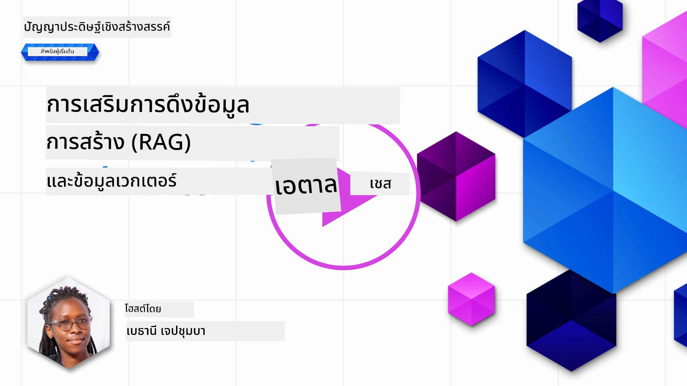
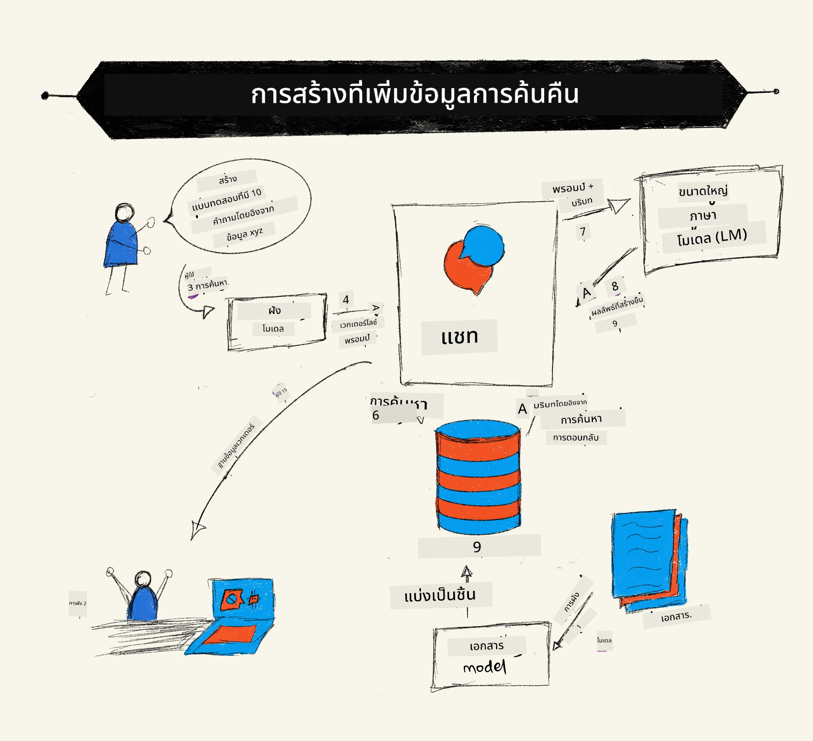
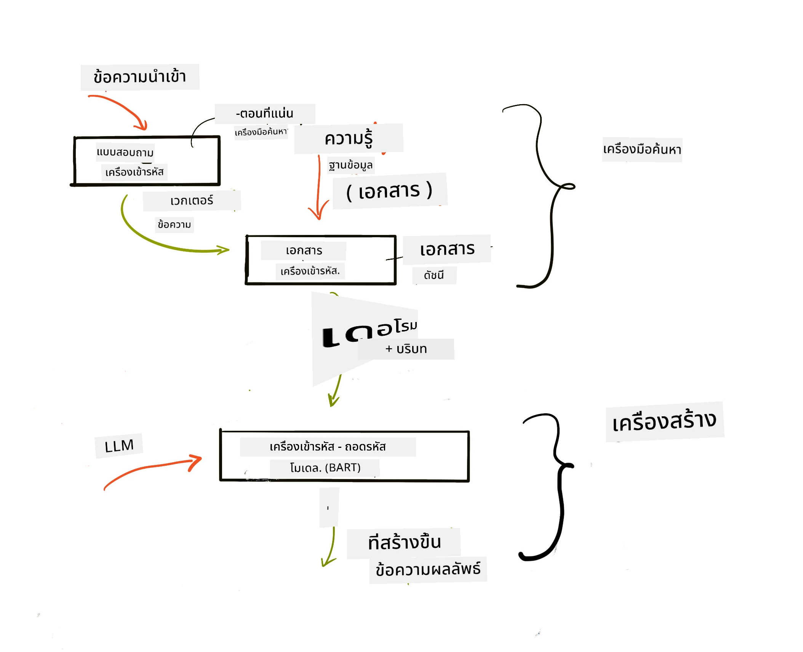
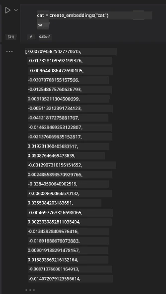

# การสร้างสรรค์ด้วยการดึงข้อมูลเสริม (RAG) และฐานข้อมูลเวกเตอร์

[](https://youtu.be/4l8zhHUBeyI?si=BmvDmL1fnHtgQYkL)

ในบทเรียนเกี่ยวกับแอปพลิเคชันการค้นหา เราได้เรียนรู้เบื้องต้นเกี่ยวกับวิธีการผสานข้อมูลของคุณลงในโมเดลภาษาใหญ่ (LLMs) ในบทเรียนนี้ เราจะสืบค้นเพิ่มเติมเกี่ยวกับแนวคิดของการวางรากฐานข้อมูลของคุณในแอปพลิเคชัน LLM ของคุณ ขั้นตอนของกระบวนการ และวิธีการเก็บข้อมูล รวมถึงทั้ง embeddings และข้อความ

> **วิดีโอจะมาในไม่ช้า**

## บทนำ

ในบทเรียนนี้เราจะครอบคลุมสิ่งต่อไปนี้:

- แนะนำเกี่ยวกับ RAG คืออะไร และทำไมถึงใช้ใน AI (ปัญญาประดิษฐ์)

- ทำความเข้าใจเกี่ยวกับฐานข้อมูลเวกเตอร์และการสร้างหนึ่งสำหรับแอปพลิเคชันของเรา

- ตัวอย่างปฏิบัติเกี่ยวกับวิธีการผสาน RAG เข้ากับแอปพลิเคชัน

## เป้าหมายการเรียนรู้

หลังจากที่ทำบทเรียนนี้เสร็จสิ้น คุณจะสามารถ:

- อธิบายความสำคัญของ RAG ในการดึงและประมวลผลข้อมูล

- ตั้งค่าแอปพลิเคชัน RAG และวางรากฐานข้อมูลของคุณใน LLM

- การผสาน RAG และฐานข้อมูลเวกเตอร์อย่างมีประสิทธิภาพในแอปพลิเคชัน LLM

## สถานการณ์ของเรา: การเสริม LLM ของเราด้วยข้อมูลของเราเอง

สำหรับบทเรียนนี้ เราต้องการเพิ่มบันทึกของเราเองลงในสตาร์ทอัพการศึกษา ซึ่งช่วยให้แชทบอทได้รับข้อมูลเพิ่มเติมเกี่ยวกับวิชาต่างๆ โดยใช้บันทึกที่เรามี ผู้เรียนจะสามารถศึกษาค้นคว้าและเข้าใจหัวข้อต่างๆ ได้ดียิ่งขึ้น ทำให้ง่ายต่อการทบทวนเพื่อเตรียมตัวสอบ เพื่อสร้างสถานการณ์ของเรา เราจะใช้:

- `Azure OpenAI:` LLM ที่เราจะใช้สร้างแชทบอทของเรา

- `บทเรียน AI for beginners เกี่ยวกับ Neural Networks`: นี่คือข้อมูลที่เราวางรากฐาน LLM ของเรา

- `Azure AI Search` และ `Azure Cosmos DB:` ฐานข้อมูลเวกเตอร์เพื่อเก็บข้อมูลและสร้างดัชนีการค้นหา

ผู้ใช้จะสามารถสร้างแบบฝึกหัดจากบันทึกของตนเอง, สร้างแฟลชการ์ดสำหรับทบทวน และสรุปเนื้อหาเป็นภาพรวมที่กระชับ เพื่อเริ่มต้น เรามาดูว่า RAG คืออะไรและทำงานอย่างไร:

## การสร้างสรรค์ด้วยการดึงข้อมูลเสริม (RAG)

แชทบอทที่ขับเคลื่อนด้วย LLM ประมวลผลคำถามของผู้ใช้เพื่อสร้างคำตอบ ออกแบบมาให้โต้ตอบและเข้าร่วมกับผู้ใช้ในหัวข้อต่างๆ อย่างหลากหลาย อย่างไรก็ดี คำตอบของมันถูกจำกัดให้ขึ้นอยู่กับบริบทที่ได้รับและข้อมูลการฝึกพื้นฐาน ตัวอย่างเช่น GPT-4 มีความรู้ถึงเดือนกันยายน 2021 หมายความว่ามันขาดความรู้เกี่ยวกับเหตุการณ์หลังจากช่วงเวลานี้ นอกจากนี้ ข้อมูลที่ใช้ฝึกฝน LLM ไม่รวมข้อมูลส่วนตัว เช่น บันทึกส่วนตัวหรือคู่มือผลิตภัณฑ์ของบริษัท

### วิธีการทำงานของ RAG (Retrieval Augmented Generation)



สมมติว่าคุณต้องการเปิดใช้งานแชทบอทที่สร้างแบบฝึกหัดจากบันทึกของคุณ คุณจะต้องมีการเชื่อมต่อกับฐานความรู้ นี่คือจุดที่ RAG เข้ามาช่วย RAG ทำงานดังนี้:

- **ฐานความรู้:** ก่อนการดึงข้อมูล เอกสารเหล่านี้จำเป็นต้องถูก ingest และประมวลผลล่วงหน้า โดยทั่วไปจะเป็นการแบ่งเอกสารขนาดใหญ่เป็นชิ้นส่วนเล็กลง แปลงเป็น text embedding และเก็บในฐานข้อมูล

- **คำถามของผู้ใช้:** ผู้ใช้ตั้งคำถาม

- **การดึงข้อมูล:** เมื่อผู้ใช้ถามคำถาม โมเดล embedding จะดึงข้อมูลที่เกี่ยวข้องจากฐานความรู้ของเราเพื่อให้บริบทเพิ่มเติมที่จะรวมอยู่ใน prompt

- **การสร้างสรรค์ด้วยการเสริม:** LLM จะปรับปรุงคำตอบตามข้อมูลที่ดึงมาได้ ช่วยให้คำตอบที่สร้างขึ้นไม่ได้จำกัดแค่ข้อมูลที่ฝึกมาเท่านั้น แต่รวมถึงข้อมูลที่เกี่ยวข้องจากบริบทที่เพิ่มเข้ามา ข้อมูลที่ดึงมาใช้เสริมคำตอบของ LLM จากนั้น LLM จะส่งคำตอบกลับให้กับผู้ใช้



สถาปัตยกรรมของ RAG ถูกใช้งานโดยใช้ transformers ซึ่งประกอบด้วยสองส่วน คือ encoder และ decoder ตัวอย่างเช่น เมื่อผู้ใช้ถามคำถาม ข้อความนำเข้า (input text) จะถูก 'เข้ารหัส' เป็นเวกเตอร์ที่จับความหมายของคำ จากนั้นเวกเตอร์จะถูก 'ถอดรหัส' เข้าสู่ดัชนีเอกสารของเราและสร้างข้อความใหม่โดยอิงคำถามของผู้ใช้ LLM ใช้โมเดล encoder-decoder เพื่อสร้างผลลัพธ์

สองแนวทางในการนำ RAG ไปใช้ตามเอกสารที่เสนอ: [Retrieval-Augmented Generation for Knowledge intensive NLP (natural language processing software) Tasks](https://arxiv.org/pdf/2005.11401.pdf?WT.mc_id=academic-105485-koreyst) ได้แก่:

- **_RAG-Sequence_** ใช้เอกสารที่ดึงมาทำนายคำตอบที่ดีที่สุดต่อคำถามของผู้ใช้

- **RAG-Token** ใช้เอกสารเพื่อสร้างโทเค็นถัดไป จากนั้นดึงเอกสารเพื่อตอบคำถามของผู้ใช้

### ทำไมคุณถึงควรใช้ RAG?

- **ความหลากหลายของข้อมูล:** รับประกันว่าคำตอบเป็นข้อความที่อัพเดทและทันสมัย ดังนั้นจึงช่วยเพิ่มประสิทธิภาพในงานเฉพาะทางโดยการเข้าถึงฐานความรู้ภายใน

- ลดการสร้างข้อมูลเท็จโดยใช้ **ข้อมูลที่ตรวจสอบได้** ในฐานความรู้เพื่อให้บริบทกับคำถามของผู้ใช้

- มี **ความคุ้มค่า** เพราะมีต้นทุนถูกกว่าการปรับแต่ง LLM

## การสร้างฐานความรู้

แอปพลิเคชันของเราขึ้นอยู่กับข้อมูลส่วนตัวของเรา เช่น บทเรียน Neural Network ในหลักสูตร AI For Beginners

### ฐานข้อมูลเวกเตอร์

ฐานข้อมูลเวกเตอร์ แตกต่างจากฐานข้อมูลแบบดั้งเดิม คือเป็นฐานข้อมูลเฉพาะที่ออกแบบมาเพื่อเก็บ จัดการ และค้นหาเวกเตอร์ที่ฝังตัว มันเก็บตัวแทนเชิงตัวเลขของเอกสาร การแปลงข้อมูลเป็น embeddings ทำให้ระบบ AI ของเราเข้าใจและประมวลผลข้อมูลได้ง่ายขึ้น

เราเก็บ embeddings ของเราในฐานข้อมูลเวกเตอร์ เนื่องจาก LLM มีข้อจำกัดในจำนวนโทเค็นที่รับเป็นอินพุต เมื่อไม่สามารถส่ง embeddings ทั้งหมดไปยัง LLM เราจึงต้องแบ่งมันเป็นชิ้น และเมื่อผู้ใช้ถามคำถาม embeddings ที่มีความใกล้เคียงกับคำถามที่สุดจะถูกส่งกลับพร้อมกับ prompt การแบ่งชิ้นนี้ยังช่วยลดต้นทุนจากจำนวนโทเค็นที่ส่งผ่าน LLM

ฐานข้อมูลเวกเตอร์ที่นิยมได้แก่ Azure Cosmos DB, Clarifyai, Pinecone, Chromadb, ScaNN, Qdrant และ DeepLake คุณสามารถสร้างโมเดล Azure Cosmos DB ผ่าน Azure CLI ด้วยคำสั่งต่อไปนี้:

```bash
az login
az group create -n <resource-group-name> -l <location>
az cosmosdb create -n <cosmos-db-name> -r <resource-group-name>
az cosmosdb list-keys -n <cosmos-db-name> -g <resource-group-name>
```

### จากข้อความสู่ embeddings

ก่อนจัดเก็บข้อมูล เราต้องแปลงข้อมูลเป็น embeddings ก่อนเก็บในฐานข้อมูล หากคุณทำงานกับเอกสารขนาดใหญ่หรือข้อความยาว คุณสามารถแบ่งตามคำถามที่คาดหวังได้ การแบ่งชิ้นสามารถทำที่ระดับประโยค หรือระดับย่อหน้า เนื่องจากการแบ่งชิ้นต้องอาศัยความหมายจากคำรอบข้าง คุณสามารถเพิ่มบริบทอื่นในชิ้นข้อมูลได้ เช่น เพิ่มชื่อเรื่องเอกสารหรือใส่ข้อความก่อนหรือหลังชิ้นนั้น คุณสามารถแบ่งข้อมูลได้ดังนี้:

```python
def split_text(text, max_length, min_length):
    words = text.split()
    chunks = []
    current_chunk = []

    for word in words:
        current_chunk.append(word)
        if len(' '.join(current_chunk)) < max_length and len(' '.join(current_chunk)) > min_length:
            chunks.append(' '.join(current_chunk))
            current_chunk = []

    # หากชิ้นส่วนสุดท้ายไม่ถึงความยาวขั้นต่ำ ให้เพิ่มมันเข้าไปทั้งนั้น
    if current_chunk:
        chunks.append(' '.join(current_chunk))

    return chunks
```

เมื่อแบ่งชิ้นแล้ว เราสามารถฝังข้อความของเราด้วยโมเดล embedding ต่าง ๆ เช่น word2vec, ada-002 ของ OpenAI, Azure Computer Vision และอื่น ๆ การเลือกโมเดลใช้ขึ้นอยู่กับภาษาเนื้อหาที่เข้ารหัส (ข้อความ/ภาพ/เสียง), ขนาดของอินพุตที่สามารถเข้ารหัส และความยาวของผลลัพธ์ embedding

ตัวอย่างข้อความฝังตัวโดยใช้โมเดล `text-embedding-ada-002` ของ OpenAI คือ:


## การดึงข้อมูลและการค้นหาเวกเตอร์

เมื่อผู้ใช้ถามคำถาม retriever จะแปลงคำถามเป็นเวกเตอร์โดยใช้ query encoder จากนั้นจึงค้นหาผ่านดัชนีเอกสารเพื่อหาเวกเตอร์ที่เกี่ยวข้องกับอินพุต เมื่อเสร็จแล้วมันจะแปลงทั้งเวกเตอร์อินพุตและเวกเตอร์เอกสารเป็นข้อความแล้วส่งผ่าน LLM

### การดึงข้อมูล

การดึงข้อมูลคือการที่ระบบพยายามค้นหาเอกสารจากดัชนีที่ตรงกับเกณฑ์ค้นหา เป้าหมายของ retriever คือการดึงเอกสารที่จะใช้ให้บริบทและวางรากฐานกับ LLM บนข้อมูลของคุณ

มีหลายวิธีในการค้นหาภายในฐานข้อมูลของเรา เช่น:

- **การค้นหาด้วยคำสำคัญ (Keyword search)** - ใช้สำหรับการค้นหาข้อความ

- **การค้นหาเวกเตอร์ (Vector search)** - แปลงเอกสารจากข้อความเป็นตัวแทนเวกเตอร์โดยใช้โมเดล embedding อนุญาตให้มีการ **ค้นหาเชิงความหมาย (semantic search)** โดยใช้ความหมายของคำ การดึงข้อมูลจะทำโดยการสอบถามเอกสารที่เวกเตอร์มีความใกล้เคียงกับคำถามของผู้ใช้มากที่สุด

- **การค้นหาแบบผสมผสาน (Hybrid)** - รวมทั้งการค้นหาคำสำคัญและการค้นหาเวกเตอร์

ความท้าทายของการดึงข้อมูลเกิดขึ้นเมื่อไม่มีคำตอบที่เหมือนกับคำถามในฐานข้อมูล ระบบจะส่งข้อมูลที่ดีที่สุดที่มีได้ อย่างไรก็ตามคุณสามารถใช้กลยุทธ์เช่น กำหนดระยะทางสูงสุดสำหรับความเกี่ยวข้อง หรือใช้การค้นหาแบบผสมที่รวมคำสำคัญและการค้นหาเวกเตอร์ ในบทเรียนนี้เราจะใช้การค้นหาแบบผสม โดยเก็บข้อมูลใน dataframe พร้อมทั้งชิ้นส่วนและ embeddings

### ความคล้ายคลึงของเวกเตอร์

Retriever จะค้นหา embeddings ภายในฐานความรู้ที่อยู่ใกล้เคียงกันที่สุด เนื่องจากข้อความเหล่านี้มีความคล้ายคลึงกัน ในสถานการณ์เมื่อผู้ใช้ถามคำถาม คำถามจะถูกแปลงเป็น embedding จากนั้นจับคู่กับ embeddings ที่คล้ายกัน การวัดที่ใช้กันทั่วไปเพื่อหาความคล้ายคลึงคือ cosine similarity ซึ่งวัดจากมุมระหว่างเวกเตอร์สองตัว

เราสามารถวัดความคล้ายด้วยวิธีอื่นๆ เช่น Euclidean distance ซึ่งคือระยะตรงระหว่างจุดสิ้นสุดเวกเตอร์ และ dot product ซึ่งวัดผลรวมของผลคูณของสมาชิกแต่ละตำแหน่งของเวกเตอร์สองตัว

### ดัชนีการค้นหา

เมื่อทำการดึงข้อมูล เราต้องสร้างดัชนีการค้นหาสำหรับฐานความรู้ก่อนการค้นหา ดัชนีจะเก็บ embeddings ของเราและสามารถดึงชิ้นส่วนที่เหมือนกันที่สุดได้อย่างรวดเร็ว แม้ในฐานข้อมูลขนาดใหญ่ เราสามารถสร้างดัชนีได้ในเครื่องโดยใช้:

```python
from sklearn.neighbors import NearestNeighbors

embeddings = flattened_df['embeddings'].to_list()

# สร้างดัชนีการค้นหา
nbrs = NearestNeighbors(n_neighbors=5, algorithm='ball_tree').fit(embeddings)

# ในการสืบค้นดัชนี คุณสามารถใช้วิธี kneighbors ได้
distances, indices = nbrs.kneighbors(embeddings)
```

### การจัดอันดับใหม่

เมื่อคุณสอบถามฐานข้อมูลแล้ว คุณอาจต้องจัดเรียงผลลัพธ์จากความเกี่ยวข้องมากที่สุด LLM สำหรับการจัดอันดับใหม่จะใช้ Machine Learning เพื่อปรับปรุงความเกี่ยวข้องโดยการจัดลำดับผลลัพธ์จากความเกี่ยวข้องที่สุด โดยใช้ Azure AI Search การจัดอันดับใหม่จะทำโดยอัตโนมัติด้วย semantic reranker ตัวอย่างการทำงานการจัดอันดับใหม่โดยใช้ nearest neighbours:

```python
# ค้นหาเอกสารที่คล้ายกันมากที่สุด
distances, indices = nbrs.kneighbors([query_vector])

index = []
# พิมพ์เอกสารที่คล้ายกันมากที่สุด
for i in range(3):
    index = indices[0][i]
    for index in indices[0]:
        print(flattened_df['chunks'].iloc[index])
        print(flattened_df['path'].iloc[index])
        print(flattened_df['distances'].iloc[index])
    else:
        print(f"Index {index} not found in DataFrame")
```

## การรวมทุกอย่างเข้าด้วยกัน

ขั้นตอนสุดท้ายคือการเพิ่ม LLM ของเราเข้าไปเพื่อให้ได้คำตอบที่มีรากฐานจากข้อมูลของเรา เราสามารถประยุกต์ใช้ได้ดังนี้:

```python
user_input = "what is a perceptron?"

def chatbot(user_input):
    # แปลงคำถามให้เป็นเวกเตอร์คำค้น
    query_vector = create_embeddings(user_input)

    # ค้นหาเอกสารที่มีความคล้ายคลึงมากที่สุด
    distances, indices = nbrs.kneighbors([query_vector])

    # เพิ่มเอกสารลงในคำค้นเพื่อให้บริบท
    history = []
    for index in indices[0]:
        history.append(flattened_df['chunks'].iloc[index])

    # รวมประวัติและข้อมูลที่ผู้ใช้ป้อน
    history.append(user_input)

    # สร้างวัตถุข้อความ
    messages=[
        {"role": "system", "content": "You are an AI assistant that helps with AI questions."},
        {"role": "user", "content": "\n\n".join(history) }
    ]

    # ใช้ API Responses เพื่อสร้างคำตอบ
    response = client.responses.create(
        model="gpt-4o-mini",
        temperature=0.7,
        max_output_tokens=800,
        input=messages,
        store=False,
    )

    return response.output_text

chatbot(user_input)
```

## การประเมินแอปพลิเคชันของเรา

### ตัวชี้วัดการประเมิน

- คุณภาพของคำตอบที่ให้มา เพื่อให้ฟังดูเป็นธรรมชาติ คล่องแคล่ว และเหมือนมนุษย์

- ความมีรากฐานของข้อมูล: ประเมินว่าคำตอบมาจากเอกสารที่ให้ไว้หรือไม่

- ความเกี่ยวข้อง: ประเมินว่าคำตอบตรงกับหรือเกี่ยวข้องกับคำถามที่ถามหรือไม่

- ความคล่องแคล่ว - ว่าคำตอบนั้นสมเหตุสมผลทางไวยากรณ์หรือไม่

## กรณีการใช้งานสำหรับ RAG และฐานข้อมูลเวกเตอร์

มีกรณีการใช้งานมากมายที่ฟังก์ชันการเรียกใช้สามารถปรับปรุงแอปของคุณ เช่น:

- การถามตอบ: วางรากฐานข้อมูลบริษัทของคุณไปยังแชทที่พนักงานสามารถถามคำถามได้

- ระบบแนะนำ: คุณสามารถสร้างระบบที่จับคู่ค่าที่คล้ายกันมากที่สุด เช่น ภาพยนตร์ ร้านอาหาร และอื่น ๆ

- บริการแชทบอท: คุณสามารถเก็บประวัติการแชทและปรับแต่งการสนทนาตามข้อมูลผู้ใช้

- การค้นหาภาพโดยใช้เวกเตอร์ embeddings เหมาะสำหรับการรู้จำภาพและตรวจจับความผิดปกติ

## สรุป

เราได้ครอบคลุมพื้นที่พื้นฐานของ RAG ตั้งแต่การเพิ่มข้อมูลของเราลงในแอปพลิเคชัน คำถามผู้ใช้ และผลลัพธ์ เพื่อให้ง่ายต่อการสร้าง RAG คุณสามารถใช้เฟรมเวิร์กเช่น Semanti Kernel, Langchain หรือ Autogen

## การบ้าน

เพื่อเรียนรู้ต่อเนื่องเกี่ยวกับ Retrieval Augmented Generation (RAG) คุณสามารถสร้าง:

- สร้างอินเตอร์เฟสหน้าปัดสำหรับแอปพลิเคชันโดยใช้เฟรมเวิร์กที่คุณเลือก

- ใช้เฟรมเวิร์ก เช่น LangChain หรือ Semantic Kernel และสร้างแอปของคุณใหม่

ขอแสดงความยินดีที่ทำบทเรียนนี้สำเร็จ 👏

## การเรียนรู้ยังไม่จบที่นี่ เดินทางต่อไป

เมื่อเสร็จสิ้นบทเรียนนี้แล้ว ลองดูที่ [คอลเลกชันการเรียนรู้ Generative AI ของเรา](https://aka.ms/genai-collection?WT.mc_id=academic-105485-koreyst) เพื่อเพิ่มพูนความรู้ Generative AI ของคุณต่อไป!

---

<!-- CO-OP TRANSLATOR DISCLAIMER START -->
**ปฏิเสธความรับผิดชอบ**:
เอกสารนี้ได้รับการแปลโดยใช้บริการแปลภาษา AI [Co-op Translator](https://github.com/Azure/co-op-translator) ขณะที่เราพยายามให้ความถูกต้อง โปรดทราบว่าการแปลโดยอัตโนมัติอาจมีข้อผิดพลาดหรือความไม่ถูกต้อง เอกสารต้นฉบับในภาษาต้นทางควรถูกพิจารณาเป็นแหล่งข้อมูลที่เชื่อถือได้ สำหรับข้อมูลที่สำคัญ แนะนำให้ใช้การแปลโดยมนุษย์มืออาชีพ เราไม่รับผิดชอบต่อความเข้าใจผิดหรือการตีความที่ผิดพลาดที่เกิดขึ้นจากการใช้การแปลนี้
<!-- CO-OP TRANSLATOR DISCLAIMER END -->