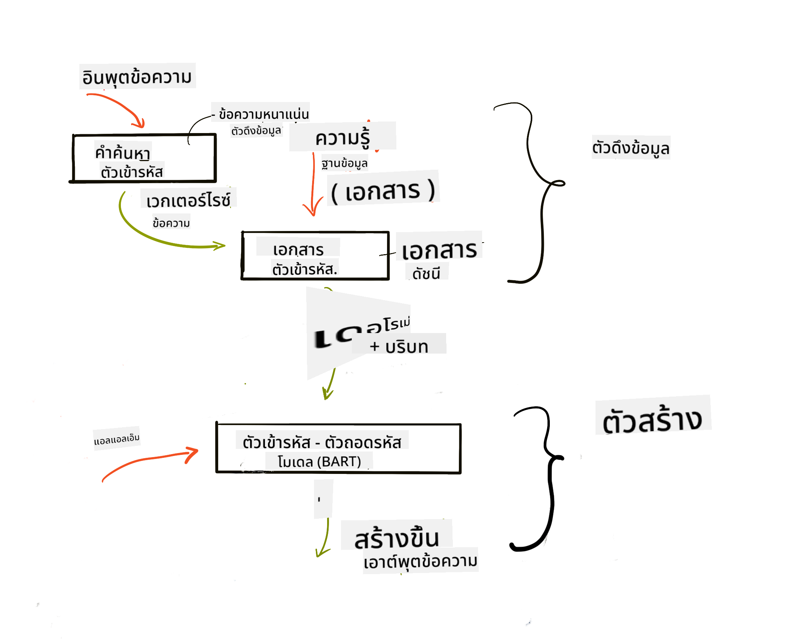

<!--
CO_OP_TRANSLATOR_METADATA:
{
  "original_hash": "e2861bbca91c0567ef32bc77fe054f9e",
  "translation_date": "2025-07-09T16:13:12+00:00",
  "source_file": "15-rag-and-vector-databases/README.md",
  "language_code": "th"
}
-->
# Retrieval Augmented Generation (RAG) และฐานข้อมูลเวกเตอร์

[](https://aka.ms/gen-ai-lesson15-gh?WT.mc_id=academic-105485-koreyst)

ในบทเรียนเกี่ยวกับแอปพลิเคชันการค้นหา เราได้เรียนรู้คร่าวๆ เกี่ยวกับการผสานข้อมูลของคุณเองเข้ากับ Large Language Models (LLMs) ในบทเรียนนี้ เราจะเจาะลึกแนวคิดการเชื่อมโยงข้อมูลของคุณกับแอปพลิเคชัน LLM ขั้นตอนการทำงาน และวิธีการจัดเก็บข้อมูล ทั้งในรูปแบบ embeddings และข้อความ

> **วิดีโอจะมาเร็วๆ นี้**

## บทนำ

ในบทเรียนนี้เราจะครอบคลุมเรื่องต่อไปนี้:

- แนะนำ RAG คืออะไร และเหตุใดจึงนำมาใช้ใน AI (ปัญญาประดิษฐ์)

- ทำความเข้าใจฐานข้อมูลเวกเตอร์และการสร้างฐานข้อมูลสำหรับแอปพลิเคชันของเรา

- ตัวอย่างการใช้งานจริงเกี่ยวกับการผสาน RAG เข้ากับแอปพลิเคชัน

## เป้าหมายการเรียนรู้

หลังจากจบบทเรียนนี้ คุณจะสามารถ:

- อธิบายความสำคัญของ RAG ในการดึงข้อมูลและประมวลผลข้อมูล

- ตั้งค่าแอปพลิเคชัน RAG และเชื่อมโยงข้อมูลของคุณกับ LLM

- ผสาน RAG และฐานข้อมูลเวกเตอร์อย่างมีประสิทธิภาพในแอปพลิเคชัน LLM

## สถานการณ์ของเรา: การเสริม LLM ด้วยข้อมูลของเราเอง

สำหรับบทเรียนนี้ เราต้องการเพิ่มบันทึกของเราเองลงในสตาร์ทอัพด้านการศึกษา เพื่อให้แชทบอทสามารถเข้าถึงข้อมูลเพิ่มเติมเกี่ยวกับหัวข้อต่างๆ จากบันทึกที่เรามี ผู้เรียนจะสามารถศึกษาดีขึ้นและเข้าใจหัวข้อต่างๆ ได้ง่ายขึ้น ช่วยให้ทบทวนเพื่อสอบได้สะดวกขึ้น ในการสร้างสถานการณ์นี้ เราจะใช้:

- `Azure OpenAI:` LLM ที่เราจะใช้สร้างแชทบอท

- `AI for beginners' lesson on Neural Networks:` ข้อมูลที่เราจะใช้เชื่อมโยงกับ LLM

- `Azure AI Search` และ `Azure Cosmos DB:` ฐานข้อมูลเวกเตอร์สำหรับจัดเก็บข้อมูลและสร้างดัชนีการค้นหา

ผู้ใช้จะสามารถสร้างแบบทดสอบฝึกหัดจากบันทึกของตนเอง สร้างแฟลชการ์ดสำหรับทบทวน และสรุปเนื้อหาให้กระชับ เพื่อเริ่มต้น มาดูว่า RAG คืออะไรและทำงานอย่างไร:

## Retrieval Augmented Generation (RAG)

แชทบอทที่ขับเคลื่อนด้วย LLM จะประมวลผลคำถามของผู้ใช้เพื่อสร้างคำตอบ ออกแบบมาให้โต้ตอบและสนทนากับผู้ใช้ในหัวข้อต่างๆ ได้หลากหลาย อย่างไรก็ตาม คำตอบของมันจะจำกัดอยู่ที่บริบทที่ได้รับและข้อมูลการฝึกพื้นฐาน เช่น GPT-4 มีความรู้ถึงแค่กันยายน 2021 หมายความว่ามันไม่มีข้อมูลเกี่ยวกับเหตุการณ์หลังจากนั้น นอกจากนี้ ข้อมูลที่ใช้ฝึก LLM ยังไม่รวมข้อมูลลับ เช่น บันทึกส่วนตัวหรือคู่มือผลิตภัณฑ์ของบริษัท

### วิธีการทำงานของ RAG (Retrieval Augmented Generation)


สมมติว่าคุณต้องการเปิดใช้งานแชทบอทที่สร้างแบบทดสอบจากบันทึกของคุณ คุณจะต้องเชื่อมต่อกับฐานความรู้ ซึ่งนี่คือที่มาของ RAG การทำงานของ RAG มีดังนี้:

- **ฐานความรู้:** ก่อนการดึงข้อมูล เอกสารเหล่านี้ต้องถูกนำเข้าและประมวลผลล่วงหน้า โดยปกติจะแบ่งเอกสารขนาดใหญ่เป็นส่วนย่อยๆ แปลงเป็น text embedding และจัดเก็บในฐานข้อมูล

- **คำถามของผู้ใช้:** ผู้ใช้ถามคำถาม

- **การดึงข้อมูล:** เมื่อผู้ใช้ถามคำถาม โมเดล embedding จะดึงข้อมูลที่เกี่ยวข้องจากฐานความรู้เพื่อเพิ่มบริบทที่จะนำไปใช้ใน prompt

- **การสร้างคำตอบแบบเสริม:** LLM จะปรับปรุงคำตอบโดยอิงจากข้อมูลที่ดึงมา ทำให้คำตอบไม่ได้ขึ้นอยู่กับข้อมูลที่ฝึกมาเท่านั้น แต่รวมถึงข้อมูลบริบทที่เพิ่มเข้ามา ข้อมูลที่ดึงมาจะช่วยเสริมคำตอบของ LLM จากนั้น LLM จะส่งคำตอบกลับไปยังผู้ใช้



สถาปัตยกรรมของ RAG ใช้ transformers ที่ประกอบด้วยสองส่วน คือ encoder และ decoder เช่น เมื่อผู้ใช้ถามคำถาม ข้อความนำเข้าจะถูก 'เข้ารหัส' เป็นเวกเตอร์ที่จับความหมายของคำ และเวกเตอร์เหล่านี้จะถูก 'ถอดรหัส' ไปยังดัชนีเอกสารของเรา และสร้างข้อความใหม่ตามคำถามของผู้ใช้ LLM ใช้โมเดล encoder-decoder เพื่อสร้างผลลัพธ์

มีสองวิธีในการใช้งาน RAG ตามงานวิจัยที่เสนอ: [Retrieval-Augmented Generation for Knowledge intensive NLP Tasks](https://arxiv.org/pdf/2005.11401.pdf?WT.mc_id=academic-105485-koreyst) คือ:

- **_RAG-Sequence_** ใช้เอกสารที่ดึงมาเพื่อทำนายคำตอบที่ดีที่สุดสำหรับคำถามของผู้ใช้

- **RAG-Token** ใช้เอกสารเพื่อสร้าง token ถัดไป แล้วดึงข้อมูลเพื่อให้คำตอบกับคำถามของผู้ใช้

### ทำไมต้องใช้ RAG?

- **ข้อมูลที่ครบถ้วน:** ช่วยให้คำตอบเป็นปัจจุบันและทันสมัย จึงเพิ่มประสิทธิภาพในงานเฉพาะด้านโดยเข้าถึงฐานความรู้ภายใน

- ลดการสร้างข้อมูลเท็จโดยใช้ **ข้อมูลที่ตรวจสอบได้** ในฐานความรู้เพื่อให้บริบทกับคำถามของผู้ใช้

- **ประหยัดค่าใช้จ่าย** เพราะมีต้นทุนต่ำกว่าการปรับแต่ง LLM โดยตรง

## การสร้างฐานความรู้

แอปพลิเคชันของเราจะอิงกับข้อมูลส่วนตัว เช่น บทเรียน Neural Network ในหลักสูตร AI For Beginners

### ฐานข้อมูลเวกเตอร์

ฐานข้อมูลเวกเตอร์ แตกต่างจากฐานข้อมูลทั่วไป เพราะเป็นฐานข้อมูลเฉพาะที่ออกแบบมาเพื่อจัดเก็บ จัดการ และค้นหาเวกเตอร์ที่ฝังตัว (embedded vectors) ซึ่งเป็นการแทนข้อมูลเอกสารในรูปแบบตัวเลข การแปลงข้อมูลเป็น embeddings ช่วยให้ระบบ AI ของเราเข้าใจและประมวลผลข้อมูลได้ง่ายขึ้น

เราจัดเก็บ embeddings ในฐานข้อมูลเวกเตอร์ เนื่องจาก LLM มีข้อจำกัดจำนวน token ที่รับเป็นอินพุต คุณไม่สามารถส่ง embeddings ทั้งหมดให้ LLM ได้ จึงต้องแบ่งเป็นส่วนย่อยๆ และเมื่อผู้ใช้ถามคำถาม embeddings ที่ใกล้เคียงกับคำถามจะถูกส่งกลับพร้อมกับ prompt การแบ่งส่วนยังช่วยลดค่าใช้จ่ายจากจำนวน token ที่ส่งผ่าน LLM

ฐานข้อมูลเวกเตอร์ยอดนิยม เช่น Azure Cosmos DB, Clarifyai, Pinecone, Chromadb, ScaNN, Qdrant และ DeepLake คุณสามารถสร้างโมเดล Azure Cosmos DB โดยใช้ Azure CLI ด้วยคำสั่งดังนี้:

```bash
az login
az group create -n <resource-group-name> -l <location>
az cosmosdb create -n <cosmos-db-name> -r <resource-group-name>
az cosmosdb list-keys -n <cosmos-db-name> -g <resource-group-name>
```

### จากข้อความสู่ embeddings

ก่อนจัดเก็บข้อมูล เราต้องแปลงเป็น vector embeddings ก่อน หากคุณทำงานกับเอกสารขนาดใหญ่หรือข้อความยาว สามารถแบ่งเป็นส่วนย่อยตามคำถามที่คาดว่าจะเจอ การแบ่งส่วนสามารถทำได้ระดับประโยค หรือระดับย่อหน้า เนื่องจากการแบ่งส่วนจะอิงความหมายจากคำรอบข้าง คุณสามารถเพิ่มบริบทอื่นๆ ให้กับแต่ละส่วน เช่น ชื่อเอกสาร หรือข้อความก่อนหลังส่วนย่อยนั้นๆ การแบ่งส่วนทำได้ดังนี้:

```python
def split_text(text, max_length, min_length):
    words = text.split()
    chunks = []
    current_chunk = []

    for word in words:
        current_chunk.append(word)
        if len(' '.join(current_chunk)) < max_length and len(' '.join(current_chunk)) > min_length:
            chunks.append(' '.join(current_chunk))
            current_chunk = []

    # If the last chunk didn't reach the minimum length, add it anyway
    if current_chunk:
        chunks.append(' '.join(current_chunk))

    return chunks
```

เมื่อแบ่งส่วนแล้ว เราสามารถฝังข้อความโดยใช้โมเดล embedding ต่างๆ ได้ เช่น word2vec, ada-002 ของ OpenAI, Azure Computer Vision และอื่นๆ การเลือกโมเดลขึ้นอยู่กับภาษาที่ใช้ ประเภทเนื้อหาที่เข้ารหัส (ข้อความ/ภาพ/เสียง) ขนาดอินพุตที่โมเดลรองรับ และความยาวของผลลัพธ์ embedding

ตัวอย่างข้อความที่ฝังโดยใช้โมเดล `text-embedding-ada-002` ของ OpenAI คือ:


## การดึงข้อมูลและการค้นหาเวกเตอร์

เมื่อผู้ใช้ถามคำถาม ตัวดึงข้อมูล (retriever) จะเปลี่ยนคำถามเป็นเวกเตอร์โดยใช้ query encoder จากนั้นค้นหาเวกเตอร์ที่เกี่ยวข้องในดัชนีเอกสาร เมื่อเสร็จแล้วจะเปลี่ยนเวกเตอร์ทั้งอินพุตและเอกสารเป็นข้อความและส่งผ่านไปยัง LLM

### การดึงข้อมูล

การดึงข้อมูลเกิดขึ้นเมื่อระบบพยายามค้นหาเอกสารจากดัชนีที่ตรงกับเกณฑ์การค้นหา เป้าหมายของตัวดึงข้อมูลคือการได้เอกสารที่ใช้สร้างบริบทและเชื่อมโยง LLM กับข้อมูลของคุณ

มีหลายวิธีในการค้นหาในฐานข้อมูล เช่น:

- **การค้นหาด้วยคำสำคัญ (Keyword search)** - ใช้สำหรับค้นหาข้อความ

- **การค้นหาเชิงความหมาย (Semantic search)** - ใช้ความหมายเชิงบริบทของคำ

- **การค้นหาเวกเตอร์ (Vector search)** - แปลงเอกสารจากข้อความเป็นเวกเตอร์โดยใช้โมเดล embedding การดึงข้อมูลจะทำโดยการค้นหาเอกสารที่เวกเตอร์ใกล้เคียงกับคำถามของผู้ใช้

- **แบบผสม (Hybrid)** - ผสมผสานทั้งการค้นหาด้วยคำสำคัญและเวกเตอร์

ความท้าทายของการดึงข้อมูลคือเมื่อไม่มีคำตอบที่คล้ายกับคำถามในฐานข้อมูล ระบบจะคืนข้อมูลที่ดีที่สุดที่หาได้ อย่างไรก็ตาม คุณสามารถใช้วิธีตั้งค่าระยะห่างสูงสุดสำหรับความเกี่ยวข้อง หรือใช้การค้นหาแบบผสมที่รวมทั้งคำสำคัญและเวกเตอร์ ในบทเรียนนี้เราจะใช้การค้นหาแบบผสม โดยเก็บข้อมูลใน dataframe ที่มีคอลัมน์เก็บส่วนย่อยและ embeddings

### ความคล้ายคลึงของเวกเตอร์

ตัวดึงข้อมูลจะค้นหา embeddings ที่อยู่ใกล้กันในฐานความรู้ โดยจะเลือกเพื่อนบ้านที่ใกล้ที่สุด เพราะเป็นข้อความที่มีความคล้ายคลึงกัน ในสถานการณ์ที่ผู้ใช้ถามคำถาม คำถามจะถูกแปลงเป็น embedding แล้วจับคู่กับ embeddings ที่คล้ายกัน การวัดความคล้ายคลึงที่ใช้บ่อยคือ cosine similarity ซึ่งวัดจากมุมระหว่างเวกเตอร์สองตัว

เราสามารถวัดความคล้ายคลึงด้วยวิธีอื่น เช่น Euclidean distance คือระยะทางตรงระหว่างจุดปลายเวกเตอร์ และ dot product ซึ่งวัดผลรวมของผลคูณขององค์ประกอบที่สอดคล้องกันของเวกเตอร์สองตัว

### ดัชนีการค้นหา

เมื่อทำการดึงข้อมูล เราต้องสร้างดัชนีการค้นหาสำหรับฐานความรู้ก่อน ดัชนีจะเก็บ embeddings และสามารถดึงส่วนที่คล้ายกันมากที่สุดได้อย่างรวดเร็วแม้ในฐานข้อมูลขนาดใหญ่ เราสามารถสร้างดัชนีในเครื่องได้โดยใช้คำสั่ง:

```python
from sklearn.neighbors import NearestNeighbors

embeddings = flattened_df['embeddings'].to_list()

# Create the search index
nbrs = NearestNeighbors(n_neighbors=5, algorithm='ball_tree').fit(embeddings)

# To query the index, you can use the kneighbors method
distances, indices = nbrs.kneighbors(embeddings)
```

### การจัดอันดับใหม่ (Re-ranking)

เมื่อคุณดึงข้อมูลจากฐานข้อมูลแล้ว อาจต้องจัดเรียงผลลัพธ์จากความเกี่ยวข้องมากที่สุด LLM สำหรับการจัดอันดับใหม่ใช้ Machine Learning เพื่อปรับปรุงความเกี่ยวข้องของผลการค้นหาโดยจัดเรียงจากความเกี่ยวข้องสูงสุด ใน Azure AI Search การจัดอันดับใหม่จะทำโดยอัตโนมัติด้วย semantic reranker ตัวอย่างการทำงานของการจัดอันดับใหม่โดยใช้ nearest neighbours:

```python
# Find the most similar documents
distances, indices = nbrs.kneighbors([query_vector])

index = []
# Print the most similar documents
for i in range(3):
    index = indices[0][i]
    for index in indices[0]:
        print(flattened_df['chunks'].iloc[index])
        print(flattened_df['path'].iloc[index])
        print(flattened_df['distances'].iloc[index])
    else:
        print(f"Index {index} not found in DataFrame")
```

## การรวมทุกอย่างเข้าด้วยกัน

ขั้นตอนสุดท้ายคือการเพิ่ม LLM ของเราเข้าไป เพื่อให้ได้คำตอบที่เชื่อมโยงกับข้อมูลของเรา เราสามารถทำได้ดังนี้:

```python
user_input = "what is a perceptron?"

def chatbot(user_input):
    # Convert the question to a query vector
    query_vector = create_embeddings(user_input)

    # Find the most similar documents
    distances, indices = nbrs.kneighbors([query_vector])

    # add documents to query  to provide context
    history = []
    for index in indices[0]:
        history.append(flattened_df['chunks'].iloc[index])

    # combine the history and the user input
    history.append(user_input)

    # create a message object
    messages=[
        {"role": "system", "content": "You are an AI assistant that helps with AI questions."},
        {"role": "user", "content": history[-1]}
    ]

    # use chat completion to generate a response
    response = openai.chat.completions.create(
        model="gpt-4",
        temperature=0.7,
        max_tokens=800,
        messages=messages
    )

    return response.choices[0].message

chatbot(user_input)
```

## การประเมินแอปพลิเคชันของเรา

### ตัวชี้วัดการประเมิน

- คุณภาพของคำตอบที่ให้ ต้องฟังดูเป็นธรรมชาติ ลื่นไหล และเหมือนมนุษย์

- ความเชื่อมโยงของข้อมูล: ประเมินว่าคำตอบมาจากเอกสารที่ให้ไว้หรือไม่

- ความเกี่ยวข้อง: ประเมินว่าคำตอบตรงกับคำถามและเกี่ยวข้องกันหรือไม่

- ความลื่นไหล - คำตอบมีความถูกต้องตามหลักไวยากรณ์หรือไม่

## กรณีการใช้งานของ RAG และฐานข้อมูลเวกเตอร์

มีกรณีการใช้งานหลายแบบที่ function calls สามารถช่วยปรับปรุงแอปของคุณ เช่น:

- การถามตอบ: เชื่อมโยงข้อมูลบริษัทกับแชทที่พนักงานใช้ถามคำถามได้

- ระบบแนะนำ: สร้างระบบที่จับคู่ค่าที่คล้ายกัน เช่น ภาพยนตร์ ร้านอาหาร และอื่นๆ

- บริการแชทบอท: เก็บประวัติการสนทนาและปรับแต่งบทสนทนาตามข้อมูลผู้ใช้

- การค้นหาภาพโดยใช้ embeddings เวกเตอร์ เหมาะสำหรับการรู้จำภาพและตรวจจับความผิดปกติ

## สรุป

เราได้ครอบคลุมพื้นฐานของ RAG ตั้งแต่การเพิ่มข้อมูลของเราในแอปพลิเคชัน คำถามของผู้ใช้ และผลลัพธ์ เพื่อให้ง่ายต่อการสร้าง RAG คุณสามารถใช้เฟรมเวิร์ก เช่น Semantic Kernel, Langchain หรือ Autogen

## แบบฝึกหัด

เพื่อเรียนรู้เพิ่มเติมเกี่ยวกับ Retrieval Augmented Generation (RAG) คุณสามารถสร้าง:

- สร้าง front-end สำหรับแอปพลิเคชันโดยใช้เฟรมเวิร์กที่คุณเลือก

- ใช้เฟรมเวิร์ก เช่น LangChain หรือ Semantic Kernel และสร้างแอปพลิเคชันของคุณใหม่

ขอแสดงความยินดีที่จบบทเรียน 👏

## การเรียนรู้ไม่หยุดเพียงเท่านี้ เดินหน้าต่อไป

หลังจากจบบทเรียนนี้แล้ว ลองดู [Generative AI Learning collection](https://aka.ms/genai-collection?WT.mc_id=academic-105485-koreyst) ของเรา เพื่อพัฒนาความรู้ด้าน Generative AI ของคุณให้ก้าวหน้าต่อไป!

**ข้อจำกัดความรับผิดชอบ**:  
เอกสารนี้ได้รับการแปลโดยใช้บริการแปลภาษาอัตโนมัติ [Co-op Translator](https://github.com/Azure/co-op-translator) แม้เราจะพยายามให้ความถูกต้องสูงสุด แต่โปรดทราบว่าการแปลอัตโนมัติอาจมีข้อผิดพลาดหรือความไม่ถูกต้อง เอกสารต้นฉบับในภาษาต้นทางถือเป็นแหล่งข้อมูลที่เชื่อถือได้ สำหรับข้อมูลที่สำคัญ ขอแนะนำให้ใช้บริการแปลโดยผู้เชี่ยวชาญมนุษย์ เราไม่รับผิดชอบต่อความเข้าใจผิดหรือการตีความผิดใด ๆ ที่เกิดจากการใช้การแปลนี้