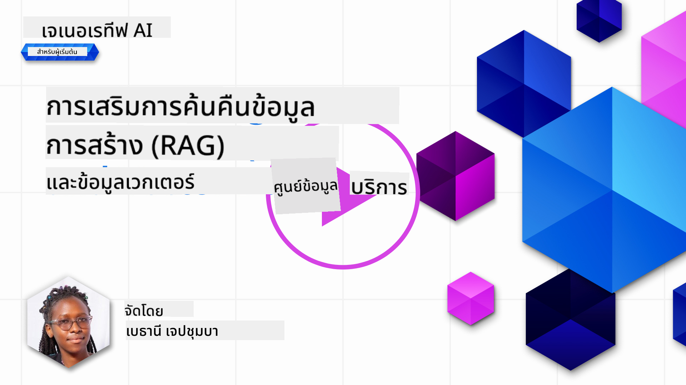

<!--
CO_OP_TRANSLATOR_METADATA:
{
  "original_hash": "b4b0266fbadbba7ded891b6485adc66d",
  "translation_date": "2025-10-17T18:37:09+00:00",
  "source_file": "15-rag-and-vector-databases/README.md",
  "language_code": "th"
}
-->
# การสร้างผลลัพธ์ด้วยการดึงข้อมูล (RAG) และฐานข้อมูลเวกเตอร์

[](https://youtu.be/4l8zhHUBeyI?si=BmvDmL1fnHtgQYkL)

ในบทเรียนเกี่ยวกับแอปพลิเคชันการค้นหา เราได้เรียนรู้เบื้องต้นเกี่ยวกับการผสานข้อมูลของคุณเข้ากับโมเดลภาษาขนาดใหญ่ (LLMs) ในบทเรียนนี้ เราจะเจาะลึกถึงแนวคิดเกี่ยวกับการเชื่อมโยงข้อมูลของคุณในแอปพลิเคชัน LLM กลไกของกระบวนการ และวิธีการจัดเก็บข้อมูล รวมถึงการฝังข้อมูลและข้อความ

> **วิดีโอจะมาเร็วๆ นี้**

## บทนำ

ในบทเรียนนี้เราจะครอบคลุมหัวข้อต่อไปนี้:

- บทนำเกี่ยวกับ RAG คืออะไรและทำไมจึงถูกใช้ใน AI (ปัญญาประดิษฐ์)

- ทำความเข้าใจว่าอะไรคือฐานข้อมูลเวกเตอร์และการสร้างฐานข้อมูลสำหรับแอปพลิเคชันของเรา

- ตัวอย่างการใช้งานจริงเกี่ยวกับการผสาน RAG เข้ากับแอปพลิเคชัน

## เป้าหมายการเรียนรู้

หลังจากจบบทเรียนนี้ คุณจะสามารถ:

- อธิบายความสำคัญของ RAG ในการดึงข้อมูลและการประมวลผล

- ตั้งค่าแอปพลิเคชัน RAG และเชื่อมโยงข้อมูลของคุณกับ LLM

- ผสาน RAG และฐานข้อมูลเวกเตอร์เข้ากับแอปพลิเคชัน LLM ได้อย่างมีประสิทธิภาพ

## สถานการณ์ของเรา: เพิ่มประสิทธิภาพ LLM ด้วยข้อมูลของเราเอง

สำหรับบทเรียนนี้ เราต้องการเพิ่มบันทึกของเราเองเข้าไปในสตาร์ทอัพด้านการศึกษา ซึ่งช่วยให้แชทบอทสามารถให้ข้อมูลเพิ่มเติมเกี่ยวกับหัวข้อต่างๆ ได้ โดยใช้บันทึกที่เรามี ผู้เรียนจะสามารถเรียนรู้ได้ดีขึ้นและเข้าใจหัวข้อต่างๆ ได้ง่ายขึ้น ทำให้การเตรียมตัวสอบง่ายขึ้น เพื่อสร้างสถานการณ์ของเรา เราจะใช้:

- `Azure OpenAI:` LLM ที่เราจะใช้ในการสร้างแชทบอทของเรา

- `บทเรียน AI สำหรับผู้เริ่มต้นเกี่ยวกับ Neural Networks:` นี่จะเป็นข้อมูลที่เราเชื่อมโยง LLM ของเรา

- `Azure AI Search` และ `Azure Cosmos DB:` ฐานข้อมูลเวกเตอร์สำหรับจัดเก็บข้อมูลของเราและสร้างดัชนีการค้นหา

ผู้ใช้จะสามารถสร้างแบบทดสอบฝึกฝนจากบันทึกของพวกเขา การ์ดแฟลชสำหรับการทบทวน และสรุปข้อมูลให้เป็นภาพรวมที่กระชับ เพื่อเริ่มต้น เรามาดูว่า RAG คืออะไรและทำงานอย่างไร:

## การสร้างผลลัพธ์ด้วยการดึงข้อมูล (RAG)

แชทบอทที่ขับเคลื่อนด้วย LLM ประมวลผลคำถามของผู้ใช้เพื่อสร้างคำตอบ มันถูกออกแบบมาให้มีการโต้ตอบและสื่อสารกับผู้ใช้ในหัวข้อต่างๆ อย่างไรก็ตาม คำตอบของมันถูกจำกัดอยู่ในบริบทที่ให้ไว้และข้อมูลการฝึกอบรมพื้นฐานของมัน ตัวอย่างเช่น ข้อมูลของ GPT-4 ถูกตัดขาดในเดือนกันยายน 2021 หมายความว่ามันไม่มีความรู้เกี่ยวกับเหตุการณ์ที่เกิดขึ้นหลังจากช่วงเวลานี้ นอกจากนี้ ข้อมูลที่ใช้ในการฝึกอบรม LLM ยังไม่รวมข้อมูลที่เป็นความลับ เช่น บันทึกส่วนตัวหรือคู่มือผลิตภัณฑ์ของบริษัท

### RAGs (การสร้างผลลัพธ์ด้วยการดึงข้อมูล) ทำงานอย่างไร


สมมติว่าคุณต้องการเปิดใช้งานแชทบอทที่สร้างแบบทดสอบจากบันทึกของคุณ คุณจะต้องมีการเชื่อมต่อกับฐานความรู้ นี่คือจุดที่ RAG เข้ามาช่วย RAGs ทำงานดังนี้:

- **ฐานความรู้:** ก่อนการดึงข้อมูล เอกสารเหล่านี้จำเป็นต้องถูกนำเข้าและประมวลผล โดยปกติจะเป็นการแบ่งเอกสารขนาดใหญ่เป็นชิ้นเล็กๆ แปลงเป็นการฝังข้อความ และจัดเก็บในฐานข้อมูล

- **คำถามของผู้ใช้:** ผู้ใช้ถามคำถาม

- **การดึงข้อมูล:** เมื่อผู้ใช้ถามคำถาม โมเดลการฝังข้อความจะดึงข้อมูลที่เกี่ยวข้องจากฐานความรู้ของเราเพื่อให้บริบทเพิ่มเติมที่รวมเข้ากับคำถาม

- **การสร้างผลลัพธ์ที่เพิ่มขึ้น:** LLM ปรับปรุงคำตอบของมันโดยอิงจากข้อมูลที่ดึงมา มันช่วยให้คำตอบที่สร้างขึ้นไม่เพียงแต่อิงจากข้อมูลที่ฝึกอบรมมาเท่านั้น แต่ยังรวมถึงข้อมูลที่เกี่ยวข้องจากบริบทที่เพิ่มเข้ามา ข้อมูลที่ดึงมาจะถูกใช้เพื่อเพิ่มคำตอบของ LLM จากนั้น LLM จะส่งคำตอบกลับไปยังคำถามของผู้ใช้


สถาปัตยกรรมของ RAGs ถูกนำมาใช้โดยใช้ตัวแปลงสัญญาณที่ประกอบด้วยสองส่วน: ตัวเข้ารหัสและตัวถอดรหัส ตัวอย่างเช่น เมื่อผู้ใช้ถามคำถาม ข้อความที่ป้อนจะถูก 'เข้ารหัส' เป็นเวกเตอร์ที่จับความหมายของคำ และเวกเตอร์จะถูก 'ถอดรหัส' ไปยังดัชนีเอกสารของเราและสร้างข้อความใหม่ตามคำถามของผู้ใช้ LLM ใช้ทั้งโมเดลตัวเข้ารหัส-ตัวถอดรหัสเพื่อสร้างผลลัพธ์

สองวิธีในการนำ RAG มาใช้ตามเอกสารที่เสนอ: [Retrieval-Augmented Generation for Knowledge intensive NLP (natural language processing software) Tasks](https://arxiv.org/pdf/2005.11401.pdf?WT.mc_id=academic-105485-koreyst) ได้แก่:

- **_RAG-Sequence_** ใช้เอกสารที่ดึงมาเพื่อทำนายคำตอบที่ดีที่สุดสำหรับคำถามของผู้ใช้

- **RAG-Token** ใช้เอกสารเพื่อสร้างโทเค็นถัดไป จากนั้นดึงเอกสารเหล่านั้นเพื่อตอบคำถามของผู้ใช้

### ทำไมคุณถึงใช้ RAGs?

- **ความสมบูรณ์ของข้อมูล:** ทำให้คำตอบข้อความเป็นปัจจุบันและทันสมัย ดังนั้นจึงช่วยเพิ่มประสิทธิภาพในงานเฉพาะด้านโดยการเข้าถึงฐานความรู้ภายใน

- ลดการสร้างข้อมูลเท็จโดยใช้ **ข้อมูลที่ตรวจสอบได้** ในฐานความรู้เพื่อให้บริบทกับคำถามของผู้ใช้

- มีความ **คุ้มค่า** เนื่องจากประหยัดกว่าการปรับแต่ง LLM ใหม่

## การสร้างฐานความรู้

แอปพลิเคชันของเราขึ้นอยู่กับข้อมูลส่วนตัวของเรา เช่น บทเรียน Neural Network ในหลักสูตร AI สำหรับผู้เริ่มต้น

### ฐานข้อมูลเวกเตอร์

ฐานข้อมูลเวกเตอร์ แตกต่างจากฐานข้อมูลแบบดั้งเดิม เป็นฐานข้อมูลเฉพาะที่ออกแบบมาเพื่อจัดเก็บ จัดการ และค้นหาเวกเตอร์ที่ฝังอยู่ มันจัดเก็บการแสดงผลเชิงตัวเลขของเอกสาร การแปลงข้อมูลเป็นการฝังตัวเลขทำให้ระบบ AI ของเราเข้าใจและประมวลผลข้อมูลได้ง่ายขึ้น

เราจัดเก็บการฝังข้อมูลของเราในฐานข้อมูลเวกเตอร์เนื่องจาก LLM มีข้อจำกัดเกี่ยวกับจำนวนโทเค็นที่ยอมรับเป็นข้อมูลเข้า เนื่องจากคุณไม่สามารถส่งการฝังข้อมูลทั้งหมดไปยัง LLM ได้ เราจำเป็นต้องแบ่งข้อมูลออกเป็นชิ้นเล็กๆ และเมื่อผู้ใช้ถามคำถาม การฝังข้อมูลที่คล้ายกับคำถามมากที่สุดจะถูกส่งกลับมาพร้อมกับคำถาม การแบ่งข้อมูลเป็นชิ้นเล็กๆ ยังช่วยลดค่าใช้จ่ายเกี่ยวกับจำนวนโทเค็นที่ส่งผ่าน LLM

ฐานข้อมูลเวกเตอร์ยอดนิยมบางตัว ได้แก่ Azure Cosmos DB, Clarifyai, Pinecone, Chromadb, ScaNN, Qdrant และ DeepLake คุณสามารถสร้างโมเดล Azure Cosmos DB โดยใช้ Azure CLI ด้วยคำสั่งต่อไปนี้:

```bash
az login
az group create -n <resource-group-name> -l <location>
az cosmosdb create -n <cosmos-db-name> -r <resource-group-name>
az cosmosdb list-keys -n <cosmos-db-name> -g <resource-group-name>
```

### จากข้อความสู่การฝังข้อมูล

ก่อนที่เราจะจัดเก็บข้อมูลของเรา เราจำเป็นต้องแปลงข้อมูลเป็นการฝังเวกเตอร์ก่อนที่จะจัดเก็บในฐานข้อมูล หากคุณกำลังทำงานกับเอกสารขนาดใหญ่หรือข้อความยาว คุณสามารถแบ่งข้อมูลตามคำถามที่คุณคาดหวัง การแบ่งข้อมูลสามารถทำได้ในระดับประโยค หรือในระดับย่อหน้า เนื่องจากการแบ่งข้อมูลจะดึงความหมายจากคำที่อยู่รอบๆ คุณสามารถเพิ่มบริบทอื่นๆ ลงในชิ้นข้อมูลได้ เช่น การเพิ่มชื่อเอกสารหรือการเพิ่มข้อความก่อนหรือหลังชิ้นข้อมูล คุณสามารถแบ่งข้อมูลได้ดังนี้:

```python
def split_text(text, max_length, min_length):
    words = text.split()
    chunks = []
    current_chunk = []

    for word in words:
        current_chunk.append(word)
        if len(' '.join(current_chunk)) < max_length and len(' '.join(current_chunk)) > min_length:
            chunks.append(' '.join(current_chunk))
            current_chunk = []

    # If the last chunk didn't reach the minimum length, add it anyway
    if current_chunk:
        chunks.append(' '.join(current_chunk))

    return chunks
```

เมื่อแบ่งข้อมูลแล้ว เราสามารถฝังข้อความของเราโดยใช้โมเดลการฝังข้อมูลต่างๆ โมเดลที่คุณสามารถใช้ได้ ได้แก่ word2vec, ada-002 โดย OpenAI, Azure Computer Vision และอื่นๆ อีกมากมาย การเลือกโมเดลที่จะใช้ขึ้นอยู่กับภาษาที่คุณใช้ ประเภทของเนื้อหาที่เข้ารหัส (ข้อความ/ภาพ/เสียง) ขนาดของข้อมูลเข้า และความยาวของผลลัพธ์การฝังข้อมูล

ตัวอย่างการฝังข้อความโดยใช้โมเดล `text-embedding-ada-002` ของ OpenAI คือ:


## การดึงข้อมูลและการค้นหาเวกเตอร์

เมื่อผู้ใช้ถามคำถาม ตัวดึงข้อมูลจะเปลี่ยนคำถามเป็นเวกเตอร์โดยใช้ตัวเข้ารหัสคำถาม จากนั้นจะค้นหาดัชนีการค้นหาเอกสารของเราสำหรับเวกเตอร์ที่เกี่ยวข้องในเอกสารที่เกี่ยวข้องกับข้อมูลเข้า เมื่อเสร็จสิ้นแล้ว มันจะเปลี่ยนทั้งเวกเตอร์ข้อมูลเข้าและเวกเตอร์เอกสารเป็นข้อความและส่งผ่าน LLM

### การดึงข้อมูล

การดึงข้อมูลเกิดขึ้นเมื่อระบบพยายามค้นหาเอกสารจากดัชนีที่ตรงกับเกณฑ์การค้นหาอย่างรวดเร็ว เป้าหมายของตัวดึงข้อมูลคือการดึงเอกสารที่จะใช้เพื่อให้บริบทและเชื่อมโยง LLM กับข้อมูลของคุณ

มีหลายวิธีในการค้นหาภายในฐานข้อมูลของเรา เช่น:

- **การค้นหาด้วยคำสำคัญ** - ใช้สำหรับการค้นหาข้อความ

- **การค้นหาเชิงความหมาย** - ใช้ความหมายเชิงความหมายของคำ

- **การค้นหาเวกเตอร์** - แปลงเอกสารจากข้อความเป็นการแสดงผลเวกเตอร์โดยใช้โมเดลการฝังข้อมูล การดึงข้อมูลจะทำโดยการค้นหาเอกสารที่การแสดงผลเวกเตอร์ใกล้เคียงกับคำถามของผู้ใช้มากที่สุด

- **แบบผสม** - การผสมผสานระหว่างการค้นหาด้วยคำสำคัญและการค้นหาเวกเตอร์

ความท้าทายของการดึงข้อมูลเกิดขึ้นเมื่อไม่มีคำตอบที่คล้ายคลึงกับคำถามในฐานข้อมูล ระบบจะส่งคืนข้อมูลที่ดีที่สุดที่สามารถหาได้ อย่างไรก็ตาม คุณสามารถใช้กลยุทธ์เช่นการตั้งค่าระยะทางสูงสุดสำหรับความเกี่ยวข้องหรือใช้การค้นหาแบบผสมที่รวมทั้งคำสำคัญและการค้นหาเวกเตอร์ ในบทเรียนนี้เราจะใช้การค้นหาแบบผสม การผสมผสานระหว่างการค้นหาเวกเตอร์และคำสำคัญ เราจะจัดเก็บข้อมูลของเราใน dataframe โดยมีคอลัมน์ที่ประกอบด้วยชิ้นข้อมูลและการฝังข้อมูล

### ความคล้ายคลึงของเวกเตอร์

ตัวดึงข้อมูลจะค้นหาผ่านฐานข้อมูลความรู้สำหรับการฝังข้อมูลที่อยู่ใกล้กันที่สุด ซึ่งเป็นเพื่อนบ้านที่ใกล้ที่สุด เนื่องจากเป็นข้อความที่คล้ายกัน ในกรณีที่ผู้ใช้ถามคำถาม มันจะถูกฝังข้อมูลก่อนแล้วจับคู่กับการฝังข้อมูลที่คล้ายกัน การวัดทั่วไปที่ใช้เพื่อหาความคล้ายคลึงกันของเวกเตอร์ต่างๆ คือความคล้ายคลึงของโคไซน์ ซึ่งอิงตามมุมระหว่างเวกเตอร์สองตัว

เราสามารถวัดความคล้ายคลึงกันโดยใช้ทางเลือกอื่น เช่น ระยะทางยูคลิด ซึ่งเป็นเส้นตรงระหว่างจุดปลายของเวกเตอร์ และผลคูณจุด ซึ่งวัดผลรวมของผลคูณขององค์ประกอบที่สอดคล้องกันของเวกเตอร์สองตัว

### ดัชนีการค้นหา

เมื่อทำการดึงข้อมูล เราจำเป็นต้องสร้างดัชนีการค้นหาสำหรับฐานความรู้ของเราก่อนที่จะทำการค้นหา ดัชนีจะจัดเก็บการฝังข้อมูลของเราและสามารถดึงชิ้นข้อมูลที่คล้ายกันมากที่สุดได้อย่างรวดเร็วแม้ในฐานข้อมูลขนาดใหญ่ เราสามารถสร้างดัชนีของเราในเครื่องโดยใช้:

```python
from sklearn.neighbors import NearestNeighbors

embeddings = flattened_df['embeddings'].to_list()

# Create the search index
nbrs = NearestNeighbors(n_neighbors=5, algorithm='ball_tree').fit(embeddings)

# To query the index, you can use the kneighbors method
distances, indices = nbrs.kneighbors(embeddings)
```

### การจัดอันดับใหม่

เมื่อคุณได้ทำการค้นหาฐานข้อมูลแล้ว คุณอาจจำเป็นต้องจัดเรียงผลลัพธ์จากที่เกี่ยวข้องที่สุด การจัดอันดับใหม่โดยใช้ LLM ใช้ Machine Learning เพื่อปรับปรุงความเกี่ยวข้องของผลลัพธ์การค้นหาโดยการจัดเรียงจากที่เกี่ยวข้องที่สุด การใช้ Azure AI Search การจัดอันดับใหม่จะทำโดยอัตโนมัติสำหรับคุณโดยใช้ตัวจัดอันดับเชิงความหมาย ตัวอย่างของการจัดอันดับใหม่โดยใช้เพื่อนบ้านที่ใกล้ที่สุด:

```python
# Find the most similar documents
distances, indices = nbrs.kneighbors([query_vector])

index = []
# Print the most similar documents
for i in range(3):
    index = indices[0][i]
    for index in indices[0]:
        print(flattened_df['chunks'].iloc[index])
        print(flattened_df['path'].iloc[index])
        print(flattened_df['distances'].iloc[index])
    else:
        print(f"Index {index} not found in DataFrame")
```

## การนำทุกอย่างมารวมกัน

ขั้นตอนสุดท้ายคือการเพิ่ม LLM ของเราเข้าไปเพื่อให้สามารถสร้างคำตอบที่เชื่อมโยงกับข้อมูลของเราได้ เราสามารถนำไปใช้ได้ดังนี้:

```python
user_input = "what is a perceptron?"

def chatbot(user_input):
    # Convert the question to a query vector
    query_vector = create_embeddings(user_input)

    # Find the most similar documents
    distances, indices = nbrs.kneighbors([query_vector])

    # add documents to query  to provide context
    history = []
    for index in indices[0]:
        history.append(flattened_df['chunks'].iloc[index])

    # combine the history and the user input
    history.append(user_input)

    # create a message object
    messages=[
        {"role": "system", "content": "You are an AI assistant that helps with AI questions."},
        {"role": "user", "content": history[-1]}
    ]

    # use chat completion to generate a response
    response = openai.chat.completions.create(
        model="gpt-4",
        temperature=0.7,
        max_tokens=800,
        messages=messages
    )

    return response.choices[0].message

chatbot(user_input)
```

## การประเมินแอปพลิเคชันของเรา

### ตัวชี้วัดการประเมินผล

- คุณภาพของคำตอบที่ให้มา โดยมั่นใจว่ามันฟังดูเป็นธรรมชาติ คล่องแคล่ว และเหมือนมนุษย์

- ความเชื่อมโยงของข้อมูล: ประเมินว่าคำตอบมาจากเอกสารที่ให้ไว้หรือไม่

- ความเกี่ยวข้อง: ประเมินว่าคำตอบตรงกับคำถามที่ถามหรือไม่

- ความคล่องแคล่ว - ว่าคำตอบมีความสมเหตุสมผลทางไวยากรณ์หรือไม่

## กรณีการใช้งานสำหรับการใช้ RAG (การสร้างผลลัพธ์ด้วยการดึงข้อมูล) และฐานข้อมูลเวกเตอร์

มีกรณีการใช้งานที่หลากหลายที่การเรียกฟังก์ชันสามารถปรับปรุงแอปของคุณได้ เช่น:

- การถามตอบ: เชื่อมโยงข้อมูลบริษัทของคุณกับแชทที่สามารถใช้โดยพนักงานเพื่อถามคำถาม

- ระบบแนะนำ: ที่คุณสามารถสร้างระบบที่จับคู่ค่าที่คล้ายกันที่สุด เช่น ภาพยนตร์ ร้านอาหาร และอื่นๆ

- บริการแชทบอท: คุณสามารถจัดเก็บประวัติการแชทและปรับแต่งการสนทนาโดยอิงจากข้อมูลผู้ใช้

- การค้นหารูปภาพโดยอิงจากการฝังเวกเตอร์ มีประโยชน์เมื่อทำการจดจำภาพและการตรวจจับความผิดปกติ

## สรุป

เราได้ครอบคลุมพื้นที่พื้นฐานของ RAG ตั้งแต่การเพิ่มข้อมูลของเราเข้าไปในแอปพลิเคชัน คำถามของผู้ใช้ และผลลัพธ์ที่ได้ เพื่อให้ง่ายต่อการสร้าง RAG คุณสามารถใช้เฟรมเวิร์ค เช่น Semantic Kernel, Langchain หรือ Autogen

## งานที่ได้รับมอบหมาย

เพื่อเรียนรู้เพิ่มเติมเกี่ยวกับการสร้างผลลัพธ์ด้วยการดึงข้อมูล (RAG) คุณสามารถสร้าง:

- สร้างส่วนหน้าสำหรับแอปพลิเคชันโดยใช้เฟรมเวิร์คที่คุณเลือก

- ใช้เฟรมเวิร์ค เช่น LangChain หรือ Semantic Kernel และสร้างแอปพลิเคชันของคุณใหม่

ขอแสดงความยินดีที่จบบทเรียน 👏

## การเรียนรู้ไม่ได้หยุดอยู่แค่นี้ เดินทางต่อไป

หลังจากจบบทเรียนนี้ ลองดู [คอลเลกชันการเรียนรู้ Generative AI](https://aka.ms/genai-collection?WT.mc_id=academic-105485-koreyst) ของเราเพื่อเพิ่มพูนความรู้เกี่ยวกับ Generative AI ของคุณ!

---

**ข้อจำกัดความรับผิดชอบ**:  
เอกสารนี้ได้รับการแปลโดยใช้บริการแปลภาษา AI [Co-op Translator](https://github.com/Azure/co-op-translator) แม้ว่าเราจะพยายามให้การแปลมีความถูกต้อง แต่โปรดทราบว่าการแปลอัตโนมัติอาจมีข้อผิดพลาดหรือความไม่ถูกต้อง เอกสารต้นฉบับในภาษาดั้งเดิมควรถือเป็นแหล่งข้อมูลที่เชื่อถือได้ สำหรับข้อมูลที่สำคัญ ขอแนะนำให้ใช้บริการแปลภาษามืออาชีพ เราจะไม่รับผิดชอบต่อความเข้าใจผิดหรือการตีความผิดที่เกิดจากการใช้การแปลนี้