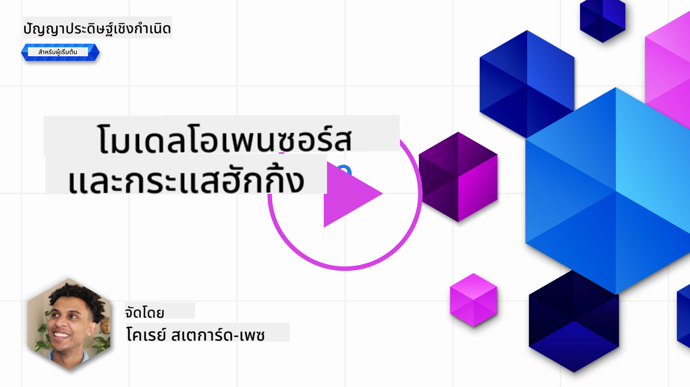
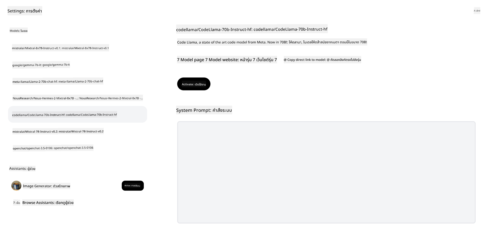

<!--
CO_OP_TRANSLATOR_METADATA:
{
  "original_hash": "0bba96e53ab841d99db731892a51fab8",
  "translation_date": "2025-05-20T06:56:22+00:00",
  "source_file": "16-open-source-models/README.md",
  "language_code": "th"
}
-->

## บทนำ

โลกของ LLMs แบบโอเพ่นซอร์สมีความน่าตื่นเต้นและมีการเปลี่ยนแปลงอย่างต่อเนื่อง บทเรียนนี้มีเป้าหมายที่จะให้ข้อมูลเชิงลึกเกี่ยวกับโมเดลโอเพ่นซอร์ส หากคุณกำลังมองหาข้อมูลเกี่ยวกับการเปรียบเทียบระหว่างโมเดลที่มีลิขสิทธิ์กับโมเดลโอเพ่นซอร์ส ไปที่บทเรียน ["การสำรวจและเปรียบเทียบ LLMs ต่าง ๆ"](../02-exploring-and-comparing-different-llms/README.md?WT.mc_id=academic-105485-koreyst) บทเรียนนี้จะครอบคลุมหัวข้อการปรับแต่งเพิ่มเติม แต่สามารถหาอธิบายละเอียดได้ในบทเรียน ["การปรับแต่ง LLMs"](../18-fine-tuning/README.md?WT.mc_id=academic-105485-koreyst)

## เป้าหมายการเรียนรู้

- ทำความเข้าใจเกี่ยวกับโมเดลโอเพ่นซอร์ส
- เข้าใจถึงประโยชน์ของการทำงานกับโมเดลโอเพ่นซอร์ส
- สำรวจโมเดลโอเพ่นที่มีอยู่ใน Hugging Face และ Azure AI Studio

## โมเดลโอเพ่นซอร์สคืออะไร?

ซอฟต์แวร์โอเพ่นซอร์สมีบทบาทสำคัญในการเติบโตของเทคโนโลยีในหลายสาขา Open Source Initiative (OSI) ได้กำหนด [10 ข้อกำหนดสำหรับซอฟต์แวร์](https://web.archive.org/web/20241126001143/https://opensource.org/osd?WT.mc_id=academic-105485-koreyst) เพื่อให้ถูกจัดเป็นโอเพ่นซอร์ส โค้ดต้นฉบับต้องถูกแชร์อย่างเปิดเผยภายใต้ใบอนุญาตที่ OSI อนุมัติ

แม้ว่าการพัฒนา LLMs จะมีองค์ประกอบคล้ายกับการพัฒนาซอฟต์แวร์ แต่กระบวนการไม่เหมือนกันทั้งหมด สิ่งนี้ทำให้เกิดการถกเถียงในชุมชนเกี่ยวกับคำจำกัดความของโอเพ่นซอร์สในบริบทของ LLMs สำหรับโมเดลที่จะสอดคล้องกับคำจำกัดความของโอเพ่นซอร์สแบบดั้งเดิม ข้อมูลต่อไปนี้ควรมีการเผยแพร่ต่อสาธารณะ:

- ชุดข้อมูลที่ใช้ในการฝึกโมเดล
- น้ำหนักโมเดลเต็มรูปแบบเป็นส่วนหนึ่งของการฝึก
- โค้ดการประเมินผล
- โค้ดการปรับแต่งเพิ่มเติม
- น้ำหนักโมเดลเต็มรูปแบบและเมตริกการฝึก

ปัจจุบันมีเพียงไม่กี่โมเดลที่ตรงตามเกณฑ์นี้ [โมเดล OLMo ที่สร้างโดย Allen Institute for Artificial Intelligence (AllenAI)](https://huggingface.co/allenai/OLMo-7B?WT.mc_id=academic-105485-koreyst) เป็นหนึ่งในโมเดลที่เข้าข่ายนี้

สำหรับบทเรียนนี้ เราจะเรียกโมเดลเหล่านี้ว่า "โมเดลโอเพ่น" เนื่องจากอาจไม่ตรงกับเกณฑ์ข้างต้นในเวลาที่เขียน

## ประโยชน์ของโมเดลโอเพ่น

**ปรับแต่งได้สูง** - เนื่องจากโมเดลโอเพ่นถูกปล่อยพร้อมข้อมูลการฝึกที่ละเอียด นักวิจัยและนักพัฒนาสามารถปรับเปลี่ยนภายในของโมเดลได้ สิ่งนี้ช่วยให้สร้างโมเดลที่มีความเชี่ยวชาญสูงซึ่งได้รับการปรับแต่งสำหรับงานเฉพาะหรือสาขาการศึกษา ตัวอย่างบางส่วนคือการสร้างโค้ด การดำเนินการทางคณิตศาสตร์ และชีววิทยา

**ต้นทุน** - ต้นทุนต่อโทเค็นในการใช้และปรับใช้โมเดลเหล่านี้ต่ำกว่าโมเดลที่มีลิขสิทธิ์ เมื่อสร้างแอปพลิเคชัน Generative AI ควรพิจารณาประสิทธิภาพเทียบกับราคาเมื่อทำงานกับโมเดลเหล่านี้ในกรณีการใช้งานของคุณ

แหล่งที่มา: Artificial Analysis

**ความยืดหยุ่น** - การทำงานกับโมเดลโอเพ่นทำให้คุณมีความยืดหยุ่นในการใช้โมเดลต่าง ๆ หรือการรวมกันของพวกมัน ตัวอย่างเช่น [HuggingChat Assistants](https://huggingface.co/chat?WT.mc_id=academic-105485-koreyst) ที่ผู้ใช้สามารถเลือกโมเดลที่ใช้งานโดยตรงในอินเตอร์เฟซผู้ใช้:

## การสำรวจโมเดลโอเพ่นต่าง ๆ

### Llama 2

[LLama2](https://huggingface.co/meta-llama?WT.mc_id=academic-105485-koreyst) พัฒนาโดย Meta เป็นโมเดลโอเพ่นที่ถูกปรับแต่งสำหรับแอปพลิเคชันที่ใช้การสนทนา นี่เป็นผลจากวิธีการปรับแต่งซึ่งรวมถึงบทสนทนาจำนวนมากและความคิดเห็นจากมนุษย์ ด้วยวิธีนี้ โมเดลจะสร้างผลลัพธ์ที่ตรงกับความคาดหวังของมนุษย์มากขึ้น ซึ่งให้ประสบการณ์การใช้งานที่ดีขึ้น

ตัวอย่างบางส่วนของเวอร์ชันที่ปรับแต่งของ Llama ได้แก่ [Japanese Llama](https://huggingface.co/elyza/ELYZA-japanese-Llama-2-7b?WT.mc_id=academic-105485-koreyst) ซึ่งเชี่ยวชาญในภาษาญี่ปุ่นและ [Llama Pro](https://huggingface.co/TencentARC/LLaMA-Pro-8B?WT.mc_id=academic-105485-koreyst) ซึ่งเป็นเวอร์ชันที่ปรับปรุงของโมเดลพื้นฐาน

### Mistral

[Mistral](https://huggingface.co/mistralai?WT.mc_id=academic-105485-koreyst) เป็นโมเดลโอเพ่นที่เน้นประสิทธิภาพสูงและความมีประสิทธิภาพ มันใช้วิธีการ Mixture-of-Experts ซึ่งรวมกลุ่มของโมเดลผู้เชี่ยวชาญเฉพาะเข้าด้วยกันเป็นระบบเดียวที่ขึ้นอยู่กับการป้อนข้อมูล โมเดลบางส่วนจะถูกเลือกใช้งาน สิ่งนี้ทำให้การคำนวณมีประสิทธิภาพมากขึ้นเนื่องจากโมเดลจะตอบสนองเฉพาะข้อมูลที่พวกมันเชี่ยวชาญ

ตัวอย่างบางส่วนของเวอร์ชันที่ปรับแต่งของ Mistral ได้แก่ [BioMistral](https://huggingface.co/BioMistral/BioMistral-7B?text=Mon+nom+est+Thomas+et+mon+principal?WT.mc_id=academic-105485-koreyst) ซึ่งมุ่งเน้นในด้านการแพทย์และ [OpenMath Mistral](https://huggingface.co/nvidia/OpenMath-Mistral-7B-v0.1-hf?WT.mc_id=academic-105485-koreyst) ซึ่งดำเนินการคำนวณทางคณิตศาสตร์

### Falcon

[Falcon](https://huggingface.co/tiiuae?WT.mc_id=academic-105485-koreyst) เป็น LLM ที่สร้างโดย Technology Innovation Institute (**TII**) Falcon-40B ถูกฝึกด้วยพารามิเตอร์ 40 พันล้านตัว ซึ่งได้รับการพิสูจน์ว่ามีประสิทธิภาพดีกว่า GPT-3 ด้วยงบประมาณการคำนวณที่น้อยกว่า นี่เป็นผลจากการใช้ FlashAttention algorithm และ multiquery attention ที่ช่วยลดความต้องการหน่วยความจำในเวลาการทำงาน ด้วยเวลาการทำงานที่ลดลง Falcon-40B เหมาะสำหรับแอปพลิเคชันที่ใช้การสนทนา

ตัวอย่างบางส่วนของเวอร์ชันที่ปรับแต่งของ Falcon ได้แก่ [OpenAssistant](https://huggingface.co/OpenAssistant/falcon-40b-sft-top1-560?WT.mc_id=academic-105485-koreyst) ผู้ช่วยที่สร้างบนโมเดลโอเพ่น และ [GPT4ALL](https://huggingface.co/nomic-ai/gpt4all-falcon?WT.mc_id=academic-105485-koreyst) ซึ่งให้ประสิทธิภาพสูงกว่าโมเดลพื้นฐาน

## วิธีการเลือก

ไม่มีคำตอบเดียวในการเลือกโมเดลโอเพ่น จุดเริ่มต้นที่ดีคือการใช้ฟีเจอร์การกรองตามงานของ Azure AI Studio ซึ่งจะช่วยให้คุณเข้าใจว่าประเภทของงานที่โมเดลได้รับการฝึกมา Hugging Face ยังมี LLM Leaderboard ที่แสดงโมเดลที่มีประสิทธิภาพดีที่สุดตามเมตริกบางประการ

เมื่อมองหาเปรียบเทียบ LLMs ในประเภทต่าง ๆ [Artificial Analysis](https://artificialanalysis.ai/?WT.mc_id=academic-105485-koreyst) เป็นอีกหนึ่งแหล่งข้อมูลที่ดี:

แหล่งที่มา: Artificial Analysis

หากทำงานในกรณีการใช้งานเฉพาะ การค้นหาเวอร์ชันที่ปรับแต่งซึ่งมุ่งเน้นในพื้นที่เดียวกันสามารถมีประสิทธิภาพ การทดลองกับโมเดลโอเพ่นหลาย ๆ ตัวเพื่อดูว่าพวกมันทำงานตามความคาดหวังของคุณและผู้ใช้ของคุณหรือไม่ก็เป็นอีกวิธีที่ดี

## ขั้นตอนต่อไป

ส่วนที่ดีที่สุดของโมเดลโอเพ่นคือคุณสามารถเริ่มทำงานกับพวกมันได้อย่างรวดเร็ว ตรวจสอบ [Azure AI Studio Model Catalog](https://ai.azure.com?WT.mc_id=academic-105485-koreyst) ซึ่งมีคอลเล็กชัน Hugging Face ที่เฉพาะเจาะจงกับโมเดลที่เราพูดถึงที่นี่

## การเรียนรู้ไม่ได้หยุดเพียงแค่นี้, สานต่อการเดินทาง

หลังจากจบบทเรียนนี้ ตรวจสอบ [Generative AI Learning collection](https://aka.ms/genai-collection?WT.mc_id=academic-105485-koreyst) ของเราเพื่อเพิ่มพูนความรู้เกี่ยวกับ Generative AI ของคุณ!

**ข้อจำกัดความรับผิดชอบ**:  
เอกสารนี้ได้รับการแปลโดยใช้บริการแปลภาษา AI [Co-op Translator](https://github.com/Azure/co-op-translator) แม้ว่าเราจะพยายามให้เกิดความถูกต้อง แต่โปรดทราบว่าการแปลอัตโนมัติอาจมีข้อผิดพลาดหรือความไม่ถูกต้อง เอกสารต้นฉบับในภาษาดั้งเดิมควรถูกพิจารณาว่าเป็นแหล่งข้อมูลที่เชื่อถือได้ สำหรับข้อมูลสำคัญ ขอแนะนำให้ใช้บริการแปลภาษามนุษย์ที่มีความเชี่ยวชาญ เราไม่รับผิดชอบต่อความเข้าใจผิดหรือการตีความผิดที่เกิดจากการใช้การแปลนี้