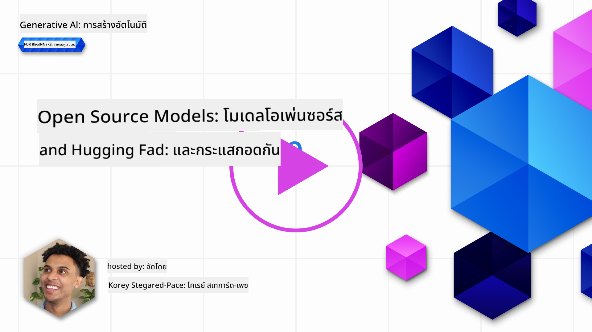
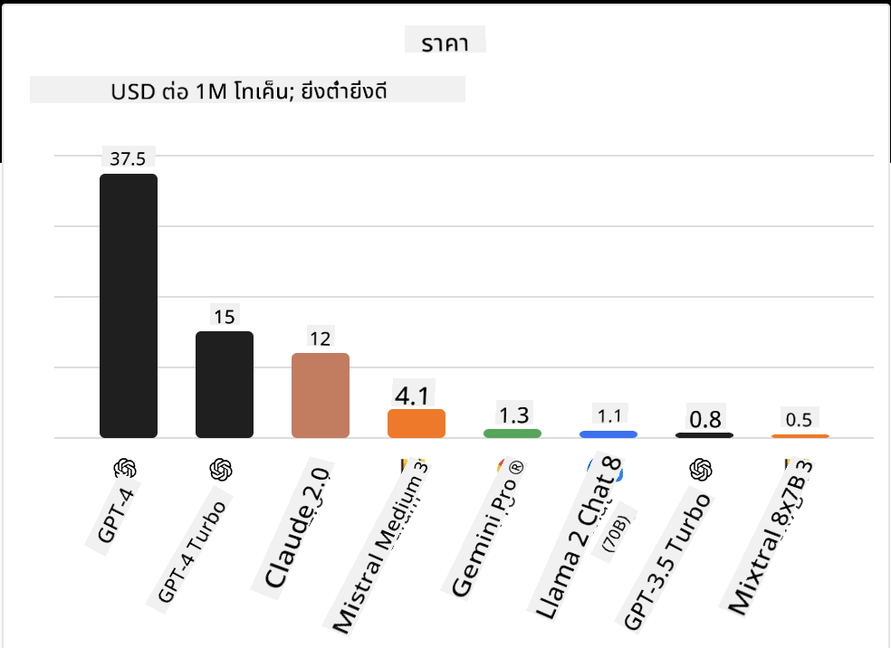
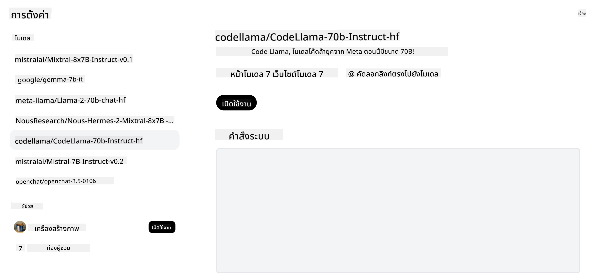
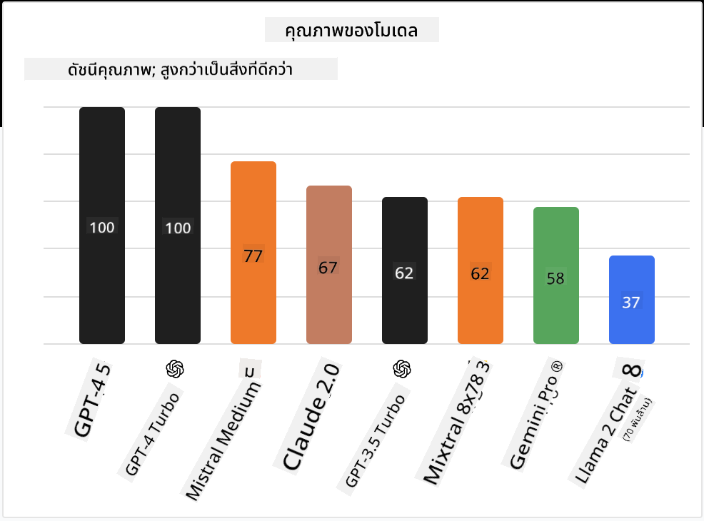

<!--
CO_OP_TRANSLATOR_METADATA:
{
  "original_hash": "0bba96e53ab841d99db731892a51fab8",
  "translation_date": "2025-07-09T17:10:15+00:00",
  "source_file": "16-open-source-models/README.md",
  "language_code": "th"
}
-->

## บทนำ

โลกของ LLM แบบโอเพนซอร์สเป็นสิ่งที่น่าตื่นเต้นและมีการพัฒนาอย่างต่อเนื่อง บทเรียนนี้มีเป้าหมายเพื่อให้ความเข้าใจอย่างลึกซึ้งเกี่ยวกับโมเดลโอเพนซอร์ส หากคุณกำลังมองหาข้อมูลเกี่ยวกับการเปรียบเทียบโมเดลที่เป็นกรรมสิทธิ์กับโมเดลโอเพนซอร์ส ให้ไปที่บทเรียน ["Exploring and Comparing Different LLMs"](../02-exploring-and-comparing-different-llms/README.md?WT.mc_id=academic-105485-koreyst) บทเรียนนี้ยังครอบคลุมหัวข้อการปรับแต่งโมเดล (fine-tuning) แต่คำอธิบายที่ละเอียดกว่าสามารถดูได้ในบทเรียน ["Fine-Tuning LLMs"](../18-fine-tuning/README.md?WT.mc_id=academic-105485-koreyst)

## เป้าหมายการเรียนรู้

- เข้าใจเกี่ยวกับโมเดลโอเพนซอร์ส
- เข้าใจประโยชน์ของการทำงานกับโมเดลโอเพนซอร์ส
- สำรวจโมเดลโอเพนซอร์สที่มีอยู่บน Hugging Face และ Azure AI Studio

## โมเดลโอเพนซอร์สคืออะไร?

ซอฟต์แวร์โอเพนซอร์สมีบทบาทสำคัญในการเติบโตของเทคโนโลยีในหลายสาขา Open Source Initiative (OSI) ได้กำหนด [10 เกณฑ์สำหรับซอฟต์แวร์](https://web.archive.org/web/20241126001143/https://opensource.org/osd?WT.mc_id=academic-105485-koreyst) ที่จะถูกจัดประเภทเป็นโอเพนซอร์ส โดยซอร์สโค้ดต้องถูกเผยแพร่อย่างเปิดเผยภายใต้ใบอนุญาตที่ได้รับการอนุมัติจาก OSI

แม้ว่าการพัฒนา LLM จะมีองค์ประกอบคล้ายกับการพัฒนาซอฟต์แวร์ แต่กระบวนการไม่ได้เหมือนกันทั้งหมด ซึ่งทำให้เกิดการถกเถียงในชุมชนเกี่ยวกับความหมายของโอเพนซอร์สในบริบทของ LLM สำหรับโมเดลที่จะสอดคล้องกับคำนิยามแบบดั้งเดิมของโอเพนซอร์ส ข้อมูลต่อไปนี้ควรเปิดเผยต่อสาธารณะ:

- ชุดข้อมูลที่ใช้ฝึกโมเดล
- น้ำหนักโมเดลเต็มรูปแบบที่ใช้ในการฝึก
- โค้ดสำหรับการประเมินผล
- โค้ดสำหรับการปรับแต่งโมเดล (fine-tuning)
- น้ำหนักโมเดลเต็มรูปแบบและเมตริกการฝึก

ปัจจุบันมีเพียงไม่กี่โมเดลที่ตรงตามเกณฑ์นี้ [โมเดล OLMo ที่สร้างโดย Allen Institute for Artificial Intelligence (AllenAI)](https://huggingface.co/allenai/OLMo-7B?WT.mc_id=academic-105485-koreyst) เป็นหนึ่งในโมเดลที่ตรงตามเกณฑ์นี้

สำหรับบทเรียนนี้ เราจะเรียกโมเดลเหล่านี้ว่า "open models" ต่อไป เนื่องจากอาจจะยังไม่ตรงตามเกณฑ์ข้างต้นในเวลาที่เขียน

## ประโยชน์ของ Open Models

**ปรับแต่งได้สูง** - เนื่องจาก open models ถูกปล่อยออกมาพร้อมข้อมูลการฝึกที่ละเอียด นักวิจัยและนักพัฒนาสามารถแก้ไขส่วนภายในของโมเดลได้ ซึ่งช่วยให้สร้างโมเดลที่มีความเชี่ยวชาญเฉพาะทางและปรับแต่งสำหรับงานหรือสาขาวิชาเฉพาะ ตัวอย่างเช่น การสร้างโค้ด การคำนวณทางคณิตศาสตร์ และชีววิทยา

**ต้นทุน** - ต้นทุนต่อโทเค็นสำหรับการใช้งานและการนำโมเดลเหล่านี้ไปใช้ต่ำกว่าโมเดลที่เป็นกรรมสิทธิ์ เมื่อสร้างแอปพลิเคชัน Generative AI ควรพิจารณาสมดุลระหว่างประสิทธิภาพและราคาเมื่อใช้งานโมเดลเหล่านี้ในกรณีการใช้งานของคุณ

  
ที่มา: Artificial Analysis

**ความยืดหยุ่น** - การทำงานกับ open models ช่วยให้คุณมีความยืดหยุ่นในการใช้โมเดลต่าง ๆ หรือผสมผสานโมเดล ตัวอย่างเช่น [HuggingChat Assistants](https://huggingface.co/chat?WT.mc_id=academic-105485-koreyst) ที่ผู้ใช้สามารถเลือกโมเดลที่ต้องการใช้ได้โดยตรงผ่านอินเทอร์เฟซผู้ใช้:

## การสำรวจโมเดลโอเพนซอร์สต่าง ๆ

### Llama 2

[LLama2](https://huggingface.co/meta-llama?WT.mc_id=academic-105485-koreyst) พัฒนาโดย Meta เป็น open model ที่เหมาะสำหรับแอปพลิเคชันที่เน้นการสนทนา เนื่องจากวิธีการปรับแต่งโมเดลที่รวมข้อมูลบทสนทนาและความคิดเห็นจากมนุษย์จำนวนมาก ด้วยวิธีนี้ โมเดลจึงให้ผลลัพธ์ที่สอดคล้องกับความคาดหวังของมนุษย์มากขึ้น ซึ่งช่วยให้ประสบการณ์ผู้ใช้ดียิ่งขึ้น

ตัวอย่างของเวอร์ชันที่ปรับแต่งแล้วของ Llama ได้แก่ [Japanese Llama](https://huggingface.co/elyza/ELYZA-japanese-Llama-2-7b?WT.mc_id=academic-105485-koreyst) ที่เชี่ยวชาญภาษาญี่ปุ่น และ [Llama Pro](https://huggingface.co/TencentARC/LLaMA-Pro-8B?WT.mc_id=academic-105485-koreyst) ซึ่งเป็นเวอร์ชันที่พัฒนาขึ้นจากโมเดลพื้นฐาน

### Mistral

[Mistral](https://huggingface.co/mistralai?WT.mc_id=academic-105485-koreyst) เป็น open model ที่เน้นประสิทธิภาพและความคุ้มค่าสูง ใช้วิธี Mixture-of-Experts ซึ่งรวมกลุ่มโมเดลผู้เชี่ยวชาญเฉพาะทางหลายตัวเข้าด้วยกัน โดยขึ้นอยู่กับอินพุต โมเดลบางตัวจะถูกเลือกใช้งาน วิธีนี้ช่วยให้การคำนวณมีประสิทธิภาพมากขึ้นเพราะโมเดลจะทำงานเฉพาะกับอินพุตที่ตนเชี่ยวชาญ

ตัวอย่างของเวอร์ชันที่ปรับแต่งแล้วของ Mistral ได้แก่ [BioMistral](https://huggingface.co/BioMistral/BioMistral-7B?text=Mon+nom+est+Thomas+et+mon+principal?WT.mc_id=academic-105485-koreyst) ที่เน้นด้านการแพทย์ และ [OpenMath Mistral](https://huggingface.co/nvidia/OpenMath-Mistral-7B-v0.1-hf?WT.mc_id=academic-105485-koreyst) ที่ทำงานด้านการคำนวณทางคณิตศาสตร์

### Falcon

[Falcon](https://huggingface.co/tiiuae?WT.mc_id=academic-105485-koreyst) เป็น LLM ที่สร้างโดย Technology Innovation Institute (**TII**) Falcon-40B ถูกฝึกด้วยพารามิเตอร์ 40 พันล้านตัว ซึ่งแสดงให้เห็นว่ามีประสิทธิภาพดีกว่า GPT-3 โดยใช้ทรัพยากรคำนวณน้อยกว่า เนื่องจากใช้ FlashAttention algorithm และ multiquery attention ที่ช่วยลดความต้องการหน่วยความจำในช่วงเวลาการประมวลผล ด้วยเวลาประมวลผลที่ลดลงนี้ Falcon-40B จึงเหมาะสำหรับแอปพลิเคชันแชท

ตัวอย่างของเวอร์ชันที่ปรับแต่งแล้วของ Falcon ได้แก่ [OpenAssistant](https://huggingface.co/OpenAssistant/falcon-40b-sft-top1-560?WT.mc_id=academic-105485-koreyst) ผู้ช่วยที่สร้างบนโมเดลโอเพนซอร์ส และ [GPT4ALL](https://huggingface.co/nomic-ai/gpt4all-falcon?WT.mc_id=academic-105485-koreyst) ที่ให้ประสิทธิภาพสูงกว่าโมเดลพื้นฐาน

## วิธีการเลือก

ไม่มีคำตอบเดียวสำหรับการเลือก open model จุดเริ่มต้นที่ดีคือการใช้ฟีเจอร์กรองตามงานใน Azure AI Studio ซึ่งจะช่วยให้คุณเข้าใจประเภทของงานที่โมเดลได้รับการฝึกมา Hugging Face ยังมี LLM Leaderboard ที่แสดงโมเดลที่มีประสิทธิภาพดีที่สุดตามเมตริกต่าง ๆ

เมื่อมองหาการเปรียบเทียบ LLM ในประเภทต่าง ๆ [Artificial Analysis](https://artificialanalysis.ai/?WT.mc_id=academic-105485-koreyst) เป็นแหล่งข้อมูลที่ดีอีกแห่งหนึ่ง:

  
ที่มา: Artificial Analysis

ถ้าคุณทำงานกับกรณีการใช้งานเฉพาะ การค้นหาเวอร์ชันที่ปรับแต่งแล้วซึ่งเน้นในสาขาเดียวกันอาจได้ผลดี การทดลองใช้โมเดลโอเพนซอร์สหลาย ๆ ตัวเพื่อดูว่าทำงานได้ตามความคาดหวังของคุณและผู้ใช้หรือไม่ ก็เป็นแนวทางที่ดีเช่นกัน

## ขั้นตอนถัดไป

ข้อดีอย่างหนึ่งของ open models คือคุณสามารถเริ่มใช้งานได้อย่างรวดเร็ว ลองดู [Azure AI Studio Model Catalog](https://ai.azure.com?WT.mc_id=academic-105485-koreyst) ซึ่งมีคอลเลกชันเฉพาะของ Hugging Face ที่รวบรวมโมเดลที่เราพูดถึงในที่นี้

## การเรียนรู้ไม่ได้หยุดเพียงเท่านี้ เดินหน้าต่อไป

หลังจากจบบทเรียนนี้แล้ว อย่าลืมเข้าไปดู [Generative AI Learning collection](https://aka.ms/genai-collection?WT.mc_id=academic-105485-koreyst) เพื่อพัฒนาความรู้ด้าน Generative AI ของคุณให้ก้าวหน้าต่อไป!

**ข้อจำกัดความรับผิดชอบ**:  
เอกสารนี้ได้รับการแปลโดยใช้บริการแปลภาษาอัตโนมัติ [Co-op Translator](https://github.com/Azure/co-op-translator) แม้เราจะพยายามให้ความถูกต้องสูงสุด แต่โปรดทราบว่าการแปลอัตโนมัติอาจมีข้อผิดพลาดหรือความไม่ถูกต้อง เอกสารต้นฉบับในภาษาต้นทางถือเป็นแหล่งข้อมูลที่เชื่อถือได้ สำหรับข้อมูลที่สำคัญ ขอแนะนำให้ใช้บริการแปลโดยผู้เชี่ยวชาญมนุษย์ เราไม่รับผิดชอบต่อความเข้าใจผิดหรือการตีความผิดใด ๆ ที่เกิดจากการใช้การแปลนี้