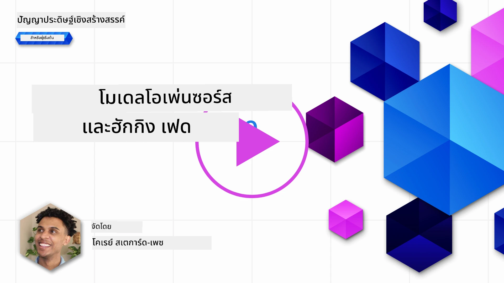
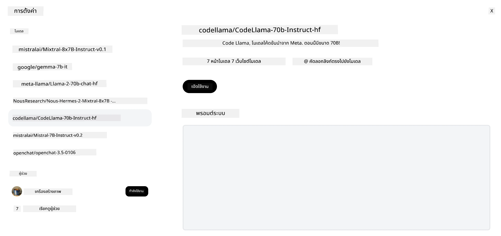
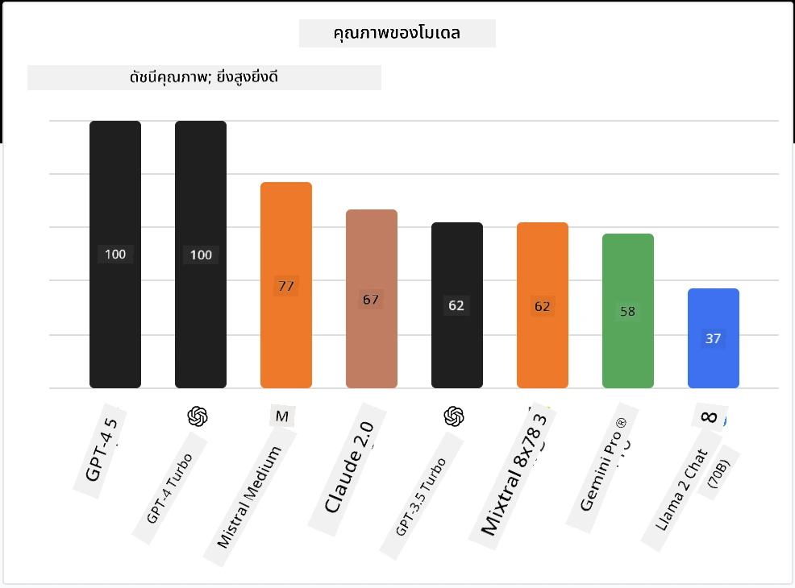

## บทนำ

โลกของ LLMs แบบโอเพ่นซอร์สเป็นเรื่องที่น่าตื่นเต้นและมีการพัฒนาอย่างต่อเนื่อง บทเรียนนี้มีเป้าหมายเพื่อให้ภาพรวมเชิงลึกเกี่ยวกับโมเดลโอเพ่นซอร์ส หากคุณกำลังมองหาข้อมูลเกี่ยวกับการเปรียบเทียบโมเดลแบบกรรมสิทธิ์กับโมเดลโอเพ่นซอร์ส ให้ไปยังบทเรียน ["การสำรวจและเปรียบเทียบ LLMs ต่างๆ"](../02-exploring-and-comparing-different-llms/README.md?WT.mc_id=academic-105485-koreyst) บทเรียนนี้ยังจะครอบคลุมหัวข้อการปรับแต่งแบบละเอียด แต่คำอธิบายที่ละเอียดกว่าสามารถพบได้ในบทเรียน ["การปรับแต่ง LLMs"](../18-fine-tuning/README.md?WT.mc_id=academic-105485-koreyst)

## เป้าหมายการเรียนรู้

- เข้าใจเกี่ยวกับโมเดลโอเพ่นซอร์ส
- เข้าใจประโยชน์ของการทำงานกับโมเดลโอเพ่นซอร์ส
- สำรวจโมเดลโอเพ่นที่มีอยู่บน Hugging Face และแคตตาล็อกโมเดล Microsoft Foundry

## โมเดลโอเพ่นซอร์สคืออะไร?

ซอฟต์แวร์โอเพ่นซอร์สมีบทบาทสำคัญในการเติบโตของเทคโนโลยีในหลายสาขา Open Source Initiative (OSI) ได้กำหนด [10 เกณฑ์สำหรับซอฟต์แวร์](https://web.archive.org/web/20241126001143/https://opensource.org/osd?WT.mc_id=academic-105485-koreyst) เพื่อถูกจัดประเภทเป็นโอเพ่นซอร์ส โดยซอร์สโค้ดต้องถูกแบ่งปันอย่างเปิดเผยภายใต้ใบอนุญาตที่ได้รับการรับรองโดย OSI

แม้ว่าการพัฒนา LLMs จะมีองค์ประกอบคล้ายกับการพัฒนาซอฟต์แวร์ แต่กระบวนการไม่ได้เหมือนกันทั้งหมด เรื่องนี้นำไปสู่การถกเถียงในชุมชนเกี่ยวกับคำนิยามของโอเพ่นซอร์สในบริบทของ LLMs สำหรับโมเดลที่จะสอดคล้องกับคำนิยามแบบดั้งเดิมของโอเพ่นซอร์ส ข้อมูลต่อไปนี้ควรเปิดเผยแก่สาธารณะ:

- ชุดข้อมูลที่ใช้ฝึกโมเดล
- น้ำหนักโมเดลแบบเต็มเป็นส่วนหนึ่งของการฝึก
- รหัสการประเมินผล
- รหัสการปรับแต่งแบบละเอียด
- น้ำหนักโมเดลแบบเต็มและเมตริกการฝึก

ปัจจุบันมีเพียงไม่กี่โมเดลที่ตรงตามเกณฑ์นี้ [โมเดล OLMo ที่สร้างโดย Allen Institute for Artificial Intelligence (AllenAI)](https://huggingface.co/allenai/OLMo-7B?WT.mc_id=academic-105485-koreyst) เป็นหนึ่งในนั้น

สำหรับบทเรียนนี้ เราจะเรียกโมเดลเหล่านี้ว่า "โมเดลเปิด" ต่อไป เนื่องจากอาจไม่ตรงตามเกณฑ์ข้างต้นในเวลาที่เขียน

## ประโยชน์ของโมเดลเปิด

**ปรับแต่งได้สูง** - เนื่องจากโมเดลเปิดถูกปล่อยออกมาพร้อมข้อมูลการฝึกอบรมโดยละเอียด นักวิจัยและนักพัฒนาสามารถปรับเปลี่ยนภายในของโมเดลได้ ซึ่งช่วยให้สร้างโมเดลเฉพาะทางที่ปรับแต่งอย่างละเอียดสำหรับงานหรือสาขาวิชาที่เฉพาะเจาะจง ตัวอย่างเช่น การสร้างโค้ด การคำนวณทางคณิตศาสตร์ และชีววิทยา

**ต้นทุน** - ต้นทุนต่อโทเค็นสำหรับการใช้งานและการนำโมเดลเหล่านี้ไปใช้น้อยกว่าโมเดลแบบกรรมสิทธิ์ เมื่อสร้างแอปพลิเคชัน Generative AI การพิจารณาผลลัพธ์เทียบกับราคาสำหรับกรณีการใช้งานของคุณควรทำ

แหล่งที่มา: Artificial Analysis

**ความยืดหยุ่น** - การทำงานกับโมเดลเปิดช่วยให้คุณยืดหยุ่นในการใช้โมเดลที่แตกต่างกันหรือผสมผสานกัน ตัวอย่างเช่น [HuggingChat Assistants](https://huggingface.co/chat?WT.mc_id=academic-105485-koreyst) ซึ่งผู้ใช้สามารถเลือกโมเดลที่ใช้ได้โดยตรงในอินเทอร์เฟซผู้ใช้:

## สำรวจโมเดลเปิดต่างๆ

### Llama 2

[LLama2](https://huggingface.co/meta-llama?WT.mc_id=academic-105485-koreyst) พัฒนาโดย Meta เป็นโมเดลเปิดที่ปรับแต่งสำหรับแอปแชท ซึ่งเป็นผลมาจากวิธีปรับแต่งที่รวมข้อมูลโต้ตอบจำนวนมากและข้อเสนอแนะจากมนุษย์ วิธีนี้ทำให้โมเดลผลิตผลลัพธ์ที่สอดคล้องกับความคาดหวังของมนุษย์มากขึ้น ซึ่งมอบประสบการณ์ผู้ใช้ที่ดีกว่า

ตัวอย่างเวอร์ชันปรับแต่งของ Llama ได้แก่ [Japanese Llama](https://huggingface.co/elyza/ELYZA-japanese-Llama-2-7b?WT.mc_id=academic-105485-koreyst) ที่เชี่ยวชาญภาษาญี่ปุ่น และ [Llama Pro](https://huggingface.co/TencentARC/LLaMA-Pro-8B?WT.mc_id=academic-105485-koreyst) ซึ่งเป็นเวอร์ชันที่พัฒนาเพิ่มเติมของโมเดลพื้นฐาน

### Mistral

[Mistral](https://huggingface.co/mistralai?WT.mc_id=academic-105485-koreyst) เป็นโมเดลเปิดที่มุ่งเน้นประสิทธิภาพสูงและความมีประสิทธิผล มันใช้วิธี Mixture-of-Experts ซึ่งรวบรวมกลุ่มโมเดลผู้เชี่ยวชาญเฉพาะทางเข้าเป็นระบบเดียว โดยขึ้นอยู่กับอินพุต โมเดลบางตัวจะถูกเลือกใช้งาน วิธีนี้ทำให้การคำนวณมีประสิทธิภาพมากขึ้นเนื่องจากโมเดลจะจัดการเฉพาะอินพุตที่ตนเชี่ยวชาญเท่านั้น

ตัวอย่างของเวอร์ชันปรับแต่งของ Mistral ได้แก่ [BioMistral](https://huggingface.co/BioMistral/BioMistral-7B?text=Mon+nom+est+Thomas+et+mon+principal?WT.mc_id=academic-105485-koreyst) ที่เน้นโดเมนทางการแพทย์ และ [OpenMath Mistral](https://huggingface.co/nvidia/OpenMath-Mistral-7B-v0.1-hf?WT.mc_id=academic-105485-koreyst) ซึ่งทำการคำนวณทางคณิตศาสตร์

### Falcon

[Falcon](https://huggingface.co/tiiuae?WT.mc_id=academic-105485-koreyst) เป็น LLM ที่สร้างโดย Technology Innovation Institute (**TII**) Falcon-40B ถูกฝึกฝนบนพารามิเตอร์ 40 พันล้านพารามิเตอร์ซึ่งแสดงให้เห็นว่าสามารถทำงานได้ดีกว่า GPT-3 โดยใช้ทรัพยากรคำนวณน้อยกว่า เนื่องจากการใช้ FlashAttention และ multiquery attention ซึ่งช่วยลดความต้องการหน่วยความจำในเวลาทำนายผล ด้วยเวลาทำนายที่ลดลงนี้ Falcon-40B จึงเหมาะสำหรับแอปแชท

ตัวอย่างเวอร์ชันปรับแต่งของ Falcon คือ [OpenAssistant](https://huggingface.co/OpenAssistant/falcon-40b-sft-top1-560?WT.mc_id=academic-105485-koreyst) ผู้ช่วยที่สร้างบนโมเดลเปิด และ [GPT4ALL](https://huggingface.co/nomic-ai/gpt4all-falcon?WT.mc_id=academic-105485-koreyst) ซึ่งให้ประสิทธิภาพสูงกว่าโมเดลพื้นฐาน

## วิธีการเลือก

ไม่มีคำตอบที่ตายตัวสำหรับการเลือกโมเดลเปิด จุดเริ่มต้นที่ดีคือการใช้ฟีเจอร์กรองตามงานของแคตตาล็อกโมเดล Microsoft Foundry ซึ่งจะช่วยให้คุณเข้าใจประเภทงานที่โมเดลได้รับการฝึกมา Hugging Face ยังมีตารางจัดอันดับ LLM ที่แสดงโมเดลที่ทำงานได้ดีที่สุดตามเมตริกบางอย่าง

เมื่อมองหาเปรียบเทียบ LLMs ประเภทต่างๆ [Artificial Analysis](https://artificialanalysis.ai/?WT.mc_id=academic-105485-koreyst) เป็นแหล่งข้อมูลที่ดีอีกแห่งหนึ่ง:

แหล่งที่มา: Artificial Analysis

หากทำงานในกรณีใช้งานเฉพาะ การค้นหาเวอร์ชันที่ปรับแต่งซึ่งเน้นไปยังพื้นที่เดียวกันอาจมีประสิทธิภาพ การทดลองใช้โมเดลเปิดหลายๆ ตัวเพื่อดูว่ามันทำงานตามที่คุณและผู้ใช้ของคุณคาดหวังอย่างไร ถือเป็นแนวทางปฏิบัติที่ดีอีกแบบหนึ่ง

## ขั้นตอนถัดไป

สิ่งที่ดีที่สุดของโมเดลเปิดคือคุณสามารถเริ่มใช้งานกับพวกมันได้อย่างรวดเร็ว ตรวจสอบ [แคตตาล็อกโมเดล Microsoft Foundry](https://ai.azure.com?WT.mc_id=academic-105485-koreyst) ซึ่งมีคอลเลกชันเฉพาะบน Hugging Face ที่ประกอบด้วยโมเดลเหล่านี้ที่เราได้พูดถึงที่นี่

## การเรียนรู้ไม่หยุดเพียงเท่านี้ ดำเนินการเดินทางต่อไป

หลังจากเรียนบทเรียนนี้เสร็จแล้ว อย่าลืมเยี่ยมชม [คอลเลกชันการเรียนรู้ Generative AI ของเรา](https://aka.ms/genai-collection?WT.mc_id=academic-105485-koreyst) เพื่อพัฒนาความรู้ Generative AI ของคุณให้ลึกซึ้งยิ่งขึ้น!

---

<!-- CO-OP TRANSLATOR DISCLAIMER START -->
**ปฏิเสธความรับผิดชอบ**:
เอกสารนี้ได้รับการแปลโดยใช้บริการแปลภาษา AI [Co-op Translator](https://github.com/Azure/co-op-translator) ขณะที่เราพยายามให้ความถูกต้อง โปรดทราบว่าการแปลโดยอัตโนมัติอาจมีข้อผิดพลาดหรือความไม่ถูกต้อง เอกสารต้นฉบับในภาษาต้นทางควรถูกพิจารณาเป็นแหล่งข้อมูลที่เชื่อถือได้ สำหรับข้อมูลที่สำคัญ แนะนำให้ใช้การแปลโดยมนุษย์มืออาชีพ เราไม่รับผิดชอบต่อความเข้าใจผิดหรือการตีความที่ผิดพลาดที่เกิดขึ้นจากการใช้การแปลนี้
<!-- CO-OP TRANSLATOR DISCLAIMER END -->