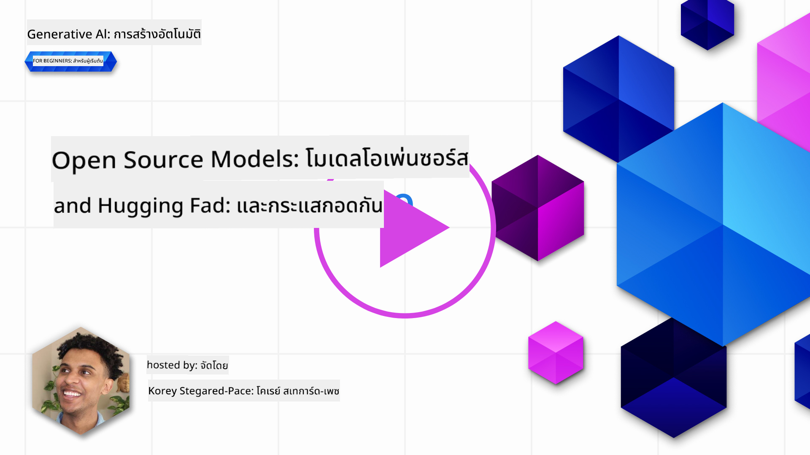
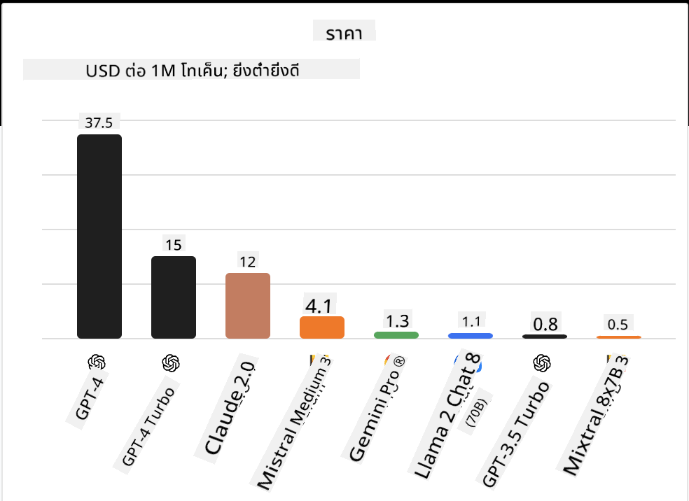
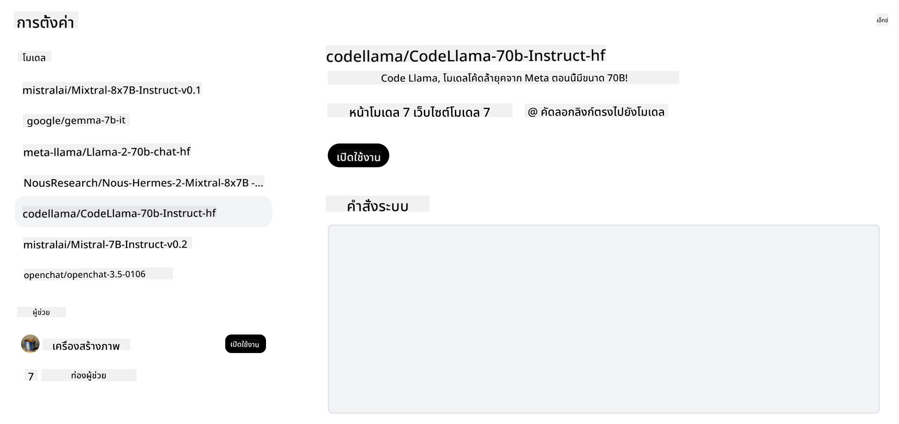
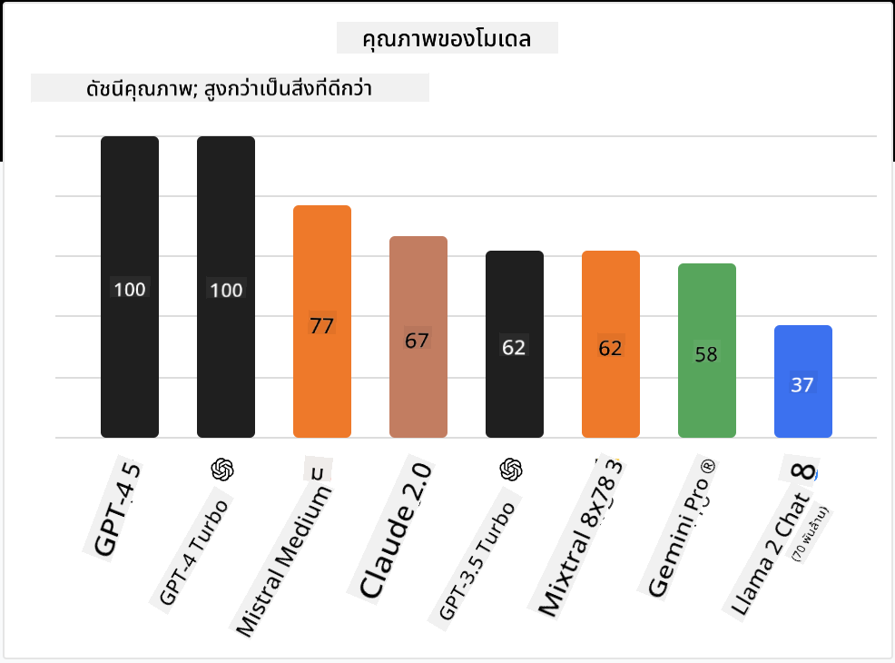

<!--
CO_OP_TRANSLATOR_METADATA:
{
  "original_hash": "0bba96e53ab841d99db731892a51fab8",
  "translation_date": "2025-06-25T23:57:17+00:00",
  "source_file": "16-open-source-models/README.md",
  "language_code": "th"
}
-->

## บทนำ

โลกของ LLMs แบบโอเพ่นซอร์สมีความตื่นเต้นและพัฒนาอยู่ตลอดเวลา บทเรียนนี้มีเป้าหมายที่จะให้ข้อมูลเชิงลึกเกี่ยวกับโมเดลโอเพ่นซอร์ส หากคุณกำลังมองหาข้อมูลเกี่ยวกับการเปรียบเทียบโมเดลที่เป็นกรรมสิทธิ์กับโมเดลโอเพ่นซอร์ส ไปที่บทเรียน ["สำรวจและเปรียบเทียบ LLMs ต่าง ๆ"](../02-exploring-and-comparing-different-llms/README.md?WT.mc_id=academic-105485-koreyst) บทเรียนนี้ยังครอบคลุมหัวข้อการปรับแต่งอย่างละเอียด แต่สามารถหาคำอธิบายเพิ่มเติมได้ในบทเรียน ["การปรับแต่ง LLMs"](../18-fine-tuning/README.md?WT.mc_id=academic-105485-koreyst)

## เป้าหมายการเรียนรู้

- เข้าใจโมเดลโอเพ่นซอร์ส
- เข้าใจประโยชน์ของการทำงานกับโมเดลโอเพ่นซอร์ส
- สำรวจโมเดลโอเพ่นที่มีอยู่ใน Hugging Face และ Azure AI Studio

## โมเดลโอเพ่นซอร์สคืออะไร?

ซอฟต์แวร์โอเพ่นซอร์สมีบทบาทสำคัญในการเติบโตของเทคโนโลยีในหลายสาขา Open Source Initiative (OSI) ได้กำหนด [10 เกณฑ์สำหรับซอฟต์แวร์](https://web.archive.org/web/20241126001143/https://opensource.org/osd?WT.mc_id=academic-105485-koreyst) เพื่อจัดประเภทเป็นโอเพ่นซอร์ส โค้ดต้นฉบับต้องถูกแชร์อย่างเปิดเผยภายใต้ใบอนุญาตที่ได้รับการอนุมัติจาก OSI

แม้ว่าการพัฒนา LLMs จะมีองค์ประกอบที่คล้ายกับการพัฒนาซอฟต์แวร์ แต่กระบวนการไม่เหมือนกันทั้งหมด สิ่งนี้นำมาสู่การอภิปรายมากมายในชุมชนเกี่ยวกับการนิยามโอเพ่นซอร์สในบริบทของ LLMs สำหรับโมเดลที่จะสอดคล้องกับนิยามดั้งเดิมของโอเพ่นซอร์ส ข้อมูลต่อไปนี้ควรถูกเปิดเผยต่อสาธารณะ:

- ชุดข้อมูลที่ใช้ในการฝึกโมเดล
- น้ำหนักโมเดลทั้งหมดเป็นส่วนหนึ่งของการฝึก
- โค้ดการประเมินผล
- โค้ดการปรับแต่ง
- น้ำหนักโมเดลทั้งหมดและเมตริกการฝึก

ปัจจุบันมีเพียงไม่กี่โมเดลที่ตรงตามเกณฑ์นี้ โมเดล [OLMo ที่สร้างโดย Allen Institute for Artificial Intelligence (AllenAI)](https://huggingface.co/allenai/OLMo-7B?WT.mc_id=academic-105485-koreyst) เป็นหนึ่งในนั้น

สำหรับบทเรียนนี้ เราจะเรียกโมเดลว่า "โมเดลโอเพ่น" ต่อไปเนื่องจากอาจไม่ตรงตามเกณฑ์ข้างต้นในเวลาที่เขียน

## ประโยชน์ของโมเดลโอเพ่น

**ปรับแต่งได้สูง** - เนื่องจากโมเดลโอเพ่นถูกปล่อยออกมาพร้อมข้อมูลการฝึกที่ละเอียด นักวิจัยและนักพัฒนาสามารถปรับเปลี่ยนภายในของโมเดลได้ ซึ่งช่วยให้สร้างโมเดลที่มีความเชี่ยวชาญเฉพาะสำหรับงานหรือพื้นที่การศึกษาที่เฉพาะเจาะจง ตัวอย่างบางส่วนคือการสร้างโค้ด การดำเนินการทางคณิตศาสตร์ และชีววิทยา

**ต้นทุน** - ต้นทุนต่อโทเค็นในการใช้และปรับใช้โมเดลเหล่านี้ต่ำกว่าโมเดลที่เป็นกรรมสิทธิ์ เมื่อสร้างแอปพลิเคชัน Generative AI ควรพิจารณาประสิทธิภาพเทียบกับราคาเมื่อทำงานกับโมเดลเหล่านี้ในกรณีการใช้งานของคุณ

แหล่งที่มา: Artificial Analysis

**ความยืดหยุ่น** - การทำงานกับโมเดลโอเพ่นช่วยให้คุณมีความยืดหยุ่นในการใช้โมเดลต่าง ๆ หรือการรวมกัน ตัวอย่างหนึ่งคือ [HuggingChat Assistants](https://huggingface.co/chat?WT.mc_id=academic-105485-koreyst) ที่ผู้ใช้สามารถเลือกโมเดลที่ใช้ได้โดยตรงในอินเทอร์เฟซผู้ใช้:

## การสำรวจโมเดลโอเพ่นต่าง ๆ

### Llama 2

[LLama2](https://huggingface.co/meta-llama?WT.mc_id=academic-105485-koreyst) พัฒนาโดย Meta เป็นโมเดลโอเพ่นที่ได้รับการปรับแต่งสำหรับแอปพลิเคชันที่ใช้การสนทนา ซึ่งเกิดจากวิธีการปรับแต่งที่รวมการสนทนาจำนวนมากและข้อเสนอแนะจากมนุษย์ ด้วยวิธีนี้ โมเดลผลิตผลลัพธ์ที่สอดคล้องกับความคาดหวังของมนุษย์มากขึ้น ซึ่งให้ประสบการณ์ผู้ใช้ที่ดีขึ้น

ตัวอย่างบางส่วนของเวอร์ชันที่ปรับแต่งของ Llama ได้แก่ [Japanese Llama](https://huggingface.co/elyza/ELYZA-japanese-Llama-2-7b?WT.mc_id=academic-105485-koreyst) ซึ่งเชี่ยวชาญในภาษาญี่ปุ่นและ [Llama Pro](https://huggingface.co/TencentARC/LLaMA-Pro-8B?WT.mc_id=academic-105485-koreyst) ซึ่งเป็นเวอร์ชันที่ปรับปรุงจากโมเดลพื้นฐาน

### Mistral

[Mistral](https://huggingface.co/mistralai?WT.mc_id=academic-105485-koreyst) เป็นโมเดลโอเพ่นที่เน้นประสิทธิภาพสูงและความมีประสิทธิภาพ มันใช้วิธี Mixture-of-Experts ซึ่งรวมกลุ่มโมเดลผู้เชี่ยวชาญเฉพาะทางเข้าด้วยกันในระบบเดียวที่ขึ้นอยู่กับการป้อนข้อมูล โมเดลบางส่วนจะถูกเลือกให้ใช้ สิ่งนี้ทำให้การคำนวณมีประสิทธิภาพมากขึ้นเนื่องจากโมเดลจะตอบสนองเฉพาะการป้อนข้อมูลที่พวกเขาเชี่ยวชาญ

ตัวอย่างบางส่วนของเวอร์ชันที่ปรับแต่งของ Mistral ได้แก่ [BioMistral](https://huggingface.co/BioMistral/BioMistral-7B?text=Mon+nom+est+Thomas+et+mon+principal?WT.mc_id=academic-105485-koreyst) ซึ่งเน้นในโดเมนทางการแพทย์และ [OpenMath Mistral](https://huggingface.co/nvidia/OpenMath-Mistral-7B-v0.1-hf?WT.mc_id=academic-105485-koreyst) ซึ่งดำเนินการคำนวณทางคณิตศาสตร์

### Falcon

[Falcon](https://huggingface.co/tiiuae?WT.mc_id=academic-105485-koreyst) เป็น LLM ที่สร้างโดย Technology Innovation Institute (**TII**) Falcon-40B ถูกฝึกด้วยพารามิเตอร์ 40 พันล้าน ซึ่งแสดงให้เห็นว่าทำงานได้ดีกว่า GPT-3 ด้วยงบประมาณการคำนวณที่น้อยกว่า เนื่องจากการใช้แฟลช Attention algorithm และ multiquery attention ที่ช่วยลดความต้องการหน่วยความจำในเวลาอนุมาน ด้วยเวลาอนุมานที่ลดลง Falcon-40B จึงเหมาะสำหรับแอปพลิเคชันการสนทนา

ตัวอย่างบางส่วนของเวอร์ชันที่ปรับแต่งของ Falcon คือ [OpenAssistant](https://huggingface.co/OpenAssistant/falcon-40b-sft-top1-560?WT.mc_id=academic-105485-koreyst) ผู้ช่วยที่สร้างจากโมเดลโอเพ่น และ [GPT4ALL](https://huggingface.co/nomic-ai/gpt4all-falcon?WT.mc_id=academic-105485-koreyst) ซึ่งให้ประสิทธิภาพสูงกว่ามอเดลพื้นฐาน

## วิธีการเลือก

ไม่มีคำตอบเดียวในการเลือกโมเดลโอเพ่น จุดเริ่มต้นที่ดีคือการใช้ฟีเจอร์การกรองตามงานของ Azure AI Studio สิ่งนี้จะช่วยให้คุณเข้าใจว่าประเภทของงานที่โมเดลถูกฝึกมา Hugging Face ยังรักษา LLM Leaderboard ซึ่งแสดงให้คุณเห็นโมเดลที่มีประสิทธิภาพดีที่สุดตามเมตริกบางประการ

เมื่อพิจารณาเปรียบเทียบ LLMs ในประเภทต่าง ๆ [Artificial Analysis](https://artificialanalysis.ai/?WT.mc_id=academic-105485-koreyst) เป็นอีกหนึ่งแหล่งข้อมูลที่ดี:

แหล่งที่มา: Artifical Analysis

หากทำงานในกรณีการใช้งานเฉพาะ การค้นหาเวอร์ชันที่ปรับแต่งที่เน้นในพื้นที่เดียวกันสามารถมีประสิทธิภาพได้ การทดลองใช้โมเดลโอเพ่นหลาย ๆ โมเดลเพื่อดูว่าพวกเขาทำงานตามความคาดหวังของคุณและผู้ใช้ของคุณอย่างไรเป็นอีกหนึ่งวิธีที่ดี

## ขั้นตอนต่อไป

ส่วนที่ดีที่สุดเกี่ยวกับโมเดลโอเพ่นคือคุณสามารถเริ่มทำงานกับพวกเขาได้อย่างรวดเร็ว ดู [Azure AI Studio Model Catalog](https://ai.azure.com?WT.mc_id=academic-105485-koreyst) ซึ่งมีคอลเลกชัน Hugging Face เฉพาะที่มีโมเดลที่เราพูดถึงในที่นี้

## การเรียนรู้ไม่หยุดที่นี่, สานต่อการเดินทาง

หลังจากเสร็จสิ้นบทเรียนนี้ ดูคอลเลกชัน [Generative AI Learning](https://aka.ms/genai-collection?WT.mc_id=academic-105485-koreyst) ของเราเพื่อสานต่อการเพิ่มพูนความรู้ Generative AI ของคุณ!

**ข้อจำกัดความรับผิดชอบ**:  
เอกสารนี้ได้รับการแปลโดยใช้บริการแปลภาษา AI [Co-op Translator](https://github.com/Azure/co-op-translator) แม้ว่าเราจะพยายามให้มีความถูกต้อง แต่โปรดทราบว่าการแปลอัตโนมัติอาจมีข้อผิดพลาดหรือความไม่ถูกต้อง เอกสารต้นฉบับในภาษาต้นฉบับควรถือเป็นแหล่งข้อมูลที่เชื่อถือได้ สำหรับข้อมูลที่สำคัญ ขอแนะนำให้ใช้การแปลโดยมนุษย์มืออาชีพ เราไม่รับผิดชอบต่อความเข้าใจผิดหรือการตีความผิดที่เกิดจากการใช้การแปลนี้