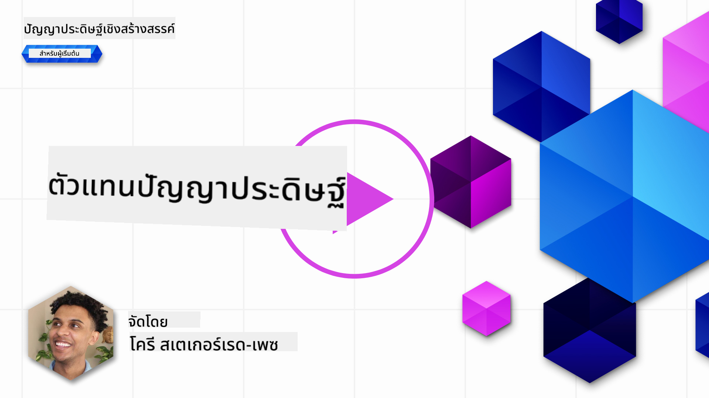
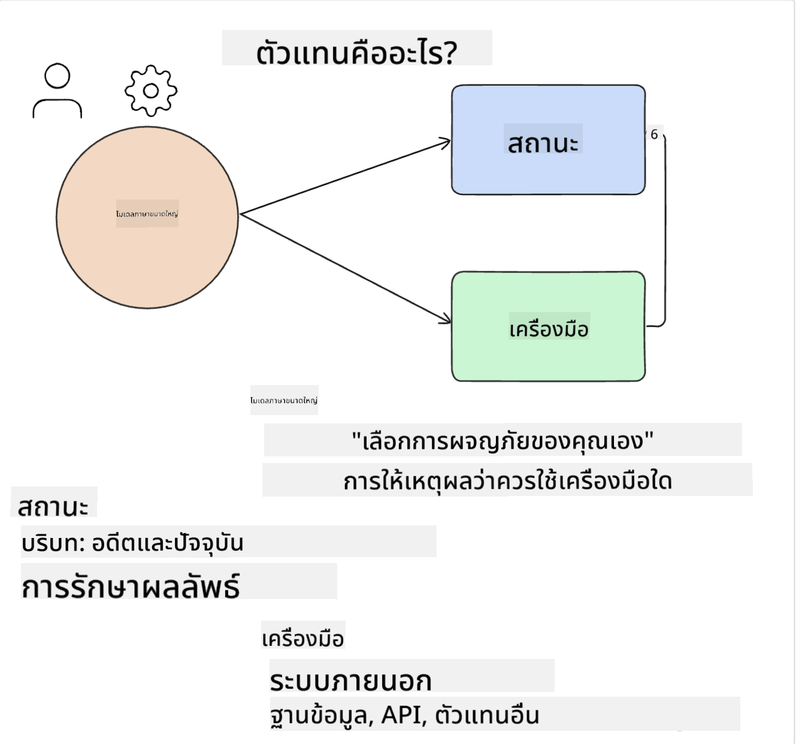
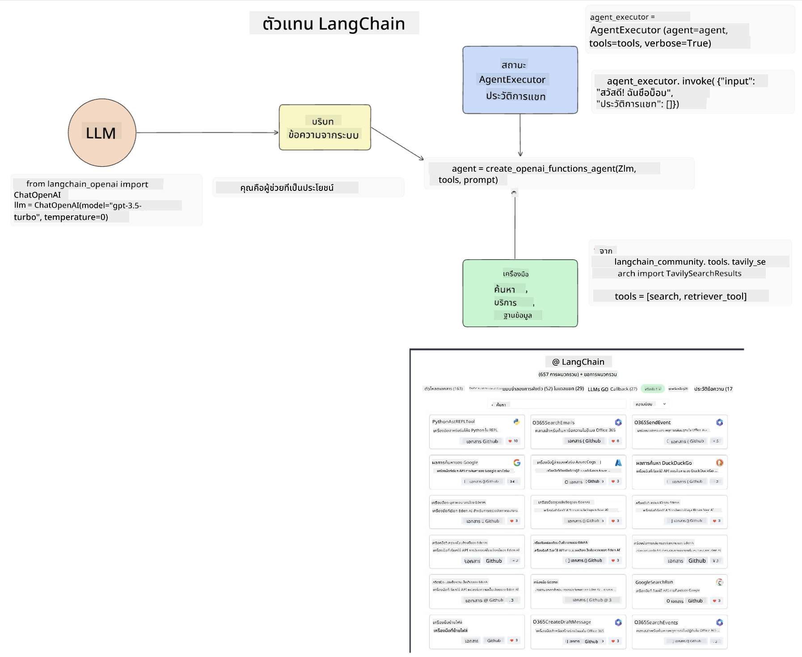
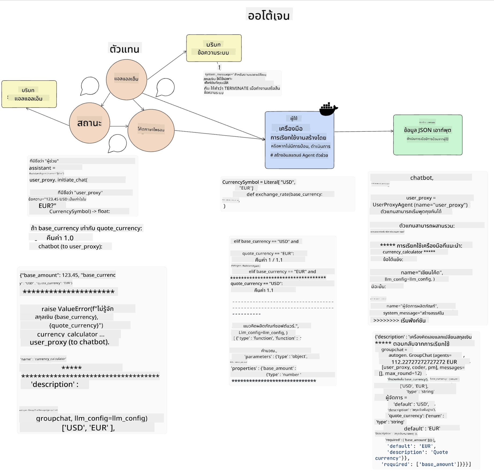
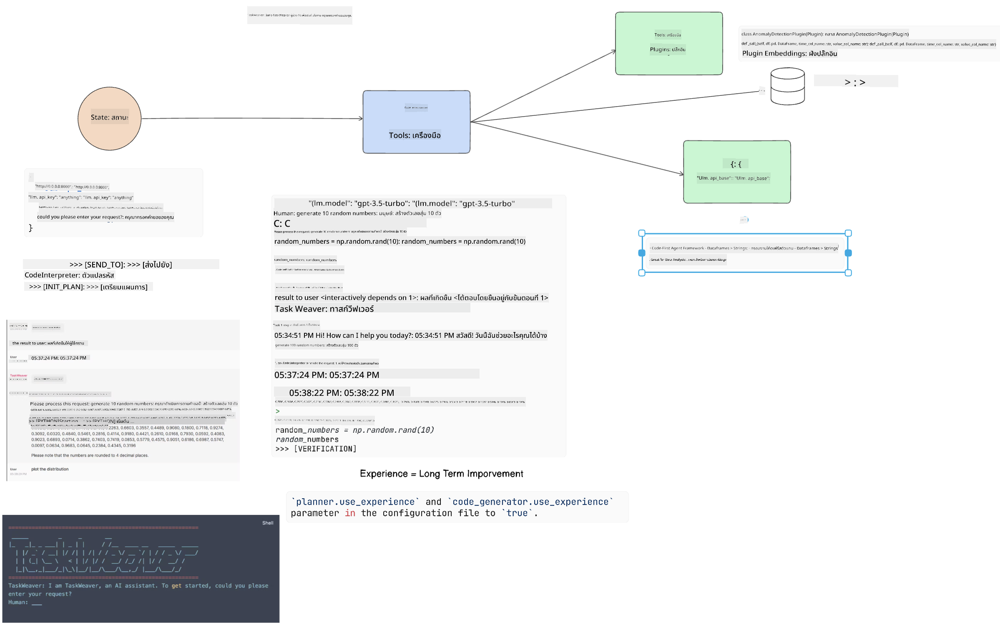
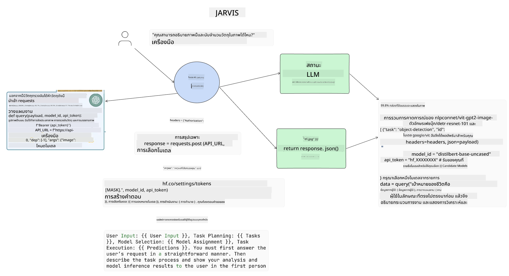

<!--
CO_OP_TRANSLATOR_METADATA:
{
  "original_hash": "11f03c81f190d9cbafd0f977dcbede6c",
  "translation_date": "2025-06-26T00:18:34+00:00",
  "source_file": "17-ai-agents/README.md",
  "language_code": "th"
}
-->
[](https://aka.ms/gen-ai-lesson17-gh?WT.mc_id=academic-105485-koreyst)

## บทนำ

AI Agents เป็นการพัฒนาที่น่าตื่นเต้นใน Generative AI ที่ทำให้ Large Language Models (LLMs) พัฒนาไปจากการเป็นผู้ช่วยเป็นตัวแทนที่สามารถดำเนินการได้ กรอบการทำงานของ AI Agent ช่วยให้นักพัฒนาสร้างแอปพลิเคชันที่ให้ LLMs เข้าถึงเครื่องมือและการจัดการสถานะ กรอบการทำงานเหล่านี้ยังเพิ่มการมองเห็น ทำให้ผู้ใช้และนักพัฒนาสามารถติดตามการดำเนินการที่ LLMs วางแผนไว้ ซึ่งช่วยปรับปรุงการจัดการประสบการณ์

บทเรียนนี้จะครอบคลุมพื้นที่ต่อไปนี้:

- ทำความเข้าใจว่า AI Agent คืออะไร - AI Agent คืออะไร?
- สำรวจกรอบการทำงานของ AI Agent สี่แบบที่แตกต่างกัน - อะไรที่ทำให้พวกเขาแตกต่าง?
- ใช้ AI Agents เหล่านี้ในกรณีการใช้งานต่างๆ - เมื่อไหร่ที่เราควรใช้ AI Agents?

## เป้าหมายการเรียนรู้

หลังจากเรียนบทเรียนนี้ คุณจะสามารถ:

- อธิบายว่า AI Agents คืออะไรและสามารถใช้อย่างไร
- มีความเข้าใจถึงความแตกต่างระหว่างกรอบการทำงานของ AI Agent ที่ได้รับความนิยมบางตัว และวิธีที่พวกเขาแตกต่างกัน
- เข้าใจว่า AI Agents ทำงานอย่างไรเพื่อสร้างแอปพลิเคชันด้วยพวกเขา

## AI Agents คืออะไร?

AI Agents เป็นสาขาที่น่าตื่นเต้นมากในโลกของ Generative AI ความตื่นเต้นนี้บางครั้งมาพร้อมกับความสับสนของคำศัพท์และการใช้งานของพวกเขา เพื่อให้สิ่งต่างๆ ง่ายและรวมถึงเครื่องมือส่วนใหญ่ที่อ้างถึง AI Agents เราจะใช้คำจำกัดความนี้:

AI Agents ช่วยให้ Large Language Models (LLMs) ทำงานโดยให้พวกเขาเข้าถึง **สถานะ** และ **เครื่องมือ**



เรามากำหนดคำเหล่านี้:

**Large Language Models** - เหล่านี้คือโมเดลที่อ้างถึงตลอดหลักสูตรนี้ เช่น GPT-3.5, GPT-4, Llama-2 เป็นต้น

**สถานะ** - หมายถึงบริบทที่ LLM กำลังทำงานอยู่ LLM ใช้บริบทของการกระทำที่ผ่านมาและบริบทปัจจุบัน ช่วยในการตัดสินใจสำหรับการกระทำถัดไป กรอบการทำงานของ AI Agent ช่วยให้นักพัฒนารักษาบริบทนี้ได้ง่ายขึ้น

**เครื่องมือ** - เพื่อทำงานที่ผู้ใช้ร้องขอและที่ LLM วางแผนไว้ LLM จำเป็นต้องเข้าถึงเครื่องมือ ตัวอย่างของเครื่องมือบางอย่างอาจเป็นฐานข้อมูล API แอปพลิเคชันภายนอก หรือแม้กระทั่ง LLM อื่น!

คำจำกัดความเหล่านี้หวังว่าจะให้คุณมีพื้นฐานที่ดีในการเดินหน้าในขณะที่เราดูวิธีการที่พวกเขาถูกนำไปใช้ มาสำรวจกรอบการทำงานของ AI Agent ที่แตกต่างกัน:

## LangChain Agents

[LangChain Agents](https://python.langchain.com/docs/how_to/#agents?WT.mc_id=academic-105485-koreyst) เป็นการนำคำจำกัดความที่เราให้ไว้ข้างต้นไปใช้

เพื่อจัดการ **สถานะ** มันใช้ฟังก์ชันในตัวที่เรียกว่า `AgentExecutor` ซึ่งยอมรับ `agent` ที่กำหนดไว้และ `tools` ที่มีอยู่

`Agent Executor` ยังเก็บประวัติการแชทเพื่อให้บริบทของการแชท



LangChain มี [แคตาล็อกเครื่องมือ](https://integrations.langchain.com/tools?WT.mc_id=academic-105485-koreyst) ที่สามารถนำเข้าไปในแอปพลิเคชันของคุณที่ LLM สามารถเข้าถึงได้ สิ่งเหล่านี้สร้างขึ้นโดยชุมชนและทีม LangChain

คุณสามารถกำหนดเครื่องมือเหล่านี้และส่งต่อไปยัง `Agent Executor`

การมองเห็นเป็นอีกแง่มุมที่สำคัญเมื่อพูดถึง AI Agents เป็นสิ่งสำคัญสำหรับนักพัฒนาแอปพลิเคชันที่จะเข้าใจว่า LLM ใช้เครื่องมือใดและทำไม สำหรับนั้น ทีมที่ LangChain ได้พัฒนา LangSmith

## AutoGen

กรอบการทำงานของ AI Agent ต่อไปที่เราจะพูดถึงคือ [AutoGen](https://microsoft.github.io/autogen/?WT.mc_id=academic-105485-koreyst) จุดสนใจหลักของ AutoGen คือการสนทนา ตัวแทนทั้ง **สามารถสนทนาได้** และ **ปรับแต่งได้**

**สามารถสนทนาได้ -** LLMs สามารถเริ่มและดำเนินการสนทนากับ LLM อื่นเพื่อทำงานให้เสร็จสิ้น สิ่งนี้ทำได้โดยการสร้าง `AssistantAgents` และให้ข้อความระบบเฉพาะ

```python

autogen.AssistantAgent( name="Coder", llm_config=llm_config, ) pm = autogen.AssistantAgent( name="Product_manager", system_message="Creative in software product ideas.", llm_config=llm_config, )

```

**ปรับแต่งได้** - ตัวแทนสามารถกำหนดได้ไม่เพียงแต่เป็น LLM แต่เป็นผู้ใช้หรือเครื่องมือ ในฐานะนักพัฒนา คุณสามารถกำหนด `UserProxyAgent` ซึ่งรับผิดชอบในการโต้ตอบกับผู้ใช้เพื่อรับข้อเสนอแนะในการทำงานให้เสร็จสิ้น ข้อเสนอแนะนี้สามารถดำเนินการต่อการดำเนินการของงานหรือหยุดมันได้

```python
user_proxy = UserProxyAgent(name="user_proxy")
```

### สถานะและเครื่องมือ

เพื่อเปลี่ยนและจัดการสถานะ ผู้ช่วย Agent สร้างโค้ด Python เพื่อทำงานให้เสร็จสิ้น

นี่คือตัวอย่างของกระบวนการ:



#### LLM กำหนดด้วยข้อความระบบ

```python
system_message="For weather related tasks, only use the functions you have been provided with. Reply TERMINATE when the task is done."
```

ข้อความระบบนี้กำหนด LLM เฉพาะนี้ว่าฟังก์ชันใดเกี่ยวข้องกับงานของมัน จำไว้ว่า ด้วย AutoGen คุณสามารถมี AssistantAgents หลายตัวที่กำหนดด้วยข้อความระบบที่แตกต่างกัน

#### การแชทเริ่มต้นโดยผู้ใช้

```python
user_proxy.initiate_chat( chatbot, message="I am planning a trip to NYC next week, can you help me pick out what to wear? ", )

```

ข้อความนี้จาก user_proxy (มนุษย์) คือสิ่งที่จะเริ่มกระบวนการของ Agent ในการสำรวจฟังก์ชันที่เป็นไปได้ที่มันควรดำเนินการ

#### ฟังก์ชันถูกดำเนินการ

```bash
chatbot (to user_proxy):

***** Suggested tool Call: get_weather ***** Arguments: {"location":"New York City, NY","time_periond:"7","temperature_unit":"Celsius"} ******************************************************** --------------------------------------------------------------------------------

>>>>>>>> EXECUTING FUNCTION get_weather... user_proxy (to chatbot): ***** Response from calling function "get_weather" ***** 112.22727272727272 EUR ****************************************************************

```

เมื่อการแชทเริ่มต้นถูกประมวลผล Agent จะส่งเครื่องมือที่แนะนำให้เรียก ในกรณีนี้คือฟังก์ชันที่เรียกว่า `get_weather`. Depending on your configuration, this function can be automatically executed and read by the Agent or can be executed based on user input.

You can find a list of [AutoGen code samples](https://microsoft.github.io/autogen/docs/Examples/?WT.mc_id=academic-105485-koreyst) to further explore how to get started building.

## Taskweaver

The next agent framework we will explore is [Taskweaver](https://microsoft.github.io/TaskWeaver/?WT.mc_id=academic-105485-koreyst). It is known as a "code-first" agent because instead of working strictly with `strings` , it can work with DataFrames in Python. This becomes extremely useful for data analysis and generation tasks. This can be things like creating graphs and charts or generating random numbers.

### State and Tools

To manage the state of the conversation, TaskWeaver uses the concept of a `Planner`. The `Planner` is a LLM that takes the request from the users and maps out the tasks that need to be completed to fulfill this request.

To complete the tasks the `Planner` is exposed to the collection of tools called `Plugins` สิ่งนี้สามารถเป็นคลาส Python หรืออินเตอร์พรีเตอร์โค้ดทั่วไปได้ ปลั๊กอินเหล่านี้ถูกเก็บเป็น embeddings เพื่อให้ LLM สามารถค้นหาปลั๊กอินที่ถูกต้องได้ดีขึ้น



นี่คือตัวอย่างของปลั๊กอินในการจัดการการตรวจจับความผิดปกติ:

```python
class AnomalyDetectionPlugin(Plugin): def __call__(self, df: pd.DataFrame, time_col_name: str, value_col_name: str):
```

โค้ดถูกตรวจสอบก่อนดำเนินการ อีกคุณสมบัติหนึ่งในการจัดการบริบทใน Taskweaver คือ `experience`. Experience allows for the context of a conversation to be stored over to the long term in a YAML file. This can be configured so that the LLM improves over time on certain tasks given that it is exposed to prior conversations.

## JARVIS

The last agent framework we will explore is [JARVIS](https://github.com/microsoft/JARVIS?tab=readme-ov-file?WT.mc_id=academic-105485-koreyst). What makes JARVIS unique is that it uses an LLM to manage the `state` ของการสนทนาและ `tools`เป็นโมเดล AI อื่นๆ แต่ละโมเดล AI เป็นโมเดลเฉพาะที่ดำเนินการงานบางอย่าง เช่น การตรวจจับวัตถุ การถอดความ หรือการสร้างคำอธิบายภาพ



LLM ซึ่งเป็นโมเดลทั่วไป รับคำขอจากผู้ใช้และระบุงานเฉพาะและข้อมูลใดๆ ที่จำเป็นในการทำงานให้เสร็จสิ้น

```python
[{"task": "object-detection", "id": 0, "dep": [-1], "args": {"image": "e1.jpg" }}]
```

LLM จากนั้นจัดรูปแบบคำขอในลักษณะที่โมเดล AI เฉพาะสามารถตีความได้ เช่น JSON เมื่อโมเดล AI ได้ส่งคืนการทำนายตามงาน LLM จะได้รับการตอบกลับ

หากจำเป็นต้องใช้โมเดลหลายตัวในการทำงานให้เสร็จสิ้น มันจะตีความการตอบกลับจากโมเดลเหล่านั้นก่อนที่จะนำพวกมันมารวมกันเพื่อสร้างการตอบกลับไปยังผู้ใช้

ตัวอย่างด้านล่างแสดงวิธีการทำงานนี้เมื่อผู้ใช้ขอคำอธิบายและจำนวนวัตถุในภาพ:

## การมอบหมาย

เพื่อเรียนรู้เพิ่มเติมเกี่ยวกับ AI Agents คุณสามารถสร้างด้วย AutoGen:

- แอปพลิเคชันที่จำลองการประชุมธุรกิจกับแผนกต่างๆ ของการเริ่มต้นการศึกษา
- สร้างข้อความระบบที่นำทาง LLMs ในการเข้าใจบุคคลและลำดับความสำคัญต่างๆ และช่วยให้ผู้ใช้เสนอไอเดียผลิตภัณฑ์ใหม่
- จากนั้น LLM ควรสร้างคำถามติดตามผลจากแต่ละแผนกเพื่อปรับปรุงและปรับปรุงไอเดียผลิตภัณฑ์และการเสนอขาย

## การเรียนรู้ไม่หยุดที่นี่ ดำเนินการต่อการเดินทาง

หลังจากจบบทเรียนนี้ โปรดดู [คอลเลกชันการเรียนรู้ Generative AI](https://aka.ms/genai-collection?WT.mc_id=academic-105485-koreyst) ของเราเพื่อดำเนินการยกระดับความรู้ Generative AI ของคุณต่อไป!

**ข้อจำกัดความรับผิดชอบ**:  
เอกสารนี้ได้รับการแปลโดยใช้บริการแปลภาษา AI [Co-op Translator](https://github.com/Azure/co-op-translator) แม้ว่าเราจะพยายามให้การแปลมีความถูกต้อง แต่โปรดทราบว่าการแปลอัตโนมัติอาจมีข้อผิดพลาดหรือความไม่ถูกต้อง เอกสารต้นฉบับในภาษาต้นฉบับควรถือเป็นแหล่งข้อมูลที่เชื่อถือได้ สำหรับข้อมูลที่สำคัญ แนะนำให้ใช้บริการแปลภาษามนุษย์ที่เป็นมืออาชีพ เราไม่รับผิดชอบต่อความเข้าใจผิดหรือการตีความที่ผิดพลาดที่เกิดจากการใช้การแปลนี้