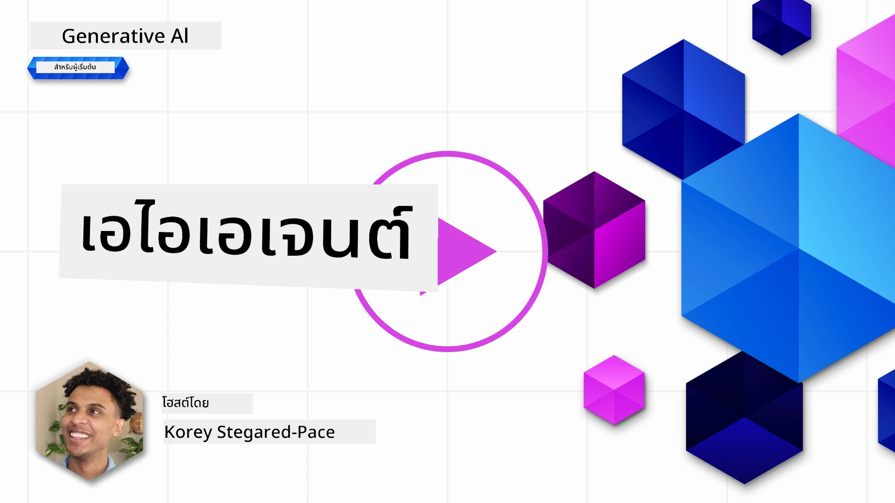
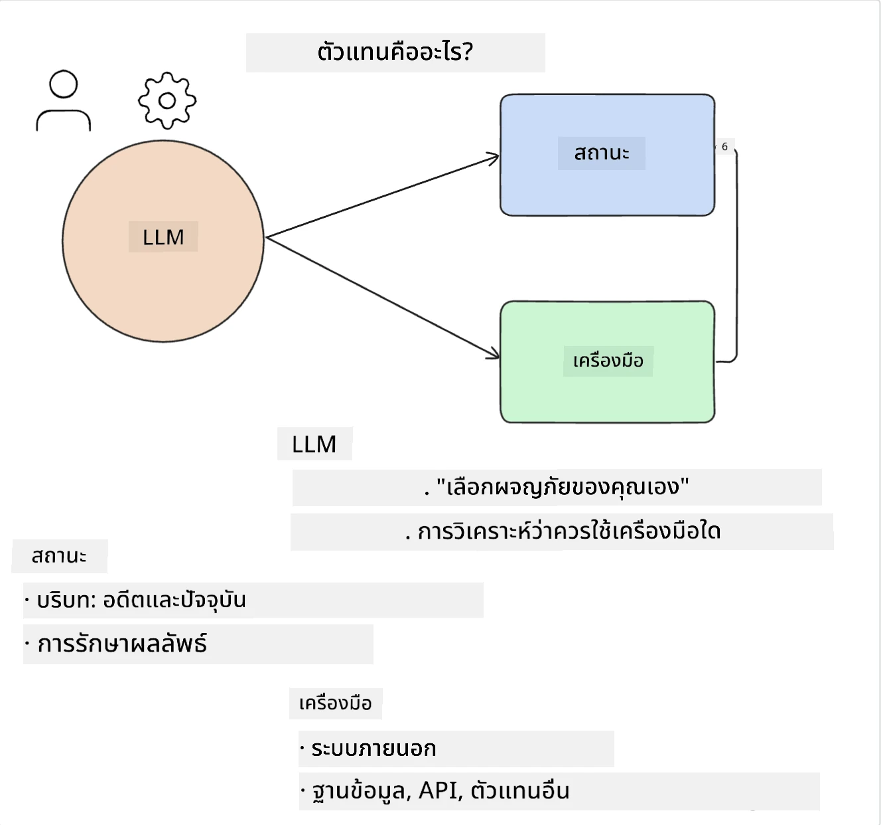
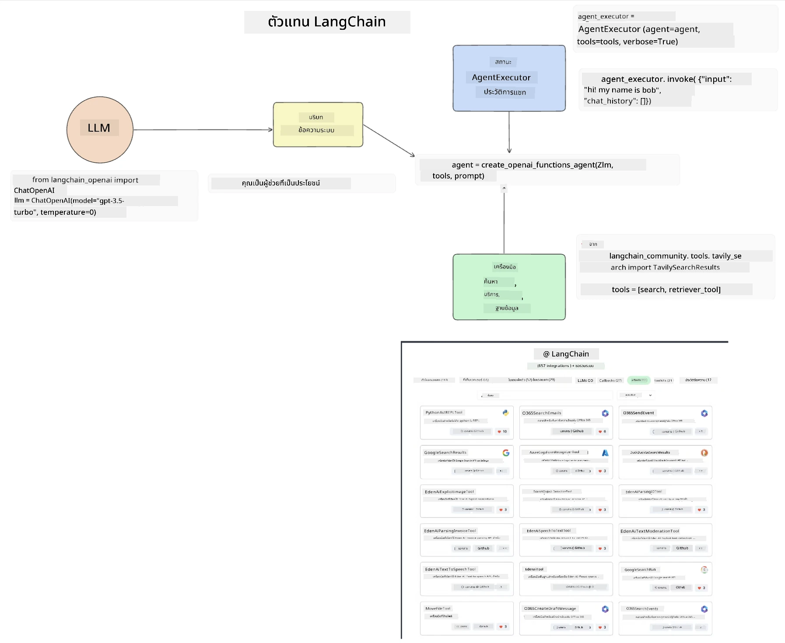
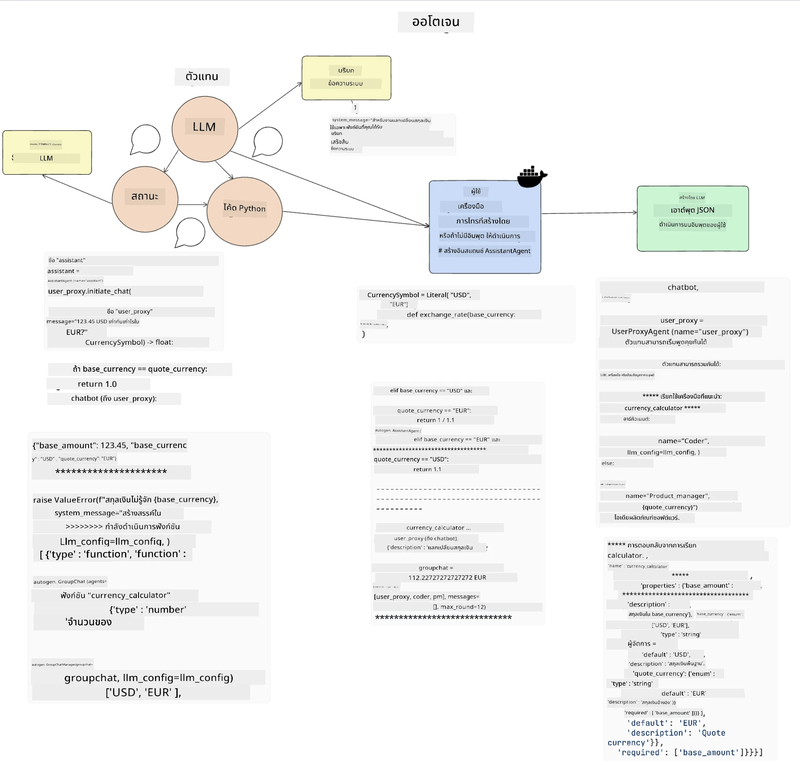
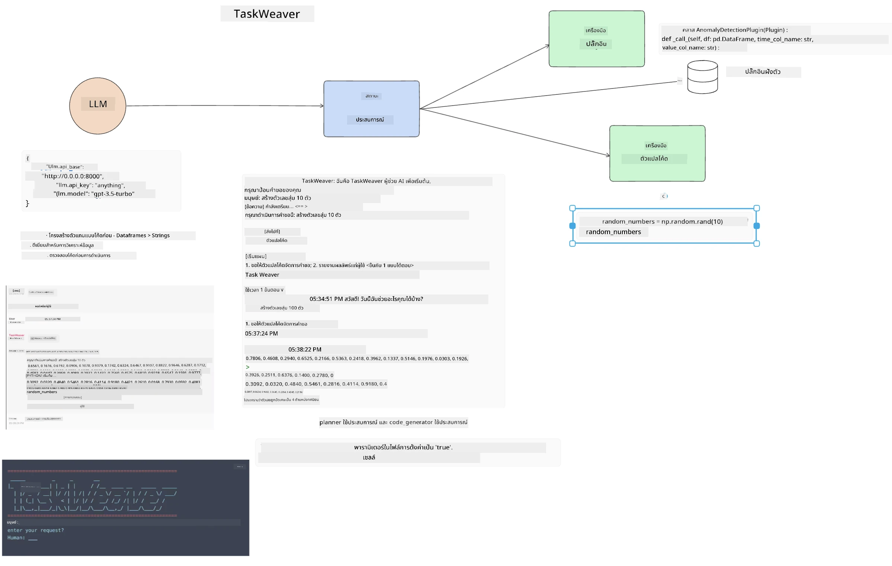
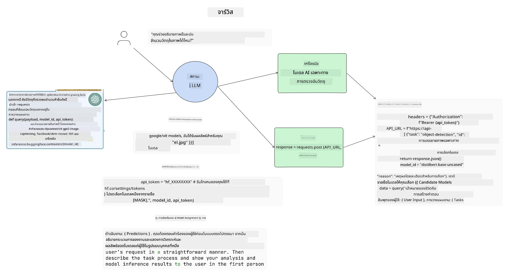

[](https://youtu.be/yAXVW-lUINc?si=bOtW9nL6jc3XJgOM)

## บทนำ

AI Agents เป็นการพัฒนาที่น่าตื่นเต้นใน Generative AI ซึ่งช่วยให้ Large Language Models (LLMs) พัฒนาไปจากการเป็นผู้ช่วยสู่ตัวแทนที่สามารถดำเนินการได้ เครื่องมือเฟรมเวิร์กของ AI Agent ช่วยให้นักพัฒนาสร้างแอปพลิเคชันที่ให้ LLMs เข้าถึงเครื่องมือและการจัดการสถานะ เฟรมเวิร์กเหล่านี้ยังช่วยเพิ่มความโปร่งใส ทำให้ผู้ใช้งานและนักพัฒนาสามารถติดตามการดำเนินการที่ LLMs วางแผนไว้ ซึ่งช่วยปรับปรุงการจัดการประสบการณ์

บทเรียนนี้จะครอบคลุมหัวข้อต่อไปนี้:

- ทำความเข้าใจว่า AI Agent คืออะไร - AI Agent คืออะไร?
- สำรวจสี่เฟรมเวิร์ก AI Agent ต่าง ๆ - อะไรทำให้แต่ละตัวแตกต่าง?
- นำ AI Agents ไปใช้ในกรณีใช้งานที่แตกต่างกัน - เมื่อไรควรใช้ AI Agents?

## เป้าหมายการเรียนรู้

หลังจากเรียนบทนี้ คุณจะสามารถ:

- อธิบายได้ว่า AI Agents คืออะไรและใช้ประโยชน์ได้อย่างไร
- เข้าใจความแตกต่างระหว่างเฟรมเวิร์ก AI Agent ที่ได้รับความนิยมหลายตัว และความแตกต่างระหว่างพวกมัน
- เข้าใจการทำงานของ AI Agents เพื่อสร้างแอปพลิเคชันด้วยพวกมัน

## AI Agents คืออะไร?

AI Agents เป็นสาขาที่น่าตื่นเต้นมากในโลกของ Generative AI ด้วยความตื่นเต้นนี้บางครั้งเกิดความสับสนในคำศัพท์และการใช้งาน เพื่อให้ง่ายและครอบคลุมเครื่องมือส่วนใหญ่ที่อ้างถึง AI Agents เราจะใช้คำนิยามนี้:

AI Agents ช่วยให้ Large Language Models (LLMs) สามารถทำงานโดยการให้พวกเขาเข้าถึง **สถานะ** และ **เครื่องมือ**



มานิยามคำเหล่านี้กัน:

**Large Language Models** - คือโมเดลที่กล่าวถึงตลอดหลักสูตรนี้ เช่น GPT-3.5, GPT-4, Llama-2 เป็นต้น

**สถานะ (State)** - หมายถึงบริบทที่ LLM กำลังทำงานอยู่ LLM ใช้บริบทของการกระทำที่ผ่านมาและบริบทปัจจุบันเพื่อนำทางการตัดสินใจสำหรับการกระทำถัดไป เฟรมเวิร์ก AI Agent ช่วยให้นักพัฒนาจัดการบริบทนี้ได้ง่ายขึ้น

**เครื่องมือ (Tools)** - เพื่อทำงานที่ผู้ใช้ร้องขอและที่ LLM ได้วางแผนไว้ LLM จำเป็นต้องเข้าถึงเครื่องมือ ตัวอย่างเครื่องมืออาจเป็นฐานข้อมูล, API, แอปพลิเคชันภายนอก หรือแม้แต่ LLM อื่น!

คำจำกัดความเหล่านี้จะช่วยให้คุณมีพื้นฐานที่ดีในการต่อยอดเมื่อเรามาดูว่าแต่ละเฟรมเวิร์กเหล่านี้ถูกใช้งานอย่างไร มาสำรวจเฟรมเวิร์ก AI Agent ต่าง ๆ กัน

## LangChain Agents

[LangChain Agents](https://python.langchain.com/docs/how_to/#agents?WT.mc_id=academic-105485-koreyst) เป็นการใช้งานคำนิยามที่เราให้ไว้ข้างต้น

เพื่อจัดการ **สถานะ** มันใช้ฟังก์ชันในตัวที่เรียกว่า `AgentExecutor` ซึ่งรับ `agent` ที่กำหนดและ `tools` ที่มีให้ใช้งาน

`Agent Executor` ยังเก็บประวัติการสนทนาเพื่อให้บริบทของการสนทนา



LangChain มี [แคตตาล็อกของเครื่องมือ](https://integrations.langchain.com/tools?WT.mc_id=academic-105485-koreyst) ที่สามารถนำเข้าในแอปพลิเคชันของคุณเพื่อให้ LLM เข้าถึงได้ เครื่องมือเหล่านี้สร้างโดยชุมชนและทีมงาน LangChain

คุณสามารถกำหนดเครื่องมือเหล่านี้และส่งผ่านไปยัง `Agent Executor`

ความโปร่งใสเป็นอีกแง่มุมสำคัญเมื่อพูดถึง AI Agents นักพัฒนาแอปพลิเคชันจำเป็นต้องเข้าใจว่า LLM ใช้เครื่องมือใดและทำไม สำหรับเรื่องนี้ ทีมงาน LangChain ได้พัฒนา LangSmith

## AutoGen

เฟรมเวิร์ก AI Agent ตัวถัดไปที่เราจะพูดถึงคือ [AutoGen](https://microsoft.github.io/autogen/?WT.mc_id=academic-105485-koreyst) จุดสนใจหลักของ AutoGen คือการสนทนา Agents มีทั้งความสามารถในการ **สนทนา** และ **ปรับแต่งได้**

**สนทนาได้ (Conversable) -** LLMs สามารถเริ่มและดำเนินการสนทนากับ LLM อื่นเพื่อทำงานให้เสร็จ โดยสร้าง `AssistantAgents` และมอบข้อความระบบเฉพาะให้กับพวกมัน

```python

autogen.AssistantAgent( name="Coder", llm_config=llm_config, ) pm = autogen.AssistantAgent( name="Product_manager", system_message="Creative in software product ideas.", llm_config=llm_config, )

```

**ปรับแต่งได้ (Customizable)** - Agents สามารถกำหนดได้ไม่เพียงแค่เป็น LLMs แต่ยังสามารถเป็นผู้ใช้หรือเครื่องมือ ในฐานะนักพัฒนา คุณสามารถกำหนด `UserProxyAgent` ที่รับผิดชอบการโต้ตอบกับผู้ใช้เพื่อรับฟีดแบ็กในการทำงาน ฟีดแบ็กนี้อาจเป็นการดำเนินงานต่อหรือหยุดการดำเนินงาน

```python
user_proxy = UserProxyAgent(name="user_proxy")
```

### สถานะและเครื่องมือ

เพื่อเปลี่ยนและจัดการสถานะ ตัวช่วย Agent สร้างโค้ด Python เพื่อทำงานให้เสร็จ

นี่คือตัวอย่างกระบวนการ:



#### LLM กำหนดพร้อมข้อความระบบ

```python
system_message="For weather related tasks, only use the functions you have been provided with. Reply TERMINATE when the task is done."
```

ข้อความระบบนี้ชี้นำ LLM เฉพาะตัวนี้ว่า ฟังก์ชันใดเกี่ยวข้องกับงานของมัน จำไว้ว่ากับ AutoGen คุณสามารถมีหลาย AssistantAgents กำหนดพร้อมข้อความระบบที่แตกต่างกัน

#### การสนทนาเริ่มโดยผู้ใช้

```python
user_proxy.initiate_chat( chatbot, message="I am planning a trip to NYC next week, can you help me pick out what to wear? ", )

```

ข้อความนี้จาก user_proxy (มนุษย์) จะเป็นตัวเริ่มกระบวนการที่ Agent จะสำรวจฟังก์ชันที่ควรเรียกใช้

#### ฟังก์ชันถูกดำเนินการ

```bash
chatbot (to user_proxy):

***** Suggested tool Call: get_weather ***** Arguments: {"location":"New York City, NY","time_periond:"7","temperature_unit":"Celsius"} ******************************************************** --------------------------------------------------------------------------------

>>>>>>>> EXECUTING FUNCTION get_weather... user_proxy (to chatbot): ***** Response from calling function "get_weather" ***** 112.22727272727272 EUR ****************************************************************

```

เมื่อประมวลผลการสนทนาเริ่มต้นแล้ว Agent จะส่งเครื่องมือที่แนะนำให้เรียก ในกรณีนี้คือฟังก์ชัน `get_weather` ตามการตั้งค่าของคุณ ฟังก์ชันนี้อาจดำเนินการอัตโนมัติและอ่านผลโดย Agent หรือดำเนินการตามอินพุตของผู้ใช้

คุณสามารถดูรายการ [ตัวอย่างโค้ด AutoGen](https://microsoft.github.io/autogen/docs/Examples/?WT.mc_id=academic-105485-koreyst) เพื่อสำรวจเพิ่มเติมว่าเริ่มต้นสร้างอย่างไร

## Taskweaver

เฟรมเวิร์ก agent ตัวถัดไปที่เราจะสำรวจคือ [Taskweaver](https://microsoft.github.io/TaskWeaver/?WT.mc_id=academic-105485-koreyst) มันเป็นที่รู้จักในชื่อ "code-first" agent เพราะแทนที่จะทำงานอย่างเคร่งครัดกับ `strings` มันสามารถทำงานกับ DataFrames ใน Python ซึ่งมีประโยชน์มากสำหรับงานวิเคราะห์และสร้างข้อมูล เช่น การสร้างกราฟและแผนภูมิหรือสร้างตัวเลขสุ่ม

### สถานะและเครื่องมือ

ในการจัดการสถานะของการสนทนา TaskWeaver ใช้แนวคิดของ `Planner` `Planner` คือ LLM ที่รับคำขอจากผู้ใช้และวางแผนงานที่ต้องทำเพื่อให้คำขอนั้นสำเร็จ

เพื่อทำงานให้เสร็จ `Planner` จะได้รับการเปิดเผยเครื่องมือที่เรียกว่า `Plugins` ซึ่งเป็นคลาส Python หรือ interpreter โค้ดทั่วไป ปลั๊กอินเหล่านี้ถูกเก็บเป็น embeddings เพื่อช่วยให้ LLM ค้นหาปลั๊กอินที่ถูกต้องได้ดีขึ้น



นี่คือตัวอย่างปลั๊กอินจัดการการตรวจจับความผิดปกติ:

```python
class AnomalyDetectionPlugin(Plugin): def __call__(self, df: pd.DataFrame, time_col_name: str, value_col_name: str):
```

โค้ดจะถูกตรวจสอบก่อนดำเนินการ อีกฟีเจอร์หนึ่งเพื่อจัดการบริบทใน Taskweaver คือ `experience` Experience ช่วยให้บริบทของการสนทนาเก็บไว้ในระยะยาวเป็นไฟล์ YAML ซึ่งสามารถกำหนดค่าเพื่อให้ LLM พัฒนาขึ้นตามเวลาในงานบางอย่างเมื่อได้รับการสัมผัสกับการสนทนาก่อนหน้า

## JARVIS

เฟรมเวิร์ก agent ตัวสุดท้ายที่เราจะสำรวจคือ [JARVIS](https://github.com/microsoft/JARVIS?tab=readme-ov-file&WT.mc_id=academic-105485-koreyst) สิ่งที่ทำให้ JARVIS โดดเด่นคือมันใช้ LLM ในการจัดการ `สถานะ` ของการสนทนา และ `เครื่องมือ` เป็นโมเดล AI อื่น ๆ โมเดล AI เหล่านี้เป็นโมเดลเฉพาะที่ทำงานอย่างใดอย่างหนึ่ง เช่น การตรวจจับวัตถุ, การถอดเสียง หรือการอธิบายภาพ



LLM ซึ่งเป็นโมเดลทั่วไป รับคำขอจากผู้ใช้และระบุงานเฉพาะและอาร์กิวเมนต์/ข้อมูลที่จำเป็นสำหรับทำงานให้เสร็จ

```python
[{"task": "object-detection", "id": 0, "dep": [-1], "args": {"image": "e1.jpg" }}]
```

LLM จะจัดรูปแบบคำขอในลักษณะที่โมเดล AI เฉพาะสามารถตีความได้ เช่น JSON เมื่อโมเดล AI ส่งผลทำนายตามงาน LLM จะได้รับการตอบสนอง

ถ้าต้องใช้โมเดลหลายตัวในการทำงาน LLM จะตีความผลตอบรับจากโมเดลเหล่านั้นก่อนรวมข้อมูลเพื่อสร้างคำตอบให้ผู้ใช้

ตัวอย่างด้านล่างแสดงการทำงานเมื่อผู้ใช้ร้องขอคำอธิบายและนับจำนวนวัตถุในภาพ

## การบ้าน

เพื่อเรียนรู้เกี่ยวกับ AI Agents ให้ลึกซึ้งขึ้น คุณสามารถสร้างด้วย AutoGen:

- แอปพลิเคชันที่จำลองการประชุมธุรกิจกับฝ่ายต่าง ๆ ของสตาร์ทอัพทางการศึกษาหลากหลายฝ่าย
- สร้างข้อความระบบที่ชี้นำ LLMs ในการเข้าใจบุคลิกและลำดับความสำคัญต่าง ๆ และเปิดโอกาสให้ผู้ใช้เสนอไอเดียสินค้าใหม่
- LLM ควรสร้างคำถามติดตามผลจากแต่ละฝ่ายเพื่อปรับปรุงและพัฒนาไอเดียสินค้า

## การเรียนรู้ไม่หยุดเพียงเท่านี้ ต่อเนื่องเส้นทางของคุณ

หลังจากจบบทเรียนนี้แล้ว ตรวจสอบคอลเลกชัน [การเรียนรู้ Generative AI ของเรา](https://aka.ms/genai-collection?WT.mc_id=academic-105485-koreyst) เพื่อยกระดับความรู้ Generative AI ของคุณให้สูงขึ้น!

---

<!-- CO-OP TRANSLATOR DISCLAIMER START -->
**ข้อจำกัดความรับผิดชอบ**:
เอกสารนี้ได้รับการแปลโดยใช้บริการแปลภาษา AI [Co-op Translator](https://github.com/Azure/co-op-translator) แม้ว่าเราจะพยายามให้มีความถูกต้อง แต่โปรดทราบว่าการแปลโดยอัตโนมัติอาจมีข้อผิดพลาดหรือความไม่ถูกต้อง เอกสารต้นฉบับในภาษาต้นทางถือเป็นแหล่งข้อมูลที่เชื่อถือได้ สำหรับข้อมูลสำคัญแนะนำให้ใช้การแปลโดยมนุษย์มืออาชีพ เราไม่รับผิดชอบต่อความเข้าใจผิดหรือการตีความผิดใด ๆ ที่เกิดจากการใช้การแปลนี้
<!-- CO-OP TRANSLATOR DISCLAIMER END -->