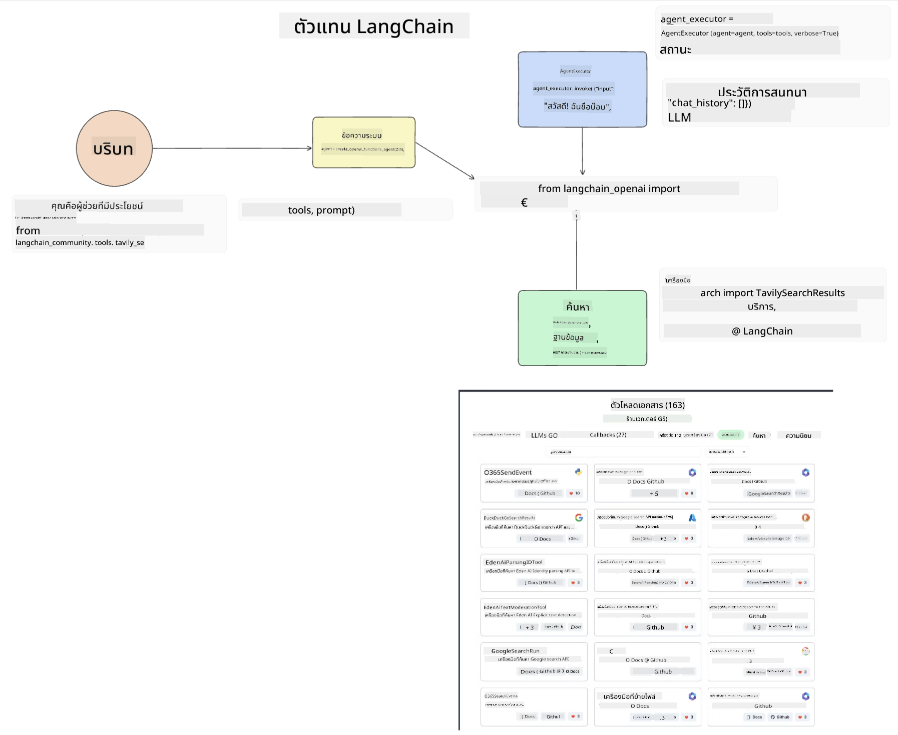
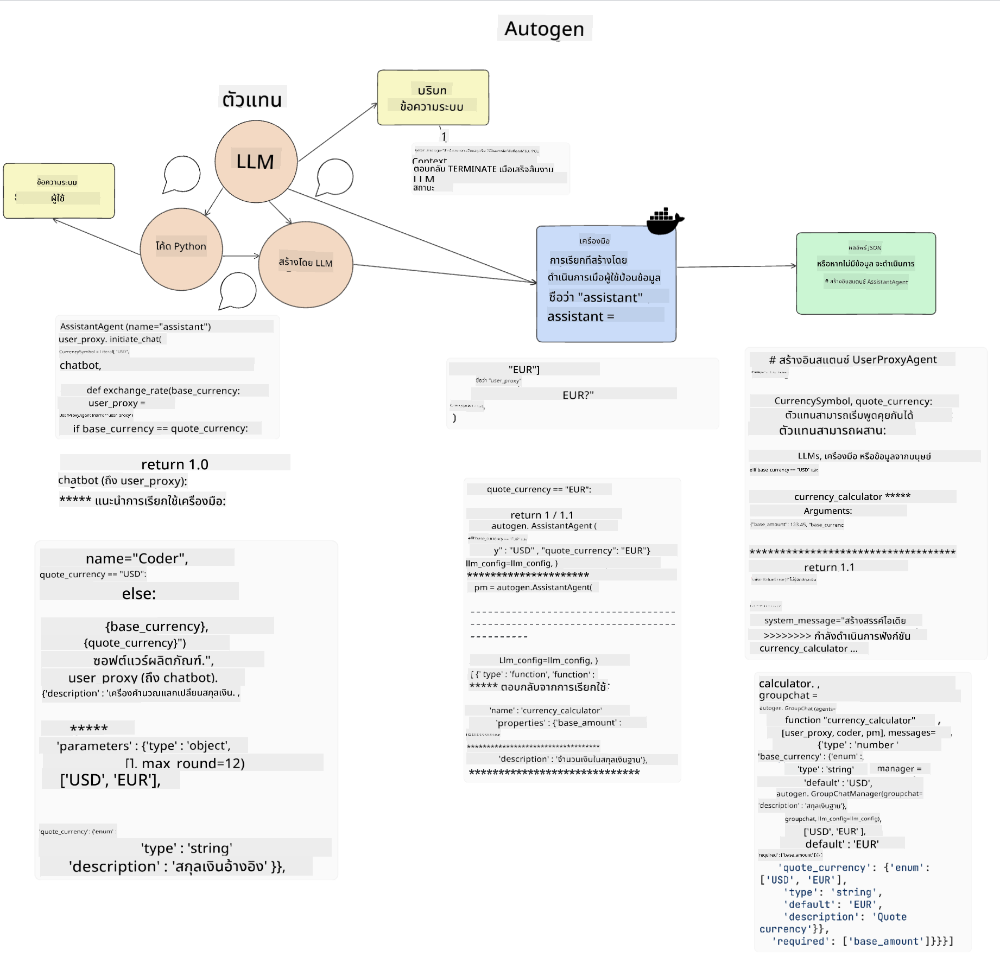
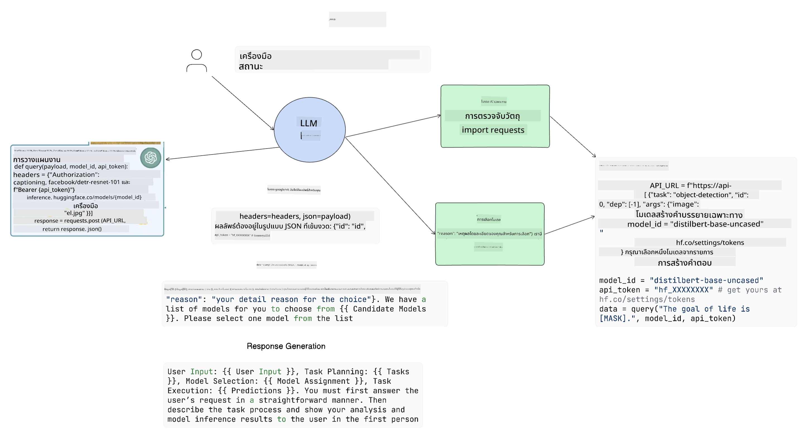

<!--
CO_OP_TRANSLATOR_METADATA:
{
  "original_hash": "11f03c81f190d9cbafd0f977dcbede6c",
  "translation_date": "2025-07-09T17:25:52+00:00",
  "source_file": "17-ai-agents/README.md",
  "language_code": "th"
}
-->
[](https://aka.ms/gen-ai-lesson17-gh?WT.mc_id=academic-105485-koreyst)

## บทนำ

AI Agents เป็นการพัฒนาที่น่าตื่นเต้นใน Generative AI ซึ่งช่วยให้ Large Language Models (LLMs) ก้าวจากการเป็นผู้ช่วยไปสู่การเป็นเอเจนต์ที่สามารถดำเนินการต่างๆ ได้ เฟรมเวิร์กของ AI Agent ช่วยให้นักพัฒนาสร้างแอปพลิเคชันที่ให้ LLMs เข้าถึงเครื่องมือและการจัดการสถานะได้ เฟรมเวิร์กเหล่านี้ยังช่วยเพิ่มความโปร่งใส ทำให้ผู้ใช้และนักพัฒนาสามารถติดตามการกระทำที่ LLMs วางแผนไว้ได้ ซึ่งช่วยปรับปรุงการจัดการประสบการณ์

บทเรียนนี้จะครอบคลุมหัวข้อต่อไปนี้:

- ทำความเข้าใจว่า AI Agent คืออะไร - AI Agent คืออะไรจริงๆ?
- สำรวจเฟรมเวิร์ก AI Agent สี่แบบ - อะไรที่ทำให้แต่ละแบบมีความพิเศษ?
- นำ AI Agents ไปใช้ในกรณีต่างๆ - ควรใช้ AI Agents เมื่อไหร่?

## เป้าหมายการเรียนรู้

หลังจากเรียนบทเรียนนี้ คุณจะสามารถ:

- อธิบายว่า AI Agents คืออะไรและสามารถนำไปใช้ได้อย่างไร
- เข้าใจความแตกต่างระหว่างเฟรมเวิร์ก AI Agent ยอดนิยมบางตัว และความแตกต่างของแต่ละตัว
- เข้าใจการทำงานของ AI Agents เพื่อสร้างแอปพลิเคชันด้วยพวกมัน

## AI Agents คืออะไร?

AI Agents เป็นสาขาที่น่าตื่นเต้นมากในโลกของ Generative AI ความตื่นเต้นนี้บางครั้งก็นำมาซึ่งความสับสนในคำศัพท์และการใช้งาน เพื่อให้ง่ายและครอบคลุมเครื่องมือส่วนใหญ่ที่เรียกว่า AI Agents เราจะใช้คำนิยามนี้:

AI Agents ช่วยให้ Large Language Models (LLMs) สามารถทำงานต่างๆ ได้โดยการให้พวกมันเข้าถึง **สถานะ** และ **เครื่องมือ**


มาทำความหมายของคำเหล่านี้กัน:

**Large Language Models** - คือโมเดลที่กล่าวถึงในคอร์สนี้ เช่น GPT-3.5, GPT-4, Llama-2 เป็นต้น

**สถานะ (State)** - หมายถึงบริบทที่ LLM กำลังทำงานอยู่ LLM ใช้บริบทจากการกระทำที่ผ่านมาและบริบทปัจจุบันเพื่อชี้นำการตัดสินใจสำหรับการกระทำถัดไป เฟรมเวิร์ก AI Agent ช่วยให้นักพัฒนาจัดการบริบทนี้ได้ง่ายขึ้น

**เครื่องมือ (Tools)** - เพื่อทำงานที่ผู้ใช้ร้องขอและที่ LLM วางแผนไว้ LLM จำเป็นต้องเข้าถึงเครื่องมือต่างๆ ตัวอย่างเครื่องมือได้แก่ ฐานข้อมูล, API, แอปพลิเคชันภายนอก หรือแม้แต่ LLM ตัวอื่น!

คำจำกัดความเหล่านี้จะช่วยให้คุณมีพื้นฐานที่ดีเมื่อเราจะดูวิธีการนำไปใช้ มาดูเฟรมเวิร์ก AI Agent ต่างๆ กัน:

## LangChain Agents

[LangChain Agents](https://python.langchain.com/docs/how_to/#agents?WT.mc_id=academic-105485-koreyst) เป็นการนำคำนิยามที่เรากล่าวถึงข้างต้นไปใช้จริง

ในการจัดการ **สถานะ** จะใช้ฟังก์ชันในตัวที่ชื่อ `AgentExecutor` ซึ่งรับ `agent` ที่กำหนดไว้และ `tools` ที่มีให้ใช้งาน

`AgentExecutor` ยังเก็บประวัติการสนทนาเพื่อให้บริบทของการสนทนา



LangChain มี [แคตตาล็อกเครื่องมือ](https://integrations.langchain.com/tools?WT.mc_id=academic-105485-koreyst) ที่สามารถนำเข้าไปในแอปพลิเคชันของคุณเพื่อให้ LLM เข้าถึงได้ เครื่องมือเหล่านี้สร้างโดยชุมชนและทีม LangChain

คุณสามารถกำหนดเครื่องมือเหล่านี้และส่งต่อไปยัง `AgentExecutor`

ความโปร่งใสเป็นอีกประเด็นสำคัญเมื่อพูดถึง AI Agents นักพัฒนาแอปพลิเคชันควรเข้าใจว่า LLM ใช้เครื่องมือใดและเพราะเหตุใด ทีมงาน LangChain จึงพัฒนา LangSmith ขึ้นมาเพื่อช่วยในเรื่องนี้

## AutoGen

เฟรมเวิร์ก AI Agent ถัดไปที่เราจะพูดถึงคือ [AutoGen](https://microsoft.github.io/autogen/?WT.mc_id=academic-105485-koreyst) จุดเน้นหลักของ AutoGen คือการสนทนา Agents มีความสามารถทั้งในการ **สนทนา** และ **ปรับแต่งได้**

**สนทนาได้ (Conversable) -** LLMs สามารถเริ่มและดำเนินการสนทนากับ LLM ตัวอื่นเพื่อทำงานให้เสร็จ โดยการสร้าง `AssistantAgents` และกำหนดข้อความระบบเฉพาะให้กับพวกมัน

```python

autogen.AssistantAgent( name="Coder", llm_config=llm_config, ) pm = autogen.AssistantAgent( name="Product_manager", system_message="Creative in software product ideas.", llm_config=llm_config, )

```

**ปรับแต่งได้ (Customizable)** - Agents ไม่ได้ถูกกำหนดแค่เป็น LLMs เท่านั้น แต่ยังสามารถเป็นผู้ใช้หรือเครื่องมือได้ ในฐานะนักพัฒนา คุณสามารถกำหนด `UserProxyAgent` ที่รับผิดชอบในการโต้ตอบกับผู้ใช้เพื่อรับข้อเสนอแนะในการทำงาน ข้อเสนอแนะนี้อาจทำให้การทำงานดำเนินต่อหรือหยุดลง

```python
user_proxy = UserProxyAgent(name="user_proxy")
```

### สถานะและเครื่องมือ

เพื่อเปลี่ยนแปลงและจัดการสถานะ Agent ผู้ช่วยจะสร้างโค้ด Python เพื่อทำงานให้เสร็จ

นี่คือตัวอย่างของกระบวนการ:



#### กำหนด LLM ด้วยข้อความระบบ

```python
system_message="For weather related tasks, only use the functions you have been provided with. Reply TERMINATE when the task is done."
```

ข้อความระบบนี้ชี้นำ LLM เฉพาะตัวนี้ว่า ฟังก์ชันใดที่เกี่ยวข้องกับงานของมัน จำไว้ว่ากับ AutoGen คุณสามารถมี AssistantAgents หลายตัวที่กำหนดด้วยข้อความระบบต่างกันได้

#### การสนทนาเริ่มต้นโดยผู้ใช้

```python
user_proxy.initiate_chat( chatbot, message="I am planning a trip to NYC next week, can you help me pick out what to wear? ", )

```

ข้อความนี้จาก user_proxy (มนุษย์) จะเป็นตัวเริ่มกระบวนการให้ Agent สำรวจฟังก์ชันที่ควรดำเนินการ

#### ฟังก์ชันถูกเรียกใช้

```bash
chatbot (to user_proxy):

***** Suggested tool Call: get_weather ***** Arguments: {"location":"New York City, NY","time_periond:"7","temperature_unit":"Celsius"} ******************************************************** --------------------------------------------------------------------------------

>>>>>>>> EXECUTING FUNCTION get_weather... user_proxy (to chatbot): ***** Response from calling function "get_weather" ***** 112.22727272727272 EUR ****************************************************************

```

เมื่อการสนทนาเริ่มต้นถูกประมวลผล Agent จะส่งเครื่องมือที่แนะนำให้เรียกใช้ ในกรณีนี้คือฟังก์ชันชื่อ `get_weather` ขึ้นอยู่กับการตั้งค่าของคุณ ฟังก์ชันนี้อาจถูกเรียกใช้อัตโนมัติและอ่านผลโดย Agent หรืออาจรอการป้อนข้อมูลจากผู้ใช้ก่อน

คุณสามารถดูตัวอย่างโค้ด [AutoGen](https://microsoft.github.io/autogen/docs/Examples/?WT.mc_id=academic-105485-koreyst) เพื่อเรียนรู้เพิ่มเติมเกี่ยวกับการเริ่มต้นสร้าง

## Taskweaver

เฟรมเวิร์ก Agent ถัดไปที่เราจะสำรวจคือ [Taskweaver](https://microsoft.github.io/TaskWeaver/?WT.mc_id=academic-105485-koreyst) ซึ่งเป็นที่รู้จักในฐานะ "code-first" agent เพราะแทนที่จะทำงานกับ `strings` อย่างเดียว มันสามารถทำงานกับ DataFrames ใน Python ได้ ซึ่งมีประโยชน์มากสำหรับงานวิเคราะห์ข้อมูลและการสร้างข้อมูล เช่น การสร้างกราฟและแผนภูมิ หรือการสร้างตัวเลขสุ่ม

### สถานะและเครื่องมือ

เพื่อจัดการสถานะของการสนทนา TaskWeaver ใช้แนวคิดของ `Planner` ซึ่งเป็น LLM ที่รับคำขอจากผู้ใช้และวางแผนงานที่ต้องทำเพื่อให้คำขอนั้นสำเร็จ

เพื่อทำงานให้เสร็จ `Planner` จะเข้าถึงชุดเครื่องมือที่เรียกว่า `Plugins` ซึ่งอาจเป็นคลาส Python หรือ interpreter โค้ดทั่วไป ปลั๊กอินเหล่านี้ถูกเก็บเป็น embeddings เพื่อให้ LLM ค้นหาปลั๊กอินที่เหมาะสมได้ดีขึ้น


นี่คือตัวอย่างปลั๊กอินสำหรับตรวจจับความผิดปกติ:

```python
class AnomalyDetectionPlugin(Plugin): def __call__(self, df: pd.DataFrame, time_col_name: str, value_col_name: str):
```

โค้ดจะถูกตรวจสอบก่อนการรัน อีกฟีเจอร์หนึ่งในการจัดการบริบทใน Taskweaver คือ `experience` ซึ่งช่วยเก็บบริบทของการสนทนาในระยะยาวในไฟล์ YAML การตั้งค่านี้ช่วยให้ LLM พัฒนาขึ้นเมื่อเวลาผ่านไปในงานบางอย่างโดยอิงจากการสนทนาก่อนหน้า

## JARVIS

เฟรมเวิร์ก Agent ตัวสุดท้ายที่เราจะสำรวจคือ [JARVIS](https://github.com/microsoft/JARVIS?tab=readme-ov-file?WT.mc_id=academic-105485-koreyst) สิ่งที่ทำให้ JARVIS แตกต่างคือมันใช้ LLM ในการจัดการ `สถานะ` ของการสนทนา และ `tools` คือโมเดล AI อื่นๆ ซึ่งแต่ละโมเดลเป็นโมเดลเฉพาะทางที่ทำงานบางอย่าง เช่น การตรวจจับวัตถุ, การถอดเสียง หรือการบรรยายภาพ



LLM ซึ่งเป็นโมเดลทั่วไป จะรับคำขอจากผู้ใช้และระบุงานเฉพาะและข้อมูล/อาร์กิวเมนต์ที่จำเป็นสำหรับการทำงานนั้น

```python
[{"task": "object-detection", "id": 0, "dep": [-1], "args": {"image": "e1.jpg" }}]
```

จากนั้น LLM จะจัดรูปแบบคำขอให้อยู่ในรูปแบบที่โมเดล AI เฉพาะทางสามารถเข้าใจได้ เช่น JSON เมื่อโมเดล AI ส่งผลลัพธ์กลับมา LLM จะรับข้อมูลตอบกลับนั้น

ถ้าต้องใช้โมเดลหลายตัวในการทำงาน LLM จะตีความผลลัพธ์จากโมเดลเหล่านั้นก่อนนำมารวมกันเพื่อสร้างคำตอบให้ผู้ใช้

ตัวอย่างด้านล่างแสดงการทำงานเมื่อผู้ใช้ขอคำอธิบายและนับจำนวนวัตถุในภาพ:

## การบ้าน

เพื่อเรียนรู้เพิ่มเติมเกี่ยวกับ AI Agents คุณสามารถสร้างด้วย AutoGen:

- แอปพลิเคชันที่จำลองการประชุมธุรกิจกับแผนกต่างๆ ของสตาร์ทอัพด้านการศึกษา
- สร้างข้อความระบบที่ช่วยให้ LLM เข้าใจบุคลิกและลำดับความสำคัญต่างๆ และเปิดโอกาสให้ผู้ใช้เสนอไอเดียผลิตภัณฑ์ใหม่
- LLM ควรสร้างคำถามติดตามจากแต่ละแผนกเพื่อปรับปรุงและพัฒนาไอเดียผลิตภัณฑ์และการนำเสนอ

## การเรียนรู้ไม่ได้หยุดเพียงเท่านี้ เดินหน้าต่อไป

หลังจากเรียนบทเรียนนี้แล้ว อย่าลืมเข้าไปดู [คอลเลกชันการเรียนรู้ Generative AI](https://aka.ms/genai-collection?WT.mc_id=academic-105485-koreyst) ของเราเพื่อพัฒนาความรู้ด้าน Generative AI ของคุณให้ก้าวหน้าไปอีกขั้น!

**ข้อจำกัดความรับผิดชอบ**:  
เอกสารนี้ได้รับการแปลโดยใช้บริการแปลภาษาอัตโนมัติ [Co-op Translator](https://github.com/Azure/co-op-translator) แม้เราจะพยายามให้ความถูกต้องสูงสุด แต่โปรดทราบว่าการแปลอัตโนมัติอาจมีข้อผิดพลาดหรือความไม่ถูกต้อง เอกสารต้นฉบับในภาษาต้นทางถือเป็นแหล่งข้อมูลที่เชื่อถือได้ สำหรับข้อมูลที่สำคัญ ขอแนะนำให้ใช้บริการแปลโดยผู้เชี่ยวชาญมนุษย์ เราไม่รับผิดชอบต่อความเข้าใจผิดหรือการตีความผิดใด ๆ ที่เกิดจากการใช้การแปลนี้