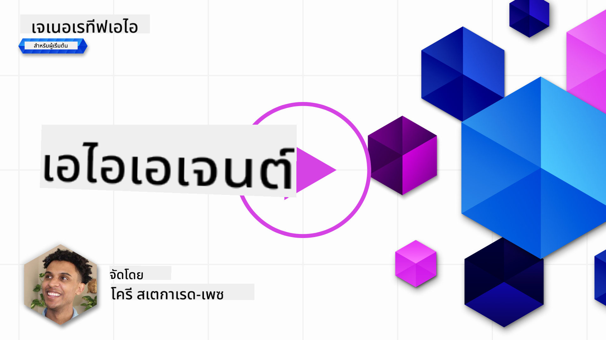

<!--
CO_OP_TRANSLATOR_METADATA:
{
  "original_hash": "8e8d1f6a63da606af7176a87ff8e92b6",
  "translation_date": "2025-10-17T18:43:31+00:00",
  "source_file": "17-ai-agents/README.md",
  "language_code": "th"
}
-->
[](https://youtu.be/yAXVW-lUINc?si=bOtW9nL6jc3XJgOM)

## บทนำ

AI Agents เป็นการพัฒนาที่น่าตื่นเต้นใน Generative AI ซึ่งช่วยให้ Large Language Models (LLMs) พัฒนาไปสู่การเป็นตัวแทนที่สามารถดำเนินการได้ Frameworks ของ AI Agent ช่วยให้นักพัฒนาสามารถสร้างแอปพลิเคชันที่ให้ LLMs เข้าถึงเครื่องมือและการจัดการสถานะได้ Frameworks เหล่านี้ยังช่วยเพิ่มการมองเห็น ทำให้ผู้ใช้และนักพัฒนาสามารถติดตามการดำเนินการที่ LLMs วางแผนไว้ได้ ซึ่งช่วยปรับปรุงการจัดการประสบการณ์

บทเรียนนี้จะครอบคลุมหัวข้อต่อไปนี้:

- ทำความเข้าใจว่า AI Agent คืออะไร - AI Agent คืออะไร?
- สำรวจ Frameworks ของ AI Agent สี่แบบ - อะไรที่ทำให้แต่ละแบบมีเอกลักษณ์?
- การนำ AI Agents ไปใช้ในกรณีการใช้งานต่าง ๆ - เมื่อไหร่ที่เราควรใช้ AI Agents?

## เป้าหมายการเรียนรู้

หลังจากเรียนบทเรียนนี้ คุณจะสามารถ:

- อธิบายว่า AI Agents คืออะไรและสามารถใช้งานได้อย่างไร
- เข้าใจความแตกต่างระหว่าง Frameworks ของ AI Agent ที่ได้รับความนิยม และความแตกต่างระหว่างพวกมัน
- เข้าใจการทำงานของ AI Agents เพื่อสร้างแอปพลิเคชันด้วยพวกมัน

## AI Agents คืออะไร?

AI Agents เป็นสาขาที่น่าตื่นเต้นมากในโลกของ Generative AI ด้วยความตื่นเต้นนี้ บางครั้งอาจเกิดความสับสนเกี่ยวกับคำศัพท์และการใช้งาน เพื่อให้เข้าใจง่ายและครอบคลุมเครื่องมือส่วนใหญ่ที่เกี่ยวข้องกับ AI Agents เราจะใช้คำจำกัดความนี้:

AI Agents ช่วยให้ Large Language Models (LLMs) สามารถทำงานได้โดยให้พวกมันเข้าถึง **สถานะ** และ **เครื่องมือ**


มาทำความเข้าใจคำศัพท์เหล่านี้:

**Large Language Models** - โมเดลเหล่านี้คือโมเดลที่กล่าวถึงในคอร์สนี้ เช่น GPT-3.5, GPT-4, Llama-2 เป็นต้น

**สถานะ** - หมายถึงบริบทที่ LLM กำลังทำงานอยู่ LLM ใช้บริบทของการกระทำที่ผ่านมาและบริบทปัจจุบันเพื่อเป็นแนวทางในการตัดสินใจสำหรับการกระทำต่อไป Frameworks ของ AI Agent ช่วยให้นักพัฒนาสามารถจัดการบริบทนี้ได้ง่ายขึ้น

**เครื่องมือ** - เพื่อทำงานที่ผู้ใช้ร้องขอและที่ LLM วางแผนไว้ LLM จำเป็นต้องเข้าถึงเครื่องมือ ตัวอย่างของเครื่องมือได้แก่ ฐานข้อมูล, API, แอปพลิเคชันภายนอก หรือแม้กระทั่ง LLM อื่น!

คำจำกัดความเหล่านี้หวังว่าจะช่วยให้คุณมีพื้นฐานที่ดีในการดำเนินการต่อไปเมื่อเราดูวิธีการนำไปใช้ มาสำรวจ Frameworks ของ AI Agent ที่แตกต่างกัน:

## LangChain Agents

[LangChain Agents](https://python.langchain.com/docs/how_to/#agents?WT.mc_id=academic-105485-koreyst) เป็นการนำคำจำกัดความที่เราให้ไว้ข้างต้นไปใช้

เพื่อจัดการ **สถานะ** จะใช้ฟังก์ชันในตัวที่เรียกว่า `AgentExecutor` ซึ่งรับ `agent` ที่กำหนดไว้และ `tools` ที่มีให้ใช้งาน

`Agent Executor` ยังเก็บประวัติการสนทนาเพื่อให้บริบทของการสนทนา


LangChain มี [แคตตาล็อกของเครื่องมือ](https://integrations.langchain.com/tools?WT.mc_id=academic-105485-koreyst) ที่สามารถนำเข้าไปในแอปพลิเคชันของคุณเพื่อให้ LLM เข้าถึงได้ เครื่องมือเหล่านี้สร้างโดยชุมชนและทีม LangChain

คุณสามารถกำหนดเครื่องมือเหล่านี้และส่งต่อไปยัง `AgentExecutor`

การมองเห็นเป็นอีกแง่มุมที่สำคัญเมื่อพูดถึง AI Agents การที่นักพัฒนาแอปพลิเคชันเข้าใจว่า LLM กำลังใช้เครื่องมือใดและทำไมจึงสำคัญ สำหรับเรื่องนี้ ทีมที่ LangChain ได้พัฒนา LangSmith

## AutoGen

Frameworks ของ AI Agent ถัดไปที่เราจะพูดถึงคือ [AutoGen](https://microsoft.github.io/autogen/?WT.mc_id=academic-105485-koreyst) จุดเน้นหลักของ AutoGen คือการสนทนา Agents มีทั้ง **สามารถสนทนาได้** และ **ปรับแต่งได้**

**สามารถสนทนาได้ -** LLMs สามารถเริ่มต้นและดำเนินการสนทนากับ LLM อื่นเพื่อทำงานให้เสร็จสิ้น โดยการสร้าง `AssistantAgents` และให้ข้อความระบบเฉพาะ

```python

autogen.AssistantAgent( name="Coder", llm_config=llm_config, ) pm = autogen.AssistantAgent( name="Product_manager", system_message="Creative in software product ideas.", llm_config=llm_config, )

```

**ปรับแต่งได้** - Agents สามารถกำหนดได้ไม่เพียงแค่เป็น LLMs แต่ยังเป็นผู้ใช้หรือเครื่องมือ ในฐานะนักพัฒนา คุณสามารถกำหนด `UserProxyAgent` ซึ่งรับผิดชอบในการโต้ตอบกับผู้ใช้เพื่อให้ข้อเสนอแนะในการทำงานให้เสร็จสมบูรณ์ ข้อเสนอแนะนี้สามารถดำเนินการต่อหรือหยุดการดำเนินการของงานได้

```python
user_proxy = UserProxyAgent(name="user_proxy")
```

### สถานะและเครื่องมือ

เพื่อเปลี่ยนแปลงและจัดการสถานะ Assistant Agent สร้างโค้ด Python เพื่อทำงานให้เสร็จสมบูรณ์

นี่คือตัวอย่างของกระบวนการ:


#### LLM กำหนดด้วยข้อความระบบ

```python
system_message="For weather related tasks, only use the functions you have been provided with. Reply TERMINATE when the task is done."
```

ข้อความระบบนี้กำหนด LLM เฉพาะนี้ให้รู้ว่าฟังก์ชันใดเกี่ยวข้องกับงานของมัน จำไว้ว่า ด้วย AutoGen คุณสามารถมี AssistantAgents ที่กำหนดไว้หลายตัวพร้อมข้อความระบบที่แตกต่างกัน

#### การสนทนาเริ่มต้นโดยผู้ใช้

```python
user_proxy.initiate_chat( chatbot, message="I am planning a trip to NYC next week, can you help me pick out what to wear? ", )

```

ข้อความนี้จาก user_proxy (Human) เป็นสิ่งที่เริ่มกระบวนการของ Agent ในการสำรวจฟังก์ชันที่ควรดำเนินการ

#### ฟังก์ชันถูกดำเนินการ

```bash
chatbot (to user_proxy):

***** Suggested tool Call: get_weather ***** Arguments: {"location":"New York City, NY","time_periond:"7","temperature_unit":"Celsius"} ******************************************************** --------------------------------------------------------------------------------

>>>>>>>> EXECUTING FUNCTION get_weather... user_proxy (to chatbot): ***** Response from calling function "get_weather" ***** 112.22727272727272 EUR ****************************************************************

```

เมื่อการสนทนาเริ่มต้นถูกประมวลผล Agent จะส่งเครื่องมือที่แนะนำให้เรียกใช้ ในกรณีนี้คือฟังก์ชันที่เรียกว่า `get_weather` ขึ้นอยู่กับการตั้งค่าของคุณ ฟังก์ชันนี้สามารถดำเนินการโดยอัตโนมัติและอ่านโดย Agent หรือสามารถดำเนินการตามการป้อนข้อมูลของผู้ใช้

คุณสามารถค้นหารายการ [ตัวอย่างโค้ด AutoGen](https://microsoft.github.io/autogen/docs/Examples/?WT.mc_id=academic-105485-koreyst) เพื่อสำรวจเพิ่มเติมเกี่ยวกับการเริ่มต้นสร้าง

## Taskweaver

Frameworks ของ Agent ถัดไปที่เราจะสำรวจคือ [Taskweaver](https://microsoft.github.io/TaskWeaver/?WT.mc_id=academic-105485-koreyst) ซึ่งเป็นที่รู้จักในฐานะ "agent ที่เน้นโค้ด" เพราะแทนที่จะทำงานกับ `strings` อย่างเดียว มันสามารถทำงานกับ DataFrames ใน Python ได้ สิ่งนี้มีประโยชน์อย่างมากสำหรับงานวิเคราะห์และสร้างข้อมูล เช่น การสร้างกราฟและแผนภูมิ หรือการสร้างตัวเลขสุ่ม

### สถานะและเครื่องมือ

เพื่อจัดการสถานะของการสนทนา TaskWeaver ใช้แนวคิดของ `Planner` `Planner` เป็น LLM ที่รับคำขอจากผู้ใช้และวางแผนงานที่ต้องทำเพื่อให้คำขอนั้นสำเร็จ

เพื่อทำงานให้เสร็จ `Planner` จะเข้าถึงชุดเครื่องมือที่เรียกว่า `Plugins` ซึ่งสามารถเป็นคลาส Python หรือ interpreter โค้ดทั่วไป Plugins เหล่านี้ถูกเก็บเป็น embeddings เพื่อให้ LLM สามารถค้นหา plugin ที่เหมาะสมได้ดียิ่งขึ้น


นี่คือตัวอย่างของ plugin สำหรับจัดการการตรวจจับความผิดปกติ:

```python
class AnomalyDetectionPlugin(Plugin): def __call__(self, df: pd.DataFrame, time_col_name: str, value_col_name: str):
```

โค้ดจะถูกตรวจสอบก่อนดำเนินการ อีกคุณสมบัติหนึ่งในการจัดการบริบทใน Taskweaver คือ `experience` Experience ช่วยให้บริบทของการสนทนาเก็บไว้ในระยะยาวในไฟล์ YAML สิ่งนี้สามารถกำหนดค่าได้เพื่อให้ LLM ปรับปรุงงานบางอย่างเมื่อได้รับการเปิดเผยต่อการสนทนาก่อนหน้า

## JARVIS

Frameworks ของ Agent สุดท้ายที่เราจะสำรวจคือ [JARVIS](https://github.com/microsoft/JARVIS?tab=readme-ov-file?WT.mc_id=academic-105485-koreyst) สิ่งที่ทำให้ JARVIS มีเอกลักษณ์คือการใช้ LLM ในการจัดการ `สถานะ` ของการสนทนา และ `เครื่องมือ` คือโมเดล AI อื่น ๆ แต่ละโมเดล AI เป็นโมเดลเฉพาะที่ทำงานบางอย่าง เช่น การตรวจจับวัตถุ การถอดเสียง หรือการสร้างคำบรรยายภาพ


LLM ซึ่งเป็นโมเดลทั่วไป จะรับคำขอจากผู้ใช้และระบุงานเฉพาะและอาร์กิวเมนต์/ข้อมูลที่จำเป็นในการทำงานให้เสร็จ

```python
[{"task": "object-detection", "id": 0, "dep": [-1], "args": {"image": "e1.jpg" }}]
```

จากนั้น LLM จะจัดรูปแบบคำขอในลักษณะที่โมเดล AI เฉพาะสามารถตีความได้ เช่น JSON เมื่อโมเดล AI ส่งผลลัพธ์กลับมาจากงานที่ทำ LLM จะรับคำตอบนั้น

หากต้องใช้โมเดลหลายตัวในการทำงานให้เสร็จ LLM จะตีความคำตอบจากโมเดลเหล่านั้นก่อนที่จะรวมเข้าด้วยกันเพื่อสร้างคำตอบให้กับผู้ใช้

ตัวอย่างด้านล่างแสดงให้เห็นว่ากระบวนการนี้ทำงานอย่างไรเมื่อผู้ใช้ร้องขอคำอธิบายและจำนวนวัตถุในภาพ:

## งานที่มอบหมาย

เพื่อเรียนรู้เพิ่มเติมเกี่ยวกับ AI Agents คุณสามารถสร้างด้วย AutoGen:

- แอปพลิเคชันที่จำลองการประชุมธุรกิจกับแผนกต่าง ๆ ของสตาร์ทอัพด้านการศึกษา
- สร้างข้อความระบบที่ช่วยให้ LLMs เข้าใจบุคลิกและลำดับความสำคัญที่แตกต่างกัน และช่วยให้ผู้ใช้เสนอไอเดียผลิตภัณฑ์ใหม่
- จากนั้น LLM ควรสร้างคำถามติดตามผลจากแต่ละแผนกเพื่อปรับปรุงและพัฒนาไอเดียผลิตภัณฑ์

## การเรียนรู้ไม่ได้หยุดอยู่แค่นี้ เดินทางต่อไป

หลังจากจบบทเรียนนี้ ลองดู [Generative AI Learning collection](https://aka.ms/genai-collection?WT.mc_id=academic-105485-koreyst) ของเราเพื่อเพิ่มพูนความรู้เกี่ยวกับ Generative AI ของคุณ!

---

**ข้อจำกัดความรับผิดชอบ**:  
เอกสารนี้ได้รับการแปลโดยใช้บริการแปลภาษา AI [Co-op Translator](https://github.com/Azure/co-op-translator) แม้ว่าเราจะพยายามให้การแปลมีความถูกต้อง แต่โปรดทราบว่าการแปลอัตโนมัติอาจมีข้อผิดพลาดหรือความไม่ถูกต้อง เอกสารต้นฉบับในภาษาดั้งเดิมควรถือเป็นแหล่งข้อมูลที่เชื่อถือได้ สำหรับข้อมูลที่สำคัญ ขอแนะนำให้ใช้บริการแปลภาษามืออาชีพ เราไม่รับผิดชอบต่อความเข้าใจผิดหรือการตีความผิดที่เกิดจากการใช้การแปลนี้