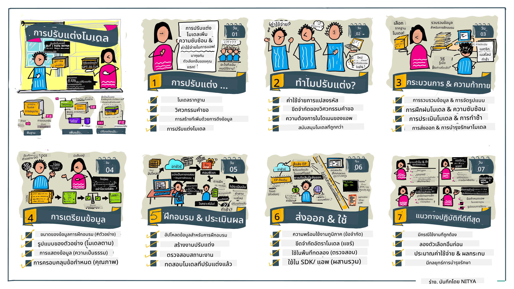

<!--
CO_OP_TRANSLATOR_METADATA:
{
  "original_hash": "68664f7e754a892ae1d8d5e2b7bd2081",
  "translation_date": "2025-07-09T17:43:34+00:00",
  "source_file": "18-fine-tuning/README.md",
  "language_code": "th"
}
-->

# การปรับแต่ง LLM ของคุณ

การใช้โมเดลภาษาขนาดใหญ่เพื่อสร้างแอปพลิเคชัน AI เชิงสร้างสรรค์มาพร้อมกับความท้าทายใหม่ๆ ปัญหาหลักคือการรับประกันคุณภาพของคำตอบ (ความถูกต้องและความเกี่ยวข้อง) ในเนื้อหาที่โมเดลสร้างขึ้นตามคำขอของผู้ใช้ ในบทเรียนก่อนหน้านี้ เราได้พูดถึงเทคนิคต่างๆ เช่น การออกแบบ prompt และการสร้างเนื้อหาโดยเสริมข้อมูลที่ดึงมา ซึ่งพยายามแก้ปัญหานี้โดยการ _ปรับเปลี่ยนข้อมูล prompt_ ที่ป้อนเข้าโมเดลที่มีอยู่แล้ว

ในบทเรียนวันนี้ เราจะพูดถึงเทคนิคที่สาม คือ **การปรับแต่ง (fine-tuning)** ซึ่งพยายามแก้ไขปัญหานี้โดยการ _ฝึกโมเดลใหม่อีกครั้ง_ ด้วยข้อมูลเพิ่มเติม มาดูรายละเอียดกันเลย

## วัตถุประสงค์การเรียนรู้

บทเรียนนี้จะแนะนำแนวคิดของการปรับแต่งสำหรับโมเดลภาษาที่ผ่านการฝึกมาแล้ว สำรวจข้อดีและความท้าทายของวิธีนี้ และให้คำแนะนำเกี่ยวกับเวลาที่ควรใช้และวิธีการปรับแต่งเพื่อเพิ่มประสิทธิภาพของโมเดล AI เชิงสร้างสรรค์ของคุณ

เมื่อจบบทเรียนนี้ คุณจะสามารถตอบคำถามต่อไปนี้ได้:

- การปรับแต่งสำหรับโมเดลภาษา คืออะไร?
- เมื่อไหร่และทำไมการปรับแต่งจึงมีประโยชน์?
- ฉันจะปรับแต่งโมเดลที่ผ่านการฝึกมาแล้วได้อย่างไร?
- ข้อจำกัดของการปรับแต่งมีอะไรบ้าง?

พร้อมแล้วหรือยัง? เริ่มกันเลย

## คู่มือภาพรวม

อยากเห็นภาพรวมของสิ่งที่จะเรียนก่อนลงลึกใช่ไหม? ลองดูคู่มือภาพรวมนี้ที่อธิบายเส้นทางการเรียนรู้สำหรับบทเรียนนี้ — ตั้งแต่การเรียนรู้แนวคิดหลักและแรงจูงใจในการปรับแต่ง ไปจนถึงการเข้าใจกระบวนการและแนวทางปฏิบัติที่ดีที่สุดสำหรับการทำงานปรับแต่ง นี่เป็นหัวข้อที่น่าสนใจมาก อย่าลืมเข้าไปดูที่หน้า [Resources](./RESOURCES.md?WT.mc_id=academic-105485-koreyst) เพื่อหาลิงก์เพิ่มเติมสำหรับสนับสนุนการเรียนรู้ด้วยตนเองของคุณ!

## การปรับแต่งสำหรับโมเดลภาษา คืออะไร?

ตามคำจำกัดความ โมเดลภาษาขนาดใหญ่จะถูก _ฝึกล่วงหน้า_ ด้วยข้อความจำนวนมากจากแหล่งข้อมูลหลากหลายรวมถึงอินเทอร์เน็ต ตามที่เราได้เรียนรู้ในบทเรียนก่อนหน้า เราต้องใช้เทคนิคอย่าง _การออกแบบ prompt_ และ _การสร้างเนื้อหาโดยเสริมข้อมูลที่ดึงมา_ เพื่อปรับปรุงคุณภาพของคำตอบที่โมเดลให้กับคำถามของผู้ใช้ ("prompt")

เทคนิคการออกแบบ prompt ที่ได้รับความนิยมคือการให้คำแนะนำกับโมเดลมากขึ้นเกี่ยวกับสิ่งที่คาดหวังในคำตอบ โดยการให้ _คำสั่ง_ (คำแนะนำชัดเจน) หรือ _ยกตัวอย่างบางส่วน_ (คำแนะนำโดยนัย) เรียกวิธีนี้ว่า _few-shot learning_ แต่ก็มีข้อจำกัดสองประการ:

- ขีดจำกัดจำนวน token ของโมเดลอาจจำกัดจำนวนตัวอย่างที่คุณให้ได้ และลดประสิทธิภาพ
- ค่าใช้จ่ายของ token อาจสูงเมื่อเพิ่มตัวอย่างในทุก prompt และจำกัดความยืดหยุ่น

การปรับแต่งเป็นวิธีปฏิบัติทั่วไปในระบบ machine learning ที่เรานำโมเดลที่ผ่านการฝึกมาแล้วมาฝึกใหม่ด้วยข้อมูลใหม่เพื่อปรับปรุงประสิทธิภาพในงานเฉพาะ ในบริบทของโมเดลภาษา เราสามารถปรับแต่งโมเดลที่ผ่านการฝึกมาแล้ว _ด้วยชุดตัวอย่างที่คัดสรรสำหรับงานหรือโดเมนเฉพาะ_ เพื่อสร้าง **โมเดลเฉพาะทาง** ที่อาจแม่นยำและเกี่ยวข้องมากขึ้นสำหรับงานหรือโดเมนนั้นๆ ผลพลอยได้ของการปรับแต่งคือช่วยลดจำนวนตัวอย่างที่ต้องใช้ใน few-shot learning — ลดการใช้ token และค่าใช้จ่ายที่เกี่ยวข้อง

## เมื่อไหร่และทำไมเราควรปรับแต่งโมเดล?

ใน _บริบทนี้_ เมื่อเราพูดถึงการปรับแต่ง เราหมายถึงการปรับแต่งแบบ **มีผู้ควบคุม (supervised)** ที่ทำโดยการ **เพิ่มข้อมูลใหม่** ที่ไม่ใช่ส่วนหนึ่งของชุดข้อมูลฝึกเดิม ซึ่งแตกต่างจากการปรับแต่งแบบไม่มีผู้ควบคุมที่โมเดลถูกฝึกใหม่บนข้อมูลเดิมแต่ใช้พารามิเตอร์ต่างกัน

สิ่งสำคัญที่ต้องจำคือการปรับแต่งเป็นเทคนิคขั้นสูงที่ต้องการความเชี่ยวชาญระดับหนึ่งเพื่อให้ได้ผลลัพธ์ตามต้องการ หากทำไม่ถูกต้อง อาจไม่ได้ผลลัพธ์ที่คาดหวัง หรืออาจทำให้ประสิทธิภาพของโมเดลในโดเมนเป้าหมายลดลง

ดังนั้น ก่อนที่คุณจะเรียนรู้ "วิธี" ปรับแต่งโมเดลภาษา คุณต้องรู้ "ทำไม" ถึงควรเลือกวิธีนี้ และ "เมื่อไหร่" ที่ควรเริ่มกระบวนการปรับแต่ง เริ่มต้นด้วยการถามตัวเองคำถามเหล่านี้:

- **กรณีการใช้งาน**: กรณีการใช้งานของคุณสำหรับการปรับแต่งคืออะไร? คุณต้องการปรับปรุงด้านใดของโมเดลที่ผ่านการฝึกมาแล้ว?
- **ทางเลือกอื่น**: คุณได้ลอง _เทคนิคอื่นๆ_ เพื่อให้ได้ผลลัพธ์ตามต้องการหรือยัง? ใช้เทคนิคเหล่านั้นเป็นฐานเปรียบเทียบ
  - การออกแบบ prompt: ลองใช้เทคนิค few-shot prompting พร้อมตัวอย่างคำตอบที่เกี่ยวข้อง ประเมินคุณภาพคำตอบ
  - การสร้างเนื้อหาโดยเสริมข้อมูลที่ดึงมา: ลองเสริม prompt ด้วยผลลัพธ์การค้นหาข้อมูลของคุณ ประเมินคุณภาพคำตอบ
- **ค่าใช้จ่าย**: คุณได้ประเมินค่าใช้จ่ายสำหรับการปรับแต่งหรือยัง?
  - ความสามารถในการปรับแต่ง — โมเดลที่ผ่านการฝึกมาแล้วสามารถปรับแต่งได้หรือไม่?
  - ความพยายาม — สำหรับการเตรียมข้อมูลฝึก ประเมินและปรับปรุงโมเดล
  - การประมวลผล — สำหรับการรันงานปรับแต่ง และการนำโมเดลที่ปรับแต่งแล้วไปใช้งาน
  - ข้อมูล — การเข้าถึงตัวอย่างคุณภาพเพียงพอสำหรับผลกระทบของการปรับแต่ง
- **ประโยชน์**: คุณได้ยืนยันประโยชน์ของการปรับแต่งหรือยัง?
  - คุณภาพ — โมเดลที่ปรับแต่งแล้วทำงานดีกว่าฐานหรือไม่?
  - ค่าใช้จ่าย — ช่วยลดการใช้ token โดยทำให้ prompt ง่ายขึ้นหรือไม่?
  - ความยืดหยุ่น — คุณสามารถนำโมเดลฐานไปใช้ในโดเมนใหม่ได้หรือไม่?

เมื่อคุณตอบคำถามเหล่านี้ได้ คุณจะสามารถตัดสินใจได้ว่าการปรับแต่งเป็นวิธีที่เหมาะสมกับกรณีการใช้งานของคุณหรือไม่ โดยทั่วไป วิธีนี้จะเหมาะสมก็ต่อเมื่อประโยชน์มากกว่าค่าใช้จ่าย เมื่อคุณตัดสินใจดำเนินการแล้ว ก็ถึงเวลาคิดว่า _จะปรับแต่งโมเดลที่ผ่านการฝึกมาแล้วอย่างไร_

อยากได้ข้อมูลเชิงลึกเพิ่มเติมเกี่ยวกับกระบวนการตัดสินใจไหม? ชม [To fine-tune or not to fine-tune](https://www.youtube.com/watch?v=0Jo-z-MFxJs)

## เราจะปรับแต่งโมเดลที่ผ่านการฝึกมาแล้วได้อย่างไร?

ในการปรับแต่งโมเดลที่ผ่านการฝึกมาแล้ว คุณต้องมี:

- โมเดลที่ผ่านการฝึกมาแล้วเพื่อปรับแต่ง
- ชุดข้อมูลสำหรับใช้ในการปรับแต่ง
- สภาพแวดล้อมสำหรับรันงานปรับแต่ง
- สภาพแวดล้อมสำหรับนำโมเดลที่ปรับแต่งแล้วไปใช้งาน

## การปรับแต่งในทางปฏิบัติ

แหล่งข้อมูลต่อไปนี้มีบทเรียนทีละขั้นตอนเพื่อพาคุณผ่านตัวอย่างจริงโดยใช้โมเดลที่เลือกพร้อมชุดข้อมูลที่คัดสรร สำหรับทำตามบทเรียนเหล่านี้ คุณต้องมีบัญชีกับผู้ให้บริการนั้นๆ พร้อมทั้งเข้าถึงโมเดลและชุดข้อมูลที่เกี่ยวข้อง

| ผู้ให้บริการ | บทเรียน                                                                                                                                                                      | คำอธิบาย                                                                                                                                                                                                                                                                                                                                                                                                                         |
| ------------- | ----------------------------------------------------------------------------------------------------------------------------------------------------------------------------- | --------------------------------------------------------------------------------------------------------------------------------------------------------------------------------------------------------------------------------------------------------------------------------------------------------------------------------------------------------------------------------------------------------------------------------- |
| OpenAI        | [How to fine-tune chat models](https://github.com/openai/openai-cookbook/blob/main/examples/How_to_finetune_chat_models.ipynb?WT.mc_id=academic-105485-koreyst)                | เรียนรู้การปรับแต่ง `gpt-35-turbo` สำหรับโดเมนเฉพาะ ("ผู้ช่วยสูตรอาหาร") โดยเตรียมข้อมูลฝึก รันงานปรับแต่ง และใช้โมเดลที่ปรับแต่งแล้วสำหรับการทำนาย                                                                                                                                                                                                                                                                            |
| Azure OpenAI  | [GPT 3.5 Turbo fine-tuning tutorial](https://learn.microsoft.com/azure/ai-services/openai/tutorials/fine-tune?tabs=python-new%2Ccommand-line?WT.mc_id=academic-105485-koreyst) | เรียนรู้การปรับแต่งโมเดล `gpt-35-turbo-0613` **บน Azure** โดยทำตามขั้นตอนสร้างและอัปโหลดข้อมูลฝึก รันงานปรับแต่ง และนำโมเดลใหม่ไปใช้งาน                                                                                                                                                                                                                                                                                      |
| Hugging Face  | [Fine-tuning LLMs with Hugging Face](https://www.philschmid.de/fine-tune-llms-in-2024-with-trl?WT.mc_id=academic-105485-koreyst)                                               | บทความนี้สอนการปรับแต่ง _open LLM_ (เช่น `CodeLlama 7B`) โดยใช้ไลบรารี [transformers](https://huggingface.co/docs/transformers/index?WT.mc_id=academic-105485-koreyst) และ [Transformer Reinforcement Learning (TRL)](https://huggingface.co/docs/trl/index?WT.mc_id=academic-105485-koreyst) พร้อมชุดข้อมูลเปิดบน Hugging Face                                                                                                         |
|               |                                                                                                                                                                               |                                                                                                                                                                                                                                                                                                                                                                                                                                   |
| 🤗 AutoTrain  | [Fine-tuning LLMs with AutoTrain](https://github.com/huggingface/autotrain-advanced/?WT.mc_id=academic-105485-koreyst)                                                         | AutoTrain (หรือ AutoTrain Advanced) เป็นไลบรารี Python ที่พัฒนาโดย Hugging Face ช่วยให้ปรับแต่งงานหลายประเภทรวมถึงการปรับแต่ง LLM ได้ AutoTrain เป็นโซลูชันแบบไม่ต้องเขียนโค้ด และสามารถปรับแต่งได้ทั้งบนคลาวด์ของคุณเอง, Hugging Face Spaces หรือเครื่องของคุณเอง รองรับทั้ง GUI บนเว็บ, CLI และการฝึกผ่านไฟล์ config แบบ yaml                                                                                          |
|               |                                                                                                                                                                               |                                                                                                                                                                                                                                                                                                                                                                                                                                   |

## การบ้าน

เลือกบทเรียนหนึ่งในข้างต้นและทำตามขั้นตอน _เราอาจทำซ้ำเวอร์ชันของบทเรียนเหล่านี้ใน Jupyter Notebooks ใน repo นี้เพื่อเป็นข้อมูลอ้างอิงเท่านั้น โปรดใช้แหล่งข้อมูลต้นฉบับโดยตรงเพื่อให้ได้เวอร์ชันล่าสุด_

## ทำได้ดีมาก! เรียนรู้ต่อไป

หลังจากจบบทเรียนนี้แล้ว อย่าลืมเข้าไปดู [คอลเลกชันการเรียนรู้ Generative AI](https://aka.ms/genai-collection?WT.mc_id=academic-105485-koreyst) เพื่อพัฒนาความรู้ด้าน Generative AI ของคุณต่อไป!

ขอแสดงความยินดี!! คุณได้จบบทเรียนสุดท้ายของชุด v2 สำหรับคอร์สนี้แล้ว อย่าหยุดเรียนรู้และสร้างสรรค์ \*\*อย่าลืมดูที่หน้า [RESOURCES](RESOURCES.md?WT.mc_id=academic-105485-koreyst) สำหรับรายการคำแนะนำเพิ่มเติมเฉพาะหัวข้อนี้

ชุดบทเรียน v1 ของเราก็ได้รับการอัปเดตด้วยการบ้านและแนวคิดเพิ่มเติมเช่นกัน ใช้เวลาสักครู่เพื่อทบทวนความรู้ของคุณ — และโปรด [ส่งคำถามและข้อเสนอแนะของคุณ](https://github.com/microsoft/generative-ai-for-beginners/issues?WT.mc_id=academic-105485-koreyst) เพื่อช่วยเราปรับปรุงบทเรียนเหล่านี้สำหรับชุมชนต่อไป

**ข้อจำกัดความรับผิดชอบ**:  
เอกสารนี้ได้รับการแปลโดยใช้บริการแปลภาษาอัตโนมัติ [Co-op Translator](https://github.com/Azure/co-op-translator) แม้เราจะพยายามให้ความถูกต้องสูงสุด แต่โปรดทราบว่าการแปลอัตโนมัติอาจมีข้อผิดพลาดหรือความไม่ถูกต้อง เอกสารต้นฉบับในภาษาต้นทางถือเป็นแหล่งข้อมูลที่เชื่อถือได้ สำหรับข้อมูลที่สำคัญ ขอแนะนำให้ใช้บริการแปลโดยผู้เชี่ยวชาญมนุษย์ เราไม่รับผิดชอบต่อความเข้าใจผิดหรือการตีความผิดที่เกิดขึ้นจากการใช้การแปลนี้