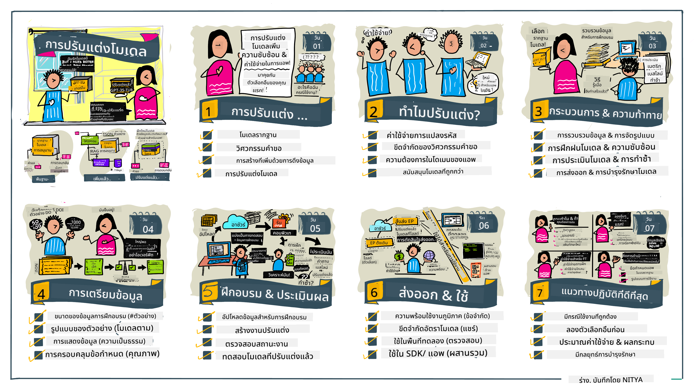

<!--
CO_OP_TRANSLATOR_METADATA:
{
  "original_hash": "68664f7e754a892ae1d8d5e2b7bd2081",
  "translation_date": "2025-06-26T00:42:55+00:00",
  "source_file": "18-fine-tuning/README.md",
  "language_code": "th"
}
-->

# การปรับแต่ง LLM ของคุณ

การใช้โมเดลภาษาขนาดใหญ่เพื่อสร้างแอปพลิเคชัน AI ที่สร้างเนื้อหาได้นั้นมาพร้อมกับความท้าทายใหม่ๆ ปัญหาหลักคือการรับประกันคุณภาพของคำตอบ (ความถูกต้องและความเกี่ยวข้อง) ในเนื้อหาที่โมเดลสร้างขึ้นตามคำขอของผู้ใช้ ในบทเรียนก่อนหน้า เราได้พูดถึงเทคนิคต่างๆ เช่น การจัดการคำสั่งและการสร้างที่เพิ่มขึ้นด้วยการดึงข้อมูลที่พยายามแก้ปัญหาโดย _การปรับเปลี่ยนคำสั่ง_ ให้กับโมเดลที่มีอยู่

ในบทเรียนวันนี้ เราจะพูดถึงเทคนิคที่สามคือ **การปรับแต่ง** ซึ่งพยายามแก้ไขปัญหาโดย _การฝึกอบรมโมเดลใหม่_ ด้วยข้อมูลเพิ่มเติม มาดูรายละเอียดกันเถอะ

## วัตถุประสงค์การเรียนรู้

บทเรียนนี้แนะนำแนวคิดของการปรับแต่งสำหรับโมเดลภาษาที่ผ่านการฝึกอบรมล่วงหน้า สำรวจประโยชน์และความท้าทายของวิธีการนี้ และให้คำแนะนำเกี่ยวกับเวลาและวิธีการใช้การปรับแต่งเพื่อปรับปรุงประสิทธิภาพของโมเดล AI ที่สร้างเนื้อหาของคุณ

เมื่อสิ้นสุดบทเรียนนี้ คุณควรจะสามารถตอบคำถามต่อไปนี้ได้:

- การปรับแต่งสำหรับโมเดลภาษาคืออะไร?
- เมื่อใดและทำไมการปรับแต่งจึงมีประโยชน์?
- ฉันจะปรับแต่งโมเดลที่ผ่านการฝึกอบรมล่วงหน้าได้อย่างไร?
- ข้อจำกัดของการปรับแต่งคืออะไร?

พร้อมหรือยัง? มาเริ่มกันเลย

## คู่มือภาพประกอบ

ต้องการเห็นภาพรวมของสิ่งที่เราจะครอบคลุมก่อนที่เราจะลงลึกหรือไม่? ดูคู่มือภาพประกอบนี้ที่อธิบายการเดินทางการเรียนรู้สำหรับบทเรียนนี้ - ตั้งแต่การเรียนรู้แนวคิดหลักและแรงจูงใจในการปรับแต่ง ไปจนถึงการเข้าใจขั้นตอนและแนวทางปฏิบัติที่ดีที่สุดสำหรับการดำเนินงานการปรับแต่ง นี่เป็นหัวข้อที่น่าสนใจสำหรับการสำรวจ ดังนั้นอย่าลืมตรวจสอบ [แหล่งข้อมูล](./RESOURCES.md?WT.mc_id=academic-105485-koreyst) สำหรับลิงก์เพิ่มเติมเพื่อสนับสนุนการเรียนรู้ด้วยตนเองของคุณ!

## การปรับแต่งสำหรับโมเดลภาษาคืออะไร?

ตามคำจำกัดความ โมเดลภาษาขนาดใหญ่จะ _ผ่านการฝึกอบรมล่วงหน้า_ ด้วยข้อความจำนวนมากที่ได้รับจากแหล่งที่มาหลากหลายรวมถึงอินเทอร์เน็ต ตามที่เราได้เรียนรู้ในบทเรียนก่อนหน้า เราต้องใช้เทคนิคต่างๆ เช่น _การจัดการคำสั่ง_ และ _การสร้างที่เพิ่มขึ้นด้วยการดึงข้อมูล_ เพื่อปรับปรุงคุณภาพของคำตอบของโมเดลต่อคำถามของผู้ใช้ ("คำสั่ง")

เทคนิคการจัดการคำสั่งที่ได้รับความนิยมคือการให้คำแนะนำเพิ่มเติมแก่โมเดลว่าคาดหวังอะไรในคำตอบไม่ว่าจะโดยการให้ _คำแนะนำ_ (คำแนะนำโดยตรง) หรือ _ให้ตัวอย่างไม่กี่ตัวอย่าง_ (คำแนะนำทางอ้อม) สิ่งนี้เรียกว่า _การเรียนรู้แบบไม่กี่ตัวอย่าง_ แต่มีข้อจำกัดสองประการ:

- ขีดจำกัดของโทเค็นโมเดลสามารถจำกัดจำนวนตัวอย่างที่คุณสามารถให้ได้ และจำกัดประสิทธิภาพ
- ค่าใช้จ่ายโทเค็นโมเดลสามารถทำให้การเพิ่มตัวอย่างในทุกคำสั่งมีราคาแพง และจำกัดความยืดหยุ่น

การปรับแต่งเป็นวิธีปฏิบัติที่พบได้ทั่วไปในระบบการเรียนรู้ของเครื่องที่เรานำโมเดลที่ผ่านการฝึกอบรมล่วงหน้าและฝึกอบรมใหม่ด้วยข้อมูลใหม่เพื่อปรับปรุงประสิทธิภาพในการทำงานเฉพาะ ในบริบทของโมเดลภาษา เราสามารถปรับแต่งโมเดลที่ผ่านการฝึกอบรมล่วงหน้า _ด้วยชุดตัวอย่างที่คัดสรรสำหรับงานหรือโดเมนแอปพลิเคชันเฉพาะ_ เพื่อสร้าง **โมเดลที่ปรับแต่ง** ที่อาจมีความแม่นยำและเกี่ยวข้องมากขึ้นสำหรับงานหรือโดเมนนั้นๆ ประโยชน์เสริมของการปรับแต่งคือสามารถลดจำนวนตัวอย่างที่จำเป็นสำหรับการเรียนรู้แบบไม่กี่ตัวอย่าง - ลดการใช้โทเค็นและค่าใช้จ่ายที่เกี่ยวข้อง

## เมื่อใดและทำไมเราควรปรับแต่งโมเดล?

ใน _บริบทนี้_ เมื่อเราพูดถึงการปรับแต่ง เราหมายถึงการปรับแต่งแบบ **กำกับดูแล** ซึ่งการฝึกอบรมใหม่จะทำโดย **การเพิ่มข้อมูลใหม่** ที่ไม่ได้เป็นส่วนหนึ่งของชุดข้อมูลการฝึกอบรมดั้งเดิม นี่แตกต่างจากวิธีการปรับแต่งแบบไม่กำกับดูแลซึ่งโมเดลจะถูกฝึกอบรมใหม่บนข้อมูลเดิม แต่ด้วยพารามิเตอร์ไฮเปอร์ที่แตกต่างกัน

สิ่งสำคัญที่ต้องจำไว้คือการปรับแต่งเป็นเทคนิคขั้นสูงที่ต้องการระดับความเชี่ยวชาญที่แน่นอนเพื่อให้ได้ผลลัพธ์ที่ต้องการ หากทำไม่ถูกต้อง อาจไม่ให้การปรับปรุงตามที่คาดหวัง และอาจลดประสิทธิภาพของโมเดลในโดเมนเป้าหมายของคุณ

ดังนั้น ก่อนที่คุณจะเรียนรู้ "วิธี" การปรับแต่งโมเดลภาษา คุณต้องรู้ "ทำไม" คุณควรเลือกวิธีนี้ และ "เมื่อ" ที่จะเริ่มกระบวนการปรับแต่ง เริ่มต้นด้วยการถามตัวเองด้วยคำถามเหล่านี้:

- **กรณีการใช้งาน**: กรณีการใช้งานของคุณสำหรับการปรับแต่งคืออะไร? คุณต้องการปรับปรุงแง่มุมใดของโมเดลที่ผ่านการฝึกอบรมล่วงหน้าในปัจจุบัน?
- **ทางเลือกอื่น**: คุณได้ลอง _เทคนิคอื่นๆ_ เพื่อให้บรรลุผลลัพธ์ที่ต้องการแล้วหรือยัง? ใช้พวกเขาเพื่อสร้างพื้นฐานสำหรับการเปรียบเทียบ
  - การจัดการคำสั่ง: ลองใช้เทคนิคเช่นการตั้งคำสั่งแบบไม่กี่ตัวอย่างด้วยตัวอย่างของการตอบสนองคำสั่งที่เกี่ยวข้อง ประเมินคุณภาพของคำตอบ
  - การสร้างที่เพิ่มขึ้นด้วยการดึงข้อมูล: ลองเพิ่มคำสั่งด้วยผลการค้นหาที่ค้นหาโดยการค้นหาข้อมูลของคุณ ประเมินคุณภาพของคำตอบ
- **ค่าใช้จ่าย**: คุณได้ระบุค่าใช้จ่ายสำหรับการปรับแต่งแล้วหรือยัง?
  - ความสามารถในการปรับแต่ง - โมเดลที่ผ่านการฝึกอบรมล่วงหน้าพร้อมสำหรับการปรับแต่งหรือไม่?
  - ความพยายาม - สำหรับการเตรียมข้อมูลการฝึกอบรม การประเมินและปรับปรุงโมเดล
  - คอมพิวเตอร์ - สำหรับการรันงานการปรับแต่ง และการปรับใช้โมเดลที่ปรับแต่งแล้ว
  - ข้อมูล - การเข้าถึงตัวอย่างคุณภาพเพียงพอสำหรับผลกระทบการปรับแต่ง
- **ประโยชน์**: คุณได้ยืนยันประโยชน์สำหรับการปรับแต่งแล้วหรือยัง?
  - คุณภาพ - โมเดลที่ปรับแต่งแล้วมีประสิทธิภาพดีกว่าพื้นฐานหรือไม่?
  - ค่าใช้จ่าย - มันลดการใช้โทเค็นโดยการทำให้คำสั่งง่ายขึ้นหรือไม่?
  - ความสามารถในการขยาย - คุณสามารถนำโมเดลพื้นฐานไปใช้ในโดเมนใหม่ได้หรือไม่?

โดยการตอบคำถามเหล่านี้ คุณควรจะสามารถตัดสินใจได้ว่าการปรับแต่งเป็นวิธีที่ถูกต้องสำหรับกรณีการใช้งานของคุณหรือไม่ ในอุดมคติแล้ว วิธีนี้จะใช้ได้ก็ต่อเมื่อประโยชน์มากกว่าค่าใช้จ่าย เมื่อคุณตัดสินใจที่จะดำเนินการแล้ว ถึงเวลาคิดเกี่ยวกับ _วิธี_ ที่คุณสามารถปรับแต่งโมเดลที่ผ่านการฝึกอบรมล่วงหน้า

ต้องการข้อมูลเชิงลึกเพิ่มเติมเกี่ยวกับกระบวนการตัดสินใจหรือไม่? ดู [จะปรับแต่งหรือไม่ปรับแต่ง](https://www.youtube.com/watch?v=0Jo-z-MFxJs)

## เราจะปรับแต่งโมเดลที่ผ่านการฝึกอบรมล่วงหน้าได้อย่างไร?

ในการปรับแต่งโมเดลที่ผ่านการฝึกอบรมล่วงหน้า คุณต้องมี:

- โมเดลที่ผ่านการฝึกอบรมล่วงหน้าที่จะปรับแต่ง
- ชุดข้อมูลที่จะใช้สำหรับการปรับแต่ง
- สภาพแวดล้อมการฝึกอบรมเพื่อรันงานการปรับแต่ง
- สภาพแวดล้อมการโฮสต์เพื่อปรับใช้โมเดลที่ปรับแต่งแล้ว

## การปรับแต่งในการปฏิบัติ

แหล่งข้อมูลต่อไปนี้ให้คำแนะนำทีละขั้นตอนเพื่อพาคุณผ่านตัวอย่างจริงโดยใช้โมเดลที่เลือกพร้อมชุดข้อมูลที่คัดสรร เพื่อทำตามคำแนะนำเหล่านี้ คุณต้องมีบัญชีกับผู้ให้บริการเฉพาะ พร้อมการเข้าถึงโมเดลและชุดข้อมูลที่เกี่ยวข้อง

| ผู้ให้บริการ | คำแนะนำ                                                                                                                                                                       | คำอธิบาย                                                                                                                                                                                                                                                                                                                                                                                                                        |
| ------------ | ------------------------------------------------------------------------------------------------------------------------------------------------------------------------------ | ---------------------------------------------------------------------------------------------------------------------------------------------------------------------------------------------------------------------------------------------------------------------------------------------------------------------------------------------------------------------------------------------------------------------------------- |
| OpenAI       | [วิธีการปรับแต่งโมเดลการสนทนา](https://github.com/openai/openai-cookbook/blob/main/examples/How_to_finetune_chat_models.ipynb?WT.mc_id=academic-105485-koreyst)                | เรียนรู้การปรับแต่ง `gpt-35-turbo` สำหรับโดเมนเฉพาะ ("ผู้ช่วยสูตรอาหาร") โดยการเตรียมข้อมูลการฝึกอบรม รันงานการปรับแต่ง และใช้โมเดลที่ปรับแต่งแล้วสำหรับการอนุมาน                                                                                                                                                                                                                                              |
| Azure OpenAI | [คำแนะนำการปรับแต่ง GPT 3.5 Turbo](https://learn.microsoft.com/azure/ai-services/openai/tutorials/fine-tune?tabs=python-new%2Ccommand-line?WT.mc_id=academic-105485-koreyst) | เรียนรู้การปรับแต่ง `gpt-35-turbo-0613` โมเดล **บน Azure** โดยดำเนินการสร้างและอัปโหลดข้อมูลการฝึกอบรม รันงานการปรับแต่ง ปรับใช้และใช้โมเดลใหม่                                                                                                                                                                                                                                                                 |
| Hugging Face | [การปรับแต่ง LLMs ด้วย Hugging Face](https://www.philschmid.de/fine-tune-llms-in-2024-with-trl?WT.mc_id=academic-105485-koreyst)                                               | บทความนี้นำคุณผ่านการปรับแต่ง _open LLM_ (เช่น `CodeLlama 7B`) โดยใช้ไลบรารี [transformers](https://huggingface.co/docs/transformers/index?WT.mc_id=academic-105485-koreyst) และ [Transformer Reinforcement Learning (TRL)](https://huggingface.co/docs/trl/index?WT.mc_id=academic-105485-koreyst]) ด้วยชุดข้อมูล [datasets](https://huggingface.co/docs/datasets/index?WT.mc_id=academic-105485-koreyst) บน Hugging Face |
|              |                                                                                                                                                                                |                                                                                                                                                                                                                                                                                                                                                                                                                                    |
| 🤗 AutoTrain | [การปรับแต่ง LLMs ด้วย AutoTrain](https://github.com/huggingface/autotrain-advanced/?WT.mc_id=academic-105485-koreyst)                                                         | AutoTrain (หรือ AutoTrain Advanced) เป็นไลบรารี python ที่พัฒนาโดย Hugging Face ที่อนุญาตให้ปรับแต่งสำหรับงานต่างๆ รวมถึงการปรับแต่ง LLM AutoTrain เป็นโซลูชันที่ไม่ต้องใช้โค้ดและการปรับแต่งสามารถทำได้ในคลาวด์ของคุณเอง บน Hugging Face Spaces หรือในเครื่อง รองรับทั้ง GUI บนเว็บ, CLI และการฝึกอบรมผ่านไฟล์กำหนดค่า yaml                                                                               |
|              |                                                                                                                                                                                |                                                                                                                                                                                                                                                                                                                                                                                                                                    |

## งานมอบหมาย

เลือกหนึ่งในคำแนะนำด้านบนและทำตาม เราอาจทำซ้ำเวอร์ชันของคำแนะนำเหล่านี้ใน Jupyter Notebooks ใน repo นี้เพื่อใช้อ้างอิงเท่านั้น โปรดใช้แหล่งข้อมูลดั้งเดิมโดยตรงเพื่อรับเวอร์ชันล่าสุด

## งานยอดเยี่ยม! เรียนรู้ต่อไป

หลังจากจบบทเรียนนี้ ตรวจสอบ [ชุดการเรียนรู้ AI ที่สร้างเนื้อหา](https://aka.ms/genai-collection?WT.mc_id=academic-105485-koreyst) ของเราเพื่อเรียนรู้เพิ่มเติมเกี่ยวกับ AI ที่สร้างเนื้อหา!

ขอแสดงความยินดี!! คุณได้จบบทเรียนสุดท้ายจากซีรีส์ v2 สำหรับหลักสูตรนี้แล้ว! อย่าหยุดเรียนรู้และสร้าง \*\*ตรวจสอบ [แหล่งข้อมูล](RESOURCES.md?WT.mc_id=academic-105485-koreyst) สำหรับรายการข้อเสนอแนะเพิ่มเติมในหัวข้อนี้

ซีรีส์บทเรียน v1 ของเรายังได้รับการอัปเดตด้วยงานมอบหมายและแนวคิดเพิ่มเติม ดังนั้นใช้เวลาสักครู่เพื่อฟื้นฟูความรู้ของคุณ - และโปรด [แบ่งปันคำถามและความคิดเห็นของคุณ](https://github.com/microsoft/generative-ai-for-beginners/issues?WT.mc_id=academic-105485-koreyst) เพื่อช่วยปรับปรุงบทเรียนเหล่านี้สำหรับชุมชน

**ข้อจำกัดความรับผิดชอบ**:  
เอกสารนี้ได้รับการแปลโดยใช้บริการแปล AI [Co-op Translator](https://github.com/Azure/co-op-translator) แม้ว่าเราจะพยายามให้มีความถูกต้อง แต่โปรดทราบว่าการแปลโดยอัตโนมัติอาจมีข้อผิดพลาดหรือความไม่ถูกต้อง เอกสารต้นฉบับในภาษาต้นทางควรถูกพิจารณาว่าเป็นแหล่งข้อมูลที่เชื่อถือได้ สำหรับข้อมูลสำคัญแนะนำให้ใช้บริการแปลโดยมนุษย์มืออาชีพ เราไม่รับผิดชอบต่อความเข้าใจผิดหรือการตีความผิดที่เกิดจากการใช้การแปลนี้