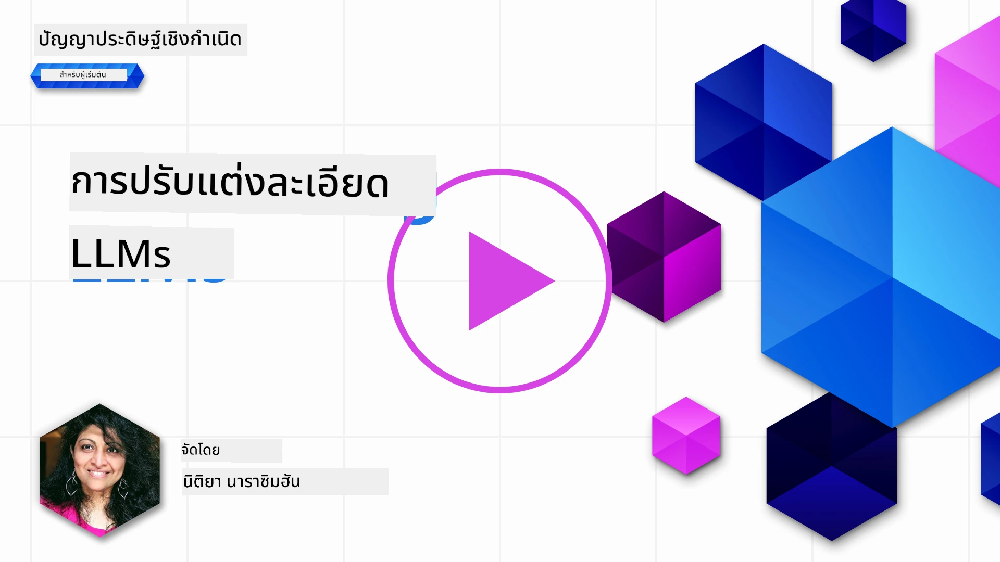
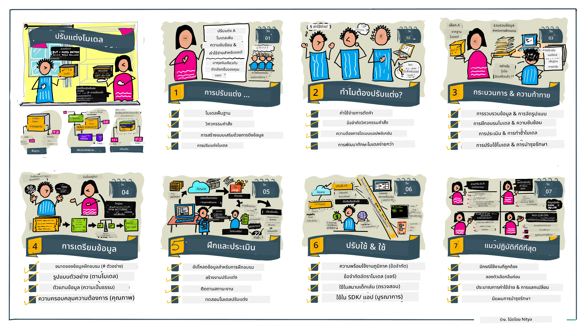

# การปรับแต่ง LLM ของคุณ

การใช้โมเดลภาษาใหญ่เพื่อสร้างแอปพลิเคชัน AI สร้างสรรค์มาพร้อมกับความท้าทายใหม่ ประเด็นสำคัญคือการรับประกันคุณภาพของคำตอบ (ความแม่นยำและความเกี่ยวข้อง) ในเนื้อหาที่โมเดลสร้างขึ้นสำหรับคำขอของผู้ใช้ที่กำหนด ในบทเรียนก่อนหน้า เราได้พูดถึงเทคนิคต่าง ๆ เช่น การออกแบบพรอมต์และการสร้างข้อมูลเสริมด้วยการดึงข้อมูล ที่พยายามแก้ปัญหานี้โดยการ _แก้ไขอินพุตพรอมต์_ ให้กับโมเดลที่มีอยู่

ในบทเรียนวันนี้ เราจะพูดถึงเทคนิคที่สาม คือ **การปรับแต่งอย่างละเอียด (fine-tuning)** ซึ่งพยายามแก้ไขความท้าทายนี้โดยการ _ฝึกโมเดลซ้ำ_ ด้วยข้อมูลเพิ่มเติม มาดูรายละเอียดกันครับ

## วัตถุประสงค์การเรียนรู้

บทเรียนนี้จะแนะนำแนวคิดของการปรับแต่งสำหรับโมเดลภาษาแบบพรีเทรน สำรวจประโยชน์และความท้าทายของวิธีนี้ และให้คำแนะนำเกี่ยวกับเวลาที่ควรใช้และวิธีใช้การปรับแต่งอย่างละเอียดเพื่อปรับปรุงประสิทธิภาพของโมเดล AI สร้างสรรค์ของคุณ

เมื่อจบบทเรียนนี้ คุณควรสามารถตอบคำถามต่อไปนี้ได้:

- การปรับแต่งอย่างละเอียดสำหรับโมเดลภาษา คืออะไร?
- เมื่อไหร่ และทำไม การปรับแต่งอย่างละเอียดจึงมีประโยชน์?
- ฉันจะปรับแต่งโมเดลที่พรีเทรนไว้ได้อย่างไร?
- ข้อจำกัดของการปรับแต่งอย่างละเอียดคืออะไร?

พร้อมหรือยัง? มาเริ่มกันเลย

## คู่มือภาพรวม

อยากเห็นภาพรวมของสิ่งที่เราจะพูดถึงก่อนดำดิ่งลึกใช่ไหม? ลองดูคู่มือภาพรวมนี้ที่อธิบายเส้นทางการเรียนรู้สำหรับบทเรียนนี้ – ตั้งแต่การเรียนรู้แนวคิดหลักและแรงจูงใจในการปรับแต่ง ไปจนถึงการเข้าใจกระบวนการและแนวปฏิบัติที่ดีที่สุดในการทำงานปรับแต่งอย่างละเอียด นี่คือหัวข้อที่น่าสนใจสำหรับการสำรวจ อย่าลืมดูที่หน้า [Resources](./RESOURCES.md?WT.mc_id=academic-105485-koreyst) สำหรับลิงก์เพิ่มเติมที่ช่วยสนับสนุนการเรียนรู้ด้วยตัวเองของคุณ!

## การปรับแต่งอย่างละเอียดสำหรับโมเดลภาษา คืออะไร?

ตามคำจำกัดความ โมเดลภาษาใหญ่จะถูก _พรีเทรน_ ด้วยข้อมูลข้อความจำนวนมากจากแหล่งข้อมูลหลากหลายรวมถึงอินเทอร์เน็ต ดังที่เราได้เรียนรู้ในบทเรียนก่อนหน้า เราต้องใช้เทคนิคเช่น _การออกแบบพรอมต์_ และ _การสร้างข้อมูลเสริมด้วยการดึงข้อมูล_ เพื่อปรับปรุงคุณภาพคำตอบของโมเดลต่อคำถามของผู้ใช้ ("พรอมต์")

เทคนิคการออกแบบพรอมต์ยอดนิยมคือการให้โมเดลคำแนะนำเพิ่มเติมเกี่ยวกับสิ่งที่คาดหวังในคำตอบ ไม่ว่าจะโดยการให้ _คำสั่ง_ (คำแนะนำตรง) หรือ _ให้ตัวอย่างไม่กี่ตัว_ (คำแนะนำโดยนัย) เรียกว่า _few-shot learning_ แต่มีข้อจำกัดสองประการคือ:

- ขีดจำกัดจำนวนโทเค็นของโมเดลอาจจำกัดจำนวนตัวอย่างที่คุณให้ได้ และจำกัดประสิทธิภาพ
- ค่าโทเค็นของโมเดลอาจทำให้การเพิ่มตัวอย่างในทุกพรอมต์เป็นเรื่องมีค่าใช้จ่ายสูง และจำกัดความยืดหยุ่น

การปรับแต่งอย่างละเอียดเป็นแนวปฏิบัติทั่วไปในระบบการเรียนรู้ของเครื่องที่เรานำโมเดลที่พรีเทรนแล้วนำมาฝึกซ้ำด้วยข้อมูลใหม่เพื่อปรับปรุงประสิทธิภาพในงานเฉพาะ ในบริบทของโมเดลภาษา เราสามารถปรับแต่งโมเดลที่พรีเทรน _ด้วยชุดตัวอย่างที่คัดสรรมาอย่างดีสำหรับงานหรือโดเมนการใช้งานที่กำหนด_ เพื่อสร้าง **โมเดลเฉพาะ** ที่อาจแม่นยำและเกี่ยวข้องมากขึ้นสำหรับงานหรือโดเมนนั้น ๆ อีกประโยชน์รองของการปรับแต่งอย่างละเอียดคือช่วยลดจำนวนตัวอย่างที่ต้องใช้ในการเรียนรู้แบบ few-shot — ลดการใช้โทเค็นและค่าใช้จ่ายที่เกี่ยวข้อง

## เมื่อไหร่และทำไมควรปรับแต่งโมเดล?

ใน _บริบทนี้_ เมื่อเราพูดถึงการปรับแต่งอย่างละเอียด เราหมายถึงการปรับแต่งแบบ **มีผู้ควบคุม** ที่ทำการฝึกซ้ำโดยการ **เพิ่มข้อมูลใหม่** ที่ไม่ได้อยู่ในชุดข้อมูลฝึกเดิม แตกต่างจากการปรับแต่งแบบไม่มีผู้ควบคุมที่โมเดลถูกฝึกซ้ำกับข้อมูลเดิมแต่ใช้พารามิเตอร์ต่างกัน

สิ่งสำคัญที่ควรจำคือการปรับแต่งเป็นเทคนิคขั้นสูงที่ต้องใช้ความเชี่ยวชาญระดับหนึ่งเพื่อให้ได้ผลลัพธ์ตามต้องการ หากทำไม่ถูกต้อง อาจไม่ได้ผลลัพธ์ตามคาด หรืออาจทำให้ประสิทธิภาพของโมเดลสำหรับโดเมนเป้าหมายลดลงด้วยซ้ำ

ดังนั้น ก่อนจะเรียนรู้ว่า "จะปรับแต่งโมเดลภาษาอย่างไร" คุณต้องรู้ว่า "ทำไม" ควรเลือกเส้นทางนี้ และ "เมื่อใด" ควรเริ่มกระบวนการปรับแต่ง โดยเริ่มจากการถามตัวเองคำถามเหล่านี้:

- **กรณีการใช้งาน**: กรณีการใช้งานการปรับแต่งของคุณคืออะไร? คุณต้องการปรับปรุงจุดใดของโมเดลพรีเทรนปัจจุบัน?
- **ทางเลือกอื่น**: คุณได้ลองใช้ _เทคนิคอื่น ๆ_ เพื่อให้ได้ผลตามที่ต้องการหรือยัง? ใช้เพื่อสร้างเส้นฐานสำหรับการเปรียบเทียบ
  - การออกแบบพรอมต์: ลองใช้เทคนิคการนำเสนอ few-shot ด้วยตัวอย่างของคำตอบพรอมต์ที่เกี่ยวข้อง ประเมินคุณภาพคำตอบ
  - การสร้างข้อมูลเสริมด้วยการดึงข้อมูล: ลองเพิ่มข้อมูลจากการค้นหาข้อมูลของคุณในพรอมต์ ประเมินคุณภาพคำตอบ
- **ค่าใช้จ่าย**: คุณได้ประเมินค่าใช้จ่ายสำหรับการปรับแต่งอย่างละเอียดหรือยัง?
  - การทำให้ปรับแต่งได้ - โมเดลพรีเทรนนี้สามารถปรับแต่งได้หรือไม่?
  - ความพยายาม - การเตรียมข้อมูลฝึก, การประเมิน และการปรับปรุงโมเดล
  - การประมวลผล - สำหรับการรันงานปรับแต่ง และการใช้งานโมเดลที่ถูกปรับแต่ง
  - ข้อมูล - การเข้าถึงตัวอย่างที่มีคุณภาพเพียงพอที่ส่งผลต่อการปรับแต่ง
- **ประโยชน์**: คุณได้ยืนยันประโยชน์ของการปรับแต่งหรือยัง?
  - คุณภาพ - โมเดลที่ปรับแต่งแล้วทำงานดีกว่าเส้นฐานหรือไม่?
  - ค่าใช้จ่าย - ลดการใช้โทเค็นโดยการทำพรอมต์ให้ง่ายขึ้นหรือไม่?
  - ความสามารถขยาย - คุณสามารถใช้โมเดลฐานนี้กับโดเมนใหม่ได้หรือไม่?

เมื่อคุณตอบคำถามเหล่านี้ได้ คุณจะสามารถตัดสินใจได้ว่าการปรับแต่งเป็นวิธีที่เหมาะสมสำหรับกรณีใช้งานของคุณหรือไม่ โดยวิธีนี้จะใช้ได้เมื่อประโยชน์มีมากกว่าค่าใช้จ่าย เมื่อคุณตัดสินใจที่จะดำเนินการต่อ ก็ถึงเวลาคิดว่า _คุณจะปรับแต่งโมเดลที่พรีเทรนอย่างไร_

อยากได้ข้อมูลเชิงลึกเพิ่มเติมเกี่ยวกับกระบวนการตัดสินใจไหม? ดู [To fine-tune or not to fine-tune](https://www.youtube.com/watch?v=0Jo-z-MFxJs)

## เราจะปรับแต่งโมเดลพรีเทรนได้อย่างไร?

ในการปรับแต่งโมเดลพรีเทรน คุณต้องมี:

- โมเดลพรีเทรนที่ต้องการปรับแต่ง
- ชุดข้อมูลสำหรับการปรับแต่ง
- สภาพแวดล้อมการฝึกสำหรับรันงานปรับแต่ง
- สภาพแวดล้อมสำหรับโฮสต์โมเดลที่ปรับแต่งแล้ว

## การปรับแต่งอย่างละเอียดในการปฏิบัติ

แหล่งข้อมูลต่อไปนี้มีบทแนะนำทีละขั้นตอนเพื่อพาคุณทำตัวอย่างจริงด้วยโมเดลที่เลือกและชุดข้อมูลที่คัดสรรมา สำหรับทำตามบทแนะนำเหล่านี้ คุณต้องมีบัญชีบนผู้ให้บริการเฉพาะ พร้อมกับการเข้าถึงโมเดลและชุดข้อมูลที่เกี่ยวข้อง

| ผู้ให้บริการ   | บทแนะนำ                                                                                                                                                                 | คำอธิบาย                                                                                                                                                                                                                                                                                                                                                                             |
| ------------ | ---------------------------------------------------------------------------------------------------------------------------------------------------------------------- | ------------------------------------------------------------------------------------------------------------------------------------------------------------------------------------------------------------------------------------------------------------------------------------------------------------------------------------------------------------------------------------- |
| OpenAI       | [วิธีปรับแต่งโมเดลแชท](https://github.com/openai/openai-cookbook/blob/main/examples/How_to_finetune_chat_models.ipynb?WT.mc_id=academic-105485-koreyst)                | เรียนรู้การปรับแต่ง `gpt-35-turbo` เพื่อโดเมนเฉพาะ ("ผู้ช่วยสูตรอาหาร") โดยเตรียมข้อมูลฝึก รันงานปรับแต่ง และใช้โมเดลที่ปรับแต่งสำหรับการทำนายคำตอบ                                                                                                                                                                                                                                 |
| Azure OpenAI | [บทเรียนการปรับแต่ง GPT 3.5 Turbo](https://learn.microsoft.com/azure/ai-services/openai/tutorials/fine-tune?tabs=python-new%2Ccommand-line&WT.mc_id=academic-105485-koreyst) | เรียนรู้การปรับแต่งโมเดล `gpt-35-turbo-0613` **บน Azure** โดยทำขั้นตอนการสร้างและอัพโหลดข้อมูลฝึก รันงานปรับแต่ง โฮสต์และใช้โมเดลใหม่                                                                                                                                                                                                                                      |
| Hugging Face | [การปรับแต่ง LLMs กับ Hugging Face](https://www.philschmid.de/fine-tune-llms-in-2024-with-trl?WT.mc_id=academic-105485-koreyst)                                         | บล็อกโพสต์นี้สอนการปรับแต่ง _open LLM_ (เช่น `CodeLlama 7B`) โดยใช้ไลบรารี [transformers](https://huggingface.co/docs/transformers/index?WT.mc_id=academic-105485-koreyst) และ [Transformer Reinforcement Learning (TRL)](https://huggingface.co/docs/trl/index?WT.mc_id=academic-105485-koreyst) กับชุดข้อมูลเปิดบน Hugging Face                                            |
|              |                                                                                                                                                                        |                                                                                                                                                                                                                                                                                                                                                                                       |
| 🤗 AutoTrain | [การปรับแต่ง LLMs กับ AutoTrain](https://github.com/huggingface/autotrain-advanced/?WT.mc_id=academic-105485-koreyst)                                                   | AutoTrain (หรือ AutoTrain Advanced) คือไลบรารีภาษา Python ที่พัฒนาโดย Hugging Face ซึ่งรองรับการปรับแต่งสำหรับงานต่าง ๆ รวมถึงการปรับแต่ง LLM AutoTrain เป็นโซลูชันแบบไม่ต้องเขียนโค้ดและสามารถปรับแต่งได้ทั้งแบบคลาวด์ของคุณเอง บน Hugging Face Spaces หรือในเครื่อง รองรับทั้ง GUI ผ่านเว็บ, CLI และการฝึกผ่านไฟล์ yaml config            |
|              |                                                                                                                                                                        |                                                                                                                                                                                                                                                                                                                                                                                       |
| 🦥 Unsloth   | [การปรับแต่ง LLMs กับ Unsloth](https://github.com/unslothai/unsloth)                                                                                                 | Unsloth คือเฟรมเวิร์กโอเพนซอร์สที่รองรับการปรับแต่ง LLM และการเรียนรู้แบบเสริมแรง (RL) Unsloth ช่วยให้การฝึกในเครื่อง การประเมิน และการใช้งานง่ายขึ้นด้วย [โน้ตบุ๊กพร้อมใช้](https://github.com/unslothai/notebooks) นอกจากนี้ยังรองรับการแปลงข้อความเป็นเสียง (TTS) โมเดล BERT และโมเดลมัลติโมดอล สำหรับเริ่มต้น โปรดอ่าน [คู่มือการปรับแต่ง LLMs แบบละเอียด](https://docs.unsloth.ai/get-started/fine-tuning-llms-guide) |
|              |                                                                                                                                                                        |                                                                                                                                                                                                                                                                                                                                                                                       |
## มอบหมายงาน

เลือกบทแนะนำใดบทแนะนำหนึ่งด้านบนและทำตาม _เราอาจทำสำเนาบทแนะนำเหล่านี้ใน Jupyter Notebooks ในรีโพนี้เพื่อใช้เป็นการอ้างอิงเท่านั้น กรุณาใช้แหล่งต้นฉบับโดยตรงเพื่อรับเวอร์ชันล่าสุด_

## ทำได้ดีมาก! ดำเนินการเรียนรู้ต่อ

หลังจากจบบทเรียนนี้แล้ว เช็คชุดการเรียนรู้ [Generative AI Learning collection](https://aka.ms/genai-collection?WT.mc_id=academic-105485-koreyst) เพื่อพัฒนาความรู้ด้าน Generative AI ของคุณต่อไป!

ยินดีด้วย!! คุณได้จบบทเรียนสุดท้ายจากชุดเวอร์ชัน 2 สำหรับหลักสูตรนี้แล้ว! อย่าหยุดเรียนรู้และสร้างสรรค์ \*\*เช็คดูหน้า [RESOURCES](RESOURCES.md?WT.mc_id=academic-105485-koreyst) สำหรับรายการคำแนะนำเพิ่มเติมในหัวข้อนี้โดยเฉพาะ

ชุดบทเรียนเวอร์ชัน 1 ของเราก็ได้รับการอัพเดตด้วยมอบหมายงานและแนวคิดเพิ่มขึ้น ดังนั้นใช้เวลาสักนิดรีเฟรชความรู้ของคุณ – และโปรด [แชร์คำถามและคำติชมของคุณ](https://github.com/microsoft/generative-ai-for-beginners/issues?WT.mc_id=academic-105485-koreyst) เพื่อช่วยเราปรับปรุงบทเรียนเหล่านี้ให้ชุมชนต่อไป

---

<!-- CO-OP TRANSLATOR DISCLAIMER START -->
**ข้อจำกัดความรับผิดชอบ**:
เอกสารนี้ได้รับการแปลโดยใช้บริการแปลภาษาอัตโนมัติ [Co-op Translator](https://github.com/Azure/co-op-translator) แม้เราจะพยายามให้ความถูกต้องสูงสุด แต่โปรดทราบว่าการแปลอัตโนมัติอาจมีข้อผิดพลาดหรือความไม่แม่นยำ เอกสารฉบับต้นฉบับในภาษาต้นทางควรถูกพิจารณาเป็นแหล่งข้อมูลที่เชื่อถือได้ สำหรับข้อมูลที่สำคัญ ขอแนะนำให้ใช้บริการแปลโดยผู้เชี่ยวชาญที่เป็นมนุษย์ เราจะไม่รับผิดชอบต่อความเข้าใจผิดหรือการตีความที่ผิดพลาดที่อาจเกิดขึ้นจากการใช้การแปลนี้
<!-- CO-OP TRANSLATOR DISCLAIMER END -->