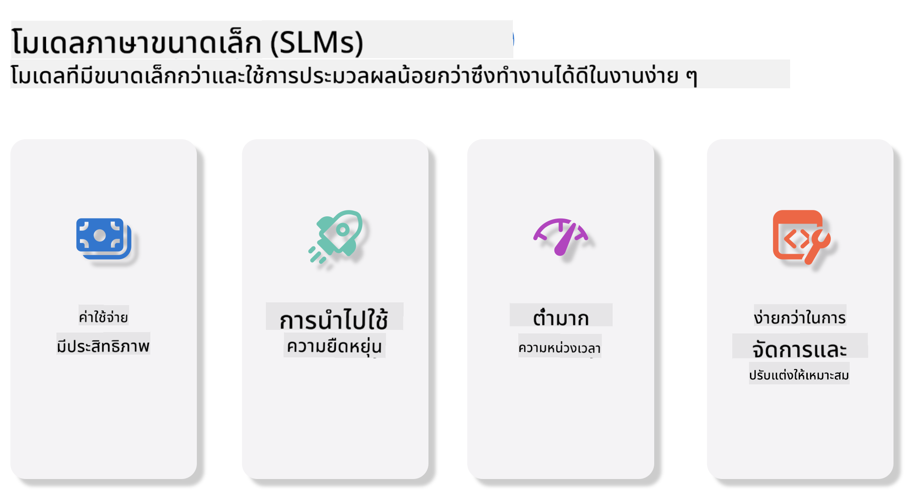
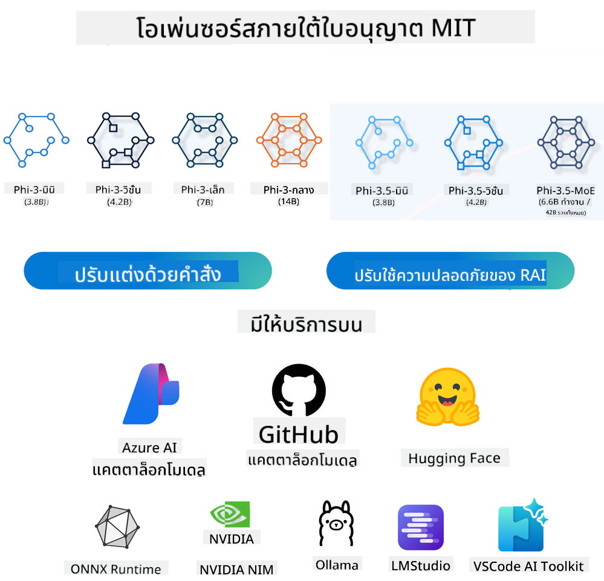
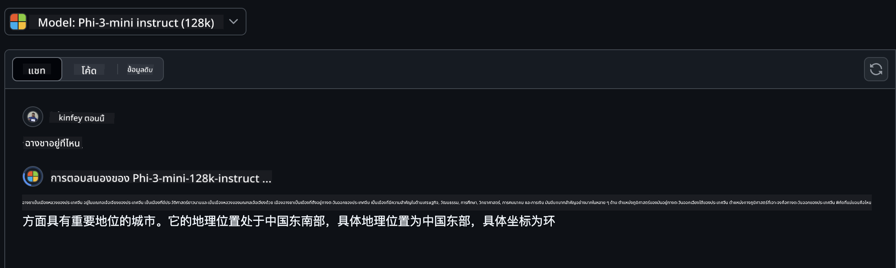

<!--
CO_OP_TRANSLATOR_METADATA:
{
  "original_hash": "124ad36cfe96f74038811b6e2bb93e9d",
  "translation_date": "2025-05-20T09:55:38+00:00",
  "source_file": "19-slm/README.md",
  "language_code": "th"
}
-->
# บทนำสู่โมเดลภาษาขนาดเล็กสำหรับ Generative AI สำหรับผู้เริ่มต้น

Generative AI เป็นสาขาที่น่าหลงใหลของปัญญาประดิษฐ์ที่มุ่งเน้นการสร้างระบบที่สามารถสร้างเนื้อหาใหม่ได้ เนื้อหานี้สามารถมีตั้งแต่ข้อความและภาพไปจนถึงดนตรีและแม้แต่สภาพแวดล้อมเสมือนทั้งหมด หนึ่งในแอปพลิเคชันที่น่าตื่นเต้นที่สุดของ Generative AI คือในขอบเขตของโมเดลภาษา

## โมเดลภาษาขนาดเล็กคืออะไร?

โมเดลภาษาขนาดเล็ก (SLM) เป็นรูปแบบที่ย่อขนาดลงของโมเดลภาษาขนาดใหญ่ (LLM) โดยใช้ประโยชน์จากหลักการสถาปัตยกรรมและเทคนิคของ LLM ในขณะที่แสดงผลการคำนวณที่ลดลงอย่างมาก SLM เป็นชุดย่อยของโมเดลภาษาที่ออกแบบมาเพื่อสร้างข้อความที่เหมือนมนุษย์ แตกต่างจากคู่ที่ใหญ่กว่า เช่น GPT-4, SLM มีขนาดกะทัดรัดและมีประสิทธิภาพมากขึ้น ทำให้เหมาะสำหรับแอปพลิเคชันที่มีทรัพยากรการคำนวณจำกัด แม้จะมีขนาดเล็กลง แต่ก็ยังสามารถทำงานต่างๆ ได้หลากหลาย โดยทั่วไป SLM ถูกสร้างขึ้นโดยการบีบอัดหรือกลั่น LLM โดยมุ่งหวังที่จะรักษาส่วนสำคัญของการทำงานและความสามารถทางภาษาของโมเดลดั้งเดิม การลดขนาดโมเดลนี้จะลดความซับซ้อนโดยรวม ทำให้ SLM มีประสิทธิภาพมากขึ้นในแง่ของการใช้หน่วยความจำและข้อกำหนดในการคำนวณ แม้จะมีการปรับให้เหมาะสมเหล่านี้ SLM ก็ยังสามารถทำงานประมวลผลภาษาธรรมชาติ (NLP) ได้หลากหลาย:

- การสร้างข้อความ: สร้างประโยคหรือย่อหน้าที่สอดคล้องกันและเกี่ยวข้องกับบริบท
- การเติมข้อความ: ทำนายและเติมประโยคตามคำแนะนำที่กำหนด
- การแปล: แปลงข้อความจากภาษาหนึ่งไปเป็นอีกภาษาหนึ่ง
- การสรุป: ย่อข้อความยาวให้สั้นลงเป็นสรุปที่ย่อยง่ายขึ้น

แม้จะมีการแลกเปลี่ยนบางอย่างในประสิทธิภาพหรือความลึกของความเข้าใจเมื่อเทียบกับคู่ที่ใหญ่กว่า

## โมเดลภาษาขนาดเล็กทำงานอย่างไร?

SLM ได้รับการฝึกฝนด้วยข้อมูลข้อความจำนวนมาก ในระหว่างการฝึกอบรม พวกเขาเรียนรู้รูปแบบและโครงสร้างของภาษา ทำให้สามารถสร้างข้อความที่ถูกต้องตามหลักไวยากรณ์และเหมาะสมกับบริบท กระบวนการฝึกอบรมเกี่ยวข้องกับ:

- การรวบรวมข้อมูล: การรวบรวมชุดข้อมูลขนาดใหญ่ของข้อความจากแหล่งต่างๆ
- การเตรียมข้อมูลเบื้องต้น: การทำความสะอาดและจัดระเบียบข้อมูลให้เหมาะสมสำหรับการฝึกอบรม
- การฝึกอบรม: ใช้อัลกอริธึมการเรียนรู้ของเครื่องเพื่อสอนโมเดลให้เข้าใจและสร้างข้อความ
- การปรับแต่ง: ปรับโมเดลเพื่อปรับปรุงประสิทธิภาพในงานเฉพาะ

การพัฒนา SLM สอดคล้องกับความต้องการที่เพิ่มขึ้นสำหรับโมเดลที่สามารถปรับใช้ในสภาพแวดล้อมที่มีข้อจำกัดด้านทรัพยากร เช่น อุปกรณ์พกพาหรือแพลตฟอร์มการประมวลผลที่ปลายทาง ซึ่ง LLM แบบเต็มอาจใช้งานไม่ได้เนื่องจากความต้องการทรัพยากรที่หนักหน่วง โดยมุ่งเน้นที่ประสิทธิภาพ SLM จึงสร้างสมดุลระหว่างประสิทธิภาพและการเข้าถึง ทำให้สามารถใช้งานได้ในวงกว้างในหลายโดเมน



## วัตถุประสงค์การเรียนรู้

ในบทเรียนนี้ เราหวังว่าจะได้แนะนำความรู้เกี่ยวกับ SLM และรวมเข้ากับ Microsoft Phi-3 เพื่อเรียนรู้สถานการณ์ต่างๆ ในเนื้อหาข้อความ วิสัยทัศน์ และ MoE เมื่อสิ้นสุดบทเรียนนี้ คุณควรจะสามารถตอบคำถามต่อไปนี้ได้:

- SLM คืออะไร
- ความแตกต่างระหว่าง SLM และ LLM คืออะไร
- Microsoft Phi-3/3.5 Family คืออะไร
- วิธีการอนุมาน Microsoft Phi-3/3.5 Family

พร้อมไหม? มาเริ่มกันเลย

## ความแตกต่างระหว่างโมเดลภาษาขนาดใหญ่ (LLM) และโมเดลภาษาขนาดเล็ก (SLM)

ทั้ง LLM และ SLM สร้างขึ้นบนหลักการพื้นฐานของการเรียนรู้ของเครื่องแบบความน่าจะเป็น โดยใช้แนวทางที่คล้ายกันในการออกแบบสถาปัตยกรรม วิธีการฝึกอบรม กระบวนการสร้างข้อมูล และเทคนิคการประเมินโมเดล อย่างไรก็ตาม มีปัจจัยสำคัญหลายประการที่ทำให้โมเดลทั้งสองประเภทนี้แตกต่างกัน

## การประยุกต์ใช้โมเดลภาษาขนาดเล็ก

SLM มีการใช้งานที่หลากหลาย รวมถึง:

- แชทบอท: ให้การสนับสนุนลูกค้าและมีส่วนร่วมกับผู้ใช้ในลักษณะการสนทนา
- การสร้างเนื้อหา: ช่วยเหลือนักเขียนโดยสร้างแนวคิดหรือแม้แต่ร่างบทความทั้งหมด
- การศึกษา: ช่วยนักเรียนในการทำงานเขียนหรือเรียนรู้ภาษาใหม่
- การเข้าถึง: สร้างเครื่องมือสำหรับบุคคลที่มีความพิการ เช่น ระบบแปลงข้อความเป็นคำพูด

**ขนาด**

ความแตกต่างหลักระหว่าง LLM และ SLM อยู่ที่ขนาดของโมเดล LLM เช่น ChatGPT (GPT-4) สามารถประกอบด้วยพารามิเตอร์ประมาณ 1.76 ล้านล้าน ในขณะที่ SLM แบบโอเพ่นซอร์ส เช่น Mistral 7B ได้รับการออกแบบด้วยพารามิเตอร์ที่น้อยกว่ามาก—ประมาณ 7 พันล้าน ความแตกต่างนี้ส่วนใหญ่เกิดจากความแตกต่างในสถาปัตยกรรมโมเดลและกระบวนการฝึกอบรม ตัวอย่างเช่น ChatGPT ใช้กลไกการใส่ใจในตนเองภายในกรอบงานเข้ารหัส-ถอดรหัส ในขณะที่ Mistral 7B ใช้การใส่ใจในหน้าต่างเลื่อน ซึ่งช่วยให้การฝึกอบรมมีประสิทธิภาพมากขึ้นภายในโมเดลที่ใช้ตัวถอดรหัสเท่านั้น ความแปรปรวนทางสถาปัตยกรรมนี้มีผลกระทบอย่างลึกซึ้งต่อความซับซ้อนและประสิทธิภาพของโมเดลเหล่านี้

**ความเข้าใจ**

โดยทั่วไปแล้ว SLM จะได้รับการปรับให้เหมาะสมเพื่อประสิทธิภาพในโดเมนเฉพาะ ทำให้มีความเชี่ยวชาญสูงแต่มีศักยภาพจำกัดในการให้ความเข้าใจในบริบทที่กว้างขวางในหลายสาขาความรู้ ในทางตรงกันข้าม LLM มีเป้าหมายเพื่อจำลองความฉลาดที่เหมือนมนุษย์ในระดับที่ครอบคลุมมากขึ้น ได้รับการฝึกอบรมเกี่ยวกับชุดข้อมูลขนาดใหญ่และหลากหลาย LLM ได้รับการออกแบบมาให้ทำงานได้ดีในหลากหลายโดเมน โดยนำเสนอความเก่งกาจและความสามารถในการปรับตัวที่มากขึ้น ดังนั้น LLM จึงเหมาะสมกว่าสำหรับงานขั้นปลายที่หลากหลาย เช่น การประมวลผลภาษาธรรมชาติและการเขียนโปรแกรม

**การคำนวณ**

การฝึกอบรมและการปรับใช้ LLM เป็นกระบวนการที่ใช้ทรัพยากรมาก ซึ่งมักต้องการโครงสร้างพื้นฐานการคำนวณที่สำคัญ รวมถึงคลัสเตอร์ GPU ขนาดใหญ่ ตัวอย่างเช่น การฝึกอบรมโมเดลอย่าง ChatGPT ตั้งแต่เริ่มต้นอาจต้องใช้ GPU หลายพันตัวในช่วงเวลานาน ในทางตรงกันข้าม SLM ซึ่งมีจำนวนพารามิเตอร์น้อยกว่านั้นสามารถเข้าถึงได้มากกว่าในแง่ของทรัพยากรการคำนวณ โมเดลอย่าง Mistral 7B สามารถฝึกอบรมและทำงานบนเครื่องท้องถิ่นที่มีความสามารถของ GPU ปานกลาง แม้ว่าการฝึกอบรมยังคงต้องใช้เวลาหลายชั่วโมงในหลายๆ GPU

**อคติ**

อคติเป็นปัญหาที่ทราบกันดีใน LLM ส่วนใหญ่เกิดจากลักษณะของข้อมูลการฝึกอบรม โมเดลเหล่านี้มักพึ่งพาข้อมูลดิบที่มีอยู่ทั่วไปจากอินเทอร์เน็ต ซึ่งอาจเป็นตัวแทนหรือเป็นตัวแทนของกลุ่มบางกลุ่มไม่ถูกต้อง แนะนำการติดฉลากที่ผิดพลาด หรือสะท้อนถึงอคติทางภาษาอันเนื่องมาจากภาษาถิ่น ความแตกต่างทางภูมิศาสตร์ และกฎทางไวยากรณ์ นอกจากนี้ ความซับซ้อนของสถาปัตยกรรม LLM อาจทำให้อคติรุนแรงขึ้นโดยไม่ได้ตั้งใจ ซึ่งอาจไม่มีใครสังเกตเห็นหากไม่ได้ปรับแต่งอย่างรอบคอบ ในทางกลับกัน SLM ที่ได้รับการฝึกฝนในชุดข้อมูลเฉพาะโดเมนที่มีข้อจำกัดมากกว่านั้นมีแนวโน้มที่จะเกิดอคติน้อยกว่าโดยเนื้อแท้ แม้ว่าจะไม่สามารถป้องกันได้ก็ตาม

**การอนุมาน**

ขนาดที่ลดลงของ SLM ทำให้พวกเขาได้เปรียบอย่างมากในแง่ของความเร็วในการอนุมาน ทำให้พวกเขาสามารถสร้างเอาต์พุตได้อย่างมีประสิทธิภาพบนฮาร์ดแวร์ในเครื่องโดยไม่จำเป็นต้องใช้การประมวลผลแบบขนานที่กว้างขวาง ในทางตรงกันข้าม LLM เนื่องจากขนาดและความซับซ้อน มักต้องการทรัพยากรการคำนวณแบบขนานจำนวนมากเพื่อให้ได้เวลาการอนุมานที่ยอมรับได้ การมีอยู่ของผู้ใช้พร้อมกันหลายคนจะทำให้เวลาตอบสนองของ LLM ช้าลง โดยเฉพาะอย่างยิ่งเมื่อปรับใช้ในขนาดใหญ่

โดยสรุป แม้ว่า LLM และ SLM ทั้งคู่จะมีพื้นฐานร่วมกันในด้านการเรียนรู้ของเครื่อง แต่ก็แตกต่างกันอย่างมากในแง่ของขนาดโมเดล ข้อกำหนดด้านทรัพยากร ความเข้าใจในบริบท ความอ่อนไหวต่ออคติ และความเร็วในการอนุมาน ความแตกต่างเหล่านี้สะท้อนถึงความเหมาะสมตามลำดับสำหรับกรณีการใช้งานที่แตกต่างกัน โดย LLM มีความหลากหลายมากกว่าแต่ใช้ทรัพยากรมาก ในขณะที่ SLM นำเสนอประสิทธิภาพเฉพาะโดเมนมากขึ้นโดยมีความต้องการการคำนวณลดลง

***หมายเหตุ: ในบทนี้ เราจะแนะนำ SLM โดยใช้ Microsoft Phi-3 / 3.5 เป็นตัวอย่าง***

## แนะนำตระกูล Phi-3 / Phi-3.5

ตระกูล Phi-3 / 3.5 มุ่งเป้าไปที่สถานการณ์การใช้งานข้อความ วิสัยทัศน์ และ Agent (MoE) เป็นหลัก:

### Phi-3 / 3.5 Instruct

ส่วนใหญ่สำหรับการสร้างข้อความ การเติมแชท และการดึงข้อมูลเนื้อหา ฯลฯ

**Phi-3-mini**

โมเดลภาษาขนาด 3.8B มีให้บริการบน Microsoft Azure AI Studio, Hugging Face และ Ollama โมเดล Phi-3 มีประสิทธิภาพเหนือกว่าโมเดลภาษาในขนาดที่เท่ากันและใหญ่กว่าในเกณฑ์มาตรฐานที่สำคัญ (ดูตัวเลขเกณฑ์มาตรฐานด้านล่าง ยิ่งตัวเลขสูงยิ่งดี) Phi-3-mini มีประสิทธิภาพเหนือกว่าโมเดลที่มีขนาดใหญ่กว่าสองเท่า ในขณะที่ Phi-3-small และ Phi-3-medium มีประสิทธิภาพเหนือกว่าโมเดลที่ใหญ่กว่า รวมถึง GPT-3.5

**Phi-3-small & medium**

ด้วยพารามิเตอร์เพียง 7B, Phi-3-small เอาชนะ GPT-3.5T ในเกณฑ์มาตรฐานด้านภาษา การให้เหตุผล การเขียนโค้ด และคณิตศาสตร์ที่หลากหลาย Phi-3-medium ที่มีพารามิเตอร์ 14B ยังคงมีแนวโน้มนี้และมีประสิทธิภาพเหนือกว่า Gemini 1.0 Pro

**Phi-3.5-mini**

เราสามารถคิดว่ามันเป็นการอัปเกรดของ Phi-3-mini ในขณะที่พารามิเตอร์ยังคงไม่เปลี่ยนแปลง แต่ก็ช่วยเพิ่มความสามารถในการรองรับหลายภาษา (รองรับมากกว่า 20 ภาษา: อาหรับ จีน เช็ก เดนมาร์ก ดัตช์ อังกฤษ ฟินแลนด์ ฝรั่งเศส เยอรมัน ฮิบรู ฮังการี อิตาลี ญี่ปุ่น เกาหลี นอร์เวย์ โปแลนด์ โปรตุเกส รัสเซีย สเปน สวีเดน ไทย ตุรกี ยูเครน) และเพิ่มการสนับสนุนบริบทที่ยาวนานขึ้น Phi-3.5-mini ที่มีพารามิเตอร์ 3.8B มีประสิทธิภาพเหนือกว่าโมเดลภาษาที่มีขนาดเท่ากันและเทียบเท่ากับโมเดลที่มีขนาดใหญ่กว่าสองเท่า

### Phi-3 / 3.5 Vision

เราสามารถคิดว่าโมเดล Instruct ของ Phi-3/3.5 เป็นความสามารถของ Phi ในการเข้าใจ และ Vision คือสิ่งที่ทำให้ Phi มีดวงตาเพื่อเข้าใจโลก

**Phi-3-Vision**

Phi-3-vision ที่มีพารามิเตอร์เพียง 4.2B ยังคงมีแนวโน้มนี้และมีประสิทธิภาพเหนือกว่าโมเดลที่ใหญ่กว่า เช่น Claude-3 Haiku และ Gemini 1.0 Pro V ในงานให้เหตุผลด้วยภาพทั่วไป OCR และงานทำความเข้าใจตารางและแผนภาพ

**Phi-3.5-Vision**

Phi-3.5-Vision ก็เป็นการอัปเกรดของ Phi-3-Vision เช่นกัน โดยเพิ่มการรองรับภาพหลายภาพ คุณสามารถคิดว่ามันเป็นการปรับปรุงด้านการมองเห็น ไม่เพียงแต่คุณสามารถดูภาพได้เท่านั้น แต่ยังสามารถดูวิดีโอได้อีกด้วย Phi-3.5-vision มีประสิทธิภาพเหนือกว่าโมเดลที่ใหญ่กว่า เช่น Claude-3.5 Sonnet และ Gemini 1.5 Flash ในงานทำความเข้าใจ OCR ตารางและแผนภูมิ และเทียบเท่ากับงานให้เหตุผลเกี่ยวกับความรู้ทางสายตาทั่วไป รองรับการป้อนข้อมูลหลายเฟรม กล่าวคือ ทำการให้เหตุผลเกี่ยวกับภาพอินพุตหลายภาพ

### Phi-3.5-MoE

***Mixture of Experts(MoE)*** ช่วยให้โมเดลได้รับการฝึกอบรมล่วงหน้าด้วยการคำนวณที่น้อยลง ซึ่งหมายความว่าคุณสามารถขยายขนาดโมเดลหรือชุดข้อมูลได้อย่างมากด้วยงบประมาณการคำนวณเท่ากันกับโมเดลที่หนาแน่น โดยเฉพาะอย่างยิ่ง โมเดล MoE ควรบรรลุคุณภาพเท่ากับคู่ที่หนาแน่นได้เร็วขึ้นมากระหว่างการฝึกอบรมล่วงหน้า Phi-3.5-MoE ประกอบด้วยโมดูลผู้เชี่ยวชาญ 16x3.8B Phi-3.5-MoE ที่มีพารามิเตอร์ที่ใช้งานอยู่เพียง 6.6B บรรลุระดับการให้เหตุผล ความเข้าใจภาษา และคณิตศาสตร์ที่ใกล้เคียงกับโมเดลที่ใหญ่กว่ามาก

เราสามารถใช้โมเดลตระกูล Phi-3/3.5 ตามสถานการณ์ต่างๆ ได้ แตกต่างจาก LLM คุณสามารถปรับใช้ Phi-3/3.5-mini หรือ Phi-3/3.5-Vision บนอุปกรณ์ปลายทางได้

## วิธีใช้โมเดลตระกูล Phi-3/3.5

เราหวังว่าจะใช้ Phi-3/3.5 ในสถานการณ์ต่างๆ ต่อไปเราจะใช้ Phi-3/3.5 ตามสถานการณ์ต่างๆ



### ความแตกต่างในการอนุมาน

API ของคลาวด์

**โมเดล GitHub**

GitHub
Models เป็นวิธีที่ตรงที่สุด คุณสามารถเข้าถึงโมเดล Phi-3/3.5-Instruct ได้อย่างรวดเร็วผ่าน GitHub Models เมื่อรวมกับ Azure AI Inference SDK / OpenAI SDK คุณสามารถเข้าถึง API ผ่านโค้ดเพื่อทำการเรียก Phi-3/3.5-Instruct คุณยังสามารถทดสอบผลลัพธ์ที่แตกต่างกันผ่าน Playground - เดโม:การเปรียบเทียบผลลัพธ์ของ Phi-3-mini และ Phi-3.5-mini ในสถานการณ์ภาษาจีน   **Azure AI Studio** หรือหากเราต้องการใช้โมเดลวิชั่นและ MoE คุณสามารถใช้ Azure AI Studio เพื่อทำการเรียก หากคุณสนใจคุณสามารถอ่าน Phi-3 Cookbook เพื่อเรียนรู้วิธีการเรียก Phi-3/3.5 Instruct, Vision, MoE ผ่าน Azure AI Studio [คลิกที่นี่](https://github.com/microsoft/Phi-3CookBook/blob/main/md/02.QuickStart/AzureAIStudio_QuickStart.md?WT.mc_id=academic-105485-koreyst) **NVIDIA NIM** นอกเหนือจากโซลูชั่น Model Catalog บนคลาวด์ที่ Azure และ GitHub ให้บริการ คุณยังสามารถใช้ [Nivida NIM](https://developer.nvidia.com/nim?WT.mc_id=academic-105485-koreyst) เพื่อทำการเรียกที่เกี่ยวข้อง คุณสามารถเข้าชม NIVIDA NIM เพื่อทำการเรียก API ของ Phi-3/3.5 Family NVIDIA NIM (NVIDIA Inference Microservices) เป็นชุดของบริการไมโครเซอร์วิสที่เร่งการสรุปผลออกแบบมาเพื่อช่วยนักพัฒนาปรับใช้โมเดล AI อย่างมีประสิทธิภาพในหลากหลายสภาพแวดล้อม รวมถึงคลาวด์ ศูนย์ข้อมูล และเวิร์คสเตชั่น นี่คือคุณสมบัติหลักบางประการของ NVIDIA NIM: - **ความง่ายในการปรับใช้:** NIM ช่วยให้การปรับใช้โมเดล AI ด้วยคำสั่งเดียว ทำให้สามารถรวมเข้ากับเวิร์คโฟลว์ที่มีอยู่ได้อย่างง่ายดาย - **ประสิทธิภาพที่ปรับปรุง:** มันใช้เครื่องยนต์การสรุปผลที่ปรับปรุงไว้ล่วงหน้าของ NVIDIA เช่น TensorRT และ TensorRT-LLM เพื่อให้แน่ใจว่ามีความล่าช้าต่ำและการผ่านข้อมูลสูง - **ความสามารถในการขยาย:** NIM สนับสนุนการปรับขนาดอัตโนมัติบน Kubernetes ทำให้สามารถจัดการกับภาระงานที่แตกต่างกันได้อย่างมีประสิทธิภาพ - **ความปลอดภัยและการควบคุม:** องค์กรสามารถควบคุมข้อมูลและแอปพลิเคชันได้โดยการโฮสต์บริการไมโครเซอร์วิส NIM บนโครงสร้างพื้นฐานที่จัดการเอง - **API มาตรฐาน:** NIM ให้ API มาตรฐานอุตสาหกรรม ทำให้ง่ายต่อการสร้างและรวมแอปพลิเคชัน AI เช่น แชทบอท ผู้ช่วย AI และอื่น ๆ NIM เป็นส่วนหนึ่งของ NVIDIA AI Enterprise ซึ่งมีเป้าหมายที่จะทำให้การปรับใช้และการดำเนินการโมเดล AI ง่ายขึ้น ทำให้มั่นใจได้ว่ามันทำงานได้อย่างมีประสิทธิภาพบน GPU ของ NVIDIA - เดโม:การใช้ Nividia NIM เพื่อเรียก Phi-3.5-Vision-API [[คลิกที่นี่](../../../19-slm/python/Phi-3-Vision-Nividia-NIM.ipynb)] ### การสรุปผล Phi-3/3.5 ในสภาพแวดล้อมท้องถิ่น การสรุปผลที่เกี่ยวข้องกับ Phi-3 หรือโมเดลภาษาทั้งหมด เช่น GPT-3 หมายถึงกระบวนการในการสร้างการตอบสนองหรือการคาดการณ์ตามข้อมูลที่ได้รับ เมื่อคุณให้คำถามหรือคำสั่งแก่ Phi-3 มันจะใช้เครือข่ายประสาทที่ได้รับการฝึกฝนเพื่อสรุปผลการตอบสนองที่น่าจะเป็นและเกี่ยวข้องมากที่สุดโดยวิเคราะห์รูปแบบและความสัมพันธ์ในข้อมูลที่ได้รับการฝึกฝน **Hugging Face Transformer** Hugging Face Transformers เป็นไลบรารีที่มีพลังออกแบบมาสำหรับการประมวลผลภาษาธรรมชาติ (NLP) และงานการเรียนรู้เครื่องอื่น ๆ นี่คือจุดสำคัญบางประการเกี่ยวกับมัน: 1. **โมเดลที่ฝึกไว้ล่วงหน้า**: มันให้บริการโมเดลที่ฝึกไว้ล่วงหน้าหลายพันโมเดลที่สามารถใช้สำหรับงานต่าง ๆ เช่น การจำแนกประเภทข้อความ การรับรู้เอนทิตีที่มีชื่อ การตอบคำถาม การสรุป การแปล และการสร้างข้อความ 2. **ความสามารถในการใช้งานร่วมกันของเฟรมเวิร์ค**: ไลบรารีสนับสนุนเฟรมเวิร์คการเรียนรู้เชิงลึกหลายตัว รวมถึง PyTorch, TensorFlow และ JAX สิ่งนี้ทำให้คุณสามารถฝึกโมเดลในเฟรมเวิร์คหนึ่งและใช้มันในอีกเฟรมเวิร์คหนึ่ง 3. **ความสามารถในการใช้งานหลายรูปแบบ**: นอกจาก NLP แล้ว Hugging Face Transformers ยังสนับสนุนงานในวิชันคอมพิวเตอร์ (เช่น การจำแนกภาพ การตรวจจับวัตถุ) และการประมวลผลเสียง (เช่น การรับรู้เสียง การจำแนกเสียง) 4. **ความง่ายในการใช้งาน**: ไลบรารีมี API และเครื่องมือในการดาวน์โหลดและปรับแต่งโมเดลได้อย่างง่ายดาย ทำให้สามารถเข้าถึงได้ทั้งสำหรับผู้เริ่มต้นและผู้เชี่ยวชาญ 5. **ชุมชนและทรัพยากร**: Hugging Face มีชุมชนที่มีชีวิตชีวาและเอกสารที่ครอบคลุม บทแนะนำ และคู่มือเพื่อช่วยให้ผู้ใช้เริ่มต้นและใช้ประโยชน์จากไลบรารี [เอกสารทางการ](https://huggingface.co/docs/transformers/index?WT.mc_id=academic-105485-koreyst) หรือ [GitHub repository](https://github.com/huggingface/transformers?WT.mc_id=academic-105485-koreyst) นี่เป็นวิธีที่ใช้บ่อยที่สุด แต่ก็ต้องการการเร่งความเร็วของ GPU หลังจากทั้งหมดฉากเช่น Vision และ MoE ต้องการการคำนวณจำนวนมาก ซึ่งจะถูกจำกัดอย่างมากใน CPU หากไม่ได้ถูกปรับขนาด - เดโม:การใช้ Transformer เพื่อเรียก Phi-3.5-Instuct [คลิกที่นี่](../../../19-slm/python/phi35-instruct-demo.ipynb) - เดโม:การใช้ Transformer เพื่อเรียก Phi-3.5-Vision[คลิกที่นี่](../../../19-slm/python/phi35-vision-demo.ipynb) - เดโม:การใช้ Transformer เพื่อเรียก Phi-3.5-MoE[คลิกที่นี่](../../../19-slm/python/phi35_moe_demo.ipynb) **Ollama** [Ollama](https://ollama.com/?WT.mc_id=academic-105485-koreyst) เป็นแพลตฟอร์มที่ออกแบบมาเพื่อทำให้การใช้งานโมเดลภาษาขนาดใหญ่ (LLMs) ง่ายขึ้นบนเครื่องของคุณเอง มันสนับสนุนโมเดลต่าง ๆ เช่น Llama 3.1, Phi 3, Mistral และ Gemma 2 เป็นต้น แพลตฟอร์มนี้ทำให้กระบวนการง่ายขึ้นโดยการรวมเวทโมเดล การตั้งค่า และข้อมูลลงในแพ็คเกจเดียว ทำให้สามารถเข้าถึงได้มากขึ้นสำหรับผู้ใช้ในการปรับแต่งและสร้างโมเดลของตนเอง Ollama มีให้สำหรับ macOS, Linux และ Windows เป็นเครื่องมือที่ดีหากคุณต้องการทดลองหรือปรับใช้ LLMs โดยไม่ต้องพึ่งพาบริการคลาวด์ Ollama เป็นวิธีที่ตรงที่สุด คุณเพียงแค่ต้องดำเนินการตามคำสั่งต่อไปนี้ ```bash

ollama run phi3.5

``` **ONNX Runtime for GenAI** [ONNX Runtime](https://github.com/microsoft/onnxruntime-genai?WT.mc_id=academic-105485-koreyst) เป็นการเร่งการสรุปผลและการฝึกอบรมการเรียนรู้เครื่องข้ามแพลตฟอร์ม ONNX Runtime สำหรับ Generative AI (GENAI) เป็นเครื่องมือที่มีพลังที่ช่วยให้คุณใช้งานโมเดล AI ที่สร้างขึ้นอย่างมีประสิทธิภาพในแพลตฟอร์มต่าง ๆ ## ONNX Runtime คืออะไร? ONNX Runtime เป็นโครงการโอเพนซอร์สที่ทำให้การสรุปผลของโมเดลการเรียนรู้เครื่องมีประสิทธิภาพสูง มันสนับสนุนโมเดลในรูปแบบ Open Neural Network Exchange (ONNX) ซึ่งเป็นมาตรฐานสำหรับการแสดงโมเดลการเรียนรู้เครื่อง การสรุปผล ONNX Runtime สามารถทำให้ประสบการณ์ลูกค้าเร็วขึ้นและลดค่าใช้จ่าย โดยสนับสนุนโมเดลจากเฟรมเวิร์คการเรียนรู้เชิงลึก เช่น PyTorch และ TensorFlow/Keras รวมถึงไลบรารีการเรียนรู้เครื่องแบบคลาสสิก เช่น scikit-learn, LightGBM, XGBoost เป็นต้น ONNX Runtime เข้ากันได้กับฮาร์ดแวร์ ไดรเวอร์ และระบบปฏิบัติการต่าง ๆ และให้ประสิทธิภาพที่เหมาะสมโดยการใช้ประโยชน์จากการเร่งความเร็วของฮาร์ดแวร์เมื่อมีการใช้ร่วมกับการปรับปรุงกราฟและการแปลง ## Generative AI คืออะไร? Generative AI หมายถึงระบบ AI ที่สามารถสร้างเนื้อหาใหม่ เช่น ข้อความ รูปภาพ หรือเพลง ตามข้อมูลที่ได้รับการฝึกอบรม ตัวอย่างเช่น โมเดลภาษาที่สร้างขึ้นเช่น GPT-3 และโมเดลการสร้างภาพเช่น Stable Diffusion ไลบรารี ONNX Runtime for GenAI ให้วงจร AI ที่สร้างขึ้นสำหรับโมเดล ONNX รวมถึงการสรุปผลด้วย ONNX Runtime การประมวลผล logits การค้นหาและการสุ่มตัวอย่าง และการจัดการ KV cache ## ONNX Runtime for GENAI ONNX Runtime for GENAI ขยายความสามารถของ ONNX Runtime เพื่อสนับสนุนโมเดล AI ที่สร้างขึ้น นี่คือคุณสมบัติหลักบางประการ: - **การสนับสนุนแพลตฟอร์มที่กว้าง:** มันทำงานบนแพลตฟอร์มต่าง ๆ รวมถึง Windows, Linux, macOS, Android และ iOS - **การสนับสนุนโมเดล:** มันสนับสนุนโมเดล AI ที่สร้างขึ้นที่เป็นที่นิยมหลายโมเดล เช่น LLaMA, GPT-Neo, BLOOM และอื่น ๆ - **การปรับปรุงประสิทธิภาพ:** มันรวมการปรับปรุงสำหรับการเร่งความเร็วของฮาร์ดแวร์ต่าง ๆ เช่น NVIDIA GPUs, AMD GPUs และอื่น ๆ - **ความง่ายในการใช้งาน:** มันให้ API สำหรับการรวมเข้ากับแอปพลิเคชันอย่างง่ายดาย ทำให้คุณสามารถสร้างข้อความ รูปภาพ และเนื้อหาอื่น ๆ ด้วยโค้ดที่น้อยที่สุด - ผู้ใช้สามารถเรียกใช้เมธอด generate() ระดับสูง หรือเรียกใช้แต่ละรอบของโมเดลในวงจร สร้างหนึ่งโทเค็นในแต่ละครั้ง และปรับปรุงพารามิเตอร์การสร้างภายในวงจรได้ตามต้องการ - ONNX runtime ยังสนับสนุนการค้นหาแบบโลภ/บีม และการสุ่มตัวอย่าง TopP, TopK เพื่อสร้างลำดับโทเค็นและการประมวลผล logits ที่มีการลงโทษการทำซ้ำ คุณยังสามารถเพิ่มการให้คะแนนที่กำหนดเองได้ง่าย ## การเริ่มต้นใช้งาน เพื่อเริ่มต้นใช้งาน ONNX Runtime for GENAI คุณสามารถทำตามขั้นตอนเหล่านี้: ### ติดตั้ง ONNX Runtime: ```Python
pip install onnxruntime
``` ### ติดตั้งส่วนขยาย AI ที่สร้างขึ้น: ```Python
pip install onnxruntime-genai
``` ### รันโมเดล: นี่คือตัวอย่างง่าย ๆ ใน Python: ```Python
import onnxruntime_genai as og

model = og.Model('path_to_your_model.onnx')

tokenizer = og.Tokenizer(model)

input_text = "Hello, how are you?"

input_tokens = tokenizer.encode(input_text)

output_tokens = model.generate(input_tokens)

output_text = tokenizer.decode(output_tokens)

print(output_text) 
``` ### เดโม:การใช้ ONNX Runtime GenAI เพื่อเรียก Phi-3.5-Vision ```python

import onnxruntime_genai as og

model_path = './Your Phi-3.5-vision-instruct ONNX Path'

img_path = './Your Image Path'

model = og.Model(model_path)

processor = model.create_multimodal_processor()

tokenizer_stream = processor.create_stream()

text = "Your Prompt"

prompt = "<|user|>\n"

prompt += "<|image_1|>\n"

prompt += f"{text}<|end|>\n"

prompt += "<|assistant|>\n"

image = og.Images.open(img_path)

inputs = processor(prompt, images=image)

params = og.GeneratorParams(model)

params.set_inputs(inputs)

params.set_search_options(max_length=3072)

generator = og.Generator(model, params)

while not generator.is_done():

    generator.compute_logits()
    
    generator.generate_next_token()

    new_token = generator.get_next_tokens()[0]
    
    code += tokenizer_stream.decode(new_token)
    
    print(tokenizer_stream.decode(new_token), end='', flush=True)

``` **อื่น ๆ** นอกเหนือจากวิธีการอ้างอิง ONNX Runtime และ Ollama เรายังสามารถทำการอ้างอิงโมเดลเชิงปริมาณตามวิธีการอ้างอิงโมเดลที่ผู้ผลิตต่าง ๆ ให้บริการ เช่น Apple MLX framework กับ Apple Metal, Qualcomm QNN กับ NPU, Intel OpenVINO กับ CPU/GPU เป็นต้น คุณยังสามารถได้รับเนื้อหามากขึ้นจาก [Phi-3 Cookbook](https://github.com/microsoft/phi-3cookbook?WT.mc_id=academic-105485-koreyst) ## เพิ่มเติม เราได้เรียนรู้พื้นฐานของ Phi-3/3.5 Family แต่เพื่อเรียนรู้เพิ่มเติมเกี่ยวกับ SLM เราต้องการความรู้เพิ่มเติม คุณสามารถค้นหาคำตอบได้ใน Phi-3 Cookbook หากคุณต้องการเรียนรู้เพิ่มเติม กรุณาเยี่ยมชม [Phi-3 Cookbook](https://github.com/microsoft/phi-3cookbook?WT.mc_id=academic-105485-koreyst)

**คำปฏิเสธความรับผิดชอบ**:  
เอกสารนี้ได้รับการแปลโดยใช้บริการแปลภาษา AI [Co-op Translator](https://github.com/Azure/co-op-translator) แม้ว่าเราจะพยายามอย่างเต็มที่เพื่อความถูกต้อง แต่โปรดทราบว่าการแปลอัตโนมัติอาจมีข้อผิดพลาดหรือความไม่ถูกต้อง เอกสารต้นฉบับในภาษาต้นฉบับควรถือเป็นแหล่งข้อมูลที่เชื่อถือได้ สำหรับข้อมูลที่สำคัญ แนะนำให้ใช้บริการแปลภาษามนุษย์มืออาชีพ เราไม่รับผิดชอบต่อความเข้าใจผิดหรือการตีความที่ผิดพลาดซึ่งเกิดจากการใช้การแปลนี้