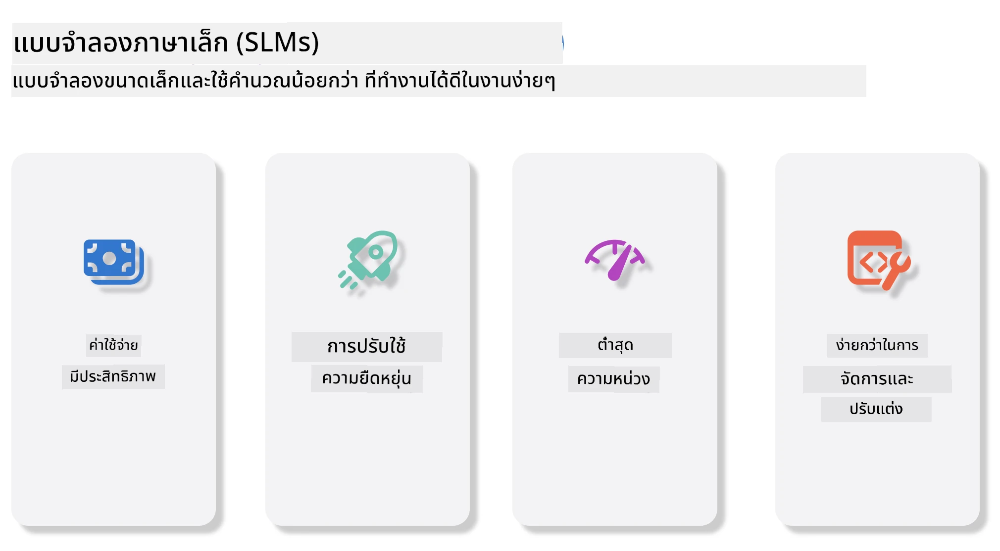
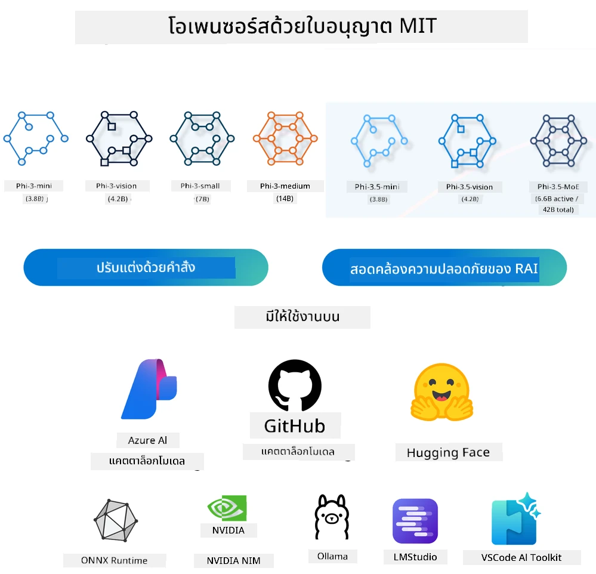
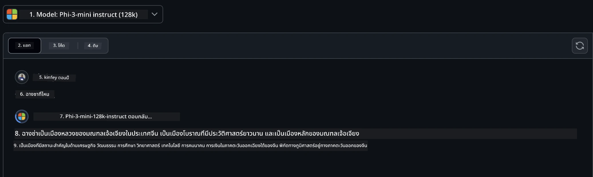
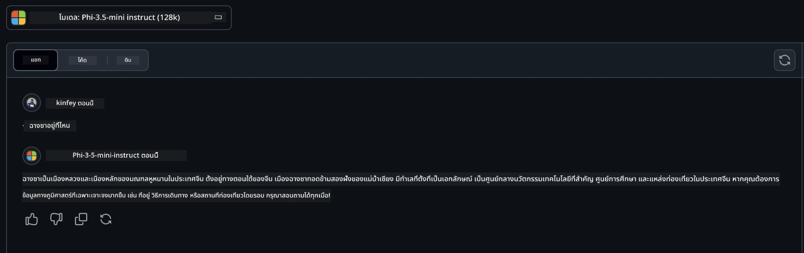

# แนะนำโมเดลภาษาเล็กสำหรับปัญญาประดิษฐ์เชิงสร้างสรรค์สำหรับผู้เริ่มต้น  
ปัญญาประดิษฐ์เชิงสร้างสรรค์เป็นสาขาที่น่าตื่นเต้นของปัญญาประดิษฐ์ที่มุ่งเน้นการสร้างระบบที่สามารถสร้างเนื้อหาใหม่ๆ ได้ เนื้อหานี้อาจมีตั้งแต่ข้อความและภาพ ไปจนถึงดนตรีและแม้แต่สภาพแวดล้อมเสมือนจริงทั้งปวง หนึ่งในแอปพลิเคชันที่น่าตื่นเต้นที่สุดของปัญญาประดิษฐ์เชิงสร้างสรรค์คือในด้านของโมเดลภาษา

## โมเดลภาษาเล็ก (Small Language Models) คืออะไร?  

โมเดลภาษาเล็ก (SLM) คือรุ่นลดขนาดของโมเดลภาษาใหญ่ (LLM) โดยใช้หลักการและเทคนิคทางสถาปัตยกรรมหลายอย่างของ LLM แต่มีขนาดการใช้ทรัพยากรคำนวณที่ลดลงอย่างมาก  

SLM เป็นกลุ่มย่อยของโมเดลภาษาที่ออกแบบมาเพื่อสร้างข้อความที่เหมือนมนุษย์ แตกต่างจากรุ่นใหญ่ เช่น GPT-4, SLM มีขนาดกะทัดรัดและมีประสิทธิภาพมากกว่า เหมาะสำหรับแอปพลิเคชันที่มีทรัพยากรคำนวณจำกัด แม้มีขนาดเล็ก แต่ยังสามารถทำงานหลากหลายได้ โดยปกติ SLM จะถูกสร้างขึ้นโดยการบีบอัดหรือสกัดจาก LLM เพื่อรักษาฟังก์ชันการทำงานและความสามารถทางภาษาไว้มากที่สุด การลดขนาดโมเดลนี้จะช่วยลดความซับซ้อนโดยรวม ทำให้ SLM มีประสิทธิภาพทั้งในแง่ของการใช้หน่วยความจำและความต้องการคำนวณ แม้จะมีการปรับแต่งให้มีประสิทธิภาพขึ้น แต่ SLM ก็ยังสามารถทำงานหลายประเภทของการประมวลผลภาษาธรรมชาติ (NLP) ได้ เช่น  

- การสร้างข้อความ: สร้างประโยคหรือย่อหน้าที่สอดคล้องและเหมาะสมกับบริบท  
- การเติมข้อความ: ทำนายและเติมประโยคตามคำกระตุ้นที่กำหนด  
- การแปลภาษา: แปลงข้อความจากภาษาหนึ่งเป็นอีกภาษา  
- การสรุป: ย่อเนื้อหาข้อความยาวเป็นสรุปที่สั้นลงและเข้าใจง่าย  

แม้จะมีข้อจำกัดในด้านประสิทธิภาพหรือความลึกของการเข้าใจเมื่อเทียบกับรุ่นใหญ่กว่า  

## โมเดลภาษาเล็กทำงานอย่างไร?  
SLM ถูกฝึกด้วยข้อมูลข้อความจำนวนมหาศาล ในระหว่างการฝึก โมเดลจะเรียนรู้รูปแบบและโครงสร้างของภาษา ทำให้สามารถสร้างข้อความที่ถูกต้องตามหลักไวยากรณ์และเหมาะสมกับบริบท กระบวนการฝึกประกอบด้วย:  

- การเก็บรวบรวมข้อมูล: รวบรวมชุดข้อมูลข้อความขนาดใหญ่จากแหล่งต่างๆ  
- การเตรียมข้อมูล: ทำความสะอาดและจัดระเบียบข้อมูลให้เหมาะสมกับการฝึก  
- การฝึกสอน: ใช้อัลกอริธึมเรียนรู้ของเครื่องสอนโมเดลให้เข้าใจและสร้างข้อความ  
- การปรับแต่ง: ปรับเปลี่ยนโมเดลเพื่อปรับปรุงประสิทธิภาพในการทำงานเฉพาะงาน  

การพัฒนา SLM สอดคล้องกับความต้องการเพิ่มขึ้นสำหรับโมเดลที่สามารถนำไปใช้งานในสภาพแวดล้อมที่มีทรัพยากรจำกัด เช่น อุปกรณ์มือถือหรือแพลตฟอร์ม edge computing ที่โมเดล LLM ขนาดเต็มอาจไม่เหมาะสมเนื่องจากต้องการทรัพยากรสูง โดยเน้นประสิทธิภาพ SLM จึงสร้างสมดุลระหว่างประสิทธิภาพและการเข้าถึง ช่วยให้ใช้งานได้ในหลายสาขาวิชา  

  

## วัตถุประสงค์การเรียนรู้  

ในบทเรียนนี้ เราหวังที่จะแนะนำความรู้เกี่ยวกับ SLM และผสานรวมกับ Microsoft Phi-3 เพื่อเรียนรู้สถานการณ์ต่างๆ ในเนื้อหาข้อความ, วิสัยทัศน์ และ MoE  

เมื่อจบบทเรียนนี้ คุณจะสามารถตอบคำถามต่อไปนี้ได้:  

- SLM คืออะไร?  
- ความแตกต่างระหว่าง SLM และ LLM คืออะไร?  
- Microsoft Phi-3/3.5 Family คืออะไร?  
- วิธีการเรียกใช้งาน Microsoft Phi-3/3.5 Family อย่างไร?  

พร้อมกันแล้วหรือยัง? เริ่มกันเลย  

## ความแตกต่างระหว่างโมเดลภาษาใหญ่ (LLMs) กับโมเดลภาษาเล็ก (SLMs)  

ทั้ง LLM และ SLM ถูกสร้างขึ้นบนพื้นฐานของหลักการเรียนรู้ด้วยความน่าจะเป็นในเครื่องจักร และใช้วิธีการที่คล้ายคลึงกันในด้านการออกแบบสถาปัตยกรรม, วิธีการฝึก, กระบวนการสร้างข้อมูล และเทคนิคการประเมินโมเดล อย่างไรก็ตาม มีปัจจัยสำคัญหลายประการที่แยกความแตกต่างโมเดลทั้งสองประเภทนี้  

## การใช้งานของโมเดลภาษาเล็ก  

SLM มีการประยุกต์ใช้หลากหลาย เช่น:  

- แชทบอท: ให้บริการลูกค้าและสนทนากับผู้ใช้ในลักษณะสนทนา  
- การสร้างเนื้อหา: ช่วยนักเขียนสร้างไอเดียหรือร่างบทความทั้งฉบับ  
- การศึกษา: ช่วยนักเรียนในงานเขียนหรือการเรียนรู้ภาษาใหม่  
- การเข้าถึง: สร้างเครื่องมือสำหรับบุคคลที่มีความบกพร่อง เช่น ระบบแปลงข้อความเป็นเสียง  

**ขนาด**  

ความแตกต่างหลักระหว่าง LLM และ SLM อยู่ที่ขนาดของโมเดล LLM เช่น ChatGPT (GPT-4) อาจมีพารามิเตอร์ประมาณ 1.76 ล้านล้านตัว ในขณะที่ SLM แบบโอเพ่นซอร์สอย่าง Mistral 7B มีพารามิเตอร์เพียงประมาณ 7 พันล้านเท่านั้น ความแตกต่างนี้เกิดจากสถาปัตยกรรมและวิธีการฝึก เช่น ChatGPT ใช้วิธี self-attention ภายในโครงสร้าง encoder-decoder ในขณะที่ Mistral 7B ใช้ sliding window attention ซึ่งทำให้การฝึกในโมเดล decoder เพียงอย่างเดียวมีประสิทธิภาพมากขึ้น ความแตกต่างด้านสถาปัตยกรรมนี้ส่งผลต่อความซับซ้อนและประสิทธิภาพของโมเดลอย่างมาก  

**ความเข้าใจ**  

SLM มักถูกปรับแต่งเพื่อให้ทำงานได้ดีในโดเมนเฉพาะ ทำให้มีความเชี่ยวชาญสูงแต่มีขีดจำกัดในความเข้าใจบริบทกว้างขวางในหลายสาขา ต่างจาก LLM ที่มุ่งเลียนแบบความฉลาดแบบมนุษย์ในระดับที่ครอบคลุม ฝึกด้วยชุดข้อมูลที่หลากหลายขนาดใหญ่ LLM ถูกออกแบบมาให้ทำงานได้ดีในหลายโดเมน มีความยืดหยุ่นและปรับตัวได้ดีกว่า ดังนั้น LLM จึงเหมาะสมสำหรับงาน downstream หลากหลาย เช่น การประมวลผลภาษาธรรมชาติและการเขียนโปรแกรม  

**การประมวลผล**  

การฝึกและใช้งาน LLM ต้องใช้ทรัพยากรอย่างมาก รวมถึงคลัสเตอร์ GPU ขนาดใหญ่ ตัวอย่างเช่น การฝึกโมเดลอย่าง ChatGPT ใหม่อาจต้องใช้ GPU หลายพันตัวในเวลานาน ขณะที่ SLM ด้วยจำนวนพารามิเตอร์ที่น้อยกว่าทำให้สามารถเข้าถึงได้ง่ายในแง่ทรัพยากรคำนวณ โมเดลอย่าง Mistral 7B สามารถฝึกและรันบนเครื่องในท้องถิ่นที่มี GPU ระดับกลางได้ แม้การฝึกยังต้องใช้เวลาหลายชั่วโมงกับ GPU หลายตัว  

**อคติ**  

อคติเป็นปัญหาที่รู้จักกันใน LLM ส่วนใหญ่เกิดจากลักษณะของข้อมูลฝึกซึ่งมักมาจากข้อมูลดิบที่เปิดเผยในอินเทอร์เน็ต ซึ่งอาจมีการแสดงหรือไม่แสดงตัวแทนของกลุ่มบางกลุ่มอย่างไม่เหมาะสม มีการติดป้ายที่ผิดพลาด หรือสะท้อนอคติทางภาษา เช่น สำเนียง ภูมิศาสตร์ และกฎทางไวยากรณ์ นอกจากนี้ สถาปัตยกรรมที่ซับซ้อนของ LLM อาจทำให้อคติเพิ่มขึ้นโดยไม่สังเกตเห็นหากไม่มีการปรับแต่งอย่างระมัดระวัง ขณะที่ SLM ที่ฝึกด้วยชุดข้อมูลที่มีขอบเขตและจำเพาะด้านโดเมนมักจะได้รับผลกระทบน้อยกว่า แม้จะไม่ได้ปลอดภัยจากอคติอย่างสมบูรณ์  

**การอนุมาน**  

ขนาดที่เล็กของ SLM ทำให้ได้เปรียบอย่างมากในแง่ความเร็วการอนุมาน ช่วยให้สร้างผลลัพธ์ได้อย่างรวดเร็วบนฮาร์ดแวร์ในเครื่องโดยไม่ต้องใช้การประมวลผลขนานอย่างกว้างขวาง ขณะที่ LLM ด้วยขนาดและความซับซ้อนมักต้องการทรัพยากรคำนวณขนานขนาดใหญ่เพื่อให้ได้เวลาตอบสนองที่ยอมรับได้ นอกจากนี้เมื่อมีผู้ใช้หลายรายพร้อมกันยังส่งผลให้เวลาในการตอบช้าลงโดยเฉพาะเมื่อใช้งานในระดับใหญ่  

สรุปแล้ว แม้ LLM และ SLM จะมีพื้นฐานร่วมในด้านการเรียนรู้ของเครื่อง แต่ต่างกันอย่างมากในขนาดโมเดล, ความต้องการทรัพยากร, ความเข้าใจบริบท, ความไวต่ออคติ และความเร็วในการอนุมาน ความแตกต่างเหล่านี้สะท้อนความเหมาะสมต่อกรณีการใช้งานที่แตกต่างกัน โดย LLM มีความยืดหยุ่นมากขึ้นแต่ต้องใช้ทรัพยากรมาก ในขณะที่ SLM ให้ประสิทธิภาพเฉพาะโดเมนโดยใช้ทรัพยากรน้อยกว่า  

***หมายเหตุ: ในบทเรียนนี้เราจะนำเสนอ SLM โดยใช้ Microsoft Phi-3 / 3.5 เป็นตัวอย่าง***  

## แนะนำ Phi-3 / Phi-3.5 Family  

Phi-3 / 3.5 Family มุ่งเป้าไปที่การประยุกต์ใช้ด้านข้อความ, วิสัยทัศน์, และเอเจนต์ (MoE):  

### Phi-3 / 3.5 Instruct  

เน้นที่การสร้างข้อความ การเติมข้อความสนทนา และการสกัดข้อมูลเนื้อหา เป็นต้น  

**Phi-3-mini**  

โมเดลภาษาขนาด 3.8B สามารถใช้งานได้บน Microsoft Azure AI Studio, Hugging Face, และ Ollama โมเดล Phi-3 มีประสิทธิภาพเหนือกว่าโมเดลภาษาที่มีขนาดเท่าหรือใหญ่กว่าในหลายตัวชี้วัดหลัก (ดูตัวเลข benchmark ด้านล่าง ตัวเลขสูงกว่าจะดีกว่า) Phi-3-mini ประสิทธิภาพดีกว่าโมเดลที่มีขนาดสองเท่า ขณะที่ Phi-3-small และ Phi-3-medium ดีกว่าโมเดลที่ใหญ่กว่า เช่น GPT-3.5  

**Phi-3-small & medium**  

ด้วยพารามิเตอร์เพียง 7B, Phi-3-small ชนะ GPT-3.5T ในหลากหลายการทดสอบภาษา, การให้เหตุผล, การเขียนโค้ด และคณิตศาสตร์  

Phi-3-medium ด้วยพารามิเตอร์ 14B ยังรักษาแนวโน้มนี้และมีประสิทธิภาพเหนือกว่า Gemini 1.0 Pro  

**Phi-3.5-mini**  

สามารถมองว่าเป็นเวอร์ชันอัปเกรดของ Phi-3-mini โดยพารามิเตอร์ยังคงเท่าเดิม แต่เพิ่มความสามารถรองรับหลายภาษา (รองรับมากกว่า 20 ภาษา: อาหรับ, จีน, เช็ก, เดนมาร์ก, ดัตช์, อังกฤษ, ฟินแลนด์, ฝรั่งเศส, เยอรมัน, ฮีบรู, ฮังการี, อิตาลี, ญี่ปุ่น, เกาหลี, นอร์เวย์, โปแลนด์, โปรตุเกส, รัสเซีย, สเปน, สวีเดน, ไทย, เติร์ก, ยูเครน) และเสริมความสามารถรองรับบริบทยาวขึ้น  

Phi-3.5-mini ด้วยพารามิเตอร์ 3.8B ประสิทธิภาพดีกว่าโมเดลภาษาขนาดเดียวกันและเทียบเท่ากับโมเดลที่มีขนาดสองเท่า  

### Phi-3 / 3.5 Vision  

สามารถเปรียบเทียบโมเดล Instruct ของ Phi-3/3.5 เป็นความสามารถในการเข้าใจของ Phi ส่วน Vision คือสิ่งที่ทำให้ Phi มี “ตา” ในการเข้าใจโลก  

**Phi-3-Vision**  

Phi-3-vision ด้วยพารามิเตอร์เพียง 4.2B ยังรักษาแนวโน้มนี้และมีประสิทธิภาพเหนือกว่าโมเดลขนาดใหญ่ เช่น Claude-3 Haiku และ Gemini 1.0 Pro V ในงานให้เหตุผลเชิงภาพทั่วไป, OCR, และงานทำความเข้าใจตารางและแผนภูมิ  

**Phi-3.5-Vision**  

Phi-3.5-Vision เป็นเวอร์ชันอัปเกรดของ Phi-3-Vision เพิ่มการรองรับภาพหลายภาพ สามารถมองว่าเป็นการพัฒนาด้านวิสัยทัศน์ ไม่เพียงแค่ดูภาพนิ่ง แต่ดูวิดีโอได้ด้วย  

Phi-3.5-vision ประสิทธิภาพเหนือกว่าโมเดลขนาดใหญ่ เช่น Claude-3.5 Sonnet และ Gemini 1.5 Flash ในงาน OCR, การทำความเข้าใจตารางและแผนภูมิ และมีประสิทธิภาพเทียบเท่าในงานให้เหตุผลจากความรู้เชิงภาพทั่วไป รองรับข้อมูลหลายเฟรม คือการให้เหตุผลจากหลายภาพอินพุต  

### Phi-3.5-MoE  

***Mixture of Experts (MoE)*** ช่วยให้โมเดลถูกฝึกได้ด้วยทรัพยากรคำนวณที่น้อยลงอย่างมาก ซึ่งหมายความว่าสามารถขยายขนาดโมเดลหรือชุดข้อมูลฝึกได้อย่างมากโดยใช้งบประมาณคำนวณเท่ากันกับโมเดลแบบหนาแน่น (dense) โดยเฉพาะอย่างยิ่ง โมเดล MoE ควรให้คุณภาพเทียบเท่ากับโมเดลแบบหนาแน่นในเวลาการฝึกที่เร็วกว่ามาก  

Phi-3.5-MoE ประกอบด้วยโมดูลผู้เชี่ยวชาญจำนวน 16x3.8B โมเดล Phi-3.5-MoE ที่มีเพียง 6.6B พารามิเตอร์ที่ทำงานพร้อมกันบรรลุระดับความสามารถในเหตุผล, ความเข้าใจภาษา, และคณิตศาสตร์ใกล้เคียงกับโมเดลที่ใหญ่กว่ามาก  

เราสามารถใช้โมเดล Phi-3/3.5 Family บนสถานการณ์ต่างๆ แตกต่างจาก LLM ที่สามารถนำ Phi-3/3.5-mini หรือ Phi-3/3.5-Vision ไปใช้งานบนอุปกรณ์ edge ได้  

## วิธีใช้โมเดล Phi-3/3.5 Family  

เราหวังที่จะใช้ Phi-3/3.5 ในสถานการณ์ต่างๆ ต่อไปนี้เราจะใช้ Phi-3/3.5 ตามสถานการณ์ที่แตกต่างกัน  

  

### การอนุมานผ่าน Cloud APIs  

**GitHub Models**  

GitHub Models เป็นวิธีที่ตรงที่สุด คุณสามารถเข้าถึงโมเดล Phi-3/3.5-Instruct ได้อย่างรวดเร็วผ่าน GitHub Models รวมกับ Azure AI Inference SDK / OpenAI SDK คุณสามารถเรียกใช้งาน API ผ่านโค้ดเพื่อทำการเรียก Phi-3/3.5-Instruct หรือทดสอบผลลัพธ์ต่างๆ ผ่าน Playground  

- ตัวอย่าง: เปรียบเทียบผลของ Phi-3-mini และ Phi-3.5-mini ในสถานการณ์ภาษาจีน  

  

  

**Azure AI Studio**  

หรือถ้าคุณต้องการใช้โมเดล vision และ MoE คุณสามารถใช้ Azure AI Studio เพื่อทำการเรียกใช้งานได้ หากสนใจ สามารถอ่าน Phi-3 Cookbook เพื่อเรียนรู้วิธีการเรียก Phi-3/3.5 Instruct, Vision, MoE ผ่าน Azure AI Studio [คลิกที่นี่](https://github.com/microsoft/Phi-3CookBook/blob/main/md/02.QuickStart/AzureAIStudio_QuickStart.md?WT.mc_id=academic-105485-koreyst)  

**NVIDIA NIM**  

นอกจากโซลูชัน Model Catalog บนคลาวด์ที่ Azure และ GitHub ให้บริการแล้ว คุณยังสามารถใช้ [NVIDIA NIM](https://developer.nvidia.com/nim?WT.mc_id=academic-105485-koreyst) เพื่อเรียกใช้งานที่เกี่ยวข้องได้ คุณสามารถเข้าเยี่ยมชม NVIDIA NIM เพื่อทำการเรียก API ของ Phi-3/3.5 Family ได้ NVIDIA NIM (NVIDIA Inference Microservices) คือชุดบริการไมโครเซอร์วิสสำหรับการเร่งความเร็วในการอนุมาน ซึ่งช่วยให้นักพัฒนาสามารถนำโมเดล AI ไปใช้งานได้อย่างมีประสิทธิภาพในหลากหลายสภาพแวดล้อม รวมถึงคลาวด์, ศูนย์ข้อมูล, และเวิร์กสเตชัน  

นี่คือฟีเจอร์หลักบางประการของ NVIDIA NIM:
- **ความง่ายในการปรับใช้:** NIM ช่วยให้สามารถปรับใช้โมเดล AI ได้ด้วยคำสั่งเดียว ทำให้ง่ายต่อการรวมเข้ากับเวิร์กโฟลว์ที่มีอยู่
- **ประสิทธิภาพที่ได้รับการปรับแต่ง:** ใช้ประโยชน์จากเครื่องมือสำหรับทำ inference ที่ผ่านการปรับแต่งล่วงหน้าของ NVIDIA เช่น TensorRT และ TensorRT-LLM เพื่อให้ได้ความหน่วงต่ำและประสิทธิภาพสูง
- **ความสามารถในการปรับขนาด:** NIM รองรับการปรับขนาดอัตโนมัติบน Kubernetes ทำให้สามารถจัดการกับงานที่มีปริมาณแตกต่างกันได้อย่างมีประสิทธิภาพ
- **ความปลอดภัยและการควบคุม:** องค์กรสามารถควบคุมข้อมูลและแอปพลิเคชันของตนเองได้โดยการโฮสต์บริการไมโครเซอร์วิส NIM บนโครงสร้างพื้นฐานที่บริหารจัดการเอง
- **API มาตรฐาน:** NIM ให้ API ที่เป็นมาตรฐานในอุตสาหกรรม ทำให้ง่ายต่อการสร้างและรวมแอปพลิเคชัน AI เช่น แชทบอท ผู้ช่วย AI และอื่นๆ

NIM เป็นส่วนหนึ่งของ NVIDIA AI Enterprise ซึ่งมีเป้าหมายเพื่อทำให้การปรับใช้และดำเนินงานของโมเดล AI เป็นเรื่องง่ายขึ้น เพื่อให้ทำงานได้อย่างมีประสิทธิภาพบน NVIDIA GPU

- ตัวอย่างสาธิต: การใช้ NVIDIA NIM เพื่อเรียก Phi-3.5-Vision-API  [[คลิกที่ลิงก์นี้](./python/Phi-3-Vision-Nividia-NIM.ipynb?WT.mc_id=academic-105485-koreyst)]


### การรัน Phi-3/3.5 ในเครื่อง
การ inference ในบริบทของ Phi-3 หรือโมเดลภาษาใด ๆ เช่น GPT-3 หมายถึงกระบวนการสร้างคำตอบหรือการทำนายจากข้อมูลอินพุตที่ได้รับ เมื่อคุณให้พรอมต์หรือคำถามแก่ Phi-3 มันจะใช้โครงข่ายประสาทเทียมที่ได้รับการฝึกฝนเพื่ออนุมานคำตอบที่เป็นไปได้และเกี่ยวข้องมากที่สุดโดยวิเคราะห์รูปแบบและความสัมพันธ์ในข้อมูลที่ได้รับการฝึกฝนมา

**Hugging Face Transformer**  
Hugging Face Transformers เป็นไลบรารีที่ทรงพลังสำหรับงานประมวลผลภาษาธรรมชาติ (NLP) และงานแมชชีนเลิร์นนิงอื่นๆ นี่คือจุดสำคัญบางประการเกี่ยวกับไลบรารีนี้:

1. **โมเดลพร้อมใช้งาน:** มีโมเดลที่ผ่านการฝึกฝนแล้วจำนวนมากสำหรับงานต่าง ๆ เช่น การจำแนกข้อความ การจดจำชื่อเฉพาะ การตอบคำถาม การสรุปข้อความ การแปลภาษา และการสร้างข้อความ

2. **ความเข้ากันได้กับหลายเฟรมเวิร์ก:** รองรับหลายเฟรมเวิร์กการเรียนรู้เชิงลึก เช่น PyTorch, TensorFlow, และ JAX ช่วยให้สามารถฝึกในเฟรมเวิร์กหนึ่งแล้วใช้งานในอีกเฟรมเวิร์กหนึ่งได้

3. **ความสามารถทางมัลติโมดัล:** นอกจาก NLP แล้วยังรองรับงานคอมพิวเตอร์วิชัน (เช่น การจำแนกรูปภาพ การตรวจจับวัตถุ) และการประมวลผลเสียง (เช่น การรู้จำเสียง พวกจำแนกเสียง)

4. **ใช้งานง่าย:** มี API และเครื่องมือช่วยดาวน์โหลดและปรับแต่งโมเดลได้ง่าย เหมาะสำหรับทั้งผู้เริ่มต้นและผู้เชี่ยวชาญ

5. **ชุมชนและแหล่งข้อมูล:** Hugging Face มีชุมชนที่คึกคักและเอกสารชุดใหญ่ บทเรียน และคำแนะนำให้ผู้ใช้เริ่มใช้งานและใช้เครื่องมือได้อย่างเต็มที่  
[เอกสารอย่างเป็นทางการ](https://huggingface.co/docs/transformers/index?WT.mc_id=academic-105485-koreyst) หรือ [ที่เก็บ GitHub](https://github.com/huggingface/transformers?WT.mc_id=academic-105485-koreyst)

วิธีนี้เป็นวิธีที่ใช้กันมากที่สุด แต่ต้องการการเร่งด้วย GPU เนื่องจากสถานการณ์เช่น Vision และ MoE ต้องการการคำนวณจำนวนมาก ซึ่งจะช้ามากบน CPU หากไม่ได้ถูกทำให้มีขนาดเล็กลง (quantized)


- ตัวอย่างสาธิต: การใช้ Transformer เพื่อเรียก Phi-3.5-Instruct [คลิกที่ลิงก์นี้](./python/phi35-instruct-demo.ipynb?WT.mc_id=academic-105485-koreyst)

- ตัวอย่างสาธิต: การใช้ Transformer เพื่อเรียก Phi-3.5-Vision [คลิกที่ลิงก์นี้](./python/phi35-vision-demo.ipynb?WT.mc_id=academic-105485-koreyst)

- ตัวอย่างสาธิต: การใช้ Transformer เพื่อเรียก Phi-3.5-MoE [คลิกที่ลิงก์นี้](./python/phi35_moe_demo.ipynb?WT.mc_id=academic-105485-koreyst)

**Ollama**  
[Ollama](https://ollama.com/?WT.mc_id=academic-105485-koreyst) เป็นแพลตฟอร์มที่ออกแบบมาเพื่อให้ง่ายต่อการรันโมเดลภาษาขนาดใหญ่ (LLMs) ในเครื่องของคุณเอง รองรับโมเดลหลากหลาย เช่น Llama 3.1, Phi 3, Mistral และ Gemma 2 เป็นต้น แพลตฟอร์มนี้ช่วยให้การทำงานง่ายขึ้นโดยการรวมเวทมนต์โมเดล การตั้งค่า และข้อมูลเป็นชุดเดียว ทำให้ง่ายต่อการปรับแต่งและสร้างโมเดลของตนเอง Ollama มีให้สำหรับ macOS, Linux และ Windows เป็นเครื่องมือที่ดีถ้าคุณต้องการทดลองหรือปรับใช้ LLMs โดยไม่ต้องพึ่งพาบริการคลาวด์ Ollama เป็นวิธีที่ตรงที่สุด คุณเพียงแค่ต้องรันคำสั่งนี้


```bash

ollama run phi3.5

```


**ONNX Runtime สำหรับ GenAI**

[ONNX Runtime](https://github.com/microsoft/onnxruntime-genai?WT.mc_id=academic-105485-koreyst) เป็นเครื่องมือเร่งความเร็วสำหรับ inference และการฝึกอบรมโมเดลแมชชีนเลิร์นนิงแบบข้ามแพลตฟอร์ม ONNX Runtime สำหรับ Generative AI (GENAI) เป็นเครื่องมือทรงพลังที่ช่วยให้คุณรันโมเดล generative AI ได้อย่างมีประสิทธิภาพในหลากหลายแพลตฟอร์ม

## ONNX Runtime คืออะไร?  
ONNX Runtime เป็นโครงการโอเพนซอร์สที่รองรับการ inference โมเดลแมชชีนเลิร์นนิงประสิทธิภาพสูง รองรับโมเดลในรูปแบบ Open Neural Network Exchange (ONNX) ซึ่งเป็นมาตรฐานของการแทนโมเดลแมชชีนเลิร์นนิง ONNX Runtime ช่วยให้ประสบการณ์ลูกค้าเร็วขึ้นและลดต้นทุน โดยรองรับโมเดลจากเฟรมเวิร์กเรียนรู้เชิงลึก เช่น PyTorch และ TensorFlow/Keras รวมถึงไลบรารีแมชชีนเลิร์นนิงแบบคลาสสิก เช่น scikit-learn, LightGBM, XGBoost เป็นต้น ONNX Runtime สามารถใช้งานได้กับฮาร์ดแวร์ ไดรเวอร์ และระบบปฏิบัติการต่าง ๆ และให้ประสิทธิภาพสูงสุดโดยใช้ฮาร์ดแวร์เร่งความเร็วควบคู่ไปกับการปรับแต่งกราฟและการแปลงต่างๆ

## Generative AI คืออะไร?  
Generative AI หมายถึงระบบ AI ที่สามารถสร้างเนื้อหาใหม่ เช่น ข้อความ รูปภาพ หรือดนตรี โดยอิงจากข้อมูลที่โมเดลได้ถูกฝึก สัตว์อย่างเช่น โมเดลภาษา GPT-3 และโมเดลสร้างภาพ Stable Diffusion ไลบรารี ONNX Runtime สำหรับ GenAI ให้วงจร generative AI สำหรับโมเดล ONNX รวมทั้งการ inference ด้วย ONNX Runtime การประมวลผล logits การค้นหาและสุ่มตัวอย่าง และการจัดการแคช KV

## ONNX Runtime สำหรับ GENAI  
ONNX Runtime สำหรับ GENAI ขยายความสามารถของ ONNX Runtime เพื่อรองรับโมเดล generative AI มีฟีเจอร์สำคัญดังนี้:

- **รองรับแพลตฟอร์มหลากหลาย:** ใช้งานได้บนแพลตฟอร์มต่าง ๆ รวมถึง Windows, Linux, macOS, Android, และ iOS  
- **รองรับโมเดล:** รองรับโมเดล generative AI ยอดนิยม เช่น LLaMA, GPT-Neo, BLOOM และอื่นๆ  
- **การปรับแต่งประสิทธิภาพ:** มีการปรับแต่งสำหรับฮาร์ดแวร์เร่งความเร็วแตกต่างกัน เช่น NVIDIA GPUs, AMD GPUs และอื่น ๆ  
- **ใช้งานง่าย:** ให้ API สำหรับการรวมเข้ากับแอปพลิเคชันอย่างง่ายดาย เพื่อสร้างข้อความ รูปภาพ และเนื้อหาอื่น ๆ ด้วยโค้ดน้อย  
- ผู้ใช้สามารถเรียกใช้เมธอด generate() ในระดับสูง หรือรันแต่ละรอบของโมเดลในลูป เพื่อสร้างโทเค็นทีละตัว และอัปเดตพารามิเตอร์ขณะรันลูป  
- ONNX Runtime รองรับการค้นหา greedy/beam และการสุ่ม TopP, TopK เพื่อสร้างลำดับโทเค็น รวมถึงมีการประมวลผล logits ในตัวเช่น การลงโทษการซ้ำซ้อน สามารถเพิ่มการประเมินผลแบบกำหนดเองได้อย่างง่ายดาย

## เริ่มต้นใช้งาน  
คุณสามารถเริ่มต้นใช้งาน ONNX Runtime สำหรับ GENAI ได้ด้วยขั้นตอนเหล่านี้:

### ติดตั้ง ONNX Runtime:  
```Python
pip install onnxruntime
```
  
### ติดตั้งส่วนเสริม Generative AI:  
```Python
pip install onnxruntime-genai
```
  
### รันโมเดล: ตัวอย่างง่าย ๆ ใน Python:  
```Python
import onnxruntime_genai as og

model = og.Model('path_to_your_model.onnx')

tokenizer = og.Tokenizer(model)

input_text = "Hello, how are you?"

input_tokens = tokenizer.encode(input_text)

output_tokens = model.generate(input_tokens)

output_text = tokenizer.decode(output_tokens)

print(output_text) 
```
  
### ตัวอย่างสาธิต: การใช้ ONNX Runtime GenAI เพื่อเรียก Phi-3.5-Vision


```python

import onnxruntime_genai as og

model_path = './Your Phi-3.5-vision-instruct ONNX Path'

img_path = './Your Image Path'

model = og.Model(model_path)

processor = model.create_multimodal_processor()

tokenizer_stream = processor.create_stream()

text = "Your Prompt"

prompt = "<|user|>\n"

prompt += "<|image_1|>\n"

prompt += f"{text}<|end|>\n"

prompt += "<|assistant|>\n"

image = og.Images.open(img_path)

inputs = processor(prompt, images=image)

params = og.GeneratorParams(model)

params.set_inputs(inputs)

params.set_search_options(max_length=3072)

generator = og.Generator(model, params)

while not generator.is_done():

    generator.compute_logits()
    
    generator.generate_next_token()

    new_token = generator.get_next_tokens()[0]
    
    output = tokenizer_stream.decode(new_token)
    
    print(tokenizer_stream.decode(new_token), end='', flush=True)

```


**อื่น ๆ**

นอกจากวิธีการอ้างอิง ONNX Runtime และ Ollama แล้ว เรายังสามารถทำการอ้างอิงสำหรับโมเดลเชิงปริมาณตามวิธีอ้างอิงโมเดลจากผู้ผลิตต่างๆ เช่น เฟรมเวิร์ก Apple MLX กับ Apple Metal, Qualcomm QNN กับ NPU, Intel OpenVINO กับ CPU/GPU เป็นต้น คุณยังสามารถรับเนื้อหาเพิ่มเติมได้จาก [Phi-3 Cookbook](https://github.com/microsoft/phi-3cookbook?WT.mc_id=academic-105485-koreyst)


## เพิ่มเติม

เราได้เรียนรู้พื้นฐานของ Phi-3/3.5 Family แล้ว แต่หากต้องการเรียนรู้เพิ่มเติมเกี่ยวกับ SLM จำเป็นต้องมีความรู้มากขึ้น คุณสามารถหาคำตอบได้ใน Phi-3 Cookbook หากต้องการเรียนรู้เพิ่มเติม กรุณาเยี่ยมชม [Phi-3 Cookbook](https://github.com/microsoft/phi-3cookbook?WT.mc_id=academic-105485-koreyst)

---

<!-- CO-OP TRANSLATOR DISCLAIMER START -->
**ข้อจำกัดความรับผิดชอบ**:
เอกสารนี้ได้รับการแปลโดยใช้บริการแปลภาษาอัตโนมัติ [Co-op Translator](https://github.com/Azure/co-op-translator) แม้เราจะพยายามให้ความถูกต้องสูงสุด แต่โปรดทราบว่าการแปลอัตโนมัติอาจมีข้อผิดพลาดหรือความไม่ถูกต้องได้ เอกสารต้นฉบับในภาษาต้นฉบับควรถือเป็นแหล่งข้อมูลที่เป็นทางการ สำหรับข้อมูลสำคัญแนะนำให้ใช้การแปลโดยผู้เชี่ยวชาญมนุษย์เท่านั้น เราจะไม่รับผิดชอบต่อความเข้าใจผิดหรือการตีความผิดที่เกิดจากการใช้การแปลนี้
<!-- CO-OP TRANSLATOR DISCLAIMER END -->